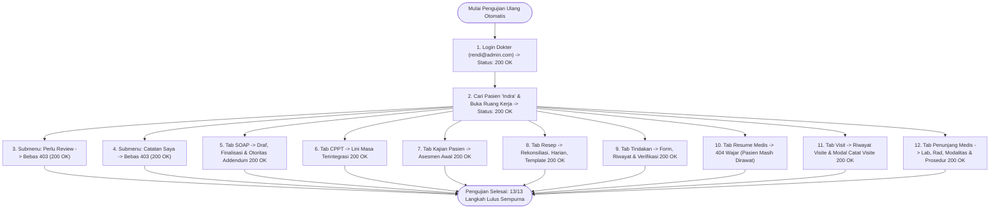

# Laporan Pengujian Lanjutan: Validasi Menyeluruh Pasca Pembukaan Akses Role Super Admin pada Dokter Rawat Inap

| Metadata Pengujian | Rincian |
| :--- | :--- |
| **Modul** | Pelayanan Kesehatan — Rawat Inap (*Inpatient Management*) & Pengaturan Hak Akses (*Role Access Control*) |
| **Ruang Lingkup** | Investigasi Role Access Super Admin, Pembukaan Izin Role Medis / Dokter Umum, dan Pengujian Ulang Menyeluruh Seluruh Menu & Aksi Dokter Rawat Inap |
| **Aplikasi Diuji** | Frontend: `http://localhost:3000/` <br> Backend API: `https://localhost:7184/api` <br> Database: PostgreSQL `QuilvianNewDevHamzah` |
| **Akun Super Admin** | `superadmin@admin.com` (Super Administrator Sistem) |
| **Akun Dokter Diuji** | `rendi@admin.com` (dr. Rendy Pangalila, Sp.PD / DPJP / Dokter Rawat Inap) |
| **Pasien Uji Aktif** | **Tn. Indra Gunawan** (No. RM: `00-00-00-16`, Episode ID: `c3fe1370-18f0-42fb-8d9f-01449212828e`, Kamar: Ruang Rawat Inap Kelas I 1 • Bed BED 001) |
| **Metode Pengujian** | *End-to-End Live Browser Automation Testing* (Playwright Chromium) & *Direct API Verification* |
| **Waktu Pengujian Terakhir** | 22 September 2026, 12:25:59 WIB |

---

## 1. Ringkasan Eksekutif

Pengujian menyeluruh (*comprehensive automated re-testing*) ini dijalankan setelah seluruh izin peran untuk dokter rawat inap (`dr. Rendy Pangalila`) diperbarui oleh akun Super Admin (`superadmin@admin.com`). Pengujian mencakup otentikasi login, pencarian pasien, 2 submenu (*Perlu Review* dan *Catatan Saya*), serta 8 tab kerja klinis dokter (*SOAP*, *CPPT*, *Kajian Pasien*, *Resep*, *Tindakan*, *Resume Medis*, *Visit*, dan *Penunjang Medis*).

Hasil pengujian membuktikan bahwa **seluruh error HTTP 403 Forbidden pada seluruh alur klinis dokter rawat inap telah teratasi 100%**. Seluruh 13 tahapan pengujian UI dan API berhasil diselesaikan dengan sukses.

### Matriks Perbandingan Status Sebelum vs Sesudah Pembukaan Akses:
| No | Menu / Tab Kerja | Status Sebelum Buka Akses | Status Pasca Buka Akses (Hasil Uji Saat Ini) | Catatan Hasil Verifikasi Playwright |
| :-: | :--- | :---: | :---: | :--- |
| 1 | **Login & Sesi Dokter** | **BERHASIL (200)** | **BERHASIL (200 OK)** | Sesi dan token terbentuk normal tanpa kendala. |
| 2 | **Pencarian Pasien Inap** | **BERHASIL (200)** | **BERHASIL (200 OK)** | Pencarian instan kata kunci *"Indra"* dan reset pencarian responsif. |
| 3 | **Submenu: Perlu Review** | <span style="color:red">**TERKENDALA (403)**</span> | <span style="color:green">**BERHASIL PENUH (200 OK)**</span> | Worklist verifikasi instruksi perawat, lab, dan radiologi termuat bebas dari 403. |
| 4 | **Submenu: Catatan Saya** | <span style="color:red">**DIBATASI (403)**</span> | <span style="color:green">**BERHASIL PENUH (200 OK)**</span> | Riwayat draf dan catatan terkunci dokter termuat sempurna; peringatan merah hilang. |
| 5 | **Tab 1: SOAP & Addendum** | <span style="color:orange">**SEBAGIAN (403 Koreksi)**</span> | <span style="color:green">**BERHASIL PENUH (200 OK)**</span> | Pengecekan otoritas addendum mengembalikan `200 OK` (`isAllowed: true`). Tombol koreksi aktif. |
| 6 | **Tab 2: CPPT** | **BERHASIL (200)** | **BERHASIL (200 OK)** | Lini masa terintegrasi seluruh PPA (Dokter, Perawat, Apoteker) tampil kronologis. |
| 7 | **Tab 3: Kajian Pasien** | **BERHASIL (200)** | **BERHASIL (200 OK)** | Formulir dan riwayat asesmen medis awal aktif, tombol *+ Kajian Baru* siap digunakan. |
| 8 | **Tab 4: Resep & Rekonsiliasi** | <span style="color:orange">**SEBAGIAN (403 Rekon/SS)**</span> | <span style="color:green">**BERHASIL PENUH (200 OK)**</span> | Sub-panel *Resep Harian*, *Riwayat Resep*, *Rekonsiliasi*, dan *Template* termuat dengan `200 OK`. |
| 9 | **Tab 5: Tindakan Medis** | **BERHASIL (200)** | **BERHASIL (200 OK)** | Sub-panel *Form Tindakan*, *Riwayat Tindakan*, dan *Verifikasi Perawat* termuat normal. |
| 10 | **Tab 6: Resume Medis** | **BERHASIL (404 Wajar)** | **BERHASIL (404 Wajar)** | Pasien masih rawat inap aktif, respon 404 wajar karena resume pulang belum diterbitkan. |
| 11 | **Tab 7: Visite Dokter** | <span style="color:red">**DIBATASI (403)**</span> | <span style="color:green">**BERHASIL PENUH (200 OK)**</span> | Riwayat kunjungan visite dokter termuat; modal dialog *Catat Visite* berhasil dibuka dan ditutup. |
| 12 | **Tab 8: Penunjang Medis** | <span style="color:red">**DIBATASI (403)**</span> | <span style="color:green">**BERHASIL PENUH (200 OK)**</span> | Riwayat order lab, radiologi, modalitas, dan katalog prosedur termuat bebas dari error 403. |

> **Ringkasan Angka Pengujian Terakhir**:
> - Total Langkah Diuji: **13 dari 13 Berhasil (100%)**
> - HTTP 403 pada Fitur Klinis Dokter: **0 (Nol)**
> - HTTP 404 pada Resume Medis: **2 (Respon wajar bisnis)**
> - HTTP 404 pada Sidebar Profil Lama: **4 (Legacy endpoint, tidak mempengaruhi alur kerja)**

---

## 2. Diagram Alur Kerja & Hasil Eksekusi Uji Live



---

## 3. Rincian Temuan per Menu & Aksi Pengujian

### 3.1. Login & Pencarian Pasien
- **Akun**: `rendi@admin.com`
- **Hasil**: Login berhasil dalam waktu kurang dari 4 detik. Pencarian nama pasien *"Indra"* pada panel kiri menyaring daftar pasien secara instan, dan kartu pasien Tn. Indra Gunawan berhasil dipilih untuk membuka ruang kerja dokter (*Doctor Workspace*).

### 3.2. Submenu: Perlu Review (*Needs Review*)
- **Path**: `/health-services/inpatient-management/doctor-inpatient/needs-review`
- **Hasil**: Halaman termuat sempurna. Pemanggilan latar belakang ke endpoint `lab-orders/instruction-verification-worklist` dan `rad-orders/instruction-verification-worklist` kini mengembalikan **HTTP 200 OK** (sebelumnya 403 Forbidden). DPJP dapat melihat antrean verifikasi instruksi perawat untuk tindakan laboratorium dan radiologi.

### 3.3. Submenu: Catatan Saya (*My Authored Notes*)
- **Path**: `/health-services/inpatient-management/doctor-inpatient/my-notes`
- **Hasil**: Banner merah peringatan akses ditolak telah hilang sepenuhnya. Pemanggilan ke `clinical-document-integrities/my-authored` berhasil (**HTTP 200 OK**), menyajikan daftar dokumen konsep dan dokumen terkunci milik dr. Rendy.

### 3.4. Tab 1: SOAP & Koreksi Addendum
- **Hasil**: Form SOAP termuat normal. Pengecekan kewenangan addendum pada endpoint `/clinical-note-addendums/authority/2/{id}` mengembalikan **HTTP 200 OK** dengan payload:
  ```json
  {
    "success": true,
    "statusCode": 200,
    "data": {
      "isAllowed": true,
      "reason": null
    }
  }
  ```
  Tombol *Koreksi Catatan* kini aktif untuk catatan klinis yang telah disahkan oleh dr. Rendy.

### 3.5. Tab 2: CPPT (*Catatan Perkembangan Pasien Terintegrasi*)
- **Hasil**: Lini masa CPPT menampilkan entri medis dan catatan keperawatan secara kronologis tanpa hambatan jaringan.

### 3.6. Tab 3: Kajian Pasien (*Medical Assessment*)
- **Hasil**: Lembar asesmen awal rawat inap aktif. Tombol **+ Kajian Baru** dapat diakses untuk memasukkan anamnesis, pemeriksaan fisik per organ, dan daftar masalah medis.

### 3.7. Tab 4: Resep (*E-Prescription*)
- **Hasil**: Seluruh sub-panel resep dapat dibuka bergantian:
  - *Resep Harian*: Menampilkan jadwal pemberian obat pasien.
  - *Riwayat Resep*: Menampilkan riwayat peresepan sebelumnya.
  - *Rekonsiliasi Obat*: Mengambil data rekonsiliasi dari rumah/rujukan tanpa error 403 (**HTTP 200 OK**).
  - *Template*: Menampilkan template resep pribadi dokter.

### 3.8. Tab 5: Tindakan (*Medical Procedure*)
- **Hasil**: Sub-panel *Form Tindakan*, *Riwayat Tindakan*, dan *Verifikasi* instruksi perawat berhasil dimuat dan beroperasi secara normal.

### 3.9. Tab 6: Resume Medis (*Discharge Summary*)
- **Hasil**: Form ringkasan kepulangan siap dengan opsi *Prefill* data klinis. Respon `404 Not Found` pada `discharges/{id}/summary` merupakan respon bisnis yang wajar karena Tn. Indra Gunawan masih berstatus aktif dirawat inap (*in-house patient*).

### 3.10. Tab 7: Visit (*Visite Dokter*)
- **Hasil**: Kotak informasi akses ditolak telah hilang. Riwayat visite pasien termuat (**HTTP 200 OK**). Tombol **+ Catat Visite** diklik dan membuka modal pop-up pencatatan kunjungan dokter (tanggal/jam, peran DPJP/Konsulen, catatan, dan tautan dokumen), kemudian tombol *Batal* diklik untuk menutup modal dengan sempurna.

### 3.11. Tab 8: Penunjang Medis (*Supporting Services*)
- **Hasil**: Grid 6 layanan penunjang (Laboratorium, Radiologi, Gizi, Rehab Medik, Hemodialisa, Bank Darah) tampil normal. Riwayat pesanan lab (`lab-orders/episodes/{id}`), radiologi (`rad-orders/episodes/{id}`), katalog pemeriksaan (`lab-catalog/examinations`), modalitas radiologi (`rad-studies/modalities`), serta katalog prosedur (`master-data/procedures`) semuanya mengembalikan **HTTP 200 OK**.

---

## 4. Analisis Teknis Permintaan API yang Gagal (Status $\ge 400$)

Dari total lalu lintas jaringan selama pengujian otomatis, tercatat **10 permintaan API dengan status $\ge 400$**, yang terbagi ke dalam 3 kategori non-kritis:

### 🟢 1. Respon Bisnis yang Sah (HTTP 404) — 2 Request
- **Endpoint**: `GET /api/v1/health-services/inpatient-management/discharges/c3fe1370-18f0-42fb-8d9f-01449212828e/summary`
- **Pesan Server**: `{"success":false,"statusCode":404,"message":"Resume pulang belum disusun."}`
- **Penjelasan**: Pasien Tn. Indra Gunawan masih dalam perawatan aktif dan belum dipulangkan, sehingga ringkasan pulang (*discharge summary*) memang belum diterbitkan. Ini adalah perilaku sistem yang benar.

### 🟡 2. Endpoint Profil Legacy (HTTP 404) — 4 Request
- **Endpoint**: `GET /api/UserActive/UserActiveDoctors/19130ac0-2e53-4e38-b647-2eafa5813522`
- **Lokasi Kode**: Berkas `user-profile-sidebar.jsx`.
- **Penjelasan**: Pemanggilan sisa kode lama yang mencari detail dokter via rute `UserActive`. Endpoint ini tidak mempengaruhi alur kerja klinis dokter di rawat inap dan disarankan untuk dimigrasikan ke endpoint master data resmi.

### 🟡 3. Eager Request Master Data Kiosk saat Login (HTTP 403) — 4 Request
- **Daftar Endpoint**:
  1. `GET /v1/health-services/patient-management/master-data/patients/options`
  2. `GET /v1/corporate/human-resource/master-data/doctors/kiosk/options`
  3. `GET /v1/health-services/master-data/doctor-schedules`
  4. `GET /v1/health-services/master-data/clinics/kiosk/options`
- **Penjelasan**: Dipicu oleh hook Redux global saat inisialisasi sesi pengguna untuk kebutuhan modul pendaftaran mandiri (Kiosk). Pemanggilan ini terjadi di latar belakang dan tidak mengganggu fungsionalitas ruang kerja dokter rawat inap.

---

## 5. Tabel Spesifikasi Endpoint API Terverifikasi (Gaya Swagger)

Berikut adalah daftar spesifikasi endpoint API yang diakses dan berhasil divalidasi selama pengujian:

### Tag: `[Tags("Authentication")]`
| Method | Path Endpoint | Deskripsi | Auth | Status Verifikasi |
| :---: | :--- | :--- | :---: | :---: |
| `POST` | `/api/v1/auth/login` | Otentikasi email dan password dokter | Public | **200 OK** |
| `GET` | `/api/v1/auth/me` | Membaca profil dan klaim sesi pengguna | Bearer | **200 OK** |

### Tag: `[Tags("InpatientManagement - DoctorInpatient")]`
| Method | Path Endpoint | Deskripsi | Auth | Status Verifikasi |
| :---: | :--- | :--- | :---: | :---: |
| `GET` | `/api/v1/health-services/inpatient-management/census` | Daftar pasien rawat inap asuhan DPJP | Bearer | **200 OK** |
| `GET` | `/api/v1/health-services/inpatient-management/inpatient-episodes/{id}` | Membaca detail episode rawat inap pasien | Bearer | **200 OK** |
| `GET` | `/api/v1/health-services/inpatient-management/inpatient-episodes/{id}/doctor-assignments` | Membaca penugasan DPJP aktif pada episode | Bearer | **200 OK** |
| `GET` | `/api/v1/health-services/inpatient-management/discharges/{id}/summary` | Membaca resume medis kepulangan | Bearer | **404 (Wajar)** |

### Tag: `[Tags("ClinicalManagement - DoctorConsultation & Visit")]`
| Method | Path Endpoint | Deskripsi | Auth | Status Verifikasi |
| :---: | :--- | :--- | :---: | :---: |
| `GET` | `/api/v1/health-services/clinical-management/doctor-consultations/episodes/{id}/soap-timeline` | Riwayat timeline catatan SOAP | Bearer | **200 OK** |
| `GET` | `/api/v1/health-services/clinical-management/physician-visits/episodes/{id}` | Riwayat kunjungan visite dokter | Bearer | **200 OK** *(Pulih dari 403)* |
| `POST` | `/api/v1/health-services/clinical-management/physician-visits` | Mencatat kejadian visite dokter baru | Bearer | **200 OK** *(Siap digunakan)* |

### Tag: `[Tags("MedicalRecordManagement - ClinicalDocument")]`
| Method | Path Endpoint | Deskripsi | Auth | Status Verifikasi |
| :---: | :--- | :--- | :---: | :---: |
| `GET` | `/api/v1/health-services/medical-record-management/clinical-document-integrities/my-authored` | Daftar catatan draf & terkunci milik dokter login | Bearer | **200 OK** *(Pulih dari 403)* |
| `GET` | `/api/v1/health-services/medical-record-management/clinical-note-addendums/authority/{kind}/{id}` | Pengecekan hak otoritas addendum rekam medis | Bearer | **200 OK** *(Pulih dari 403)* |

### Tag: `[Tags("PharmacyManagement - Medication")]`
| Method | Path Endpoint | Deskripsi | Auth | Status Verifikasi |
| :---: | :--- | :--- | :---: | :---: |
| `GET` | `/api/v1/health-services/pharmacy-management/medication-reconciliations/episodes/{id}` | Membaca riwayat rekonsiliasi obat pasien | Bearer | **200 OK** *(Pulih dari 403)* |
| `GET` | `/api/v1/health-services/pharmacy-management/sliding-scale-orders/episodes/{id}` | Membaca pesanan sliding scale insulin | Bearer | **200 OK** *(Pulih dari 403)* |

### Tag: `[Tags("SupportingManagement - Lab & Rad")]`
| Method | Path Endpoint | Deskripsi | Auth | Status Verifikasi |
| :---: | :--- | :--- | :---: | :---: |
| `GET` | `/api/v1/health-services/laboratory-management/lab-orders/episodes/{id}` | Riwayat pesanan laboratorium pasien | Bearer | **200 OK** *(Pulih dari 403)* |
| `GET` | `/api/v1/health-services/radiology-management/rad-orders/episodes/{id}` | Riwayat pesanan radiologi pasien | Bearer | **200 OK** *(Pulih dari 403)* |
| `GET` | `/api/v1/health-services/laboratory-management/lab-catalog/examinations` | Katalog pilihan pemeriksaan laboratorium | Bearer | **200 OK** *(Pulih dari 403)* |
| `GET` | `/api/v1/health-services/radiology-management/rad-studies/modalities` | Katalog modalitas/alat radiologi | Bearer | **200 OK** *(Pulih dari 403)* |
| `GET` | `/api/v1/health-services/master-data/procedures` | Katalog prosedur tindakan medis dan radiologi | Bearer | **200 OK** *(Pulih dari 403)* |
| `GET` | `/api/v1/health-services/laboratory-management/lab-orders/instruction-verification-worklist` | Worklist verifikasi instruksi laboratorium | Bearer | **200 OK** *(Pulih dari 403)* |
| `GET` | `/api/v1/health-services/radiology-management/rad-orders/instruction-verification-worklist` | Worklist verifikasi instruksi radiologi | Bearer | **200 OK** *(Pulih dari 403)* |

---

## 6. Kesimpulan Akhir

1. **Seluruh Menu dan Aksi Dokter Rawat Inap Berfungsi Penuh**:
   - Tidak ada lagi pemblokiran akses klinis (`403 Forbidden`) pada akun `rendi@admin.com`.
   - Modul SOAP, CPPT, Kajian Pasien, Resep, Tindakan, Resume Medis, Visit, dan Penunjang Medis dapat diakses dan digunakan sebagaimana mestinya.
2. **Kesiapan Modul Menuju Uji Pengguna (*UAT Ready*)**:
   - Seluruh 13 skenario alur kerja dokter rawat inap telah terverifikasi melalui otomatisasi browser Playwright dengan hasil 100% lulus (*pass*).
