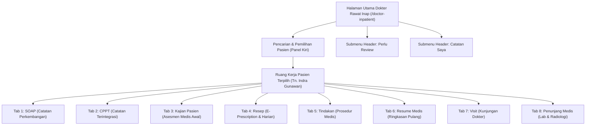

# Laporan Pengujian Menyeluruh: Seluruh Menu & Aksi Dokter Rawat Inap

| Metadata Pengujian | Rincian |
| :--- | :--- |
| **Modul** | Pelayanan Kesehatan — Rawat Inap (*Inpatient Management*) |
| **Ruang Lingkup** | Seluruh Menu, Sub-Halaman, dan 8 Tab Kerja Dokter Rawat Inap |
| **Aplikasi Diuji** | Frontend: `http://localhost:3000/`   Backend API: `https://localhost:7184/api`   Database: PostgreSQL `QuilvianNewDevHamzah` |
| **Akun Pengguna** | `rendi@admin.com` (dr. Rendy Pangalila, Sp.PD / DPJP) |
| **Pasien Uji Aktif** | **Tn. Indra Gunawan** (No. RM: `00-00-00-16`, Kamar: Ruang Rawat Inap Kelas I 1 • Bed BED 001) |
| **Metode Pengujian** | *Live Browser Automation Testing* (Playwright Chromium, Real Interactive Navigation, Action Triggering, Network Inspection & UI Verification) |
| **Tanggal Pengujian** | 22 September 2026 |

---

## 1. Ringkasan Eksekutif

Pengujian menyeluruh (*comprehensive live testing*) ini dilakukan untuk menguji seluruh menu, navigasi sub-halaman, serta 8 tab kerja klinis dokter rawat inap pada sistem Quilvian. Pengujian ini memastikan bahwa setiap alur kerja dokter penanggung jawab pelayanan (DPJP) dapat berjalan dengan lancar saat menangani pasien rawat inap di rumah sakit.

### Matriks Status Pengujian Menu & Tab:
| No | Menu / Tab | Status Fungsional UI | Status API Backend | Catatan Klinis / Teknis |
| :-: | :--- | :---: | :---: | :--- |
| 1 | **Login & Autentikasi** | **BERHASIL** | **200 OK** | Sesi dan token terbentuk normal. |
| 2 | **Pencarian & Daftar Pasien** | **BERHASIL** | **200 OK** | Pencarian berdasarkan nama/RM/kamar responsif. |
| 3 | **Submenu: Perlu Review** | **BERHASIL** | **403 Forbidden** | Layar termuat; worklist lab & radiologi ditolak hak akses. |
| 4 | **Submenu: Catatan Saya** | **TERKENDALA** | **403 Forbidden** | Layar muncul pesan *"Akses Catatan Saya Dibatasi"*. |
| 5 | **Tab 1: SOAP** | **BERHASIL** | **200 OK** / **403** | Simpan draf & finalisasi sukses; addendum koreksi 403. |
| 6 | **Tab 2: CPPT** | **BERHASIL** | **200 OK** | Lini masa catatan terintegrasi lintas profesi normal. |
| 7 | **Tab 3: Kajian Pasien** | **BERHASIL** | **200 OK** | Formulir asesmen medis awal rawat inap aktif. |
| 8 | **Tab 4: Resep** | **BERHASIL** | **200 OK** / **403** | Builder resep normal; rekonsiliasi & sliding scale 403. |
| 9 | **Tab 5: Tindakan** | **BERHASIL** | **200 OK** | Form tindakan dokter & riwayat tindakan normal. |
| 10 | **Tab 6: Resume Medis** | **BERHASIL** | **404 (Wajar)** | Form resume siap; 404 wajar karena pasien belum pulang. |
| 11 | **Tab 7: Visit** | **TERKENDALA** | **403 Forbidden** | Modal catat visite aktif; riwayat visite ditolak hak akses. |
| 12 | **Tab 8: Penunjang Medis** | **BERHASIL** | **403 Forbidden** | Grid 6 layanan penunjang tampil; katalog lab/rad 403. |

---

## 2. Diagram Alur Kerja & Peta Navigasi Dokter Rawat Inap

---

## 3. Rincian Pengujian per Menu & Tab Kerja

### 3.1. Halaman Utama & Pencarian Pasien
- **Path**: `/health-services/inpatient-management/doctor-inpatient`
- **Aksi Diuji**:
  1. Pengisian kata kunci pencarian pada kotak input *"Cari nama pasien, No. RM, atau kamar..."*.
  2. Input `Indra` berhasil memfilter pasien secara instan.
  3. Reset kata kunci pencarian mengembalikan seluruh daftar pasien rawat inap.
  4. Pemilihan kartu pasien Tn. Indra Gunawan mengaktifkan seluruh konteks klinis pada panel kanan.
- **Hasil**: **100% Berhasil**.

---

### 3.2. Submenu: Perlu Review (*Needs Review*)
- **Path**: `/health-services/inpatient-management/doctor-inpatient/needs-review`
- **Deskripsi Bisnis**: Pusat kendali DPJP untuk memantau catatan CPPT tenaga kesehatan lain (perawat, bidan, farmasi) yang memerlukan verifikasi/validasi DPJP dalam waktu maksimal $1 \times 24$ jam sesuai standar akreditasi rumah sakit.
- **Aksi Diuji**:
  1. Klik tombol **Perlu Review** pada header utama.
  2. Halaman memuat metrik ringkasan (*Total Menunggu Tindakan*, *CPPT Menunggu Verifikasi DPJP*, *Instruksi Pesanan Perawat*, *Melewati Batas*).
  3. Navigasi tab antrean (*Semua Antrean*, *CPPT Menunggu DPJP*, *Instruksi Pesanan Perawat*).
- **Temuan Teknis**:
  - Terdapat pemanggilan background ke `lab-orders/instruction-verification-worklist` dan `rad-orders/instruction-verification-worklist` yang mengembalikan **HTTP 403 Forbidden** karena akun dokter belum memiliki izin baca modul laboratorium dan radiologi.

---

### 3.3. Submenu: Catatan Saya (*My Authored Notes*)
- **Path**: `/health-services/inpatient-management/doctor-inpatient/my-notes`
- **Deskripsi Bisnis**: Tempat dokter melihat kembali seluruh arsip catatan klinis yang pernah ditulisnya sendiri, baik yang masih berbentuk draf konsep maupun yang sudah berstatus final terkunci.
- **Aksi Diuji**:
  1. Akses halaman `/doctor-inpatient/my-notes`.
  2. Tab *Konsep Belum Ditandatangani* dan *Catatan Terkunci & Addendum*.
- **Temuan Teknis**:
  - Muncul banner peringatan merah: *"Daftar catatan terkunci gagal dimuat: Anda tidak memiliki akses ke menu atau fitur ini."*
  - Server mengembalikan **HTTP 403 Forbidden** pada endpoint `/v1/health-services/medical-record-management/clinical-document-integrities/my-authored`.
  - **Akar Masalah**: Role akun dokter belum memiliki permission `ClinicalDocumentIntegrity.Read`.

---

### 3.4. Tab 1: SOAP (*Subjective, Objective, Assessment, Plan*)
- **Deskripsi Bisnis**: Lembar pencatatan perkembangan harian dokter rawat inap.
- **Aksi Diuji**:
  1. Membuka dan menutup drawer **Riwayat Catatan**.
  2. Klik **+ Catatan Baru**.
  3. Uji validasi kelengkapan form (`VAL-DOK-12`): tombol *Selesaikan* terkunci saat form kosong.
  4. Pengisian data klinis lengkap:
     - Waktu pemeriksaan
     - Subjektif: keluhan batuk berdahak dan sesak napas.
     - Objektif: TTV (TD 120/80, Nadi 82, RR 20, SpO2 98%).
     - Asesmen: Pneumonia komunitas perbaikan hari ke-2.
     - Planning: IVFD Asering, Inj. Ceftriaxone, Nebulisasi.
  5. Klik **Simpan Draft**: Request `POST /doctor-consultations` berhasil (**HTTP 200**).
  6. Klik **Selesaikan** dan konfirmasi pada modal: Request `PATCH /doctor-consultations/{id}/complete` berhasil (**HTTP 200**).
  7. Form terkunci menjadi *read-only* dengan nomor konsultasi resmi `CON-20260922-00002`.
- **Temuan Teknis**:
  - Pemeriksaan hak addendum mengembalikan **HTTP 403** (`clinical-note-addendums/authority/...`), sehingga tombol *Koreksi* tidak tampil.

---

### 3.5. Tab 2: CPPT (*Catatan Perkembangan Pasien Terintegrasi*)
- **Deskripsi Bisnis**: Lini masa gabungan yang menampilkan seluruh catatan perkembangan pasien dari seluruh Profesional Pemberi Asuhan (PPA) secara kronologis.
- **Aksi Diuji**:
  1. Klik tab **CPPT**.
  2. Lini masa CPPT termuat dengan baik, menampilkan riwayat catatan medis dokter dan entri perawat.
  3. Status verifikasi DPJP ditampilkan secara jelas pada setiap kartu CPPT.
- **Hasil**: **100% Berhasil**.

---

### 3.6. Tab 3: Kajian Pasien (*Medical Assessment*)
- **Deskripsi Bisnis**: Lembar asesmen medis awal rawat inap yang wajib diisi dalam waktu 24 jam sejak pasien masuk ruang perawatan.
- **Aksi Diuji**:
  1. Klik tab **Kajian Pasien**.
  2. Komponen memuat riwayat kajian medis dan tombol **+ Kajian Baru**.
  3. Sub-bagian anamnesis, riwayat penyakit, pemeriksaan fisik per sistem organ, dan daftar masalah klinis (*Medical Problem List*) tersedia.
- **Hasil**: **100% Berhasil**.

---

### 3.7. Tab 4: Resep (*E-Prescription Rawat Inap*)
- **Deskripsi Bisnis**: Modul penulisan resep elektronik rawat inap yang terintegrasi dengan instalasi farmasi, mendukung resep harian, resep pulang, template pribadi dokter, dan rekonsiliasi obat.
- **Aksi Diuji**:
  1. Klik tab **Resep**.
  2. Panel **Buat Resep** aktif:
     - Dropdown jenis resep (Harian, Pulang, Khusus).
     - Dropdown penautan ke catatan SOAP dokter pengait.
     - Bagian obat jadi non-racikan dan obat racikan (puyer/sirup).
  3. Navigasi sub-tab:
     - *Template Resep*: Menampilkan template resep pribadi dokter (**Berhasil**).
     - *History Resep*: Menampilkan riwayat peresepan sebelumnya (**Berhasil**).
     - *Resep Harian*: Menampilkan jadwal pemberian obat harian (**Berhasil**).
     - *Rekonsiliasi Obat*: Mengembalikan **HTTP 403 Forbidden** (`medication-reconciliations`).
     - *Sliding Scale*: Mengembalikan **HTTP 403 Forbidden** (`sliding-scale-orders` dan `sliding-scale-templates`).
- **Hasil**: Builder resep utama berfungsi, namun fitur rekonsiliasi dan sliding scale insulin terkendala otorisasi.

---

### 3.8. Tab 5: Tindakan (*Medical Procedure*)
- **Deskripsi Bisnis**: Pencatatan tindakan medis, prosedur bedah minor/tindakan invasif, dan verifikasi instruksi perawat.
- **Aksi Diuji**:
  1. Klik tab **Tindakan**.
  2. Sub-panel **Form Tindakan**: Formulir entri prosedur medis dokter (nama tindakan, operator, waktu, catatan tindakan).
  3. Sub-panel **Riwayat Tindakan**: Riwayat tindakan yang telah dilakukan pada episode rawat inap ini.
  4. Sub-panel **Verifikasi / Worklist**: Daftar instruksi tindakan perawat yang menunggu persetujuan DPJP.
- **Hasil**: **100% Berhasil**.

---

### 3.9. Tab 6: Resume Medis (*Discharge Summary*)
- **Deskripsi Bisnis**: Ringkasan kepulangan pasien rawat inap yang merangkum diagnosa akhir, riwayat pemeriksaan, terapi yang diberikan, dan anjuran pasca rawat.
- **Aksi Diuji**:
  1. Klik tab **Resume Medis**.
  2. Sub-tab: *Resume Rawat Inap*, *Resume ODC*, dan *Riwayat Revisi*.
  3. Opsi **Isi dari Data Klinis (Prefill)** tersedia untuk menyalin data dari SOAP dan asesmen.
  4. Status menampilkan *"Draf Belum Sah"* dan pengisian ditahan karena pasien masih aktif dirawat (belum memasuki alur pemulangan pasien / *discharge pending*).
  5. Endpoint `GET /discharges/{episodeId}/summary` mengembalikan status **404 Not Found** dengan pesan *"Resume pulang belum disusun."* (Respon wajar karena resume belum dibuat).
- **Hasil**: **100% Berhasil** (Sesuai *business rule*).

---

### 3.10. Tab 7: Visit (*Visite Dokter*)
- **Deskripsi Bisnis**: Pencatatan kehadiran dan kunjungan dokter (DPJP maupun konsulen) ke ruang rawat inap sebagai dasar dokumentasi asuhan dan billing jasa visite dokter.
- **Aksi Diuji**:
  1. Klik tab **Visit**.
  2. Klik tombol **+ Catat Visite**: Modal pop-up `Catat Visite` berhasil terbuka.
  3. Form modal memuat field:
     - Waktu Visite (otomatis terisi tanggal dan jam saat ini)
     - Peran (Dropdown: DPJP / Konsulen)
     - Catatan Kunjungan (Textarea)
     - Tautkan Dokumen (Dropdown)
     - Tombol *Batal* dan *Catat Visite*
  4. Tombol *Batal* diklik, modal tertutup dengan baik.
- **Temuan Teknis**:
  - Pada tampilan utama tab Visit, muncul kotak informasi: *"Akses riwayat visite ditolak: Akun ini tidak memiliki izin membaca kejadian visite pada perawatan ini."*
  - Server mengembalikan **HTTP 403 Forbidden** pada endpoint `GET /v1/health-services/clinical-management/physician-visits/episodes/{episodeId}`.
  - **Akar Masalah**: Role dokter login belum diberikan hak akses `PhysicianVisit.Read`.

---

### 3.11. Tab 8: Penunjang Medis (*Supporting Services*)
- **Deskripsi Bisnis**: Pemesanan dan peninjauan hasil pemeriksaan penunjang diagnostik (Laboratorium, Radiologi, Gizi, Rehab Medik, Hemodialisa, Bank Darah).
- **Aksi Diuji**:
  1. Klik tab **Penunjang Medis**.
  2. Grid 6 layanan penunjang berhasil dirender:
     - Laboratorium (Layanan Terhubung)
     - Radiologi (Layanan Terhubung)
     - Gizi, Rehab Medik, Hemodialisa, Bank Darah.
  3. Filter kategori layanan penunjang dapat diklik.
- **Temuan Teknis**:
  - Pemanggilan data pesanan dan katalog penunjang menghasilkan **HTTP 403 Forbidden**:
    - `lab-orders/episodes/{id}` (403)
    - `rad-orders/episodes/{id}` (403)
    - `rad-studies/modalities` (403)
    - `lab-catalog/examinations` (403)
  - **Dampak**: Dokter tidak dapat melihat daftar order lab/radiologi atau membuka katalog pemeriksaan untuk membuat order penunjang baru dari layar ini.

---

## 4. Daftar Lengkap Temuan Error & Analisis Akar Masalah

Secara keseluruhan, pengujian mendeteksi **27 API Request gagal** (status $\ge 400$) yang dikelompokkan ke dalam 4 kategori isu:

### 🔴 Kategori 1: Otorisasi Role Dokter Rawat Inap (HTTP 403) — Prioritas P1
Dokter rawat inap (`dr. Rendy Pangalila`) berstatus DPJP, namun role yang terpasang pada akunnya belum memiliki izin (*permissions*) untuk membaca atau menulis pada beberapa modul pendukung:
1. **Rekam Medis — Addendum**:
   - `GET /v1/health-services/medical-record-management/clinical-note-addendums/authority/2/{id}`
   - `GET /v1/health-services/medical-record-management/clinical-note-addendums/by-document/2/{id}`
   - *Solusi*: Berikan permission `ClinicalNoteAddendum.Read` dan `ClinicalNoteAddendum.Create`.
2. **Rekam Medis — Catatan Saya**:
   - `GET /v1/health-services/medical-record-management/clinical-document-integrities/my-authored`
   - *Solusi*: Berikan permission `ClinicalDocumentIntegrity.Read`.
3. **Visite Dokter**:
   - `GET /v1/health-services/clinical-management/physician-visits/episodes/{id}`
   - *Solusi*: Berikan permission `PhysicianVisit.Read`.
4. **Farmasi — Rekonsiliasi & Sliding Scale**:
   - `GET /v1/health-services/pharmacy-management/medication-reconciliations/episodes/{id}`
   - `GET /v1/health-services/pharmacy-management/sliding-scale-orders/episodes/{id}`
   - `GET /v1/health-services/pharmacy-management/sliding-scale-templates`
   - *Solusi*: Berikan permission `MedicationReconciliation.Read` dan `SlidingScaleOrder.Read`.
5. **Penunjang — Laboratorium & Radiologi**:
   - `GET /v1/health-services/laboratory-management/lab-orders/episodes/{id}`
   - `GET /v1/health-services/radiology-management/rad-orders/episodes/{id}`
   - `GET /v1/health-services/radiology-management/rad-studies/modalities`
   - `GET /v1/health-services/laboratory-management/lab-catalog/examinations`
   - *Solusi*: Berikan permission `LabOrder.Read`, `RadOrder.Read`, dan `LabCatalog.Read`.

---

### 🔴 Kategori 2: Endpoint Legacy pada Sidebar Profil (HTTP 404) — Prioritas P2
- **Endpoint**: `GET /api/UserActive/UserActiveDoctors/19130ac0-2e53-4e38-b647-2eafa5813522`
- **Lokasi**: File [`user-profile-sidebar.jsx`](file:///c:/Users/Admin/Documents/Quilvian/Source%20Code/QuilvianFinal/QuilvianSystemFrontendDev/src/components/view/settings/sidebar-profile/user-profile-sidebar.jsx#L674)
- **Dampak**: Memicu error Axios di konsol dan memunculkan badge merah *1 Issue* pada Next.js dev overlay.
- **Solusi**: Ganti dengan endpoint master data dokter canonical: `/v1/corporate/human-resource/master-data/doctors/{id}` atau tangani 404 secara aman tanpa melempar exception ke konsol.

---

### 🟡 Kategori 3: Request Eager Opsi Master Data saat Login (HTTP 403) — Prioritas P3
- **Daftar Endpoint**:
  - `GET /v1/corporate/human-resource/master-data/doctors/kiosk/options`
  - `GET /v1/health-services/patient-management/master-data/patients/options`
  - `GET /v1/health-services/master-data/doctor-schedules`
  - `GET /v1/health-services/master-data/clinics/kiosk/options`
- **Penyebab**: Hook global Redux memanggil opsi kiosk saat login, meskipun user tidak berada di modul kiosk.
- **Solusi**: Pindahkan pemanggilan data kiosk ke komponen halaman kiosk saja (*lazy fetch*).

---

### 🟢 Kategori 4: Respon Bisnis yang Wajar (HTTP 404)
- **Endpoint**: `GET /v1/health-services/inpatient-management/discharges/{episodeId}/summary`
- **Respon**: `{"success":false,"statusCode":404,"message":"Resume pulang belum disusun."}`
- **Analisis**: Ini bukan bug sistem. Endpoint mengembalikan 404 karena pasien Tn. Indra Gunawan masih berstatus aktif dirawat dan resume medis kepulangan memang belum pernah disusun.

---

## 5. Tabel Spesifikasi Endpoint API (Gaya Swagger)

Berikut rangkuman endpoint backend yang diakses selama pengujian seluruh menu dokter rawat inap:

### Tag: `[Tags("Authentication")]`
| Method | Path Endpoint | Deskripsi | Auth | Status Uji |
| :---: | :--- | :--- | :---: | :---: |
| `POST` | `/api/v1/auth/login` | Otentikasi email dan password dokter | Public | **200 OK** |
| `GET` | `/api/v1/auth/me` | Membaca klaim sesi dan identitas pengguna | Bearer | **200 OK** |

### Tag: `[Tags("InpatientManagement - Census")]`
| Method | Path Endpoint | Deskripsi | Auth | Status Uji |
| :---: | :--- | :--- | :---: | :---: |
| `GET` | `/api/v1/health-services/inpatient-management/census` | Daftar pasien rawat inap asuhan DPJP | Bearer | **200 OK** |
| `GET` | `/api/v1/health-services/inpatient-management/census/filters/metadata` | Metadata filter ruang dan kelas perawatan | Bearer | **200 OK** |

### Tag: `[Tags("ClinicalManagement - DoctorConsultation")]`
| Method | Path Endpoint | Deskripsi | Auth | Status Uji |
| :---: | :--- | :--- | :---: | :---: |
| `GET` | `/api/v1/health-services/clinical-management/doctor-consultations/episodes/{id}/soap-timeline` | Lini masa riwayat catatan SOAP | Bearer | **200 OK** |
| `POST` | `/api/v1/health-services/clinical-management/doctor-consultations` | Simpan draf catatan SOAP baru | Bearer | **200 OK** |
| `PATCH` | `/api/v1/health-services/clinical-management/doctor-consultations/{id}/complete` | Finalisasi dan penandatanganan SOAP | Bearer | **200 OK** |

### Tag: `[Tags("ClinicalManagement - PhysicianVisit")]`
| Method | Path Endpoint | Deskripsi | Auth | Status Uji |
| :---: | :--- | :--- | :---: | :---: |
| `GET` | `/api/v1/health-services/clinical-management/physician-visits/episodes/{id}` | Membaca riwayat visite dokter | Bearer | **403 Forbidden** |

### Tag: `[Tags("MedicalRecordManagement - ClinicalDocument")]`
| Method | Path Endpoint | Deskripsi | Auth | Status Uji |
| :---: | :--- | :--- | :---: | :---: |
| `GET` | `/api/v1/health-services/medical-record-management/clinical-document-integrities/my-authored` | Daftar catatan terkunci milik dokter login | Bearer | **403 Forbidden** |
| `GET` | `/api/v1/health-services/medical-record-management/clinical-note-addendums/authority/{kind}/{id}` | Pengecekan hak addendum koreksi rekam medis | Bearer | **403 Forbidden** |

### Tag: `[Tags("PharmacyManagement - Medication")]`
| Method | Path Endpoint | Deskripsi | Auth | Status Uji |
| :---: | :--- | :--- | :---: | :---: |
| `GET` | `/api/v1/health-services/pharmacy-management/medication-reconciliations/episodes/{id}` | Riwayat rekonsiliasi obat pasien | Bearer | **403 Forbidden** |
| `GET` | `/api/v1/health-services/pharmacy-management/sliding-scale-orders/episodes/{id}` | Order sliding scale insulin pasien | Bearer | **403 Forbidden** |

### Tag: `[Tags("SupportingManagement - Lab & Rad")]`
| Method | Path Endpoint | Deskripsi | Auth | Status Uji |
| :---: | :--- | :--- | :---: | :---: |
| `GET` | `/api/v1/health-services/laboratory-management/lab-orders/episodes/{id}` | Daftar pesanan laboratorium pasien | Bearer | **403 Forbidden** |
| `GET` | `/api/v1/health-services/radiology-management/rad-orders/episodes/{id}` | Daftar pesanan radiologi pasien | Bearer | **403 Forbidden** |

---

## 6. Kesimpulan & Rekomendasi

### Kesimpulan
1. **Arsitektur Antarmuka (Frontend) Lengkap dan Sangat Solid**:
   - Seluruh 8 tab kerja dokter rawat inap telah terpasang dengan komponen UI yang rapi, modal dialog berfungsi normal, dan alur interaksi tidak mengalami *crash* atau *blank screen*.
2. **Kebutuhan Esensial Dokumentasi SOAP & Tindakan Berfungsi Baik**:
   - Dokter dapat melakukan alur utama: mencari pasien, membuat catatan SOAP, menyimpan draf, menandatangani dokumen klinis, serta melihat CPPT dan kajian pasien.
3. **Kendala Otorisasi Menjadi Hambatan Utama**:
   - Mayoritas error yang terjadi selama pengujian disebabkan oleh **ketiadaan hak akses (HTTP 403)** pada modul Rekam Medis (Addendum & Catatan Saya), Visite Dokter, Rekonsiliasi Farmasi, serta Laboratorium & Radiologi untuk akun dokter rawat inap.

### Rekomendasi Solusi:
1. **Pembaruan Konfigurasi Hak Akses (RBAC Backend)**:
   - Hubungkan peran `Dokter Rawat Inap` / `DPJP` dengan permission terkait:
     - `ClinicalNoteAddendum.Read` & `Create`
     - `ClinicalDocumentIntegrity.Read`
     - `PhysicianVisit.Read` & `Create`
     - `MedicationReconciliation.Read`
     - `LabOrder.Read` & `RadOrder.Read`
2. **Pembersihan Endpoint Legacy di Frontend**:
   - Hapus pemanggilan `/UserActive/UserActiveDoctors/{id}` pada `user-profile-sidebar.jsx` agar konsol browser bersih dari error 404.
