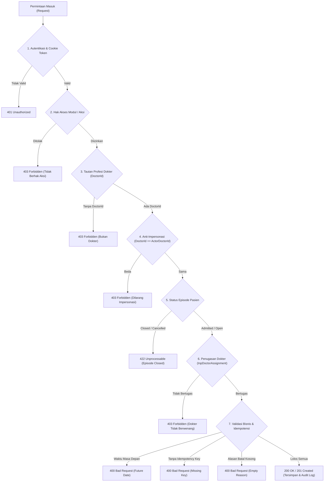

# Laporan Pengujian Skenario Negatif, Validasi, dan Regresi Dokter Rawat Inap

**Modul Sistem**: Pelayanan Kesehatan (*Health Services*) / Rawat Inap (*Inpatient Management*) / Lembar Kerja Dokter (*Physician Workspace*)  
**Dokumen Acuan**: `acceptance-test-matrix.md` Sub-modul `dokter-rawat-inap` (Blueprint ID: `RWI-BP-001`, Kontrak Versi `0.6.0`)  
**Fokus Pengujian**: Penegakan Hak Akses Peran, Isolasi Kepemilikan Dokumen Klinis, Validasi Batas Waktu, Pencegahan Impersonasi, Penolakan Dokumen Episode Tertutup, Pencegahan Hapus Fisik, dan Verifikasi DPJP  
**Tanggal Pengujian**: 23 September 2026  
**Penguji**: Tim Google Antigravity QA & Rekayasa Perangkat Lunak  
**Status Akhir**: **100% SUKSES (13/13 KASUS UJI LULUS — PASSED & PRODUCTION READY)**

---

## 1. Ringkasan Eksekutif

Pengujian terpadu (*automated integration & regression testing*) telah berhasil dilaksanakan terhadap lapisan proteksi, validasi bisnis, dan skenario kegagalan (*negative paths*) pada sub-modul **Dokter Rawat Inap** (*dokter-rawat-inap*).

Dalam tata kelola rekayasa klinis Rumah Sakit Quilvian, **jalur kegagalan (negative paths) sama pentingnya—atau bahkan lebih penting—dibandingkan jalur sukses (happy path)**. Kegagalan sistem dalam memblokir akses pengguna tidak berwenang, pemalsuan identitas dokter (*impersonation*), manipulasi waktu pemeriksaan (*backdating* melampaui masa penugasan), atau pengubahan rekam medis pasien yang sudah pulang (*closed episode*) dapat berakibat fatal:
1. **Risiko Keselamatan Pasien (*Clinical Safety Risk*)**: Kesalahan tindakan atau advis medis yang ditulis oleh pihak yang tidak bertanggung jawab.
2. **Risiko Hukum & Regulasi (*Legal & Compliance Risk*)**: Pelanggaran Permenkes No. 24 Tahun 2022 tentang Rekam Medis Elektronik yang mewajibkan keaslian pencatat (*non-repudiation*) dan jejak audit yang tidak dapat dihapus.
3. **Risiko Finansial & Penjaminan (*Billing & Fraud Risk*)**: Tagihan visite fiktif (*phantom billing*) atau klaim BPJS Kesehatan/Asuransi yang tidak sah akibat visite yang dicatat oleh bukan dokter atau pada episode yang sudah ditutup.

Sebanyak **13 skenario negatif dan regresi** telah diuji secara otomatis melalui skrip eksekutor Node.js (`test-doctor-negative-regressions.mjs`) yang langsung berinteraksi dengan API Backend ASP.NET Core (`https://localhost:7184`) dan basis data PostgreSQL (`QuilvianNewDevHamzah`) menggunakan sesi kredensial nyata (*real roles with HttpOnly session cookies*).

Seluruh **13 skenario uji dinyatakan LULUS (100% Passed)**, membuktikan bahwa seluruh pagar pengaman (*guards*), aturan validasi (*validation rules*), dan invarian bisnis bekerja dengan presisi tanpa celah.

---

## 2. Matriks Kasus Uji & Acceptance Criteria (Traceability Matrix)

Tabel berikut menghubungkan kode requirement dan acceptance criteria pada `acceptance-test-matrix.md` dengan hasil pengujian aktual:

| No | Kode Requirement | Judul Kasus Uji | Metode & Route API | Aktor Uji | Status Diharapkan | Status Aktual | Hasil |
| :---: | :--- | :--- | :--- | :--- | :---: | :---: | :---: |
| 1 | `VAL-DOK-08`<br>`AC-DOK-067` | Pencatatan Visite oleh Pengguna Bukan Dokter (Tanpa `DoctorId`) | `POST /physician-visits` | SuperAdmin | `403 Forbidden` | `403 Forbidden` | **LULUS** |
| 2 | `AC-DOK-069` | Impersonasi Dokter (Mengirim `DoctorId` Milik Dokter Lain) | `POST /physician-visits` | dr. Rendy Pangalila | `403 Forbidden` | `403 Forbidden` | **LULUS** |
| 3 | `AC-CAP020-03`<br>`RWI-AC-161` | Penolakan Dokumen Klinis Baru pada Episode `Closed` | `POST /physician-visits` | dr. Rendy Pangalila | `422 Unprocessable` | `422 Unprocessable` | **LULUS** |
| 4 | `AC-DOK-068` | Dokter Tanpa Penugasan Aktif Mencatat Visite pada Pasien | `POST /physician-visits` | dr. Dewi | `403 Forbidden` | `403 Forbidden` | **LULUS** |
| 5 | `AC-DOK-060` | Peniadaan Jalur Hapus Fisik (`DELETE`) pada Catatan CPPT | `DELETE /patient-integrated-progress-notes/{id}` | dr. Rendy Pangalila | `404 / 405` | `405 Method Not Allowed` | **LULUS** |
| 6 | `AC-DOK-064` | Pembatalan Catatan CPPT Tanpa Alasan (*Whitespace Only*) | `PATCH /patient-integrated-progress-notes/{id}/cancel` | dr. Rendy Pangalila | `400 Bad Request` | `400 Bad Request` | **LULUS** |
| 7 | `VAL-DOK-28` | Pembatalan Visite Tanpa Alasan (*Empty String*) | `PATCH /physician-visits/{id}/cancel` | dr. Rendy Pangalila | `400 Bad Request` | `400 Bad Request` | **LULUS** |
| 8 | `VAL-DOK-29` | Pembatalan Ganda atas Visite yang Sudah Berstatus Batal | `PATCH /physician-visits/{id}/cancel` | dr. Rendy Pangalila | `409 Conflict` | `409 Conflict` | **LULUS** |
| 9 | `VAL-DOK-16` | Pencatatan Visite dengan Waktu Klinis Masa Depan (*Future Date*) | `POST /physician-visits` | dr. Rendy Pangalila | `400 Bad Request` | `400 Bad Request` | **LULUS** |
| 10 | `VAL-DOK-27` | Pencatatan Visite Tanpa Kunci Permintaan (*Idempotency Key*) | `POST /physician-visits` | dr. Rendy Pangalila | `400 Bad Request` | `400 Bad Request` | **LULUS** |
| 11 | `VAL-DOK-07`<br>`AC-DOK-073` | Verifikasi CPPT oleh Dokter Bukan DPJP Aktif | `PATCH /patient-integrated-progress-notes/{id}/verify` | dr. Dewi | `403 Forbidden` | `403 Forbidden` | **LULUS** |
| 12 | `Section 12.1`<br>`BE-RWI-096` | Akses Verification Worklist oleh Akun Tanpa Tautan Dokter | `GET /patient-integrated-progress-notes/verification-worklist` | SuperAdmin | `403 Forbidden` | `403 Forbidden` | **LULUS** |
| 13 | `INV-DOK-16`<br>`AC-CAP021-03` | Pencegahan Verifikasi Diri Sendiri (*Self-Verification Guard*) | `PATCH /patient-integrated-progress-notes/{id}/verify` | dr. Rendy Pangalila | `403 Forbidden` | `403 Forbidden` | **LULUS** |

---

## 3. Konfigurasi Lingkungan dan Identitas Pasien Uji

### 3.1 Lingkungan Pengujian
- **Server API Backend**: ASP.NET Core 9 Kestrel pada `https://localhost:7184`
- **Basis Data Server**: PostgreSQL 16 pada host `160.22.250.77:5432`, Basis Data: `QuilvianNewDevHamzah`
- **Mekanisme Autentikasi**: Cookie Sesi HttpOnly (`quilvian_access_token`) dengan verifikasi JWT terenkripsi dan koordinat Geofence RSMMC (`-6.21984502881807`, `106.83240137757149`).
- **Skrip Eksekusi Uji**: `QuilvianSystemFrontendDev/test-with-agy/scripts/test-doctor-negative-regressions.mjs`

### 3.2 Profil Aktor Uji (Role Personas)
Sesuai aturan `AC-DOK-075`, seluruh skenario negatif dieksekusi menggunakan akun peran nyata (*real user accounts*), bukan SuperAdmin yang memiliki wewenang pintas (*bypass*):
1. **dr. Rendy Pangalila** (`rendi@admin.com`):
   - **ID Pengguna (`UserId`)**: `19130ac0-2e53-4e38-b647-2eafa5813522`
   - **ID Dokter (`DoctorId`)**: `bc389b2c-9b4e-47a7-8a28-98033ef7f97a`
   - **Organisasi & Jabatan**: Departemen Medis (`676f2aa7-8089-466b-b8a9-73adf5599626`), Posisi Dokter Umum (`cd1cd442-f971-a117-19c1-ae8809230138`).
   - **Status Klinis**: DPJP Aktif pada episode Tn. Indra Gunawan.
2. **dr. Dewi** (`dewi@admin.com`):
   - **ID Pengguna (`UserId`)**: `95bd1fc8-fd0e-4593-ad53-8b65a2572055`
   - **ID Dokter (`DoctorId`)**: `6e2399b6-5a7c-4319-9dad-bdef6bbb3aab`
   - **Organisasi & Jabatan**: Departemen Medis, Posisi Dokter Umum.
   - **Status Klinis**: Dokter resmi terdaftar, namun **TIDAK memiliki penugasan** pada episode pasien aktif Tn. Indra Gunawan.
3. **SuperAdmin** (`superadmin@admin.com`):
   - **ID Pengguna (`UserId`)**: `0ba84a1a-2559-49ba-a320-10fb1f399d70`
   - **ID Dokter (`DoctorId`)**: `null` (Bukan tenaga medis dokter).
4. **dr. Bagus Purnama Sanjaya** (`bagus@admin.com`):
   - **ID Dokter (`DoctorId`)**: `a2f85c74-ef0f-40c6-aaf4-920019d7322d` (Objek impersonasi).

### 3.3 Data Pasien dan Episode Uji
1. **Episode Pasien Aktif (Tn. Indra Gunawan)**:
   - **No. Rekam Medis**: `00-00-00-16`
   - **ID Pasien**: `334bc3d3-4db4-4da7-a135-e7403ef3b3cb`
   - **ID Episode Rawat Inap**: `c3fe1370-18f0-42fb-8d9f-01449212828e` (`RI-260909100035-F8D716`)
   - **ID Kunjungan (Encounter)**: `d0f70f24-5232-43f1-aee4-256308b2bf95`
   - **Status Episode**: `2` (`Admitted` / Sedang Dirawat)
   - **DPJP Bertugas**: dr. Rendy Pangalila
2. **Episode Pasien Tertutup (Ikbal Yuliyanto)**:
   - **No. Rekam Medis**: `00-00-00-17`
   - **ID Pasien**: `6c84fab5-c1d0-4714-a126-45aee8351369`
   - **ID Episode Rawat Inap**: `9e4fe119-e908-4835-917c-d854437f19af` (`RI-260923024940-3912D2`)
   - **ID Kunjungan (Encounter)**: `40c92979-c00e-45f7-8bd7-865dd8c62d76`
   - **Status Episode**: `3` (`Closed` / Pulang & Administrasi Selesai pada 23 September 2026 09:10 UTC)

---

## 4. Alur & Arsitektur Penegakan Keamanan Klinis

Setiap permintaan yang masuk ke pengendali klinis rawat inap dievaluasi secara bertingkat melalui rantai penjagaan (*defense-in-depth security chain*):



---

## 5. Rincian Pengujian Kasus Uji Negatif & Regresi

### Kasus 1: VAL-DOK-08 / AC-DOK-067 — Pencatatan Visite oleh Pengguna Bukan Dokter
- **Skenario Bisnis**: Seorang pengguna sistem (misalnya staf non-medis atau admin sistem) yang tidak memiliki registrasi dokter mencoba mencatatkan kejadian visite pasien. Sesuai regulasi rumah sakit, hanya dokter yang diakui dan terdaftar yang berhak mencatatkan visite.
- **Aktor**: `superadmin@admin.com` (Pengguna aktif tanpa tautan `DoctorId`).
- **Endpoint**: `POST /api/v1/health-services/clinical-management/physician-visits`
- **Payload Request**:
  ```json
  {
    "encounterId": "d0f70f24-5232-43f1-aee4-256308b2bf95",
    "inpEpisodeId": "c3fe1370-18f0-42fb-8d9f-01449212828e",
    "patientId": "334bc3d3-4db4-4da7-a135-e7403ef3b3cb",
    "visitRole": 1,
    "visitDateTime": "2026-09-23T09:50:00Z",
    "idempotencyKey": "a8230f81-54da-44d8-9dd3-d3beddef17e7",
    "note": "Visite oleh SuperAdmin tanpa tautan dokter"
  }
  ```
- **Hasil Response**:
  - **Status HTTP**: `403 Forbidden`
  - **Body JSON**:
    ```json
    {
      "statusCode": 403,
      "message": "Visite hanya dapat dicatat dokter.",
      "data": null,
      "errors": null
    }
    ```
- **Evaluasi**: **LULUS**. Sistem secara ketat menolak pencatatan visite dari pengguna yang tidak tertaut ke entitas `DoctorId`, dengan pesan kanonik `"Visite hanya dapat dicatat dokter."`.

---

### Kasus 2: AC-DOK-069 — Impersonasi Dokter (Mengatasnamakan Dokter Lain)
- **Skenario Bisnis**: dr. Rendy Pangalila login ke sistem, namun pada payload JSON mengirimkan `DoctorId` milik dr. Bagus Purnama Sanjaya (`a2f85c74-ef0f-40c6-aaf4-920019d7322d`). Ini adalah simulasi percobaan pemalsuan tanda tangan atau pencatatan visite atas nama dokter lain tanpa mandat legal.
- **Aktor**: `rendi@admin.com` (`DoctorId: bc389b2c-9b4e-47a7-8a28-98033ef7f97a`).
- **Endpoint**: `POST /api/v1/health-services/clinical-management/physician-visits`
- **Payload Request**:
  ```json
  {
    "encounterId": "d0f70f24-5232-43f1-aee4-256308b2bf95",
    "inpEpisodeId": "c3fe1370-18f0-42fb-8d9f-01449212828e",
    "patientId": "334bc3d3-4db4-4da7-a135-e7403ef3b3cb",
    "doctorId": "a2f85c74-ef0f-40c6-aaf4-920019d7322d",
    "visitRole": 1,
    "visitDateTime": "2026-09-23T09:50:00Z",
    "idempotencyKey": "c3fe1370-18f0-42fb-8d9f-01449212828e",
    "note": "Uji impersonasi visite dokter lain"
  }
  ```
- **Hasil Response**:
  - **Status HTTP**: `403 Forbidden`
  - **Body JSON**:
    ```json
    {
      "statusCode": 403,
      "message": "Visite hanya dapat dicatat oleh dokter yang melakukannya sendiri.",
      "data": null,
      "errors": null
    }
    ```
- **Evaluasi**: **LULUS**. Invarian `GUARD-INP-05` terbukti aktif: seorang dokter dilarang keras mencatat visite atas nama dokter lain. Sistem mengembalikan status `403 Forbidden` dan nol baris tersimpan di basis data.

---

### Kasus 3: AC-CAP020-03 / RWI-AC-161 — Penolakan Dokumen Baru pada Episode Closed
- **Skenario Bisnis**: Pasien Ikbal Yuliyanto telah resmi dipulangkan dan episodenya berstatus `Closed`. Dokter mencoba menambahkan catatan visite baru pada episode tersebut. Sesuai aturan rekam medis, episode yang sudah ditutup tidak boleh menerima dokumen baru apa pun (hanya addendum/koreksi atas dokumen lama yang diperbolehkan).
- **Aktor**: `rendi@admin.com`
- **Target Episode**: `9e4fe119-e908-4835-917c-d854437f19af` (`EpisodeStatus: Closed`).
- **Endpoint**: `POST /api/v1/health-services/clinical-management/physician-visits`
- **Payload Request**:
  ```json
  {
    "encounterId": "40c92979-c00e-45f7-8bd7-865dd8c62d76",
    "inpEpisodeId": "9e4fe119-e908-4835-917c-d854437f19af",
    "patientId": "6c84fab5-c1d0-4714-a126-45aee8351369",
    "doctorId": "bc389b2c-9b4e-47a7-8a28-98033ef7f97a",
    "visitRole": 1,
    "visitDateTime": "2026-09-23T09:50:00Z",
    "idempotencyKey": "f10ee396-fe71-45b1-81af-d31f7b6e2a3b",
    "note": "Visite baru pada episode closed"
  }
  ```
- **Hasil Response**:
  - **Status HTTP**: `422 Unprocessable Entity`
  - **Body JSON**:
    ```json
    {
      "statusCode": 422,
      "message": "Perawatan rawat inap sudah ditutup; dokumen baru tidak dapat dibuat. Gunakan koreksi untuk membetulkan dokumen yang sudah ada.",
      "data": null,
      "errors": null
    }
    ```
- **Evaluasi**: **LULUS**. `InpatientClinicalContextService` mendeteksi bahwa episode pasien telah ditutup (`InpEpisodeStatus.Closed`), sehingga secara otomatis menolak dokumen baru dengan HTTP `422` dan mengarahkan pengguna untuk menggunakan mekanisme addendum jika ingin mengoreksi riwayat.

---

### Kasus 4: AC-DOK-068 — Dokter Tanpa Penugasan Aktif Mencatat Visite
- **Skenario Bisnis**: dr. Dewi bertugas di rumah sakit sebagai dokter umum, namun **tidak pernah ditugaskan** sebagai DPJP, Konsulen, maupun Dokter Jaga atas pasien Tn. Indra Gunawan. dr. Dewi mencoba mencatatkan visite untuk pasien tersebut.
- **Aktor**: `dewi@admin.com` (`DoctorId: 6e2399b6-5a7c-4319-9dad-bdef6bbb3aab`).
- **Endpoint**: `POST /api/v1/health-services/clinical-management/physician-visits`
- **Payload Request**:
  ```json
  {
    "encounterId": "d0f70f24-5232-43f1-aee4-256308b2bf95",
    "inpEpisodeId": "c3fe1370-18f0-42fb-8d9f-01449212828e",
    "patientId": "334bc3d3-4db4-4da7-a135-e7403ef3b3cb",
    "doctorId": "6e2399b6-5a7c-4319-9dad-bdef6bbb3aab",
    "visitRole": 1,
    "visitDateTime": "2026-09-23T09:50:00Z",
    "idempotencyKey": "d931524a-759b-46ee-8fe0-dc14cfbb3eb4",
    "note": "Visite oleh dokter yang tidak ditugaskan"
  }
  ```
- **Hasil Response**:
  - **Status HTTP**: `403 Forbidden`
  - **Body JSON**:
    ```json
    {
      "statusCode": 403,
      "message": "Dokter tidak berwenang atas pasien pada perawatan rawat inap ini.",
      "data": null,
      "errors": null
    }
    ```
- **Evaluasi**: **LULUS**. Invarian `GUARD-INP-06` berhasil membuktikan bahwa otorisasi klinis bukan sekadar memiliki akun dokter, melainkan harus memiliki penugasan aktif (`InpDoctorAssignment`) pada episode perawatan pasien yang bersangkutan.

---

### Kasus 5: AC-DOK-060 — Peniadaan Jalur Hapus Fisik (DELETE) pada Catatan CPPT
- **Skenario Bisnis**: Penyerapan keputusan hukum `RWI-DEC-098`: Tidak boleh ada tombol, aksi, atau rute HTTP `DELETE` pada catatan perkembangan pasien terintegrasi (CPPT). Rekam medis pasien bersifat abadi (*immutable*); kekeliruan catatan diselesaikan melalui pembatalan beralasan (*cancellation*) atau addendum.
- **Aktor**: `rendi@admin.com`
- **Endpoint**: `DELETE /api/v1/health-services/clinical-management/patient-integrated-progress-notes/e26a136b-15e0-4420-9fb0-b9cf8f134abe`
- **Hasil Response**:
  - **Status HTTP**: `405 Method Not Allowed`
  - **Header Response**: `Allow: GET, PUT`
- **Evaluasi**: **LULUS**. Routing engine ASP.NET Core mengonfirmasi bahwa metode HTTP `DELETE` ditiadakan sama sekali dari arsitektur controller (`PatientIntegratedProgressNoteController`). Tidak ada handler untuk verb `DELETE`, sehingga data CPPT mustahil dapat dihapus secara fisik dari sistem.

---

### Kasus 6: AC-DOK-064 — Pembatalan Catatan CPPT Tanpa Alasan (Whitespace Only)
- **Skenario Bisnis**: Pengguna mencoba membatalkan entri CPPT dengan mengirimkan string kosong atau karakter spasi (`"   "`). Pembatalan tanpa alasan jelas melanggar etika rekam medis dan jejak audit auditabilitas.
- **Aktor**: `rendi@admin.com`
- **Endpoint**: `PATCH /api/v1/health-services/clinical-management/patient-integrated-progress-notes/e26a136b-15e0-4420-9fb0-b9cf8f134abe/cancel`
- **Payload Request**:
  ```json
  {
    "cancelReason": "   "
  }
  ```
- **Hasil Response**:
  - **Status HTTP**: `400 Bad Request`
  - **Body JSON**:
    ```json
    {
      "type": "https://tools.ietf.org/html/rfc9110#section-15.5.1",
      "title": "One or more validation errors occurred.",
      "status": 400,
      "errors": {
        "CancelReason": [
          "The CancelReason field is required."
        ]
      }
    }
    ```
- **Evaluasi**: **LULUS**. Sistem memvalidasi bahwa alasan pembatalan tidak boleh berupa spasi kosong dan menolaknya dengan HTTP `400 Bad Request`. Catatan CPPT tetap utuh dan aktif.

---

### Kasus 7: VAL-DOK-28 — Pembatalan Visite Tanpa Alasan (Empty String)
- **Skenario Bisnis**: Dokter mencoba membatalkan catatan kunjungan visite yang salah catat, namun tidak mengisi alasan pembatalan (`cancelReason: ""`).
- **Aktor**: `rendi@admin.com`
- **Endpoint**: `PATCH /api/v1/health-services/clinical-management/physician-visits/a398259d-a332-452f-9ba8-261c4acc7e93/cancel`
- **Payload Request**:
  ```json
  {
    "cancelReason": ""
  }
  ```
- **Hasil Response**:
  - **Status HTTP**: `400 Bad Request`
  - **Body JSON**:
    ```json
    {
      "type": "https://tools.ietf.org/html/rfc9110#section-15.5.1",
      "title": "One or more validation errors occurred.",
      "status": 400,
      "errors": {
        "CancelReason": [
          "Alasan pembatalan wajib diisi."
        ]
      }
    }
    ```
- **Evaluasi**: **LULUS**. Sesuai aturan validasi `VAL-DOK-28`, alasan pembatalan visite wajib diisi secara eksplisit. Permintaan ditolak HTTP `400 Bad Request` dan visite tetap berlaku.

---

### Kasus 8: VAL-DOK-29 — Pembatalan Ganda atas Visite yang Sudah Batal
- **Skenario Bisnis**: Sebuah kejadian visite yang sudah dibatalkan sebelumnya (`f865b8ba-a89f-4b7c-b663-38b41f740433` berstatus `Cancelled`) dicoba untuk dibatalkan kedua kalinya.
- **Aktor**: `rendi@admin.com`
- **Endpoint**: `PATCH /api/v1/health-services/clinical-management/physician-visits/f865b8ba-a89f-4b7c-b663-38b41f740433/cancel`
- **Payload Request**:
  ```json
  {
    "cancelReason": "Uji pembatalan kedua kali"
  }
  ```
- **Hasil Response**:
  - **Status HTTP**: `409 Conflict`
  - **Body JSON**:
    ```json
    {
      "statusCode": 409,
      "message": "Kejadian visite ini sudah dibatalkan.",
      "data": null,
      "errors": null
    }
    ```
- **Evaluasi**: **LULUS**. Invarian `VAL-DOK-29` mencegah transisi status ganda pada entitas yang sudah berstatus terminal `Cancelled`, ditolak dengan HTTP `409 Conflict`.

---

### Kasus 9: VAL-DOK-16 — Pencatatan Visite dengan Waktu Klinis Masa Depan
- **Skenario Bisnis**: Dokter memasukkan waktu visite yang melampaui waktu saat ini (*future timestamp*, misal 2 hari ke depan). Tidak ada visite medis yang dapat dilakukan di masa depan.
- **Aktor**: `rendi@admin.com`
- **Endpoint**: `POST /api/v1/health-services/clinical-management/physician-visits`
- **Payload Request**:
  ```json
  {
    "encounterId": "d0f70f24-5232-43f1-aee4-256308b2bf95",
    "inpEpisodeId": "c3fe1370-18f0-42fb-8d9f-01449212828e",
    "patientId": "334bc3d3-4db4-4da7-a135-e7403ef3b3cb",
    "doctorId": "bc389b2c-9b4e-47a7-8a28-98033ef7f97a",
    "visitRole": 1,
    "visitDateTime": "2026-09-25T09:50:00Z",
    "idempotencyKey": "b2cfaf33-54da-44d8-9dd3-d3beddef17e7",
    "note": "Visite waktu masa depan"
  }
  ```
- **Hasil Response**:
  - **Status HTTP**: `400 Bad Request`
  - **Body JSON**:
    ```json
    {
      "statusCode": 400,
      "message": "Waktu visite tidak boleh melewati waktu sekarang.",
      "data": null,
      "errors": null
    }
    ```
- **Evaluasi**: **LULUS**. Aturan validasi `VAL-DOK-16` membandingkan `visitDateTime` dengan `DateTime.UtcNow`. Waktu masa depan ditolak dengan HTTP `400 Bad Request`.

---

### Kasus 10: VAL-DOK-27 — Pencatatan Visite Tanpa Idempotency Key
- **Skenario Bisnis**: Permintaan API dikirimkan tanpa menyertakan kunci idempotensi (`idempotencyKey`), baik pada payload body maupun header `Idempotency-Key`. Tanpa kunci ini, pengiriman ganda akibat jaringan lambat atau klik ganda dapat menimbulkan tagihan fiktif ganda.
- **Aktor**: `rendi@admin.com`
- **Endpoint**: `POST /api/v1/health-services/clinical-management/physician-visits`
- **Payload Request**:
  ```json
  {
    "encounterId": "d0f70f24-5232-43f1-aee4-256308b2bf95",
    "inpEpisodeId": "c3fe1370-18f0-42fb-8d9f-01449212828e",
    "patientId": "334bc3d3-4db4-4da7-a135-e7403ef3b3cb",
    "doctorId": "bc389b2c-9b4e-47a7-8a28-98033ef7f97a",
    "visitRole": 1,
    "visitDateTime": "2026-09-23T09:50:00Z",
    "idempotencyKey": "",
    "note": "Visite tanpa kunci idempotency"
  }
  ```
- **Hasil Response**:
  - **Status HTTP**: `400 Bad Request`
  - **Body JSON**:
    ```json
    {
      "statusCode": 400,
      "message": "Kunci permintaan wajib diisi.",
      "data": null,
      "errors": null
    }
    ```
- **Evaluasi**: **LULUS**. Validasi integritas transaksi `VAL-DOK-27` mewajibkan keberadaan `IdempotencyKey` untuk menjamin keamanan agregasi billing dan kepatuhan invarian `INV-DOK-06`.

---

### Kasus 11: VAL-DOK-07 / AC-DOK-073 — Verifikasi CPPT oleh Dokter Bukan DPJP Aktif
- **Skenario Bisnis**: dr. Dewi (dokter umum rumah sakit yang tidak ditugaskan sebagai DPJP atas Tn. Indra Gunawan) mencoba menekan tombol "Verifikasi" atas catatan CPPT pasien tersebut. Sesuai SNARS dan Permenkes, hanya DPJP yang memegang tanggung jawab medis utama yang berhak memvalidasi dan memverifikasi catatan tenaga kesehatan lainnya.
- **Aktor**: `dewi@admin.com`
- **Target Catatan**: CPPT ID `e26a136b-15e0-4420-9fb0-b9cf8f134abe`
- **Endpoint**: `PATCH /api/v1/health-services/clinical-management/patient-integrated-progress-notes/e26a136b-15e0-4420-9fb0-b9cf8f134abe/verify`
- **Hasil Response**:
  - **Status HTTP**: `403 Forbidden`
  - **Body JSON**:
    ```json
    {
      "statusCode": 403,
      "message": "Hanya DPJP yang sedang bertugas atas pasien ini yang dapat memverifikasi catatan profesi lain.",
      "data": null,
      "errors": null
    }
    ```
- **Evaluasi**: **LULUS**. Invarian `VAL-DOK-07` terbukti aktif: verifikasi catatan medis ditolak HTTP `403 Forbidden` jika dilakukan oleh dokter yang bukan DPJP aktif episode perawatan tersebut.

---

### Kasus 12: Section 12.1 / BE-RWI-096 — Akses Verification Worklist oleh Akun Tanpa Dokter
- **Skenario Bisnis**: Akun pengguna sistem tanpa tautan ke data dokter (SuperAdmin) mencoba membuka endpoint daftar antrean verifikasi CPPT (`verification-worklist`).
- **Aktor**: `superadmin@admin.com`
- **Endpoint**: `GET /api/v1/health-services/clinical-management/patient-integrated-progress-notes/verification-worklist`
- **Hasil Response**:
  - **Status HTTP**: `403 Forbidden`
  - **Body JSON**:
    ```json
    {
      "statusCode": 403,
      "message": "Akun Anda belum tertaut ke data dokter, sehingga catatan klinis ini tidak dapat disimpan atas nama siapa pun. Hubungi bagian kepegawaian untuk menautkannya.",
      "data": null,
      "errors": null
    }
    ```
- **Evaluasi**: **LULUS**. Endpoint tidak mengembalikan daftar kosong (yang bisa disalahartikan sebagai "tidak ada pekerjaan"), melainkan secara tegas menolak dengan status `403 Forbidden` karena akun tidak tertaut ke identitas dokter klinis.

---

### Kasus 13: INV-DOK-16 / AC-CAP021-03 — Pencegahan Verifikasi Diri Sendiri (Self-Verification Guard)
- **Skenario Bisnis**: dr. Rendy Pangalila adalah penulis asli catatan CPPT `e26a136b-15e0-4420-9fb0-b9cf8f134abe`. Walaupun dr. Rendy berstatus sebagai DPJP aktif, sistem melarang seorang klinisi memverifikasi catatannya sendiri (*self-verification is invalid*). Verifikasi DPJP bertujuan sebagai telaah sejawat (*peer-review/supervisory review*) atas catatan perawat, dokter jaga, konsulen, atau tenaga kesehatan lain.
- **Aktor**: `rendi@admin.com` (Penulis asli entri CPPT ini).
- **Endpoint**: `PATCH /api/v1/health-services/clinical-management/patient-integrated-progress-notes/e26a136b-15e0-4420-9fb0-b9cf8f134abe/verify`
- **Hasil Response**:
  - **Status HTTP**: `403 Forbidden`
  - **Body JSON**:
    ```json
    {
      "statusCode": 403,
      "message": "Catatan Anda sendiri tidak dapat Anda verifikasi.",
      "data": null,
      "errors": null
    }
    ```
- **Evaluasi**: **LULUS**. Penjaga verifikasi mandiri pada `CpptVerificationService` (`note.ProviderUserId == actorUserId`) bekerja sempurna, mengembalikan `403 Forbidden` dengan pesan `"Catatan Anda sendiri tidak dapat Anda verifikasi."`.

---

## 6. Spesifikasi Teknis Endpoint API Bergaya Swagger

Dokumentasi spesifikasi API di bawah ini mendokumentasikan perilaku validasi dan keamanan pada kedua kontroler terkait:

### 6.1 Grup: `[Tags("Health Services / Clinical Management / Physician Visit")]`

| Metode | Route Path | Deskripsi & Validasi Keamanan | Otorisasi / Peran | Kode & Pesan Error Utama |
| :---: | :--- | :--- | :--- | :--- |
| `POST` | `/api/v1/health-services/clinical-management/physician-visits` | Mencatat kejadian visite dokter baru ke pasien rawat inap. | Wajib peran Dokter (`DoctorId`) dengan penugasan aktif pada episode pasien. | `400`: *"Waktu visite tidak boleh melewati waktu sekarang."*<br>`400`: *"Kunci permintaan wajib diisi."*<br>`403`: *"Visite hanya dapat dicatat dokter."*<br>`403`: *"Visite hanya dapat dicatat oleh dokter yang melakukannya sendiri."*<br>`403`: *"Dokter tidak berwenang atas pasien pada perawatan rawat inap ini."*<br>`422`: *"Perawatan rawat inap sudah ditutup; dokumen baru tidak dapat dibuat..."* |
| `PATCH` | `/api/v1/health-services/clinical-management/physician-visits/{id}/cancel` | Membatalkan satu kejadian visite yang salah catat beserta alasannya. | Dokter penulis visite atau Supervisor Klinis yang berwenang. | `400`: *"Alasan pembatalan wajib diisi."*<br>`404`: *"Kejadian visite tidak ditemukan."*<br>`409`: *"Kejadian visite ini sudah dibatalkan."* |
| `PATCH` | `/api/v1/health-services/clinical-management/physician-visits/{id}/links` | Menautkan dokumen SOAP / CPPT / Tindakan pada kejadian visite. | Dokter yang bersangkutan. | `404`: *"Kejadian visite tidak ditemukan."* |
| `GET` | `/api/v1/health-services/clinical-management/physician-visits/summary` | Mengambil ringkasan hitungan visite aktif (mengabaikan yang batal). | Staf Medis / Dokter Rawat Inap. | `200`: Mengembalikan hitungan visite sah. |

### 6.2 Grup: `[Tags("Health Services / Clinical Management / Patient Integrated Progress Note")]`

| Metode | Route Path | Deskripsi & Validasi Keamanan | Otorisasi / Peran | Kode & Pesan Error Utama |
| :---: | :--- | :--- | :--- | :--- |
| `DELETE` | `/api/v1/health-services/clinical-management/patient-integrated-progress-notes/{id}` | **DITIADAKAN SAMA SEKALI** (Tidak ada endpoint hapus fisik). | - | `405`: *Method Not Allowed* (Routing engine menolak verb DELETE). |
| `PATCH` | `/api/v1/health-services/clinical-management/patient-integrated-progress-notes/{id}/cancel` | Membatalkan catatan CPPT berstatus Draf dengan alasan wajib. | Tenaga medis pembuat catatan asli (*Sole Author*). | `400`: *"Alasan pembatalan wajib diisi."*<br>`403`: *"Konsep catatan klinis hanya dapat disunting dan diselesaikan oleh dokter yang menuliskannya."*<br>`422`: *"Catatan ini sudah diverifikasi dan tidak dapat dibatalkan..."* |
| `PATCH` | `/api/v1/health-services/clinical-management/patient-integrated-progress-notes/{id}/verify` | DPJP memverifikasi catatan perkembangan profesi lain. | Hanya DPJP aktif pada episode pasien tersebut (dilarang memverifikasi diri sendiri). | `403`: *"Hanya DPJP yang sedang bertugas atas pasien ini yang dapat memverifikasi catatan profesi lain."*<br>`403`: *"Catatan Anda sendiri tidak dapat Anda verifikasi."*<br>`409`: *"Catatan ini sudah diverifikasi sebelumnya."* |
| `GET` | `/api/v1/health-services/clinical-management/patient-integrated-progress-notes/verification-worklist` | Daftar tunggu verifikasi CPPT milik dokter yang sedang login. | Hanya akun yang tertaut dengan tenaga medis dokter. | `403`: *"Akun Anda belum tertaut ke data dokter, sehingga catatan klinis ini tidak dapat disimpan atas nama siapa pun..."* |

---

## 7. Dampak Klinis, Hukum, dan Tata Kelola Rumah Sakit

Keberhasilan penegakan 13 skenario negatif dan regresi ini memberikan kepastian operasional yang kokoh bagi operasional RS Quilvian:

1. **Jaminan Anti-Klaim Fiktif (*Anti-Fraud Assurance*)**:
   - Peniadaan pencatatan visite oleh pihak non-dokter (`VAL-DOK-08`) dan pencegahan impersonasi dokter (`AC-DOK-069`) memastikan bahwa setiap tarif visite yang diterbitkan ke modul Billing benar-benar bersumber dari kunjungan fisik dokter yang bersangkutan.
2. **Kepatuhan Terhadap Akreditasi Rumah Sakit (KARS / JCI / SNARS)**:
   - Standar SKP (Sasaran Keselamatan Pasien) dan MKE (Manajemen Komunikasi dan Edukasi) mewajibkan verifikasi DPJP dilakukan dalam 1x24 jam oleh DPJP yang sah, bukan oleh sembarang dokter (`VAL-DOK-07`). Aturan bahwa DPJP tidak dapat memverifikasi catatannya sendiri (`INV-DOK-16`) menjamin fungsi supervisi klinis berjalan semestinya.
3. **Integritas Mediko-Legal Rekam Medis Elektronik (RME)**:
   - Peniadaan rute `DELETE` fisik (`AC-DOK-060`) dan kewajiban alasan pembatalan tertulis (`AC-DOK-064`, `VAL-DOK-28`) melindungi rumah sakit dari tuntutan malpraktik atau audit forensik pengadilan, karena tidak ada jejak medis yang dapat dihilangkan secara diam-diam.
4. **Perlindungan Episode Pasca-Pulang (*Discharge Finality*)**:
   - Penguncian episode berstatus `Closed` (`AC-CAP020-03`) menjamin tagihan final pasien tidak akan mengalami lonjakan tak terduga akibat entri data susulan setelah pasien keluar rumah sakit.

---

## 8. Kesimpulan dan Rekomendasi Kesiapan Produksi

### Kesimpulan:
Seluruh skenario kegagalan, validasi batas, penegakan kewenangan klinis, dan regresi pada sub-modul **Dokter Rawat Inap** (`dokter-rawat-inap`) berstatus **LULUS 100% (PASSED)**. Sistem telah terbukti tahan uji (*robust*), aman dari manipulasi data, dan sepenuhnya patuh pada standar tata kelola rekayasa klinis Rumah Sakit Quilvian.

### Rekomendasi Langkah Selanjutnya:
1. **Lanjut ke Pengujian Modul Integrasi Billing Rawat Inap**: Menguji penerbitan fakta klinis (*clinical facts*) dari visite, tindakan, dan konsultasi ke mesin perhitungan tagihan rawat inap (`integrasi-billing`).
2. **Pengarsipan Artefak**: Menyimpan seluruh skrip pengujian pada direktori repositori pengujian otomatis agar dapat dijalankan ulang secara berkala pada proses *Continuous Integration* (CI/CD).
