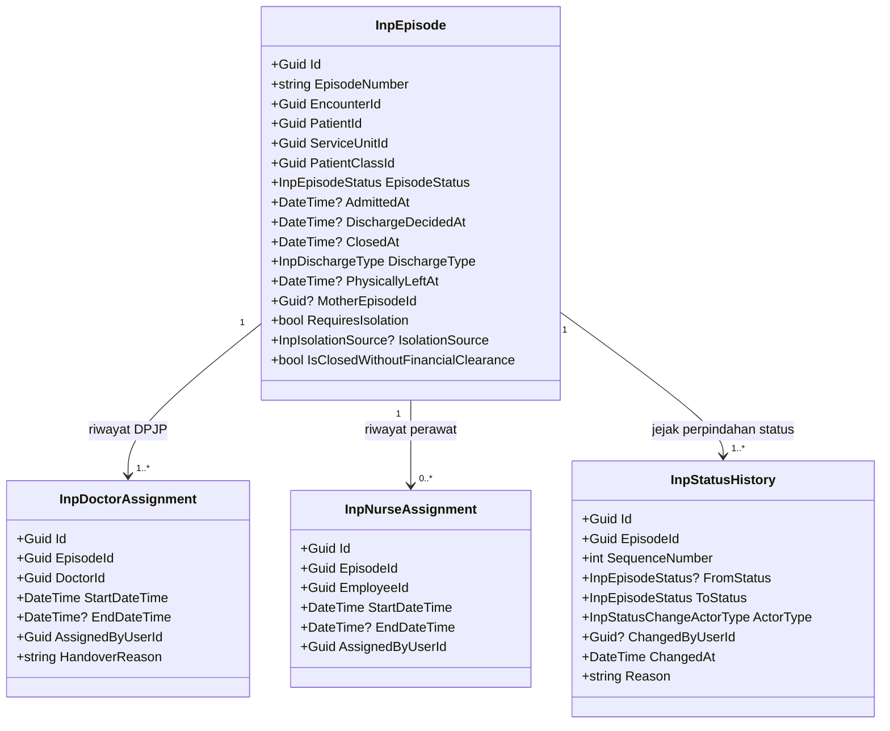
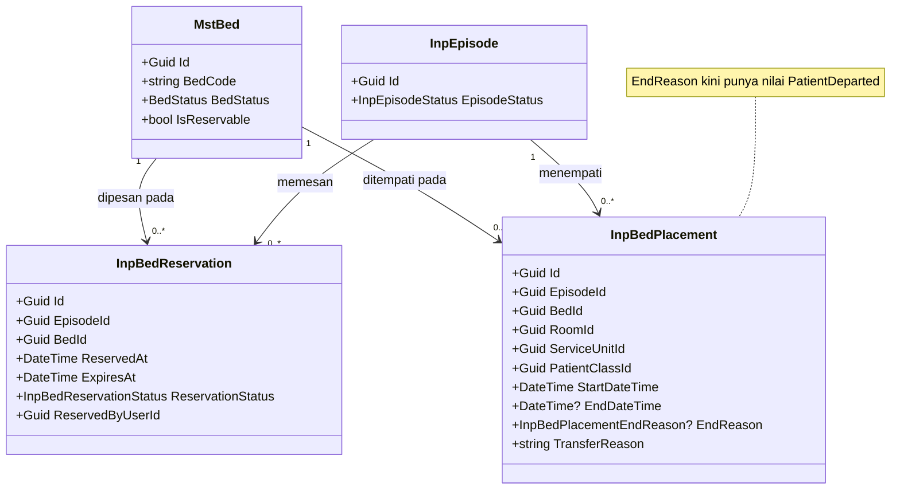
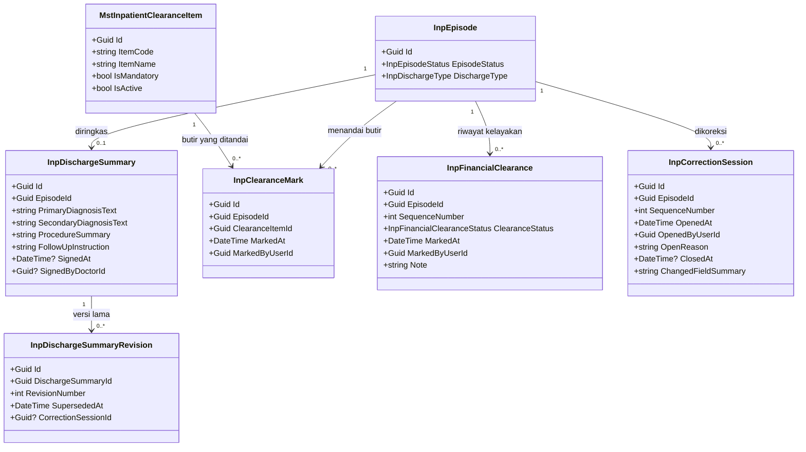
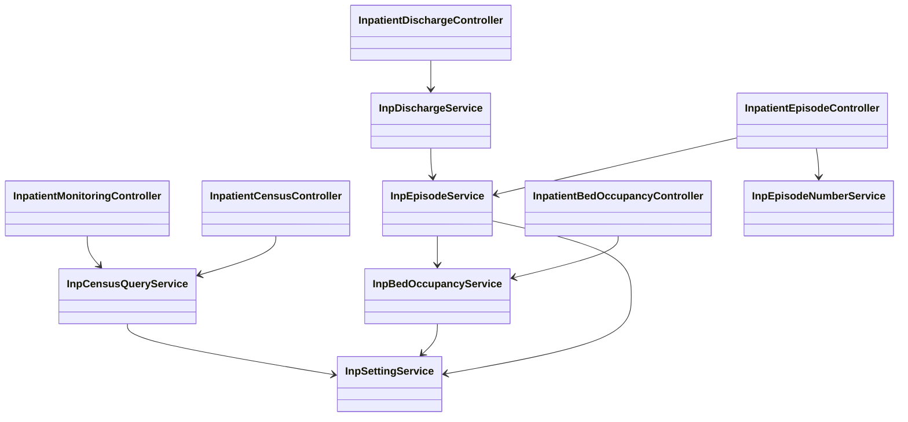

# Rawat Inap — Arsitektur Backend

| Field | Nilai |
| --- | --- |
| Blueprint ID | `RWI-BP-001` |
| Revision | `0.5` |
| Status | `draft` — belum disetujui manusia |
| Sub-modul | `episode-rawat-inap` — satu dari tiga sub-modul modul `rawat-inap`, bentuk `COMPOSITE` sejak `RWI-DEC-082`. [Manifest sub-modul](./blueprint-manifest.md), [peta modul](../02-module-map.md) |
| Tanggal | 2 September 2026 (`Asia/Jakarta`) untuk revision `0.5`; 24 Agustus 2026 untuk `0.4`; 21 Agustus 2026 untuk `0.3` |
| Apa yang berubah pada `0.5` | **Hanya batas dokumen, bukan isi desain.** Tabel kepemilikan data seluruh modul (bagian 2) dan urutan migration antar sub-modul (bagian 7) naik ke [`../02-module-map.md`](../02-module-map.md). Nol tabel, kolom, endpoint, aturan, dan kontrak yang bergerak |
| Modul | `InPatientManagement`, prefix entity `Inp`, lifecycle registry `ACTIVE` sejak `RWI-DEC-068` |
| Masukan arsitektur domain | [`evidence/03-hospital-domain-architecture.md`](../evidence/03-hospital-domain-architecture.md) revision `0.1`, kesiapan `DOMAIN_ARCHITECTURE_PARTIAL` |
| Masukan requirement | [`evidence/02-requirement-completeness-gate.md`](../evidence/02-requirement-completeness-gate.md) revision `1.0`, kesiapan `PARTIALLY_READY` |
| Masukan keputusan | [`00-interview-decisions.md`](../00-interview-decisions.md) revision `6` |
| Masukan keadaan saat ini | [`01-existing-capability-map.md`](../01-existing-capability-map.md) revision `1.2` |
| Backend SHA | `5afb54bd75281648010e50ef14f43ca1f80d8efd` |
| Frontend SHA | `dec4fdeff07c3c96ad9f07f41f184c54cf771371` |
| Scope | Sembilan slice pada arsitektur domain bagian N.2, **ditambah `INP-S11`** penempatan menurut jenis kelamin dan isolasi yang terbuka sejak `RWI-DEC-064` |
| Batas tulis | Hanya dokumen blueprint. Tidak ada source, migration, atau database yang disentuh |

### Perubahan pada revision `0.2`

Revision ini memasukkan empat keputusan Amendment Pass 2026-08-21. Tidak ada bagian revision `0.1`
yang dibatalkan; seluruhnya bersifat menambah atau melonggarkan.

| Keputusan | Yang berubah di dokumen ini |
| --- | --- |
| `RWI-DEC-054` | Invariant baru `INV-INP-10`, satu pasien satu episode yang benar-benar hadir. Ditegakkan unique index parsial |
| `RWI-DEC-055` | `INV-INP-01` dilonggarkan; dua kolom baru pada `InpEpisode`; satu nilai baru pada `InpBedPlacementEndReason`; satu perintah bisnis `CMD-INP-15` |
| `RWI-DEC-056` | Satu kolom opsional `MotherEpisodeId` pada `InpEpisode` |
| `RWI-DEC-057` | Satu tabel baru `InpDischargeSummaryRevision` |

`RWI-DEC-053` sengaja tidak mengubah apa pun: riwayat lokasi tetap dimiliki `InpBedPlacement`.

### Perubahan pada revision `0.3`

Revision ini memasukkan aturan keras jenis kelamin dan isolasi, yang sebelumnya berstatus slice
terhenti. **`INP-S11` kini masuk scope.**

| Keputusan | Yang berubah di dokumen ini |
| --- | --- |
| `RWI-DEC-064` | Jenis kelamin dan isolasi menjadi aturan yang **menolak penempatan**, bukan penyaring pencarian |
| `RWI-DEC-065` | Enam kolom baru pada `InpEpisode`, satu enum baru `InpIsolationSource`, satu perintah bisnis, satu endpoint, dan satu daftar pantau |
| `RWI-DEC-066` | Kelayakan Penempatan tumbuh dari tiga aturan menjadi delapan. **Tidak ada kolom baru pada `MstRoom`** |

Titik penyisipannya sudah disiapkan sejak revision `0.1`, sehingga tidak satu pun perintah bisnis
atau invariant yang harus dibongkar. Yang berubah hanyalah isi daftar aturan Kelayakan Penempatan.

### Perubahan pada revision `0.4`

Revision ini memasukkan empat keputusan Amendment Pass 2026-08-24. Keempatnya lahir dari tiga
usulan lintas modul yang datang dari blueprint IGD, bukan dari kebutuhan baru Rawat Inap.

| Keputusan | Yang berubah di dokumen ini |
| --- | --- |
| `RWI-DEC-070` | **Tidak ada.** Pelonggaran mesin klinis menyentuh `ClinicalManagement` dan `PharmacyManagement`; dokumentasi klinis rawat inap berada **di luar scope** dokumen ini sesuai bagian 2 |
| `RWI-DEC-071` | **Tidak ada.** Keputusannya tidak berubah, hanya justifikasinya yang ditulis ulang pada decision log |
| `RWI-DEC-072` | Kelayakan Penempatan tumbuh dari delapan aturan menjadi **sembilan**. Satu baris baru pada tabel kepemilikan data: catatan kepergian IGD **dibaca**, tidak ditulis |
| `RWI-DEC-073` | Satu baris baru pada tabel kepemilikan data: `TrxPatientEncounter.OriginEncounterId` **dibaca**, tidak ditulis dan tidak dibuat modul ini |

**Aturan 9 tidak menyala pada MVP.** Ia hanya berlaku bila episode lahir dari serah terima IGD,
dan jalur itu adalah `INP-S09` yang sengaja tidak dirancang pada revisi ini. Untuk seluruh task
MVP — `BE-RWI-011` termasuk — perilaku penempatan tidak berubah sama sekali. Aturannya ditulis
sekarang supaya tidak dikarang ulang ketika `INP-S09` akhirnya dikerjakan.
> **Peringatan.** Dokumen ini adalah **desain target**. Sejak `RWI-DEC-067` dan `RWI-DEC-068`
> penulisan source code sudah dibuka dan modul `InPatientManagement` berstatus `ACTIVE` pada
> registry, tetapi izinnya berlaku **satu task per pengerjaan** mengikuti roadmap — bukan izin
> membongkar desain ini. Dua gerbang implementasi masih terbuka: kesiapan data master, dan
> persetujuan pemilik `EmergencyInstallationManagement` yang hanya menahan `INP-S09`.

---

## 1. Bounded context, aggregate, dan batas transaksi

### 1.1 Dua context milik modul ini

| ID | Context | Tanggung jawab | Aggregate root |
| --- | --- | --- | --- |
| `CTX-INP-CARE` | Episode Perawatan Rawat Inap | Lifecycle satu episode menginap beserta penghunian tempat tidurnya | `InpEpisode` |
| `CTX-INP-CONFIG` | Konfigurasi Rawat Inap | Angka dan daftar yang boleh diubah admin | Tidak ada; seluruhnya data induk |

### 1.2 Aggregate `InpEpisode`

| Aspek | Isinya |
| --- | --- |
| Root | `InpEpisode` |
| Di dalam batas | `InpDoctorAssignment`, `InpNurseAssignment`, `InpBedReservation`, `InpBedPlacement`, `InpDischargeSummary`, `InpClearanceMark`, `InpFinancialClearance`, `InpStatusHistory`, `InpCorrectionSession` |
| Di luar batas | `TrxPatientEncounter`, `MstPatient`, `MstBed`, `MstRoom`, `MstServiceUnit`, `MstPatientClass`, `MstDoctor`, `MstEmployee` — seluruhnya dirujuk lewat Id saja |
| Kenapa satu aggregate | Pembatalan, perpindahan, dan penutupan menuntut episode dan penempatan berubah **bersamaan atau tidak sama sekali**. Dua aggregate yang selalu berubah dalam satu transaksi sebenarnya satu aggregate |

### 1.3 Invariant dan cara menjaganya

| ID | Invariant | Dijaga di mana |
| --- | --- | --- |
| `INV-INP-01` | Episode `Admitted` punya tepat satu penempatan aktif. Episode `DischargePending` punya tepat satu penempatan aktif **sampai kepergian fisik pasien dicatat**, setelah itu nol | `InpEpisodeService` di dalam transaksi. Dilonggarkan `RWI-DEC-055` |
| `INV-INP-02` | Satu tempat tidur dipegang paling banyak satu pemesanan aktif **atau** satu penempatan aktif | **Tidak dapat** dijaga aggregate. Dijaga dua unique index parsial ditambah penguncian baris `MstBed`. Lihat 1.4 |
| `INV-INP-03` | Episode belum `Closed`/`Cancelled` punya tepat satu DPJP aktif | Unique index parsial pada `InpDoctorAssignment` ditambah pemeriksaan service |
| `INV-INP-04` | Satu episode menempel pada tepat satu kunjungan, satu kunjungan menampung paling banyak satu episode | Unique index pada `InpEpisode.EncounterId` |
| `INV-INP-05` | Satu episode punya paling banyak satu resume pulang | Unique index pada `InpDischargeSummary.EpisodeId` |
| `INV-INP-06` | Episode `Closed` tidak dapat diubah kecuali ada sesi koreksi terbuka | `InpEpisodeService` |
| `INV-INP-07` | Pasien tidak pernah tercatat tanpa tempat tidur selama perpindahan | Satu transaksi database pada `InpBedOccupancyService.TransferAsync` |
| `INV-INP-08` | Setiap perpindahan status meninggalkan tepat satu baris riwayat | Satu pintu `InpEpisodeService.ApplyStatusChangeAsync` |
| `INV-INP-09` | Episode `Draft` boleh tanpa pemesanan maupun penempatan aktif | Tidak ada pemeriksaan; dinyatakan agar tidak keliru dibuat wajib |
| `INV-INP-10` | Satu pasien paling banyak punya **satu episode yang benar-benar hadir**, yaitu `Admitted`, atau `DischargePending` yang kepergiannya belum dicatat | **Tidak dapat** dijaga aggregate. Dijaga unique index parsial pada `InpEpisode`. Lihat 1.6 |

### 1.4 Cara menjaga `INV-INP-02` — bagian yang paling mudah salah

Aturan "satu tempat tidur satu pasien" melibatkan banyak episode sekaligus, sehingga tidak dapat
diperiksa dari dalam satu episode. Tiga lapis berikut dipakai bersama-sama:

| Lapis | Isinya | Kenapa perlu |
| --- | --- | --- |
| 1. Penguncian baris | Sebelum memesan, menempatkan, atau memindahkan, baris `MstBed` yang dituju dikunci di dalam transaksi | Mencegah dua permintaan membaca keadaan yang sama lalu sama-sama merasa boleh |
| 2. Unique index parsial pada penempatan | `BedId` unik untuk baris yang `EndDateTime IS NULL` | Jaring pengaman terakhir bila lapis 1 lolos |
| 3. Unique index parsial pada pemesanan | `BedId` unik untuk baris berstatus `Active` | Mencegah dua pemesanan pada tempat tidur yang sama |

Contoh kejadian yang dicegah: pukul 09:00:01 Sdri. Wati menempatkan Tn. Budi ke `BD-RSMMC-00042`.
Pada 09:00:01 juga, Sdri. Rina menempatkan Ny. Sari ke tempat tidur yang sama. Permintaan kedua
menunggu di lapis 1, lalu ditolak dengan pesan "Tempat tidur BD-RSMMC-00042 sudah ditempati pasien
lain" dan kode 409. Tidak ada satu baris penempatan ganda yang tersimpan.

### 1.5 Cara menjaga `INV-INP-10` — satu pasien satu episode yang hadir

Sama seperti `INV-INP-02`, aturan ini melibatkan banyak episode sekaligus sehingga tidak dapat
diperiksa dari dalam satu episode.

| Lapis | Isinya |
| --- | --- |
| 1. Pemeriksaan service | Sebelum menempatkan pasien, `InpEpisodeService` memeriksa apakah pasien itu sudah punya episode yang hadir. Bila ada, permintaan ditolak disertai nomor episode dan lokasi yang sedang ditempati |
| 2. Unique index parsial | `PatientId` unik untuk baris yang berstatus `Admitted`, **atau** berstatus `DischargePending` dengan `PhysicallyLeftAt` masih kosong |

**Kenapa "yang benar-benar hadir", bukan sekadar "yang belum ditutup".** Pasien yang sudah pulang
pukul 10:15 tetapi episodenya baru ditutup pukul 13:10 sesungguhnya sudah tidak dirawat. Bila ia
kembali dengan keluhan baru pukul 12:00, admisi barunya **tidak boleh** tertahan hanya karena
urusan administrasi episode lama belum beres. Karena itu batasnya kepergian fisik, bukan penutupan.

Inilah alasan `InpEpisode.PhysicallyLeftAt` disimpan sebagai kolom pada episode, bukan hanya
diturunkan dari baris penempatan: tanpa kolom itu, unique index parsial di atas tidak dapat
dirumuskan. Rinciannya pada catatan desain `InpEpisode` di bagian 4.1.

### 1.6 Batas transaksi

| Operasi | Yang berubah di dalam satu transaksi |
| --- | --- |
| Tempatkan pasien | `InpEpisode.EpisodeStatus`, `InpBedReservation` menjadi `Consumed`, `InpBedPlacement` baru, `MstBed.BedStatus` menjadi `Occupied`, `InpStatusHistory` baru |
| Pindahkan pasien | `InpBedPlacement` lama ditutup, `InpBedPlacement` baru dibuka, `MstBed` lama menjadi `Available`, `MstBed` baru menjadi `Occupied`, `InpStatusHistory` baru |
| Batalkan admisi | `InpEpisode.EpisodeStatus` menjadi `Cancelled`, pemesanan dan penempatan ditutup, `MstBed` menjadi `Available`, `InpStatusHistory` baru |
| Catat kepergian fisik pasien | `InpEpisode.PhysicallyLeftAt` dan `PhysicallyLeftByUserId` terisi, `InpBedPlacement` ditutup dengan `EndReason = PatientDeparted`, `MstBed.BedStatus` menjadi `Available`. **Status episode tidak berubah** |
| Tutup episode | `InpEpisode.EpisodeStatus` menjadi `Closed`, penempatan ditutup bila masih ada, DPJP dan perawat aktif ditutup, `MstBed` menjadi `Available` bila masih dipegang, `InpStatusHistory` baru |
| Koreksi resume yang sudah ditandatangani | `InpDischargeSummaryRevision` baru menyimpan salinan versi lama, `InpDischargeSummary` diperbarui |

Bila salah satu gagal, seluruhnya dibatalkan. Tidak ada keadaan setengah jadi.

**Satu catatan tentang baris kepergian fisik.** Tindakan ini **tidak** menulis `InpStatusHistory`,
karena status episode memang tidak berubah. Jejaknya tersimpan pada baris penempatan yang ditutup —
lengkap dengan waktu, pelaku, dan alasan berakhirnya — ditambah dua kolom pada episode. Ini
konsisten dengan `RWI-RULE-031` aturan 3 yang mewajibkan riwayat untuk **perubahan status**, bukan
untuk setiap tindakan.

### 1.7 Kelayakan Penempatan

Perintah menempatkan dan memindahkan pasien tidak memeriksa syarat satu per satu di dalam badannya,
melainkan memanggil satu pemeriksaan bernama **Kelayakan Penempatan** yang isinya berupa daftar
aturan. Sejak revision `0.4` daftar itu berisi sembilan aturan.

| No | Aturan | Kode penolakan | Dasar |
| ---: | --- | ---: | --- |
| 1 | Tempat tidur aktif dan tidak sedang `Cleaning`, `Maintenance`, atau `Blocked` | 422 | `RWI-RULE-001` |
| 2 | Tempat tidur tidak sedang dipegang pemesanan atau penempatan milik episode lain | 409 | `INV-INP-02` |
| 3 | Bila ada pemesanan milik episode ini yang masih berlaku, pemesanan itu dipakai | — | `RWI-RULE-015` |
| 4 | Penanda tempat tidur menerima jenis kelamin pasien | 422 | `RWI-RULE-012` B.1 |
| 5 | Bila jenis kelamin pasien belum tercatat, tempat tidur harus menerima keduanya **dan** kamar belum berpenghuni | 422 | `RWI-RULE-012` B.2 |
| 6 | Kamar belum dihuni pasien berjenis kelamin berbeda | 422 | `RWI-RULE-012` B.3 |
| 7 | Pasien yang membutuhkan isolasi hanya boleh ke tempat tidur isolasi | 422 | `RWI-RULE-012` A.5 |
| 8 | Pasien yang tidak membutuhkan isolasi tidak boleh ke tempat tidur isolasi | 422 | `RWI-RULE-012` A.6 |
| 9 | Bila episode lahir dari serah terima IGD, catatan kepergian IGD sudah bertanda `Tiba` | 422 | `RWI-RULE-029` aturan 8 |

**Dua pengecualian boks bayi**, dan keduanya berlaku dua arah:

| Pengecualian | Isinya |
| --- | --- |
| Menempatkan **ke** boks bayi | Aturan 4, 5, dan 6 dilewati. Bayi laki-laki boleh menempati boks di kamar ibunya |
| Penghuni yang **berada di** boks bayi | Tidak dihitung saat aturan 6 memeriksa penghuni kamar. Bayi tidak menutup kamar bagi pasien lain |

**Aturan 9 punya lingkup yang sempit.** Ia hanya diperiksa bila episode punya kunjungan asal,
yaitu bila `TrxPatientEncounter.OriginEncounterId` terisi. Untuk pasien datang langsung dan
pasien poliklinik aturan ini dilewati begitu saja, dan `InpBedPlacement.StartDateTime` tetap
diisi waktu penempatan dibuat. Karena jalur serah terima IGD adalah `INP-S09` yang di luar
scope revisi ini, pada MVP aturan 9 tidak pernah menyala.

Aturan 6 diperiksa dari **penghuni yang sedang ada**, bukan dari penanda pada master kamar.
Alasannya ada pada `RWI-DEC-066`: penanda `MstRoom.IsForMale` dan `IsForFemale` bernilai benar
secara bawaan untuk setiap kamar, sehingga tidak dapat membedakan kamar yang boleh campur.

**Kenapa bentuk daftar ini penting.** Bentuk ini dipilih sejak revision `0.1` justru supaya aturan
jenis kelamin dan isolasi dapat ditambahkan tanpa membongkar perintah penempatan maupun
perpindahan. Pada revision `0.3` bentuk itu terbukti: lima aturan bertambah, dan tidak satu baris
pun perintah bisnisnya berubah. Pada revision `0.4` bertambah satu aturan lagi, dan sekali lagi
tidak ada perintah bisnis yang disentuh.

Pemeriksaan ini mengembalikan **daftar aturan yang gagal**, bukan hanya boleh atau tidak, supaya
layar dapat menyebut alasan pastinya kepada petugas.

---

## 2. Tabel kepemilikan data

> **Pindah tempat 2026-09-02 — `RWI-DEC-082`.** Modul Rawat Inap kini berbentuk `COMPOSITE` dengan
> tiga sub-modul. Tabel kepemilikan data **seluruh modul** karena itu naik ke
> [`../02-module-map.md`](../02-module-map.md) bagian 2, supaya tidak ada tiga salinannya yang
> diam-diam berbeda isi. Yang tinggal di bawah ini **hanya kelompok data milik sub-modul
> `episode-rawat-inap` sendiri**.
>
> Data milik modul lain yang dipakai sub-modul ini — pasien, kunjungan, penjamin, tempat tidur,
> dokter, pegawai, surat keterangan medis, disposisi IGD — beserta seluruh data milik
> `keperawatan` dan `dokter-rawat-inap`, dibaca di `02-module-map.md`, **bukan di sini**.

Setiap baris "Dibuat ulang di modul ini" yang berisi "Ya" wajib punya alasan.

| Kelompok data | Modul pemilik | Dipakai sub-modul ini | Dibuat ulang di modul ini |
| --- | --- | :---: | --- |
| Episode rawat inap | **InPatient Management** — `episode-rawat-inap` | Ya | **Ya** — konsep baru, tidak ada pemiliknya di mana pun |
| Pemesanan dan penempatan tempat tidur | **InPatient Management** — `episode-rawat-inap` | Ya | **Ya** — konsep baru; hari ini tidak ada satu pun catatan penghunian di dalam sistem |
| Penanggung jawab episode (DPJP dan perawat) | **InPatient Management** — `episode-rawat-inap` | Ya | **Ya** — berbentuk riwayat berperiode, berbeda dari kolom dokter pada kunjungan |
| Resume pulang beserta versinya | **InPatient Management** — `episode-rawat-inap` | Ya | **Ya** — catatan resmi episode, berbeda dari surat keterangan milik Clinical Management. `CAP-026` tetap milik sub-modul ini walaupun ditulis DPJP, sesuai `RWI-DEC-083` |
| Daftar periksa administrasi dan penandaannya | **InPatient Management** — `episode-rawat-inap` | Ya | **Ya** — butir per rumah sakit, dapat diubah admin |
| Riwayat status episode | **InPatient Management** — `episode-rawat-inap` | Ya | **Ya** — jejak yang tidak dapat dihapus |
| Sesi koreksi episode | **InPatient Management** — `episode-rawat-inap` | Ya | **Ya** — konsep tersendiri, bukan status episode keenam |
| Pengaturan Rawat Inap yang dapat diubah admin | **InPatient Management** — `episode-rawat-inap` | Ya | **Ya** — mengikuti pola `MstEmergencySetting` |
| Kelayakan keuangan | **BELUM DIPUTUSKAN** — `RWI-OQ-047` | Ya | **Ya, sementara** — `RWI-RULE-028` aturan 7 memilikinya sampai `BillingManagement` punya kemampuan transaksi, sedangkan `PRD-RWI-FINAL-001` bagian 23.1 menaruhnya pada Billing. Pertentangan ini terbuka; lihat `02-module-map.md` bagian 2.4 |

**Satu baris yang berpindah keluar dari sub-modul ini.** Baris "Dokumentasi klinis, resep, tindakan"
dulu tercatat di sini sebagai "di luar scope, menunggu `DEC-INP-001`". Keterangan itu **basi** pada
dua hal sekaligus: `DEC-INP-001` sudah tertutup 2026-08-21 lewat `RWI-DEC-062`, dan sejak
`RWI-DEC-080` dokumentasi klinis **masuk scope modul**. `RWI-DEC-081` menetapkan pemilik tabelnya
adalah `ClinicalManagement`, dan `RWI-DEC-083` memberikan kemampuannya kepada sub-modul
`keperawatan` serta `dokter-rawat-inap` — bukan kepada sub-modul ini. Barisnya karena itu dibaca di
[`../02-module-map.md`](../02-module-map.md) bagian 2.3.

### 2.1 Satu-satunya penulisan lintas modul

`RWI-DEC-039` menetapkan kolom `MstBed.BedStatus` turun kedudukan menjadi **salinan** dari catatan
penempatan milik Rawat Inap. Artinya modul ini menulis ke dalam tabel milik Master Data.

| Hal | Ketetapannya |
| --- | --- |
| Siapa pemilik tabel `MstBed` | Master Data HealthServices, tidak berubah |
| Siapa pemilik makna penghunian | InPatient Management |
| Nilai yang boleh ditulis Rawat Inap | Hanya `Available`, `Reserved`, dan `Occupied` |
| Nilai yang tetap wewenang admin | `Cleaning`, `Maintenance`, `Blocked`, `Inactive` |
| Pengaman | Laporan selisih pada `InpCensusQueryService.GetBedDriftAsync` |
| Persetujuan yang dibutuhkan | Pemilik Master Data, tercatat sebagai `RWI-OQ-033` — **sudah diberikan** 2026-08-21 lewat `RWI-DEC-062` |

---

## 3. Class diagram

Diagram dipecah supaya masing-masing muat dibaca dalam satu layar.

### 3.1 Inti episode dan penanggung jawab



### 3.2 Penghunian tempat tidur



### 3.3 Pemulangan, kelayakan, dan koreksi



### 3.4 Service dan controller



---

## 4. Penjelasan setiap class

Seluruh model mewarisi `IdentityModel`, sehingga sudah punya sepuluh kolom audit. Kolom itu tidak
diulang pada tabel di bawah.

### 4.1 `InpEpisode`

| Aspek | Penjelasan |
| --- | --- |
| **Status** | `Baru` |
| **Lokasi file** | `Areas/HealthServices/InPatientManagement/Models/InpEpisode.cs` |
| Kategori | Transaksi Rawat Inap — aggregate root |
| Tanggung jawab utama | Menyimpan satu episode perawatan menginap: dari admisi dibuka sampai episode ditutup. Seluruh catatan lain menempel padanya |
| Field penting | `EpisodeNumber`, `EncounterId`, `PatientId`, `ServiceUnitId`, `PatientClassId`, `EpisodeStatus`, `AdmittedAt`, `DischargeDecidedAt`, `PhysicallyLeftAt`, `PhysicallyLeftByUserId`, `ClosedAt`, `DischargeType`, `MotherEpisodeId`, **`RequiresIsolation`**, **`IsolationSource`**, **`IsolationSetByUserId`**, **`IsolationSetByDoctorId`**, **`IsolationSetAt`**, **`IsolationNote`**, `IsClosedWithoutFinancialClearance`, `CancelReason` |
| Navigation property dan relasi | Menunjuk `TrxPatientEncounter`, `MstPatient`, `MstServiceUnit`, `MstPatientClass`. Memiliki `InpDoctorAssignment`, `InpNurseAssignment`, `InpBedReservation`, `InpBedPlacement`, `InpDischargeSummary`, `InpClearanceMark`, `InpFinancialClearance`, `InpStatusHistory`, `InpCorrectionSession` |
| Pemakaian dalam alur bisnis | Dibuat petugas admisi saat membuka admisi, dan hidup sampai episode ditutup |
| Catatan desain | `PatientId` disimpan sebagai salinan dari kunjungan **hanya** untuk mempercepat census dan laporan; kunjungan tetap sumber kebenarannya. Jangan menyimpan lokasi terakhir di sini — lokasi selalu dibaca dari `InpBedPlacement`. `PhysicallyLeftAt` **bukan** duplikasi baris penempatan: baris penempatan mencatat *kenapa penempatan berakhir*, sedangkan kolom ini mencatat *apakah pasien sudah pergi*, dan keberadaannya diperlukan supaya `INV-INP-10` dapat ditegakkan unique index parsial. Keduanya ditulis dalam transaksi yang sama. `MotherEpisodeId` menunjuk episode ibu pada kasus bayi rawat gabung, boleh kosong, dan **tidak boleh** menunjuk episode milik pasien yang sama. `RequiresIsolation` beserta lima kolom pendampingnya menyimpan **nilai yang berlaku sekarang** — bukan riwayat. Konsekuensinya dinyatakan pada bagian 9 |
| Ekuivalen model lama | — |

### 4.2 `InpDoctorAssignment`

| Aspek | Penjelasan |
| --- | --- |
| **Status** | `Baru` |
| **Lokasi file** | `Areas/HealthServices/InPatientManagement/Models/InpDoctorAssignment.cs` |
| Kategori | Transaksi Rawat Inap |
| Tanggung jawab utama | Menyimpan **riwayat** siapa DPJP episode ini dan sejak kapan sampai kapan. Pengalihan membuat baris baru, tidak menimpa baris lama |
| Field penting | `EpisodeId`, `DoctorId`, `StartDateTime`, `EndDateTime`, `AssignedByUserId`, `HandoverReason` |
| Navigation property dan relasi | Milik `InpEpisode`; menunjuk `MstDoctor` |
| Pemakaian dalam alur bisnis | Baris pertama dibuat saat admisi dibuka. Baris berikutnya dibuat saat DPJP dialihkan, misalnya karena cuti |
| Catatan desain | **Jangan** mengganti pola ini dengan satu kolom `DoctorId` pada episode. Tanpa riwayat, sistem tidak dapat membuktikan bahwa perpindahan pasien kemarin diminta dokter yang saat itu memang berwenang |
| Ekuivalen model lama | — |

### 4.3 `InpNurseAssignment`

| Aspek | Penjelasan |
| --- | --- |
| **Status** | `Baru` |
| **Lokasi file** | `Areas/HealthServices/InPatientManagement/Models/InpNurseAssignment.cs` |
| Kategori | Transaksi Rawat Inap |
| Tanggung jawab utama | Menyimpan riwayat perawat penanggung jawab episode |
| Field penting | `EpisodeId`, `EmployeeId`, `StartDateTime`, `EndDateTime`, `AssignedByUserId` |
| Navigation property dan relasi | Milik `InpEpisode`; menunjuk `MstEmployee` |
| Pemakaian dalam alur bisnis | Diisi kepala ruangan setelah pasien menempati tempat tidur, dan setiap kali berganti |
| Catatan desain | Boleh kosong. Episode tanpa perawat **tidak** menahan tindakan apa pun; ia hanya muncul pada daftar pantau kepala ruangan |
| Ekuivalen model lama | — |

### 4.4 `InpBedReservation`

| Aspek | Penjelasan |
| --- | --- |
| **Status** | `Baru` |
| **Lokasi file** | `Areas/HealthServices/InPatientManagement/Models/InpBedReservation.cs` |
| Kategori | Transaksi Rawat Inap |
| Tanggung jawab utama | Mengunci satu tempat tidur untuk satu calon pasien selama batas waktu tertentu |
| Field penting | `EpisodeId`, `BedId`, `ReservedAt`, `ExpiresAt`, `ReservationStatus`, `ReservedByUserId` |
| Navigation property dan relasi | Milik `InpEpisode`; menunjuk `MstBed` |
| Pemakaian dalam alur bisnis | Dibuat petugas admisi saat memilih tempat tidur, sebelum pasien datang ke kamar |
| Catatan desain | Kedaluwarsa **dihitung saat data dibaca**, bukan oleh program penjadwal. `ExpiresAt` diisi dari `MstInpatientSetting.BedReservationMinutes` pada saat pemesanan dibuat, sehingga perubahan pengaturan tidak mengubah pemesanan yang sudah berjalan |
| Ekuivalen model lama | — |

### 4.5 `InpBedPlacement`

| Aspek | Penjelasan |
| --- | --- |
| **Status** | `Baru` |
| **Lokasi file** | `Areas/HealthServices/InPatientManagement/Models/InpBedPlacement.cs` |
| Kategori | Transaksi Rawat Inap |
| Tanggung jawab utama | **Sumber kebenaran penghunian tempat tidur.** Satu baris per tempat tidur yang pernah ditempati, lengkap dengan waktu mulai dan waktu berakhir |
| Field penting | `EpisodeId`, `BedId`, `RoomId`, `ServiceUnitId`, `PatientClassId`, `StartDateTime`, `EndDateTime`, `EndReason`, `TransferReason`, `PlacedByUserId`, `EndedByUserId` |
| Navigation property dan relasi | Milik `InpEpisode`; menunjuk `MstBed`, `MstRoom`, `MstServiceUnit`, `MstPatientClass` |
| Pemakaian dalam alur bisnis | Dibuat saat pasien menempati tempat tidur, ditutup saat pasien pindah atau episode berakhir |
| Asal `StartDateTime` | Jalur datang langsung dan poliklinik: waktu penempatan dibuat. Episode yang lahir dari serah terima IGD: **dibaca dari event `Tiba`** pada catatan kepergian IGD, tidak pernah ditetapkan modul ini dan tidak pernah dikoreksi setelah tersimpan, sesuai `RWI-DEC-072`. Bentuk kolomnya tidak berubah |
| Catatan desain | `RoomId`, `ServiceUnitId`, dan `PatientClassId` adalah **salinan saat penempatan dibuat**, bukan pembacaan langsung. Kalau kamar dipindahkan ke kelas lain tahun depan, riwayat tahun ini tetap menunjukkan kelas yang benar-benar berlaku saat itu. Inilah yang membuat `RWI-RULE-007` dapat dijalankan |
| Ekuivalen model lama | — |

### 4.6 `InpDischargeSummary`

| Aspek | Penjelasan |
| --- | --- |
| **Status** | `Baru` |
| **Lokasi file** | `Areas/HealthServices/InPatientManagement/Models/InpDischargeSummary.cs` |
| Kategori | Transaksi Rawat Inap |
| Tanggung jawab utama | Ringkasan resmi perawatan milik episode, ditandatangani DPJP, dan menjadi syarat penutupan |
| Field penting | `EpisodeId`, `PrimaryDiagnosisText`, `SecondaryDiagnosisText`, `ProcedureSummary`, `DischargeMedicationNote`, `FollowUpInstruction`, `ReferralDestination`, `SignedAt`, `SignedByDoctorId` |
| Navigation property dan relasi | Milik `InpEpisode`; menunjuk `MstDoctor` sebagai penandatangan |
| Pemakaian dalam alur bisnis | Disusun DPJP setelah keputusan pulang, ditandatangani sebelum episode ditutup |
| Catatan desain | Isi diagnosis disimpan sebagai teks pada MVP, **bukan** rujukan ke diagnosis klinis, karena modul Clinical masih di luar scope. Ketika `DEC-INP-001` turun, kolom teks itu dilengkapi rujukan tanpa mengubah bentuk tabel. Seluruh kolom isi bertanda **sensitif** |
| Ekuivalen model lama | — |

### 4.7 `InpDischargeSummaryRevision`

| Aspek | Penjelasan |
| --- | --- |
| **Status** | `Baru` — ditambahkan pada revision `0.2` |
| **Lokasi file** | `Areas/HealthServices/InPatientManagement/Models/InpDischargeSummaryRevision.cs` |
| Kategori | Transaksi Rawat Inap |
| Tanggung jawab utama | Menyimpan salinan resume pulang **versi sebelumnya**, setiap kali resume yang sudah ditandatangani diubah |
| Field penting | `DischargeSummaryId`, `RevisionNumber`, seluruh kolom isi resume sebagai salinan, `PreviousSignedAt`, `PreviousSignedByDoctorId`, `SupersededAt`, `SupersededByUserId`, `CorrectionSessionId` |
| Navigation property dan relasi | Milik `InpDischargeSummary`; menunjuk `InpCorrectionSession` bila perubahan lahir dari sesi koreksi |
| Pemakaian dalam alur bisnis | Dibuat otomatis saat supervisor mengubah resume yang sudah ditandatangani lewat sesi koreksi |
| Catatan desain | **Hanya versi yang sudah ditandatangani** yang disalin. Penyuntingan sebelum tanda tangan menimpa biasa tanpa membuat versi, sesuai `RWI-DEC-057`. Baris ini **tidak dapat diubah dan tidak dapat dihapus**; tidak disediakan endpoint update maupun delete. `InpDischargeSummary` tetap menyimpan versi yang berlaku, sehingga `INV-INP-05` tidak berubah |
| Ekuivalen model lama | — |

### 4.8 `InpClearanceMark`

| Aspek | Penjelasan |
| --- | --- |
| **Status** | `Baru` |
| **Lokasi file** | `Areas/HealthServices/InPatientManagement/Models/InpClearanceMark.cs` |
| Kategori | Transaksi Rawat Inap |
| Tanggung jawab utama | Mencatat butir daftar periksa administrasi mana yang sudah ditandai untuk episode ini |
| Field penting | `EpisodeId`, `ClearanceItemId`, `MarkedAt`, `MarkedByUserId`, `Note` |
| Navigation property dan relasi | Milik `InpEpisode`; menunjuk `MstInpatientClearanceItem` |
| Pemakaian dalam alur bisnis | Ditandai petugas admisi selama episode berstatus rencana pulang |
| Catatan desain | Butir yang **wajib** ditentukan master, bukan program. Butir yang dinonaktifkan admin tidak lagi menahan penutupan, dan penandaan lama tetap tersimpan |
| Ekuivalen model lama | — |

### 4.9 `InpFinancialClearance`

| Aspek | Penjelasan |
| --- | --- |
| **Status** | `Baru` |
| **Lokasi file** | `Areas/HealthServices/InPatientManagement/Models/InpFinancialClearance.cs` |
| Kategori | Transaksi Rawat Inap |
| Tanggung jawab utama | Menyimpan riwayat penandaan kelayakan keuangan episode |
| Field penting | `EpisodeId`, `SequenceNumber`, `ClearanceStatus`, `MarkedAt`, `MarkedByUserId`, `Note`, `IsManualMarking` |
| Navigation property dan relasi | Milik `InpEpisode` |
| Pemakaian dalam alur bisnis | Ditandai petugas kasir atau billing sebelum episode ditutup |
| Catatan desain | Kolom `IsManualMarking` selalu `true` selama MVP, dan wajib ditampilkan pada layar serta laporan. Ketika `BillingManagement` operasional, sumber nilainya berpindah dan kolom itu menjadi `false` — **aturan penutupannya tidak berubah**, sesuai `RWI-RULE-028` aturan 7 |
| Ekuivalen model lama | — |

### 4.10 `InpStatusHistory`

| Aspek | Penjelasan |
| --- | --- |
| **Status** | `Baru` |
| **Lokasi file** | `Areas/HealthServices/InPatientManagement/Models/InpStatusHistory.cs` |
| Kategori | Transaksi Rawat Inap |
| Tanggung jawab utama | Jejak setiap perpindahan status episode: dari apa, ke apa, oleh siapa, kapan, dan kenapa |
| Field penting | `EpisodeId`, `SequenceNumber`, `FromStatus`, `ToStatus`, `ActionType`, `ActorType`, `ChangedByUserId`, `ChangedAt`, `Reason` |
| Navigation property dan relasi | Milik `InpEpisode` |
| Pemakaian dalam alur bisnis | Ditulis otomatis setiap kali status berubah. Tidak pernah diisi manual |
| Catatan desain | Baris ini **tidak boleh** diubah dan **tidak boleh** dihapus; tidak disediakan endpoint update maupun delete. Perubahan yang dihitung sistem — pemesanan gugur dan episode `Draft` telantar — diberi `ActorType = System` dan `ChangedByUserId` kosong, sesuai `RWI-RULE-031` aturan 6 |
| Ekuivalen model lama | Pola diambil dari `TrxWorkflowStatusHistory` milik modul Workflow, tetapi **tidak** menumpang padanya |

### 4.11 `InpCorrectionSession`

| Aspek | Penjelasan |
| --- | --- |
| **Status** | `Baru` |
| **Lokasi file** | `Areas/HealthServices/InPatientManagement/Models/InpCorrectionSession.cs` |
| Kategori | Transaksi Rawat Inap |
| Tanggung jawab utama | Membuka jendela waktu bagi supervisor untuk membetulkan catatan episode yang sudah ditutup, **tanpa** mengubah status episodenya |
| Field penting | `EpisodeId`, `SequenceNumber`, `OpenedAt`, `OpenedByUserId`, `OpenReason`, `ClosedAt`, `ClosedByUserId`, `ChangedFieldSummary` |
| Navigation property dan relasi | Milik `InpEpisode` |
| Pemakaian dalam alur bisnis | Dibuka supervisor untuk mengoreksi cara pulang, diagnosis pada resume, atau catatan lain |
| Catatan desain | Status episode **tetap** `Closed` selama sesi berjalan, sehingga `RWI-DEC-009` dan `RWI-AC-004` tidak dilanggar. Karena status tidak berubah, `InpStatusHistory` tidak akan mencatat apa pun — itulah sebabnya `ChangedFieldSummary` wajib diisi saat sesi ditutup. Tanpa itu, koreksi menjadi satu-satunya perubahan yang tidak berjejak |
| Ekuivalen model lama | — |

### 4.12 `MstInpatientSetting`

| Aspek | Penjelasan |
| --- | --- |
| **Status** | `Baru` |
| **Lokasi file** | `Areas/HealthServices/MasterData/Models/MstInpatientSetting.cs` |
| Kategori | Master Data HealthServices |
| Tanggung jawab utama | Menyimpan seluruh angka yang boleh diubah admin, dalam satu tempat |
| Field penting | `Code`, `Name`, `BedReservationMinutes`, `DraftEpisodeExpiryHours`, `InitialAssessmentTargetHours`, `ProgressNoteVerificationTargetHours`, `PendingClosureThresholdHours`, `EpisodeNumberPrefix`, `IsDefault`, `IsActive` |
| Navigation property dan relasi | Tidak ada |
| Pemakaian dalam alur bisnis | Dibaca setiap kali sistem perlu tahu batas waktu; diubah admin lewat layar pengaturan |
| Catatan desain | Mengikuti pola `MstEmergencySetting` yang sudah dipakai IGD. Nilai **tidak boleh** ditanam di controller maupun frontend. Perubahan berlaku pada pembacaan berikutnya tanpa aplikasi dinyalakan ulang |
| Ekuivalen model lama | — |

### 4.13 `MstInpatientClearanceItem`

| Aspek | Penjelasan |
| --- | --- |
| **Status** | `Baru` |
| **Lokasi file** | `Areas/HealthServices/MasterData/Models/MstInpatientClearanceItem.cs` |
| Kategori | Master Data HealthServices |
| Tanggung jawab utama | Daftar butir yang harus ditandai sebelum episode boleh ditutup |
| Field penting | `ItemCode`, `ItemName`, `Description`, `IsMandatory`, `SortOrder`, `IsActive` |
| Navigation property dan relasi | Memiliki banyak `InpClearanceMark` |
| Pemakaian dalam alur bisnis | Dibaca saat memeriksa syarat penutupan; ditambah dan dinonaktifkan admin |
| Catatan desain | Butirnya **daftar baris**, bukan satu nilai, sehingga sengaja tidak disatukan ke `MstInpatientSetting` |
| Ekuivalen model lama | — |

### 4.14 `InpEpisodeService`

| Aspek | Penjelasan |
| --- | --- |
| **Status** | `Baru` |
| **Lokasi file** | `Areas/HealthServices/InPatientManagement/Services/InpEpisodeService.cs` |
| Kategori | Service |
| Tanggung jawab utama | Satu-satunya pintu perubahan status episode, penugasan DPJP, dan penugasan perawat |
| Dipanggil oleh | `InpatientEpisodeController`, `InpDischargeService` |
| Membuka transaksi database | **Ya** — untuk pengaktifan, pembatalan, dan penutupan |
| Catatan desain | Method `ApplyStatusChangeAsync` adalah satu-satunya tempat status boleh berubah, dan ia selalu menulis `InpStatusHistory` di dalam transaksi yang sama. Tidak boleh ada controller yang menyetel `EpisodeStatus` langsung. Penjaga kewenangan DPJP juga di sini, bukan di mesin hak akses. Sejak revision `0.2` service ini memeriksa `INV-INP-10` sebelum menempatkan pasien; sejak revision `0.3` ia juga mengurus `SetIsolationRequirementAsync` beserta penjaga siapa yang boleh mengubahnya |

### 4.15 `InpBedOccupancyService`

| Aspek | Penjelasan |
| --- | --- |
| **Status** | `Baru` |
| **Lokasi file** | `Areas/HealthServices/InPatientManagement/Services/InpBedOccupancyService.cs` |
| Kategori | Service |
| Tanggung jawab utama | Memesan, menempatkan, memindahkan, dan melepas tempat tidur; menghitung kedaluwarsa pemesanan saat dibaca; memperbarui salinan status pada `MstBed` |
| Dipanggil oleh | `InpatientBedOccupancyController`, `InpEpisodeService` |
| Membuka transaksi database | **Ya** — seluruh operasinya |
| Catatan desain | Method `TransferAsync` menutup penempatan lama dan membuka penempatan baru **dalam satu transaksi**; tidak boleh dipecah menjadi dua panggilan. Pemeriksaan `EvaluatePlacementEligibility` berbentuk daftar aturan, dan sejak revision `0.3` daftar itu berisi delapan aturan termasuk jenis kelamin dan isolasi. Method itu mengembalikan **daftar aturan yang gagal**, bukan hanya boleh atau tidak, supaya layar dapat menyebut alasan pastinya |

### 4.16 `InpDischargeService`

| Aspek | Penjelasan |
| --- | --- |
| **Status** | `Baru` |
| **Lokasi file** | `Areas/HealthServices/InPatientManagement/Services/InpDischargeService.cs` |
| Kategori | Service |
| Tanggung jawab utama | Keputusan pulang, resume pulang, penandaan daftar periksa, penandaan kelayakan keuangan, dan pemeriksaan lima syarat penutupan |
| Dipanggil oleh | `InpatientDischargeController` |
| Membuka transaksi database | Ya, untuk penandatanganan resume dan pemeriksaan penutupan |
| Catatan desain | Method `EvaluateClosureReadinessAsync` mengembalikan daftar syarat yang belum terpenuhi, bukan sekadar boleh atau tidak. Ini supaya layar dapat menampilkan alasan pastinya kepada petugas. Sejak revision `0.2`, service ini juga mengurus `RecordPatientDepartureAsync` yang melepas tempat tidur tanpa mengubah status episode, dan penyalinan versi resume saat resume yang sudah ditandatangani diubah |

### 4.17 `InpCensusQueryService`

| Aspek | Penjelasan |
| --- | --- |
| **Status** | `Baru` |
| **Lokasi file** | `Areas/HealthServices/InPatientManagement/Services/InpCensusQueryService.cs` |
| Kategori | Service |
| Tanggung jawab utama | Menyusun census, menghitung lama dirawat, menyusun papan ketersediaan tempat tidur, dua daftar pantau, dan laporan selisih tempat tidur |
| Dipanggil oleh | `InpatientCensusController`, `InpatientMonitoringController` |
| Membuka transaksi database | Tidak — hanya membaca |
| Catatan desain | Seluruh query memakai `AsNoTracking` dan projection langsung ke DTO. Census **tidak** disimpan sebagai tabel; ia selalu dihitung dari penempatan yang masih aktif. Sejak revision `0.2` census mengecualikan episode `DischargePending` yang kepergian fisiknya sudah dicatat. Sejak revision `0.3` service ini juga menyusun daftar pantau **penempatan tidak sesuai**, yaitu episode yang kebutuhan isolasinya tidak cocok dengan sifat tempat tidur yang sedang ditempatinya |

### 4.18 `InpEpisodeNumberService`

| Aspek | Penjelasan |
| --- | --- |
| **Status** | `Baru` |
| **Lokasi file** | `Areas/HealthServices/InPatientManagement/Services/InpEpisodeNumberService.cs` |
| Kategori | Service |
| Tanggung jawab utama | Membuat nomor episode yang unik dan terbaca manusia |
| Dipanggil oleh | `InpEpisodeService` |
| Membuka transaksi database | Ikut transaksi pemanggil |
| Catatan desain | Awalan diambil dari `MstInpatientSetting.EpisodeNumberPrefix`, tidak ditanam di kode. Polanya mengikuti `EmergencyDocumentNumberService` yang sudah ada |

### 4.19 `InpSettingService`

| Aspek | Penjelasan |
| --- | --- |
| **Status** | `Baru` |
| **Lokasi file** | `Areas/HealthServices/InPatientManagement/Services/InpSettingService.cs` |
| Kategori | Service |
| Tanggung jawab utama | Membaca pengaturan aktif dan menyediakan nilai bawaan bila master belum terisi |
| Dipanggil oleh | Seluruh service Rawat Inap |
| Membuka transaksi database | Tidak |
| Catatan desain | Bila baris pengaturan belum ada, service mengembalikan nilai bawaan **dan** mencatat peringatan, supaya modul tetap jalan di lingkungan pengembangan tanpa diam-diam memakai angka yang salah di produksi |

### 4.20 Controller

| Controller | Status | Lokasi file | Grup Swagger | Service yang dipakai |
| --- | --- | --- | --- | --- |
| `InpatientEpisodeController` | `Baru` | `Areas/HealthServices/InPatientManagement/Controllers/InpatientEpisodeController.cs` | `Health Services / Inpatient Management / Inpatient Episode` | `InpEpisodeService` |
| `InpatientBedOccupancyController` | `Baru` | `Areas/HealthServices/InPatientManagement/Controllers/InpatientBedOccupancyController.cs` | `Health Services / Inpatient Management / Bed Occupancy` | `InpBedOccupancyService` |
| `InpatientDischargeController` | `Baru` | `Areas/HealthServices/InPatientManagement/Controllers/InpatientDischargeController.cs` | `Health Services / Inpatient Management / Inpatient Discharge` | `InpDischargeService` |
| `InpatientCensusController` | `Baru` | `Areas/HealthServices/InPatientManagement/Controllers/InpatientCensusController.cs` | `Health Services / Inpatient Management / Inpatient Census` | `InpCensusQueryService` |
| `InpatientMonitoringController` | `Baru` | `Areas/HealthServices/InPatientManagement/Controllers/InpatientMonitoringController.cs` | `Health Services / Inpatient Management / Inpatient Monitoring` | `InpCensusQueryService` |
| `InpatientSettingController` | `Baru` | `Areas/HealthServices/MasterData/Controllers/InpatientSettingController.cs` | `Health Services / Master Data / Inpatient Setting` | Tidak memakai service — CRUD sederhana, memakai `ApplicationDbContext` langsung sesuai konvensi |
| `InpatientClearanceItemController` | `Baru` | `Areas/HealthServices/MasterData/Controllers/InpatientClearanceItemController.cs` | `Health Services / Master Data / Inpatient Clearance Item` | Tidak memakai service — CRUD sederhana |
| `BedController` | `Diperbarui` | `Areas/HealthServices/MasterData/Controllers/BedController.cs` | `Health Services / Master Data / Bed` | Tidak memakai service. Perubahan: endpoint `/availability` menolak nilai `Reserved` dan `Occupied` |

---

## 5. Arsitektur folder

```text
Areas/HealthServices/InPatientManagement/          # Baru, seluruh folder
├── Controllers/                                   # Baru — plural, pola standar
│   ├── InpatientEpisodeController.cs              # Baru
│   ├── InpatientBedOccupancyController.cs         # Baru
│   ├── InpatientDischargeController.cs            # Baru
│   ├── InpatientCensusController.cs               # Baru
│   └── InpatientMonitoringController.cs           # Baru
├── DTOs/                                          # Baru
│   ├── InpatientEpisodeDtos.cs                    # Baru
│   ├── InpatientBedOccupancyDtos.cs               # Baru
│   ├── InpatientDischargeDtos.cs                  # Baru
│   └── InpatientCensusDtos.cs                     # Baru
├── Enums/                                         # Baru
│   ├── InpEpisodeStatus.cs                        # Baru
│   ├── InpDischargeType.cs                        # Baru
│   ├── InpBedReservationStatus.cs                 # Baru
│   ├── InpBedPlacementEndReason.cs                # Baru
│   ├── InpFinancialClearanceStatus.cs             # Baru
│   ├── InpIsolationSource.cs                      # Baru pada revision 0.3
│   └── InpStatusChangeActorType.cs                # Baru
├── Models/                                        # Baru
│   ├── InpEpisode.cs                              # Baru
│   ├── InpDoctorAssignment.cs                     # Baru
│   ├── InpNurseAssignment.cs                      # Baru
│   ├── InpBedReservation.cs                       # Baru
│   ├── InpBedPlacement.cs                         # Baru
│   ├── InpDischargeSummary.cs                     # Baru
│   ├── InpDischargeSummaryRevision.cs             # Baru pada revision 0.2
│   ├── InpClearanceMark.cs                        # Baru
│   ├── InpFinancialClearance.cs                   # Baru
│   ├── InpStatusHistory.cs                        # Baru
│   └── InpCorrectionSession.cs                    # Baru
├── Services/                                      # Baru
│   ├── InpEpisodeService.cs                       # Baru
│   ├── InpBedOccupancyService.cs                  # Baru
│   ├── InpDischargeService.cs                     # Baru
│   ├── InpCensusQueryService.cs                   # Baru
│   ├── InpEpisodeNumberService.cs                 # Baru
│   └── InpSettingService.cs                       # Baru
└── Seeders/                                       # Baru
    └── InpatientMasterDataSeeder.cs               # Baru — hanya untuk pengembangan dan pengujian

Areas/HealthServices/MasterData/
├── Controllers/
│   ├── BedController.cs                           # Diperbarui
│   ├── InpatientSettingController.cs              # Baru
│   └── InpatientClearanceItemController.cs        # Baru
├── DTOs/
│   ├── InpatientSettingDtos.cs                    # Baru
│   └── InpatientClearanceItemDtos.cs              # Baru
└── Models/
    ├── MstInpatientSetting.cs                     # Baru
    └── MstInpatientClearanceItem.cs               # Baru

Repositories/Configurations/HealthServices/InPatientManagement/   # Baru, seluruh folder
├── InpEpisodeConfiguration.cs                     # Baru
├── InpDoctorAssignmentConfiguration.cs            # Baru
├── InpNurseAssignmentConfiguration.cs             # Baru
├── InpBedReservationConfiguration.cs              # Baru
├── InpBedPlacementConfiguration.cs                # Baru
├── InpDischargeSummaryConfiguration.cs            # Baru
├── InpDischargeSummaryRevisionConfiguration.cs    # Baru pada revision 0.2
├── InpClearanceMarkConfiguration.cs               # Baru
├── InpFinancialClearanceConfiguration.cs          # Baru
├── InpStatusHistoryConfiguration.cs               # Baru
└── InpCorrectionSessionConfiguration.cs           # Baru

Repositories/Configurations/HealthServices/MasterData/
├── MstInpatientSettingConfiguration.cs            # Baru
└── MstInpatientClearanceItemConfiguration.cs      # Baru

Repositories/ApplicationDbContext.cs               # Diperbarui — 13 DbSet baru
Program.cs                                         # Diperbarui — 6 pendaftaran service baru
Migrations/                                        # Diperbarui — satu migration baru
```

### 5.1 Catatan tentang penyimpangan struktur

Aturan struktur backend menyebut tiga penyimpangan yang pernah ada. Dua di antaranya **sudah
diperbaiki** pada SHA `5afb54b`, sehingga tidak perlu diwaspadai lagi:

| Penyimpangan menurut aturan | Keadaan nyata pada `5afb54b` |
| --- | --- |
| Folder controller IGD bernama `Controller` tunggal | **Sudah plural.** `Areas/HealthServices/EmergencyInstallationManagement/Controllers/` |
| Folder configuration bernama `HealthService` tunggal | **Sudah plural.** `Repositories/Configurations/HealthServices/` |
| Namespace master IGD tidak mengikuti folder | **Masih menyimpang.** `MstEmergencySetting.cs` berada di `Areas/HealthServices/MasterData/Models/` tetapi namespace-nya `...MasterData.EmergencyInstallationManagement.Models` |

Ada satu penyimpangan tambahan yang **tidak** disebut aturan dan ditemukan saat audit ini:
`Repositories/Configurations/HealthServices/LabOrderConfiguration.cs` berada di folder plural,
tetapi namespace-nya `...Repositories.Configurations.HealthService` — tunggal.

**Aturannya bagi modul ini:** seluruh file baru Rawat Inap memakai namespace yang mengikuti
foldernya, yaitu `QuilvianSystemBackend.Repositories.Configurations.HealthServices.InPatientManagement`
dan `QuilvianSystemBackend.Areas.HealthServices.MasterData.Models`. Penyimpangan yang ada
**tidak ditiru** dan **tidak dirapikan diam-diam**; perapiannya menjadi task tersendiri milik
pemilik arsitektur backend.

---

## 6. Status model dan dampak migration

| Model | Status | Kolom yang berubah | Dampak migration |
| --- | --- | --- | --- |
| `InpEpisode` | `Baru` | Seluruhnya, termasuk enam kolom kebutuhan isolasi yang ditambahkan pada revision `0.3` | Tabel baru |
| `InpDoctorAssignment` | `Baru` | Seluruhnya | Tabel baru |
| `InpNurseAssignment` | `Baru` | Seluruhnya | Tabel baru |
| `InpBedReservation` | `Baru` | Seluruhnya | Tabel baru |
| `InpBedPlacement` | `Baru` | Seluruhnya | Tabel baru |
| `InpDischargeSummary` | `Baru` | Seluruhnya | Tabel baru |
| `InpDischargeSummaryRevision` | `Baru` pada revision `0.2` | Seluruhnya | Tabel baru |
| `InpClearanceMark` | `Baru` | Seluruhnya | Tabel baru |
| `InpFinancialClearance` | `Baru` | Seluruhnya | Tabel baru |
| `InpStatusHistory` | `Baru` | Seluruhnya | Tabel baru |
| `InpCorrectionSession` | `Baru` | Seluruhnya | Tabel baru |
| `MstInpatientSetting` | `Baru` | Seluruhnya | Tabel baru |
| `MstInpatientClearanceItem` | `Baru` | Seluruhnya | Tabel baru |
| `MstBed` | **`Sudah ada`** | **Tidak ada kolom yang berubah** | Tidak ada migration. Yang berubah hanya siapa yang boleh menulis `BedStatus`, dan itu perubahan perilaku controller |
| `TrxPatientEncounter` | **`Sudah ada`** | **Tidak ada kolom yang berubah** | Tidak ada migration |

**Yang perlu diperhatikan:** tidak satu pun tabel milik modul lain berubah bentuknya. **Tiga belas**
tabel baru, nol perubahan kolom pada tabel existing. Ini sengaja, supaya migration modul ini tidak
dapat merusak data modul lain.

### 6.1 Kolom dan nilai yang ditambahkan pada revision `0.2`

Karena `InpEpisode` dan `InpBedPlacement` belum pernah dibuat di database, penambahan berikut
**tidak** menghasilkan migration perubahan kolom. Semuanya masuk ke migration pembuatan tabel yang
sama.

| Tabel atau enum | Yang ditambahkan | Dasar |
| --- | --- | --- |
| `InpEpisode` | `PhysicallyLeftAt`, `PhysicallyLeftByUserId`, `MotherEpisodeId` | `RWI-DEC-055`, `RWI-DEC-056` |
| `InpEpisode` | `RequiresIsolation`, `IsolationSource`, `IsolationSetByUserId`, `IsolationSetByDoctorId`, `IsolationSetAt`, `IsolationNote` | `RWI-DEC-065` |
| `InpIsolationSource` | Enum baru: `AdmissionRecord = 1`, `ClinicalDecision = 2` | `RWI-DEC-065` |
| `InpEpisode` | Unique index parsial atas `PatientId` untuk episode yang hadir | `RWI-DEC-054` |
| `InpBedPlacementEndReason` | Nilai `PatientDeparted = 4` | `RWI-DEC-055` |
| `InpDischargeSummaryRevision` | Seluruh tabel | `RWI-DEC-057` |

---

## 7. Rencana migration

> **Batas bagian ini sejak `RWI-DEC-082`.** Yang ditulis di sini adalah urutan **di dalam**
> sub-modul `episode-rawat-inap`. Urutan **antar** sub-modul dipegang
> [`../02-module-map.md`](../02-module-map.md) bagian 3.4, tempat ketujuh langkah di bawah tercatat
> sebagai gelombang `M1` dan `M2`.
>
> Ringkasnya: `keperawatan` dan `dokter-rawat-inap` **tidak menambah satu tabel pun** ke modul ini,
> karena `RWI-DEC-081` menaruh seluruh tabel dokumentasi klinis pada `ClinicalManagement`. Tidak
> ada satu pun langkah di bawah yang tertahan menunggu kedua sub-modul itu.

### 7.1 Urutan

| No | Langkah | Dapat berjalan tanpa mematikan layanan | Keterangan |
| ---: | --- | :---: | --- |
| 1 | Buat dua tabel master: `MstInpatientSetting`, `MstInpatientClearanceItem` | Ya | Tabel baru, tidak menyentuh apa pun |
| 2 | Isi data master awal lewat seeder atau layar admin | Ya | Lihat bagian 8 |
| 3 | Buat sebelas tabel transaksi berawalan `Inp` | Ya | Tabel baru |
| 4 | Buat index dan **empat** unique index parsial: penempatan aktif per tempat tidur, pemesanan aktif per tempat tidur, DPJP aktif per episode, dan episode hadir per pasien | Ya | Tabel masih kosong, sehingga pembuatan index cepat |
| 5 | Daftarkan 13 `DbSet` pada `ApplicationDbContext` | Ya | Perubahan kode, bukan skema |
| 6 | Daftarkan 6 service pada `Program.cs` | Ya | Perubahan kode |
| 7 | Ubah perilaku `BedController.UpdateBedAvailability` agar menolak `Reserved` dan `Occupied` | **Tidak sepenuhnya** | Mengubah perilaku endpoint yang sudah dipakai. Lihat 7.3 |

### 7.2 Pengisian data lama

**Tidak ada data lama yang perlu diisi.** Tidak ada satu pun episode rawat inap di dalam sistem
hari ini, dan tidak ada catatan penghunian tempat tidur yang perlu dipindahkan.

Satu hal yang perlu diperiksa sebelum langkah 7: bila di database sudah ada baris `MstBed` yang
terlanjur berstatus `Reserved` atau `Occupied` — padahal tidak ada pasien yang menempatinya, karena
memang belum ada modul rawat inap — baris itu wajib dikembalikan ke `Available` lebih dulu. Kalau
tidak, laporan selisih akan langsung menampilkan seluruh baris itu sebagai selisih.

### 7.3 Langkah mundur bila gagal

| Langkah yang gagal | Cara mundur |
| --- | --- |
| 1 sampai 5 | Jalankan migration mundur. Tidak ada data yang hilang karena tabelnya baru dan kosong |
| 6 | Kembalikan `Program.cs`. Tidak ada dampak data |
| 7 | Kembalikan perilaku `BedController` ke semula. Data `MstBed` tidak berubah bentuknya, jadi tidak ada yang perlu dipulihkan |

Langkah 7 sengaja diletakkan paling akhir supaya seluruh fondasi sudah berdiri sebelum satu-satunya
perubahan perilaku pada modul lain dijalankan.

---

## 8. Rencana data master awal

Modul dengan tabel master kosong tidak dapat dipakai sama sekali. Berikut isi minimumnya.

### 8.1 `MstInpatientSetting`

Satu baris berkode `DEFAULT`.

| Kolom | Nilai awal | Sumber nilai |
| --- | --- | --- |
| `Code` | `DEFAULT` | Konvensi, mengikuti `MstEmergencySetting` |
| `Name` | `Pengaturan Rawat Inap Default` | Konvensi |
| `BedReservationMinutes` | `120` | `RWI-RULE-002` — 2 jam |
| `DraftEpisodeExpiryHours` | `24` | `RWI-RULE-022` — 1 hari |
| `InitialAssessmentTargetHours` | `24` | `RWI-RULE-021` — **belum final secara klinis**, dipakai sebagai nilai bawaan yang dapat diubah |
| `ProgressNoteVerificationTargetHours` | `24` | `RWI-RULE-021` — sama, belum final |
| `PendingClosureThresholdHours` | `4` | `RWI-RULE-023` |
| `EpisodeNumberPrefix` | `RI` | Konvensi, mengikuti `EmergencyVisitNumberPrefix` yang bernilai `IGD` |

### 8.2 `MstInpatientClearanceItem`

Tiga butir bawaan sesuai `RWI-DEC-026`.

| `ItemCode` | `ItemName` | `IsMandatory` | Sumber nilai |
| --- | --- | :---: | --- |
| `ADM-DOC` | Berkas administrasi pasien lengkap | Ya | `RWI-RULE-018` |
| `RETURN-ITEM` | Barang milik pasien dan barang rumah sakit sudah diselesaikan | Ya | `RWI-RULE-018` |
| `DISCHARGE-MED` | Obat pulang sudah diserahkan | Tidak | `RWI-RULE-024` — dapat dinonaktifkan admin, dan pada MVP memang belum dapat ditutup otomatis karena modul Farmasi di luar scope |

### 8.3 Master milik modul lain yang wajib sudah terisi

Ini bukan tanggung jawab modul Rawat Inap untuk mengisinya, tetapi modul ini **tidak dapat dipakai**
tanpa isinya.

| Master | Isi minimum | Pemilik |
| --- | --- | --- |
| `MstServiceUnit` | Minimal satu unit layanan bertipe `Inpatient`, disetel `IsQueueRequired = false` | Admin master data |
| `MstPatientClass` | Kelas perawatan yang dipakai rumah sakit, bertanda `IsForInpatient = true` | Admin master data |
| `MstRoom` | Kamar rawat inap bertipe `InpatientRoom`, terhubung ke unit layanan dan kelas | Admin master data |
| `MstBed` | Tempat tidur pada tiap kamar. Boks bayi didaftarkan sebagai tempat tidur tersendiri bertanda `IsForNewborn = true` | Admin master data |

Kesiapan keempatnya adalah gerbang implementasi, tercatat sebagai `RWI-DEC-048` dan `RWI-OQ-036`.

### 8.4 Aturan seeder

`InpatientMasterDataSeeder` hanya mengisi 8.1 dan 8.2, dan **menolak berjalan di lingkungan
produksi** sesuai `RWI-DEC-048`. Seeder ini tidak pernah membuat kamar maupun tempat tidur, karena
isinya khas tiap rumah sakit.

---

## 9. Yang sengaja tidak dibuat

| Yang ditolak | Alasan |
| --- | --- |
| `InpPatient` atau salinan pasien apa pun | Pasien dimiliki Patient Management; dipakai lewat `EncounterId` dan `PatientId` |
| `InpDoctor` atau salinan dokter | Dokter dimiliki Corporate HR Workforce |
| `InpBed`, `InpRoom`, `InpServiceUnit`, `InpPatientClass` | Seluruhnya sudah ada di Master Data HealthServices dan sudah lengkap penandanya |
| `InpCensus` sebagai tabel | Census adalah pertanyaan yang dijawab dari penempatan yang masih aktif. Menyimpannya berarti membuat sumber kebenaran kedua yang bisa berbeda dari yang pertama |
| `InpLengthOfStay` sebagai kolom atau tabel | Hasil hitungan dua tanggal. Menyimpannya membuat angka basi setiap pergantian tanggal |
| `InpAdmission` terpisah dari `InpEpisode` | Admisi adalah tahap di dalam lifecycle episode, bukan objek dengan identitas sendiri |
| Status episode keenam untuk "sedang dikoreksi" | Melanggar `RWI-DEC-009` dan `RWI-AC-004` yang mengunci lima status. Digantikan `InpCorrectionSession` |
| `InpAssessment`, `InpDoctorNote`, `InpPrescription` | Dokumentasi klinis dan resep memakai modul yang sudah ada. Membuat versi Rawat Inap akan memecah rekam medis pasien menjadi dua tempat. Menunggu `DEC-INP-001` |
| Kolom `CurrentBedId` pada `InpEpisode` | Godaan yang wajar karena mempercepat query, tetapi membuat dua sumber kebenaran. Lokasi selalu dibaca dari `InpBedPlacement` yang `EndDateTime` kosong |
| Tabel antrean untuk pasien rawat inap | `RWI-RULE-026` aturan 2 melarangnya secara tegas; laporan antrean poliklinik tidak boleh tercemar |
| Program penjadwal untuk menggugurkan pemesanan | `RWI-DEC-007` menetapkan kedaluwarsa dihitung saat data dibaca, sehingga tidak perlu proses latar belakang |
| Status episode keenam untuk "pasien sudah pergi" | Kepergian fisik bukan perubahan status. Episode tetap `DischargePending` dan tetap wajib ditutup. Menambah status akan melanggar `RWI-DEC-009` yang mengunci lima nilai |
| Tabel tersendiri untuk mencatat kepergian fisik | Cukup dua kolom pada episode ditambah baris penempatan yang ditutup. Satu kejadian yang terjadi paling banyak sekali per episode tidak memerlukan tabel |
| Versi untuk resume yang belum ditandatangani | `RWI-DEC-057` hanya mewajibkan versi untuk yang sudah ditandatangani. Menyimpan setiap suntingan draf hanya menumpuk baris tanpa nilai audit |
| Tabel hubungan ibu dan bayi | Cukup satu kolom rujukan opsional pada episode bayi. Hubungannya satu arah dan paling banyak satu |
| Kolom "boleh campur" pada `MstRoom` | Ditolak tegas oleh `RWI-DEC-066`. Penanda `IsForMale` dan `IsForFemale` yang sudah ada bernilai benar secara bawaan untuk setiap kamar, sehingga menambah penanda ketiga hanya menambah cara baru untuk salah setel. Aturan pencampuran diperiksa dari **penghuni yang sedang ada**, bukan dari penanda |
| Tabel riwayat kebutuhan isolasi | `RWI-DEC-065` menyebutnya **atribut episode**, bukan riwayat. Yang tersimpan hanya nilai yang berlaku beserta siapa dan kapan terakhir mengubahnya. Keterbatasannya dinyatakan pada bagian 9.1 |
| Penanda kebutuhan isolasi pada master pasien | Kebutuhan isolasi melekat pada satu masa perawatan, bukan pada orangnya selamanya. Menaruhnya di `MstPatient` akan membuat pasien tertandai butuh isolasi seumur hidup |

---

## 10. Traceability

| Bagian arsitektur | Requirement dan decision asal |
| --- | --- |
| `InpEpisode` beserta statusnya | `RWI-RULE-003`, `RWI-DEC-009` |
| `InpBedReservation` | `RWI-RULE-001`, `RWI-RULE-002`, `RWI-DEC-007`, `RWI-DEC-008` |
| `InpBedPlacement` | `RWI-RULE-027`, `RWI-DEC-039`, `RWI-RULE-007`, `RWI-RULE-008` |
| `InpDoctorAssignment` | `RWI-RULE-030`, `RWI-DEC-042`, `RWI-DEC-023`, `RWI-DEC-024` |
| `InpNurseAssignment` | `RWI-RULE-033`, `RWI-DEC-047` |
| `InpDischargeSummary` | `RWI-RULE-032`, `RWI-DEC-045` |
| `InpClearanceMark` dan `MstInpatientClearanceItem` | `RWI-RULE-018`, `RWI-DEC-026` |
| `InpFinancialClearance` | `RWI-RULE-009`, `RWI-RULE-028`, `RWI-DEC-015`, `RWI-DEC-040` |
| `InpStatusHistory` | `RWI-RULE-031`, `RWI-DEC-043` |
| `InpCorrectionSession` | `RWI-RULE-020`, `RWI-DEC-028`, arsitektur domain bagian G.4 |
| `MstInpatientSetting` | `RWI-RULE-034`, `RWI-DEC-050` |
| Perubahan `BedController` | `RWI-RULE-027` aturan 4 dan 5, `RWI-DEC-039` |
| `InpDischargeSummaryRevision` | `RWI-DEC-057`, baseline `ID-INP-CAP-019` |
| `INV-INP-10` dan unique index parsial per pasien | `RWI-RULE-035`, `RWI-DEC-054` |
| `PhysicallyLeftAt`, `PhysicallyLeftByUserId`, `PatientDeparted` | `RWI-RULE-036`, `RWI-DEC-055` |
| `MotherEpisodeId` | `RWI-DEC-056`, `RWI-RULE-014` |
| `RequiresIsolation` dan lima kolom pendampingnya | `RWI-RULE-012` bagian A, `RWI-DEC-065` |
| Aturan 4 sampai 8 pada Kelayakan Penempatan | `RWI-RULE-012` bagian A dan B, `RWI-DEC-064`, `RWI-DEC-066` |
| `CMD-INP-16` | `RWI-RULE-012` A.2 s.d. A.4, `RWI-DEC-065` |
| Batas scope | Arsitektur domain bagian N.2 dan N.3, ditambah `INP-S11` sejak `RWI-DEC-064` |
