# Rawat Inap — Arsitektur Backend

| Field | Nilai |
| --- | --- |
| Blueprint ID | `RWI-BP-001` |
| Revision | **`0.10`** — amandemen Workspace PPRI, kontrak `0.11.0`, isi baru pada **bagian 13** (7 Oktober 2026, `draft`). Sebelumnya `0.9` — Finishing, bagian 12 (`approved`, `RWI-DEC-221`); `0.8` — amandemen terbatas penyelarasan `PRD-RWI-V2-001`, blueprint revision `7`, bagian 11; `0.7` Gelombang 1A |
| Status | **`approved`** untuk `0.10` (bagian 13) — Muhammad Hamzah, 2026-10-08 (`RWI-DEC-265`). Status revision sebelumnya mengikuti `blueprint-manifest.md` sub-modul |
| Apa yang berubah pada `0.7` | **Gelombang 1A — Rawat Inap Safety Corrections.** Dua koreksi `P0` yang dimiliki sub-modul ini: aturan jenis kelamin tingkat kamar dicabut (`RWI-DEC-101`), dan `InpDoctorAssignment` mendapat kolom peran beserta perubahan filter index unik (`RWI-DEC-099`). Rinciannya bagian 0. Kontrak naik ke `0.8.0`, seluruhnya `draft` |
| Sub-modul | `episode-rawat-inap` — satu dari tiga sub-modul modul `rawat-inap`, bentuk `COMPOSITE` sejak `RWI-DEC-082`. [Manifest sub-modul](./blueprint-manifest.md), [peta modul](../02-module-map.md) |
| Tanggal | 2 September 2026 (`Asia/Jakarta`) untuk revision `0.5`; 24 Agustus 2026 untuk `0.4`; 21 Agustus 2026 untuk `0.3` |
| Apa yang berubah pada `0.5` | **Hanya batas dokumen, bukan isi desain.** Tabel kepemilikan data seluruh modul (bagian 2) dan urutan migration antar sub-modul (bagian 7) naik ke [`../02-module-map.md`](../02-module-map.md). Nol tabel, kolom, endpoint, aturan, dan kontrak yang bergerak |
| Modul | `InPatientManagement`, prefix entity `Inp`, lifecycle registry `ACTIVE` sejak `RWI-DEC-068` |
| Masukan arsitektur domain | [`evidence/03-hospital-domain-architecture.md`](../evidence/03-hospital-domain-architecture.md) revision `0.1`, kesiapan `DOMAIN_ARCHITECTURE_PARTIAL` |
| Masukan requirement | [`evidence/02-requirement-completeness-gate.md`](../evidence/02-requirement-completeness-gate.md) revision `1.0`, kesiapan `PARTIALLY_READY` |
| Masukan keputusan | [`00-interview-decisions.md`](../00-interview-decisions.md) revision `6` |
| Masukan keadaan saat ini | [`01-existing-capability-map.md`](../01-existing-capability-map.md) revision `1.2` |
| Backend SHA | `5afb54bd75281648010e50ef14f43ca1f80d8efd` |
| Frontend SHA | `dec4fdeff07c3c96ad9f07f41f184c54cf771371` |
| Scope | Sembilan slice pada arsitektur domain bagian N.2, **ditambah `INP-S11`** penempatan menurut jenis kelamin dan isolasi yang terbuka sejak `RWI-DEC-064` |
| Batas tulis | Hanya dokumen blueprint. Tidak ada source, migration, atau database yang disentuh |

### Perubahan pada revision `0.2`

Revision ini memasukkan empat keputusan Amendment Pass 2026-08-21. Tidak ada bagian revision `0.1`
yang dibatalkan; seluruhnya bersifat menambah atau melonggarkan.

| Keputusan | Yang berubah di dokumen ini |
| --- | --- |
| `RWI-DEC-054` | Invariant baru `INV-INP-10`, satu pasien satu episode yang benar-benar hadir. Ditegakkan unique index parsial |
| `RWI-DEC-055` | `INV-INP-01` dilonggarkan; dua kolom baru pada `InpEpisode`; satu nilai baru pada `InpBedPlacementEndReason`; satu perintah bisnis `CMD-INP-15` |
| `RWI-DEC-056` | Satu kolom opsional `MotherEpisodeId` pada `InpEpisode` |
| `RWI-DEC-057` | Satu tabel baru `InpDischargeSummaryRevision` |

`RWI-DEC-053` sengaja tidak mengubah apa pun: riwayat lokasi tetap dimiliki `InpBedPlacement`.

### Perubahan pada revision `0.3`

Revision ini memasukkan aturan keras jenis kelamin dan isolasi, yang sebelumnya berstatus slice
terhenti. **`INP-S11` kini masuk scope.**

| Keputusan | Yang berubah di dokumen ini |
| --- | --- |
| `RWI-DEC-064` | Jenis kelamin dan isolasi menjadi aturan yang **menolak penempatan**, bukan penyaring pencarian |
| `RWI-DEC-065` | Enam kolom baru pada `InpEpisode`, satu enum baru `InpIsolationSource`, satu perintah bisnis, satu endpoint, dan satu daftar pantau |
| `RWI-DEC-066` | Kelayakan Penempatan tumbuh dari tiga aturan menjadi delapan. **Tidak ada kolom baru pada `MstRoom`** |

Titik penyisipannya sudah disiapkan sejak revision `0.1`, sehingga tidak satu pun perintah bisnis
atau invariant yang harus dibongkar. Yang berubah hanyalah isi daftar aturan Kelayakan Penempatan.

### Perubahan pada revision `0.4`

Revision ini memasukkan empat keputusan Amendment Pass 2026-08-24. Keempatnya lahir dari tiga
usulan lintas modul yang datang dari blueprint IGD, bukan dari kebutuhan baru Rawat Inap.

| Keputusan | Yang berubah di dokumen ini |
| --- | --- |
| `RWI-DEC-070` | **Tidak ada.** Pelonggaran mesin klinis menyentuh `ClinicalManagement` dan `PharmacyManagement`; dokumentasi klinis rawat inap berada **di luar scope** dokumen ini sesuai bagian 2 |
| `RWI-DEC-071` | **Tidak ada.** Keputusannya tidak berubah, hanya justifikasinya yang ditulis ulang pada decision log |
| `RWI-DEC-072` | Kelayakan Penempatan tumbuh dari delapan aturan menjadi **sembilan**. Satu baris baru pada tabel kepemilikan data: catatan kepergian IGD **dibaca**, tidak ditulis |
| `RWI-DEC-073` | Satu baris baru pada tabel kepemilikan data: `TrxPatientEncounter.OriginEncounterId` **dibaca**, tidak ditulis dan tidak dibuat modul ini |

**Aturan 9 tidak menyala pada MVP.** Ia hanya berlaku bila episode lahir dari serah terima IGD,
dan jalur itu adalah `INP-S09` yang sengaja tidak dirancang pada revisi ini. Untuk seluruh task
MVP — `BE-RWI-011` termasuk — perilaku penempatan tidak berubah sama sekali. Aturannya ditulis
sekarang supaya tidak dikarang ulang ketika `INP-S09` akhirnya dikerjakan.
> **Peringatan.** Dokumen ini adalah **desain target**. Sejak `RWI-DEC-067` dan `RWI-DEC-068`
> penulisan source code sudah dibuka dan modul `InPatientManagement` berstatus `ACTIVE` pada
> registry, tetapi izinnya berlaku **satu task per pengerjaan** mengikuti roadmap — bukan izin
> membongkar desain ini. Dua gerbang implementasi masih terbuka: kesiapan data master, dan
> persetujuan pemilik `EmergencyInstallationManagement` yang hanya menahan `INP-S09`.

---


## 0. Yang diserap revision `0.7` — Gelombang 1A

Revision `0.7` menyerap dua dari tiga koreksi keselamatan `Gelombang 1A` yang disahkan
`RWI-DEC-102`. Koreksi ketiga, yaitu penutupan jalur hapus catatan klinis, **tidak** dimiliki
sub-modul ini; ia berada pada `dokter-rawat-inap` dan `keperawatan` karena tabelnya milik
`ClinicalManagement` sesuai `RWI-DEC-081`.

| Koreksi | Keputusan | Yang berubah di sub-modul ini |
| --- | --- | --- |
| Aturan jenis kelamin tingkat kamar dicabut | `RWI-DEC-101` | Kelayakan Penempatan aturan 5 dipersempit, aturan 6 dipensiunkan |
| Peran pada penugasan dokter | `RWI-DEC-099` | Satu kolom baru, satu enum baru, satu index unik berubah filter, satu index pendukung baru |

### 0.1 Kelayakan Penempatan setelah pencabutan

Bentuk barunya sudah tertulis pada bagian 1. Yang perlu ditegaskan di sini adalah **apa yang
hilang dari kode**, karena ini yang menentukan cakupan task implementasi:

| Yang dihapus | Letaknya hari ini | Akibat |
| --- | --- | --- |
| Blok aturan 6 beserta kode `ROOM_GENDER_MIXED` | `InpBedOccupancyService.EvaluatePlacementEligibilityAsync` | Kode penolakan itu tidak pernah terbit lagi |
| Klausa `countedOccupants.Count > 0` pada aturan 5 | Blok yang sama | Pasien tanpa jenis kelamin tercatat tidak lagi menuntut kamar kosong |
| Pemuatan penghuni kamar untuk keperluan jenis kelamin | `LoadRoomOccupantsAsync` | **Menjadi kode mati** bila tidak ada pemanggil lain. Task implementasi wajib memeriksanya, bukan menganggapnya pasti mati |

Aturan 4, 7, dan 8 **tidak disentuh**, dan pengecualian boks bayi tetap berlaku bagi dua aturan
jenis kelamin yang tersisa.

**Satu pemeriksaan yang tidak boleh dilewatkan.** Pencabutan ini melonggarkan penolakan, sehingga
tidak ada pasien yang tiba-tiba tertolak. Risikonya justru sebaliknya: aturan isolasi ikut
tercabut karena letaknya berdampingan di dalam satu method. Regresi wajib membuktikan
`ISOLATION_REQUIRED` dan `ISOLATION_BED_RESERVED` masih menolak.

### 0.2 Enum baru `InpDoctorAssignmentRole`

| Field | Isi |
| --- | --- |
| Nama | `InpDoctorAssignmentRole` |
| Status | **Baru** |
| Lokasi file | `Areas/HealthServices/InPatientManagement/Enums/InpDoctorAssignmentRole.cs` |
| Nilai | `Dpjp = 1`, `Consultant = 2`, `OnCallDoctor = 3` |
| Nilai bawaan | `Dpjp = 1` |

Nilai `0` sengaja tidak dipakai supaya baris lama yang terisi nilai bawaan database tidak dapat
disalahartikan sebagai "peran belum ditetapkan". Setiap baris punya peran yang eksplisit.

| Peran | Siapa yang membuat | Boleh menulis dokumen klinis | Boleh memutuskan pulang |
| --- | --- | :---: | --- |
| `Dpjp` | Petugas admisi saat admisi, atau supervisor saat pengalihan | Ya | Ya |
| `Consultant` | Kepala ruangan atau supervisor | Ya | **Hanya bila kebijakan memberi kewenangan**, sesuai matriks hak akses `PRD-to-MVP-Rawat-Inap-V2` bagian 18 |
| `OnCallDoctor` | Kepala ruangan atau supervisor | Ya | Tidak |

Baris "hanya bila kebijakan memberi kewenangan" **belum** punya sumber kebijakan yang disetujui.
Sampai ada, perilaku yang berlaku adalah **menolak**, dan itu ditulis apa adanya pada
`contracts/validation-matrix.md` sebagai keadaan fail-closed, bukan sebagai kebijakan yang sudah
diputuskan.

### 0.3 Status model dan dampak migration revision `0.7`

| Model | Status | Kolom yang berubah | Dampak migration |
| --- | --- | --- | --- |
| `InpDoctorAssignment` | **`Diperbarui`** | **Tambah** `AssignmentRole` `int` `NOT NULL DEFAULT 1` | Satu migration, aditif, dapat berjalan tanpa mematikan layanan |
| `InpNurseAssignment` | `Sudah ada`, **tidak berubah** | — | Nol migration. `RWI-DEC-100` menjadikannya penunjukan, bukan gerbang, sehingga tidak butuh kolom apa pun |
| `InpEpisode` | `Sudah ada`, tidak berubah | — | Nol migration |
| `MstBed`, `MstRoom` | `Sudah ada`, tidak berubah | — | **Nol kolom baru.** `RWI-DEC-066` dahulu sudah menolak menambah penanda "boleh campur" pada `MstRoom`, dan pencabutan aturan kamar justru membuat penanda itu makin tidak dibutuhkan |

### 0.4 Rencana migration revision `0.7`

Satu migration, tiga langkah, **urutannya mengikat**.

| Urut | Langkah | Kenapa urutannya begini |
| ---: | --- | --- |
| 1 | Tambah kolom `AssignmentRole` dengan `DEFAULT 1` | Baris lama langsung sah tanpa perlu diisi terpisah |
| 2 | Isi baris lama menjadi `1` secara eksplisit, lalu lepas `DEFAULT` bila konvensi project menuntutnya | Nilai bawaan database bukan pengganti nilai domain yang eksplisit |
| 3 | Buang `IX_InpDoctorAssignment_EpisodeId_Active`, buat `IX_InpDoctorAssignment_EpisodeId_ActiveDpjp` dan `IX_InpDoctorAssignment_Episode_Doctor_Role_Period` | Index baru **membaca** kolom baru, sehingga kolomnya wajib sudah terisi |

**Kenapa langkah 3 tidak boleh naik ke atas.** Antara membuang index lama dan memasang index baru
ada jeda ketika **tidak ada** index yang menjaga `INV-INP-03`. Bila kolom belum terisi, filter
`"AssignmentRole" = 1` tidak dapat dievaluasi dengan benar dan dua DPJP aktif dapat tersimpan pada
jeda itu. Karena itu ketiganya berada di dalam satu migration, bukan tiga migration terpisah.

**Langkah mundur bila gagal.** Pasang kembali index lama, lalu buang kolomnya. Aman dijalankan
selama belum ada satu pun baris berperan `2` atau `3`. Begitu konsulen pertama tersimpan, langkah
mundur **tidak lagi aman** karena index lama akan menolak baris itu; sejak titik itu pemulihan
dilakukan maju, bukan mundur. Batas ini wajib disebut pada laporan task.

**Pengisian data lama bukan tebakan.** Sebelum `0.7`, tabel ini hanya pernah menyimpan DPJP.
Karena itu seluruh baris lama diisi `Dpjp` tanpa satu pun baris ambigu, dan tidak ada laporan
`unresolved` yang perlu dibuat. Ini berbeda dari migrasi data V1 pada `RWI-DEC-097`, yang memang
menuntut laporan ambiguitas.

### 0.5 Yang sengaja tidak dibuat pada revision `0.7`

| Yang ditolak | Alasan |
| --- | --- |
| Kolom "boleh campur" pada `MstRoom` | `RWI-DEC-066` sudah menolaknya, dan pencabutan aturan kamar membuatnya tidak berguna sama sekali |
| Tabel jadwal jaga dokter milik Rawat Inap | Jadwal adalah master milik modul lain. `RWI-DEC-099` memilih penugasan eksplisit per episode, bukan pembacaan jadwal |
| Kolom unit pada `InpNurseAssignment` | `RWI-DEC-100` menjadikan unit episode sebagai sumbernya. Menyalin unit ke baris penugasan melahirkan dua sumber kebenaran yang dapat berbeda saat pasien pindah unit |
| Enum peran untuk perawat | `RWI-DEC-100` tidak membedakan peran perawat. Menambahkannya sekarang berarti merancang kebijakan yang belum diputuskan |

---
## 1. Bounded context, aggregate, dan batas transaksi

### 1.1 Dua context milik modul ini

| ID | Context | Tanggung jawab | Aggregate root |
| --- | --- | --- | --- |
| `CTX-INP-CARE` | Episode Perawatan Rawat Inap | Lifecycle satu episode menginap beserta penghunian tempat tidurnya | `InpEpisode` |
| `CTX-INP-CONFIG` | Konfigurasi Rawat Inap | Angka dan daftar yang boleh diubah admin | Tidak ada; seluruhnya data induk |

### 1.2 Aggregate `InpEpisode`

| Aspek | Isinya |
| --- | --- |
| Root | `InpEpisode` |
| Di dalam batas | `InpDoctorAssignment`, `InpNurseAssignment`, `InpBedReservation`, `InpBedPlacement`, `InpDischargeSummary`, `InpClearanceMark`, `InpFinancialClearance`, `InpStatusHistory`, `InpCorrectionSession` |
| Di luar batas | `TrxPatientEncounter`, `MstPatient`, `MstBed`, `MstRoom`, `MstServiceUnit`, `MstPatientClass`, `MstDoctor`, `MstEmployee` — seluruhnya dirujuk lewat Id saja |
| Kenapa satu aggregate | Pembatalan, perpindahan, dan penutupan menuntut episode dan penempatan berubah **bersamaan atau tidak sama sekali**. Dua aggregate yang selalu berubah dalam satu transaksi sebenarnya satu aggregate |

### 1.3 Invariant dan cara menjaganya

| ID | Invariant | Dijaga di mana |
| --- | --- | --- |
| `INV-INP-01` | Episode `Admitted` punya tepat satu penempatan aktif. Episode `DischargePending` punya tepat satu penempatan aktif **sampai kepergian fisik pasien dicatat**, setelah itu nol | `InpEpisodeService` di dalam transaksi. Dilonggarkan `RWI-DEC-055` |
| `INV-INP-02` | Satu tempat tidur dipegang paling banyak satu pemesanan aktif **atau** satu penempatan aktif | **Tidak dapat** dijaga aggregate. Dijaga dua unique index parsial ditambah penguncian baris `MstBed`. Lihat 1.4 |
| `INV-INP-03` | Episode belum `Closed`/`Cancelled` punya tepat satu DPJP aktif | Unique index parsial pada `InpDoctorAssignment` ditambah pemeriksaan service |
| `INV-INP-04` | Satu episode menempel pada tepat satu kunjungan, satu kunjungan menampung paling banyak satu episode | Unique index pada `InpEpisode.EncounterId` |
| `INV-INP-05` | Satu episode punya paling banyak satu resume pulang | Unique index pada `InpDischargeSummary.EpisodeId` |
| `INV-INP-06` | Episode `Closed` tidak dapat diubah kecuali ada sesi koreksi terbuka | `InpEpisodeService` |
| `INV-INP-07` | Pasien tidak pernah tercatat tanpa tempat tidur selama perpindahan | Satu transaksi database pada `InpBedOccupancyService.TransferAsync` |
| `INV-INP-08` | Setiap perpindahan status meninggalkan tepat satu baris riwayat | Satu pintu `InpEpisodeService.ApplyStatusChangeAsync` |
| `INV-INP-09` | Episode `Draft` boleh tanpa pemesanan maupun penempatan aktif | Tidak ada pemeriksaan; dinyatakan agar tidak keliru dibuat wajib |
| `INV-INP-10` | Satu pasien paling banyak punya **satu episode yang benar-benar hadir**, yaitu `Admitted`, atau `DischargePending` yang kepergiannya belum dicatat | **Tidak dapat** dijaga aggregate. Dijaga unique index parsial pada `InpEpisode`. Lihat 1.6 |

### 1.4 Cara menjaga `INV-INP-02` — bagian yang paling mudah salah

Aturan "satu tempat tidur satu pasien" melibatkan banyak episode sekaligus, sehingga tidak dapat
diperiksa dari dalam satu episode. Tiga lapis berikut dipakai bersama-sama:

| Lapis | Isinya | Kenapa perlu |
| --- | --- | --- |
| 1. Penguncian baris | Sebelum memesan, menempatkan, atau memindahkan, baris `MstBed` yang dituju dikunci di dalam transaksi | Mencegah dua permintaan membaca keadaan yang sama lalu sama-sama merasa boleh |
| 2. Unique index parsial pada penempatan | `BedId` unik untuk baris yang `EndDateTime IS NULL` | Jaring pengaman terakhir bila lapis 1 lolos |
| 3. Unique index parsial pada pemesanan | `BedId` unik untuk baris berstatus `Active` | Mencegah dua pemesanan pada tempat tidur yang sama |

Contoh kejadian yang dicegah: pukul 09:00:01 Sdri. Wati menempatkan Tn. Budi ke `BD-RSMMC-00042`.
Pada 09:00:01 juga, Sdri. Rina menempatkan Ny. Sari ke tempat tidur yang sama. Permintaan kedua
menunggu di lapis 1, lalu ditolak dengan pesan "Tempat tidur BD-RSMMC-00042 sudah ditempati pasien
lain" dan kode 409. Tidak ada satu baris penempatan ganda yang tersimpan.

### 1.5 Cara menjaga `INV-INP-10` — satu pasien satu episode yang hadir

Sama seperti `INV-INP-02`, aturan ini melibatkan banyak episode sekaligus sehingga tidak dapat
diperiksa dari dalam satu episode.

| Lapis | Isinya |
| --- | --- |
| 1. Pemeriksaan service | Sebelum menempatkan pasien, `InpEpisodeService` memeriksa apakah pasien itu sudah punya episode yang hadir. Bila ada, permintaan ditolak disertai nomor episode dan lokasi yang sedang ditempati |
| 2. Unique index parsial | `PatientId` unik untuk baris yang berstatus `Admitted`, **atau** berstatus `DischargePending` dengan `PhysicallyLeftAt` masih kosong |

**Kenapa "yang benar-benar hadir", bukan sekadar "yang belum ditutup".** Pasien yang sudah pulang
pukul 10:15 tetapi episodenya baru ditutup pukul 13:10 sesungguhnya sudah tidak dirawat. Bila ia
kembali dengan keluhan baru pukul 12:00, admisi barunya **tidak boleh** tertahan hanya karena
urusan administrasi episode lama belum beres. Karena itu batasnya kepergian fisik, bukan penutupan.

Inilah alasan `InpEpisode.PhysicallyLeftAt` disimpan sebagai kolom pada episode, bukan hanya
diturunkan dari baris penempatan: tanpa kolom itu, unique index parsial di atas tidak dapat
dirumuskan. Rinciannya pada catatan desain `InpEpisode` di bagian 4.1.

### 1.6 Batas transaksi

| Operasi | Yang berubah di dalam satu transaksi |
| --- | --- |
| Tempatkan pasien | `InpEpisode.EpisodeStatus`, `InpBedReservation` menjadi `Consumed`, `InpBedPlacement` baru, `MstBed.BedStatus` menjadi `Occupied`, `InpStatusHistory` baru |
| Pindahkan pasien | `InpBedPlacement` lama ditutup, `InpBedPlacement` baru dibuka, `MstBed` lama menjadi `Available`, `MstBed` baru menjadi `Occupied`, `InpStatusHistory` baru |
| Batalkan admisi | `InpEpisode.EpisodeStatus` menjadi `Cancelled`, pemesanan dan penempatan ditutup, `MstBed` menjadi `Available`, `InpStatusHistory` baru |
| Catat kepergian fisik pasien | `InpEpisode.PhysicallyLeftAt` dan `PhysicallyLeftByUserId` terisi, `InpBedPlacement` ditutup dengan `EndReason = PatientDeparted`, `MstBed.BedStatus` menjadi `Available`. **Status episode tidak berubah** |
| Tutup episode | `InpEpisode.EpisodeStatus` menjadi `Closed`, penempatan ditutup bila masih ada, DPJP dan perawat aktif ditutup, `MstBed` menjadi `Available` bila masih dipegang, `InpStatusHistory` baru |
| Koreksi resume yang sudah ditandatangani | `InpDischargeSummaryRevision` baru menyimpan salinan versi lama, `InpDischargeSummary` diperbarui |

Bila salah satu gagal, seluruhnya dibatalkan. Tidak ada keadaan setengah jadi.

**Satu catatan tentang baris kepergian fisik.** Tindakan ini **tidak** menulis `InpStatusHistory`,
karena status episode memang tidak berubah. Jejaknya tersimpan pada baris penempatan yang ditutup —
lengkap dengan waktu, pelaku, dan alasan berakhirnya — ditambah dua kolom pada episode. Ini
konsisten dengan `RWI-RULE-031` aturan 3 yang mewajibkan riwayat untuk **perubahan status**, bukan
untuk setiap tindakan.

### 1.7 Kelayakan Penempatan

Perintah menempatkan dan memindahkan pasien tidak memeriksa syarat satu per satu di dalam badannya,
melainkan memanggil satu pemeriksaan bernama **Kelayakan Penempatan** yang isinya berupa daftar
aturan. Sejak revision `0.4` daftar itu berisi sembilan aturan; sejak revision `0.7` **satu aturan
dipensiunkan** sehingga yang benar-benar dijalankan tinggal **delapan**.

| No | Aturan | Kode penolakan | Dasar |
| ---: | --- | ---: | --- |
| 1 | Tempat tidur aktif dan tidak sedang `Cleaning`, `Maintenance`, atau `Blocked` | 422 | `RWI-RULE-001` |
| 2 | Tempat tidur tidak sedang dipegang pemesanan atau penempatan milik episode lain | 409 | `INV-INP-02` |
| 3 | Bila ada pemesanan milik episode ini yang masih berlaku, pemesanan itu dipakai | — | `RWI-RULE-015` |
| 4 | Penanda tempat tidur menerima jenis kelamin pasien | 422 | `RWI-RULE-012` B.1 |
| 5 | Bila jenis kelamin pasien belum tercatat, tempat tidur harus menerima **laki-laki dan perempuan sekaligus**. Penghuni kamar lain **tidak diperiksa** | 422 | `RWI-RULE-012` B.2, ditulis ulang `RWI-DEC-101` |
| ~~6~~ | ~~Kamar belum dihuni pasien berjenis kelamin berbeda~~ — **DIPENSIUNKAN 11 September 2026** oleh `RWI-DEC-101`. Kode `ROOM_GENDER_MIXED` dihapus seluruhnya | ~~422~~ — | ~~`RWI-RULE-012` B.3~~ `superseded` |
| 7 | Pasien yang membutuhkan isolasi hanya boleh ke tempat tidur isolasi | 422 | `RWI-RULE-012` A.5 |
| 8 | Pasien yang tidak membutuhkan isolasi tidak boleh ke tempat tidur isolasi | 422 | `RWI-RULE-012` A.6 |
| 9 | Bila episode lahir dari serah terima IGD, catatan kepergian IGD sudah bertanda `Tiba` | 422 | `RWI-RULE-029` aturan 8 |

**Nomor aturan sengaja tidak dirapatkan.** Nomor 6 dibiarkan kosong dan **tidak boleh dipakai
ulang** untuk aturan baru. Alasannya: `ruleNumber` ikut terkirim pada response `ineligible`, dan
sudah dipakai test backend maupun frontend. Menggeser nomor 7 dan 8 menjadi 6 dan 7 akan
menggagalkan test yang benar tanpa ada aturan bisnis yang berubah. Ini mengikuti aturan ID stabil
pada `blueprint-update-rules.md`.

**Apa yang hilang bagi pengguna.** Sebelum perubahan ini, kamar berisi satu pasien laki-laki
menolak seluruh pasien perempuan, walaupun tempat tidur yang dituju memang dikonfigurasi menerima
keduanya. Petugas admisi tidak punya jalan keluar selain memindahkan pasien lama. Sesudah
perubahan ini, kelayakan hanya ditentukan penanda tempat tidur yang disetel Admin Master Data,
sehingga keputusan privasi kembali menjadi keputusan konfigurasi, bukan akibat sampingan dari
siapa yang kebetulan datang lebih dulu.

**Dua pengecualian boks bayi**, dan keduanya berlaku dua arah:

| Pengecualian | Isinya |
| --- | --- |
| Menempatkan **ke** boks bayi | Aturan 4, 5, dan 6 dilewati. Bayi laki-laki boleh menempati boks di kamar ibunya |
| Penghuni yang **berada di** boks bayi | Tidak dihitung saat aturan 6 memeriksa penghuni kamar. Bayi tidak menutup kamar bagi pasien lain |

**Aturan 9 punya lingkup yang sempit.** Ia hanya diperiksa bila episode punya kunjungan asal,
yaitu bila `TrxPatientEncounter.OriginEncounterId` terisi. Untuk pasien datang langsung dan
pasien poliklinik aturan ini dilewati begitu saja, dan `InpBedPlacement.StartDateTime` tetap
diisi waktu penempatan dibuat. Karena jalur serah terima IGD adalah `INP-S09` yang di luar
scope revisi ini, pada MVP aturan 9 tidak pernah menyala.

Aturan 6 diperiksa dari **penghuni yang sedang ada**, bukan dari penanda pada master kamar.
Alasannya ada pada `RWI-DEC-066`: penanda `MstRoom.IsForMale` dan `IsForFemale` bernilai benar
secara bawaan untuk setiap kamar, sehingga tidak dapat membedakan kamar yang boleh campur.

**Kenapa bentuk daftar ini penting.** Bentuk ini dipilih sejak revision `0.1` justru supaya aturan
jenis kelamin dan isolasi dapat ditambahkan tanpa membongkar perintah penempatan maupun
perpindahan. Pada revision `0.3` bentuk itu terbukti: lima aturan bertambah, dan tidak satu baris
pun perintah bisnisnya berubah. Pada revision `0.4` bertambah satu aturan lagi, dan sekali lagi
tidak ada perintah bisnis yang disentuh.

Pemeriksaan ini mengembalikan **daftar aturan yang gagal**, bukan hanya boleh atau tidak, supaya
layar dapat menyebut alasan pastinya kepada petugas.

---

## 2. Tabel kepemilikan data

> **Pindah tempat 2026-09-02 — `RWI-DEC-082`.** Modul Rawat Inap kini berbentuk `COMPOSITE` dengan
> tiga sub-modul. Tabel kepemilikan data **seluruh modul** karena itu naik ke
> [`../02-module-map.md`](../02-module-map.md) bagian 2, supaya tidak ada tiga salinannya yang
> diam-diam berbeda isi. Yang tinggal di bawah ini **hanya kelompok data milik sub-modul
> `episode-rawat-inap` sendiri**.
>
> Data milik modul lain yang dipakai sub-modul ini — pasien, kunjungan, penjamin, tempat tidur,
> dokter, pegawai, surat keterangan medis, disposisi IGD — beserta seluruh data milik
> `keperawatan` dan `dokter-rawat-inap`, dibaca di `02-module-map.md`, **bukan di sini**.

Setiap baris "Dibuat ulang di modul ini" yang berisi "Ya" wajib punya alasan.

| Kelompok data | Modul pemilik | Dipakai sub-modul ini | Dibuat ulang di modul ini |
| --- | --- | :---: | --- |
| Episode rawat inap | **InPatient Management** — `episode-rawat-inap` | Ya | **Ya** — konsep baru, tidak ada pemiliknya di mana pun |
| Pemesanan dan penempatan tempat tidur | **InPatient Management** — `episode-rawat-inap` | Ya | **Ya** — konsep baru; hari ini tidak ada satu pun catatan penghunian di dalam sistem |
| Penanggung jawab episode (DPJP dan perawat) | **InPatient Management** — `episode-rawat-inap` | Ya | **Ya** — berbentuk riwayat berperiode, berbeda dari kolom dokter pada kunjungan |
| Resume pulang beserta versinya | **InPatient Management** — `episode-rawat-inap` | Ya | **Ya** — catatan resmi episode, berbeda dari surat keterangan milik Clinical Management. `CAP-026` tetap milik sub-modul ini walaupun ditulis DPJP, sesuai `RWI-DEC-083` |
| Daftar periksa administrasi dan penandaannya | **InPatient Management** — `episode-rawat-inap` | Ya | **Ya** — butir per rumah sakit, dapat diubah admin |
| Riwayat status episode | **InPatient Management** — `episode-rawat-inap` | Ya | **Ya** — jejak yang tidak dapat dihapus |
| Sesi koreksi episode | **InPatient Management** — `episode-rawat-inap` | Ya | **Ya** — konsep tersendiri, bukan status episode keenam |
| Pengaturan Rawat Inap yang dapat diubah admin | **InPatient Management** — `episode-rawat-inap` | Ya | **Ya** — mengikuti pola `MstEmergencySetting` |
| Kelayakan keuangan | **BELUM DIPUTUSKAN** — `RWI-OQ-047` | Ya | **Ya, sementara** — `RWI-RULE-028` aturan 7 memilikinya sampai `BillingManagement` punya kemampuan transaksi, sedangkan `PRD-RWI-FINAL-001` bagian 23.1 menaruhnya pada Billing. Pertentangan ini terbuka; lihat `02-module-map.md` bagian 2.4 |

**Satu baris yang berpindah keluar dari sub-modul ini.** Baris "Dokumentasi klinis, resep, tindakan"
dulu tercatat di sini sebagai "di luar scope, menunggu `DEC-INP-001`". Keterangan itu **basi** pada
dua hal sekaligus: `DEC-INP-001` sudah tertutup 2026-08-21 lewat `RWI-DEC-062`, dan sejak
`RWI-DEC-080` dokumentasi klinis **masuk scope modul**. `RWI-DEC-081` menetapkan pemilik tabelnya
adalah `ClinicalManagement`, dan `RWI-DEC-083` memberikan kemampuannya kepada sub-modul
`keperawatan` serta `dokter-rawat-inap` — bukan kepada sub-modul ini. Barisnya karena itu dibaca di
[`../02-module-map.md`](../02-module-map.md) bagian 2.3.

### 2.1 Satu-satunya penulisan lintas modul

`RWI-DEC-039` menetapkan kolom `MstBed.BedStatus` turun kedudukan menjadi **salinan** dari catatan
penempatan milik Rawat Inap. Artinya modul ini menulis ke dalam tabel milik Master Data.

| Hal | Ketetapannya |
| --- | --- |
| Siapa pemilik tabel `MstBed` | Master Data HealthServices, tidak berubah |
| Siapa pemilik makna penghunian | InPatient Management |
| Nilai yang boleh ditulis Rawat Inap | Hanya `Available`, `Reserved`, dan `Occupied` |
| Nilai yang tetap wewenang admin | `Cleaning`, `Maintenance`, `Blocked`, `Inactive` |
| Pengaman | Laporan selisih pada `InpCensusQueryService.GetBedDriftAsync` |
| Persetujuan yang dibutuhkan | Pemilik Master Data, tercatat sebagai `RWI-OQ-033` — **sudah diberikan** 2026-08-21 lewat `RWI-DEC-062` |

---

## 3. Class diagram

Diagram dipecah supaya masing-masing muat dibaca dalam satu layar.

### 3.1 Inti episode dan penanggung jawab

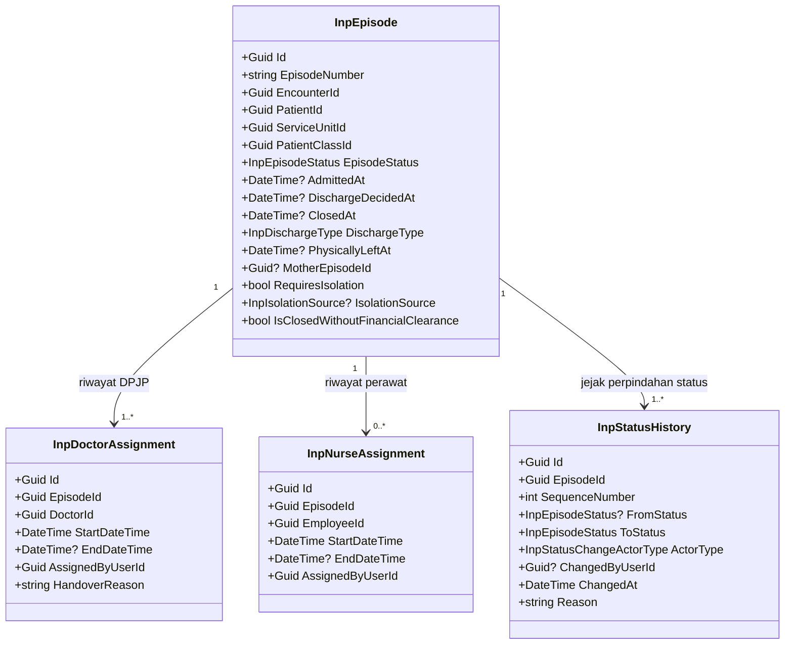
```mermaid
classDiagram
    class InpEpisode {
        +Guid Id
        +string EpisodeNumber
        +Guid EncounterId
        +Guid PatientId
        +Guid ServiceUnitId
        +Guid PatientClassId
        +InpEpisodeStatus EpisodeStatus
        +DateTime? AdmittedAt
        +DateTime? DischargeDecidedAt
        +DateTime? ClosedAt
        +InpDischargeType DischargeType
        +DateTime? PhysicallyLeftAt
        +Guid? MotherEpisodeId
        +bool RequiresIsolation
        +InpIsolationSource? IsolationSource
        +bool IsClosedWithoutFinancialClearance
    }
    class InpDoctorAssignment {
        +Guid Id
        +Guid EpisodeId
        +Guid DoctorId
        +DateTime StartDateTime
        +DateTime? EndDateTime
        +Guid AssignedByUserId
        +string HandoverReason
    }
    class InpNurseAssignment {
        +Guid Id
        +Guid EpisodeId
        +Guid EmployeeId
        +DateTime StartDateTime
        +DateTime? EndDateTime
        +Guid AssignedByUserId
    }
    class InpStatusHistory {
        +Guid Id
        +Guid EpisodeId
        +int SequenceNumber
        +InpEpisodeStatus? FromStatus
        +InpEpisodeStatus ToStatus
        +InpStatusChangeActorType ActorType
        +Guid? ChangedByUserId
        +DateTime ChangedAt
        +string Reason
    }
    InpEpisode "1" --> "1..*" InpDoctorAssignment : riwayat DPJP
    InpEpisode "1" --> "0..*" InpNurseAssignment : riwayat perawat
    InpEpisode "1" --> "1..*" InpStatusHistory : jejak perpindahan status
```

### 3.2 Penghunian tempat tidur

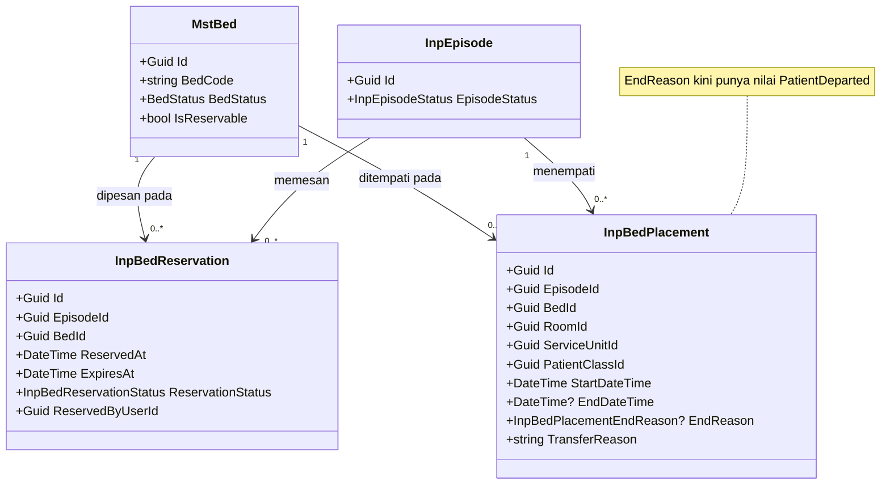
```mermaid
classDiagram
    class InpEpisode {
        +Guid Id
        +InpEpisodeStatus EpisodeStatus
    }
    class InpBedReservation {
        +Guid Id
        +Guid EpisodeId
        +Guid BedId
        +DateTime ReservedAt
        +DateTime ExpiresAt
        +InpBedReservationStatus ReservationStatus
        +Guid ReservedByUserId
    }
    class InpBedPlacement {
        +Guid Id
        +Guid EpisodeId
        +Guid BedId
        +Guid RoomId
        +Guid ServiceUnitId
        +Guid PatientClassId
        +DateTime StartDateTime
        +DateTime? EndDateTime
        +InpBedPlacementEndReason? EndReason
        +string TransferReason
    }
    note for InpBedPlacement "EndReason kini punya nilai PatientDeparted"

    class MstBed {
        +Guid Id
        +string BedCode
        +BedStatus BedStatus
        +bool IsReservable
    }
    InpEpisode "1" --> "0..*" InpBedReservation : memesan
    InpEpisode "1" --> "0..*" InpBedPlacement : menempati
    MstBed "1" --> "0..*" InpBedReservation : dipesan pada
    MstBed "1" --> "0..*" InpBedPlacement : ditempati pada
```

### 3.3 Pemulangan, kelayakan, dan koreksi

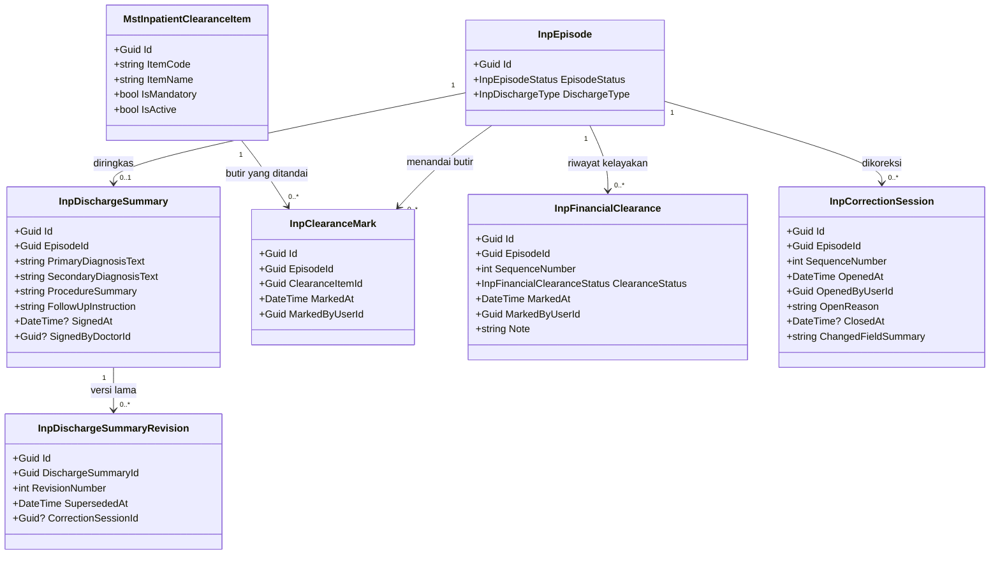
```mermaid
classDiagram
    class InpEpisode {
        +Guid Id
        +InpEpisodeStatus EpisodeStatus
        +InpDischargeType DischargeType
    }
    class InpDischargeSummary {
        +Guid Id
        +Guid EpisodeId
        +string PrimaryDiagnosisText
        +string SecondaryDiagnosisText
        +string ProcedureSummary
        +string FollowUpInstruction
        +DateTime? SignedAt
        +Guid? SignedByDoctorId
    }
    class InpClearanceMark {
        +Guid Id
        +Guid EpisodeId
        +Guid ClearanceItemId
        +DateTime MarkedAt
        +Guid MarkedByUserId
    }
    class InpFinancialClearance {
        +Guid Id
        +Guid EpisodeId
        +int SequenceNumber
        +InpFinancialClearanceStatus ClearanceStatus
        +DateTime MarkedAt
        +Guid MarkedByUserId
        +string Note
    }
    class InpCorrectionSession {
        +Guid Id
        +Guid EpisodeId
        +int SequenceNumber
        +DateTime OpenedAt
        +Guid OpenedByUserId
        +string OpenReason
        +DateTime? ClosedAt
        +string ChangedFieldSummary
    }
    class MstInpatientClearanceItem {
        +Guid Id
        +string ItemCode
        +string ItemName
        +bool IsMandatory
        +bool IsActive
    }
    class InpDischargeSummaryRevision {
        +Guid Id
        +Guid DischargeSummaryId
        +int RevisionNumber
        +DateTime SupersededAt
        +Guid? CorrectionSessionId
    }
    InpDischargeSummary "1" --> "0..*" InpDischargeSummaryRevision : versi lama
    InpEpisode "1" --> "0..1" InpDischargeSummary : diringkas
    InpEpisode "1" --> "0..*" InpClearanceMark : menandai butir
    InpEpisode "1" --> "0..*" InpFinancialClearance : riwayat kelayakan
    InpEpisode "1" --> "0..*" InpCorrectionSession : dikoreksi
    MstInpatientClearanceItem "1" --> "0..*" InpClearanceMark : butir yang ditandai
```

### 3.4 Service dan controller

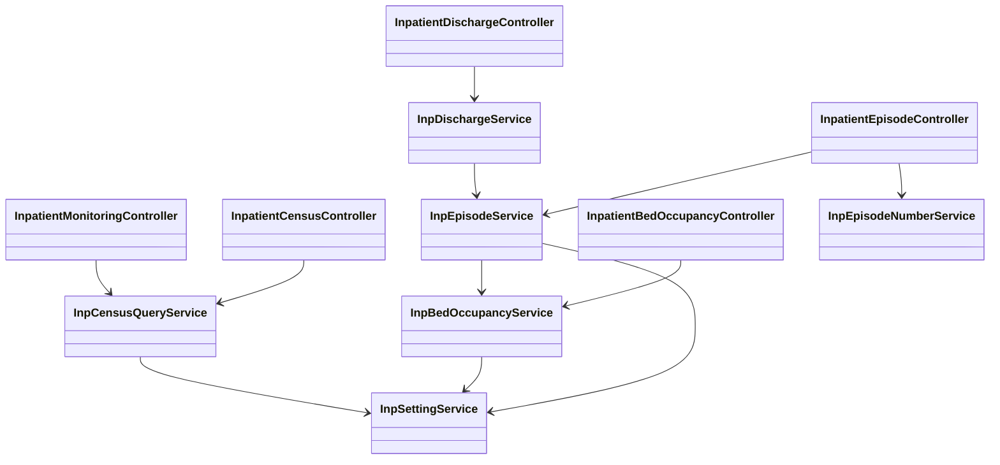
```mermaid
classDiagram
    class InpatientEpisodeController
    class InpatientBedOccupancyController
    class InpatientDischargeController
    class InpatientCensusController
    class InpatientMonitoringController
    class InpEpisodeService
    class InpBedOccupancyService
    class InpDischargeService
    class InpCensusQueryService
    class InpEpisodeNumberService
    class InpSettingService
    InpatientEpisodeController --> InpEpisodeService
    InpatientEpisodeController --> InpEpisodeNumberService
    InpatientBedOccupancyController --> InpBedOccupancyService
    InpatientDischargeController --> InpDischargeService
    InpatientCensusController --> InpCensusQueryService
    InpatientMonitoringController --> InpCensusQueryService
    InpEpisodeService --> InpBedOccupancyService
    InpEpisodeService --> InpSettingService
    InpBedOccupancyService --> InpSettingService
    InpDischargeService --> InpEpisodeService
    InpCensusQueryService --> InpSettingService
```

---

## 4. Penjelasan setiap class

Seluruh model mewarisi `IdentityModel`, sehingga sudah punya sepuluh kolom audit. Kolom itu tidak
diulang pada tabel di bawah.

### 4.1 `InpEpisode`

| Aspek | Penjelasan |
| --- | --- |
| **Status** | `Baru` |
| **Lokasi file** | `Areas/HealthServices/InPatientManagement/Models/InpEpisode.cs` |
| Kategori | Transaksi Rawat Inap — aggregate root |
| Tanggung jawab utama | Menyimpan satu episode perawatan menginap: dari admisi dibuka sampai episode ditutup. Seluruh catatan lain menempel padanya |
| Field penting | `EpisodeNumber`, `EncounterId`, `PatientId`, `ServiceUnitId`, `PatientClassId`, `EpisodeStatus`, `AdmittedAt`, `DischargeDecidedAt`, `PhysicallyLeftAt`, `PhysicallyLeftByUserId`, `ClosedAt`, `DischargeType`, `MotherEpisodeId`, **`RequiresIsolation`**, **`IsolationSource`**, **`IsolationSetByUserId`**, **`IsolationSetByDoctorId`**, **`IsolationSetAt`**, **`IsolationNote`**, `IsClosedWithoutFinancialClearance`, `CancelReason` |
| Navigation property dan relasi | Menunjuk `TrxPatientEncounter`, `MstPatient`, `MstServiceUnit`, `MstPatientClass`. Memiliki `InpDoctorAssignment`, `InpNurseAssignment`, `InpBedReservation`, `InpBedPlacement`, `InpDischargeSummary`, `InpClearanceMark`, `InpFinancialClearance`, `InpStatusHistory`, `InpCorrectionSession` |
| Pemakaian dalam alur bisnis | Dibuat petugas admisi saat membuka admisi, dan hidup sampai episode ditutup |
| Catatan desain | `PatientId` disimpan sebagai salinan dari kunjungan **hanya** untuk mempercepat census dan laporan; kunjungan tetap sumber kebenarannya. Jangan menyimpan lokasi terakhir di sini — lokasi selalu dibaca dari `InpBedPlacement`. `PhysicallyLeftAt` **bukan** duplikasi baris penempatan: baris penempatan mencatat *kenapa penempatan berakhir*, sedangkan kolom ini mencatat *apakah pasien sudah pergi*, dan keberadaannya diperlukan supaya `INV-INP-10` dapat ditegakkan unique index parsial. Keduanya ditulis dalam transaksi yang sama. `MotherEpisodeId` menunjuk episode ibu pada kasus bayi rawat gabung, boleh kosong, dan **tidak boleh** menunjuk episode milik pasien yang sama. `RequiresIsolation` beserta lima kolom pendampingnya menyimpan **nilai yang berlaku sekarang** — bukan riwayat. Konsekuensinya dinyatakan pada bagian 9 |
| Ekuivalen model lama | — |

### 4.2 `InpDoctorAssignment`

| Aspek | Penjelasan |
| --- | --- |
| **Status** | `Baru` |
| **Lokasi file** | `Areas/HealthServices/InPatientManagement/Models/InpDoctorAssignment.cs` |
| Kategori | Transaksi Rawat Inap |
| Tanggung jawab utama | Menyimpan **riwayat** siapa DPJP episode ini dan sejak kapan sampai kapan. Pengalihan membuat baris baru, tidak menimpa baris lama |
| Field penting | `EpisodeId`, `DoctorId`, `StartDateTime`, `EndDateTime`, `AssignedByUserId`, `HandoverReason` |
| Navigation property dan relasi | Milik `InpEpisode`; menunjuk `MstDoctor` |
| Pemakaian dalam alur bisnis | Baris pertama dibuat saat admisi dibuka. Baris berikutnya dibuat saat DPJP dialihkan, misalnya karena cuti |
| Catatan desain | **Jangan** mengganti pola ini dengan satu kolom `DoctorId` pada episode. Tanpa riwayat, sistem tidak dapat membuktikan bahwa perpindahan pasien kemarin diminta dokter yang saat itu memang berwenang |
| Ekuivalen model lama | — |

### 4.3 `InpNurseAssignment`

| Aspek | Penjelasan |
| --- | --- |
| **Status** | `Baru` |
| **Lokasi file** | `Areas/HealthServices/InPatientManagement/Models/InpNurseAssignment.cs` |
| Kategori | Transaksi Rawat Inap |
| Tanggung jawab utama | Menyimpan riwayat perawat penanggung jawab episode |
| Field penting | `EpisodeId`, `EmployeeId`, `StartDateTime`, `EndDateTime`, `AssignedByUserId` |
| Navigation property dan relasi | Milik `InpEpisode`; menunjuk `MstEmployee` |
| Pemakaian dalam alur bisnis | Diisi kepala ruangan setelah pasien menempati tempat tidur, dan setiap kali berganti |
| Catatan desain | Boleh kosong. Episode tanpa perawat **tidak** menahan tindakan apa pun; ia hanya muncul pada daftar pantau kepala ruangan |
| Ekuivalen model lama | — |

### 4.4 `InpBedReservation`

| Aspek | Penjelasan |
| --- | --- |
| **Status** | `Baru` |
| **Lokasi file** | `Areas/HealthServices/InPatientManagement/Models/InpBedReservation.cs` |
| Kategori | Transaksi Rawat Inap |
| Tanggung jawab utama | Mengunci satu tempat tidur untuk satu calon pasien selama batas waktu tertentu |
| Field penting | `EpisodeId`, `BedId`, `ReservedAt`, `ExpiresAt`, `ReservationStatus`, `ReservedByUserId` |
| Navigation property dan relasi | Milik `InpEpisode`; menunjuk `MstBed` |
| Pemakaian dalam alur bisnis | Dibuat petugas admisi saat memilih tempat tidur, sebelum pasien datang ke kamar |
| Catatan desain | Kedaluwarsa **dihitung saat data dibaca**, bukan oleh program penjadwal. `ExpiresAt` diisi dari `MstInpatientSetting.BedReservationMinutes` pada saat pemesanan dibuat, sehingga perubahan pengaturan tidak mengubah pemesanan yang sudah berjalan |
| Ekuivalen model lama | — |

### 4.5 `InpBedPlacement`

| Aspek | Penjelasan |
| --- | --- |
| **Status** | `Baru` |
| **Lokasi file** | `Areas/HealthServices/InPatientManagement/Models/InpBedPlacement.cs` |
| Kategori | Transaksi Rawat Inap |
| Tanggung jawab utama | **Sumber kebenaran penghunian tempat tidur.** Satu baris per tempat tidur yang pernah ditempati, lengkap dengan waktu mulai dan waktu berakhir |
| Field penting | `EpisodeId`, `BedId`, `RoomId`, `ServiceUnitId`, `PatientClassId`, `StartDateTime`, `EndDateTime`, `EndReason`, `TransferReason`, `PlacedByUserId`, `EndedByUserId` |
| Navigation property dan relasi | Milik `InpEpisode`; menunjuk `MstBed`, `MstRoom`, `MstServiceUnit`, `MstPatientClass` |
| Pemakaian dalam alur bisnis | Dibuat saat pasien menempati tempat tidur, ditutup saat pasien pindah atau episode berakhir |
| Asal `StartDateTime` | Jalur datang langsung dan poliklinik: waktu penempatan dibuat. Episode yang lahir dari serah terima IGD: **dibaca dari event `Tiba`** pada catatan kepergian IGD, tidak pernah ditetapkan modul ini dan tidak pernah dikoreksi setelah tersimpan, sesuai `RWI-DEC-072`. Bentuk kolomnya tidak berubah |
| Catatan desain | `RoomId`, `ServiceUnitId`, dan `PatientClassId` adalah **salinan saat penempatan dibuat**, bukan pembacaan langsung. Kalau kamar dipindahkan ke kelas lain tahun depan, riwayat tahun ini tetap menunjukkan kelas yang benar-benar berlaku saat itu. Inilah yang membuat `RWI-RULE-007` dapat dijalankan |
| Ekuivalen model lama | — |

### 4.6 `InpDischargeSummary`

| Aspek | Penjelasan |
| --- | --- |
| **Status** | `Baru` |
| **Lokasi file** | `Areas/HealthServices/InPatientManagement/Models/InpDischargeSummary.cs` |
| Kategori | Transaksi Rawat Inap |
| Tanggung jawab utama | Ringkasan resmi perawatan milik episode, ditandatangani DPJP, dan menjadi syarat penutupan |
| Field penting | `EpisodeId`, `PrimaryDiagnosisText`, `SecondaryDiagnosisText`, `ProcedureSummary`, `DischargeMedicationNote`, `FollowUpInstruction`, `ReferralDestination`, `SignedAt`, `SignedByDoctorId` |
| Navigation property dan relasi | Milik `InpEpisode`; menunjuk `MstDoctor` sebagai penandatangan |
| Pemakaian dalam alur bisnis | Disusun DPJP setelah keputusan pulang, ditandatangani sebelum episode ditutup |
| Catatan desain | Isi diagnosis disimpan sebagai teks pada MVP, **bukan** rujukan ke diagnosis klinis, karena modul Clinical masih di luar scope. Ketika `DEC-INP-001` turun, kolom teks itu dilengkapi rujukan tanpa mengubah bentuk tabel. Seluruh kolom isi bertanda **sensitif** |
| Ekuivalen model lama | — |

### 4.7 `InpDischargeSummaryRevision`

| Aspek | Penjelasan |
| --- | --- |
| **Status** | `Baru` — ditambahkan pada revision `0.2` |
| **Lokasi file** | `Areas/HealthServices/InPatientManagement/Models/InpDischargeSummaryRevision.cs` |
| Kategori | Transaksi Rawat Inap |
| Tanggung jawab utama | Menyimpan salinan resume pulang **versi sebelumnya**, setiap kali resume yang sudah ditandatangani diubah |
| Field penting | `DischargeSummaryId`, `RevisionNumber`, seluruh kolom isi resume sebagai salinan, `PreviousSignedAt`, `PreviousSignedByDoctorId`, `SupersededAt`, `SupersededByUserId`, `CorrectionSessionId` |
| Navigation property dan relasi | Milik `InpDischargeSummary`; menunjuk `InpCorrectionSession` bila perubahan lahir dari sesi koreksi |
| Pemakaian dalam alur bisnis | Dibuat otomatis saat supervisor mengubah resume yang sudah ditandatangani lewat sesi koreksi |
| Catatan desain | **Hanya versi yang sudah ditandatangani** yang disalin. Penyuntingan sebelum tanda tangan menimpa biasa tanpa membuat versi, sesuai `RWI-DEC-057`. Baris ini **tidak dapat diubah dan tidak dapat dihapus**; tidak disediakan endpoint update maupun delete. `InpDischargeSummary` tetap menyimpan versi yang berlaku, sehingga `INV-INP-05` tidak berubah |
| Ekuivalen model lama | — |

### 4.8 `InpClearanceMark`

| Aspek | Penjelasan |
| --- | --- |
| **Status** | `Baru` |
| **Lokasi file** | `Areas/HealthServices/InPatientManagement/Models/InpClearanceMark.cs` |
| Kategori | Transaksi Rawat Inap |
| Tanggung jawab utama | Mencatat butir daftar periksa administrasi mana yang sudah ditandai untuk episode ini |
| Field penting | `EpisodeId`, `ClearanceItemId`, `MarkedAt`, `MarkedByUserId`, `Note` |
| Navigation property dan relasi | Milik `InpEpisode`; menunjuk `MstInpatientClearanceItem` |
| Pemakaian dalam alur bisnis | Ditandai petugas admisi selama episode berstatus rencana pulang |
| Catatan desain | Butir yang **wajib** ditentukan master, bukan program. Butir yang dinonaktifkan admin tidak lagi menahan penutupan, dan penandaan lama tetap tersimpan |
| Ekuivalen model lama | — |

### 4.9 `InpFinancialClearance`

| Aspek | Penjelasan |
| --- | --- |
| **Status** | `Baru` |
| **Lokasi file** | `Areas/HealthServices/InPatientManagement/Models/InpFinancialClearance.cs` |
| Kategori | Transaksi Rawat Inap |
| Tanggung jawab utama | Menyimpan riwayat penandaan kelayakan keuangan episode |
| Field penting | `EpisodeId`, `SequenceNumber`, `ClearanceStatus`, `MarkedAt`, `MarkedByUserId`, `Note`, `IsManualMarking` |
| Navigation property dan relasi | Milik `InpEpisode` |
| Pemakaian dalam alur bisnis | Ditandai petugas kasir atau billing sebelum episode ditutup |
| Catatan desain | Kolom `IsManualMarking` selalu `true` selama MVP, dan wajib ditampilkan pada layar serta laporan. Ketika `BillingManagement` operasional, sumber nilainya berpindah dan kolom itu menjadi `false` — **aturan penutupannya tidak berubah**, sesuai `RWI-RULE-028` aturan 7 |
| Ekuivalen model lama | — |

### 4.10 `InpStatusHistory`

| Aspek | Penjelasan |
| --- | --- |
| **Status** | `Baru` |
| **Lokasi file** | `Areas/HealthServices/InPatientManagement/Models/InpStatusHistory.cs` |
| Kategori | Transaksi Rawat Inap |
| Tanggung jawab utama | Jejak setiap perpindahan status episode: dari apa, ke apa, oleh siapa, kapan, dan kenapa |
| Field penting | `EpisodeId`, `SequenceNumber`, `FromStatus`, `ToStatus`, `ActionType`, `ActorType`, `ChangedByUserId`, `ChangedAt`, `Reason` |
| Navigation property dan relasi | Milik `InpEpisode` |
| Pemakaian dalam alur bisnis | Ditulis otomatis setiap kali status berubah. Tidak pernah diisi manual |
| Catatan desain | Baris ini **tidak boleh** diubah dan **tidak boleh** dihapus; tidak disediakan endpoint update maupun delete. Perubahan yang dihitung sistem — pemesanan gugur dan episode `Draft` telantar — diberi `ActorType = System` dan `ChangedByUserId` kosong, sesuai `RWI-RULE-031` aturan 6 |
| Ekuivalen model lama | Pola diambil dari `TrxWorkflowStatusHistory` milik modul Workflow, tetapi **tidak** menumpang padanya |

### 4.11 `InpCorrectionSession`

| Aspek | Penjelasan |
| --- | --- |
| **Status** | `Baru` |
| **Lokasi file** | `Areas/HealthServices/InPatientManagement/Models/InpCorrectionSession.cs` |
| Kategori | Transaksi Rawat Inap |
| Tanggung jawab utama | Membuka jendela waktu bagi supervisor untuk membetulkan catatan episode yang sudah ditutup, **tanpa** mengubah status episodenya |
| Field penting | `EpisodeId`, `SequenceNumber`, `OpenedAt`, `OpenedByUserId`, `OpenReason`, `ClosedAt`, `ClosedByUserId`, `ChangedFieldSummary` |
| Navigation property dan relasi | Milik `InpEpisode` |
| Pemakaian dalam alur bisnis | Dibuka supervisor untuk mengoreksi cara pulang, diagnosis pada resume, atau catatan lain |
| Catatan desain | Status episode **tetap** `Closed` selama sesi berjalan, sehingga `RWI-DEC-009` dan `RWI-AC-004` tidak dilanggar. Karena status tidak berubah, `InpStatusHistory` tidak akan mencatat apa pun — itulah sebabnya `ChangedFieldSummary` wajib diisi saat sesi ditutup. Tanpa itu, koreksi menjadi satu-satunya perubahan yang tidak berjejak |
| Ekuivalen model lama | — |

### 4.12 `MstInpatientSetting`

| Aspek | Penjelasan |
| --- | --- |
| **Status** | `Baru` |
| **Lokasi file** | `Areas/HealthServices/MasterData/Models/MstInpatientSetting.cs` |
| Kategori | Master Data HealthServices |
| Tanggung jawab utama | Menyimpan seluruh angka yang boleh diubah admin, dalam satu tempat |
| Field penting | `Code`, `Name`, `BedReservationMinutes`, `DraftEpisodeExpiryHours`, `InitialAssessmentTargetHours`, `ProgressNoteVerificationTargetHours`, `PendingClosureThresholdHours`, `EpisodeNumberPrefix`, `IsDefault`, `IsActive` |
| Navigation property dan relasi | Tidak ada |
| Pemakaian dalam alur bisnis | Dibaca setiap kali sistem perlu tahu batas waktu; diubah admin lewat layar pengaturan |
| Catatan desain | Mengikuti pola `MstEmergencySetting` yang sudah dipakai IGD. Nilai **tidak boleh** ditanam di controller maupun frontend. Perubahan berlaku pada pembacaan berikutnya tanpa aplikasi dinyalakan ulang |
| Ekuivalen model lama | — |

### 4.13 `MstInpatientClearanceItem`

| Aspek | Penjelasan |
| --- | --- |
| **Status** | `Baru` |
| **Lokasi file** | `Areas/HealthServices/MasterData/Models/MstInpatientClearanceItem.cs` |
| Kategori | Master Data HealthServices |
| Tanggung jawab utama | Daftar butir yang harus ditandai sebelum episode boleh ditutup |
| Field penting | `ItemCode`, `ItemName`, `Description`, `IsMandatory`, `SortOrder`, `IsActive` |
| Navigation property dan relasi | Memiliki banyak `InpClearanceMark` |
| Pemakaian dalam alur bisnis | Dibaca saat memeriksa syarat penutupan; ditambah dan dinonaktifkan admin |
| Catatan desain | Butirnya **daftar baris**, bukan satu nilai, sehingga sengaja tidak disatukan ke `MstInpatientSetting` |
| Ekuivalen model lama | — |

### 4.14 `InpEpisodeService`

| Aspek | Penjelasan |
| --- | --- |
| **Status** | `Baru` |
| **Lokasi file** | `Areas/HealthServices/InPatientManagement/Services/InpEpisodeService.cs` |
| Kategori | Service |
| Tanggung jawab utama | Satu-satunya pintu perubahan status episode, penugasan DPJP, dan penugasan perawat |
| Dipanggil oleh | `InpatientEpisodeController`, `InpDischargeService` |
| Membuka transaksi database | **Ya** — untuk pengaktifan, pembatalan, dan penutupan |
| Catatan desain | Method `ApplyStatusChangeAsync` adalah satu-satunya tempat status boleh berubah, dan ia selalu menulis `InpStatusHistory` di dalam transaksi yang sama. Tidak boleh ada controller yang menyetel `EpisodeStatus` langsung. Penjaga kewenangan DPJP juga di sini, bukan di mesin hak akses. Sejak revision `0.2` service ini memeriksa `INV-INP-10` sebelum menempatkan pasien; sejak revision `0.3` ia juga mengurus `SetIsolationRequirementAsync` beserta penjaga siapa yang boleh mengubahnya |

### 4.15 `InpBedOccupancyService`

| Aspek | Penjelasan |
| --- | --- |
| **Status** | `Baru` |
| **Lokasi file** | `Areas/HealthServices/InPatientManagement/Services/InpBedOccupancyService.cs` |
| Kategori | Service |
| Tanggung jawab utama | Memesan, menempatkan, memindahkan, dan melepas tempat tidur; menghitung kedaluwarsa pemesanan saat dibaca; memperbarui salinan status pada `MstBed` |
| Dipanggil oleh | `InpatientBedOccupancyController`, `InpEpisodeService` |
| Membuka transaksi database | **Ya** — seluruh operasinya |
| Catatan desain | Method `TransferAsync` menutup penempatan lama dan membuka penempatan baru **dalam satu transaksi**; tidak boleh dipecah menjadi dua panggilan. Pemeriksaan `EvaluatePlacementEligibility` berbentuk daftar aturan, dan sejak revision `0.3` daftar itu berisi delapan aturan termasuk jenis kelamin dan isolasi. Method itu mengembalikan **daftar aturan yang gagal**, bukan hanya boleh atau tidak, supaya layar dapat menyebut alasan pastinya |

### 4.16 `InpDischargeService`

| Aspek | Penjelasan |
| --- | --- |
| **Status** | `Baru` |
| **Lokasi file** | `Areas/HealthServices/InPatientManagement/Services/InpDischargeService.cs` |
| Kategori | Service |
| Tanggung jawab utama | Keputusan pulang, resume pulang, penandaan daftar periksa, penandaan kelayakan keuangan, dan pemeriksaan lima syarat penutupan |
| Dipanggil oleh | `InpatientDischargeController` |
| Membuka transaksi database | Ya, untuk penandatanganan resume dan pemeriksaan penutupan |
| Catatan desain | Method `EvaluateClosureReadinessAsync` mengembalikan daftar syarat yang belum terpenuhi, bukan sekadar boleh atau tidak. Ini supaya layar dapat menampilkan alasan pastinya kepada petugas. Sejak revision `0.2`, service ini juga mengurus `RecordPatientDepartureAsync` yang melepas tempat tidur tanpa mengubah status episode, dan penyalinan versi resume saat resume yang sudah ditandatangani diubah |

### 4.17 `InpCensusQueryService`

| Aspek | Penjelasan |
| --- | --- |
| **Status** | `Baru` |
| **Lokasi file** | `Areas/HealthServices/InPatientManagement/Services/InpCensusQueryService.cs` |
| Kategori | Service |
| Tanggung jawab utama | Menyusun census, menghitung lama dirawat, menyusun papan ketersediaan tempat tidur, dua daftar pantau, dan laporan selisih tempat tidur |
| Dipanggil oleh | `InpatientCensusController`, `InpatientMonitoringController` |
| Membuka transaksi database | Tidak — hanya membaca |
| Catatan desain | Seluruh query memakai `AsNoTracking` dan projection langsung ke DTO. Census **tidak** disimpan sebagai tabel; ia selalu dihitung dari penempatan yang masih aktif. Sejak revision `0.2` census mengecualikan episode `DischargePending` yang kepergian fisiknya sudah dicatat. Sejak revision `0.3` service ini juga menyusun daftar pantau **penempatan tidak sesuai**, yaitu episode yang kebutuhan isolasinya tidak cocok dengan sifat tempat tidur yang sedang ditempatinya |

### 4.18 `InpEpisodeNumberService`

| Aspek | Penjelasan |
| --- | --- |
| **Status** | `Baru` |
| **Lokasi file** | `Areas/HealthServices/InPatientManagement/Services/InpEpisodeNumberService.cs` |
| Kategori | Service |
| Tanggung jawab utama | Membuat nomor episode yang unik dan terbaca manusia |
| Dipanggil oleh | `InpEpisodeService` |
| Membuka transaksi database | Ikut transaksi pemanggil |
| Catatan desain | Awalan diambil dari `MstInpatientSetting.EpisodeNumberPrefix`, tidak ditanam di kode. Polanya mengikuti `EmergencyDocumentNumberService` yang sudah ada |

### 4.19 `InpSettingService`

| Aspek | Penjelasan |
| --- | --- |
| **Status** | `Baru` |
| **Lokasi file** | `Areas/HealthServices/InPatientManagement/Services/InpSettingService.cs` |
| Kategori | Service |
| Tanggung jawab utama | Membaca pengaturan aktif dan menyediakan nilai bawaan bila master belum terisi |
| Dipanggil oleh | Seluruh service Rawat Inap |
| Membuka transaksi database | Tidak |
| Catatan desain | Bila baris pengaturan belum ada, service mengembalikan nilai bawaan **dan** mencatat peringatan, supaya modul tetap jalan di lingkungan pengembangan tanpa diam-diam memakai angka yang salah di produksi |

### 4.20 Controller

| Controller | Status | Lokasi file | Grup Swagger | Service yang dipakai |
| --- | --- | --- | --- | --- |
| `InpatientEpisodeController` | `Baru` | `Areas/HealthServices/InPatientManagement/Controllers/InpatientEpisodeController.cs` | `Health Services / Inpatient Management / Inpatient Episode` | `InpEpisodeService` |
| `InpatientBedOccupancyController` | `Baru` | `Areas/HealthServices/InPatientManagement/Controllers/InpatientBedOccupancyController.cs` | `Health Services / Inpatient Management / Bed Occupancy` | `InpBedOccupancyService` |
| `InpatientDischargeController` | `Baru` | `Areas/HealthServices/InPatientManagement/Controllers/InpatientDischargeController.cs` | `Health Services / Inpatient Management / Inpatient Discharge` | `InpDischargeService` |
| `InpatientCensusController` | `Baru` | `Areas/HealthServices/InPatientManagement/Controllers/InpatientCensusController.cs` | `Health Services / Inpatient Management / Inpatient Census` | `InpCensusQueryService` |
| `InpatientMonitoringController` | `Baru` | `Areas/HealthServices/InPatientManagement/Controllers/InpatientMonitoringController.cs` | `Health Services / Inpatient Management / Inpatient Monitoring` | `InpCensusQueryService` |
| `InpatientSettingController` | `Baru` | `Areas/HealthServices/MasterData/Controllers/InpatientSettingController.cs` | `Health Services / Master Data / Inpatient Setting` | Tidak memakai service — CRUD sederhana, memakai `ApplicationDbContext` langsung sesuai konvensi |
| `InpatientClearanceItemController` | `Baru` | `Areas/HealthServices/MasterData/Controllers/InpatientClearanceItemController.cs` | `Health Services / Master Data / Inpatient Clearance Item` | Tidak memakai service — CRUD sederhana |
| `BedController` | `Diperbarui` | `Areas/HealthServices/MasterData/Controllers/BedController.cs` | `Health Services / Master Data / Bed` | Tidak memakai service. Perubahan: endpoint `/availability` menolak nilai `Reserved` dan `Occupied` |

---

## 5. Arsitektur folder

```text
Areas/HealthServices/InPatientManagement/          # Baru, seluruh folder
├── Controllers/                                   # Baru — plural, pola standar
│   ├── InpatientEpisodeController.cs              # Baru
│   ├── InpatientBedOccupancyController.cs         # Baru
│   ├── InpatientDischargeController.cs            # Baru
│   ├── InpatientCensusController.cs               # Baru
│   └── InpatientMonitoringController.cs           # Baru
├── DTOs/                                          # Baru
│   ├── InpatientEpisodeDtos.cs                    # Baru
│   ├── InpatientBedOccupancyDtos.cs               # Baru
│   ├── InpatientDischargeDtos.cs                  # Baru
│   └── InpatientCensusDtos.cs                     # Baru
├── Enums/                                         # Baru
│   ├── InpEpisodeStatus.cs                        # Baru
│   ├── InpDischargeType.cs                        # Baru
│   ├── InpBedReservationStatus.cs                 # Baru
│   ├── InpBedPlacementEndReason.cs                # Baru
│   ├── InpFinancialClearanceStatus.cs             # Baru
│   ├── InpIsolationSource.cs                      # Baru pada revision 0.3
│   └── InpStatusChangeActorType.cs                # Baru
├── Models/                                        # Baru
│   ├── InpEpisode.cs                              # Baru
│   ├── InpDoctorAssignment.cs                     # Baru
│   ├── InpNurseAssignment.cs                      # Baru
│   ├── InpBedReservation.cs                       # Baru
│   ├── InpBedPlacement.cs                         # Baru
│   ├── InpDischargeSummary.cs                     # Baru
│   ├── InpDischargeSummaryRevision.cs             # Baru pada revision 0.2
│   ├── InpClearanceMark.cs                        # Baru
│   ├── InpFinancialClearance.cs                   # Baru
│   ├── InpStatusHistory.cs                        # Baru
│   └── InpCorrectionSession.cs                    # Baru
├── Services/                                      # Baru
│   ├── InpEpisodeService.cs                       # Baru
│   ├── InpBedOccupancyService.cs                  # Baru
│   ├── InpDischargeService.cs                     # Baru
│   ├── InpCensusQueryService.cs                   # Baru
│   ├── InpEpisodeNumberService.cs                 # Baru
│   └── InpSettingService.cs                       # Baru
└── Seeders/                                       # Baru
    └── InpatientMasterDataSeeder.cs               # Baru — hanya untuk pengembangan dan pengujian

Areas/HealthServices/MasterData/
├── Controllers/
│   ├── BedController.cs                           # Diperbarui
│   ├── InpatientSettingController.cs              # Baru
│   └── InpatientClearanceItemController.cs        # Baru
├── DTOs/
│   ├── InpatientSettingDtos.cs                    # Baru
│   └── InpatientClearanceItemDtos.cs              # Baru
└── Models/
    ├── MstInpatientSetting.cs                     # Baru
    └── MstInpatientClearanceItem.cs               # Baru

Repositories/Configurations/HealthServices/InPatientManagement/   # Baru, seluruh folder
├── InpEpisodeConfiguration.cs                     # Baru
├── InpDoctorAssignmentConfiguration.cs            # Baru
├── InpNurseAssignmentConfiguration.cs             # Baru
├── InpBedReservationConfiguration.cs              # Baru
├── InpBedPlacementConfiguration.cs                # Baru
├── InpDischargeSummaryConfiguration.cs            # Baru
├── InpDischargeSummaryRevisionConfiguration.cs    # Baru pada revision 0.2
├── InpClearanceMarkConfiguration.cs               # Baru
├── InpFinancialClearanceConfiguration.cs          # Baru
├── InpStatusHistoryConfiguration.cs               # Baru
└── InpCorrectionSessionConfiguration.cs           # Baru

Repositories/Configurations/HealthServices/MasterData/
├── MstInpatientSettingConfiguration.cs            # Baru
└── MstInpatientClearanceItemConfiguration.cs      # Baru

Repositories/ApplicationDbContext.cs               # Diperbarui — 13 DbSet baru
Program.cs                                         # Diperbarui — 6 pendaftaran service baru
Migrations/                                        # Diperbarui — satu migration baru
```

### 5.1 Catatan tentang penyimpangan struktur

Aturan struktur backend menyebut tiga penyimpangan yang pernah ada. Dua di antaranya **sudah
diperbaiki** pada SHA `5afb54b`, sehingga tidak perlu diwaspadai lagi:

| Penyimpangan menurut aturan | Keadaan nyata pada `5afb54b` |
| --- | --- |
| Folder controller IGD bernama `Controller` tunggal | **Sudah plural.** `Areas/HealthServices/EmergencyInstallationManagement/Controllers/` |
| Folder configuration bernama `HealthService` tunggal | **Sudah plural.** `Repositories/Configurations/HealthServices/` |
| Namespace master IGD tidak mengikuti folder | **Masih menyimpang.** `MstEmergencySetting.cs` berada di `Areas/HealthServices/MasterData/Models/` tetapi namespace-nya `...MasterData.EmergencyInstallationManagement.Models` |

Ada satu penyimpangan tambahan yang **tidak** disebut aturan dan ditemukan saat audit ini:
`Repositories/Configurations/HealthServices/LabOrderConfiguration.cs` berada di folder plural,
tetapi namespace-nya `...Repositories.Configurations.HealthService` — tunggal.

**Aturannya bagi modul ini:** seluruh file baru Rawat Inap memakai namespace yang mengikuti
foldernya, yaitu `QuilvianSystemBackend.Repositories.Configurations.HealthServices.InPatientManagement`
dan `QuilvianSystemBackend.Areas.HealthServices.MasterData.Models`. Penyimpangan yang ada
**tidak ditiru** dan **tidak dirapikan diam-diam**; perapiannya menjadi task tersendiri milik
pemilik arsitektur backend.

---

## 6. Status model dan dampak migration

| Model | Status | Kolom yang berubah | Dampak migration |
| --- | --- | --- | --- |
| `InpEpisode` | `Baru` | Seluruhnya, termasuk enam kolom kebutuhan isolasi yang ditambahkan pada revision `0.3` | Tabel baru |
| `InpDoctorAssignment` | `Baru` | Seluruhnya | Tabel baru |
| `InpNurseAssignment` | `Baru` | Seluruhnya | Tabel baru |
| `InpBedReservation` | `Baru` | Seluruhnya | Tabel baru |
| `InpBedPlacement` | `Baru` | Seluruhnya | Tabel baru |
| `InpDischargeSummary` | `Baru` | Seluruhnya | Tabel baru |
| `InpDischargeSummaryRevision` | `Baru` pada revision `0.2` | Seluruhnya | Tabel baru |
| `InpClearanceMark` | `Baru` | Seluruhnya | Tabel baru |
| `InpFinancialClearance` | `Baru` | Seluruhnya | Tabel baru |
| `InpStatusHistory` | `Baru` | Seluruhnya | Tabel baru |
| `InpCorrectionSession` | `Baru` | Seluruhnya | Tabel baru |
| `MstInpatientSetting` | `Baru` | Seluruhnya | Tabel baru |
| `MstInpatientClearanceItem` | `Baru` | Seluruhnya | Tabel baru |
| `MstBed` | **`Sudah ada`** | **Tidak ada kolom yang berubah** | Tidak ada migration. Yang berubah hanya siapa yang boleh menulis `BedStatus`, dan itu perubahan perilaku controller |
| `TrxPatientEncounter` | **`Sudah ada`** | **Tidak ada kolom yang berubah** | Tidak ada migration |

**Yang perlu diperhatikan:** tidak satu pun tabel milik modul lain berubah bentuknya. **Tiga belas**
tabel baru, nol perubahan kolom pada tabel existing. Ini sengaja, supaya migration modul ini tidak
dapat merusak data modul lain.

### 6.1 Kolom dan nilai yang ditambahkan pada revision `0.2`

Karena `InpEpisode` dan `InpBedPlacement` belum pernah dibuat di database, penambahan berikut
**tidak** menghasilkan migration perubahan kolom. Semuanya masuk ke migration pembuatan tabel yang
sama.

| Tabel atau enum | Yang ditambahkan | Dasar |
| --- | --- | --- |
| `InpEpisode` | `PhysicallyLeftAt`, `PhysicallyLeftByUserId`, `MotherEpisodeId` | `RWI-DEC-055`, `RWI-DEC-056` |
| `InpEpisode` | `RequiresIsolation`, `IsolationSource`, `IsolationSetByUserId`, `IsolationSetByDoctorId`, `IsolationSetAt`, `IsolationNote` | `RWI-DEC-065` |
| `InpIsolationSource` | Enum baru: `AdmissionRecord = 1`, `ClinicalDecision = 2` | `RWI-DEC-065` |
| `InpEpisode` | Unique index parsial atas `PatientId` untuk episode yang hadir | `RWI-DEC-054` |
| `InpBedPlacementEndReason` | Nilai `PatientDeparted = 4` | `RWI-DEC-055` |
| `InpDischargeSummaryRevision` | Seluruh tabel | `RWI-DEC-057` |

---

## 7. Rencana migration

> **Batas bagian ini sejak `RWI-DEC-082`.** Yang ditulis di sini adalah urutan **di dalam**
> sub-modul `episode-rawat-inap`. Urutan **antar** sub-modul dipegang
> [`../02-module-map.md`](../02-module-map.md) bagian 3.4, tempat ketujuh langkah di bawah tercatat
> sebagai gelombang `M1` dan `M2`.
>
> Ringkasnya: `keperawatan` dan `dokter-rawat-inap` **tidak menambah satu tabel pun** ke modul ini,
> karena `RWI-DEC-081` menaruh seluruh tabel dokumentasi klinis pada `ClinicalManagement`. Tidak
> ada satu pun langkah di bawah yang tertahan menunggu kedua sub-modul itu.

### 7.1 Urutan

| No | Langkah | Dapat berjalan tanpa mematikan layanan | Keterangan |
| ---: | --- | :---: | --- |
| 1 | Buat dua tabel master: `MstInpatientSetting`, `MstInpatientClearanceItem` | Ya | Tabel baru, tidak menyentuh apa pun |
| 2 | Isi data master awal lewat seeder atau layar admin | Ya | Lihat bagian 8 |
| 3 | Buat sebelas tabel transaksi berawalan `Inp` | Ya | Tabel baru |
| 4 | Buat index dan **empat** unique index parsial: penempatan aktif per tempat tidur, pemesanan aktif per tempat tidur, DPJP aktif per episode, dan episode hadir per pasien | Ya | Tabel masih kosong, sehingga pembuatan index cepat |
| 5 | Daftarkan 13 `DbSet` pada `ApplicationDbContext` | Ya | Perubahan kode, bukan skema |
| 6 | Daftarkan 6 service pada `Program.cs` | Ya | Perubahan kode |
| 7 | Ubah perilaku `BedController.UpdateBedAvailability` agar menolak `Reserved` dan `Occupied` | **Tidak sepenuhnya** | Mengubah perilaku endpoint yang sudah dipakai. Lihat 7.3 |

### 7.2 Pengisian data lama

**Tidak ada data lama yang perlu diisi.** Tidak ada satu pun episode rawat inap di dalam sistem
hari ini, dan tidak ada catatan penghunian tempat tidur yang perlu dipindahkan.

Satu hal yang perlu diperiksa sebelum langkah 7: bila di database sudah ada baris `MstBed` yang
terlanjur berstatus `Reserved` atau `Occupied` — padahal tidak ada pasien yang menempatinya, karena
memang belum ada modul rawat inap — baris itu wajib dikembalikan ke `Available` lebih dulu. Kalau
tidak, laporan selisih akan langsung menampilkan seluruh baris itu sebagai selisih.

### 7.3 Langkah mundur bila gagal

| Langkah yang gagal | Cara mundur |
| --- | --- |
| 1 sampai 5 | Jalankan migration mundur. Tidak ada data yang hilang karena tabelnya baru dan kosong |
| 6 | Kembalikan `Program.cs`. Tidak ada dampak data |
| 7 | Kembalikan perilaku `BedController` ke semula. Data `MstBed` tidak berubah bentuknya, jadi tidak ada yang perlu dipulihkan |

Langkah 7 sengaja diletakkan paling akhir supaya seluruh fondasi sudah berdiri sebelum satu-satunya
perubahan perilaku pada modul lain dijalankan.

---

## 8. Rencana data master awal

Modul dengan tabel master kosong tidak dapat dipakai sama sekali. Berikut isi minimumnya.

### 8.1 `MstInpatientSetting`

Satu baris berkode `DEFAULT`.

| Kolom | Nilai awal | Sumber nilai |
| --- | --- | --- |
| `Code` | `DEFAULT` | Konvensi, mengikuti `MstEmergencySetting` |
| `Name` | `Pengaturan Rawat Inap Default` | Konvensi |
| `BedReservationMinutes` | `120` | `RWI-RULE-002` — 2 jam |
| `DraftEpisodeExpiryHours` | `24` | `RWI-RULE-022` — 1 hari |
| `InitialAssessmentTargetHours` | `24` | `RWI-RULE-021` — **belum final secara klinis**, dipakai sebagai nilai bawaan yang dapat diubah |
| `ProgressNoteVerificationTargetHours` | `24` | `RWI-RULE-021` — sama, belum final |
| `PendingClosureThresholdHours` | `4` | `RWI-RULE-023` |
| `EpisodeNumberPrefix` | `RI` | Konvensi, mengikuti `EmergencyVisitNumberPrefix` yang bernilai `IGD` |

### 8.2 `MstInpatientClearanceItem`

Tiga butir bawaan sesuai `RWI-DEC-026`.

| `ItemCode` | `ItemName` | `IsMandatory` | Sumber nilai |
| --- | --- | :---: | --- |
| `ADM-DOC` | Berkas administrasi pasien lengkap | Ya | `RWI-RULE-018` |
| `RETURN-ITEM` | Barang milik pasien dan barang rumah sakit sudah diselesaikan | Ya | `RWI-RULE-018` |
| `DISCHARGE-MED` | Obat pulang sudah diserahkan | Tidak | `RWI-RULE-024` — dapat dinonaktifkan admin, dan pada MVP memang belum dapat ditutup otomatis karena modul Farmasi di luar scope |

### 8.3 Master milik modul lain yang wajib sudah terisi

Ini bukan tanggung jawab modul Rawat Inap untuk mengisinya, tetapi modul ini **tidak dapat dipakai**
tanpa isinya.

| Master | Isi minimum | Pemilik |
| --- | --- | --- |
| `MstServiceUnit` | Minimal satu unit layanan bertipe `Inpatient`, disetel `IsQueueRequired = false` | Admin master data |
| `MstPatientClass` | Kelas perawatan yang dipakai rumah sakit, bertanda `IsForInpatient = true` | Admin master data |
| `MstRoom` | Kamar rawat inap bertipe `InpatientRoom`, terhubung ke unit layanan dan kelas | Admin master data |
| `MstBed` | Tempat tidur pada tiap kamar. Boks bayi didaftarkan sebagai tempat tidur tersendiri bertanda `IsForNewborn = true` | Admin master data |

Kesiapan keempatnya adalah gerbang implementasi, tercatat sebagai `RWI-DEC-048` dan `RWI-OQ-036`.

### 8.4 Aturan seeder

`InpatientMasterDataSeeder` hanya mengisi 8.1 dan 8.2, dan **menolak berjalan di lingkungan
produksi** sesuai `RWI-DEC-048`. Seeder ini tidak pernah membuat kamar maupun tempat tidur, karena
isinya khas tiap rumah sakit.

---

## 9. Yang sengaja tidak dibuat

| Yang ditolak | Alasan |
| --- | --- |
| `InpPatient` atau salinan pasien apa pun | Pasien dimiliki Patient Management; dipakai lewat `EncounterId` dan `PatientId` |
| `InpDoctor` atau salinan dokter | Dokter dimiliki Corporate HR Workforce |
| `InpBed`, `InpRoom`, `InpServiceUnit`, `InpPatientClass` | Seluruhnya sudah ada di Master Data HealthServices dan sudah lengkap penandanya |
| `InpCensus` sebagai tabel | Census adalah pertanyaan yang dijawab dari penempatan yang masih aktif. Menyimpannya berarti membuat sumber kebenaran kedua yang bisa berbeda dari yang pertama |
| `InpLengthOfStay` sebagai kolom atau tabel | Hasil hitungan dua tanggal. Menyimpannya membuat angka basi setiap pergantian tanggal |
| `InpAdmission` terpisah dari `InpEpisode` | Admisi adalah tahap di dalam lifecycle episode, bukan objek dengan identitas sendiri |
| Status episode keenam untuk "sedang dikoreksi" | Melanggar `RWI-DEC-009` dan `RWI-AC-004` yang mengunci lima status. Digantikan `InpCorrectionSession` |
| `InpAssessment`, `InpDoctorNote`, `InpPrescription` | Dokumentasi klinis dan resep memakai modul yang sudah ada. Membuat versi Rawat Inap akan memecah rekam medis pasien menjadi dua tempat. Menunggu `DEC-INP-001` |
| Kolom `CurrentBedId` pada `InpEpisode` | Godaan yang wajar karena mempercepat query, tetapi membuat dua sumber kebenaran. Lokasi selalu dibaca dari `InpBedPlacement` yang `EndDateTime` kosong |
| Tabel antrean untuk pasien rawat inap | `RWI-RULE-026` aturan 2 melarangnya secara tegas; laporan antrean poliklinik tidak boleh tercemar |
| Program penjadwal untuk menggugurkan pemesanan | `RWI-DEC-007` menetapkan kedaluwarsa dihitung saat data dibaca, sehingga tidak perlu proses latar belakang |
| Status episode keenam untuk "pasien sudah pergi" | Kepergian fisik bukan perubahan status. Episode tetap `DischargePending` dan tetap wajib ditutup. Menambah status akan melanggar `RWI-DEC-009` yang mengunci lima nilai |
| Tabel tersendiri untuk mencatat kepergian fisik | Cukup dua kolom pada episode ditambah baris penempatan yang ditutup. Satu kejadian yang terjadi paling banyak sekali per episode tidak memerlukan tabel |
| Versi untuk resume yang belum ditandatangani | `RWI-DEC-057` hanya mewajibkan versi untuk yang sudah ditandatangani. Menyimpan setiap suntingan draf hanya menumpuk baris tanpa nilai audit |
| Tabel hubungan ibu dan bayi | Cukup satu kolom rujukan opsional pada episode bayi. Hubungannya satu arah dan paling banyak satu |
| Kolom "boleh campur" pada `MstRoom` | Ditolak tegas oleh `RWI-DEC-066`. Penanda `IsForMale` dan `IsForFemale` yang sudah ada bernilai benar secara bawaan untuk setiap kamar, sehingga menambah penanda ketiga hanya menambah cara baru untuk salah setel. Aturan pencampuran diperiksa dari **penghuni yang sedang ada**, bukan dari penanda |
| Tabel riwayat kebutuhan isolasi | `RWI-DEC-065` menyebutnya **atribut episode**, bukan riwayat. Yang tersimpan hanya nilai yang berlaku beserta siapa dan kapan terakhir mengubahnya. Keterbatasannya dinyatakan pada bagian 9.1 |
| Penanda kebutuhan isolasi pada master pasien | Kebutuhan isolasi melekat pada satu masa perawatan, bukan pada orangnya selamanya. Menaruhnya di `MstPatient` akan membuat pasien tertandai butuh isolasi seumur hidup |

---

## 10. Traceability

| Bagian arsitektur | Requirement dan decision asal |
| --- | --- |
| `InpEpisode` beserta statusnya | `RWI-RULE-003`, `RWI-DEC-009` |
| `InpBedReservation` | `RWI-RULE-001`, `RWI-RULE-002`, `RWI-DEC-007`, `RWI-DEC-008` |
| `InpBedPlacement` | `RWI-RULE-027`, `RWI-DEC-039`, `RWI-RULE-007`, `RWI-RULE-008` |
| `InpDoctorAssignment` | `RWI-RULE-030`, `RWI-DEC-042`, `RWI-DEC-023`, `RWI-DEC-024` |
| `InpNurseAssignment` | `RWI-RULE-033`, `RWI-DEC-047` |
| `InpDischargeSummary` | `RWI-RULE-032`, `RWI-DEC-045` |
| `InpClearanceMark` dan `MstInpatientClearanceItem` | `RWI-RULE-018`, `RWI-DEC-026` |
| `InpFinancialClearance` | `RWI-RULE-009`, `RWI-RULE-028`, `RWI-DEC-015`, `RWI-DEC-040` |
| `InpStatusHistory` | `RWI-RULE-031`, `RWI-DEC-043` |
| `InpCorrectionSession` | `RWI-RULE-020`, `RWI-DEC-028`, arsitektur domain bagian G.4 |
| `MstInpatientSetting` | `RWI-RULE-034`, `RWI-DEC-050` |
| Perubahan `BedController` | `RWI-RULE-027` aturan 4 dan 5, `RWI-DEC-039` |
| `InpDischargeSummaryRevision` | `RWI-DEC-057`, baseline `ID-INP-CAP-019` |
| `INV-INP-10` dan unique index parsial per pasien | `RWI-RULE-035`, `RWI-DEC-054` |
| `PhysicallyLeftAt`, `PhysicallyLeftByUserId`, `PatientDeparted` | `RWI-RULE-036`, `RWI-DEC-055` |
| `MotherEpisodeId` | `RWI-DEC-056`, `RWI-RULE-014` |
| `RequiresIsolation` dan lima kolom pendampingnya | `RWI-RULE-012` bagian A, `RWI-DEC-065` |
| Aturan 4 sampai 8 pada Kelayakan Penempatan | `RWI-RULE-012` bagian A dan B, `RWI-DEC-064`, `RWI-DEC-066` |
| `CMD-INP-16` | `RWI-RULE-012` A.2 s.d. A.4, `RWI-DEC-065` |
| Batas scope | Arsitektur domain bagian N.2 dan N.3, ditambah `INP-S11` sejak `RWI-DEC-064` |

---

## 11. Amandemen terbatas revision `0.8` — penyelarasan `PRD-RWI-V2-001` ★ 15 September 2026

### 11.0 Masukan, batas, dan cara membaca bagian ini

| Field | Nilai |
| --- | --- |
| Fase | `RLN-PH-06`; blueprint revision `7`; kontrak sub-modul `0.8.0` → **`0.9.0`** |
| Status | **`draft`** — belum disetujui manusia |
| Bentuk amandemen | **Terbatas** — pilihan pemilik 15 September 2026 "Amandemen terbatas". Hanya hal yang **diminta** `dokter-rawat-inap` `0.6.0` dan `keperawatan` `0.5.0` dari sub-modul ini. Bagian 0 s.d. 10 tidak berubah |
| Masukan keputusan | `00-interview-decisions.md` revision `21` — `RWI-DEC-111`, `112`, `130`, `138`, `143`; `RWI-DEC-099`, `126`, `129` sebagai konteks |
| Masukan gate | `evidence/02-requirement-completeness-gate.md` revision `1.6` |
| Masukan keadaan saat ini | `01-existing-capability-map.md` revision `1.4` bagian 17 — `RLN3-CAP-38`; `RWI-FACT-030` |
| Backend / frontend SHA | `df3679c0d5b2f08106702153eb242d3a6cb2929b` / `1ce219b40f8e411f3c4e66975626ab33ae81616a` |
| `domain_architecture_readiness` | Revision `0.1` `DOMAIN_ARCHITECTURE_READY` untuk episode tetap berlaku; isi baru tidak menambah konteks atau aggregate |

### 11.1 Yang berubah dari revision `0.7`

| No | Yang berubah | Diminta oleh | Dasar |
| ---: | --- | --- | --- |
| 1 | Census menyaring **pasien yang dokter login punya penugasan aktif** bila `assignedToMe=true`; ringkasan dari daftar yang sama | `dokter-rawat-inap` `INT-DOK-11` | `RWI-DEC-111` |
| 2 | **Jalur tulis penugasan konsulen dan dokter jaga**, termasuk **penugasan singkat** penulisan catatan terlambat berpenanda tujuan | `dokter-rawat-inap` `INT-DOK-12` | `RWI-DEC-099`, `RWI-DEC-130`; `RWI-FACT-030` butir 3 |
| 3 | Resume pulang bertambah **tiga isian**: Pemeriksaan Penting, Kondisi Saat Pulang, Edukasi; `ClinicalSummary` berlabel Ringkasan Perawatan; usulan isian dari sumber klinis tanpa menyimpan | `dokter-rawat-inap` `INT-DOK-20` | `RWI-DEC-112` |
| 4 | Penutupan episode, dalam transaksi yang sudah ada, **mengunci konsep catatan dokter**, **membatalkan pesanan tindakan tertunda yang belum ditagih**, dan **membatalkan dosis obat yang belum waktunya** | `INT-DOK-13`, `INT-KEP-15` | `RWI-DEC-138`, `RWI-DEC-143`; `RLN3-CAP-38` |
| 5 | Kesiapan penutupan menampilkan **peringatan yang tidak menahan**; daftar pantau baru pesanan tertunda yang sudah ditagih | Sama | `RWI-DEC-129` (4), `RWI-DEC-143` (5) dan jalur tidak normal (c) |

### 11.2 Invariant baru

| ID | Bunyinya | Ditegakkan di mana | Contoh |
| --- | --- | --- | --- |
| `INV-INP-11` | Penutupan episode, pengembalian tempat tidur, penutupan penugasan, penguncian konsep catatan dokter, pembatalan pesanan tindakan tertunda yang belum ditagih, dan pembatalan dosis obat masa depan terjadi **dalam satu transaksi** — semuanya berhasil atau episode tetap belum ditutup. Tidak satu pun **menahan** penutupan | `InpDischargeService.CloseEpisodeInternalAsync` | Joko ditutup 13.00: SOAP dr. Yoga terkunci, cek GDS batal, dosis 20.00 batal, episode `Closed`. Langkah penguncian gagal → keempatnya batal, episode tetap `DischargePending` |
| `INV-INP-12` | Penugasan bertujuan `LateDocumentation` selalu berperan `OnCallDoctor`, punya waktu selesai, dan beralasan; tidak mengubah DPJP aktif maupun "DPJP terakhir" | `InpEpisodeService.AssignSupportingDoctorAsync` + check constraint | dr. Rina penugasan singkat Kamis 10.00–11.00; dr. Ahmad tetap DPJP |
| `INV-INP-13` | Daftar pasien dokter **sama dengan** daftar yang boleh ia tulis saat ini: penugasan dengan `StartDateTime ≤ sekarang` dan `EndDateTime` kosong atau `> sekarang` | `InpCensusQueryService` | dr. Yoga jaga 22.00–07.00 → Joko muncul 22.00, hilang 07.00 |

### 11.3 Kepemilikan data — delta

| Kelompok data | Modul pemilik | Perubahan |
| --- | --- | --- |
| Penugasan dokter | `InPatientManagement` | **Diperbarui** — satu kolom tujuan |
| Resume pulang dan versinya | `InPatientManagement` | **Diperbarui** — tiga kolom pada dua tabel |
| Konsep catatan dokter yang dikunci | `MedicalRecordManagement` | Dipanggil, tidak disalin |
| Pesanan tindakan yang dibatalkan | `ClinicalManagement` | Dipanggil, tidak disalin |
| Dosis obat yang dibatalkan | `PharmacyManagement` | Dipanggil, tidak disalin |
| Usulan isian resume | Diagnosis, tindakan, resep pulang, hasil penunjang final, edukasi keperawatan — pemilik masing-masing | **Dibaca saja**; tidak disimpan kecuali dokter menyimpan draf |

**Nol tabel baru.**

### 11.4 Class diagram

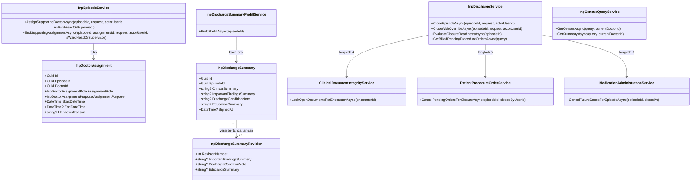
```mermaid
classDiagram
    class InpDoctorAssignment {
        +Guid Id
        +Guid EpisodeId
        +Guid DoctorId
        +InpDoctorAssignmentRole AssignmentRole
        +InpDoctorAssignmentPurpose AssignmentPurpose
        +DateTime StartDateTime
        +DateTime? EndDateTime
        +string? HandoverReason
    }
    class InpDischargeSummary {
        +Guid Id
        +Guid EpisodeId
        +string? ClinicalSummary
        +string? ImportantFindingsSummary
        +string? DischargeConditionNote
        +string? EducationSummary
        +DateTime? SignedAt
    }
    class InpDischargeSummaryRevision {
        +int RevisionNumber
        +string? ImportantFindingsSummary
        +string? DischargeConditionNote
        +string? EducationSummary
    }
    class InpEpisodeService {
        +AssignSupportingDoctorAsync(episodeId, request, actorUserId, isWardHeadOrSupervisor)
        +EndSupportingAssignmentAsync(episodeId, assignmentId, request, actorUserId, isWardHeadOrSupervisor)
    }
    class InpDischargeService {
        +CloseEpisodeAsync(episodeId, request, actorUserId)
        +CloseWithOverrideAsync(episodeId, request, actorUserId)
        +EvaluateClosureReadinessAsync(episodeId)
        +GetBilledPendingProcedureOrdersAsync(query)
    }
    class InpDischargeSummaryPrefillService {
        +BuildPrefillAsync(episodeId)
    }
    class InpCensusQueryService {
        +GetCensusAsync(query, currentDoctorId)
        +GetSummaryAsync(query, currentDoctorId)
    }
    class ClinicalDocumentIntegrityService {
        +LockOpenDocumentsForEncounterAsync(encounterId)
    }
    class PatientProcedureOrderService {
        +CancelPendingOrdersForClosureAsync(episodeId, closedByUserId)
    }
    class MedicationAdministrationService {
        +CancelFutureDosesForEpisodeAsync(episodeId, closedAt)
    }
    InpDischargeSummary "1" --> "0..*" InpDischargeSummaryRevision : versi bertanda tangan
    InpEpisodeService --> InpDoctorAssignment : tulis
    InpDischargeService --> ClinicalDocumentIntegrityService : langkah 4
    InpDischargeService --> PatientProcedureOrderService : langkah 5
    InpDischargeService --> MedicationAdministrationService : langkah 6
    InpDischargeSummaryPrefillService --> InpDischargeSummary : baca draf
```

Tiga service di bawah diagram milik modul lain dan dirancang di sub-modulnya: `MedicalRecordManagement` (dipakai apa
adanya), `dokter-rawat-inap` 11, `keperawatan` 11.

### 11.5 Penjelasan setiap class

#### 11.5.1 `InpDoctorAssignment` — `Diperbarui`

| Aspek | Penjelasan |
| --- | --- |
| **Status** | `Diperbarui` — satu kolom |
| **Lokasi file** | `Areas/HealthServices/InPatientManagement/Models/InpDoctorAssignment.cs`; configuration `Repositories/Configurations/HealthServices/InPatientManagement/InpDoctorAssignmentConfiguration.cs` |
| Kolom baru | `AssignmentPurpose` (`InpDoctorAssignmentPurpose`): `Regular = 0` bawaan, `LateDocumentation = 1` |
| Aturan | `LateDocumentation` ⇒ `AssignmentRole = OnCallDoctor`, `EndDateTime` terisi dan `> StartDateTime`, `HandoverReason` terisi — `INV-INP-12`, check constraint `CK_InpDoctorAssignment_LateDocumentation` |
| Pemakaian | `INV-DOK-15` membaca peran dan periode; laporan jumlah jaga menyaring `Regular` — `RWI-DEC-130` konsekuensi (1) |
| Catatan desain | Tujuan dipilih sebagai **enum**, bukan boolean, supaya tujuan lain kelak tidak membutuhkan kolom kedua. Nilai tidak dapat diubah pada baris yang ada — sama dengan peran (6A.3) |

#### 11.5.2 `InpDischargeSummary` dan `InpDischargeSummaryRevision` — `Diperbarui`

| Aspek | Penjelasan |
| --- | --- |
| **Status** | `Diperbarui` — tiga kolom pada masing-masing tabel |
| **Lokasi file** | `Areas/HealthServices/InPatientManagement/Models/InpDischargeSummary.cs`, `.../InpDischargeSummaryRevision.cs` |
| Kolom baru | `ImportantFindingsSummary` (Pemeriksaan Penting), `DischargeConditionNote` (Kondisi Saat Pulang), `EducationSummary` (Edukasi) |
| Pemetaan delapan bagian PRD bagian 21 | Diagnosis → `PrimaryDiagnosisText`, `SecondaryDiagnosisText`; Ringkasan Perawatan → `ClinicalSummary` (label baru, kolom lama); Pemeriksaan Penting → **baru**; Tindakan → `ProcedureSummary`; Obat/Terapi → `DischargeMedicationNote`; Kondisi Saat Pulang → **baru**; Rencana Kontrol → `FollowUpInstruction`, `ReferralDestination`; Edukasi → **baru** |
| Aturan yang tidak berubah | Satu resume per episode; tanda tangan DPJP aktif (`GUARD-INP-03`); resume belum bertanda tangan menahan penutupan; versi hanya untuk yang pernah ditandatangani; menandatangani **tidak** menutup episode |
| Isian wajib | **Tidak** ditambah. Isi minimal resume tetap di bawah gerbang pemilik klinis — `RWI-RULE-032` |

#### 11.5.3 `InpEpisodeService` — `Diperbarui` — `Services/InpEpisodeService.Assignments.cs`

| Metode | Fungsi | Dipanggil oleh | Transaksi |
| --- | --- | --- | :---: |
| `AssignSupportingDoctorAsync` **Baru** | Membuat penugasan `Consultant` atau `OnCallDoctor`, bertujuan `Regular` atau `LateDocumentation`. Hanya kepala ruangan atau supervisor (`User.IsSupervisorOrWardHead()` yang sudah dipakai `HandoverDoctorAsync`) | `InpatientEpisodeController` | Ya |
| `EndSupportingAssignmentAsync` **Baru** | Mengakhiri penugasan `Consultant`/`OnCallDoctor` dengan waktu selesai; tidak berlaku untuk `Dpjp` (pengalihan DPJP tetap `HandoverDoctorAsync`) | Sama | Ya |
| `HandoverDoctorAsync` | **Tidak berubah** | — | — |

#### 11.5.4 `InpDischargeService` — `Diperbarui` — `Services/InpDischargeService.Closure.cs`

**`CloseEpisodeInternalAsync`** — urutan di dalam transaksi yang sudah ada:

| Langkah | Isi | Status |
| ---: | --- | --- |
| 1 | Kembalikan penempatan tempat tidur | Sudah ada |
| 2 | Tutup penugasan aktif, termasuk `LateDocumentation` | Sudah ada |
| 3 | `ClosedAt`, status `Closed`, riwayat status | Sudah ada |
| **4** | `ClinicalDocumentIntegrityService.LockOpenDocumentsForEncounterAsync(episode.EncounterId)` — konsep `Draft` menjadi `LockedUnsigned`, `LockTrigger = EncounterClosed` | **Baru** — `INT-DOK-13` |
| **5** | `PatientProcedureOrderService.CancelPendingOrdersForClosureAsync(episode.Id, actorUserId)` — pesanan `Planned`/`Ordered` belum dilaksanakan **dan** belum ditagih menjadi `Cancelled` "episode ditutup sebelum dilaksanakan"; yang sudah ditagih dibiarkan | **Baru** — `INT-DOK-13` |
| **6** | `MedicationAdministrationService.CancelFutureDosesForEpisodeAsync(episode.Id, now)` — dosis `Due` dengan jadwal setelah waktu tutup menjadi `Cancelled` "perawatan ditutup" | **Baru** — `INT-KEP-15` |
| 7 | `SaveChanges`, commit | Sudah ada |

Langkah 4–6 dipanggil lewat service pemiliknya, **tidak** menulis tabel modul lain secara langsung. Ketiganya menulis ke
`ApplicationDbContext` yang sama sehingga ikut transaksi. Penutupan **tidak** memeriksa ketiganya sebagai syarat.

**`EvaluateClosureReadinessAsync`** — bertambah `Warnings[]` yang **tidak** mempengaruhi `CanClose`:

| Kode | Isi | Sumber |
| --- | --- | --- |
| `UNSIGNED_DOCTOR_DRAFTS` | Jumlah konsep catatan dokter yang akan terkunci, per penulis | `MedicalRecordManagement` registrasi `Draft` encounter |
| `PENDING_PROCEDURE_ORDERS` | Jumlah pesanan tindakan tertunda yang akan batal | `ClinicalManagement` |
| `BILLED_PENDING_PROCEDURE_ORDERS` | Jumlah pesanan tertunda yang **sudah ditagih** dan tidak akan dibatalkan | `ClinicalManagement` |
| `UNRECORDED_PAST_DOSES` | Jumlah dosis obat yang sudah lewat jadwal tetapi belum dicatat | `PharmacyManagement` |

**`GetBilledPendingProcedureOrdersAsync`** **Baru** — daftar pantau pesanan tindakan tertunda yang sudah ditagih pada
episode `Closed`, untuk ditindaklanjuti bersama Billing (`RWI-DEC-143` jalur tidak normal (c)).

#### 11.5.5 `InpDischargeSummaryPrefillService` — `Baru`

| Aspek | Penjelasan |
| --- | --- |
| **Status** | `Baru` |
| **Lokasi file** | `Areas/HealthServices/InPatientManagement/Services/InpDischargeSummaryPrefillService.cs` |
| Fungsi utama | Menyusun usulan isian resume beserta label sumber, **tanpa menyimpan** |
| Dipanggil oleh | `InpatientDischargeController.GetSummaryPrefill` |
| Transaksi | Tidak — hanya baca |
| Sumber per isian | Diagnosis → diagnosis encounter `ClinicalManagement`; Tindakan → tindakan `Completed` episode; Obat/Terapi → butir resep `Discharge` `PharmacyManagement`; Pemeriksaan Penting → hasil laboratorium/radiologi **final** yang ditandai kritis atau abnormal; Edukasi → dokumen `EducationAssessment` selesai `keperawatan`; Ringkasan Perawatan, Kondisi Saat Pulang, Rencana Kontrol → **tidak** diusulkan |
| Kegagalan satu sumber | Isian itu kosong dengan `SourceStatus = Unavailable`; isian lain tetap diusulkan |
| Catatan desain | Resume **tidak** diperbarui otomatis bila sumber berubah — dokter menekan "Isi dari data klinis" lagi — `RWI-DEC-129` (7) |

#### 11.5.6 `InpCensusQueryService` — `Diperbarui`

| Perubahan | Isi |
| --- | --- |
| Query `AssignedToMe` | Bila `true`: `DoctorId` query diabaikan; dokter dari `ApplicationUser.DoctorId`; saringan `INV-INP-13`. Pengguna tanpa `DoctorId` → daftar kosong beserta `Message` "Akun Anda tidak terhubung dengan data dokter" |
| Kolom baru `CensusItemResponse` | `MyAssignmentRole` (`Dpjp`/`Consultant`/`OnCallDoctor`, `null` bila bukan `assignedToMe`), `MyAssignmentPurpose` |
| `CensusSummaryResponse` | Dihitung dari daftar yang sama; `NeedsReviewCount` = entri CPPT menunggu verifikasi dokter itu + pesanan menunggu verifikasi instruksinya, dibaca lewat `CpptVerificationService` dan `PatientProcedureOrderService` milik `ClinicalManagement`; bagian Lab/Rad ditambah setelah persetujuan pemiliknya |
| Tanpa `assignedToMe` | **Tidak berubah** — census unit dan admisi tetap seperti hari ini |

#### 11.5.7 Controller

| Controller | Status | Endpoint baru atau berubah | Atribut akses |
| --- | --- | --- | --- |
| `InpatientCensusController` | Diperbarui | `GET /`, `GET /summary` — query `assignedToMe` | `InpatientCensus : Read` |
| `InpatientEpisodeController` | Diperbarui | `POST /{id}/doctor-assignments/supporting`, `PATCH /{id}/doctor-assignments/{assignmentId}/end` | `InpatientEpisode : Update` + penjaga kepala ruangan/supervisor |
| `InpatientDischargeController` | Diperbarui | `GET /{episodeId}/summary-prefill`; perilaku `close`, `close-with-override`, `closure-readiness`; tiga isian pada `GET/PUT summary` | `InpatientDischarge : Read`/`Update`/`Close`/`CloseOverride` |
| `InpatientMonitoringController` | Diperbarui | `GET /billed-pending-procedure-orders` | `InpatientMonitoring : Read` |

### 11.6 Enum baru

| Enum | Lokasi | Nilai | Bawaan |
| --- | --- | --- | --- |
| `InpDoctorAssignmentPurpose` | `Areas/HealthServices/InPatientManagement/Enums/InpDoctorAssignmentPurpose.cs` | `Regular = 0`, `LateDocumentation = 1` | `Regular` |
| `ClosureWarningCode` | `.../Enums/ClosureWarningCode.cs` | `UnsignedDoctorDrafts = 1`, `PendingProcedureOrders = 2`, `BilledPendingProcedureOrders = 3`, `UnrecordedPastDoses = 4` | — tidak dipersistensi |
| `PrefillSourceStatus` | `.../Enums/PrefillSourceStatus.cs` | `Available = 1`, `Empty = 2`, `Unavailable = 3` | — tidak dipersistensi |

### 11.7 Arsitektur folder — delta revision `0.8`

```text
Areas/HealthServices/InPatientManagement/
├── Controllers/
│   ├── InpatientCensusController.cs            Diperbarui — query assignedToMe
│   ├── InpatientEpisodeController.cs           Diperbarui — dua endpoint penugasan pendukung
│   ├── InpatientDischargeController.cs         Diperbarui — summary-prefill, perilaku penutupan
│   └── InpatientMonitoringController.cs        Diperbarui — billed-pending-procedure-orders
├── DTOs/
│   ├── InpatientCensusDtos.cs                  Diperbarui — AssignedToMe, MyAssignmentRole, NeedsReviewCount
│   ├── InpatientEpisodeDtos.cs                 Diperbarui — AssignSupportingDoctorRequest, EndSupportingAssignmentRequest
│   └── InpatientDischargeDtos.cs               Diperbarui — tiga isian, DischargeSummaryPrefillResponse, ClosureWarningResponse
├── Enums/                                      InpDoctorAssignmentPurpose, ClosureWarningCode, PrefillSourceStatus — Baru
├── Models/
│   ├── InpDoctorAssignment.cs                  Diperbarui — 1 kolom
│   ├── InpDischargeSummary.cs                  Diperbarui — 3 kolom
│   └── InpDischargeSummaryRevision.cs          Diperbarui — 3 kolom
└── Services/
    ├── InpCensusQueryService.cs                Diperbarui
    ├── InpDischargeService.Closure.cs          Diperbarui — langkah 4–6, peringatan, daftar pantau
    ├── InpDischargeSummaryPrefillService.cs    Baru
    └── InpEpisodeService.Assignments.cs        Diperbarui — dua metode

Repositories/Configurations/HealthServices/InPatientManagement/
├── InpDoctorAssignmentConfiguration.cs         Diperbarui — kolom, check constraint
├── InpDischargeSummaryConfiguration.cs         Diperbarui — tiga kolom
└── InpDischargeSummaryRevisionConfiguration.cs Diperbarui — tiga kolom
```

### 11.8 Status model dan dampak migration

| Tabel | Status | Kolom berubah | Dampak migration |
| --- | --- | --- | --- |
| `InpDoctorAssignment` | `Diperbarui` | `AssignmentPurpose integer NOT NULL DEFAULT 0` + check constraint | Tanpa mematikan layanan; baris lama `Regular` |
| `InpDischargeSummary` | `Diperbarui` | `ImportantFindingsSummary varchar(4000)`, `DischargeConditionNote varchar(2000)`, `EducationSummary varchar(2000)` — nullable | Tanpa mematikan layanan |
| `InpDischargeSummaryRevision` | `Diperbarui` | Tiga kolom yang sama | Tanpa mematikan layanan |

| No | Langkah | Tanpa mematikan layanan | Cara mundur |
| ---: | --- | :---: | --- |
| E1 | Kolom tujuan penugasan beserta check constraint | Ya | Hapus kolom selama belum ada baris `LateDocumentation`; bila sudah ada, mundur dilarang tanpa ekspor |
| E2 | Tiga kolom resume pada dua tabel | Ya | Hapus kolom selama kosong |
| E3 | Langkah penutupan 4–6 | Ya — perubahan kode | Kembalikan kode. Konsep yang sudah terkunci **tidak** dikembalikan menjadi konsep (`RWI-AC-201`); pesanan dan dosis yang sudah dibatalkan tetap batal |

**Urutan terhadap sub-modul lain** (`../02-module-map.md` bagian 3.4 revision `2`): E1 sebelum `DOK-V2-1`; E3 langkah 4–5
bersama `DOK-V2-1`; E3 langkah 6 bersama `KEP-V2-2`. Selama tabel dosis belum ada, langkah 6 tidak dipasang.

### 11.9 Rencana data master awal

**Nol master baru.** `MstInpatientSetting` tidak berubah. Seeder hak akses tidak bertambah Resource; butir yang dipakai
sudah ada.

### 11.10 Yang sengaja tidak dibuat

| Yang ditolak | Alasan |
| --- | --- |
| Tabel penugasan singkat tersendiri | Penugasan singkat tetap penugasan berperiode `RWI-DEC-099`; tabel kedua membuat penjaga kewenangan membaca dua sumber |
| Kolom boolean `IsLateDocumentation` | Enum tujuan lebih tahan terhadap tujuan kedua |
| Dokter membuat penugasannya sendiri | `RWI-DEC-130` (4), `RWI-DEC-099` |
| Penutupan ditahan konsep, pesanan, atau dosis | `RWI-DEC-129` (4), `RWI-DEC-138` (5), `RWI-DEC-143` (5) |
| Membatalkan pesanan tertunda yang sudah ditagih saat penutupan | Source menolak; nasibnya bersama Billing — `RWI-DEC-143` jalur (c) |
| Menyimpan hasil usulan isian resume | `RWI-DEC-112`: dokter meninjau sebelum menyimpan |
| Resume ODC | `RWI-DEC-123`; `RWI-OQ-059` |
| Census seluruh rumah sakit bagi dokter | `RWI-DEC-111` |
| Endpoint "Catatan Saya" di `InPatientManagement` | `RWI-DEC-142`; `RWI-AC-211` |
| Mengubah jalur pengalihan DPJP | Tidak diminta; bagian 6A tetap |

### 11.11 Traceability bagian 11

| Bagian | Keputusan | Diminta oleh | Acceptance |
| --- | --- | --- | --- |
| 11.5.1, 11.5.3 | `RWI-DEC-099`, `130` | `INT-DOK-12` | `RWI-AC-189`, `190` |
| 11.5.2, 11.5.5 | `RWI-DEC-112` | `INT-DOK-20` | Acceptance bagian 18 |
| 11.5.4 | `RWI-DEC-138`, `143`; `RWI-DEC-116` | `INT-DOK-13`, `INT-KEP-15` | `RWI-AC-199`, `201`, `213`, `214`; `AC-KEP-113` |
| 11.5.6 | `RWI-DEC-111` | `INT-DOK-11` | Acceptance bagian 18 |

---

## 12. Amandemen revision `0.9` / kontrak `0.10.0` — Finishing Rawat Inap ★ 1 Oktober 2026

### 12.0 Masukan, batas, dan cara membaca bagian ini

| Hal | Isi |
|---|---|
| Status | **`approved`** — Muhammad Hamzah, 2026-10-02 (`RWI-DEC-221`). Baseline kontrak `0.9.0` (`RWI-DEC-150`) tetap berlaku untuk isi yang tidak disentuh |
| Kemampuan | `CAP-RWF-07`, `CAP-RWF-08` (`CAP-018` keluar dari `DEFERRED` untuk pemesanan dari bangsal), `CAP-RWF-16` (`CAP-017`, `P2`), `CAP-RWF-18`, `CAP-RWF-19`, `CAP-RWF-22`, `CAP-RWF-23` (`P2`) |
| Slice gate | `INP-S27`, `INP-S31`, `INP-S33`, `INP-S36`, `INP-S37` — `READY_FOR_DOMAIN_DESIGN`; `INP-S32` tercatat `PARTIALLY_READY` di gate `1.9` karena `DEC-INP-018`; **keputusan itu ditutup `RWI-DEC-207` (2 Oktober 2026)** dan dirancang pada 12.15 serta `integrasi-billing` 9.14 |
| Keputusan | `RWI-DEC-173` s.d. `177`, `182`, `189`, `191`, `196`, `199`, `201`, `204`, `205` |
| Bukti as-is | Capability map `1.6` bagian 19 `FIN-CAP-21` s.d. `26`, `33`; `RWI-FACT-048`, `053`, `054`, `057`, `058`; pembacaan source gate `1.9` 18.1 dan desain ini (12.1) |
| Arsitektur domain | `DOMAIN_ARCHITECTURE_NOT_RUN` |
| Gerbang implementasi | ~~`RWI-OQ-114` butir (a) dan (c)~~ — **disetujui Ikbal Yulianto, `RWI-DEC-208` (2 Oktober 2026)**; tidak ada lagi gerbang persetujuan |
| Keputusan yang belum ada | **Tidak ada.** ~~`DEC-INP-018`~~ ditutup `RWI-DEC-207`: biaya operasi tetap pada kunjungan asal, ditautkan Billing ke invoice `RANAP`, dibayar bersama saat pulang (pola `BKC-DEC-118`). Biaya OK tetap dikirim dengan `EncounterId` kasus OK |

**Satu kalimat terpenting.** Hampir seluruh data baru amandemen ini milik **Kamar Operasi** dan **Clinical**; Rawat Inap hanya memperoleh satu tabel baru — permintaan admisi dari kamar pulih — ditambah dua kolom pengaturan.

### 12.1 Fakta source yang dibaca desain ini

| Fakta | Bukti (`BE@c8e99ce5`, HEAD `425cfeae`) | Akibat pada desain |
|---|---|---|
| Kasus OK belum punya jenis layanan bedah dan jenis anestesi saat dipesan; teknik anestesi pada catatan anestesi berupa teks bebas | `OprCase.cs:11-26`; `OprAnesthesiaRecord.Technique` (`string`) | Dua kolom baru pada `OprCase` |
| Kasus OK sudah dapat merujuk **lebih dari satu** order tindakan (`OprCaseProcedure`: `PatientProcedureId`, `IsPrimary`, `Sequence`); `POST cases` menerima daftar `Procedures` minimal satu | `OprCaseProcedure.cs:8-14`; `OperatingRoomCaseDtos.cs:24-39` | Aturan "tepat satu order" (`RWI-DEC-176` butir 1) dijaga **adapter Rawat Inap**, bukan dengan mempersempit `POST cases` milik OK yang dipakai juga oleh petugas OK |
| Daftar kasus OK sudah dapat disaring per `PatientId` dan `EncounterId` | `OprCasePagedQuery` (`OperatingRoomCaseDtos.cs:6-16`) | Bangsal memakai `GET cases?encounterId=` dengan respons yang ditambah, tanpa endpoint daftar baru |
| Data ringkasan operasi tersebar di empat bacaan: laporan operasi (`OprExecutionRecord`: `PostDiagnosis`, `Findings`, `Complications`, `BloodLossMl`, `ImplantDrainNote`, `PostPlan`, `Status`), catatan anestesi, kamar pulih (`ScoreSystem`, `ScoreValue`, `Decision`), dan serah terima — masing-masing dengan permission berbeda | `OperatingRoomExecutionController.cs:25`, `OperatingRoomRecoveryController.cs:25-103` | Satu bacaan gabungan baca-saja dengan satu permission `OperatingRoomCase : Read` (`FR-RWF-082`) |
| Keputusan kamar pulih: `Inpatient`, `Icu`, `OtherUnit`, `Discharged`; penolakan serah terima sudah ada lewat `Accept = false` beralasan | `OperatingRoomEnums.cs:16-17`; `OperatingRoomRecoveryService.cs:321-355` | Permintaan admisi untuk `Inpatient` dan `Icu`; penolakan serah terima dipakai ulang |
| Kasus `Postponed` hanya punya tindakan `Reschedule`; penundaan hanya dari `Requested`/`Scheduled` | `OperatingRoomCommandSupport.cs:77-88`; `OperatingRoomSchedulingService.cs:199-201` | Pra-operasi menjadi "perlu diperbarui" pada `PATCH cases/{id}/postpone`; status tidak bertambah selain `Rejected` |
| Gerbang "Siap" membaca tiga tanda tangan kesiapan dan consent bedah serta anestesi | `OperatingRoomPreparationService.cs:25-43` | Syarat keempat: pra-operasi bangsal versi terbaru terkonfirmasi kedua sisi |
| Serah terima: permission kirim dan terima sama (`OperatingRoomHandover : Update`); penerima tidak diperiksa | `OperatingRoomRecoveryController.cs:99-144`; `OperatingRoomRecoveryService.cs:317-360` | Permission dipisah; penerima ≠ pengirim; pasien wajib menempati bed di unit tujuan |
| Kasus `Completed` hanya bila laporan operasi final, pasien keluar kamar pulih, **dan** serah terima diterima | `OperatingRoomRecoveryService.cs:395-430` (`OPS-DEC-025`) | Biaya operasi dan pembentukan surveilans terjadi sesudah penerimaan serah terima |
| Kiriman OK → Billing sudah disiapkan sebagai outbox per komponen, tetapi tujuannya ditahan | `OperatingRoomIntegrationService.cs:28-40`, `StageChargeDeliveryAsync` | Tujuan Billing dibuka dengan tiga jenis komponen |
| Penyelesaian order tindakan (dan tagihannya) hidup di **controller** | `PatientProcedureController.cs:1199 PATCH {id}/execute`, tagih `:1322-1324` | Logika diekstrak ke `PatientProcedureExecutionService` agar OK dapat memakainya tanpa memanggil HTTP |
| Keputusan kamar pulih `Inpatient` tidak membuat admisi | `RWI-FACT-057` butir 5 | Tabel `InpAdmissionReferral` |
| Penempatan bed menyimpan alasan transfer, alasan perubahan, pencatat, dan penanda supersede | `InpBedPlacement.cs:39-58` | Laporan transfer tanpa tabel baru |
| Pengaturan Rawat Inap berupa kolom pada satu baris | `MstInpatientSetting.cs:10-49` | Dua kolom ambang daftar pantau |

### 12.2 Yang berubah dari revision `0.8`

| Hal | Revision `0.8` | Revision `0.9` |
|---|---|---|
| Pemesanan Ruangan Bedah | `DEFERRED` (`CAP-018`) | Dua tab, merujuk satu order tindakan; jenis Obstetri |
| Catatan Pra-Operasi | Tidak ada | Fase persiapan kasus OK, dua akun, berversi setelah penundaan |
| Serah terima pasca operasi | OK saja | Dibaca dan diterima bangsal dengan penerima sah |
| Biaya operasi | Tidak ada | Order tindakan diselesaikan OK; anestesi, sewa kamar operasi, dan bahan dikirim OK |
| Penolakan order operasi | Tidak ada | Status akhir `Rejected` |
| Admisi dari kamar pulih | Tidak ada | Permintaan admisi; admisi tetap berlangkah |
| Ringkasan operasi | Tidak dibaca bangsal | Dibaca baca-saja dari OK |
| Serah terima klinis transfer (`P2`) | "Integrasi belum tersedia" | Dokumen Clinical, tidak menahan transfer |
| Laporan transfer ruangan (`P2`) | Tidak ada | Bacaan linimasa penempatan |

### 12.3 Invariant baru

| ID | Invariant | Penjaga |
|---|---|---|
| `INV-RWF-25` | Pesanan ruang bedah dari bangsal merujuk tepat satu order tindakan operasi aktif pada kunjungan episode yang sama, dan episode berstatus `Admitted` | `InpSurgeryBookingAdapter` |
| `INV-RWF-26` | Gerbang "Siap" hanya membaca versi pra-operasi terbaru yang dikonfirmasi pengirim dan penerima dari dua akun berbeda; versi "perlu diperbarui" tidak pernah meloloskannya | `OperatingRoomPreparationService` |
| `INV-RWF-27` | Sisi penandaan area operasi sama dengan `OprCase.Laterality` bila sisi berlaku | `OprWardPreOpService` |
| `INV-RWF-28` | Penerimaan serah terima: akun penerima ≠ pengirim, memegang `OperatingRoomHandover : Receive`, dan pasien menempati bed aktif di `DestinationUnitId` | `OperatingRoomRecoveryService.AcceptHandoverAsync` |
| `INV-RWF-29` | Satu baris tagihan, satu pengirim: tindakan operasi hanya lewat order tindakan; OK hanya mengirim anestesi, sewa kamar operasi, dan bahan | `OperatingRoomCompletionEffects` |
| `INV-RWF-30` | Kasus `Rejected` dan `Cancelled` tidak pernah menimbulkan biaya | `OperatingRoomCompletionEffects` hanya berjalan pada `Completed` |
| `INV-RWF-31` | `Rejected` hanya dari `Requested`, beralasan, dan final | `OperatingRoomCaseService.RejectAsync` |
| `INV-RWF-32` | Satu permintaan admisi `Pending` per kasus OK dan per pasien; tidak ada admisi otomatis; permintaan tidak dibuat untuk pasien yang sudah punya episode hadir; admisi pasien yang punya permintaan `Pending` wajib merujuk permintaan itu | Dua unique parsial; index `IX_InpEpisode_PatientId_Present` yang sudah ada; `InpEpisodeService` |
| `INV-RWF-33` | Dokumen serah terima transfer tidak pernah menahan perpindahan bed | `CliTransferHandoverService` dipanggil sesudah commit transfer |
| `INV-RWF-34` | Laporan transfer membedakan koreksi salah catat dari transfer | Bacaan `CorrectsPlacementId` (`integrasi-billing` `1.1.0`) |

### 12.4 Kepemilikan data yang disentuh

| Kelompok data | Pemilik | Diubah sub-modul ini | Dibuat ulang |
|---|---|---|---|
| Kasus operasi, status, penolakan | `OperatingRoomManagement` (`OprCase`) | Ya — lima kolom, satu nilai status | Tidak |
| Pra-operasi bangsal | `OperatingRoomManagement` (`OprWardPreOpNote`, `OprWardPreOpItem`, `OprWardPreOpSiteMark`) | Ya, baru | Tidak — `RWI-DEC-173` |
| Master butir persiapan | `MasterData` (`MstSurgicalPreparationItem`) | Ya, baru | Tidak |
| Serah terima pasca operasi | `OperatingRoomManagement` (`OprHandover`) | Perilaku saja | Tidak |
| Kiriman komponen biaya OK | `OperatingRoomManagement` (`OprIntegrationDelivery`, sudah ada) | Perilaku saja | Tidak |
| Komponen operasi pada tarif | `MasterData` (`MstTariff`) | Ya — tiga kolom; daftar kolom lengkap di `keperawatan/data/data-dictionary.md` 12.14 | Tidak |
| Order tindakan | `ClinicalManagement` (`TrxPatientProcedure`) | Tidak ada perubahan bentuk; logika penyelesaian diekstrak | Tidak |
| Serah terima transfer | `ClinicalManagement` (`CliTransferHandover`) | Ya, baru (`P2`) | Tidak — `RWI-DEC-182` |
| Permintaan admisi dari kamar pulih | **`InPatientManagement`** (`InpAdmissionReferral`) | Ya, baru | Tidak — nama `Referral` dipilih agar tidak tertukar dengan DTO `OpenAdmissionRequest`, `UpdateAdmissionRequest`, dan `CancelAdmissionRequest` yang sudah ada (`InpatientEpisodeDtos.cs:29-109`) |
| Pengaturan Rawat Inap | `MasterData` (`MstInpatientSetting`) | Ya — dua kolom | Tidak |
| Penempatan bed | `InPatientManagement` (`InpBedPlacement`) | Dibaca laporan | Tidak |

### 12.5 Transaction boundary dan arah panggilan

| Proses | Transaksi | Sesudah commit |
|---|---|---|
| Pesan ruang bedah | Adapter Rawat Inap memvalidasi episode dan order, lalu memanggil `OperatingRoomCaseService.CreateAsync` dalam proses yang sama; satu transaksi milik OK | — |
| Kirim, konfirmasi pra-operasi | Transaksi OK | — |
| Tunda kasus | Transaksi OK: status `Postponed` + pra-operasi "perlu diperbarui" | — |
| Terima serah terima | Transaksi OK: serah terima `Accepted`; `EvaluateCompletionAsync` dapat membuat kasus `Completed` | `OperatingRoomCompletionEffects`: selesaikan order tindakan, siapkan kiriman komponen biaya. Gagal → dicatat dan dicoba ulang lewat mekanisme delivery OK yang sudah ada |
| Simpan keputusan kamar pulih | Transaksi OK | Panggil `InpAdmissionReferralService.CreateFromRecoveryAsync` atau `CancelFromRecoveryAsync` (disetujui Ikbal Yulianto, `RWI-DEC-208`) |
| Admisi dari permintaan | Transaksi Rawat Inap: episode + permintaan `Completed` | Ketukan pintu `ADMISSION_CONFIRMED` seperti admisi biasa |
| Transfer antarunit | Transaksi Rawat Inap | `CliTransferHandoverService.CreateForTransferAsync`; gagal → transfer tetap sah, dokumen dibuat ulang oleh pengecekan Daftar Pantau |
| Laporan transfer | Baca saja | Ekspor dicatat logger |

### 12.6 Class diagram

#### 12.6.1 Kamar Operasi — kasus, pra-operasi, serah terima

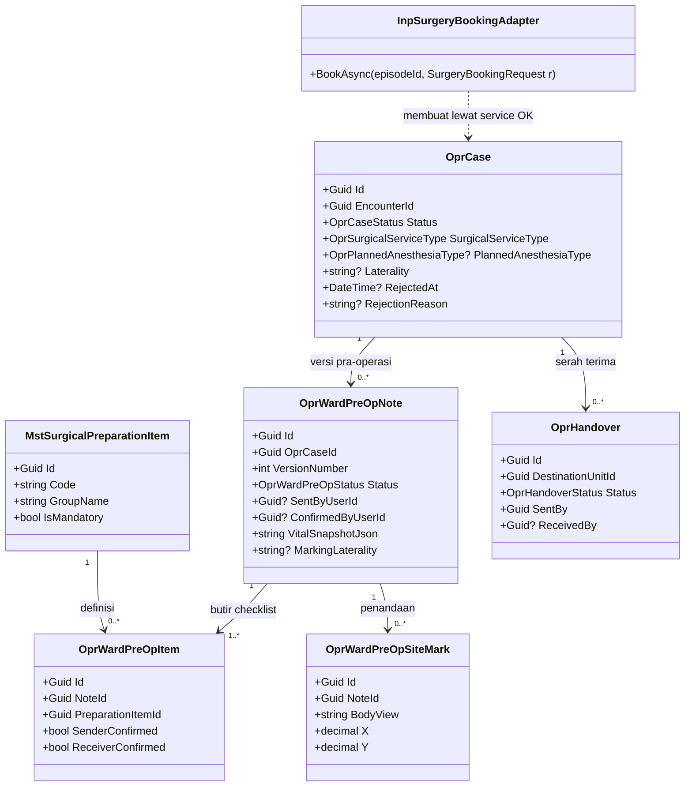
```mermaid
classDiagram
    class OprCase {
        +Guid Id
        +Guid EncounterId
        +OprCaseStatus Status
        +OprSurgicalServiceType SurgicalServiceType
        +OprPlannedAnesthesiaType? PlannedAnesthesiaType
        +string? Laterality
        +DateTime? RejectedAt
        +string? RejectionReason
    }
    class OprWardPreOpNote {
        +Guid Id
        +Guid OprCaseId
        +int VersionNumber
        +OprWardPreOpStatus Status
        +Guid? SentByUserId
        +Guid? ConfirmedByUserId
        +string VitalSnapshotJson
        +string? MarkingLaterality
    }
    class OprWardPreOpItem {
        +Guid Id
        +Guid NoteId
        +Guid PreparationItemId
        +bool SenderConfirmed
        +bool ReceiverConfirmed
    }
    class OprWardPreOpSiteMark {
        +Guid Id
        +Guid NoteId
        +string BodyView
        +decimal X
        +decimal Y
    }
    class MstSurgicalPreparationItem {
        +Guid Id
        +string Code
        +string GroupName
        +bool IsMandatory
    }
    class OprHandover {
        +Guid Id
        +Guid DestinationUnitId
        +OprHandoverStatus Status
        +Guid SentBy
        +Guid? ReceivedBy
    }
    OprCase "1" --> "0..*" OprWardPreOpNote : versi pra-operasi
    OprWardPreOpNote "1" --> "1..*" OprWardPreOpItem : butir checklist
    OprWardPreOpNote "1" --> "0..*" OprWardPreOpSiteMark : penandaan
    MstSurgicalPreparationItem "1" --> "0..*" OprWardPreOpItem : definisi
    OprCase "1" --> "0..*" OprHandover : serah terima
    class InpSurgeryBookingAdapter {
        +BookAsync(episodeId, SurgeryBookingRequest r)
    }
    InpSurgeryBookingAdapter ..> OprCase : membuat lewat service OK
```

#### 12.6.2 Efek kasus selesai dan permintaan admisi

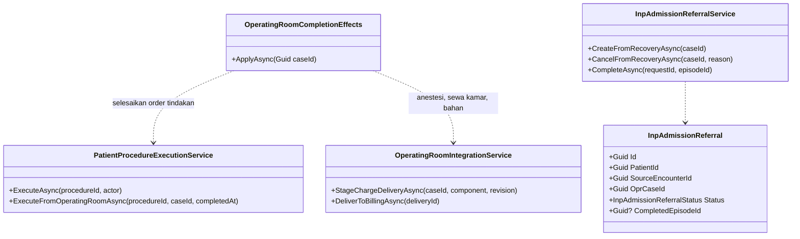
```mermaid
classDiagram
    class OperatingRoomCompletionEffects {
        +ApplyAsync(Guid caseId)
    }
    class PatientProcedureExecutionService {
        +ExecuteAsync(procedureId, actor)
        +ExecuteFromOperatingRoomAsync(procedureId, caseId, completedAt)
    }
    class OperatingRoomIntegrationService {
        +StageChargeDeliveryAsync(caseId, component, revision)
        +DeliverToBillingAsync(deliveryId)
    }
    class InpAdmissionReferral {
        +Guid Id
        +Guid PatientId
        +Guid SourceEncounterId
        +Guid OprCaseId
        +InpAdmissionReferralStatus Status
        +Guid? CompletedEpisodeId
    }
    class InpAdmissionReferralService {
        +CreateFromRecoveryAsync(caseId)
        +CancelFromRecoveryAsync(caseId, reason)
        +CompleteAsync(requestId, episodeId)
    }
    OperatingRoomCompletionEffects ..> PatientProcedureExecutionService : selesaikan order tindakan
    OperatingRoomCompletionEffects ..> OperatingRoomIntegrationService : anestesi, sewa kamar, bahan
    InpAdmissionReferralService ..> InpAdmissionReferral
```

#### 12.6.3 Serah terima transfer dan laporan

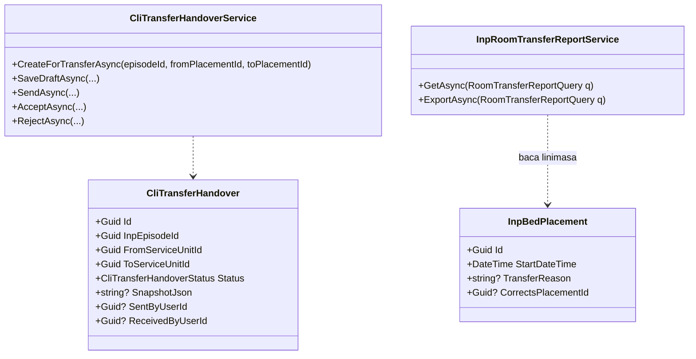
```mermaid
classDiagram
    class CliTransferHandover {
        +Guid Id
        +Guid InpEpisodeId
        +Guid FromServiceUnitId
        +Guid ToServiceUnitId
        +CliTransferHandoverStatus Status
        +string? SnapshotJson
        +Guid? SentByUserId
        +Guid? ReceivedByUserId
    }
    class CliTransferHandoverService {
        +CreateForTransferAsync(episodeId, fromPlacementId, toPlacementId)
        +SaveDraftAsync(...)
        +SendAsync(...)
        +AcceptAsync(...)
        +RejectAsync(...)
    }
    class InpRoomTransferReportService {
        +GetAsync(RoomTransferReportQuery q)
        +ExportAsync(RoomTransferReportQuery q)
    }
    class InpBedPlacement {
        +Guid Id
        +DateTime StartDateTime
        +string? TransferReason
        +Guid? CorrectsPlacementId
    }
    CliTransferHandoverService ..> CliTransferHandover
    InpRoomTransferReportService ..> InpBedPlacement : baca linimasa
```

### 12.7 Penjelasan setiap class

| Class | Status | Lokasi file | Kategori | Tanggung jawab | Penting | Dipanggil oleh / memakai | Transaksi | Catatan desain |
|---|---|---|---|---|---|---|---|---|
| `OprCase` | **Diperbarui** | `Areas/HealthServices/OperatingRoomManagement/Models/OprCase.cs` | Model (OK) | Jenis layanan bedah, rencana anestesi, jejak penolakan | `SurgicalServiceType`, `PlannedAnesthesiaType`, `RejectedAt`, `RejectedByUserId`, `RejectionReason` | Service kasus | — | `OprCaseType` (Elektif/Darurat) tetap terpisah dari jenis layanan |
| `OprCaseStatus` | **Diperbarui** | `.../OperatingRoomManagement/Enums/OperatingRoomEnums.cs` | Enum | Tambah `Rejected = 8` | — | — | — | Disetujui `RWI-DEC-208` |
| `OperatingRoomCaseService`, `OperatingRoomCaseController` | **Diperbarui** | `.../OperatingRoomManagement/Services/`, `/Controllers/` | Service + controller | Menerima `SurgicalServiceType` dan `PlannedAnesthesiaType`; `RejectAsync`; respons kasus ditambah jejak penolakan dan alasan status terakhir; bacaan ringkasan pasca operasi | `POST cases`, `PATCH cases/{id}/reject`, `GET cases/{id}/post-operative-summary` | Adapter bangsal, petugas OK, bangsal | Ya (tulis) | `POST cases` tetap menerima banyak tindakan untuk petugas OK |
| `InpSurgeryBookingAdapter`, `InpatientSurgeryBookingController` | **Baru** | `Areas/HealthServices/InPatientManagement/Services/InpSurgeryBookingAdapter.cs`, `/Controllers/InpatientSurgeryBookingController.cs` | Adapter + controller (Rawat Inap) | Pemesanan ruang bedah dari bangsal: episode `Admitted`, tepat satu order tindakan aktif milik kunjungan episode, tab Obgyn memaksa `Obstetric`, penginput dari akun login | `BookAsync`; `POST inpatient-management/episodes/{episodeId}/surgery-bookings` | Perawat dan dokter bangsal | Tidak membuka transaksi sendiri; memanggil service OK | Pola sama dengan `InpAncillaryOrderAdapter` (`dokter-rawat-inap` `0.7.0`) |
| `OperatingRoomPostOperativeSummaryQuery` | **Baru** | `.../OperatingRoomManagement/Services/OperatingRoomPostOperativeSummaryQuery.cs` | Service baca (OK) | Menggabungkan laporan operasi final, catatan anestesi, kamar pulih, dan serah terima terakhir | `GetAsync(caseId)` | `OperatingRoomCaseController` | Tidak | Laporan masih draft → `ReportFinal = false` dan isi klinis kosong (`FR-RWF-082`) |
| `OperatingRoomCommandSupport` | **Diperbarui** | `.../OperatingRoomManagement/Services/OperatingRoomCommandSupport.cs` | Helper | `AvailableActions(Requested)` ditambah `Reject` | Baris `77-88` | Frontend OK | — | — |
| `OprWardPreOpNote`, `OprWardPreOpItem`, `OprWardPreOpSiteMark` | **Baru** | `.../OperatingRoomManagement/Models/` | Model (OK) | Pra-operasi bangsal berversi, butir dua sisi, penandaan gambar tubuh | Kamus data 19.4 s.d. 19.6 | `OprWardPreOpService` | — | Foto tubuh tidak disimpan (`RWI-DEC-174`) |
| `OprWardPreOpService` | **Baru** | `.../OperatingRoomManagement/Services/OprWardPreOpService.cs` | Service (OK) | Simpan draf, kirim (dengan potret tanda vital dan nyeri), konfirmasi penerima, tandai "perlu diperbarui" saat ditunda | `SaveDraftAsync`, `SendAsync`, `ConfirmAsync`, `MarkNeedsUpdateAsync` | Controller; `OperatingRoomSchedulingService` | Ya | Tanda vital dari `TrxPatientVitalSign` terakhir; nyeri dari respons instrumen `PainScale` terakhir |
| `OperatingRoomPreparationController` | **Diperbarui** | `.../OperatingRoomManagement/Controllers/OperatingRoomPreparationController.cs` | Controller | Endpoint pra-operasi bangsal | `contracts/api-contract.md` 11.3 | `OprWardPreOpService` | — | — |
| `OperatingRoomPreparationService` | **Diperbarui** | `.../OperatingRoomManagement/Services/OperatingRoomPreparationService.cs` | Service | Syarat "Siap" keempat (`INV-RWF-26`, `27`) | — | Petugas OK | Ya | Jalur bypass darurat yang sudah ada tetap berlaku dengan alasan |
| `OperatingRoomSchedulingService` | **Diperbarui** | `.../OperatingRoomManagement/Services/OperatingRoomSchedulingService.cs` | Service | Penundaan memanggil `MarkNeedsUpdateAsync` dalam transaksi yang sama | `PostponeAsync` | — | Ya | — |
| `MstSurgicalPreparationItem` | **Baru** | `Areas/HealthServices/MasterData/Models/MstSurgicalPreparationItem.cs` | Master | Butir checklist persiapan beserta kelompok dan wajib/tidak | Kamus data 19.7 | Layar pra-operasi | — | Isi awal disahkan klinis |
| `SurgicalPreparationItemController` | **Baru** | `Areas/HealthServices/MasterData/Controllers/SurgicalPreparationItemController.cs` | Controller master | CRUD butir persiapan | `contracts/api-contract.md` 11.4 | Admin Master Data | — | — |
| `OperatingRoomRecoveryService`, `OperatingRoomRecoveryController` | **Diperbarui** | `.../OperatingRoomManagement/Services/`, `/Controllers/` | Service + controller | Permission kirim/terima dipisah; penerimaan memeriksa `INV-RWF-28` lewat `InpPatientLocationQuery`; simpan keputusan kamar pulih memanggil permintaan admisi | `POST handovers` (`Send`), `PATCH handovers/{id}/accept` (`Receive`) | Perawat OK, perawat unit tujuan | Ya | Panggilan permintaan admisi disetujui `RWI-DEC-208` |
| `OperatingRoomHandoverQueryController` | **Baru** | `.../OperatingRoomManagement/Controllers/OperatingRoomHandoverQueryController.cs` | Controller (OK) | Daftar serah terima per unit tujuan dan per status, termasuk yang tertunda melewati ambang | `GET operating-room-management/handovers` | Bangsal, Daftar Pantau | — | Baca saja |
| `OperatingRoomCompletionEffects` | **Baru** | `.../OperatingRoomManagement/Services/OperatingRoomCompletionEffects.cs` | Service (OK) | Efek kasus `Completed`: selesaikan setiap order tindakan yang dirujuk `OprCaseProcedure` (pesanan bangsal selalu satu); siapkan komponen anestesi (bila catatan anestesi final), sewa kamar operasi (durasi menit), dan bahan (`OprMaterialUsage` `Used`) | `ApplyAsync` | `OperatingRoomRecoveryService` sesudah commit | Ya | Idempoten per kasus dan komponen (`StageChargeDeliveryAsync` sudah berkunci) |
| `OperatingRoomIntegrationService` | **Diperbarui** | `.../OperatingRoomManagement/Services/OperatingRoomIntegrationService.cs` | Service (OK) | `BlockedDestinations` tidak lagi memuat Billing; adapter kirim lewat `BillingFolioService` dengan `SourceContext = OPERATING_ROOM` | `DeliverToBillingAsync` | Worker/rekonsiliasi delivery OK | Ya | Kunci `case:charge:component:revision` dipertahankan |
| `PatientProcedureExecutionService` | **Baru** | `Areas/HealthServices/ClinicalManagement/Services/PatientProcedureExecutionService.cs` | Service (Clinical) | Logika `PATCH patient-procedures/{id}/execute` dipindah ke sini; jalur OK menyelesaikan order dengan pelaksana dokter operator dan waktu = kasus selesai, **tanpa** mendaftarkan dokumen tindakan baru (dokumen klinisnya laporan operasi final OK) | `ExecuteAsync`, `ExecuteFromOperatingRoomAsync` | `PatientProcedureController`; `OperatingRoomCompletionEffects` | Ya; fakta tagih sesudah commit | Order yang sudah `Completed` dilewati (idempoten) |
| `PatientProcedureController` | **Diperbarui** | `.../ClinicalManagement/Controllers/PatientProcedureController.cs` | Controller | `execute` memanggil service baru; perilaku endpoint tidak berubah | — | — | — | Perubahan struktur, bukan perilaku |
| `InpAdmissionReferral` | **Baru** | `Areas/HealthServices/InPatientManagement/Models/InpAdmissionReferral.cs` | Model (Rawat Inap) | Permintaan admisi dari kamar pulih | Kamus data 19.8 | `InpAdmissionReferralService` | — | Prefix `Inp` |
| `InpAdmissionReferralService`, `InpatientAdmissionReferralController` | **Baru** | `.../InPatientManagement/Services/`, `/Controllers/` | Service + controller | Dibuat dari keputusan kamar pulih `Inpatient`/`Icu`; tidak dibuat bila episode hadir (jawaban "tidak perlu, serah terima biasa"); batal oleh OK; selesai saat admisi | `contracts/api-contract.md` 11.6 | OK; petugas admisi | Ya | Tidak membuat episode |
| `InpEpisodeService`, `InpatientEpisodeController` | **Diperbarui** | `.../InPatientManagement/Services/InpEpisodeService.cs`, `/Controllers/InpatientEpisodeController.cs` | Service + controller | Admisi menerima `AdmissionReferralId` opsional dan menyelesaikan permintaan dalam transaksi yang sama | — | Petugas admisi | Ya | Aturan admisi berlangkah tidak berubah |
| `InpPatientLocationQuery` | **Baru** | `.../InPatientManagement/Services/InpPatientLocationQuery.cs` | Service baca (Rawat Inap) | Menjawab "apakah pasien menempati bed aktif di unit X" | `IsPatientInUnitAsync(patientId, serviceUnitId)` | `OperatingRoomRecoveryService` | Tidak | Satu-satunya cara OK membaca lokasi bed |
| `InpRoomTransferReportService`, `InpatientReportController` | **Baru** | `.../InPatientManagement/Services/`, `/Controllers/` | Service + controller | Laporan transfer per periode dan ekspor Excel | `contracts/api-contract.md` 11.7 | Kepala ruangan, manajemen | Tidak | Periode maksimum 31 hari per permintaan |
| `CliTransferHandover`, `CliTransferHandoverService`, `TransferHandoverController` | **Baru** | `Areas/HealthServices/ClinicalManagement/Models/`, `/Services/`, `/Controllers/` | Model + service + controller (Clinical) | Dokumen serah terima transfer sembilan bagian V1 dengan potret | Kamus data 19.9; `contracts/api-contract.md` 11.8 | Rawat Inap sesudah transfer; perawat | Ya | `P2`; permission terima terpisah (`RWI-DEC-189`) |
| `InpBedOccupancyService` | **Diperbarui** | `.../InPatientManagement/Services/InpBedOccupancyService.cs` | Service | Transfer ke unit lain memanggil pembuatan dokumen serah terima sesudah commit | — | — | Ya (sudah) | Event transfer diatur `integrasi-billing` `1.1.0` |
| `MstInpatientSetting` | **Diperbarui** | `Areas/HealthServices/MasterData/Models/MstInpatientSetting.cs` | Master | Ambang daftar pantau | `PendingSurgicalHandoverAlertMinutes`, `PendingAdmissionReferralAlertMinutes` | Daftar Pantau | — | Gate G-18 `CONFIGURABLE_DEFAULT` |
| `OperatingRoomReportService` | **Diperbarui** | `.../OperatingRoomManagement/Services/OperatingRoomReportService.cs` | Service | Laporan `operations` memisahkan kasus ditolak dari dibatalkan | Baris `128-139` | — | Tidak | — |

### 12.8 Enum baru dan berubah

| Enum | Lokasi | Nilai | Bawaan |
|---|---|---|---|
| `OprCaseStatus` | `OperatingRoomManagement/Enums/OperatingRoomEnums.cs` | Tambah `Rejected = 8` | — |
| `OprSurgicalServiceType` | Sama | `General = 1`, `Obstetric = 2` | `General` |
| `OprPlannedAnesthesiaType` | Sama | `General = 1`, `Regional = 2`, `Local = 3`, `Sedation = 4` — **usulan**, disahkan pemilik OK saat implementasi | — (nullable) |
| `OprWardPreOpStatus` | Sama | `Draft = 1`, `Sent = 2`, `Confirmed = 3`, `NeedsUpdate = 4`, `Superseded = 5` | `Draft` |
| `MstSurgeryComponentType` | `MasterData/Enums/` | `None = 0`, `AnesthesiaService = 1`, `OperatingRoomRent = 2` | `None` |
| `MstTariffChargeBasis` | `MasterData/Enums/` | `PerService = 0`, `PerHour = 1` | `PerService` |
| `InpAdmissionReferralStatus` | `InPatientManagement/Enums/` | `Pending = 1`, `Completed = 2`, `Cancelled = 3` | `Pending` |
| `CliTransferHandoverStatus` | `ClinicalManagement/Enums/` | `NotSent = 1`, `Sent = 2`, `Accepted = 3`, `Rejected = 4` | `NotSent` |
| Komponen kiriman OK (konstanta) | `OperatingRoomIntegrationService` | `ANESTHESIA`, `OR_RENT`, `MATERIAL-{usageId}` | — |

### 12.9 Arsitektur folder — delta revision `0.9`

```text
Areas/HealthServices/
├── OperatingRoomManagement/
│   ├── Models/OprCase.cs                                  [Diperbarui]
│   ├── Models/OprWardPreOpNote.cs, OprWardPreOpItem.cs,
│   │          OprWardPreOpSiteMark.cs                     [Baru]
│   ├── Enums/OperatingRoomEnums.cs                        [Diperbarui]
│   ├── DTOs/OperatingRoomCaseDtos.cs                      [Diperbarui]
│   ├── DTOs/OprWardPreOpDtos.cs                           [Baru]
│   ├── Services/OperatingRoomCaseService.cs               [Diperbarui]
│   ├── Services/OperatingRoomCommandSupport.cs            [Diperbarui]
│   ├── Services/OprWardPreOpService.cs                    [Baru]
│   ├── Services/OperatingRoomPreparationService.cs        [Diperbarui]
│   ├── Services/OperatingRoomSchedulingService.cs         [Diperbarui]
│   ├── Services/OperatingRoomRecoveryService.cs           [Diperbarui]
│   ├── Services/OperatingRoomCompletionEffects.cs         [Baru]
│   ├── Services/OperatingRoomPostOperativeSummaryQuery.cs [Baru]
│   ├── Services/OperatingRoomIntegrationService.cs        [Diperbarui]
│   ├── Services/OperatingRoomReportService.cs             [Diperbarui]
│   └── Controllers/OperatingRoomCaseController.cs, OperatingRoomPreparationController.cs,
│                   OperatingRoomRecoveryController.cs     [Diperbarui]
│       Controllers/OperatingRoomHandoverQueryController.cs [Baru]
├── MasterData/
│   ├── Models/MstSurgicalPreparationItem.cs               [Baru]
│   ├── Models/MstInpatientSetting.cs                      [Diperbarui]
│   ├── Enums/MstSurgeryComponentType.cs, MstTariffChargeBasis.cs [Baru]
│   └── Controllers/SurgicalPreparationItemController.cs   [Baru]
├── ClinicalManagement/
│   ├── Models/CliTransferHandover.cs                      [Baru]
│   ├── Enums/CliTransferHandoverStatus.cs                 [Baru]
│   ├── Services/PatientProcedureExecutionService.cs       [Baru]
│   ├── Services/CliTransferHandoverService.cs             [Baru]
│   └── Controllers/TransferHandoverController.cs          [Baru]
│       Controllers/PatientProcedureController.cs          [Diperbarui: execute memanggil service]
└── InPatientManagement/
    ├── Models/InpAdmissionReferral.cs                      [Baru]
    ├── Enums/InpAdmissionReferralStatus.cs                 [Baru]
    ├── Services/InpAdmissionReferralService.cs             [Baru]
    ├── Services/InpSurgeryBookingAdapter.cs               [Baru]
    ├── Services/InpPatientLocationQuery.cs                [Baru]
    ├── Services/InpRoomTransferReportService.cs           [Baru]
    ├── Services/InpEpisodeService.cs                      [Diperbarui]
    ├── Services/InpBedOccupancyService.cs                 [Diperbarui]
    └── Controllers/InpatientAdmissionReferralController.cs, InpatientReportController.cs,
                    InpatientSurgeryBookingController.cs   [Baru]
        Controllers/InpatientEpisodeController.cs          [Diperbarui]
Repositories/Configurations/HealthServices/   (configuration untuk setiap model Baru dan Diperbarui)
Areas/HealthServices/BillingManagement/Billing/Services/BillingSourceTariffResolver.cs,
    BillingClinicalChargeBridgeService.cs                 [Diperbarui: SourceContext OPERATING_ROOM — milik Billing, RWI-DEC-192/196]
```

### 12.10 Status model dan dampak migration

| Tabel | Status | Kolom yang berubah | Dampak |
|---|---|---|---|
| `OprCase` | Diperbarui | Tambah `SurgicalServiceType` (`int`, bawaan `1`), `PlannedAnesthesiaType` (`int?`), `RejectedAt` (`timestamp?`), `RejectedByUserId` (`uuid?`), `RejectionReason` (`varchar(500)?`) | Kasus lama `General`; tanpa rencana anestesi |
| `OprWardPreOpNote`, `OprWardPreOpItem`, `OprWardPreOpSiteMark` | Baru | Seluruh kolom | — |
| `MstSurgicalPreparationItem` | Baru | Seluruh kolom | Wajib berisi sebelum pra-operasi dipakai |
| `MstTariff` | Diperbarui | `SurgeryComponentType`, `ChargeBasis`, `ChargeRounding` (rinci di `keperawatan` 12.14) | Satu migration bersama `K8` |
| `MstInpatientSetting` | Diperbarui | Tambah `PendingSurgicalHandoverAlertMinutes` (`int`, `60`), `PendingAdmissionReferralAlertMinutes` (`int`, `30`) | Baris bawaan mendapat nilai bawaan |
| `InpAdmissionReferral` | Baru | Seluruh kolom | — |
| `CliTransferHandover` | Baru | Seluruh kolom | `P2` |

### 12.11 Rencana migration di dalam sub-modul ini

| Langkah | Isi | Tanpa downtime | Data lama | Mundur |
|---|---|---|---|---|
| `E4` | `MasterData`: `MstSurgicalPreparationItem`; tiga kolom komponen operasi `MstTariff` (satu migration bersama `K8`); dua kolom `MstInpatientSetting` | Ya | Bawaan aman | `Down()` |
| `E5` | OK: kolom `OprCase`; tabel pra-operasi (merujuk `MstSurgicalPreparationItem`, maka sesudah `E4`); nilai status `Rejected` (enum, tanpa perubahan kolom) | Ya | Bawaan `General` | `Down()`; nilai `Rejected` tidak dipakai sebelum kode dirilis |
| `E6` | Rawat Inap: `InpAdmissionReferral` | Ya | — | `Down()` |
| `E7` | Clinical: `CliTransferHandover` (`P2`, `RWF-W5`) | Ya | — | `Down()` |
| `E8` | Data awal butir persiapan dan tarif komponen operasi (12.12); salin pemberian hak `OperatingRoomHandover : Update` menjadi `: Send` pada peran yang sama | Ya | — | Hapus baris; hak `Update` lama tetap ada sampai rilis kode berhasil |

### 12.12 Rencana data master dan konfigurasi awal

| Master | Isi minimum | Sumber nilai |
|---|---|---|
| `MstSurgicalPreparationItem` | Empat kelompok `RWI-DEC-173` butir 3 — verifikasi pasien, persiapan fisik, hasil pemeriksaan, persiapan lain — dengan butir V1 (misalnya "Gelang identitas terpasang", "Puasa sejak jam …", "Persetujuan tindakan tersedia", "Hasil laboratorium pra-operasi ada") | Capture V1 `captures/keperawatan/`; **disahkan pemilik klinis sebelum produksi** |
| `MstTariff` komponen operasi | Satu baris `AnesthesiaService` dan satu `OperatingRoomRent` per kelas yang dipakai, dengan `ChargeBasis` yang ditetapkan (misalnya sewa kamar `PerHour`) | Billing dan pemilik tarif. Tanpa tarif: baris "tarif belum ada" |
| `MstTariff` bahan OK | Baris tarif per `DrugId` untuk bahan dan implan yang dipakai OK | Admin Master Data / Farmasi |
| `MstInpatientSetting` | Ambang 60 dan 30 menit | Usulan bawaan (G-18) |
| Pemberian hak peran | `OperatingRoomHandover : Receive` pada peran perawat unit rawat inap dan ICU; `OperatingRoomWardPreOp : Send` pada perawat bangsal, `: Confirm` pada perawat OK; `OperatingRoomCase : Reject` pada petugas penjadwalan OK; `InpatientAdmissionReferral : Read` pada petugas admisi | Admin hak akses; **tidak** disalin otomatis dari `Update` agar perawat OK tidak menjadi penerima |

### 12.13 Yang sengaja tidak dibuat pada revision `0.9`

| Yang ditolak | Alasan |
|---|---|
| Status "Disetujui" pada kasus OK | Menyetujui = menjadwalkan (`RWI-DEC-204` butir 2) |
| Admisi otomatis dari kamar pulih | `RWI-DEC-201` butir 2 |
| Memindahkan baris biaya operasi kunjungan asal ke invoice `RANAP` | `RWI-DEC-207` memilih tautan non-destruktif (`BKC-DEC-118`); tautannya milik Billing (`integrasi-billing` 9.14) |
| Salinan ringkasan operasi di Rawat Inap | `PR-RWF-05`; dibaca dari OK |
| Master keanggotaan perawat per unit | `RWI-DEC-189` butir 6 |
| Foto tubuh pasien | `RWI-DEC-174` |
| Tabel laporan transfer | Bacaan linimasa (`RWI-DEC-205` butir 1) |
| Pembayaran jasa medis, asisten, dan diskon operasi | Milik modul jasa medis dan Billing (`RWI-DEC-197`) |
| Mempersempit `POST cases` OK menjadi satu tindakan | Petugas OK memakai banyak tindakan per kasus; aturan satu order hanya untuk pesanan bangsal |
| Endpoint daftar kasus khusus bangsal | `GET cases?encounterId=` sudah ada; cukup respons ditambah |
| Ruang bersalin sebagai lokasi OK | Hanya bila modul OK mendukung (`RWI-DEC-175` butir 4); tidak ada perubahan lokasi |

### 12.14 Traceability bagian 12

| Bagian | Requirement | Keputusan | Acceptance |
|---|---|---|---|
| Pemesanan, status, Obgyn | `FR-RWF-040` s.d. `044`, `048` | `RWI-DEC-174` s.d. `176`, `204` | `AC-RWF-040`, `041`, `045`, `048`, `085` |
| Pra-operasi dan penundaan | `FR-RWF-045`, `090` | `RWI-DEC-173`, `199` | `AC-RWF-042`, `046`, `093`, `094` |
| Serah terima dan bed | `FR-RWF-046`, `049`, `088` | `RWI-DEC-177`, `189` | `AC-RWF-043`, `047`, `049`, `087` |
| Biaya operasi | `FR-RWF-047` | `RWI-DEC-196` | `AC-RWF-044`, `092` |
| Admisi dari kamar pulih | `FR-RWF-080`, `089` | `RWI-DEC-201` | `AC-RWF-080`, `088`, `089` |
| Ringkasan operasi | `FR-RWF-081`, `082` | `RWI-DEC-197` | `AC-RWF-081`, `082` |
| Penolakan order | `FR-RWF-086` | `RWI-DEC-204` | `AC-RWF-085`, `099` |
| Laporan transfer | `FR-RWF-087` | `RWI-DEC-205` | `AC-RWF-086`, `100` |
| Serah terima transfer | `FR-RWF-071` | `RWI-DEC-182`, `189` | `AC-RWF-071`, `072` |

### 12.15 Penyelarasan decision log revision `31` ★ 2 Oktober 2026

Kontrak tetap `0.10.0` `draft`. Bagian ini menyerap `RWI-DEC-207` s.d. `220`.

| Keputusan | Akibat pada sub-modul ini |
|---|---|
| `RWI-DEC-207` (`DEC-INP-018`) | Tidak ada tabel atau service baru di Rawat Inap. Billing membaca `InpAdmissionReferral` (19.8) saat memproses `ADMISSION_CONFIRMED` dan mencatat `BilInvoiceEncounterLink` (`integrasi-billing` 9.14, `INT-RWF-29`). `InpAdmissionReferral` kini menjadi target FK `BilInvoiceEncounterLink.SourceReferralId` (`Restrict`) |
| **Koreksi desain** | `INT-RWF-25` sebelumnya menulis ketukan pintu "ditambah `SourceEncounterId`". Itu melanggar daftar putih isi pesan (`INV-RWF-05`, `RWI-DEC-166`). Yang benar: pesan tetap daftar putih; Billing membaca kunjungan asal dari sumbernya |
| `RWI-DEC-208` | `PATCH cases/{id}/reject`, status `Rejected`, `INT-RWF-23`, dan `INT-RWF-24` tidak lagi tertahan persetujuan OK |
| `RWI-DEC-213` | Frontend saja: penanda "Pasca operasi" di panel Konteks pasien ruang kerja dokter membuka `FE-INP-28` |
| `RWI-DEC-214`, `RWI-DEC-215` | Frontend saja: butir menu ke-10 "Laporan Rawat Inap" (wadah) membuka `FE-INP-32`; guard butir = memegang salah satu permission laporan rawat inap (hari ini `InpatientReport : ReadRoomTransfer`). Tidak ada endpoint baru |
| `RWI-DEC-217` | `CAP-RWF-18`, `19`, `22` `P1` — urutan gelombang di `04-prd-to-mvp.md` 23.20 tetap |
| `RWI-DEC-218`, `RWI-DEC-219` | `FE-INP-25` menampilkan perkiraan tarif tindakan dari order yang dirujuk, memakai `UnitPrice` dan `CoverageStatus` yang **sudah** dikembalikan `GET clinical-management/patient-procedures` (`PatientProcedureResponse`), berlabel "perkiraan — tagihan final di kasir", disertai keterangan bahwa anestesi, sewa kamar operasi, dan bahan ditagihkan setelah operasi. Tidak ada endpoint baru |
| `RWI-DEC-220` | Enam aturan bawaan desain disahkan: `VAL-RWF-87` (butir 1), `VAL-RWF-71` (butir 2), pemberian hak `Receive` pada 12.12 (butir 3), `VAL-RWF-90` (butir 4), ambang `MstInpatientSetting` 12.12 (butir 6). Butir 5 milik `dokter-rawat-inap` 12.13 |

---

## 13. Amandemen revision `0.10` / kontrak `0.11.0` — Workspace PPRI (Ruang Kerja Penerimaan Pasien Rawat Inap) ★ 7 Oktober 2026

### 13.0 Masukan, batas, dan cara membaca bagian ini

| Hal | Isi |
|---|---|
| Status | **`approved`** — Muhammad Hamzah, 2026-10-08 (`RWI-DEC-265`); ditulis `design-business-module` 2026-10-07. Kontrak `0.10.0` Finishing tetap `approved` (`RWI-DEC-221`) dan **tidak disunting**; task Finishing `BE-RWI-172` s.d. `184` tetap berpegang padanya (`RWI-DEC-227`) |
| Nama | Label yang dilihat pengguna **"Workspace PPRI"** (`RWI-DEC-245`). Nama teknis tetap memakai kata *Admission*: resource `InpatientAdmissionDocument`, tabel `InpAdmission*`, kode `RWA` |
| Kemampuan | `CAP-RWA-01` s.d. `CAP-RWA-17`, **tanpa** `CAP-RWA-04` (dibatalkan `RWI-DEC-226`), `CAP-RWA-10`, dan `CAP-RWA-12` (tetap ditunda, `RWI-OQ-119`, `RWI-OQ-120`) |
| Slice gate `1.11` | `INP-S38` s.d. `INP-S45` dan `INP-S47` `READY_FOR_DOMAIN_DESIGN`; `INP-S46` Estimasi Biaya `PARTIALLY_READY` (`DEC-INP-020`); `INP-S48` tanda tangan digital `BUSINESS_DECISION_REQUIRED` (`DEC-INP-003`) — **tidak dirancang** |
| Keputusan | `RWI-DEC-225` s.d. `RWI-DEC-264`; fakta `RWI-FACT-060` s.d. `RWI-FACT-067`; butir terbuka `RWI-OQ-116` s.d. `RWI-OQ-129` |
| Bukti as-is | Capability map `1.7` bagian 20 (`PPRI-CAP-01` s.d. `54`) pada `BE@671191e` / `FE@2788966`; diperiksa ulang pada HEAD `BE@fdf85a07` (`RWI-FACT-065`) dan `FE@27889662a`. Pembacaan source desain ini di 13.1 |
| Arsitektur domain | `DOMAIN_ARCHITECTURE_NOT_RUN` — gate `1.11` bagian 20.11 menilai tidak perlu: seluruh tabel baru milik `InPatientManagement` (`RWI-DEC-228`), data modul lain dibaca lewat service pemiliknya (`RWI-DEC-257`, `264`) |
| Gerbang implementasi | `RWI-OQ-124` (data peran), `RWI-OQ-126` (`PatientManagement`), `RWI-OQ-127` (HR Master Data), `RWI-OQ-128` (Registration, cadangan garis kosong), `RWI-OQ-129` (Billing, cadangan "lihat kasir"), `RWI-DEC-193` (perluasan `MasterData`), QBE `TOUCHED LEGACY` pada `SortOrder` master butir |
| Bagian yang sengaja **tidak** dirancang | Penyimpanan General Consent dan tanda tangan digital (`DEC-INP-003`, `RWI-DEC-230`); baris visit dokter dan catatan aturan biaya bedah pada Estimasi Biaya (`DEC-INP-020`); MP Benefit dan Estimasi Rinci |

**Satu kalimat terpenting.** Workspace PPRI menambah **satu agregat dokumen admisi milik Rawat Inap**: sepuluh tabel untuk gelombang `RWA-MVP-0` s.d. `RWA-MVP-2`, tiga tabel Estimasi Biaya yang dirancang tetapi berada di luar gelombang, dan dua master yang diperluas. Seluruh data pasien, penjamin, deposit, dan profil rumah sakit **dibaca dari service modul pemiliknya** dan hanya disalin sebagai salinan beku saat dokumen dikunci (`RWI-DEC-263`).

### 13.1 Fakta source yang dibaca desain ini

| Fakta | Bukti (`BE@fdf85a07`, `FE@27889662a`) | Akibat pada desain |
|---|---|---|
| Master butir administrasi tidak punya jenis maupun induk. Konsumennya tiga: daftar periksa penutupan (membaca **semua** butir aktif), penandaan butir penutupan, dan seeder | `MasterData/Models/MstInpatientClearanceItem.cs:8-27`; `InPatientManagement/Services/InpDischargeService.Closure.cs:88-101`, `:162-177`; `MasterData/Seeders/InpatientMasterDataSeeder.cs:140-200` | Tiga kolom baru; **kedua** titik penutupan menyaring jenis pada task yang sama dengan migration (`INV-RWA-12`) |
| Pengaturan Rawat Inap satu baris berisi angka waktu dan awalan nomor; tanpa kode formulir, kota, batas umur gelang bayi | `MasterData/Models/MstInpatientSetting.cs:8-62`; layar `FE-INP-12` | Sebelas kolom baru (`RWI-DEC-247`, `243`) |
| Pola entity `Inp*` terbaru: `Guid RowVersion` sebagai token konkurensi, unique index bersaring, `CHECK` keadaan | `InPatientManagement/Models/InpAdmissionReferral.cs:23-59`; `Repositories/Configurations/HealthServices/InPatientManagement/InpAdmissionReferralConfiguration.cs:16-58` | Ditiru seluruh tabel baru |
| Pola kunci idempoten: kolom `IdempotencyKey` maksimal 80 karakter, unique index bersaring | `ClinicalManagement/Models/CliNursingIntervention.cs`; `CliNursingInterventionConfiguration.cs:56, 136-138`; header `Idempotency-Key` di `InpatientSurgeryBookingController.cs:75` | Dipakai simpan konsep, versi koreksi, tanda tangan, dan log cetak |
| Pola salinan beku `jsonb` | `ClinicalManagement/Models/CliTransferHandover.cs:46 #SnapshotJson` | `InpAdmissionDocument.SnapshotJson` |
| Pemesanan bed dan penempatan bed adalah dua tabel; "menempati bed" = penempatan berjalan yang belum berakhir dan belum digantikan koreksi | `InPatientManagement/Models/InpBedReservation.cs`, `InpBedPlacement.cs`; `Services/InpPatientLocationQuery.cs:8-21, 69-75` | Syarat slot Perawat penerima dibaca dari penempatan, bukan pemesanan (`RWI-DEC-255`) |
| Satu method hanya boleh punya satu `[AccessPermission]`; aksi kustom dikelompokkan lewat `[AccessAction(..., AccessType = ...)]` | `Attributes/AccessPermissionAttribute.cs:30`; `InpatientEpisodeController.cs:341-342` (`SetIsolation`) | Satu endpoint per slot tanda tangan petugas |
| Rupiah dipisah ke endpoint `/amounts` yang dijaga `ViewAmount` | `BillingManagement/Operational/Controllers/PatientBillingSummaryController.cs:50-65` | Pola yang sama untuk header, dokumen, dan IPD (`RWI-DEC-258`) |
| Pemeriksaan hak kedua di dalam service sudah dipakai Rawat Inap | `InPatientManagement/Services/InpAncillaryOrderAdapter.cs:46` (`AccessPermissionService.HasAccessAsync`) | Cetak dokumen berupiah memeriksa `Print` di service setelah attribute `ViewAmount` |
| Penjamin kunjungan dibaca lewat konteks asuransi Clinical; konteks itu **tanpa** nomor kartu dan nomor peserta. `EncounterPaymentSourceService` hanya menulis | `ClinicalManagement/Services/EncounterInsuranceService.cs:25`, `:466-500`; `RegistrationManagement/Services/EncounterPaymentSourceService.cs:16` (`RWI-FACT-067`) | `EncounterInsuranceContext` diperluas dua isian (milik Muhammad Hamzah, `RWI-DEC-264`) |
| Surat Pengantar Rawat Inap terbaca lewat `DoctorCertificateService`, urut tanggal terbit; responsnya ikut membawa data pasien dan gambar tanda tangan dokter | `ClinicalManagement/Services/DoctorCertificateService.cs:63-100`; `DTOs/DoctorCertificateDtos.cs:85-115` | Satu method baca ramping baru di service yang sama (`RWI-DEC-254`, `262`) |
| Kasus OK terbaca per kunjungan | `OperatingRoomManagement/Services/OperatingRoomCaseService.cs:37 #GetPagedAsync` (`OprCasePagedQuery.EncounterId`, `Status`) | Dipakai apa adanya untuk aturan wajib Estimasi (`RWI-DEC-250`) |
| Ringkasan deposit episode, perkiraan harga tindakan dan tarif per penjamin | `BillingManagement/Billing/Services/BillingDepositService.cs:116`; `ClinicalManagement/Services/InsuranceCoverageService.cs:67, 102` | Dipakai apa adanya |
| Tarif kamar per hari hanya ditentukan method `private` Billing | `BillingManagement/Billing/Services/BillingCalculationService.cs:797 #ResolveRoomTariff` | Method baca publik baru menunggu `RWI-OQ-129`; cadangan "lihat kasir" |
| Dokter perujuk luar kunjungan tidak punya service baca | `RegistrationManagement/Models/RegPatientEncounter.cs:139`; `MasterData/Models/MstReferralDoctor.cs:24-36` | Service baca baru menunggu `RWI-OQ-128`; cadangan garis kosong |
| Isi QR pasien dibentuk method `private static` di controller; `PatientManagement/MasterData/` belum punya folder `Services/` | `PatientManagement/MasterData/Controllers/PatientController.cs:1386-1400` | Pembentuk QR diekstrak tanpa mengubah perilaku; service baca pasien baru (`RWI-OQ-126`) |
| Profil rumah sakit: `IsMainSite`, nama, kode, alamat, telepon, email, zona waktu; **tanpa logo**; controller memakai context langsung | `Corporate/HumanResource/MasterData/Organization/Models/MstHospitalSite.cs:11-60`; `Controllers/HospitalSiteController.cs` | Service baca profil baru (`RWI-OQ-127`); logo tetap berkas statis frontend |
| Alergi aktif dibaca controller langsung dari context | `ClinicalManagement/Controllers/PatientAllergyController.cs:98-99` | Service baca alergi baru di Clinical; controller memanggilnya tanpa perubahan perilaku |
| Nama tampilan akun dibaca dari `_dbContext.Users` oleh service Rawat Inap | `InPatientManagement/Services/InpDischargeService.Departure.cs:46`; `InpRoomTransferReportService.cs:181`; `Models/ApplicationUser.cs:12, 26, 58` | Atestasi membaca `DisplayName` dan `PrimaryPosition.PositionName` dengan pola yang sama |
| Seeder master Rawat Inap menolak berjalan di produksi | `InpatientMasterDataSeeder.cs:15-47` (`RWI-DEC-048`) | Data awal produksi diisi admin lewat `FE-INP-12` dan `FE-INP-13` (13.13) |
| Detail episode sudah membawa daftar peringatan teks | `InPatientManagement/DTOs/InpatientEpisodeDtos.cs:238 #Warnings`; `FE inpatient-episode-detail-view.jsx:714-719` | Peringatan kelengkapan dan jatuh tempo masuk ke daftar ini |
| Penjaga tulis episode untuk dokumen klinis | `ClinicalManagement/Services/NursingEpisodeWriteGuard.cs:100-140` | Ditiru sebagai `InpAdmissionWriteGuard`, tanpa pemeriksaan unit perawat |

### 13.2 Yang berubah dari revision `0.9`

| Hal | Revision `0.9` | Revision `0.10` |
|---|---|---|
| Dokumen penerimaan pasien | Tidak ada; hanya cetak Surat Persetujuan 12 butir tanpa simpan (`RWI-DEC-077`) | Enam jenis dokumen tersimpan dan berversi: Serah Terima Pasien Baru, Permintaan Privasi, Nilai Kepercayaan, Selisih Biaya, Pelunasan Deposit, Estimasi Biaya (Estimasi di luar gelombang) |
| Tanda tangan | Tidak ada | Slot pasien/keluarga mode kertas dan atestasi petugas lima slot |
| Cetak gelang, label, IPD | Tidak ada | Data cetak dirangkai server; setiap cetak tercatat; cetak ulang beralasan |
| Master butir administrasi | Satu daftar untuk penutupan | Dua jenis daftar (penutupan, serah terima) dengan sub-butir dan sumber saran |
| Pengaturan Rawat Inap | Angka waktu dan awalan nomor | + delapan kode formulir, kota penandatanganan, batas umur gelang bayi, kode singkat rumah sakit pada label |
| Detail episode | Peringatan yang sudah ada | + "Dokumen admisi belum lengkap" dan "Pelunasan deposit jatuh tempo terlewati" (tanpa rupiah) |
| Penutupan episode | Membaca semua butir aktif | Hanya butir jenis penutupan |
| Modul lain | — | Lima service baca baru atau diperluas di modul pemilik (13.6) |

### 13.3 Bounded context, aggregate, dan invariant

**Bounded context:** *Dokumen penerimaan pasien rawat inap* di dalam `InPatientManagement`, sub-modul `episode-rawat-inap`. Konteks ini **membaca** episode, penempatan, pasien, penjamin, deposit, dan profil rumah sakit, dan **tidak pernah menulis** ke tabel modul lain.

| Aggregate | Root | Anak | Batas konsistensi |
|---|---|---|---|
| Dokumen admisi (satu versi) | `InpAdmissionDocument` | `InpAdmissionDocumentSignature`, `InpAdmissionDocumentParty`, `InpAdmissionHandoverItem`, `InpAdmissionPrivacyRequest`, `InpAdmissionPrivacyEntry`, `InpAdmissionBeliefItem`, `InpAdmissionCostDifferenceStatement`, `InpAdmissionDepositStatement`, `InpAdmissionCostEstimate`, `InpAdmissionCostEstimateLine` | Satu transaksi per perintah; `RowVersion` kepala dokumen menjaga seluruh anak |
| Log cetak | `InpAdmissionPrintLog` | — | Tambah saja; tidak pernah diubah |
| Penanda rencana tindakan (Estimasi, di luar gelombang) | `InpAdmissionProcedurePlanMark` | — | Satu penanda aktif per episode |

Setiap **versi** dokumen adalah satu baris `InpAdmissionDocument` sendiri. Versi koreksi menunjuk versi sebelumnya lewat `PreviousVersionId`. Dengan begitu tanda tangan, salinan beku, dan isi versi lama tidak pernah ditimpa.

| ID | Invariant | Penjaga |
|---|---|---|
| `INV-RWA-01` | Paling banyak satu dokumen aktif (`Draft`, `AwaitingSignature`, `Completed`) per jenis per episode | Unique index bersaring `UX_InpAdmissionDocument_Episode_Type_Active`; `InpAdmissionDocumentService` |
| `INV-RWA-02` | Dokumen `AwaitingSignature` yang sudah punya tanda tangan, dan dokumen `Completed`, tidak berubah isinya | `InpAdmissionDocumentService` (409) |
| `INV-RWA-03` | Tidak ada hapus permanen maupun endpoint `DELETE` | Kontrak API; `IsDelete` tidak dipakai alur bisnis |
| `INV-RWA-04` | Satu akun tidak mengisi dua slot petugas pada dokumen yang sama | Unique index bersaring (`DocumentId`, `SignedByUserId`); `InpAdmissionSignatureService` (422) |
| `INV-RWA-05` | Identitas pasien di dokumen berasal dari service pemilik, bukan dari request | Request tidak punya isian identitas pasien; `InpAdmissionSnapshotBuilder` |
| `INV-RWA-06` | Angka rupiah berasal dari Billing atau tarif, tidak pernah dari request | Request tidak punya isian angka deposit maupun harga bertarif |
| `INV-RWA-07` | Tidak ada data karangan: nomor kartu kosong tetap kosong, isian tanpa sumber dicetak garis kosong | `InpAdmissionWorkspaceQueryService` |
| `INV-RWA-08` | Penulisan hanya pada episode `Admitted` atau `DischargePending` | `InpAdmissionWriteGuard` (409) |
| `INV-RWA-09` | Cetak ulang selalu beralasan dan tercatat | `InpAdmissionPrintService`; `CK_InpAdmissionPrintLog_Reprint` |
| `INV-RWA-10` | Isi dan angka dibekukan saat dikunci; cetakan `AwaitingSignature` dan sesudahnya selalu dibentuk dari salinan beku (`RWI-DEC-263`) | `CK_InpAdmissionDocument_State`; `InpAdmissionPrintService` |
| `INV-RWA-11` | Slot Perawat penerima hanya bila pasien menempati bed aktif pada episode itu (`RWI-DEC-255`) | `InpAdmissionSignatureService` lewat `InpPatientLocationQuery` |
| `INV-RWA-12` | Penutupan episode hanya membaca butir jenis penutupan; serah terima hanya butir jenis serah terima (`RWI-DEC-241`) | `InpDischargeService.Closure`; `InpAdmissionPrefillService` |
| `INV-RWA-13` | Rupiah hanya bagi pemegang `ViewAmount`; dokumen berupiah hanya dicetak pemegang `ViewAmount` (`RWI-DEC-258`) | Endpoint `/amounts` dan `/amount-print` |
| `INV-RWA-14` | Rawat Inap tidak menulis satu pun query ke tabel master modul lain untuk Workspace PPRI (`RWI-DEC-264`) | `InpAdmissionSourceReader` sebagai satu-satunya pintu baca |
| `INV-RWA-15` | General Consent tidak meninggalkan rekaman apa pun selama *fail-closed* (`RWI-DEC-230`, `233`) | Tidak ada jenis dokumen General Consent; tab cetak hanya membaca |

**Contoh `INV-RWA-10`.** Sari mengunci Pelunasan Deposit Tn. Budi pukul 10.00 saat Billing mencatat kekurangan Rp 3.000.000. Kasir menerima tambahan Rp 1.000.000 pukul 10.10. Lembar yang ditandatangani Ny. Rina pukul 10.15 dan cetak ulang sesudah `Completed` tetap Rp 3.000.000, karena dibentuk dari salinan beku; header ruang kerja menulis kekurangan terkini Rp 2.000.000.

### 13.4 Kepemilikan data yang disentuh

Tabel kepemilikan seluruh modul ada di [`../02-module-map.md`](../02-module-map.md) bagian 8.2. Baris di bawah hanya kelompok data yang disentuh amandemen ini.

| Kelompok data | Pemilik | Diubah amandemen ini | Dibuat ulang |
|---|---|---|---|
| Dokumen admisi, tanda tangan, pihak, isi per jenis | **`InPatientManagement`** (`RWI-DEC-228`) | Ya, baru | Tidak ada pendahulu |
| Log cetak gelang, label, IPD, dokumen | **`InPatientManagement`** | Ya, baru | — |
| Penanda rencana tindakan untuk Estimasi | **`InPatientManagement`** | Ya, baru (di luar gelombang) | — |
| Master butir administrasi | `MasterData` (`MstInpatientClearanceItem`) | Ya — tiga kolom | Tidak — diperluas (`RWI-DEC-241`) |
| Pengaturan Rawat Inap | `MasterData` (`MstInpatientSetting`) | Ya — sebelas kolom | Tidak |
| Episode, penempatan, DPJP, perawat, riwayat status | `InPatientManagement` | Tidak — dibaca | Tidak |
| Pasien, relasi, kontak darurat | `PatientManagement` | Tidak — dibaca lewat service baru | **Tidak boleh** |
| Penjamin kunjungan, dokter perujuk luar | `RegistrationManagement` (dibaca lewat konteks Clinical dan service baru) | Tidak | **Tidak boleh** |
| Alergi, surat pengantar, harga per penjamin | `ClinicalManagement` | Tidak — service baca baru/diperluas | Tidak |
| Deposit, kebijakan deposit, tarif kamar | `BillingManagement` | Tidak — satu method baca baru (`RWI-OQ-129`) | **Tidak boleh** menghitung sendiri |
| Kasus OK | `OperatingRoomManagement` | Tidak | Tidak |
| Profil rumah sakit | HR Master Data (`MstHospitalSite`) | Tidak — service baca baru | Tidak |
| Persetujuan pasien | `ClinicalManagement` (`TrxPatientConsent`) | **Tidak disentuh** selama *fail-closed* | **Tidak boleh** membuat tabel persetujuan kedua |
| Keutuhan dokumen rekam medis | `MedicalRecordManagement` | **Tidak dipakai** (`RWI-DEC-229`) | — |

### 13.5 Transaction boundary dan arah panggilan

Aturan umumnya: **bacaan modul lain dilakukan sebelum transaksi dibuka**, lalu hasilnya ditulis dalam satu transaksi dengan pemeriksaan `RowVersion`. Bila bacaan gagal, perintah ditolak dan tidak ada yang tersimpan (gagal tertutup).

| Proses | Bacaan sebelum transaksi | Transaksi | Sesudah commit |
|---|---|---|---|
| Simpan konsep pertama | Episode, penjamin (untuk Selisih Biaya), butir master serah terima, pengaturan | Kepala dokumen + anak; status `Draft`; nama dan kode butir serah terima dibekukan | Logger aplikasi |
| Ubah konsep | — | Ganti isi anak; `RowVersion` cocok | Logger |
| Kunci | Seluruh sumber salinan beku (13.6) dan aturan per jenis (validation `VAL-RWA-20` s.d. `27`) | Status `AwaitingSignature`, `LockedAt`, `SnapshotJson`, angka deposit atau harga Estimasi dibekukan | Logger |
| Buka kunci | — | Hanya bila nol tanda tangan: kembali `Draft`, salinan beku dan angka beku dikosongkan | Logger |
| Tanda tangan satu slot | Lokasi bed (slot Perawat), identitas akun | Baris tanda tangan; bila seluruh slot wajib terisi, status `Completed` dan `CompletedAt` | Logger |
| Versi koreksi | — | **Berurutan dalam satu transaksi:** (1) versi lama `Completed` → `Superseded`, (2) versi baru `Draft` dibuat dari isi versi lama tanpa tanda tangan dan tanpa salinan beku. Urutan ini wajib karena unique index dokumen aktif | Logger |
| Buang konsep / batalkan | — | Status `Cancelled`, alasan, pembatal, waktu | Logger |
| Catat cetak | Log cetak sebelumnya untuk menentukan cetak ulang | Satu baris log | Logger |
| Ringkasan, isian bawaan, data cetak, IPD, label | Seluruh sumber 13.6 | Tidak ada (baca saja) | — |
| Detail episode | Ringkasan kelengkapan tanpa rupiah | Tidak ada | Kegagalan sumber **tidak** menggagalkan detail episode; peringatan menjadi "Kelengkapan dokumen admisi tidak dapat dihitung" |

Seluruh panggilan ke modul lain adalah panggilan **dalam proses yang sama** (satu aplikasi, satu database), bukan HTTP, mengikuti pola `InpBillingDepositAdapter`.

### 13.6 Jalur baca data modul lain

Satu-satunya pintu baca adalah `InpAdmissionSourceReader` (`INV-RWA-14`). Server hanya mengirim isian yang dibutuhkan dokumen (`RWI-DEC-257` butir 2), misalnya nama, hubungan, dan alamat calon penanda tangan.

| Data | Dipakai di | Service pemilik | Status service | Gerbang | Bila gagal atau belum tersedia |
|---|---|---|---|---|---|
| Identitas pasien, isi QR No. RM, agama, status nikah, bayi baru lahir, nama ibu | Header, gelang, label, IPD, salinan beku | `PatientManagement`: `PatientProfileQueryService.GetIdentityAsync` + `PatientQrPayloadBuilder` | **Baru** | `RWI-OQ-126` | Ruang kerja menampilkan "DATA PASIEN TIDAK DAPAT DIMUAT"; kunci dan cetak ditolak |
| Relasi dan kontak darurat | Isian bawaan GC V1, Data Wali, penanggung jawab IPD, header | `PatientProfileQueryService.GetPartyCandidatesAsync` | **Baru** | `RWI-OQ-126` | Daftar pilihan kosong dengan pesan; petugas boleh mengisi manual |
| Alergi aktif | Header | `ClinicalManagement`: `PatientAllergyQueryService.GetActiveAlertsAsync` | **Baru** (controller lama memanggilnya) | Disetujui lewat `RWI-DEC-264` | Header menulis "Alergi tidak dapat dimuat" |
| Jenis penjamin, nama penjamin, kelas, nomor polis, **nomor kartu, nomor peserta** | Header, label, IPD, kelengkapan Selisih Biaya, salinan beku | `ClinicalManagement`: `EncounterInsuranceService.GetContextAsync` | **Diperluas** dua isian | Disetujui lewat `RWI-DEC-264` | Kelengkapan Selisih Biaya "tidak dapat dihitung"; kunci Selisih Biaya ditolak |
| Surat Pengantar Rawat Inap terbaru berstatus `Issued` | IPD, saran butir 1 Serah Terima | `DoctorCertificateService.GetLatestIssuedInpatientReferralAsync` | **Baru** (method di service yang ada) | Disetujui lewat `RWI-DEC-264` | Isian menjadi garis kosong; tanpa saran |
| Dokter perujuk luar kunjungan | IPD (bila tanpa surat pengantar) | `RegistrationManagement`: `EncounterReferralQueryService.GetExternalReferralAsync` | **Baru** | **`RWI-OQ-128`** | Garis kosong (`RWI-AC-386`) |
| Ringkasan deposit episode | Header, Pelunasan Deposit, kelengkapan, peringatan jatuh tempo | `BillingDepositService.GetEpisodeDepositSummaryAsync` | Sudah ada | — | Angka tidak ditampilkan; Pelunasan Deposit tidak dapat disimpan atau dikunci; kelengkapan deposit "tidak dapat dihitung" (G-45) |
| Tarif kamar per hari menurut unit dan kelas | IPD "Rencana @ Kamar (Rp)"; baris kamar Estimasi | `BillingCalculationService.GetDailyRoomRateAsync` → `InsuranceCoverageService.ResolveTariffAsync` | **Baru** (Billing) + sudah ada | **`RWI-OQ-129`** | "lihat kasir" (`RWI-AC-387`) |
| Harga tindakan per penjamin | Estimasi Biaya | `InsuranceCoverageService.ResolveProcedureAsync` | Sudah ada | — | Baris "Tarif belum tersedia" (`FR-RWA-092`) |
| Kebijakan biaya administrasi | Catatan Estimasi Biaya | `AdministrationFeePolicyService` | Sudah ada | — | Catatan biaya admin tidak dicetak |
| Kasus OK pada kunjungan episode | Aturan wajib Estimasi; isian kepala Estimasi | `OperatingRoomCaseService.GetPagedAsync` (`EncounterId`) | Sudah ada | — | Kewajiban Estimasi "tidak dapat dihitung" |
| Profil rumah sakit utama (`IsMainSite`) | Kop surat semua cetakan, kode singkat label, zona waktu | HR: `HospitalSiteProfileQueryService.GetMainSiteProfileAsync` | **Baru** | `RWI-OQ-127` | Kop dicetak tanpa identitas (baris kosong), **tidak pernah** memakai nilai bawaan yang ditanam |
| Nama dan jabatan akun penanda tangan | Atestasi petugas | `_dbContext.Users` (`DisplayName`, `PrimaryPosition.PositionName`) — identitas platform, pola `InpDischargeService.Departure.cs:46` | Sudah ada | — | Akun tanpa jabatan dicetak tanpa jabatan (`PPRI-CAP-46`) |
| Episode, penempatan, DPJP, perawat penanggung jawab, petugas yang mengonfirmasi admisi, riwayat pindah | Seluruh layar dan cetakan | `InPatientManagement` sendiri (`InpEpisode`, `InpBedPlacement`, `InpDoctorAssignment`, `InpNurseAssignment`, `InpStatusHistory`) | Sudah ada | — | Ruang kerja menampilkan "DATA PASIEN TIDAK DAPAT DIMUAT" |
| Pengaturan Rawat Inap | Kode formulir, kota, batas umur gelang bayi, kode label | `InpSettingService.GetEffectiveSettingAsync` | **Diperluas** | `RWI-DEC-193` | Isian kosong dicetak kosong |

### 13.7 Class diagram

#### 13.7.1 Kepala dokumen, tanda tangan, dan pihak

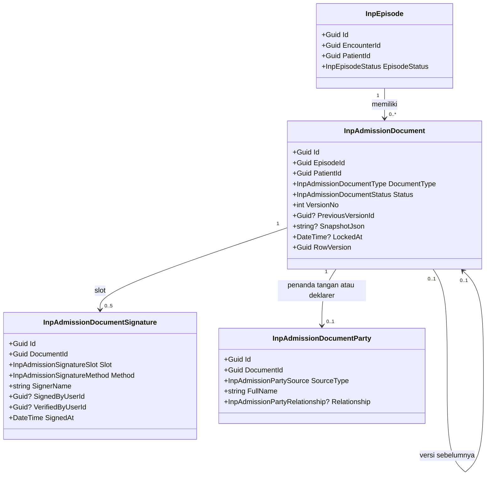
```mermaid
classDiagram
    class InpEpisode {
        +Guid Id
        +Guid EncounterId
        +Guid PatientId
        +InpEpisodeStatus EpisodeStatus
    }
    class InpAdmissionDocument {
        +Guid Id
        +Guid EpisodeId
        +Guid PatientId
        +InpAdmissionDocumentType DocumentType
        +InpAdmissionDocumentStatus Status
        +int VersionNo
        +Guid? PreviousVersionId
        +string? SnapshotJson
        +DateTime? LockedAt
        +Guid RowVersion
    }
    class InpAdmissionDocumentSignature {
        +Guid Id
        +Guid DocumentId
        +InpAdmissionSignatureSlot Slot
        +InpAdmissionSignatureMethod Method
        +string SignerName
        +Guid? SignedByUserId
        +Guid? VerifiedByUserId
        +DateTime SignedAt
    }
    class InpAdmissionDocumentParty {
        +Guid Id
        +Guid DocumentId
        +InpAdmissionPartySource SourceType
        +string FullName
        +InpAdmissionPartyRelationship? Relationship
    }
    InpEpisode "1" --> "0..*" InpAdmissionDocument : memiliki
    InpAdmissionDocument "0..1" --> "0..1" InpAdmissionDocument : versi sebelumnya
    InpAdmissionDocument "1" --> "0..5" InpAdmissionDocumentSignature : slot
    InpAdmissionDocument "1" --> "0..1" InpAdmissionDocumentParty : penanda tangan atau deklarer
```

#### 13.7.2 Isi khas per jenis dokumen

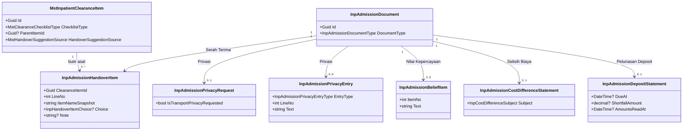
```mermaid
classDiagram
    class InpAdmissionDocument {
        +Guid Id
        +InpAdmissionDocumentType DocumentType
    }
    class MstInpatientClearanceItem {
        +Guid Id
        +MstClearanceChecklistType ChecklistType
        +Guid? ParentItemId
        +MstHandoverSuggestionSource HandoverSuggestionSource
    }
    class InpAdmissionHandoverItem {
        +Guid ClearanceItemId
        +int LineNo
        +string ItemNameSnapshot
        +InpHandoverItemChoice? Choice
        +string? Note
    }
    class InpAdmissionPrivacyRequest {
        +bool IsTransportPrivacyRequested
    }
    class InpAdmissionPrivacyEntry {
        +InpAdmissionPrivacyEntryType EntryType
        +int LineNo
        +string Text
    }
    class InpAdmissionBeliefItem {
        +int ItemNo
        +string Text
    }
    class InpAdmissionCostDifferenceStatement {
        +InpCostDifferenceSubject Subject
    }
    class InpAdmissionDepositStatement {
        +DateTime? DueAt
        +decimal? ShortfallAmount
        +DateTime? AmountsReadAt
    }
    InpAdmissionDocument "1" --> "0..*" InpAdmissionHandoverItem : Serah Terima
    MstInpatientClearanceItem "1" --> "0..*" InpAdmissionHandoverItem : butir asal
    InpAdmissionDocument "1" --> "0..1" InpAdmissionPrivacyRequest : Privasi
    InpAdmissionDocument "1" --> "0..6" InpAdmissionPrivacyEntry : Privasi
    InpAdmissionDocument "1" --> "0..5" InpAdmissionBeliefItem : Nilai Kepercayaan
    InpAdmissionDocument "1" --> "0..1" InpAdmissionCostDifferenceStatement : Selisih Biaya
    InpAdmissionDocument "1" --> "0..1" InpAdmissionDepositStatement : Pelunasan Deposit
```

#### 13.7.3 Estimasi Biaya dan log cetak

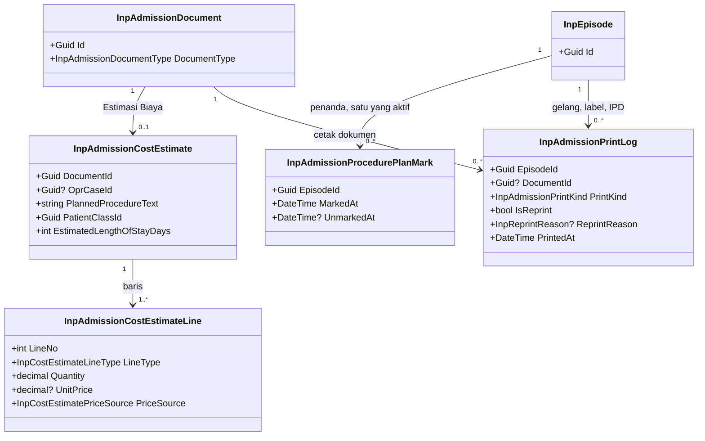
```mermaid
classDiagram
    class InpAdmissionCostEstimate {
        +Guid DocumentId
        +Guid? OprCaseId
        +string PlannedProcedureText
        +Guid PatientClassId
        +int EstimatedLengthOfStayDays
    }
    class InpAdmissionCostEstimateLine {
        +int LineNo
        +InpCostEstimateLineType LineType
        +decimal Quantity
        +decimal? UnitPrice
        +InpCostEstimatePriceSource PriceSource
    }
    class InpAdmissionProcedurePlanMark {
        +Guid EpisodeId
        +DateTime MarkedAt
        +DateTime? UnmarkedAt
    }
    class InpAdmissionPrintLog {
        +Guid EpisodeId
        +Guid? DocumentId
        +InpAdmissionPrintKind PrintKind
        +bool IsReprint
        +InpReprintReason? ReprintReason
        +DateTime PrintedAt
    }
    class InpAdmissionDocument {
        +Guid Id
        +InpAdmissionDocumentType DocumentType
    }
    class InpEpisode {
        +Guid Id
    }
    InpAdmissionDocument "1" --> "0..1" InpAdmissionCostEstimate : Estimasi Biaya
    InpAdmissionCostEstimate "1" --> "1..*" InpAdmissionCostEstimateLine : baris
    InpEpisode "1" --> "0..*" InpAdmissionProcedurePlanMark : penanda, satu yang aktif
    InpEpisode "1" --> "0..*" InpAdmissionPrintLog : gelang, label, IPD
    InpAdmissionDocument "1" --> "0..*" InpAdmissionPrintLog : cetak dokumen
```

#### 13.7.4 Service, controller, dan pembaca modul pemilik

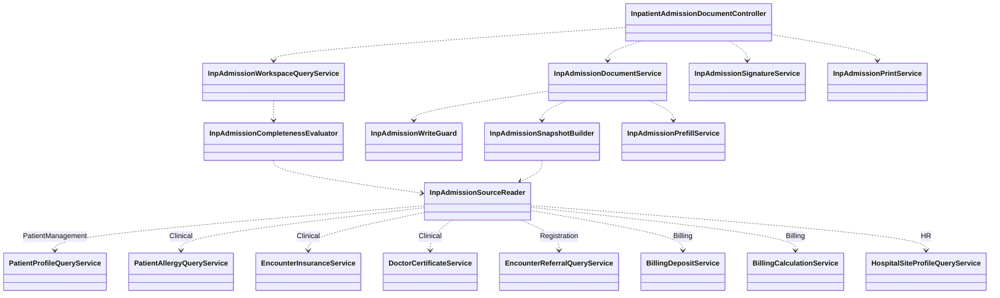
```mermaid
classDiagram
    class InpatientAdmissionDocumentController
    class InpAdmissionWorkspaceQueryService
    class InpAdmissionCompletenessEvaluator
    class InpAdmissionDocumentService
    class InpAdmissionSignatureService
    class InpAdmissionPrefillService
    class InpAdmissionSnapshotBuilder
    class InpAdmissionPrintService
    class InpAdmissionWriteGuard
    class InpAdmissionSourceReader
    class PatientProfileQueryService
    class PatientAllergyQueryService
    class EncounterInsuranceService
    class DoctorCertificateService
    class EncounterReferralQueryService
    class BillingDepositService
    class BillingCalculationService
    class HospitalSiteProfileQueryService
    InpatientAdmissionDocumentController ..> InpAdmissionWorkspaceQueryService
    InpatientAdmissionDocumentController ..> InpAdmissionDocumentService
    InpatientAdmissionDocumentController ..> InpAdmissionSignatureService
    InpatientAdmissionDocumentController ..> InpAdmissionPrintService
    InpAdmissionWorkspaceQueryService ..> InpAdmissionCompletenessEvaluator
    InpAdmissionDocumentService ..> InpAdmissionWriteGuard
    InpAdmissionDocumentService ..> InpAdmissionSnapshotBuilder
    InpAdmissionDocumentService ..> InpAdmissionPrefillService
    InpAdmissionSnapshotBuilder ..> InpAdmissionSourceReader
    InpAdmissionCompletenessEvaluator ..> InpAdmissionSourceReader
    InpAdmissionSourceReader ..> PatientProfileQueryService : PatientManagement
    InpAdmissionSourceReader ..> PatientAllergyQueryService : Clinical
    InpAdmissionSourceReader ..> EncounterInsuranceService : Clinical
    InpAdmissionSourceReader ..> DoctorCertificateService : Clinical
    InpAdmissionSourceReader ..> EncounterReferralQueryService : Registration
    InpAdmissionSourceReader ..> BillingDepositService : Billing
    InpAdmissionSourceReader ..> BillingCalculationService : Billing
    InpAdmissionSourceReader ..> HospitalSiteProfileQueryService : HR
```

### 13.8 Penjelasan setiap class

Kolom lengkap setiap tabel ada di [`data/data-dictionary.md`](./data/data-dictionary.md) bagian 20. Path model dan service relatif terhadap `Areas/HealthServices/` kecuali disebut lain; configuration di `Repositories/Configurations/HealthServices/<Modul>/<Nama>Configuration.cs`.

#### 13.8.1 Model

| Class | Status | Lokasi file | Tanggung jawab | Field penting | Catatan desain |
|---|---|---|---|---|---|
| `InpAdmissionDocument` | **Baru** | `InPatientManagement/Models/InpAdmissionDocument.cs` | Kepala satu versi dokumen admisi: jenis, status, nomor versi, rantai versi, salinan beku, kunci, selesai, batal | Kamus data 20.2 | Tidak punya isian identitas pasien selain `PatientId`; identitas cetak dibekukan di `SnapshotJson` saat dikunci. `PatientId` disimpan agar "dokumen Nilai Kepercayaan `Completed` terakhir pasien" dapat dicari lintas episode (`RWI-DEC-242`) |
| `InpAdmissionDocumentSignature` | **Baru** | `.../Models/InpAdmissionDocumentSignature.cs` | Satu slot tanda tangan: catatan kertas pasien/keluarga atau atestasi petugas | 20.3 | Tidak pernah diubah. Tanpa kolom gambar atau hash — itu milik `EPIC-RWA-13` (`OPEN DECISION`) |
| `InpAdmissionDocumentParty` | **Baru** | `.../Models/InpAdmissionDocumentParty.cs` | Penanda tangan atau deklarer yang dinyatakan dokumen (Privasi, Nilai Kepercayaan, Selisih Biaya, Pelunasan Deposit) beserta asal datanya | 20.4 | Bukan salinan master relasi; ia isi pernyataan. `SourceRecordId` hanya jejak asal, tanpa FK |
| `InpAdmissionHandoverItem` | **Baru** | `.../Models/InpAdmissionHandoverItem.cs` | Satu baris checklist Serah Terima Pasien Baru dengan nama dan kode butir beku | 20.5 | Butir dibentuk saat simpan pertama dari master jenis serah terima; perubahan master sesudahnya tidak mengubah dokumen (`RWI-DEC-241` butir 4) |
| `InpAdmissionPrivacyRequest` | **Baru** | `.../Models/InpAdmissionPrivacyRequest.cs` | Pilihan privasi selama transportasi | 20.6 | 1:1 dengan dokumen Permintaan Privasi |
| `InpAdmissionPrivacyEntry` | **Baru** | `.../Models/InpAdmissionPrivacyEntry.cs` | Satu kerabat yang boleh menjenguk atau satu permintaan khusus | 20.7 | Satu nama satu baris; tidak digabung koma (kelemahan V1 nomor 9) |
| `InpAdmissionBeliefItem` | **Baru** | `.../Models/InpAdmissionBeliefItem.cs` | Satu hal yang bertentangan dengan nilai dan kepercayaan pasien | 20.8 | 1–5 butir per dokumen |
| `InpAdmissionCostDifferenceStatement` | **Baru** | `.../Models/InpAdmissionCostDifferenceStatement.cs` | Subjek pernyataan Selisih Biaya sebagai kode | 20.9 | Kode, bukan teks tampilan V1 (`FR-RWA-103`) |
| `InpAdmissionDepositStatement` | **Baru** | `.../Models/InpAdmissionDepositStatement.cs` | Jatuh tempo dan angka deposit beku | 20.10 | Angka kosong selama `Draft`; terisi saat dikunci dari Billing |
| `InpAdmissionCostEstimate`, `InpAdmissionCostEstimateLine` | **Baru** — di luar gelombang (`EPIC-RWA-09`) | `.../Models/InpAdmissionCostEstimate.cs`, `InpAdmissionCostEstimateLine.cs` | Kepala rencana tindakan dan baris biaya Estimasi Biaya Rekap | 20.11, 20.12 | Baris visit dokter selalu `Unavailable` atau `Manual` sampai `DEC-INP-020` |
| `InpAdmissionPrintLog` | **Baru** | `.../Models/InpAdmissionPrintLog.cs` | Satu kejadian cetak: jenis, jumlah salinan, cetak ulang dan alasannya, pencetak, waktu | 20.13 | "Cetakan ke-*n*" dihitung dari urutan baris, tidak disimpan |
| `InpAdmissionProcedurePlanMark` | **Baru** — di luar gelombang | `.../Models/InpAdmissionProcedurePlanMark.cs` | Penanda manual "ada rencana tindakan/operasi" pada episode (`RWI-DEC-250` butir 3) | 20.14 | Dicabut dengan mengisi `UnmarkedAt`, sehingga riwayat penanda utuh. Sengaja tidak menjadi kolom `InpEpisode` |
| `MstInpatientClearanceItem` | **Diperbarui** | `MasterData/Models/MstInpatientClearanceItem.cs` | + jenis checklist, induk sub-butir, sumber saran serah terima | 20.15 | `TOUCHED LEGACY`: `SortOrder` lama tetap dipakai sebagai urutan; tidak ada `SortOrder` baru |
| `MstInpatientSetting` | **Diperbarui** | `MasterData/Models/MstInpatientSetting.cs` | + delapan kode formulir, kota penandatanganan, batas umur gelang bayi, kode singkat label | 20.16 | Nilai awal lewat seeder non-produksi atau isian admin produksi |

#### 13.8.2 Service Rawat Inap

| Class | Status | Lokasi file | Fungsi utama | Dipanggil oleh | Membuka transaksi | Catatan desain |
|---|---|---|---|---|---|---|
| `InpAdmissionWriteGuard` | **Baru** | `InPatientManagement/Services/InpAdmissionWriteGuard.cs` | Menolak penulisan pada episode selain `Admitted`/`DischargePending` dan episode yang belum dikonfirmasi | Document, signature, procedure-plan service | Tidak | Kode alasan `INP-ADM-DOC-001`, `002` |
| `InpAdmissionSourceReader` | **Baru** | `.../Services/InpAdmissionSourceReader.cs` | Satu pintu baca seluruh data modul lain (13.6); mengembalikan rekaman ramping beserta keadaan "tersedia / gagal / belum tersedia" | Query, prefill, snapshot, completeness | Tidak | Satu-satunya class Workspace PPRI yang boleh memanggil service modul lain. Service yang gerbangnya belum turun (`RWI-OQ-126` s.d. `129`) dibungkus agar keadaan "belum tersedia" menghasilkan cadangan aman, bukan kesalahan |
| `InpAdmissionCompletenessEvaluator` | **Baru** | `.../Services/InpAdmissionCompletenessEvaluator.cs` | Menghitung dokumen wajib, status per menu, dan angka *x* dari *y* (`RWI-DEC-234`, `250`, `256`) | Workspace query, `InpEpisodeService` | Tidak | Sumber gagal → butir "tidak dapat dihitung" dan tidak ikut pembilang maupun penyebut |
| `InpAdmissionWorkspaceQueryService` | **Baru** | `.../Services/InpAdmissionWorkspaceQueryService.cs` | Ringkasan ruang kerja, ringkasan rupiah, kop, data cetak GC, IPD, label, ringkasan hak pasien, log cetak | Controller | Tidak | `AsNoTracking`; tidak pernah memuat isian sensitif ke logger |
| `InpAdmissionPrefillService` | **Baru** | `.../Services/InpAdmissionPrefillService.cs` | Isian bawaan per jenis: butir serah terima beserta saran, calon penanda tangan, butir Nilai Kepercayaan episode lalu, data deklarer "diri sendiri", kepala Estimasi dari kasus OK | Controller, document service | Tidak | Saran serah terima dibaca dari `HandoverSuggestionSource` master, bukan nomor butir |
| `InpAdmissionSnapshotBuilder` | **Baru** | `.../Services/InpAdmissionSnapshotBuilder.cs` | Membentuk salinan beku saat kunci: identitas pasien, penjamin, kelas, kamar/bed, DPJP, kop, kode formulir, kota; angka deposit dan harga Estimasi | Document service | Tidak | `SnapshotFormatVersion = 1`; bentuk JSON di kamus data 20.2 |
| `InpAdmissionDocumentService` | **Baru** | `.../Services/InpAdmissionDocumentService.cs` | Simpan konsep, ubah, kunci, buka kunci, versi koreksi, buang konsep, batalkan; validator per jenis | Controller | **Ya** | Pemeriksaan per jenis di validation matrix 15.2 s.d. 15.4; urutan versi koreksi 13.5 |
| `InpAdmissionSignatureService` | **Baru** | `.../Services/InpAdmissionSignatureService.cs` | Catat tanda tangan kertas; atestasi lima slot; menyelesaikan dokumen saat slot wajib terakhir terisi | Controller | **Ya** | Slot wajib per jenis di 13.9; syarat bed slot Perawat lewat `InpPatientLocationQuery` |
| `InpAdmissionPrintService` | **Baru** | `.../Services/InpAdmissionPrintService.cs` | Data cetak dokumen dari salinan beku atau data hidup (`Draft`); penanda cetakan; catat log cetak; aturan cetak ulang | Controller | Ya (catat log) | Cetak berupiah memeriksa `Print` lewat `AccessPermissionService` sesudah attribute `ViewAmount` |
| `InpDepositDueDateCalculator` | **Baru** | `.../Services/InpDepositDueDateCalculator.cs` | Bawaan dan batas jatuh tempo: hari kerja Senin–Jumat berikutnya pukul 11.00 waktu rumah sakit, dipotong ke batas tanggal surat + interval kebijakan (`RWI-DEC-231`, `248`, `261`) | Prefill, document service | Tidak | Fungsi murni; zona waktu dari profil rumah sakit, bawaan `Asia/Jakarta` |
| `InpWristbandRules` | **Baru** | `.../Services/InpWristbandRules.cs` | Jenis gelang dan sapaan (`RWI-DEC-243`); teks umur | Workspace query | Tidak | Batas umur bayi dari pengaturan; ambang dewasa 17 tahun dari keputusan |
| `InpAdmissionProcedurePlanService` | **Baru** — di luar gelombang | `.../Services/InpAdmissionProcedurePlanService.cs` | Pasang dan cabut penanda rencana tindakan | Controller | Ya | Dikirim bersama `EPIC-RWA-09` |
| `InpPatientLocationQuery` | **Diperbarui** | `.../Services/InpPatientLocationQuery.cs` | + `HasActivePlacementAsync(episodeId)` | Signature service | Tidak | Aturan "menempati bed" sama dengan method yang sudah ada |
| `InpEpisodeService` | **Diperbarui** | `.../Services/InpEpisodeService.cs` | Detail episode menambah peringatan kelengkapan dan jatuh tempo tanpa rupiah | `InpatientEpisodeController` | Tidak | Hanya untuk `Admitted`/`DischargePending`; kegagalan sumber tidak menggagalkan detail |
| `InpDischargeService` (`.Closure`) | **Diperbarui** | `.../Services/InpDischargeService.Closure.cs` | Daftar dan penandaan butir penutupan hanya jenis `EpisodeClosure` | Penutupan episode | Tetap | `:88-101` dan `:162-177` disunting pada task yang sama dengan migration `E9` |
| `InpSettingService` | **Diperbarui** | `.../Services/InpSettingService.cs` | `InpatientSettingValues` + nilai baru | Rawat Inap | Tidak | — |

#### 13.8.3 Controller

| Class | Status | Lokasi file | Service yang dipakai | Atribut akses | Endpoint |
|---|---|---|---|---|---|
| `InpatientAdmissionDocumentController` | **Baru** | `InPatientManagement/Controllers/InpatientAdmissionDocumentController.cs` | Workspace query, prefill, document, signature, print, procedure-plan | `[AccessController(moduleCode: "HEALTH_SERVICE_INPATIENT", moduleName: "Health Service Inpatient", displayName: "Inpatient Admission Document", AreaName = "HealthServices", ControllerName = "InpatientAdmissionDocument", Description = "Dokumen penerimaan pasien rawat inap (Workspace PPRI)", SortOrder = <DEV_DISCRETION>)]`; aksi kustom `[AccessAction("<Aksi>", ..., AccessType = ...)]` (13.9) | `contracts/api-contract.md` 12.2 |
| `InpatientEpisodeController` | **Diperbarui** (perilaku) | `.../Controllers/InpatientEpisodeController.cs` | `InpEpisodeService` | Tetap | `GET episodes/{id}`: isi `Warnings` bertambah |
| `InpatientClearanceItemController` | **Diperbarui** | `MasterData/Controllers/InpatientClearanceItemController.cs` | `InpatientClearanceItemService` | Tetap `InpatientClearanceItem : Read/Create/Update/Delete` | Saringan dan isian jenis, induk, sumber saran (`api-contract.md` 12.4) |
| `InpatientSettingController` | **Diperbarui** | `MasterData/Controllers/InpatientSettingController.cs` | `InpatientSettingService` | Tetap `InpatientSetting : Read/Update` | Isian baru (12.4) |

`SortOrder` pada `[AccessController]` dan `[AccessAction]` adalah urutan tampilan permission dan **sah** menurut kontrak backend; nilainya `DEV_DISCRETION`.

#### 13.8.4 Service dan DTO di modul lain

| Class | Modul | Status | Lokasi file | Fungsi | Gerbang |
|---|---|---|---|---|---|
| `PatientProfileQueryService` | `PatientManagement` | **Baru** (folder `Services/` baru) | `PatientManagement/MasterData/Services/PatientProfileQueryService.cs` | `GetIdentityAsync(patientId)`; `GetPartyCandidatesAsync(patientId)` — relasi terstruktur dan kontak darurat dengan nama, hubungan, alamat, telepon, penanda penanggung jawab | `RWI-OQ-126` |
| `PatientQrPayloadBuilder` | `PatientManagement` | **Baru** (ekstraksi) | `PatientManagement/MasterData/Services/PatientQrPayloadBuilder.cs` | Isi QR = No. RM terformat, dipindah dari `PatientController.BuildPatientQrPayload` | `RWI-OQ-126` |
| `PatientController` | `PatientManagement` | **Diperbarui** (struktur) | `.../Controllers/PatientController.cs` | Memanggil `PatientQrPayloadBuilder`; perilaku endpoint tetap | `RWI-OQ-126` |
| `PatientAllergyQueryService` | `ClinicalManagement` | **Baru** | `ClinicalManagement/Services/PatientAllergyQueryService.cs` | `GetActiveAlertsAsync(patientId)` | Disetujui `RWI-DEC-264` |
| `PatientAllergyController` | `ClinicalManagement` | **Diperbarui** (struktur) | `.../Controllers/PatientAllergyController.cs` | `active-alerts` memanggil service; perilaku tetap | Sama |
| `EncounterInsuranceService`, `EncounterInsuranceContext` | `ClinicalManagement` | **Diperbarui** | `ClinicalManagement/Services/EncounterInsuranceService.cs` | Konteks + `CardNumber`, `MemberNumber` dari `CardNumberSnapshot`, `MemberNumberSnapshot` sumber pembayaran | Sama |
| `DoctorCertificateService` | `ClinicalManagement` | **Diperbarui** | `ClinicalManagement/Services/DoctorCertificateService.cs` | + `GetLatestIssuedInpatientReferralAsync(encounterId)` → nomor, dokter penerbit, tanggal terbit, `ReferralDiagnosis`, `ReferralReason` | Sama |
| `EncounterReferralQueryService` | `RegistrationManagement` | **Baru** | `RegistrationManagement/Services/EncounterReferralQueryService.cs` | `GetExternalReferralAsync(encounterId)` → nama dokter perujuk dan institusi | **`RWI-OQ-128`** |
| `BillingCalculationService` | `BillingManagement` | **Diperbarui** | `BillingManagement/Billing/Services/BillingCalculationService.cs` | + `GetDailyRoomRateAsync(serviceUnitId, patientClassId, momentUtc)` memakai `ResolveRoomTariff` yang ada | **`RWI-OQ-129`** |
| `HospitalSiteProfileQueryService` | HR Master Data | **Baru** (folder `Services/` baru) | `Corporate/HumanResource/MasterData/Organization/Services/HospitalSiteProfileQueryService.cs` | `GetMainSiteProfileAsync()` → nama, kode, alamat beserta wilayah, telepon, email, zona waktu situs `IsMainSite` aktif | `RWI-OQ-127` |
| `InpatientClearanceItemService` + DTO | `MasterData` | **Diperbarui** | `MasterData/Services/InpatientClearanceItemService.cs` | Validasi jenis, induk, sumber saran; saringan `checklistType` pada daftar dan opsi | `RWI-DEC-193` |
| `InpatientSettingService` + DTO | `MasterData` | **Diperbarui** | `MasterData/Services/InpatientSettingService.cs` | Validasi isian baru | `RWI-DEC-193` |
| `InpatientMasterDataSeeder` | `MasterData` | **Diperbarui** | `MasterData/Seeders/InpatientMasterDataSeeder.cs` | Butir serah terima dan nilai pengaturan V1 **untuk lingkungan non-produksi saja** | `RWI-DEC-048` |

DTO Rawat Inap baru: `InPatientManagement/DTOs/InpatientAdmissionWorkspaceDtos.cs` (ringkasan, rupiah, kop, IPD, label, hak pasien, log cetak) dan `InpatientAdmissionDocumentDtos.cs` (request dan response dokumen, tanda tangan, cetak). Daftar field di `contracts/api-contract.md` 12.3.

### 13.9 Enum baru dan berubah

| Enum | Lokasi | Nilai | Bawaan |
|---|---|---|---|
| `InpAdmissionDocumentType` | `InPatientManagement/Enums/` | `NewPatientHandover = 1`, `PrivacyRequest = 2`, `BeliefValues = 3`, `CostDifferenceStatement = 4`, `DepositSettlementStatement = 5`, `CostEstimate = 6` | — (wajib) |
| `InpAdmissionDocumentStatus` | Sama | `Draft = 1`, `AwaitingSignature = 2`, `Completed = 3`, `Superseded = 4`, `Cancelled = 5` | `Draft` |
| `InpAdmissionSignatureSlot` | Sama | `PatientOrFamily = 1`, `AdmissionOfficer = 2`, `CustomerRelationOfficer = 3`, `ReceivingNurse = 4`, `HeadNurse = 5` | — |
| `InpAdmissionSignatureMethod` | Sama | `PaperRecorded = 1`, `ElectronicAttestation = 2` | — |
| `InpAdmissionPartySource` | Sama | `Patient = 1`, `PatientRelationship = 2`, `EmergencyContact = 3`, `Manual = 4` | `Manual` |
| `InpAdmissionPartyRelationship` | Sama | `Self = 1`, `Spouse = 2`, `Child = 3`, `Parent = 4`, `Sibling = 5`, `Guardian = 6`, `Other = 7` | — |
| `InpAdmissionPartyIdentityType` | Sama | `Ktp = 1`, `Sim = 2`, `Passport = 3`, `IdCard = 4` (pilihan V1) | — |
| `InpHandoverItemChoice` | Sama | `Done = 1` (Sudah), `NotDone = 2` (Belum); kosong = belum dipilih | kosong |
| `InpAdmissionPrivacyEntryType` | Sama | `AllowedVisitor = 1`, `SpecialServiceRequest = 2` | — |
| `InpCostDifferenceSubject` | Sama | `Self = 1`, `Wife = 2`, `Husband = 3`, `Child = 4`, `OtherSibling = 5` | — |
| `InpAdmissionPrintKind` | Sama | `AdultWristband = 1`, `InfantWristband = 2`, `PatientLabel = 3`, `InpatientBaseData = 4`, `AdmissionDocument = 5` | — |
| `InpReprintReason` | Sama | `Damaged = 1`, `Lost = 2`, `DataChanged = 3`, `Other = 4` | — |
| `InpCostEstimateLineType` | Sama | `SurgicalProcedure = 1`, `InpatientProcedure = 2`, `SpecialDevice = 3`, `RoomPerDay = 4`, `DoctorVisitPerDay = 5`, `Other = 6` | — |
| `InpCostEstimatePriceSource` | Sama | `Tariff = 1`, `Manual = 2`, `Unavailable = 3` | — |
| `MstClearanceChecklistType` | `MasterData/Enums/` | `EpisodeClosure = 1`, `NewPatientHandover = 2` | `EpisodeClosure` |
| `MstHandoverSuggestionSource` | `MasterData/Enums/` | `None = 0`, `ReferralLetter = 1`, `CostEstimateCompleted = 2`, `DepositStatementCompleted = 3`, `BaseDataPrinted = 4`, `LabelAndGeneralConsent = 5`, `WristbandPrinted = 6` | `None` |

**Slot wajib per jenis dokumen** (slot lain ditolak `422`):

| Jenis | Slot wajib | Label cetak V1 |
|---|---|---|
| `NewPatientHandover` | `AdmissionOfficer`, `CustomerRelationOfficer`, `ReceivingNurse` | Admission, CRO, Perawat |
| `PrivacyRequest` | `PatientOrFamily`, `HeadNurse` | Pasien / Keluarga Pasien, Kepala Ruangan |
| `BeliefValues` | `PatientOrFamily` | Tanda Tangan |
| `CostDifferenceStatement` | `PatientOrFamily`, `AdmissionOfficer` | Yang Membuat Pernyataan, Mengetahui Petugas PPRI |
| `DepositSettlementStatement` | `PatientOrFamily`, `AdmissionOfficer` | Yang menyatakan, Yang menyetujui |
| `CostEstimate` | `PatientOrFamily`, `AdmissionOfficer` | Pasien / keluarga pasien, Petugas PPRI / Admission |

**Aksi permission resource `InpatientAdmissionDocument`:**

| Aksi | `AccessType` pengelompokan | Arti |
|---|---|---|
| `Read` | `Read` | Membuka Workspace PPRI dan membaca dokumen tanpa rupiah |
| `ViewAmount` | `Read` | Membaca rupiah dan mencetak dokumen berupiah (`RWI-DEC-258`) |
| `Create` | `Create` | Membuat konsep dokumen |
| `Update` | `Update` | Mengubah, mengunci, membuka kunci, membuat versi koreksi, membuang konsep sendiri |
| `Sign` | `Update` | Mencatat tanda tangan kertas pasien/keluarga; atestasi slot Admission / Petugas PPRI |
| `SignAsCro` | `Update` | Atestasi slot CRO |
| `SignAsNurse` | `Update` | Atestasi slot Perawat penerima |
| `SignAsHeadNurse` | `Update` | Atestasi slot Kepala Ruangan (`RWI-DEC-238`) |
| `Print` | `Read` | Mencetak dan mencatat cetak |
| `Cancel` | `Update` | Membatalkan dokumen beralasan |

### 13.10 Arsitektur folder — delta revision `0.10`

```text
Areas/HealthServices/
├── InPatientManagement/
│   ├── Models/InpAdmissionDocument.cs, InpAdmissionDocumentSignature.cs,
│   │          InpAdmissionDocumentParty.cs, InpAdmissionHandoverItem.cs,
│   │          InpAdmissionPrivacyRequest.cs, InpAdmissionPrivacyEntry.cs,
│   │          InpAdmissionBeliefItem.cs, InpAdmissionCostDifferenceStatement.cs,
│   │          InpAdmissionDepositStatement.cs, InpAdmissionPrintLog.cs        [Baru]
│   ├── Models/InpAdmissionCostEstimate.cs, InpAdmissionCostEstimateLine.cs,
│   │          InpAdmissionProcedurePlanMark.cs                               [Baru — di luar gelombang]
│   ├── Enums/InpAdmissionDocumentType.cs … InpCostEstimatePriceSource.cs     [Baru, 14 berkas]
│   ├── DTOs/InpatientAdmissionWorkspaceDtos.cs, InpatientAdmissionDocumentDtos.cs [Baru]
│   ├── Services/InpAdmissionWriteGuard.cs, InpAdmissionSourceReader.cs,
│   │            InpAdmissionCompletenessEvaluator.cs, InpAdmissionWorkspaceQueryService.cs,
│   │            InpAdmissionPrefillService.cs, InpAdmissionSnapshotBuilder.cs,
│   │            InpAdmissionDocumentService.cs, InpAdmissionSignatureService.cs,
│   │            InpAdmissionPrintService.cs, InpDepositDueDateCalculator.cs,
│   │            InpWristbandRules.cs                                         [Baru]
│   ├── Services/InpAdmissionProcedurePlanService.cs                          [Baru — di luar gelombang]
│   ├── Services/InpPatientLocationQuery.cs, InpEpisodeService.cs,
│   │            InpDischargeService.Closure.cs, InpSettingService.cs        [Diperbarui]
│   └── Controllers/InpatientAdmissionDocumentController.cs                   [Baru]
│       Controllers/InpatientEpisodeController.cs                             [Diperbarui: perilaku Warnings]
├── MasterData/
│   ├── Models/MstInpatientClearanceItem.cs, MstInpatientSetting.cs           [Diperbarui]
│   ├── Enums/MstClearanceChecklistType.cs, MstHandoverSuggestionSource.cs    [Baru]
│   ├── Services/InpatientClearanceItemService.cs, InpatientSettingService.cs [Diperbarui]
│   ├── Controllers/InpatientClearanceItemController.cs, InpatientSettingController.cs [Diperbarui]
│   └── Seeders/InpatientMasterDataSeeder.cs                                  [Diperbarui: non-produksi]
├── PatientManagement/MasterData/
│   ├── Services/PatientProfileQueryService.cs, PatientQrPayloadBuilder.cs    [Baru — RWI-OQ-126]
│   └── Controllers/PatientController.cs                                      [Diperbarui: struktur]
├── ClinicalManagement/
│   ├── Services/PatientAllergyQueryService.cs                                [Baru]
│   ├── Services/EncounterInsuranceService.cs, DoctorCertificateService.cs    [Diperbarui]
│   └── Controllers/PatientAllergyController.cs                               [Diperbarui: struktur]
├── RegistrationManagement/
│   └── Services/EncounterReferralQueryService.cs                             [Baru — RWI-OQ-128]
└── BillingManagement/Billing/
    └── Services/BillingCalculationService.cs                                 [Diperbarui — RWI-OQ-129]
Areas/Corporate/HumanResource/MasterData/Organization/
    └── Services/HospitalSiteProfileQueryService.cs                           [Baru — RWI-OQ-127]
Repositories/Configurations/HealthServices/InPatientManagement/
    └── <13 configuration tabel baru>Configuration.cs                        [Baru]
Repositories/Configurations/HealthServices/MasterData/
    └── MstInpatientClearanceItemConfiguration.cs, MstInpatientSettingConfiguration.cs [Diperbarui]
Repositories/ApplicationDbContext.cs                                          [Diperbarui: 13 DbSet]
Program.cs (registrasi service)                                               [Diperbarui: AddScoped]
```

**Utang teknis yang disentuh, tidak dirapikan diam-diam:** `MstInpatientClearanceItem.SortOrder` (pola legacy; kontrak backend melarang `SortOrder` presentasi untuk kode baru) tetap dipakai sebagai urutan butir. `HospitalSiteController` dan `PatientAllergyController` yang memakai context langsung **tidak** dirapikan; service baru hanya ditambahkan, dan `PatientAllergyController.active-alerts` memanggilnya agar aturan "alergi aktif" tidak punya dua salinan.

### 13.11 Status model dan dampak migration

| Tabel | Status | Kolom yang berubah | Dampak data lama |
|---|---|---|---|
| `MstInpatientClearanceItem` | Diperbarui | + `ChecklistType` (`integer`, wajib, bawaan `1`), + `ParentItemId` (`uuid`, opsional, FK diri sendiri `Restrict`), + `HandoverSuggestionSource` (`integer`, wajib, bawaan `0`) | Seluruh butir lama menjadi `EpisodeClosure` tanpa induk dan tanpa saran — perilaku penutupan tidak berubah |
| `MstInpatientSetting` | Diperbarui | + `GeneralConsentFormCode`, `NewPatientHandoverFormCode`, `PrivacyRequestFormCode`, `BeliefValuesFormCode`, `CostDifferenceFormCode`, `DepositSettlementFormCode`, `CostEstimateFormCode`, `InpatientBaseDataFormCode` (masing-masing `varchar(50)`, opsional); + `DocumentSigningCity` (`varchar(100)`, opsional); + `InfantWristbandMaxAgeYears` (`integer`, wajib, bawaan `5`); + `PatientLabelHospitalCode` (`varchar(30)`, opsional) | Baris lama: kode dan kota kosong sampai diisi admin; batas umur 5 |
| `InpAdmissionDocument` dan sembilan tabel anak/log gelombang MVP | Baru | Seluruh kolom | — |
| `InpAdmissionCostEstimate`, `InpAdmissionCostEstimateLine`, `InpAdmissionProcedurePlanMark` | Baru — di luar gelombang | Seluruh kolom | Dibuat bersama `EPIC-RWA-09` |
| `InpEpisode`, `InpBedPlacement`, `RegPatientEncounterGuarantor`, `MstPatient`, `MstHospitalSite`, dan tabel modul lain | Sudah ada | **Tidak berubah** | — |

### 13.12 Rencana migration di dalam sub-modul ini

Langkah melanjutkan penomoran Finishing (`E4` s.d. `E8`). Urutan lintas sub-modul di [`../02-module-map.md`](../02-module-map.md) bagian 8.4.

| Langkah | Isi | Tanpa downtime | Data lama | Mundur |
|---|---|---|---|---|
| `E9` | `MasterData`: tiga kolom `MstInpatientClearanceItem`, sebelas kolom `MstInpatientSetting`. **Dirilis bersama kode saringan jenis pada penutupan episode (`InpDischargeService.Closure.cs:88`, `:162`) dalam task yang sama** | Ya — kolom aditif berbawaan konstan | Bawaan aman; tidak ada pengisian ulang | `Down()`. **Sebelum** mundur kode atau `Down()`: nonaktifkan (`IsActive = false`) seluruh butir jenis serah terima, karena kode lama membaca semua butir aktif dan butir wajib serah terima akan menahan penutupan episode |
| `E10` | `InPatientManagement`: `InpAdmissionDocument`, `InpAdmissionDocumentSignature`, `InpAdmissionDocumentParty`, `InpAdmissionHandoverItem` (FK ke `MstInpatientClearanceItem`, maka sesudah `E9`), `InpAdmissionPrivacyRequest`, `InpAdmissionPrivacyEntry`, `InpAdmissionBeliefItem`, `InpAdmissionCostDifferenceStatement`, `InpAdmissionDepositStatement`, `InpAdmissionPrintLog` | Ya — tabel baru | — | `Down()` selama belum ada dokumen produksi; sesudahnya mundur hanya kode, tabel dibiarkan |
| `E11` | Di luar gelombang: `InpAdmissionCostEstimate`, `InpAdmissionCostEstimateLine`, `InpAdmissionProcedurePlanMark` | Ya | — | `Down()` |
| `E12` | Data dan hak: butir serah terima dan nilai pengaturan (13.13); pemberian aksi `InpatientAdmissionDocument` per peran; butir hak akses lahir otomatis dari atribut endpoint lewat `AccessMenuSeeder` | Ya | Butir serah terima **produksi diisi admin sesudah `E9` dan kodenya dirilis**, tidak sebelumnya | Nonaktifkan butir; cabut pemberian hak |

Satu `DbSet` per tabel, jamak (`InpAdmissionDocuments`, …). Seluruh enum disimpan `integer` (`HasConversion<int>()`), mengikuti konfigurasi Rawat Inap yang ada.

### 13.13 Rencana data master dan konfigurasi awal

Seeder `InpatientMasterDataSeeder` **menolak produksi** (`RWI-DEC-048`). Karena itu setiap baris di bawah punya dua jalan: seeder untuk lingkungan pengembangan dan UAT, dan **isian admin** untuk produksi lewat layar yang sudah ada. Nilai V1 hanya ditulis di seeder dan di dokumen ini; service, controller, DTO, dan komponen cetak Workspace PPRI **tidak** memuatnya (`RWI-AC-368`).

**Butir Serah Terima Pasien Baru** (`MstInpatientClearanceItem`, `ChecklistType = NewPatientHandover`, `IsMandatory = true`, `IsActive = true`; urutan lewat `SortOrder` lama; nama mengikuti PRD Lampiran A.2):

| Kode | Nama butir | Induk | `HandoverSuggestionSource` | `SortOrder` |
|---|---|---|---|---:|
| `STPB-01` | SURAT PENGANTAR RAWAT | — | `ReferralLetter` (`RWI-DEC-262`) | 10 |
| `STPB-02` | MENGHUBUNGI DOKTER (KHUSUS TINDAKAN) | — | `None` | 20 |
| `STPB-02A` | HASIL PEMERIKSAAN PENUNJANG — Laboratorium | `STPB-02` | `None` | 21 |
| `STPB-02B` | HASIL PEMERIKSAAN PENUNJANG — Radiologi | `STPB-02` | `None` | 22 |
| `STPB-02C` | HASIL PEMERIKSAAN PENUNJANG — Lain-lain | `STPB-02` | `None` | 23 |
| `STPB-03` | PENJELASAN DILARANG MEMBAWA OBAT DARI LUAR | — | `None` | 30 |
| `STPB-04` | PENJELASAN PRAKIRAAN BIAYA TINDAKAN & DEPOSIT | — | `CostEstimateCompleted` (aktif saat `EPIC-RWA-09` dikirim) | 40 |
| `STPB-05` | PENJELASAN HARGA KAMAR | — | `None` | 50 |
| `STPB-06` | PENJELASAN TATA TERTIB | — | `None` | 60 |
| `STPB-07` | PERNYATAAN PELUNASAN DEPOSIT | — | `DepositStatementCompleted` | 70 |
| `STPB-08` | DOKUMEN MEDIK RI / RJ | — | `None` | 80 |
| `STPB-09` | FORMULIR IPD | — | `BaseDataPrinted` | 90 |
| `STPB-10` | FORMULIR ASURANSI / JAMINAN | — | `None` | 100 |
| `STPB-11` | INFORMASI VIP (KHUSUS VIP) | — | `None` | 110 |
| `STPB-12` | CETAK LABEL / STIKER / GENERAL CONSENT | — | `LabelAndGeneralConsent` — **tidak memberi saran** selama General Consent *fail-closed* (`RWI-DEC-241` butir 2) | 120 |
| `STPB-13` | PASANG GELANG | — | `WristbandPrinted` | 130 |
| `STPB-14` | INPUT PARKIR | — | `None` | 140 |
| `STPB-15` | LAIN-LAIN | — | `None` | 150 |

V1 menulis butir 12 "GENERAL CONCERN"; nama di atas dibetulkan menjadi "GENERAL CONSENT" mengikuti PRD Lampiran A.2. Admin boleh mengubahnya.

**Pengaturan Rawat Inap** (`MstInpatientSetting` baris `DEFAULT`):

| Isian | Nilai awal | Sumber |
|---|---|---|
| `GeneralConsentFormCode` | `GC/ADM/001/Rev01/2024` | PRD Lampiran A.12 |
| `NewPatientHandoverFormCode` | `HP/ADM/001/Rev01/2024` | Sama |
| `DepositSettlementFormCode` | `005/NM/E/Rev01/XI/2016` | Sama |
| `CostDifferenceFormCode` | `006/NM/E/Rev03/VI/2022` | Sama |
| `PrivacyRequestFormCode` | `008/NM/E/Rev02/VI/2022` | Sama |
| `BeliefValuesFormCode` | `009/NM/E/Rev01/VI/2022` | Sama |
| `CostEstimateFormCode`, `InpatientBaseDataFormCode` | Kosong — V1 tidak punya kode | Sama |
| `DocumentSigningCity` | Kota bawaan V1 yang tertulis di PRD Lampiran A.12 | Sama; diganti admin bila rumah sakit menghendaki |
| `InfantWristbandMaxAgeYears` | `5` | `RWI-DEC-243` |
| `PatientLabelHospitalCode` | Kosong → cetakan memakai `MstHospitalSite.SiteCode` | G-36 |

**Prasyarat data modul lain:** satu `MstHospitalSite` aktif bertanda `IsMainSite` dengan nama, alamat, telepon, dan email terisi (HR); kebijakan deposit Billing per penjamin dan kelas (sudah ada); peran CRO, supervisor admisi, dan pemegang `SignAsHeadNurse` (`RWI-OQ-124`).

**Pemberian aksi bawaan usulan** (diatur rumah sakit lewat Akses Role; aturannya hak menentukan tindakan, bukan nama peran):

| Peran | Aksi `InpatientAdmissionDocument` |
|---|---|
| Petugas admisi / PPRI | `Read`, `ViewAmount`, `Create`, `Update`, `Sign`, `Print` |
| CRO | `Read`, `SignAsCro`, `Print` |
| Perawat ruangan | `Read`, `SignAsNurse`, `Print` |
| Kepala ruangan (dan wakil yang ditunjuk) | `Read`, `SignAsNurse`, `SignAsHeadNurse`, `Print` |
| Kasir | `Read`, `ViewAmount`, `Print` |
| Supervisor admisi | `Read`, `ViewAmount`, `Create`, `Update`, `Sign`, `Print`, `Cancel` |

### 13.14 Yang sengaja tidak dibuat pada revision `0.10`

| Yang ditolak | Alasan |
|---|---|
| Jenis dokumen atau tabel pendamping General Consent | *Fail-closed* (`RWI-DEC-230`, `233`); penyimpanannya dirancang bersama `DEC-INP-003`, memakai `TrxPatientConsent` tanpa tabel persetujuan kedua (`RWI-DEC-236`) |
| Kolom gambar, hash, perangkat, dan IP tanda tangan digital | `EPIC-RWA-13` `OPEN DECISION` (`RWI-DEC-235` `draft`) |
| Baris `MrcClinicalDocumentIntegrity` atau jenis dokumen baru di Rekam Medis | `RWI-DEC-229` |
| Salinan tabel pasien, relasi, kontak darurat, penjamin, deposit | `RWI-DEC-228`, `257`; hanya salinan beku saat dikunci |
| Kolom atau isian manual untuk data IPD tanpa sumber | `RWI-DEC-244`: dicetak garis kosong |
| Tabel dokumen IPD, gelang, label | Hanya log cetak (`RWI-DEC-240`) |
| Penghitung "cetakan ke-*n*" yang disimpan | Dihitung dari urutan log; penghitung tersimpan rawan ganda |
| Tabel riwayat kejadian dokumen | Jejak dipegang rantai versi, baris tanda tangan, log cetak, kolom kunci/selesai/batal, dan logger aplikasi untuk setiap tulis |
| Nomor surat bisnis per dokumen admisi | Formulir V1 tidak bernomor; IPD memakai nomor episode. Menghindari alokator nomor baru (`QBE-CODE-001` s.d. `006`) |
| Master kecil kode formulir | Butir menu baru tidak mungkin (`IA-INP-05` penuh); kolom pada `MstInpatientSetting` (`RWI-DEC-247`) |
| Master baru butir serah terima | Diperluas dari master yang ada (`RWI-DEC-241`) |
| Kolom penanda rencana tindakan pada `InpEpisode` | `InpEpisode` adalah aggregate episode; penanda milik Workspace PPRI disimpan terpisah beserta riwayatnya |
| Aturan tarif kamar kedua di Rawat Inap | Angka dapat berbeda dari tagihan; menunggu `RWI-OQ-129` |
| Pemakaian langsung `EncounterPrimaryPayerSummary` | Membutuhkan entity kunjungan Registration dimuat oleh Rawat Inap (`RWI-DEC-257` butir 3); konteks asuransi Clinical membaca baris sumber pembayaran yang sama |
| Hub SignalR khusus dokumen admisi | Penyegaran berkala 30 detik cukup (`FR-RWA-035`, G-34) |
| Kalender libur (`MstHoliday`) | `RWI-DEC-261` |
| Pengaturan jam jatuh tempo | Pukul 11.00 adalah teks formulir V1 yang disepakati (`RWI-DEC-231`); mengubahnya berarti merevisi formulir |
| MP Benefit, Estimasi Rinci | Tetap ditunda (`RWI-OQ-119`, `RWI-OQ-120`) |
| Tarif visit dokter dan catatan cito, lebih dari 4 jam, *standby*, anestesi | `DEC-INP-020` (`RWI-OQ-122`) |
| Entity `Trx*` | `QBE-NAM-001` |

### 13.15 Traceability bagian 13

| Bagian | Requirement | Keputusan | Acceptance |
|---|---|---|---|
| Ruang kerja, header, kelengkapan | `FR-RWA-001` s.d. `008` | `RWI-DEC-234`, `245`, `250`, `256`, `257` | `RWI-AC-343` s.d. `346`, `371`, `377`, `378` |
| Fondasi dokumen | `FR-RWA-120` s.d. `128` | `RWI-DEC-228` s.d. `230`, `237` s.d. `240`, `247`, `263`, `264` | `RWI-AC-351` s.d. `358`, `368`, `369`, `384`, `385` |
| Serah Terima | `FR-RWA-030` s.d. `035` | `RWI-DEC-239`, `241`, `255`, `262` | `RWI-AC-353`, `354`, `359` s.d. `361`, `376`, `383` |
| Gelang dan label | `FR-RWA-050` s.d. `053` | `RWI-DEC-243`, `253`, `259` | `RWI-AC-363`, `364`, `374`, `380` |
| IPD | `FR-RWA-070` s.d. `072` | `RWI-DEC-244`, `254`, `258` | `RWI-AC-365`, `375`, `386`, `387` |
| Privasi, Nilai Kepercayaan | `FR-RWA-060` s.d. `062`, `110` s.d. `113` | `RWI-DEC-238`, `242` | `RWI-AC-351`, `352`, `357`, `362` |
| Selisih Biaya | `FR-RWA-100` s.d. `103` | `RWI-DEC-234`, `256` | `RWI-AC-377` |
| Pelunasan Deposit | `FR-RWA-080` s.d. `085` | `RWI-DEC-231`, `248`, `252`, `258`, `260`, `261`, `263` | `RWI-AC-366`, `367`, `379`, `381`, `382`, `385` |
| Estimasi Biaya (di luar gelombang) | `FR-RWA-090` s.d. `093` | `RWI-DEC-232`, `250`, `258`; `DEC-INP-020` terbuka | `RWI-AC-370`, `371`, `379` |
| General Consent cetak saja | `FR-RWA-020` s.d. `022` (bagian cetak) | `RWI-DEC-230`, `233`, `246`, `251`, `252` | `RWI-AC-347` s.d. `349`, `372`, `373` |

---

### 13.16 Approval dan penyelarasan decision log revision `39` ★ 8 Oktober 2026

Kontrak `0.11.0` disetujui Muhammad Hamzah lewat `RWI-DEC-265`. `RWI-OQ-126` dan `RWI-OQ-127` ditutup `RWI-DEC-266`: gerbang pada 13.0, 13.6, dan 13.8.4 untuk `PatientProfileQueryService`, `PatientQrPayloadBuilder`, dan `HospitalSiteProfileQueryService` kini **disetujui**. `RWI-OQ-128` dan `RWI-OQ-129` tetap terbuka dengan cadangan aman. Isi desain tidak berubah. Roadmap: `roadmap/backend-roadmap-workspace-ppri.md`.
