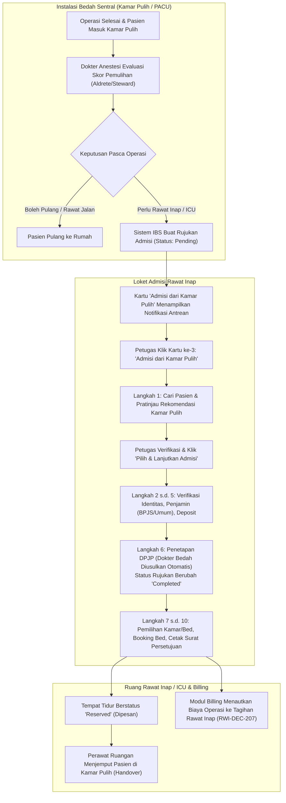

# Blueprint Skema Tampilan & Rancangan UX: Admisi Rawat Inap dari Kamar Pulih (Recovery Room)

| Metadata | Nilai |
| :--- | :--- |
| **Dokumen ID** | `RWI-UI-SPEC-029` |
| **Modul** | `HealthServices / InPatientManagement` (Rawat Inap) |
| **Sub-Modul** | `episode-rawat-inap` |
| **Layar Blueprint Terkait** | `FE-INP-03` (Layar Muka Admisi), `FE-INP-29` (Rujukan Admisi Kamar Pulih) |
| **Referensi Task & Backend** | `FE-RWI-198`, `BE-RWI-181`, `RWI-DEC-201`, `RWI-DEC-207`, `RWI-DEC-208`, `INV-RWF-32` |
| **Status Dokumen** | `PROPOSED DRAFT` (Menunggu Persetujuan Pemilik Proses Bisnis) |
| **Bahasa** | Bahasa Indonesia Baku |

---

## 1. Ringkasan Eksekutif & Latar Belakang Bisnis

### 1.1 Masalah pada Desain Awal
Pada implementasi awal (`FE-RWI-198`), daftar pasien rujukan dari kamar pulih (*Recovery Room / PACU - Post-Anesthesia Care Unit*) diletakkan sebagai **banner tabel kaku di atas pilihan tipe pendaftaran**. Penempatan ini memiliki beberapa kelemahan pengalaman pengguna (*User Experience*):
1. **Memecah Fokus Petugas**: Layar muka menjadi padat dan membingungkan karena memuat tabel data sebelum petugas memilih apa yang ingin ia kerjakan.
2. **Inkonsistensi Alur Masuk**: Jalur Pasien Baru dan Pasien Lama berbentuk kartu (*Cards Grid*), sedangkan jalur kamar pulih berbentuk tabel lepas.
3. **Keterbatasan Ruang Tinjau**: Petugas admisi tidak dapat melakukan pencarian detail atau melihat riwayat operasi lengkap sebelum masuk ke alur stepper.

### 1.2 Solusi Desain Baru (3-Card Admission Grid)
Desain baru menyatukan pintu masuk admisi rawat inap menjadi **3 Kartu Pilihan Utama yang Sejajar dan Harmonis**:
1. **Kartu 1 — Pendaftaran Pasien Baru**: Pasien yang belum pernah terdaftar di rumah sakit (belum memiliki No. Rekam Medis).
2. **Kartu 2 — Pendaftaran Pasien Lama**: Pasien umum/rujukan luar yang sudah memiliki No. Rekam Medis (pencarian NIK/No. RM bebas).
3. **Kartu 3 — Admisi dari Kamar Pulih (Recovery Room)**: Pasien pasca operasi dari Instalasi Bedah Sentral (IBS) yang telah diputuskan memerlukan rawat inap atau ICU oleh dokter spesialis anestesi.

Dengan memilih Kartu 3, petugas admisi diarahkan ke **Alur Stepper Khusus Kamar Pulih** yang dilengkapi:
* Mesin pencarian dan filter cepat antrean rujukan kamar pulih.
* Panel pratinjau (*preview*) detail riwayat operasi, dokter operator, dokter anestesi, dan instruksi klinis.
* Pengisian data otomatis (*auto pre-fill*) ke dalam 10 langkah stepper admisi hingga penerbitan tempat tidur dan integrasi tagihan kasir.

---

## 2. Alur Proses Bisnis Ujung-ke-Ujung (End-to-End Workflow)



---

## 3. Skema Tampilan Layar Muka: 3-Card Admission Grid

Layar muka pendaftaran admisi rawat inap (`/health-services/inpatient-management/admissions`) kini menampilkan 3 kartu pilihan tipe pendaftaran:

```text
┌────────────────────────────────────────────────────────────────────────────────────────────────────────┐
│                                           ADMISI RAWAT INAP                                            │
│                                        Pilih Tipe Pendaftaran                                          │
│           Tentukan apakah pasien didaftarkan baru, dicari dari rekam medis lama, atau                  │
│                        berasal dari rujukan pasca operasi Kamar Pulih (IBS).                           │
│                                                                                                        │
│  ┌───────────────────────────┐  ┌───────────────────────────┐  ┌────────────────────────────────────┐  │
│  │    PASIEN BELUM TERDAFTAR │  │    PASIEN SUDAH TERDAFTAR │  │     PASIEN PASCA OPERASI  [ 2 ]    │  │
│  │                           │  │                           │  │                                    │  │
│  │ Pendaftaran Pasien Baru   │  │ Pendaftaran Pasien Lama   │  │ Admisi dari Kamar Pulih            │  │
│  │ Gunakan untuk pasien baru │  │ Gunakan untuk pasien yang │  │ Pasien pasca tindakan operasi IBS  │  │
│  │ yang belum memiliki nomor │  │ sudah terdaftar dan       │  │ yang dinyatakan butuh rawat inap/  │  │
│  │ rekam medis.              │  │ memiliki nomor RM.        │  │ ICU oleh dokter anestesi.          │  │
│  │                           │  │                           │  │                                    │  │
│  │ ✓ Scan KTP bila tersedia  │  │ ✓ Cari No. RM atau NIK    │  │ ✓ Rujukan dokter anestesi terkunci │  │
│  │ ✓ Sepuluh langkah runtut  │  │ ✓ Tinjau identitas pasien │  │ ✓ Riwayat operasi & DPJP terisi    │  │
│  │ ✓ Cetak kartu di akhir    │  │ ✓ Lanjut ke penjamin      │  │ ✓ Tagihan operasi otomatis tertaut │  │
│  │                           │  │                           │  │                                    │  │
│  │                     [ → ] │  │                     [ → ] │  │   🔴 1 Pasien Melewati Batas  [ → ]│  │
│  └───────────────────────────┘  └───────────────────────────┘  └────────────────────────────────────┘  │
└────────────────────────────────────────────────────────────────────────────────────────────────────────┘
```

### 3.1 Spesifikasi Visual Kartu ke-3 (Admisi dari Kamar Pulih)
* **Warna Aksen**: Indigo / Ungu Medis (`border-indigo-200`, `bg-indigo-50/30`, hover `border-indigo-500`).
* **Badge Header**:
  * Label: `PASIEN PASCA OPERASI`.
  * Badge Jumlah Realtime: `[ n ]` (contoh `[ 2 ]`), bernuansa indigo bold. Jika tidak ada pasien yang menunggu, badge menampilkan angka `[ 0 ]` berwarna abu-abu tenang.
* **Indikator Kedaruratan Waktu (*Overdue Alert*)**:
  * Bila terdapat pasien yang telah menunggu lebih lama dari ambang batas rumah sakit (misal > 60 menit), muncul penanda kedip merah: `🔴 1 Pasien Melewati Batas`.
* **Aksi Klik**: Mengarahkan sistem ke mode `INPATIENT_ADMISSION_ENTRY_MODE.RECOVERY` dan membuka tahapan stepper khusus kamar pulih.

---

## 4. Rancangan Stepper UX Khusus Kamar Pulih

Alur pendaftaran pasien dari kamar pulih memiliki **10 langkah berurutan**. Stepper ini mengunci integritas klinis dan memastikan riwayat operasi tidak hilang.

```text
[ ① Rujukan Kamar Pulih ] ── [ ② Informasi Pasien ] ── [ ③ Tipe Pasien ] ── [ ④ Pembayaran ] ── [ ⑤ Deposit ]
             │
             └── [ ⑥ Dokter DPJP ] ── [ ⑦ Pilih Bed ] ── [ ⑧ Booking Bed ] ── [ ⑨ Konfirmasi ] ── [ ⑩ Cetak Berkas ]
```

### 4.1 Matriks 10 Langkah Stepper Jalur Kamar Pulih

| No | Slug Langkah | Judul Langkah | Perilaku Khusus Pasien Kamar Pulih |
| :---: | :--- | :--- | :--- |
| **1** | `recovery-referral` | **Rujukan Kamar Pulih** | **Layar Utama Pencarian & Seleksi Rujukan**: Menampilkan antrean pasien kamar pulih, fitur pencarian multi-parameter, dan pratinjau resume operasi. |
| **2** | `existing-patient-information` | **Informasi Pasien** | **Otomatis Terisi (*Pre-filled*)**: Menampilkan identitas pasien, NIK, alamat, dan kontak keluarga. Petugas cukup memvalidasi. |
| **3** | `patient-type` | **Tipe Pasien** | Memilih kategori pasien (Umum/Dewasa, Anak, Kebidanan, Karyawan). |
| **4** | `payment` | **Pembayaran** | Memilih penjamin biaya (BPJS Kesehatan, Asuransi Swasta, Umum/Tunai). Hak kelas penjamin tervalidasi. |
| **5** | `deposit` | **Deposit** | Penetapan uang muka: Wajib bagi pasien Tunai/Umum; otomatis bernilai Rp 0 dan dilewati bagi BPJS/Asuransi. |
| **6** | `doctor` | **Dokter DPJP** | **Titik Tulis Kritis 1**: <br>• DPJP otomatis diusulkan sesuai dokter operator bedah.<br>• Unit kamar disesuaikan dengan rekomendasi kamar pulih (Bangsal / ICU).<br>• Menyimpan kunjungan rawat inap & episode; status rujukan kamar pulih tuntas (`Completed`). |
| **7** | `bed-selection` | **Pilih Bed** | Menampilkan denah tempat tidur yang tersedia. Jika rujukan meminta *ICU*, sistem secara otomatis memfilter ruang ICU/ICCU. |
| **8** | `bed-booking` | **Booking Bed** | Mengunci tempat tidur terpilih selama 15 menit agar tidak diambil petugas admisi lain. |
| **9** | `confirmation` | **Konfirmasi** | Tinjauan akhir data admisi: Pasien, Ruang Perawatan, DPJP, Penjamin, dan Nomor Kasus Operasi yang terhubung. |
| **10** | `consent-print` | **Cetak Berkas** | Cetak Lembar Persetujuan Rawat Inap (*General Consent*), gelang pasien, dan bukti serah terima transfer ruangan. |

---

## 5. Skema Tampilan Langkah 1: Pencarian & Detail Rujukan Kamar Pulih (`recovery-referral`)

Ketika petugas mengklik Kartu ke-3, layar pertama yang tampil adalah antarmuka pencarian dan seleksi data kamar pulih yang komprehensif:

```text
┌─────────────────────────────────────────────────────────────────────────────────────────────────────────────────────────────────┐
│ Health Services / Rawat Inap / Admisi                                                                                           │
│ Admisi dari Kamar Pulih (Recovery Room)                                                                                         │
│ Pilih pasien pasca operasi yang telah dinyatakan siap dipindahkan ke ruang rawat inap atau ICU.                                  │
├─────────────────────────────────────────────────────────────────────────────────────────────────────────────────────────────────┤
│ ① Rujukan Kamar Pulih ── ② Info Pasien ── ③ Tipe Pasien ── ④ Pembayaran ── ⑤ Deposit ── ⑥ Dokter ── ⑦ Bed ── ⑧ Konfirmasi     │
├─────────────────────────────────────────────────────────────────────────────────────────────────────────────────────────────────┤
│                                                                                                                                 │
│  ┌─ BILAH PENCARIAN & FILTER ────────────────────────────────────────────────────────────────────────────────────────────────┐  │
│  │ 🔍 [ Cari No. RM, NIK, Nama Pasien, atau No. Kasus OK...                                   ] [ Cari ]  [ ⟳ Segarkan ]     │  │
│  │                                                                                                                           │  │
│  │ Saring:  [•] Semua Antrean (2)     [ ] Perlu ICU (1)     [ ] Rawat Inap Biasa (1)     [ ] Melewati Batas Waktu (1)        │  │
│  └───────────────────────────────────────────────────────────────────────────────────────────────────────────────────────────┘  │
│                                                                                                                                 │
│  ┌─ DAFTAR RUJUKAN (KIRI: 60% LEBAR) ─────────────────────────────┐ ┌─ PANEL DETAIL RUJUKAN TERPILIH (KANAN: 40% LEBAR) ─────┐ │
│  │                                                                │ │                                                         │ │
│  │ ┌────────────────────────────────────────────────────────────┐ │ │ 📋 RINGKASAN REKOMENDASI KLINIS PASCA OPERASI          │ │
│  │ │ (•) SUTRISNO                                [ RAWAT INAP ] │ │ │                                                         │ │
│  │ │     RM: 00-24-91-88 · NIK: 3201293847290001 · L / 46 Th    │ │ │ Pasien: Tn. Sutrisno (46 Th / Laki-laki)                │ │
│  │ │     Tindakan: Apendektomi Laparoskopi                      │ │ │ No. RM: 00-24-91-88                                     │ │
│  │ │     Operator: dr. Hendra, Sp.B                             │ │ │                                                         │ │
│  │ │     Kunjungan Asal: Rawat Jalan (Poli Bedah)               │ │ │ ── Detail Tindakan Bedah (IBS) ──────────────────────── │ │
│  │ │     🕒 Menunggu: 28 Menit · Status: Stabil                 │ │ │ No. Registrasi OK : #OPR-2026-0102                      │ │
│  │ └────────────────────────────────────────────────────────────┘ │ │ Prosedur Operasi      : Apendektomi Laparoskopi         │ │
│  │                                                                │ │ Dokter Operator Utama : dr. Hendra, Sp.B                │ │
│  │ ┌────────────────────────────────────────────────────────────┐ │ │ Dokter Anestesi       : dr. Farhan, Sp.An               │ │
│  │ │ ( ) IBU RATNA JUWITA                              [ ICU ]  │ │ │ Waktu Selesai Operasi : 06 Okt 2026, 10:15 WIB          │ │
│  │ │     RM: 00-19-45-02 · NIK: 3201029384920004 · P / 62 Th    │ │ │                                                         │ │
│  │ │     Tindakan: Laparatomi Eksplorasi                        │ │ │ ── Disposisi Kamar Pulih (PACU) ─────────────────────── │ │
│  │ │     Operator: dr. Anwar, Sp.B                              │ │ │ Keputusan Perawatan : Rekomendasi RAWAT INAP BIASA      │ │
│  │ │     Kunjungan Asal: Gawat Darurat (IGD)                    │ │ │ Usulan Ruang / DPJP : Ruang Bedah / dr. Hendra, Sp.B    │ │
│  │ │     🔴 Menunggu: 74 Menit (Overdue > 60 mnt)               │ │ │ Skor Aldrete Pasca  : 9 / 10 (Siap Pindah Ruangan)      │ │
│  │ └────────────────────────────────────────────────────────────┘ │ │ Catatan Anestesi        : "Awasi tanda vital tiap 2 jam,  │ │
│  │                                                                │ │                           posisi semi-fowler pasca bius"│ │
│  │ Menampilkan 2 rujukan kamar pulih aktif                        │ │                                                         │ │
│  │                                                                │ │ [ Batalkan Pilihan ]       [ Lanjutkan Admisi Ini → ]   │ │
│  └────────────────────────────────────────────────────────────────┘ └─────────────────────────────────────────────────────────┘ │
│                                                                                                                                 │
├─────────────────────────────────────────────────────────────────────────────────────────────────────────────────────────────────┤
│ [ ← Kembali ke Pilihan Tipe ]                                                    [ Batal ]   [ Pilih & Lanjutkan Admisi → ]     │
└─────────────────────────────────────────────────────────────────────────────────────────────────────────────────────────────────┘
```

### 5.1 Elemen Interaktif pada Layar Pencarian & Seleksi
1. **Kotak Pencarian Pintar (*Smart Search Bar*)**:
   * Petugas dapat langsung mengetik nama pasien, nomor RM, nomor NIK KTP, atau nomor register kasus operasi (`#OPR-...`).
   * Hasil tersaring seketika (*instant filter*) tanpa perlu me-reload halaman.
2. **Filter Kategori Cepat (*Tab Chips*)**:
   * Memudahkan petugas memilah apakah pasien butuh tempat tidur rawat inap biasa atau butuh ranjang khusus ICU.
3. **Kartu Pemilihan Pasien (Sisi Kiri)**:
   * Menggunakan format kartu interaktif dengan radio button seleksi.
   * Memberikan sorotan visual (border tebal dan latar biru/indigo lembut) saat dipilih.
4. **Pratinjau Resume Klinis Operasi (Sisi Kanan)**:
   * Menampilkan ringkasan komprehensif data bedah dan instruksi dokter anestesi.
   * Petugas admisi tidak perlu membuka rekam medis fisik atau menelepon perawat bedah untuk mengetahui siapa dokter penanggung jawabnya.
5. **Tombol Navigasi Lanjut**:
   * Tombol `[ Pilih & Lanjutkan Admisi → ]` hanya aktif jika ada salah satu pasien rujukan yang telah dipilih.

---

## 6. Skenario Konkret Rumah Sakit (Studi Kasus)

Untuk memudahkan pemahaman alur kerja oleh pihak manajemen dan staf rumah sakit, berikut skenario riil:

### Skenario: Admisi Pasca Operasi Apendektomi
1. **Pukul 08:00 WIB — Pasien Masuk**:
   * Tn. Sutrisno (46 tahun, No. RM: `00-24-91-88`) datang ke Poliklinik Bedah dengan keluhan radang usus buntu akut. Dokter bedah memutuskan operasi cito hari itu juga.
2. **Pukul 09:30 WIB — Tindakan Operasi di IBS**:
   * Pasien dioperasi di Kamar Bedah 02 oleh operator **dr. Hendra, Sp.B** dan dokter anestesi **dr. Farhan, Sp.An**.
3. **Pukul 10:15 WIB — Pemulihan di Kamar Pulih**:
   * Pasien selesai tindakan dan diobservasi di Kamar Pulih.
   * Dokter anestesi menginput pada sistem IBS bahwa pasien sadar penuh (Skor Aldrete 9), stabil, dan menetapkan disposisi: **"Memerlukan Rawat Inap Biasa"**.
4. **Pukul 10:16 WIB — Tiket Rujukan Masuk ke Admisi**:
   * Di loket admisi rawat inap, petugas admisi (Bu Ratna) melihat kartu ketiga *"Admisi dari Kamar Pulih"* menampilkan badge angka **[ 1 ]**.
5. **Pukul 10:18 WIB — Proses Admisi**:
   * Bu Ratna mengklik kartu ketiga.
   * Pada daftar antrean, nama Tn. Sutrisno langsung terpilih. Di panel kanan terlihat catatan lengkap: operasi Apendektomi, DPJP dr. Hendra, Sp.B.
   * Bu Ratna menekan tombol **"Pilih & Lanjutkan Admisi"**.
   * Identitas pasien, penjamin BPJS Kesehatan, dan DPJP dr. Hendra langsung terisi otomatis.
   * Bu Ratna memilih kamar: **Gedung Melati, Kamar 203, Bed B (Kelas 1)**, lalu melakukan reservasi bed.
6. **Pukul 10:25 WIB — Admisi Tuntas & Penjemputan Pasien**:
   * Admisi berhasil disimpan. Tiket rujukan kamar pulih berubah status menjadi `Completed`.
   * Perawat Bangsal Melati menerima notifikasi bed dipesan dan langsung menuju kamar pulih untuk serah terima pasien (*transfer handover*).
   * Seluruh biaya sewa kamar operasi dan obat anestesi ditautkan otomatis ke dalam tagihan rawat inap Tn. Sutrisno oleh sistem kasir.

---

## 7. Penanganan Kasus Khusus & Kesalahan Bisnis (Exception Handling)

| Situasi Khusus | Deteksi Sistem | Respon & Tindakan Antarmuka (UX) |
| :--- | :--- | :--- |
| **Pasien Kamar Pulih didaftarkan manual lewat Kartu Pasien Lama** | Backend menolak `409 Conflict` dengan kode error `INP-ADM-REF-001`. | Dialog interaktif muncul: *"Pasien ini memiliki rujukan aktif dari Kamar Pulih IBS. Mohon gunakan jalur pendaftaran Kamar Pulih agar data operasi tertaut."* Disertai tombol cepat: **[ Buka Rujukan Pasien Ini ]**. |
| **Rujukan telah dibatalkan oleh dokter anestesi saat admisi berlangsung** | Backend merespon `422 Unprocessable` dengan kode error `INP-ADM-REF-002`. | Muncul notifikasi peringatan: *"Rujukan ini telah dibatalkan atau pasien dinyatakan boleh pulang langsung oleh dokter anestesi."* Daftar antrean kamar pulih otomatis diperbarui. |
| **Tidak ada pasien di kamar pulih (*Empty State*)** | Array rujukan bernilai kosong (`[]`). | Tampilan ramah muncul: *"Saat ini tidak ada pasien pasca operasi yang menunggu admisi rawat inap."* Tombol refresh manual disediakan. |
| **Pasien rujukan ICU tetapi ruang ICU penuh** | Pengecekan ketersediaan bed ICU bernilai nol. | Sistem memberikan peringatan ketersediaan bed ICU dan menampilkan opsi konfirmasi darurat: menghubungi dokter anestesi/DPJP untuk alternatif ruang HCU atau transit sementara. |

---

## 8. Spesifikasi Teknis Endpoint API (Gaya Swagger)

Berikut adalah kontrak API backend yang digunakan untuk mendukung antarmuka admisi kamar pulih:

### Tag Grup: `[Tags("Inpatient Admission Referral")]`

#### 1. Mengambil Daftar Antrean Rujukan Kamar Pulih
* **Method**: `GET`
* **Path**: `/api/v1/health-services/inpatient-management/admission-referrals`
* **Deskripsi**: Mengambil daftar pasien pasca operasi yang menunggu pendaftaran admisi dengan status `Pending`.
* **Hak Akses**: `InpatientAdmissionReferral : Read`
* **Parameter Query**:
  * `Status` (string, opsional, default: `Pending`)
  * `Search` (string, opsional — filter No. RM, NIK, atau Nama)
  * `RequestedCareLevel` (string, opsional — `Inpatient` atau `Icu`)
  * `OverdueOnly` (boolean, opsional — hanya yang melewati batas waktu)
* **Format Response**:
```json
{
  "success": true,
  "statusCode": 200,
  "message": "Berhasil memuat daftar rujukan kamar pulih",
  "data": {
    "totalCount": 2,
    "items": [
      {
        "id": "ref-uuid-001",
        "patientId": "pat-uuid-001",
        "patientName": "Sutrisno",
        "medicalRecordNumber": "00-24-91-88",
        "identityNumber": "3201293847290001",
        "gender": "Laki-laki",
        "age": 46,
        "operatingRoomCaseId": "opr-uuid-102",
        "caseNumber": "#OPR-2026-0102",
        "procedureName": "Apendektomi Laparoskopi",
        "primarySurgeonId": "doc-uuid-055",
        "primarySurgeonName": "dr. Hendra, Sp.B",
        "anesthesiologistName": "dr. Farhan, Sp.An",
        "sourceEncounterId": "enc-uuid-501",
        "sourceEncounterType": "Rawat Jalan",
        "requestedCareLevel": "Inpatient",
        "waitingMinutes": 28,
        "isOverdue": false,
        "requestedAt": "2026-10-06T10:15:00Z"
      }
    ]
  }
}
```

#### 2. Mengambil Detail Lengkap Rujukan Kamar Pulih
* **Method**: `GET`
* **Path**: `/api/v1/health-services/inpatient-management/admission-referrals/{id}`
* **Deskripsi**: Mengambil rincian data klinis dan tindakan operasi untuk panel pratinjau.
* **Hak Akses**: `InpatientAdmissionReferral : Read`

#### 3. Mendaftarkan Pasien Rawat Inap dengan Tautan Rujukan Kamar Pulih
* **Method**: `POST`
* **Path**: `/api/v1/health-services/inpatient-management/episodes`
* **Deskripsi**: Menyimpan pembukaan episode rawat inap, menetapkan DPJP, mengunci tautan operasi, dan mengubah status rujukan menjadi `Completed`.
* **Hak Akses**: `InpatientEpisode : Create`
* **Format Payload**:
```json
{
  "patientId": "pat-uuid-001",
  "encounterId": "enc-uuid-new-ranap",
  "serviceUnitId": "unit-uuid-bangsal-bedah",
  "patientClassId": "cls-uuid-kelas-1",
  "doctorId": "doc-uuid-055",
  "admissionReferralId": "ref-uuid-001",
  "notes": "Admisi rujukan pasca operasi apendektomi"
}
```

---

## 9. Kesimpulan & Rekomendasi Implementasi

1. **Peningkatan UX yang Signifikan**: Pemindahan tabel rujukan menjadi **Kartu ke-3 pada Grid Pilihan Tipe Pendaftaran** membuat tata letak layar muka Admisi Rawat Inap jauh lebih bersih, terstruktur, modern, dan tidak membebani pengguna.
2. **Pencegahan Human Error**: Dengan mengintegrasikan pencarian dan tinjauan riwayat kamar pulih pada langkah pertama alur stepper, risiko salah input nomor rekam medis atau salah penentuan DPJP dapat dieliminasi secara tuntas.
3. **Integritas Rekam Medis & Keuangan**: Tautan data dari kamar pulih ke rawat inap menjamin kesinambungan catatan medis dokter serta penyatuan billing rumah sakit secara otomatis sesuai keputusan arsitektur `RWI-DEC-207`.
