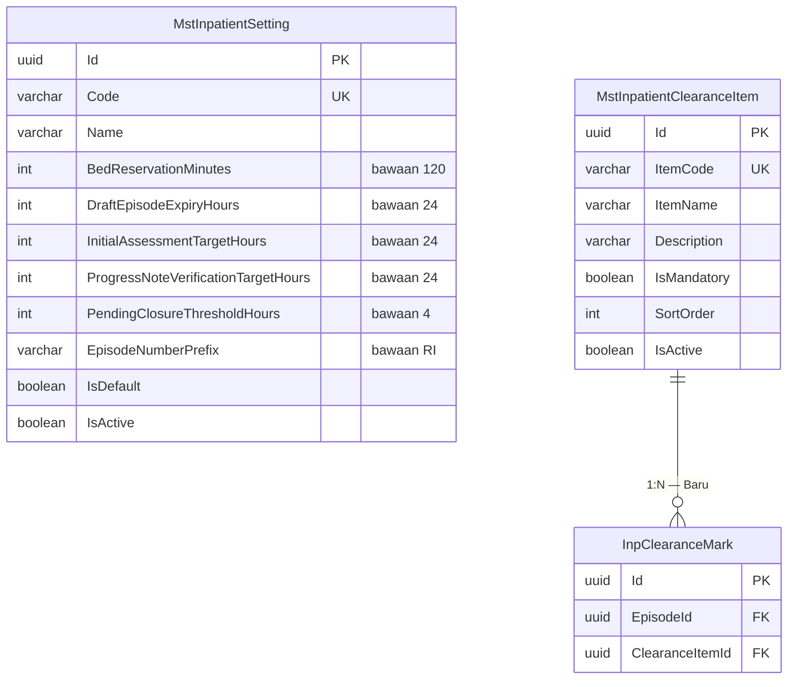

# ERD — Konfigurasi Rawat Inap (`CTX-INP-CONFIG`)

| Field | Nilai |
| --- | --- |
| Blueprint ID | `RWI-BP-001` |
| Revision | `0.1` |
| Status | `draft` |
| Backend SHA | `5afb54b` |

Konteks ini kecil dan sengaja dipisah dari `CTX-INP-CARE`. Alasannya: isinya tidak punya lifecycle
episode. Ia diubah admin kapan saja, berlaku pada pembacaan berikutnya, dan tidak pernah "selesai"
atau "batal".

---

## 1. Diagram

Kedua master tidak saling berhubungan. Yang menghubungkan keduanya ke dunia luar hanyalah
`InpClearanceMark`, yang sudah digambar pada [`01-inpatient-episode.md`](./01-inpatient-episode.md).

---

## 2. Tabel status entity

| Entity | Status | Owner | Catatan |
| --- | --- | --- | --- |
| `MstInpatientSetting` | `Baru` | Master Data HealthServices | Satu baris berkode `DEFAULT` |
| `MstInpatientClearanceItem` | `Baru` | Master Data HealthServices | Tiga butir bawaan |

---

## 3. Kenapa dua tabel, bukan satu

Godaan yang wajar adalah menyatukan butir daftar periksa ke dalam tabel pengaturan, misalnya
sebagai satu kolom teks berisi daftar. Itu ditolak karena tiga hal:

| Alasan | Penjelasannya |
| --- | --- |
| Bentuknya berbeda | Pengaturan berisi **satu nilai per kepedulian**. Butir daftar periksa berisi **banyak baris** yang dapat ditambah dan dikurangi |
| Butir dirujuk data lain | `InpClearanceMark` menunjuk butir tertentu. Kalau butir hanya berupa teks di dalam satu kolom, rujukan itu tidak dapat dijaga |
| Butir punya sifat sendiri | Setiap butir punya `IsMandatory` dan `IsActive` sendiri. Butir wajib menahan penutupan; butir tidak wajib tidak |

Contoh nyata bedanya: admin mengubah batas pemesanan dari 2 jam menjadi 3 jam — itu satu nilai
berubah. Admin menambah butir baru "surat kontrol sudah dicetak" — itu satu baris bertambah, dan
episode yang sudah ditutup sebelumnya tidak boleh ikut terpengaruh.

---

## 4. Aturan yang mengikat kedua master

| Aturan | Dasar |
| --- | --- |
| Nilai pada `MstInpatientSetting` **tidak boleh** ditanam di controller maupun frontend | `RWI-RULE-034` aturan 1 |
| Perubahan nilai berlaku pada pembacaan berikutnya, tanpa aplikasi dinyalakan ulang | `RWI-RULE-034` aturan 3 |
| Setiap perubahan menyimpan siapa yang mengubah dan kapan | `RWI-RULE-034` aturan 5, dipenuhi kolom audit `IdentityModel` |
| Butir yang dinonaktifkan **tidak lagi** menahan penutupan, dan penandaan lama tetap tersimpan | `RWI-RULE-018`, `RWI-RULE-024` |
| `ExpiresAt` pada pemesanan disalin **saat pemesanan dibuat** | Supaya perubahan pengaturan tidak mengubah pemesanan yang sudah berjalan. Lihat catatan desain `InpBedReservation` |
