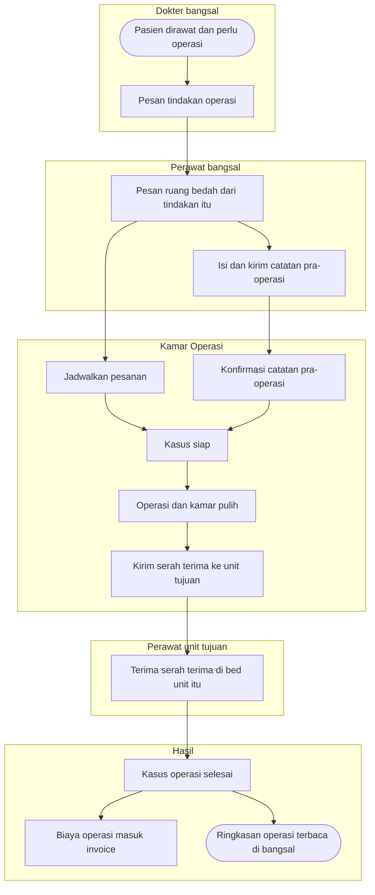
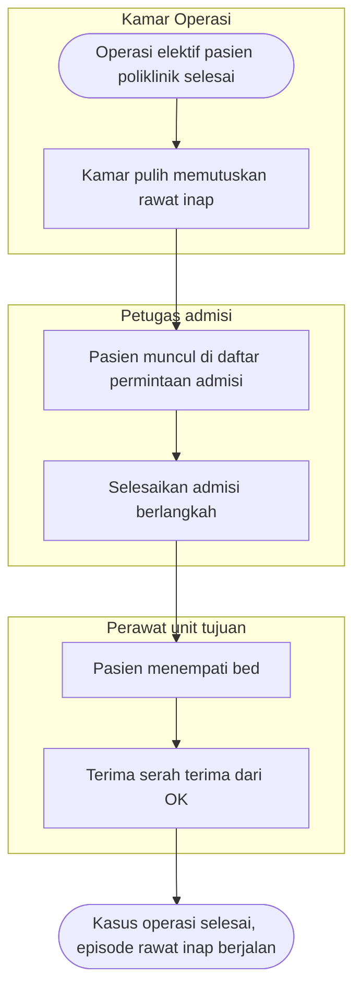
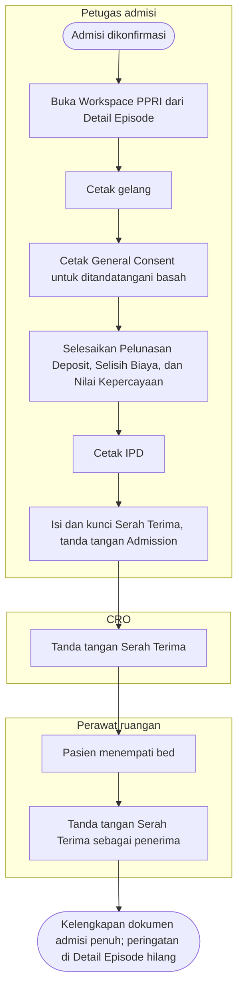

# Flowchart — Alur utama `episode-rawat-inap`

| Field | Nilai |
|---|---|
| Sub-modul | `episode-rawat-inap` |
| Kontrak | Bagian 1–2: `0.10.0` (`approved`, `RWI-DEC-221`). Bagian 3: `0.11.0` — `approved` 2026-10-08 (`RWI-DEC-265`), Workspace PPRI |
| Lahir | Finishing Rawat Inap ★ 1 Oktober 2026. Sebelum revision ini sub-modul memakai `erd/` dan tidak punya folder flowchart; alur admisi sampai penutupan revision `0.8` tetap dibaca dari `02-backend-architecture.md` dan `integrasi-billing/flowcharts/` |
| Cakupan file ini | Jalur normal ujung ke ujung pasien operasi dari bangsal (bagian 1–2, jalur gagal di `01` s.d. `04`) dan penerimaan pasien di Workspace PPRI (bagian 3, jalur gagal di `05` s.d. `08`) |

## 1. Pasien rawat inap menjalani operasi

| Langkah | Pelaku | Masukan | Keluaran | Bila gagal |
|---|---|---|---|---|
| Pesan tindakan operasi | Dokter | Tindakan, dokter operator | Order tindakan aktif | — |
| Pesan ruang bedah | Perawat atau dokter bangsal | Satu order tindakan, tanggal, anestesi, sisi tubuh | Kasus OK "Diminta" | Tanpa order: minta dokter memesan tindakan (`01`) |
| Kirim pra-operasi | Perawat bangsal | Checklist, penandaan, tanda vital terbaru | Catatan terkirim | Tanda vital belum ada: catat dulu (`01`) |
| Jadwalkan | Petugas OK | Pesanan | Kasus "Terjadwal" | OK menolak pesanan (`01`) |
| Konfirmasi pra-operasi | Perawat OK, akun lain | Catatan terkirim | Catatan terkonfirmasi | Butir kurang atau sisi berbeda (`01`) |
| Operasi dan kamar pulih | Tim OK | — | Laporan operasi final, keputusan kamar pulih | Ditunda: pra-operasi perlu diperbarui (`01`) |
| Terima serah terima | Perawat unit tujuan | Serah terima | Diterima | Pasien belum di bed unit tujuan (`02`) |
| Biaya operasi | Sistem | Kasus selesai | Tindakan, anestesi, sewa kamar, bahan di invoice | Tarif belum ada (`02`) |

## 2. Pasien operasi dari poliklinik yang perlu dirawat

| Langkah | Pelaku | Masukan | Keluaran | Bila gagal |
|---|---|---|---|---|
| Keputusan kamar pulih | Tim kamar pulih | Pasien tanpa episode rawat inap | Permintaan admisi | Pasien sudah dirawat: serah terima biasa (`03`) |
| Admisi | Petugas admisi | Permintaan, penjamin, kelas, DPJP, deposit, bed | Episode rawat inap | Permintaan sudah dibatalkan OK (`03`) |
| Terima serah terima | Perawat unit tujuan | Bed ditempati | Kasus selesai | Belum di bed: tombol terima terkunci (`02`) |

Rincian: `01-pemesanan-dan-pra-operasi.md`, `02-serah-terima-dan-biaya-operasi.md`, `03-admisi-dari-kamar-pulih.md`, `04-serah-terima-transfer.md` (`P2`).

---

## 3. Penerimaan pasien di Workspace PPRI ★ kontrak `0.11.0` (`approved` 8 Oktober 2026)

Jalur normal untuk pasien penjamin asuransi dengan kekurangan deposit, tanpa rencana operasi (`RWI-DEC-234`: enam dokumen wajib). Jalur gagal ada di `05` s.d. `08`.

| Langkah | Pelaku | Masukan | Keluaran | Bila gagal |
|---|---|---|---|---|
| Buka Workspace PPRI | Petugas admisi | Episode `Admitted`; hak baca dokumen admisi | Header pasien, sembilan menu, kelengkapan "0 dari 6" | Data pasien gagal dimuat (`05`) |
| Cetak gelang | Petugas admisi | Data pasien | Gelang terpasang; catatan cetak | Cetak ulang beralasan (`07`) |
| General Consent | Petugas admisi | Hubungan penanda tangan, panduan rawat inap | Dua lembar cetak tanpa simpan (`RWI-DEC-233`) | Data wali tidak ada: isi manual |
| Dokumen bertanda tangan | Petugas admisi, keluarga | Isian formulir V1 | Dokumen `Completed` | Siklus dan koreksi (`05`), deposit (`08`) |
| Cetak IPD | Petugas admisi | Data terangkai | Lembar IPD; bagian tanpa sumber diisi tangan | Data wajib gagal dimuat (`07`) |
| Serah Terima | Admisi, CRO, perawat | Butir dari master; pasien di bed | Serah Terima `Completed` | Butir kurang atau pasien belum di bed (`06`) |

Kelengkapan dokumen admisi **tidak menahan** penempatan, perawatan, transfer, keputusan pulang, maupun keluar ruangan (`RWI-DEC-234`). Rincian: `05-workspace-ppri-siklus-dokumen.md`, `06-serah-terima-pasien-baru.md`, `07-gelang-label-dan-ipd.md`, `08-pelunasan-deposit.md`.
