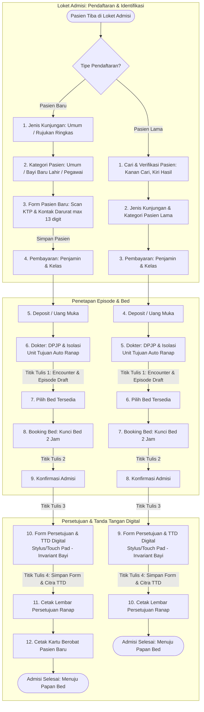
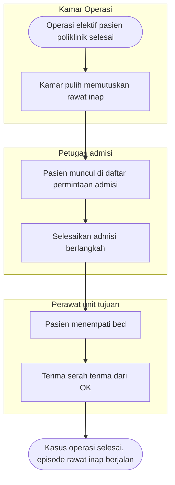
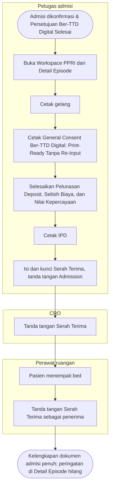
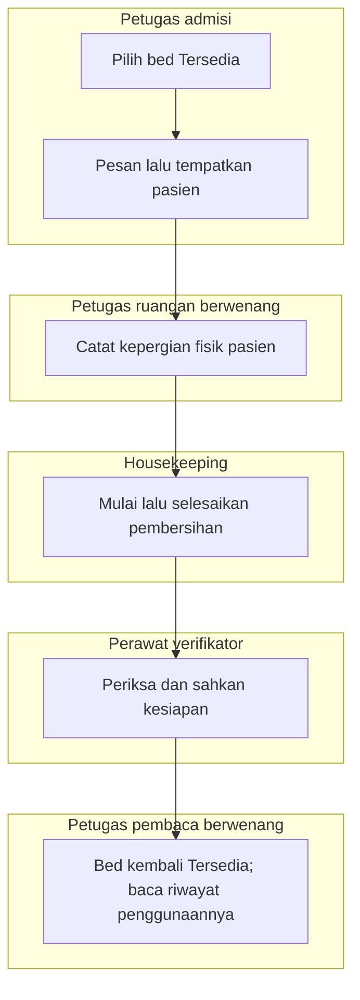

# Flowchart — Alur utama `episode-rawat-inap`

| Field | Nilai |
|---|---|
| Sub-modul | `episode-rawat-inap` |
| Kontrak | Mengikuti set pada manifest sub-modul; Bed Management draft, last_changed_in 0.12.0. Riwayat metadata: Bagian 0: `0.11.0` amandemen Alur Admisi Pendaftaran (`approved` 10 Oktober 2026, `RWI-DEC-267` s.d. `RWI-DEC-273`). Bagian 1–2: `0.10.0` (`approved`, `RWI-DEC-221`). Bagian 3: `0.11.0` — `approved` 2026-10-08 (`RWI-DEC-265`), Workspace PPRI |
| Lahir | Finishing Rawat Inap ★ 1 Oktober 2026; diamandemen 10 Oktober 2026 untuk menyerap alur admisi pendaftaran terpadu |
| Cakupan file ini | Alur admisi pendaftaran pasien baru & lama (Bagian 0), jalur pasien operasi dari bangsal (Bagian 1–2), dan penerimaan pasien di Workspace PPRI (Bagian 3) |

---

## 0. Alur Admisi Pendaftaran Pasien Rawat Inap ★ Amandemen Revisi Bisnis (`RWI-DEC-267` s.d. `RWI-DEC-273`)

Menyerap 5 poin revisi tim analisis bisnis:
1. Batasan Nomor HP Kontak Darurat maksimal 13 digit angka (`RWI-DEC-267`).
2. Dropdown Unit Tujuan di Langkah Dokter disembunyikan dari UI dan diikat default rawat inap (`RWI-DEC-268`).
3. Form input Surat Persetujuan Rawat Inap & TTD Digital disisipkan sebagai Langkah Mandiri (*Dedicated Step*) sebelum cetak; menu General Consent PPRI berstatus *read-only / print-ready* (`RWI-DEC-272`, `RWI-AC-395`).
4. Langkah 1 Pasien Baru: Jenis Kunjungan (Umum & Rujukan ringkas tekstual tanpa upload fisik, `RWI-DEC-269`).
5. Langkah 2 Pasien Baru: Kategori Pasien disaring menjadi tepat 3 opsi (Umum, Bayi Baru Lahir, Pegawai, `RWI-DEC-270`).
6. Pasien Lama: Pencarian dan verifikasi disatukan ke dalam 1 layar split kanan-kiri (`RWI-DEC-271`).
7. Invariant Hukum Medis: Bayi Baru Lahir mengunci penanda tangan wajib Orang Tua / Wali (`RWI-DEC-273`).

| Langkah | Jalur PB | Jalur PL | Masukan Utama | Keluaran / Simpanan | Validasi / Aturan Keras |
|---|:---:|:---:|---|---|---|
| Jenis Kunjungan | 1 | 2 (gabung) | Opsi Umum vs Rujukan | State kunjungan, data rujukan | Bila Rujukan: wajib 5 data teks (No, Tgl/Jam, Faskes, Dokter, Diagnosa) (`RWI-DEC-269`) |
| Kategori Pasien | 2 | 2 (gabung) | 3 Opsi: Umum, Bayi, Pegawai | State kategori, penaut episode ibu | Opsi Ibu, Anak, Korporat dinonaktifkan (`RWI-DEC-270`). Bayi wajib episode ibu |
| Pendaftaran Pasien Baru | 3 | – | Identitas & Kontak Darurat | Entitas `MstPatient` | No HP Kontak Darurat numerik maksimal 13 digit angka (`RWI-DEC-267`) |
| Cari & Verifikasi | – | 1 | Input No. RM / NIK (Kanan) | Pasien terpilih di panel kiri | Penyatuan 1 layar split layout kanan-kiri (`RWI-DEC-271`) |
| Pembayaran & Deposit | 4–5 | 3–4 | Penjamin, kelas, uang muka | State alur pembayaran & deposit | Nominal deposit ditahan di klien; kekurangan tidak memblokir admisi (`RWI-DEC-095`) |
| Dokter (DPJP & Isolasi) | 6 | 5 | DPJP terpilih, sakelar isolasi | **Titik Tulis 1**: Kunjungan & Episode `Draft` | Unit Tujuan disembunyikan dari UI, default ranap dikirim otomatis (`RWI-DEC-268`) |
| Pemilihan & Booking Bed | 7–8 | 6–7 | Tempat tidur tersedia | **Titik Tulis 2**: `InpBedReservation` aktif | Bed terkunci `Reserved` 2 jam |
| Konfirmasi Admisi | 9 | 8 | Catatan admisi akhir | **Titik Tulis 3**: Koreksi episode | Kunci data admisi |
| Form Persetujuan & TTD Digital | 10 | 9 | Form persetujuan, kanvas TTD | **Titik Tulis 4**: Form & citra PNG TTD | *Dedicated step* (`RWI-DEC-272`). Bayi Baru Lahir wajib Orang Tua/Wali (`RWI-DEC-273`) |
| Cetak Persetujuan & Kartu | 11–12 | 10 | Pratinjau dokumen ber-TTD | Cetak fisik dokumen & kartu | Berkas siap print di Workspace PPRI tanpa input ulang (`RWI-AC-395`) |

---

## 1. Pasien rawat inap menjalani operasi

| Langkah | Pelaku | Masukan | Keluaran | Bila gagal |
|---|---|---|---|---|
| Pesan tindakan operasi | Dokter | Tindakan, dokter operator | Order tindakan aktif | — |
| Pesan ruang bedah | Perawat atau dokter bangsal | Satu order tindakan, tanggal, anestesi, sisi tubuh | Kasus OK "Diminta" | Tanpa order: minta dokter memesan tindakan (`01`) |
| Kirim pra-operasi | Perawat bangsal | Checklist, penandaan, tanda vital terbaru | Catatan terkirim | Tanda vital belum ada: catat dulu (`01`) |
| Jadwalkan | Petugas OK | Pesanan | Kasus "Terjadwal" | OK menolak pesanan (`01`) |
| Konfirmasi pra-operasi | Perawat OK, akun lain | Catatan terkirim | Catatan terkonfirmasi | Butir kurang atau sisi berbeda (`01`) |
| Operasi dan kamar pulih | Tim OK | — | Laporan operasi final, keputusan kamar pulih | Ditunda: pra-operasi perlu diperbarui (`01`) |
| Terima serah terima | Perawat unit tujuan | Serah terima | Diterima | Pasien belum di bed unit tujuan (`02`) |
| Biaya operasi | Sistem | Kasus selesai | Tindakan, anestesi, sewa kamar, bahan di invoice | Tarif belum ada (`02`) |

## 2. Pasien operasi dari poliklinik yang perlu dirawat

| Langkah | Pelaku | Masukan | Keluaran | Bila gagal |
|---|---|---|---|---|
| Keputusan kamar pulih | Tim kamar pulih | Pasien tanpa episode rawat inap | Permintaan admisi | Pasien sudah dirawat: serah terima biasa (`03`) |
| Admisi | Petugas admisi | Permintaan, penjamin, kelas, DPJP, deposit, bed | Episode rawat inap | Permintaan sudah dibatalkan OK (`03`) |
| Terima serah terima | Perawat unit tujuan | Bed ditempati | Kasus selesai | Belum di bed: tombol terima terkunci (`02`) |

Rincian: `01-pemesanan-dan-pra-operasi.md`, `02-serah-terima-dan-biaya-operasi.md`, `03-admisi-dari-kamar-pulih.md`, `04-serah-terima-transfer.md` (`P2`).

---

## 3. Penerimaan pasien di Workspace PPRI ★ kontrak `0.11.0` (`approved` 8 Oktober 2026)

Jalur normal untuk pasien penjamin asuransi dengan kekurangan deposit, tanpa rencana operasi (`RWI-DEC-234`: enam dokumen wajib). Jalur gagal ada di `05` s.d. `08`.

| Langkah | Pelaku | Masukan | Keluaran | Bila gagal |
|---|---|---|---|---|
| Buka Workspace PPRI | Petugas admisi | Episode `Admitted`; hak baca dokumen admisi | Header pasien, sembilan menu, kelengkapan "0 dari 6" | Data pasien gagal dimuat (`05`) |
| Cetak gelang | Petugas admisi | Data pasien | Gelang terpasang; catatan cetak | Cetak ulang beralasan (`07`) |
| General Consent | Petugas admisi | Berkas persetujuan admisi ber-TTD digital | Lembar cetak persetujuan lengkap (*print-ready* tanpa re-input, `RWI-AC-395`) | Berkas belum ditandatangani saat admisi: buka kembali form persetujuan |
| Dokumen bertanda tangan | Petugas admisi, keluarga | Isian formulir V1 | Dokumen `Completed` | Siklus dan koreksi (`05`), deposit (`08`) |
| Cetak IPD | Petugas admisi | Data terangkai | Lembar IPD; bagian tanpa sumber diisi tangan | Data wajib gagal dimuat (`07`) |
| Serah Terima | Admisi, CRO, perawat | Butir dari master; pasien di bed | Serah Terima `Completed` | Butir kurang atau pasien belum di bed (`06`) |

Kelengkapan dokumen admisi **tidak menahan** penempatan, perawatan, transfer, keputusan pulang, maupun keluar ruangan (`RWI-DEC-234`). Rincian: `05-workspace-ppri-siklus-dokumen.md`, `06-serah-terima-pasien-baru.md`, `07-gelang-label-dan-ipd.md`, `08-pelunasan-deposit.md`.

## 4. Amandemen Bed Management — 10 Oktober 2026

**Status: draft — Amandemen Bed Management, 10 Oktober 2026.** Set kontrak mengikuti `blueprint-manifest.md`; `last_changed_in: 0.12.0`. Owner produk/domain/API: Muhammad Hamzah (RWI-DEC-061); frontend: pengembang dalam batas RWI-DEC-292; keamanan/privasi: OPEN. `approved_by: null`, `approved_at: null` untuk amandemen ini.

Masukan: decision log revision **46**, RWI-DEC-274–294 dan RWI-AC-396–426; gate revision **1.12**, **BM-RCG-20261010-01**, enam BM-CG siap untuk desain produk terbatas. `DOMAIN_ARCHITECTURE_NOT_RUN` untuk slice ini: ownership existing sudah diketahui dan gate mengizinkan desain langsung. Arsitektur domain lama bagi scope lain tetap berlaku. As-is bersumber audit **BM-AUD-20261010-01** revision 1 (section 7 untuk Swagger), bukan bukti runtime.

Snapshot BE `d4e1eca06fb28c05934c68c1e51a4dca01935a10`, FE `969acfcc04cdf31074a1911e9827c31d25ddadd0`. Semua nama class/field/API baru di bawah adalah **target Rencana (belum tersedia)**. Bila bagian lama bertentangan mengenai bed kembali Available, amandemen ini mengikuti RWI-DEC-281/282. Persetujuan produk bukan persetujuan desain atau SOP. Hash masukan terpusat pada manifest.

Diagram ini menunjukkan jalur normal penggunaan awal sampai kesiapan kembali. Jalur transfer, penolakan, dan hasil tidak pasti dirinci pada flow per proses di bawah.

| Langkah | Pelaku | Masukan | Keluaran | Bila gagal |
| --- | --- | --- | --- | --- |
| Pilih, pesan, tempatkan | Admisi | Episode sah; bed siap; hak pada unit | Dipesan lalu Terisi | Perbarui data atau pilih bed lain; lihat alur09 |
| Catat kepergian | Petugas ruangan | Kepergian sah dan hunian terkini | Hunian berakhir; Menunggu Pembersihan | Periksa hunian; jangan melepas pasien berikutnya |
| Mulai dan selesai pembersihan | Housekeeping | Siklus terkini; SOP dan penugasan sah | Dalam Pembersihan; tahap Menunggu verifikasi | Pertahankan bed tertahan; lihat alur11 |
| Periksa dan sahkan | Perawat verifikator | Hasil pekerjaan; bukti dan hak sah | Tersedia sesudah seluruh guard lolos | Catat alasan belum siap; lihat alur11 |
| Baca riwayat | Pembaca berwenang | Bed/periode dalam scope | Seluruh segmen penggunaan sesuai hak | Coba baca ulang; lihat alur13 |

Closure master sah membuat Tidak Tersedia, pembukaan kembali belum otomatis Tersedia. Reservasi unused cancel/expiry tidak masuk cleaning. Konflik data/closure/current holder tetap diperiksa pada setiap panah.

- [FLOW-BM-MVP-001 — Pemesanan, hunian dan pelepasan](./09-bed-reservation-release.md)
- [FLOW-BM-MVP-002 — Transfer bed satu langkah](./10-bed-transfer.md)
- [FLOW-BM-MVP-003 — Pembersihan dan pengesahan kesiapan](./11-bed-cleaning-readiness.md)
- [FLOW-BM-MVP-004 — Penutupan administratif dan pembukaan](./12-bed-closure-reopen.md)
- [FLOW-BM-MVP-005 — Riwayat penggunaan dan koreksi](./13-bed-usage-history-correction.md)
- [FLOW-BM-MVP-006 — Hasil tidak pasti dan pemulihan koneksi](./14-bed-uncertain-outcome.md)
