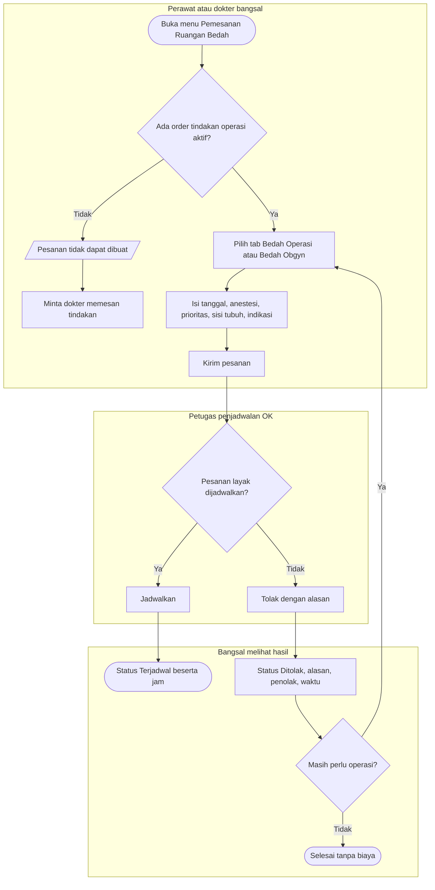
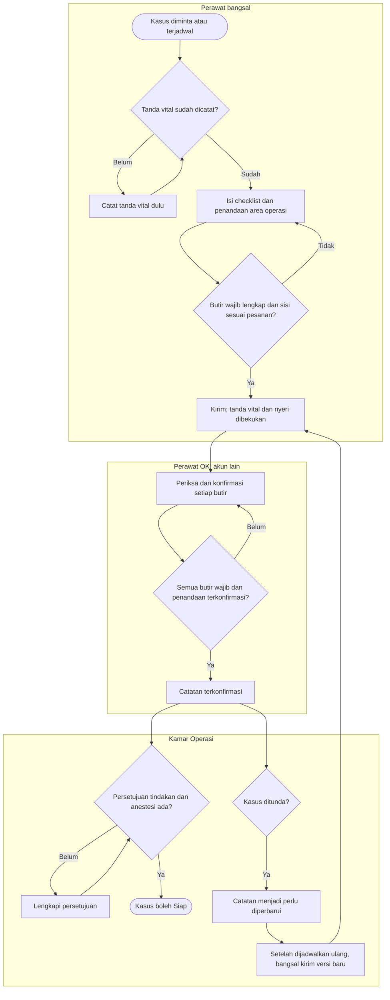

# Flowchart — Pemesanan ruang bedah, penolakan, dan catatan pra-operasi

| Field | Nilai |
|---|---|
| Sub-modul | `episode-rawat-inap` |
| Kontrak | `0.10.0` — `draft` |
| Proses | `BP-RWF-03` |
| Keputusan | `RWI-DEC-173` s.d. `176`, `199`, `204` |

## 1. Pemesanan dan penolakan

| Langkah | Pelaku | Masukan | Keluaran | Bila gagal |
|---|---|---|---|---|
| Pilih order | Perawat atau dokter | Order tindakan aktif pasien | Tindakan dan dokter operator terisi | Tidak ada order: hubungi dokter |
| Kirim pesanan | Perawat atau dokter | Isian pesanan | Kasus "Diminta" | Pasien bukan lagi dirawat: pesanan ditolak |
| Jadwalkan | Petugas OK | Kasus "Diminta" | "Terjadwal" | — |
| Tolak | Petugas OK | Alasan | "Ditolak", final | Alasan kosong: isi alasan |
| Pesan ulang | Perawat atau dokter | Order yang sama | Kasus baru "Diminta" | — |

## 2. Catatan pra-operasi dan penundaan

| Langkah | Pelaku | Masukan | Keluaran | Bila gagal |
|---|---|---|---|---|
| Isi checklist | Perawat bangsal | Butir dari master | Draf | Master kosong: minta admin mengisi butir persiapan |
| Penandaan | Perawat bangsal | Titik pada gambar tubuh, sisi | Penandaan | Sisi berbeda dengan pesanan: perbaiki sisi atau minta OK memperbaiki pesanan |
| Kirim | Perawat bangsal | Draf lengkap | Catatan terkirim dengan potret | Tanda vital belum ada: catat dulu |
| Konfirmasi | Perawat OK | Catatan terkirim | Terkonfirmasi | Akun sama dengan pengirim: minta rekan lain |
| Penundaan | Petugas OK | Kasus ditunda | Catatan perlu diperbarui | — |
| Versi baru | Perawat bangsal | Butir lama sebagai usulan, tanda vital terbaru | Versi baru terkirim | Sama dengan kirim |
