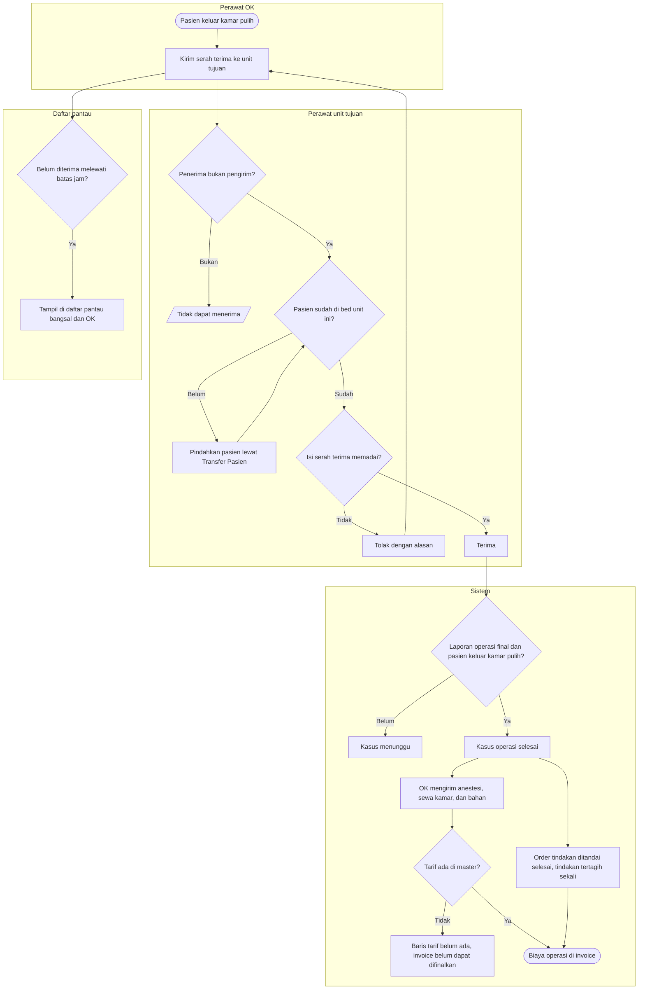

# Flowchart — Serah terima pasca operasi dan biaya operasi

| Field | Nilai |
|---|---|
| Sub-modul | `episode-rawat-inap` |
| Kontrak | `0.10.0` — `draft` |
| Proses | `BP-RWF-03`, `BP-RWF-08` |
| Keputusan | `RWI-DEC-177`, `189`, `196`, `197` |

| Langkah | Pelaku | Masukan | Keluaran | Bila gagal |
|---|---|---|---|---|
| Kirim serah terima | Perawat OK | Kondisi, alat, risiko, instruksi | Serah terima terkirim | — |
| Periksa penerima | Sistem | Akun penerima | Lanjut | Akun sama dengan pengirim: minta perawat unit tujuan |
| Periksa bed | Sistem | Lokasi bed pasien | Lanjut | Pasien belum di unit tujuan: lakukan Transfer Pasien dulu. Bila lokasi tidak dapat dibaca, penerimaan ditolak dan dicoba lagi |
| Tolak | Perawat unit tujuan | Alasan | OK melengkapi dan mengirim ulang | — |
| Kasus selesai | Sistem | Serah terima diterima, laporan final | Kasus selesai | Laporan belum final: dokter operator memfinalkan laporan |
| Biaya | Sistem | Kasus selesai | Baris tagihan | Tarif belum ada: admin tarif melengkapi master; kirimannya dicoba ulang dari rekonsiliasi OK |
| Pantau | Kepala ruangan, OK | Serah terima tertunda | Daftar | — |

Selama operasi pasien tetap menempati bed asal dan tarif kamarnya tetap berjalan. Menerima serah terima tidak memindahkan bed.
