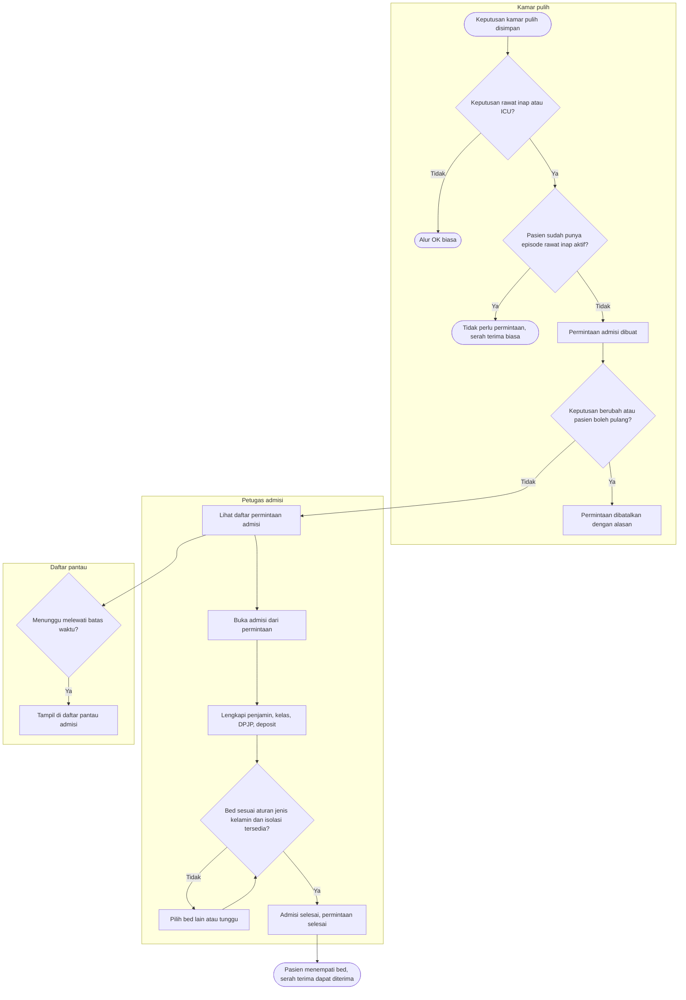

# Flowchart — Admisi rawat inap dari kamar pulih

| Field | Nilai |
|---|---|
| Sub-modul | `episode-rawat-inap` |
| Kontrak | `0.10.0` — `draft` |
| Proses | `BP-RWF-08` |
| Keputusan | `RWI-DEC-201`; persetujuan OK `RWI-DEC-208`; tagihan kunjungan asal `RWI-DEC-207` |
| Keputusan yang belum ada | Tidak ada — `DEC-INP-018` ditutup `RWI-DEC-207` |

| Langkah | Pelaku | Masukan | Keluaran | Bila gagal |
|---|---|---|---|---|
| Simpan keputusan | Tim kamar pulih | Keputusan rawat inap atau ICU | Permintaan admisi | Pasien sudah dirawat: tidak ada permintaan, lanjut serah terima biasa |
| Batalkan | Tim kamar pulih | Alasan | Permintaan hilang dari daftar | — |
| Buka admisi | Petugas admisi | Permintaan | Alur berlangkah terisi awal | Permintaan sudah dibatalkan: muat ulang daftar |
| Admisi biasa tanpa permintaan | Petugas admisi | Pasien yang punya permintaan | Ditolak | Buka admisi dari permintaannya |
| Pilih bed | Petugas admisi | Kelas, jenis kelamin, isolasi | Bed ditempati | Tidak ada bed sesuai: pilih lain atau tunggu |
| Tautan tagihan | Sistem kasir | Admisi selesai | Biaya operasi kunjungan asal tertaut ke tagihan rawat inap, dibayar bersama saat pulang | Gagal: dicoba ulang otomatis; admisi tetap sah |
| Pantau | Petugas admisi, kepala ruangan | Permintaan menunggu | Daftar | — |

Tidak ada admisi otomatis. Selama permintaan belum selesai, kasus OK belum selesai dan biaya operasinya belum terkirim.
