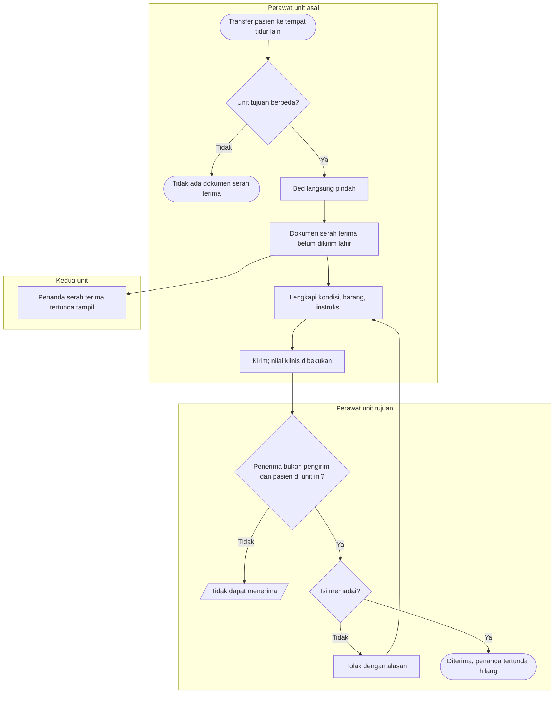

# Flowchart — Serah terima klinis saat transfer antarunit (`P2`)

| Field | Nilai |
|---|---|
| Sub-modul | `episode-rawat-inap` (data milik `ClinicalManagement`) |
| Kontrak | `0.10.0` — `draft` |
| Proses | `BP-RWF-07` |
| Keputusan | `RWI-DEC-182`, `189` |

| Langkah | Pelaku | Masukan | Keluaran | Bila gagal |
|---|---|---|---|---|
| Transfer | Perawat atau kepala ruangan | Bed tujuan | Bed pindah | Aturan transfer yang sudah ada |
| Dokumen lahir | Sistem | Transfer antarunit | Dokumen belum dikirim | Gagal dibuat: transfer tetap sah; dokumen dibuat ulang dari Daftar Pantau |
| Kirim | Perawat unit asal | Isian dan nilai klinis terakhir | Dokumen terkirim | — |
| Terima atau tolak | Perawat unit tujuan | Dokumen | Diterima atau ditolak | Akun sama atau pasien bukan di unit itu: minta perawat unit tujuan |

Dokumen ini tidak pernah menahan transfer, keluar ruangan, atau penutupan episode.
