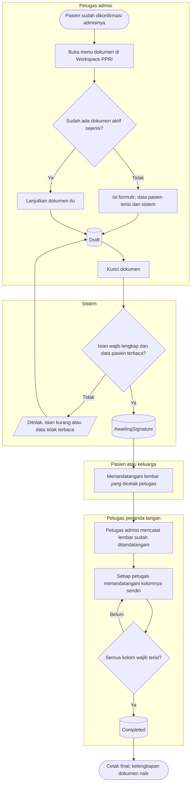
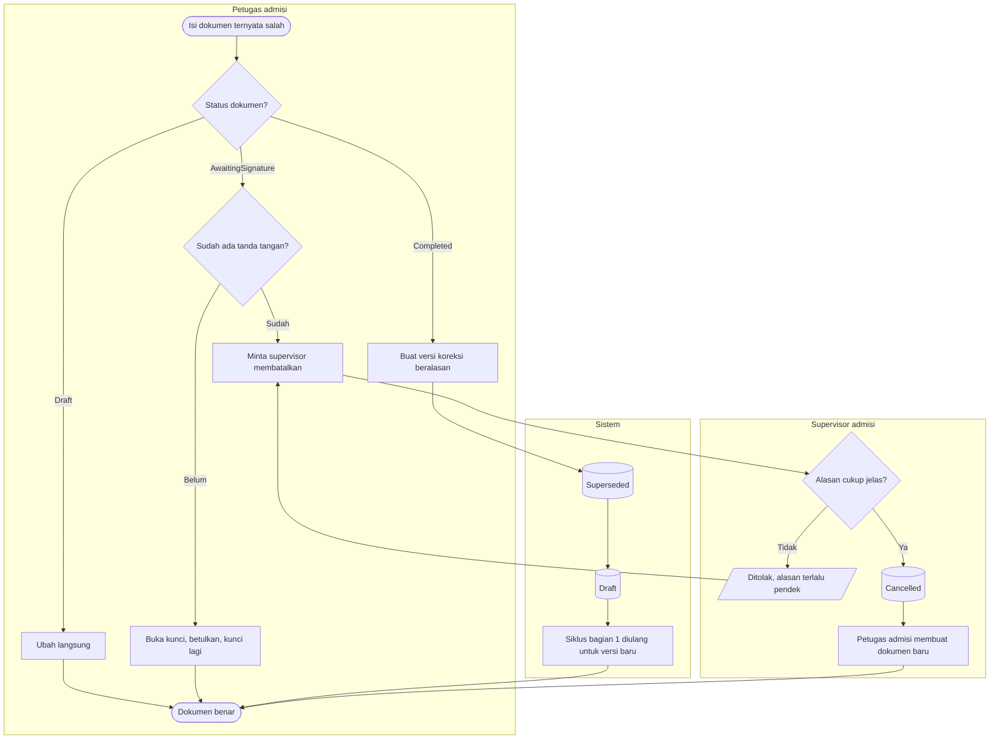

# Flowchart — Siklus dokumen admisi Workspace PPRI

| Field | Nilai |
|---|---|
| Sub-modul | `episode-rawat-inap` |
| Kontrak | `0.11.0` — `approved` 2026-10-08 (`RWI-DEC-265`) |
| Cakupan file ini | Siklus satu dokumen bertanda tangan kertas: Serah Terima Pasien Baru, Permintaan Privasi, Nilai Kepercayaan, Selisih Biaya, Pelunasan Deposit, dan Estimasi Biaya (Estimasi di luar gelombang). Gelang, label, dan IPD tidak punya siklus ini (`07`). General Consent hanya dicetak (`00` bagian 3) |
| Keputusan | `RWI-DEC-230`, `237` s.d. `240`, `263` |
| Status | Nama status pada node sama persis dengan `contracts/state-transition-matrix.md` bagian 10 |

## 1. Dari konsep sampai lengkap

| Langkah | Pelaku | Masukan | Keluaran | Bila gagal |
|---|---|---|---|---|
| Buka menu dokumen | Petugas admisi | Episode `Admitted` atau `DischargePending` | Formulir kosong terisi data pasien, atau dokumen aktif yang sudah ada | Admisi belum dikonfirmasi: selesaikan alur Admisi Rawat Inap dulu |
| Isi formulir | Petugas admisi | Jawaban pasien atau keluarga; pilihan dari data wali | Dokumen `Draft` | Data wali tidak ada: pilih Manual dan ketik |
| Kunci | Petugas admisi | Seluruh isian wajib | Dokumen `AwaitingSignature`; isi dan angka dibekukan | Isian kurang: lengkapi semua yang disebut, lalu kunci lagi |
| Cetak lembar untuk ditandatangani | Petugas admisi | Dokumen terkunci | Lembar bernomor versi, tanpa tanda konsep | Tidak punya hak cetak: minta petugas lain |
| Tanda tangan kertas | Pasien atau keluarga | Lembar tercetak | Lembar bertanda tangan basah, masuk berkas rekam medis | Keluarga belum datang: dokumen tetap menunggu; perawatan tidak tertahan |
| Catat tanda tangan kertas | Petugas admisi | Nama, hubungan, waktu tanda tangan | Kolom pasien/keluarga terisi | Waktu diisi sebelum dokumen dikunci: betulkan waktunya |
| Tanda tangan petugas | Petugas sesuai kolom | Akun sendiri | Kolom terisi "ditandatangani secara elektronik" | Akun sudah mengisi kolom lain: minta petugas lain |
| Cetak final | Siapa pun pemegang hak cetak | Dokumen `Completed` | Lembar final beserta catatan tanda tangan | Dokumen berupiah dan tidak punya hak rupiah: minta petugas admisi atau kasir |

## 2. Koreksi, buka kunci, dan pembatalan

| Langkah | Pelaku | Masukan | Keluaran | Bila gagal |
|---|---|---|---|---|
| Ubah konsep | Petugas admisi | Dokumen `Draft` | Isi baru | Dokumen sudah diubah petugas lain: muat ulang lalu ulangi |
| Buka kunci | Petugas admisi | Dokumen `AwaitingSignature` tanpa tanda tangan | Kembali `Draft`, salinan beku dibuang | Sudah ada tanda tangan: minta supervisor membatalkan |
| Versi koreksi | Petugas admisi | Dokumen `Completed`, alasan | Versi lama `Superseded`, versi baru `Draft`; versi lama tetap terbaca di Riwayat | Alasan terlalu pendek: tulis alasan yang jelas |
| Batalkan | Supervisor admisi | Alasan minimal 10 karakter | Dokumen `Cancelled`; dokumen baru sejenis boleh dibuat | Tidak punya hak batal: minta supervisor |
| Buang konsep | Pembuat konsep | Dokumen `Draft`, alasan | Dokumen `Cancelled` | Bukan pembuatnya: minta supervisor membatalkan |
| Episode ditutup atau dibatalkan | Sistem | — | Semua dokumen hanya-baca; cetak ulang wajib beralasan | — |
