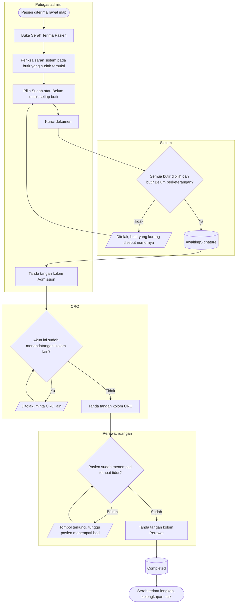

# Flowchart — Serah Terima Pasien Baru

| Field | Nilai |
|---|---|
| Sub-modul | `episode-rawat-inap` |
| Kontrak | `0.11.0` — `approved` 2026-10-08 (`RWI-DEC-265`) |
| Cakupan file ini | Checklist serah terima dari admisi ke ruangan dengan tiga tanda tangan petugas berbeda |
| Keputusan | `RWI-DEC-239`, `241`, `255`, `262` |

| Langkah | Pelaku | Masukan | Keluaran | Bila gagal |
|---|---|---|---|---|
| Buka Serah Terima | Petugas admisi | Butir dari master jenis serah terima | Checklist 15 butir dan 3 sub-butir; nama butir dibekukan | Master kosong: admin mengisi butir di Butir Administrasi Rawat Inap |
| Periksa saran | Petugas admisi | Saran "Sudah" pada butir surat pengantar, IPD, deposit, gelang, dan prakiraan biaya bila sudah terbukti | Pilihan petugas | Saran tidak muncul: dokumen sumbernya belum lengkap; petugas tetap boleh memilih sendiri |
| Pilih Sudah/Belum | Petugas admisi | Pengecekan nyata di lapangan | Setiap butir terpilih; butir Belum berketerangan | Butir terlewat: lengkapi butir yang disebut |
| Kunci | Petugas admisi | Seluruh butir terpilih | Dokumen `AwaitingSignature` | Butir kurang: lengkapi |
| Tanda tangan Admission | Petugas admisi | Akun sendiri, dokumen terkunci | Kolom Admission terisi | — |
| Tanda tangan CRO | CRO | Dokumen terkunci | Kolom CRO terisi | CRO sama dengan petugas admisi: ditolak; CRO tidak bertugas: dokumen menunggu, perawatan tetap berjalan |
| Tanda tangan Perawat | Perawat ruangan | Pasien menempati bed | Kolom Perawat terisi; dokumen `Completed` | Bed masih dipesan: tempatkan pasien dulu lewat penempatan bed |

Contoh: Sari mengunci pukul 10.05 dan menandatangani Admission; Dewi menandatangani CRO pukul 10.20; Budi menempati bed pukul 10.35; Andi menandatangani Perawat pukul 10.40 dan dokumen lengkap.
