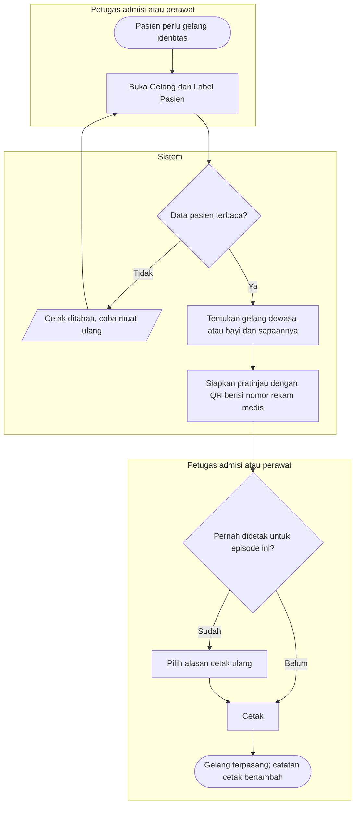
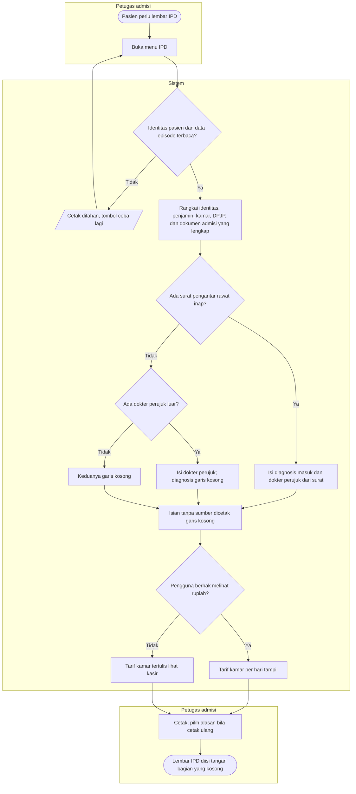

# Flowchart — Gelang, Label Pasien, dan IPD

| Field | Nilai |
|---|---|
| Sub-modul | `episode-rawat-inap` |
| Kontrak | `0.11.0` — `approved` 2026-10-08 (`RWI-DEC-265`) |
| Cakupan file ini | Cetakan tanpa siklus dokumen: gelang identitas, label pasien, dan Data Dasar Rawat Inap (IPD). Yang tersimpan hanya catatan cetak |
| Keputusan | `RWI-DEC-243`, `244`, `253`, `254`, `258`, `259` |

## 1. Gelang dan label

| Langkah | Pelaku | Masukan | Keluaran | Bila gagal |
|---|---|---|---|---|
| Buka menu | Petugas | Episode berjalan | Pratinjau gelang dan label | Data pasien gagal dimuat: muat ulang |
| Tentukan jenis gelang | Sistem | Umur, penanda bayi baru lahir, jenis kelamin, status nikah, batas umur dari pengaturan | Gelang dewasa atau bayi dengan sapaan | Status nikah tidak diketahui: gelang tanpa sapaan |
| Cetak pertama | Petugas | — | Catatan "cetakan ke-1" | — |
| Cetak ulang | Petugas | Alasan: rusak, hilang, data berubah, atau lainnya berketerangan | Catatan "cetakan ke-*n*" | Alasan belum dipilih: pilih alasan dulu |
| Label pasien | Petugas | Nomor kartu penjamin bila ada | Label tanpa nomor karangan; baris nomor kartu kosong bila tidak ada | — |

## 2. Data Dasar Rawat Inap (IPD)

| Langkah | Pelaku | Masukan | Keluaran | Bila gagal |
|---|---|---|---|---|
| Rangkai data | Sistem | Data pasien, penjamin, episode, penempatan, Nilai Kepercayaan dan Privasi yang lengkap | Lembar dua kolom tata letak V1 | Data wajib gagal dimuat: cetak ditahan |
| Diagnosis dan dokter perujuk | Sistem | Surat pengantar terbit pada kunjungan episode, atau dokter perujuk luar | Isian terisi atau garis kosong | Surat dibatalkan dokter: tidak dipakai |
| Tarif kamar | Sistem | Hak rupiah pengguna; tarif kamar dari kasir | Angka atau "lihat kasir" | Tarif kamar belum tersedia dari kasir: "lihat kasir" untuk semua |
| Isian tanpa sumber | Keluarga | Pekerjaan, kewarganegaraan, RT/RW, kelurahan, alamat domisili, alamat kantor, dan lainnya | Diisi tangan di kertas | Layar tidak menyediakan isian ketik untuk data itu |
| Cetak | Petugas admisi | — | Catatan cetak; saran "Sudah" pada butir Formulir IPD Serah Terima | Cetak ulang tanpa alasan: pilih alasan |
