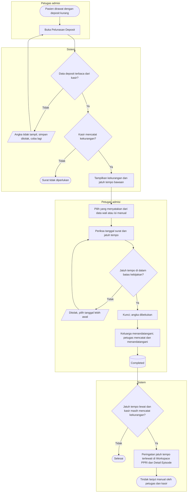

# Flowchart — Pelunasan Deposit

| Field | Nilai |
|---|---|
| Sub-modul | `episode-rawat-inap` |
| Kontrak | `0.11.0` — `approved` 2026-10-08 (`RWI-DEC-265`) |
| Cakupan file ini | Surat pernyataan kesediaan melunasi kekurangan deposit, dari angka kasir sampai peringatan jatuh tempo |
| Keputusan | `RWI-DEC-231`, `248`, `252`, `258`, `260`, `261`, `263` |

| Langkah | Pelaku | Masukan | Keluaran | Bila gagal |
|---|---|---|---|---|
| Baca deposit | Sistem | Kebijakan deposit dan deposit diterima menurut kasir | Kekurangan = minimum − diterima | Kasir tidak menjawab: tidak mengetik angka sendiri; coba lagi |
| Jatuh tempo bawaan | Sistem | Tanggal surat, interval kebijakan | Hari kerja Senin–Jumat berikutnya pukul 11.00, dipotong ke batas tanggal surat + interval | — |
| Pilih yang menyatakan | Petugas admisi | Daftar relasi dan kontak darurat pasien, atau isian manual | Nama, alamat, telepon | Telepon lebih dari 13 digit: betulkan |
| Kunci | Petugas admisi | Isian lengkap | Angka kekurangan dibekukan bersama waktu bacanya | Kekurangan sudah lunas saat dikunci: surat tidak diperlukan |
| Tanda tangan | Keluarga, petugas admisi | Lembar untuk ditandatangani | Surat `Completed`; angka tetap walaupun deposit kemudian bertambah | Keluarga belum datang: dokumen menunggu |
| Pantau jatuh tempo | Sistem | Jatuh tempo pada surat, kekurangan terkini dari kasir | Peringatan tanpa rupiah di Detail Episode; dengan rupiah di header bagi pemegang hak | Penurunan kelas tidak otomatis; tetap transfer manual |

Contoh: surat Jumat 9 Oktober 2026, interval 3 hari → jatuh tempo bawaan Senin 12 Oktober pukul 11.00 WIB. Dengan interval 1 hari → Sabtu 10 Oktober pukul 11.00 WIB.
