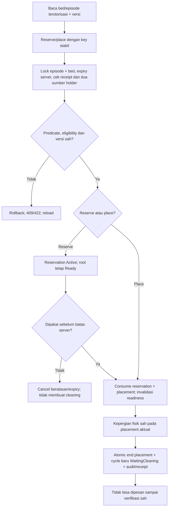

# FLOW-BM-MVP-001 — Pemesanan, hunian dan pelepasan

**draft**, 10 Oktober 2026; mengikuti [manifest](../blueprint-manifest.md), last_changed_in 0.12.0. Approval amandemen belum ada. Owner produk/domain Muhammad Hamzah; penugasan/SOP nyata tetap BM-G02/03.

Pelaku dan pemicu: Admisi/perawat existing; pemicu bed yang dibaca ready. Trace: DEC-281/283/289; AC-407/408/413/419/421/426.

Reservation belum dipakai tidak membuat kebutuhan pembersihan. Closure episode lama tidak memanggil release bed ulang. Error/retry tidak menambah holder atau melepas pasien berikutnya.

Kontrak authoritative: [state](../contracts/state-transition-matrix.md), [API](../contracts/api-contract.md), [permission](../contracts/permission-audit-matrix.md), [acceptance](../testing/acceptance-test-matrix.md).
