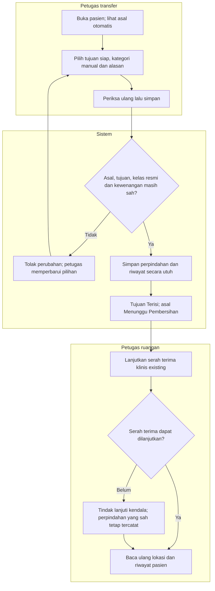

# FLOW-BM-MVP-002 — Transfer bed satu langkah

**draft**, 10 Oktober 2026; mengikuti [manifest](../blueprint-manifest.md), last_changed_in 0.12.0. Approval amandemen belum ada. Owner produk/domain Muhammad Hamzah; penugasan/SOP nyata tetap BM-G02/03.

Pelaku dan pemicu: Petugas Transfer terotorisasi; pasien dengan current placement. Trace: DEC-275–277/284/291; AC-399–405/414/423.

| Langkah | Pelaku | Masukan | Keluaran | Bila gagal |
| --- | --- | --- | --- | --- |
| Buka asal dan pilih tujuan | Petugas transfer | Hunian asal aktif; tujuan siap | Asal otomatis dan kategori dipilih manual | Baca ulang jika lokasi berubah |
| Periksa dan simpan | Petugas transfer/sistem | Kelas resmi, alasan, hak, data terbaru | Asal, tujuan dan riwayat tersimpan bersama | Seluruh perubahan dibatalkan bila penyimpanan gagal |
| Lanjutkan serah terima | Petugas ruangan | Perpindahan yang sudah sah | Dokumen dan proses existing dilanjutkan | Tindak lanjuti tanpa membalik perpindahan |
| Baca hasil | Petugas transfer | Hasil server | Lokasi dan riwayat terbaru terlihat | Bila hasil belum diketahui, ikuti alur14 |

SameGrade valid disediakan manual; arah/order kelas tidak ditebak dari angka0/harga/nama. Handover bukan penerimaan dua fase dan tidak menjadi gate commit.

Kontrak authoritative: [state](../contracts/state-transition-matrix.md), [API](../contracts/api-contract.md), [permission](../contracts/permission-audit-matrix.md), [acceptance](../testing/acceptance-test-matrix.md).
