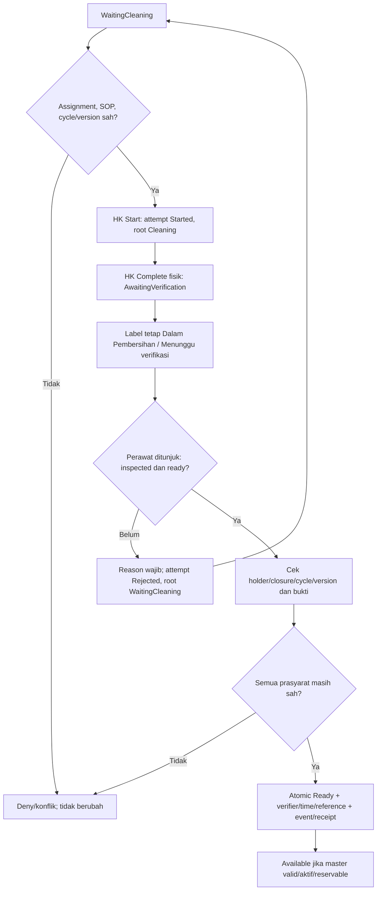

# FLOW-BM-MVP-003 — Pembersihan dan pengesahan kesiapan

**draft**, 10 Oktober 2026; mengikuti [manifest](../blueprint-manifest.md), last_changed_in 0.12.0. Approval amandemen belum ada. Owner produk/domain Muhammad Hamzah; penugasan/SOP nyata tetap BM-G02/03.

Pelaku dan pemicu: HK individu dan perawat verifikator sah; pemicu used release. Trace: DEC-278/280/282; AC-406/409–411/421/425.

Tidak ada timer auto-ready. Close/new-cycle menginvalidasi attempt lama; history upaya tidak hilang. Verifikasi awal Unverified tanpa used-dirty memerlukan SOP/evidence dan verifier yang sama sahnya, tanpa membuat cleaning palsu.

Kontrak authoritative: [state](../contracts/state-transition-matrix.md), [API](../contracts/api-contract.md), [permission](../contracts/permission-audit-matrix.md), [acceptance](../testing/acceptance-test-matrix.md).
