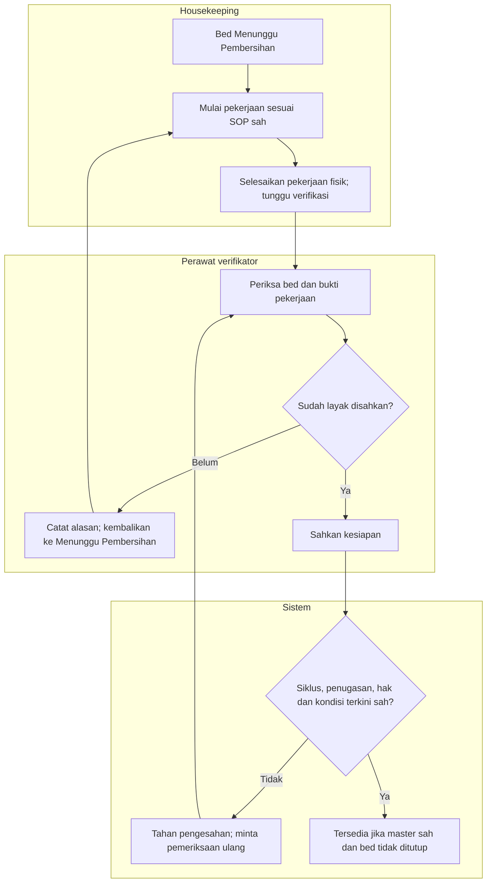

# FLOW-BM-MVP-003 — Pembersihan dan pengesahan kesiapan

**draft**, 10 Oktober 2026; mengikuti [manifest](../blueprint-manifest.md), last_changed_in 0.12.0. Approval amandemen belum ada. Owner produk/domain Muhammad Hamzah; penugasan/SOP nyata tetap BM-G02/03.

Pelaku dan pemicu: HK individu dan perawat verifikator sah; pemicu used release. Trace: DEC-278/280/282; AC-406/409–411/421/425.

| Langkah | Pelaku | Masukan | Keluaran | Bila gagal |
| --- | --- | --- | --- | --- |
| Mulai pekerjaan | Housekeeping | Siklus terkini, SOP dan penugasan sah | Dalam Pembersihan; pelaksana/waktu tercatat | Hak atau siklus tidak sah: baca ulang, hubungi penanggung jawab |
| Selesai fisik | Housekeeping | Pekerjaan selesai pada siklus yang sama | Tahap Menunggu verifikasi; belum tersedia | Jangan menyatakan bed siap sendiri |
| Periksa dan tolak | Perawat verifikator | Bed dan bukti pekerjaan; alasan penolakan | Menunggu Pembersihan; upaya terdahulu tetap ada | Lengkapi alasan; jangan menghapus upaya |
| Sahkan kesiapan | Perawat verifikator/sistem | Bukti dan kondisi terkini sah | Tersedia hanya bila seluruh guard lolos | Tetap tertahan jika ditutup, berubah, atau bukti tidak sah |

Tidak ada timer auto-ready. Close/new-cycle menginvalidasi attempt lama; history upaya tidak hilang. Verifikasi awal Unverified tanpa used-dirty memerlukan SOP/evidence dan verifier yang sama sahnya, tanpa membuat cleaning palsu.

Kontrak authoritative: [state](../contracts/state-transition-matrix.md), [API](../contracts/api-contract.md), [permission](../contracts/permission-audit-matrix.md), [acceptance](../testing/acceptance-test-matrix.md).
