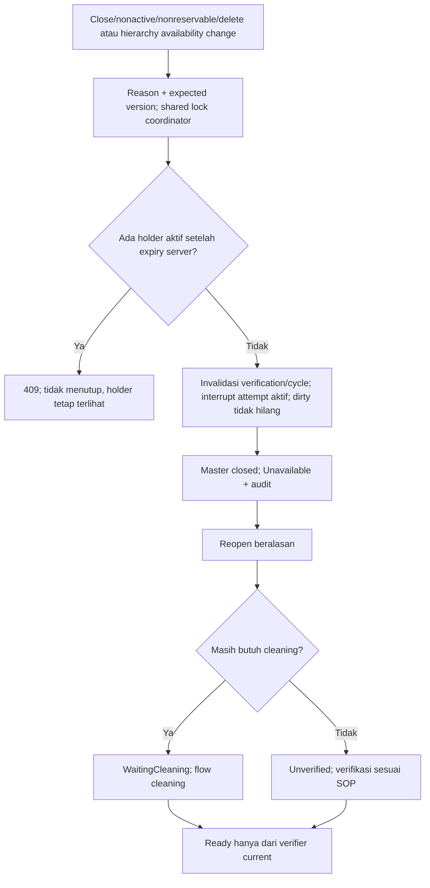

# FLOW-BM-MVP-004 — Penutupan administratif dan pembukaan

**draft**, 10 Oktober 2026; mengikuti [manifest](../blueprint-manifest.md), last_changed_in 0.12.0. Approval amandemen belum ada. Owner produk/domain Muhammad Hamzah; penugasan/SOP nyata tetap BM-G02/03.

Pelaku dan pemicu: Admin MasterData berwenang; seluruh write path. Trace: DEC-285; AC-412/419/424.

PUT/status/availability/create/delete tidak dapat menjadi bypass. Pada konflik data legacy, pasien/reservation aktif tetap terlihat dan pemesanan dilarang, bukan dianggap kosong.

Kontrak authoritative: [state](../contracts/state-transition-matrix.md), [API](../contracts/api-contract.md), [permission](../contracts/permission-audit-matrix.md), [acceptance](../testing/acceptance-test-matrix.md).
