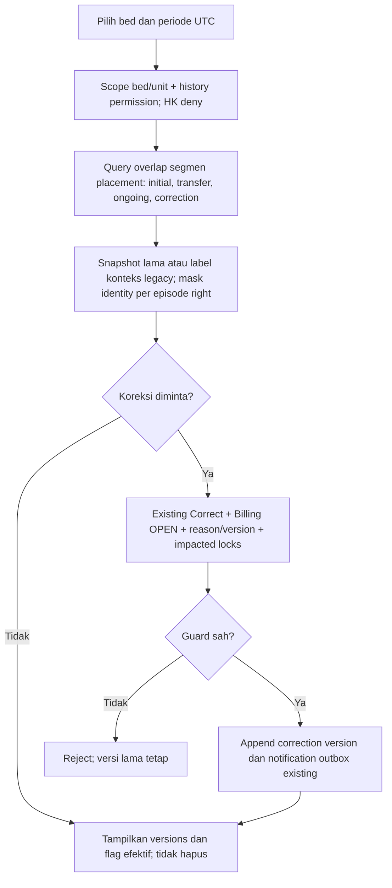

# FLOW-BM-MVP-005 — Riwayat penggunaan dan koreksi

**draft**, 10 Oktober 2026; mengikuti [manifest](../blueprint-manifest.md), last_changed_in 0.12.0. Approval amandemen belum ada. Owner produk/domain Muhammad Hamzah; penugasan/SOP nyata tetap BM-G02/03.

Pelaku dan pemicu: Viewer history authorized, correction oleh existing authorized role. Trace: DEC-286–288; AC-402/415/416/418.

Reservasi/HK/closure audit tidak dihitung sebagai durasi pasien. Correction bukan transfer fisik; kategori tidak memicu harga. End=NULL ongoing; SupersededByCorrectionId menentukan versi efektif Billing.

Kontrak authoritative: [state](../contracts/state-transition-matrix.md), [API](../contracts/api-contract.md), [permission](../contracts/permission-audit-matrix.md), [acceptance](../testing/acceptance-test-matrix.md).
