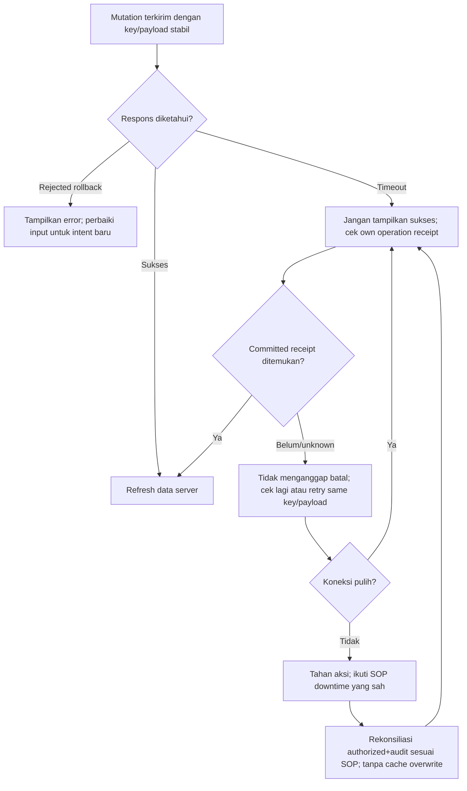

# FLOW-BM-MVP-006 — Hasil tidak pasti dan pemulihan koneksi

**draft**, 10 Oktober 2026; mengikuti [manifest](../blueprint-manifest.md), last_changed_in 0.12.0. Approval amandemen belum ada. Owner produk/domain Muhammad Hamzah; penugasan/SOP nyata tetap BM-G02/03.

Pelaku dan pemicu: Petugas actor permintaan asli; pemicu timeout/network. Trace: DEC-289/290; AC-421/422.

NotFound saat request masih in-flight bukan bukti pasti gagal. Tidak membuat offline queue, key baru otomatis, sukses fiktif atau reverse transfer karena callback. SOP rumah sakit tetap BM-G02.

Kontrak authoritative: [state](../contracts/state-transition-matrix.md), [API](../contracts/api-contract.md), [permission](../contracts/permission-audit-matrix.md), [acceptance](../testing/acceptance-test-matrix.md).
