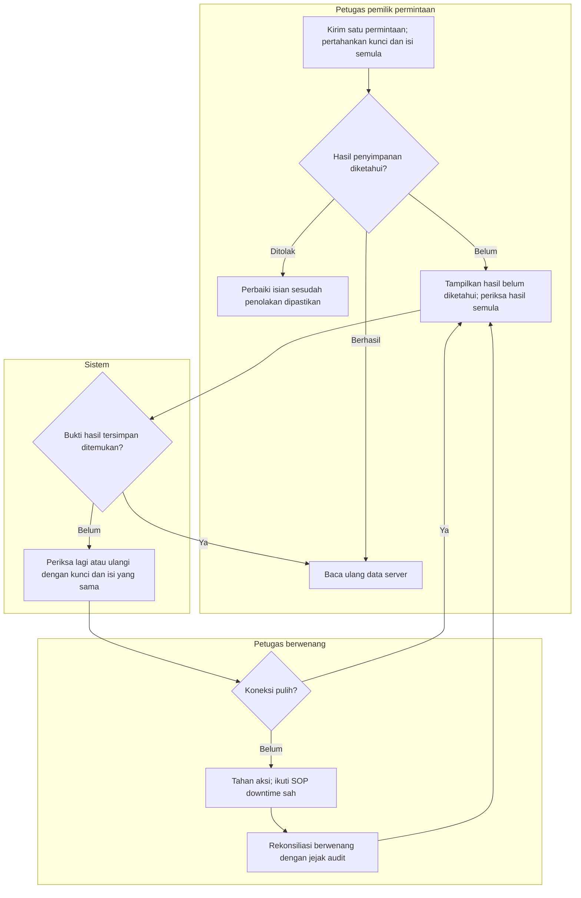

# FLOW-BM-MVP-006 — Hasil tidak pasti dan pemulihan koneksi

**draft**, 10 Oktober 2026; mengikuti [manifest](../blueprint-manifest.md), last_changed_in 0.12.0. Approval amandemen belum ada. Owner produk/domain Muhammad Hamzah; penugasan/SOP nyata tetap BM-G02/03.

Pelaku dan pemicu: Petugas actor permintaan asli; pemicu timeout/network. Trace: DEC-289/290; AC-421/422.

| Langkah | Pelaku | Masukan | Keluaran | Bila gagal |
| --- | --- | --- | --- | --- |
| Kirim permintaan | Petugas asli | Kunci dan isi untuk satu maksud | Satu permintaan terlacak | Klik ganda ditahan |
| Periksa hasil tak pasti | Petugas/sistem | Identitas actor dan kunci semula | Hasil commit diketahui atau masih belum diketahui | Belum ditemukan tidak berarti pasti batal |
| Ulangi dengan aman | Petugas asli | Kunci dan isi sama; koneksi tersedia | Hasil semula dipulihkan tanpa simpan ganda | Jangan membuat kunci baru atau sukses fiktif |
| Downtime dan rekonsiliasi | Petugas yang ditunjuk | SOP sah, bukti kejadian dan kewenangan | Hasil diverifikasi dan diaudit | Tahan aksi bila SOP/penugasan belum terbukti; jangan menimpa dari cache |

NotFound saat request masih in-flight bukan bukti pasti gagal. Tidak membuat offline queue, key baru otomatis, sukses fiktif atau reverse transfer karena callback. SOP rumah sakit tetap BM-G02.

Kontrak authoritative: [state](../contracts/state-transition-matrix.md), [API](../contracts/api-contract.md), [permission](../contracts/permission-audit-matrix.md), [acceptance](../testing/acceptance-test-matrix.md).
