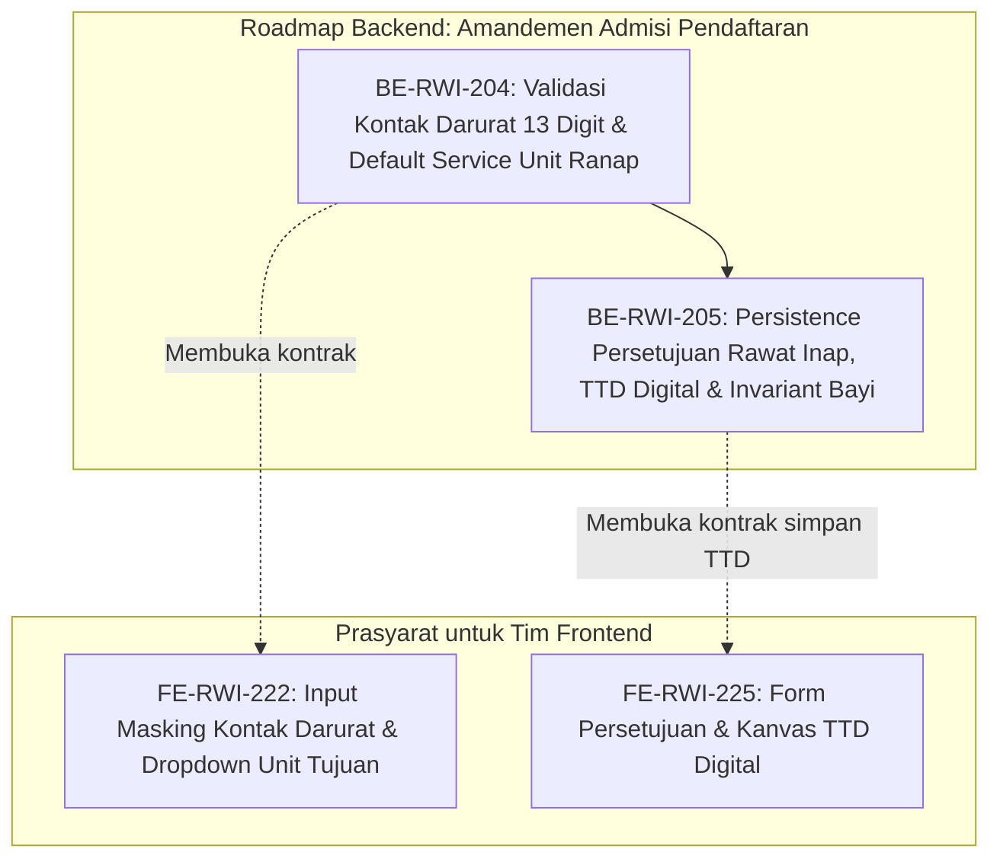

# Roadmap Backend — Episode Rawat Inap, Amandemen Admisi Pendaftaran

| Field | Nilai |
|---|---|
| Roadmap | `episode-rawat-inap/roadmap/backend-roadmap-admisi-pendaftaran.md` — revision `1` |
| Blueprint | `RWI-BP-001` revision `10`, sub-modul `episode-rawat-inap`, kontrak **`0.11.0` `approved`** 2026-10-10 atas perintah pengguna "setujui dan lakukan /plan-module-delivery" |
| Status roadmap | **`APPROVED`** — disetujui pengguna 10 Oktober 2026 sebagai turunan rencana delivery resmi atas amandemen alur admisi pendaftaran revisi Tim Analisis Bisnis (Mba Ilma) |
| Ditulis | 10 Oktober 2026 oleh `plan-module-delivery` |
| Masukan dan approval | `04-prd-to-mvp.md` bagian 25, `contracts/validation-matrix.md` bagian 16 (`VAL-ADM-01` s.d. `05`), `00-interview-decisions.md` revision `40` (`RWI-DEC-267` s.d. `273`, `RWI-AC-388` s.d. `395`), `03-frontend-architecture.md` revision `0.11`, `05-skema-tampilan.md` revision `0.7` |
| Keputusan | `RWI-DEC-267` (No HP Kontak Darurat max 13 digit), `RWI-DEC-268` (Default Ranap Service Unit), `RWI-DEC-269` (Rujukan Teks Ringkas), `RWI-DEC-270` (3 Kategori Pasien), `RWI-DEC-271` (Split Screen Pasien Lama), `RWI-DEC-272` (Dedicated Step Persetujuan & TTD Digital), `RWI-DEC-273` (Invariant Penanda Tangan Bayi) |
| Source SHA | Backend `fdf85a07` / branch `MHamzah`; Frontend `dd2cbf7c` / branch `HamzahV2` |
| Deret ID | `BE-RWI-204` s.d. `BE-RWI-205` |
| Roadmap pendamping | `frontend-roadmap-admisi-pendaftaran.md`, `requirement-traceability-admisi-pendaftaran.md` |

---

## 1. Prinsip dan Kebijakan Rekayasa Backend

1. **Kepatuhan Kebijakan Pengujian.** Mengikuti `rules/backend/TEST_POLICY.md` dan kontrak rekayasa kanonik: bukti penyelesaian task backend meliputi kesesuaian preflight QBE, penelaahan diff/scope, kompilasi bersih (`dotnet build`) tanpa peringatan/error baru, pengujian validasi model dan aturan bisnis dengan data samaran rumah sakit, serta verifikasi endpoint kontrak API.
2. **Kemandirian Modul & Data Master.** Sesuai `INV-RWA-14` dan tata kelola Quilvian, sub-modul `episode-rawat-inap` tidak membuat tabel duplikat untuk pasien, perujuk, atau unit layanan. Pembacaan unit rawat inap memanfaatkan `ServiceUnit` yang sudah aktif, dan data kontak darurat memperketat validasi DTO tanpa merusak relasi entitas.
3. **Penyimpanan Digital Signature.** Citra tanda tangan digital disimpan dalam format data URL Base64 PNG terverifikasi atau penyimpanan dokumen terstruktur admisi episode dengan metadata penanda tangan lengkap (Nama, Hubungan, Waktu Penandatanganan, User Perekam).
4. **Handoff Eksekusi:** Setiap task dikerjakan secara independen (**tepat 1 task approved per eksekusi**) oleh skill `build-module-backend`. Wewenang migrasi database dan penerapan skema dijalankan sesuai SOP kontrol repository.

---

## 2. Grafik Urutan Dependency



---

## 3. Register Task Backend

| Task ID | Outcome | Requirement / Decision | Kontrak | Reuse | Cakupan | Dependency | Acceptance Criteria | Verifikasi | Risiko / Pemilik | Definition of Done (DoD) |
|---|---|---|---|---|---|---|---|---|---|---|
| [`BE-RWI-204`](../task/report/backend/BE-RWI-204.md) ✅ | Backend menolak nomor HP kontak darurat > 13 digit numerik dan otomatis mengikat ServiceUnit rawat inap pada pembuatan encounter admisi | `FR-RI-179`, `FR-RI-183`, `RWI-DEC-267`, `RWI-DEC-268` | Validation Matrix `0.11.0` (`VAL-ADM-01`, `VAL-ADM-02`), API Contract `0.11.0` | DTO `PatientEmergencyContactCreateDto`, `PatientEncounterCreateDto` | Validasi FluentValidation/DataAnnotation nomor darurat max 13 digit numerik, pemastian default `ServiceUnitId` ranap valid | — | `RWI-AC-388`, `RWI-AC-389` | Unit test validasi nomor telepon (11–13 digit lulus, 14 digit ditolak, karakter huruf ditolak), test payload encounter ranap | Nomor lama di DB / Muhammad Hamzah | ✅ **Selesai 10 Oktober 2026.** Seluruh AC terbukti; validasi DTO & controller aktif; [laporan](../task/report/backend/BE-RWI-204.md) |
| [`BE-RWI-205`](../task/report/backend/BE-RWI-205.md) ✅ | Endpoint penyimpanan dokumen persetujuan rawat inap & citra TTD digital base64 ke episode serta penegakan invariant hukum penanda tangan bayi baru lahir | `FR-RI-184`, `FR-RI-185`, `RWI-DEC-272`, `RWI-DEC-273` | Validation Matrix `0.11.0` (`VAL-ADM-04`, `VAL-ADM-05`), State Transition `0.11.0`, API Contract `0.11.0` | `InpAdmissionDocumentService`, `InpAdmissionDocumentSignature`, `InpAdmissionDocument` | Endpoint `POST /api/v1/inpatient-admissions/{episodeId}/consent`, model DTO consent, validasi base64 PNG, invariant penolakan penanda tangan mandiri untuk bayi | `BE-RWI-204` | `RWI-AC-393`, `RWI-AC-394` | Integration/API test simpan persetujuan; test penolakan HTTP 422 jika pasien bayi ditandatangani oleh diri sendiri | Ukuran payload citra TTD base64 / Tim DB | ✅ **Selesai 10 Oktober 2026.** Seluruh AC terbukti; controller, DTO, service consent aktif; [laporan](../task/report/backend/BE-RWI-205.md) |

---

## 4. Rincian Spesifikasi Task Backend

### 4.1 `BE-RWI-204` — Validasi Nomor Telepon Kontak Darurat & Default Service Unit Ranap

- **Tujuan Bisnis:** Memastikan data kontak darurat keluarga pasien rapi dan seragam (maksimal 13 digit angka standar telekomunikasi seluler Indonesia) sehingga integrasi notifikasi SMS/WA gateway tidak gagal, serta mencegah kebingungan petugas admisi dengan memastikan unit layanan rawat inap terikat secara default dan valid pada kunjungan rawat inap.
- **Contoh Skenario Rumah Sakit:**
  1. Petugas menginput nomor HP keluarga pasien: `081234567890` (12 digit angka) → Diterima sukses.
  2. Petugas menginput nomor HP: `08123456789012` (14 digit) → Ditolak server dengan pesan `"Nomor telepon kontak darurat maksimal 13 karakter numerik"`.
  3. Petugas menginput nomor HP dengan huruf atau simbol seperti `0812-3456-ABCD` → Ditolak server dengan pesan `"Nomor telepon kontak darurat hanya boleh berisi angka"`.
  4. Pendaftaran encounter admisi ranap dikirim tanpa menyertakan unit tujuan manual → Backend memverifikasi dan menetapkan `ServiceUnitId` default Instalasi Rawat Inap yang aktif di rumah sakit.
- **Spesifikasi Endpoint (Bergaya Swagger):**
  - **Tag:** `[Tags("PatientEmergencyContacts")]`
  - **Endpoint 1:** `POST /api/v1/patients/{patientId}/emergency-contacts`
    - **Method:** `POST`
    - **Auth:** Bearer Token (`InpatientEpisode : Create` atau `PatientManagement : Write`)
    - **Payload Request:**
      ```json
      {
        "contactName": "Budi Santoso",
        "relationship": "Spouse",
        "phoneNumber": "081234567890",
        "address": "Jl. Melati No. 12, Bekasi"
      }
      ```
    - **Validasi:** `phoneNumber` wajib angka, panjang minimal 8 karakter, maksimal 13 karakter (`VAL-ADM-01`).
    - **Response 200 OK:**
      ```json
      {
        "success": true,
        "message": "Kontak darurat berhasil disimpan",
        "data": { "id": "3fa85f64-5717-4562-b3fc-2c963f66afa6", "phoneNumber": "081234567890" }
      }
      ```
    - **Response 400 Bad Request:**
      ```json
      {
        "success": false,
        "message": "Validasi gagal",
        "errors": { "phoneNumber": ["Nomor telepon kontak darurat maksimal 13 karakter numerik"] }
      }
      ```
  - **Tag:** `[Tags("PatientEncounters")]`
  - **Endpoint 2:** `POST /api/v1/patient-encounters`
    - **Method:** `POST`
    - **Payload Request:** Menyertakan `ServiceUnitId` (default unit rawat inap) dan flag `EncounterType = "Inpatient"`. Validasi memastikan unit tersebut terdaftar sebagai Service Unit Rawat Inap (`VAL-ADM-02`).

---

### 4.2 `BE-RWI-205` — Persistence Persetujuan Rawat Inap, TTD Digital & Invariant Bayi Baru Lahir

- **Tujuan Bisnis:** Mengakomodasi digitalisasi formulir persetujuan rawat inap (*General Consent*) langsung di meja pendaftaran dengan tanda tangan digital interaktif pasien atau penanggung jawab, serta menegakkan perlindungan hukum medis di mana pasien berkategori Bayi Baru Lahir secara mutlak wajib ditandatangani oleh Orang Tua atau Wali sah.
- **Contoh Skenario Rumah Sakit:**
  1. *Kasus Pasien Dewasa:* Tn. Bambang (45 tahun) mendaftar rawat inap. Pada langkah formulir persetujuan, Tn. Bambang memilih opsi penanda tangan "Pasien Sendiri", membubuhkan tanda tangan digital pada tablet loket admisi. Backend memvalidasi tanda tangan base64, mencatat nama Bambang dan hubungan `Self`, serta menyimpan dokumen persetujuan dengan status `Signed`.
  2. *Kasus Bayi Baru Lahir:* Bayi Ny. Aminah baru lahir dan membutuhkan perawatan intensif perinatologi. Di meja admisi, form persetujuan diisi oleh Ayah sang bayi (Tn. Ridwan). Bila payload mencoba mengirim `SignerRelationship = "Self"` untuk pasien berkategori `Neonatus` / `Bayi Baru Lahir`, backend langsung menolak transaksi dengan kode HTTP 422 `BAYI_PENANDATANGAN_WAJIB_WALI` dan pesan `"Pasien kategori Bayi Baru Lahir tidak dapat menandatangani persetujuan secara mandiri. Penanda tangan wajib Orang Tua atau Wali sah."`
- **Spesifikasi Endpoint (Bergaya Swagger):**
  - **Tag:** `[Tags("InpatientAdmissionConsent")]`
  - **Endpoint:** `POST /api/v1/inpatient-admissions/{episodeId}/consent`
    - **Method:** `POST`
    - **Auth:** Bearer Token (`InpatientEpisode : Create` atau `InpatientEpisode : Update`)
    - **Payload Request:**
      ```json
      {
        "patientCategory": "BayiBaruLahir",
        "signerType": "Guardian",
        "signerName": "Ridwan Kamil",
        "signerRelationship": "Parent",
        "signerRelationshipText": "Ayah Kandung",
        "signerPhoneNumber": "081298765432",
        "signerIdentityNumber": "3275012345670001",
        "agreedClauses": [1, 2, 3, 4, 5, 6, 7, 8, 9, 10, 11, 12],
        "signatureImageBase64": "data:image/png;base64,iVBORw0KGgoAAAANSUhEUgAA...",
        "signedAt": "2026-10-10T14:30:00Z"
      }
      ```
    - **Aturan Validasi (`VAL-ADM-04`, `VAL-ADM-05`):**
      1. Seluruh 12 butir klausul persetujuan wajib bernilai `true` (disetujui).
      2. `signatureImageBase64` wajib berformat data URI PNG valid dan tidak boleh kosong.
      3. `signerName` wajib diisi (minimal 3 karakter).
      4. Jika `patientCategory == "BayiBaruLahir"`, maka `signerType` dilarang bernilai `Self` dan `signerRelationship` wajib salah satu dari `Parent` atau `Guardian`. Pelanggaran menghasilkan status HTTP 422 Unprocessable Entity.
    - **Response 201 Created:**
      ```json
      {
        "success": true,
        "message": "Formulir persetujuan rawat inap dan tanda tangan digital berhasil disimpan",
        "data": {
          "consentId": "9b1deb4d-3b7d-4bad-9bdd-2b0d7b3dcb6d",
          "episodeId": "4c9e88a1-8d2b-4172-8874-bc4870f20912",
          "documentNumber": "GCR-202610-0089",
          "signerName": "Ridwan Kamil",
          "signedAt": "2026-10-10T14:30:00Z",
          "status": "Signed"
        }
      }
      ```
  - **Endpoint Pembacaan:** `GET /api/v1/inpatient-admissions/{episodeId}/consent`
    - **Method:** `GET`
    - **Auth:** Bearer Token (`InpatientEpisode : Read`)
    - **Kegunaan:** Menyediakan data persetujuan terisi lengkap beserta citra tanda tangan digital untuk pratinjau cetak admisi dan integrasi Workspace PPRI *read-only / print-ready* (`RWI-AC-395`).
    - **Response 200 OK:**
      ```json
      {
        "success": true,
        "data": {
          "consentId": "9b1deb4d-3b7d-4bad-9bdd-2b0d7b3dcb6d",
          "episodeId": "4c9e88a1-8d2b-4172-8874-bc4870f20912",
          "documentNumber": "GCR-202610-0089",
          "signerName": "Ridwan Kamil",
          "signerRelationshipText": "Ayah Kandung",
          "signatureImageBase64": "data:image/png;base64,iVBORw0KGgoAAAANSUhEUgAA...",
          "signedAt": "2026-10-10T14:30:00Z",
          "isSigned": true
        }
      }
      ```
