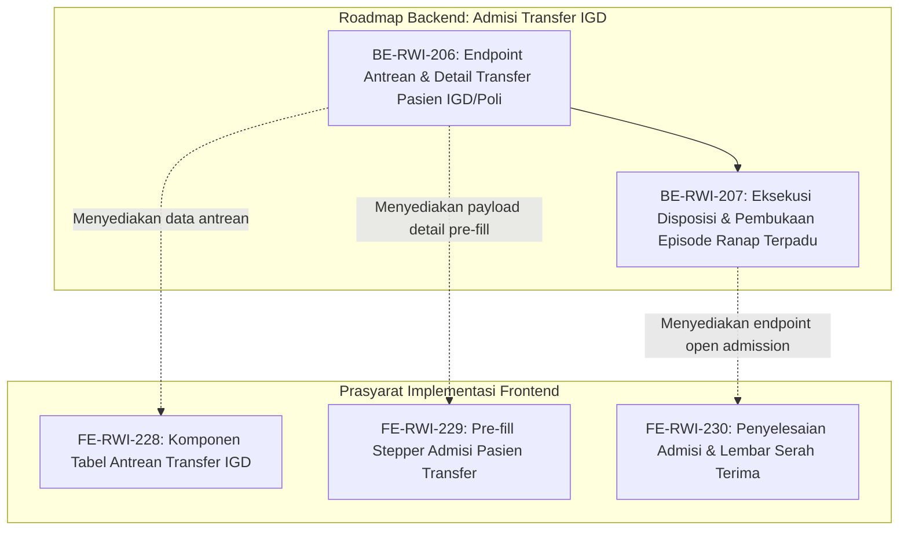

# Roadmap Backend — Episode Rawat Inap, Admisi Transfer Pasien IGD & Rawat Jalan

| Field | Nilai |
|---|---|
| Roadmap | `episode-rawat-inap/roadmap/backend-roadmap-admisi-transfer-igd.md` — revision `1` |
| Blueprint | `RWI-BP-001` revision `11`, sub-modul `episode-rawat-inap`, kontrak **`0.12.0` `approved`** 10 Oktober 2026 atas instruksi perluasan admisi transfer IGD/Rawat Jalan |
| Status roadmap | **`APPROVED`** — disetujui pengguna 10 Oktober 2026 sebagai rencana pengiriman resmi alur admisi transfer pasien IGD dan Poliklinik ke Rawat Inap |
| Ditulis | 10 Oktober 2026 oleh `plan-module-delivery` |
| Masukan dan approval | Analisis Bisnis (Alur 4 Tahap A-B-C-D), integrasi `EmergencyInstallationManagement` (`EmgDisposition` status `Confirmed` / `AdmitToInpatient`), `04-prd-to-mvp.md`, `contracts/api-contract.md` bagian 11.7, `02-backend-architecture.md` |
| Keputusan Bisnis | `RWI-DEC-274` (Antrean Terpadu Transfer Pasien IGD/Rawat Jalan), `RWI-DEC-275` (Eksekusi Otomatis Disposisi IGD & Penautan Episode), `RWI-DEC-276` (Batas Peringatan Overdue Waktu Tunggu Kamar > 60 Menit) |
| Source SHA | Backend `fdf85a07` / branch `MHamzah`; Frontend `dd2cbf7c` / branch `HamzahV2` |
| Deret ID | `BE-RWI-206` s.d. `BE-RWI-207` |
| Roadmap pendamping | `frontend-roadmap-admisi-transfer-igd.md`, `requirement-traceability-admisi-transfer-igd.md` |

---

## 1. Prinsip dan Kebijakan Rekayasa Backend

1. **Integritas Bounded Context & Kunjungan:**  
   Pasien yang dirujuk dari IGD ke rawat inap tetap mempertahankan data historis kunjungan IGD asalnya (`EmgVisit`). Kunjungan rawat inap (`InpatientEpisode`) dibuat dengan menautkan `SourceEncounterId` atau `EmergencyVisitId` tanpa menduplikasi data identitas pasien.
2. **Keterikatan Transaksional (*Atomic State Transition*):**  
   Saat episode rawat inap berhasil diterbitkan untuk pasien transfer IGD, status `EmgDisposition` pada kunjungan IGD harus secara otomatis beralih dari `Confirmed` menjadi `Executed` (`ExecutedAt = DateTime.UtcNow`) dalam transaksi database yang sama. Pasien tidak boleh berstatus "Menunggu Kamar" lagi di IGD setelah admisi selesai.
3. **Pemisahan Wewenang Medis vs Administratif:**  
   Dokter IGD hanya berwenang menetapkan indikasi rawat inap, diagnosa kerja, dan usulan DPJP/tipe ruang. Petugas admisi bersama wali pasien yang berwenang menetapkan kelas perawatan yang dipilih, penjamin biaya (asuransi/BPJS), serta alokasi fisik tempat tidur bangsal.
4. **Endpoint Bergaya Swagger & Validasi:**  
   Seluruh endpoint dilengkapi atribut `[Tags("...")]`, DTO request/response terisolasi, permission check yang tegas, dan penanganan konkurensi (mencegah 2 petugas admisi memproses pasien transfer yang sama secara bersamaan).

---

## 2. Grafik Urutan Dependency



---

## 3. Register Task Backend

| Task ID | Outcome | Requirement / Decision | Kontrak | Reuse | Cakupan | Dependency | Acceptance Criteria | Verifikasi | Risiko / Pemilik | Definition of Done (DoD) |
|---|---|---|---|---|---|---|---|---|---|---|
| [`BE-RWI-206`](../task/report/backend/BE-RWI-206.md) ✅ | Petugas admisi rawat inap dapat membaca daftar antrean pasien transfer dari IGD dan Poliklinik yang membutuhkan kamar, lengkap dengan lama waktu tunggu dan diagnosa awal | `FR-RI-187`, `RWI-DEC-274`, `RWI-DEC-276` | API Contract `0.12.0` (11.7.1 & 11.7.2), Validation Matrix `0.12.0` | `EmgVisit`, `EmgDisposition`, `MstServiceUnit`, `InpAdmissionReferral` | Controller, DTO query & response, Service pembaca disposisi IGD status Confirmed & belum Executed | — | `RWI-AC-396`, `RWI-AC-397` | Unit/Integration test query antrean (pasien IGD status Confirmed muncul; pasien Executed/Cancelled tidak muncul; perhitungan `WaitingMinutes` & `IsOverdue`) | Data relasi null pada dokter perujuk / M. Hamzah | ✅ **Selesai 10 Oktober 2026.** DTO, service, controller antrean transfer IGD aktif; [laporan](../task/report/backend/BE-RWI-206.md) |
| [`BE-RWI-207`](../task/report/backend/BE-RWI-207.md) ✅ | Pembukaan episode rawat inap dari pasien transfer secara atomik menerbitkan `InpatientEpisode` dan mengupdate status `EmgDisposition` IGD menjadi `Executed` | `FR-RI-188`, `RWI-DEC-275` | API Contract `0.12.0` (11.7.3), State Transition `0.12.0` | `InpatientEpisodeService`, `EmergencyDispositionService`, `InpEpisode` | DTO `OpenAdmissionFromTransferRequest`, validasi disposisi belum pernah dieksekusi, transaksi simpan episode + eksekusi disposisi | `BE-RWI-206` | `RWI-AC-398`, `RWI-AC-399` | Transactional rollback test (bila alokasi bed gagal, disposisi IGD tidak boleh berubah; bila sukses, status IGD menjadi Executed dan tanggal eksekusi terisi) | Lock konkurensi pada `EmgDisposition` / Tim Database | ✅ **Selesai 10 Oktober 2026.** Transaksi eksekusi episode + status IGD Executed aktif; [laporan](../task/report/backend/BE-RWI-207.md) |

---

## 4. Rincian Spesifikasi Task Backend

### 4.1 `BE-RWI-206` — Endpoint Antrean & Detail Transfer Pasien IGD / Rawat Jalan

- **Tujuan Bisnis:**  
  Menyajikan antrean digital terpadu di loket pendaftaran rawat inap yang menampilkan pasien-pasien dari IGD yang sudah diputuskan harus rawat inap oleh dokter IGD, sehingga petugas admisi dapat langsung memanggil keluarga/wali pasien tanpa perlu mengetik ulang data dari lembar kertas.
- **Contoh Skenario Rumah Sakit:**  
  1. Dokter IGD mengesahkan disposisi rawat inap untuk Tn. Hendra pada pukul 10.00.
  2. Pada pukul 10.05, petugas admisi membuka layar Quilvian dan melihat Tn. Hendra muncul di antrean teratas dengan badge merah "IGD", lama tunggu "5 menit", DPJP yang dituju "dr. Anton, Sp.PD", dan diagnosa "Demam Berdarah Dengue (DBD)".
  3. Jika pasien sudah menunggu lebih dari 60 menit karena keluarga belum datang ke admisi atau kamar penuh, baris pasien berubah warna menjadi kuning/merah dengan penanda `IsOverdue = true` untuk prioritas tindak lanjut petugas.
- **Spesifikasi Endpoint (Bergaya Swagger):**
  - **Tag:** `[Tags("Health Services / Inpatient Management / Inpatient Admission Transfer")]`
  - **Endpoint 1:** `GET /api/v1/health-services/inpatient-management/admission-transfers`
    - **Method:** `GET`
    - **Auth:** `Bearer JWT` (Hak Akses: `InpatientAdmissionTransfer : Read`)
    - **Query Parameters:**
      - `SourceType` (string opsional: `Emergency`, `Outpatient`, default: null/semua)
      - `Status` (string opsional: `Pending`, `Executed`, default: `Pending`)
      - `OverdueOnly` (bool opsional: `true` / `false`)
      - `Search` (string opsional: Nama, No. RM, atau No. Kunjungan)
      - `PageNumber` (int, default: 1)
      - `PageSize` (int, default: 20)
    - **Response 200 OK:**
      ```json
      {
        "success": true,
        "message": "Daftar antrean transfer rawat inap berhasil diambil.",
        "data": {
          "items": [
            {
              "transferId": "c4b9671d-d4e5-47e9-a359-563d76e73001",
              "sourceType": "Emergency",
              "emergencyVisitId": "7f8b9e11-1234-4567-89ab-cdef01234567",
              "emergencyVisitNumber": "EMG-20261010-0012",
              "patientId": "8b51d7c3-3f19-459f-b7a4-31ea6785dc91",
              "patientName": "Tn. Hendra Wijaya",
              "medicalRecordNumber": "RM-009842",
              "gender": "Male",
              "birthDate": "1981-05-14T00:00:00Z",
              "decidedByDoctorId": "1b9a2345-6789-01bc-def2-34567890abcd",
              "decidedByDoctorName": "dr. Anton, Sp.PD",
              "dispositionReason": "Demam Berdarah Dengue derajat II, trombositopenia 45.000",
              "patientCondition": "Tampak lemah, demam hari ke-4, tanda vital stabil",
              "recommendedServiceUnitId": "3fa85f64-5717-4562-b3fc-2c963f66afa6",
              "recommendedServiceUnitName": "Instalasi Rawat Inap Penyakit Dalam",
              "decidedAt": "2026-10-10T10:00:00Z",
              "waitingMinutes": 15,
              "isOverdue": false
            }
          ],
          "pageNumber": 1,
          "pageSize": 20,
          "totalCount": 1,
          "totalPages": 1
        }
      }
      ```
  - **Endpoint 2:** `GET /api/v1/health-services/inpatient-management/admission-transfers/{transferId}`
    - **Method:** `GET`
    - **Auth:** `Bearer JWT` (Hak Akses: `InpatientAdmissionTransfer : Read`)
    - **Response 200 OK:** Mengembalikan detail satu rujukan transfer untuk pre-fill stepper admisi.

---

### 4.2 `BE-RWI-207` — Eksekusi Disposisi Transfer & Pembukaan Episode Ranap Terpadu

- **Tujuan Bisnis:**  
  Menyelesaikan proses pendaftaran pasien transfer IGD dalam satu transaksi atomik: menerbitkan episode rawat inap resmi, mengalokasikan kamar/bed, menautkan riwayat kunjungan IGD asal, dan memperbarui status disposisi IGD menjadi `Executed` sehingga sistem IGD terinformasi bahwa pasien sudah resmi mendapatkan kamar.
- **Contoh Skenario Rumah Sakit:**  
  1. Petugas admisi memilih kamar Ruang Melati Bed 03 untuk Tn. Hendra dan wali pasien menandatangani persetujuan rawat inap.
  2. Petugas mengklik tombol "Selesaikan Pendaftaran".
  3. Backend memverifikasi bahwa kamar belum terisi dan disposisi IGD Tn. Hendra masih berstatus `Confirmed`.
  4. Backend menerbitkan episode rawat inap baru `RWI-20261010-0045`, mencatat bed terisi, dan mengubah status disposisi IGD menjadi `Executed`.
  5. Jika ada kesalahan sistem saat booking kamar, transaksi dibatalkan sepenuhnya sehingga status IGD tidak berubah menjadi `Executed` secara keliru.
- **Spesifikasi Endpoint (Bergaya Swagger):**
  - **Tag:** `[Tags("Health Services / Inpatient Management / Inpatient Episode")]`
  - **Endpoint:** `POST /api/v1/health-services/inpatient-management/episodes/open-from-transfer`
    - **Method:** `POST`
    - **Auth:** `Bearer JWT` (Hak Akses: `InpatientEpisode : Create`)
    - **Payload Request:**
      ```json
      {
        "transferDispositionId": "c4b9671d-d4e5-47e9-a359-563d76e73001",
        "sourceType": "Emergency",
        "patientId": "8b51d7c3-3f19-459f-b7a4-31ea6785dc91",
        "serviceUnitId": "3fa85f64-5717-4562-b3fc-2c963f66afa6",
        "patientClassId": "5da91c78-1234-4567-89ab-cdef01234567",
        "doctorId": "1b9a2345-6789-01bc-def2-34567890abcd",
        "bedId": "9e2c3456-7890-12ab-cdef-45678901bcde",
        "paymentScheme": "BPJS",
        "depositAmount": 0,
        "notes": "Transfer dari IGD, indikasi DBD trombositopenia"
      }
      ```
    - **Validasi:**
      - `transferDispositionId` wajib valid, belum dihapus, dan berstatus `Confirmed`.
      - Pasien belum memiliki episode rawat inap aktif yang masih `Open` / `Draft`.
      - `bedId` wajib berstatus `Available` atau `CleaningCompleted`.
    - **Response 201 Created:**
      ```json
      {
        "success": true,
        "message": "Episode rawat inap dari transfer IGD berhasil diterbitkan.",
        "data": {
          "episodeId": "f12a3456-7890-bcde-f123-456789abcdef",
          "episodeNumber": "RWI-20261010-0045",
          "patientId": "8b51d7c3-3f19-459f-b7a4-31ea6785dc91",
          "bedNumber": "Melati-03",
          "transferStatus": "Executed",
          "executedAt": "2026-10-10T10:35:00Z"
        }
      }
      ```
    - **Response 409 Conflict:**
      ```json
      {
        "success": false,
        "message": "Pasien transfer ini sudah selesai diproses admisi atau dibatalkan oleh IGD.",
        "errorCode": "INP_TRANSFER_ALREADY_EXECUTED"
      }
      ```
