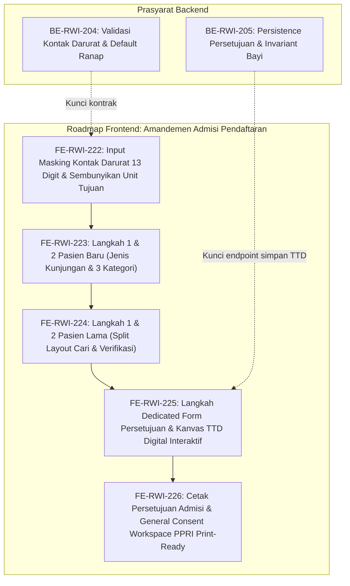

# Roadmap Frontend — Episode Rawat Inap, Amandemen Admisi Pendaftaran

| Field | Nilai |
|---|---|
| Roadmap | `episode-rawat-inap/roadmap/frontend-roadmap-admisi-pendaftaran.md` — revision `1` |
| Blueprint | `RWI-BP-001` revision `10`, sub-modul `episode-rawat-inap`, kontrak **`0.11.0` `approved`** 2026-10-10 atas instruksi pengguna "setujui dan lakukan /plan-module-delivery" |
| Status roadmap | **`APPROVED`** — disetujui pengguna 10 Oktober 2026 sebagai turunan rencana delivery resmi atas amandemen alur admisi pendaftaran revisi Tim Analisis Bisnis (Mba Ilma) |
| Ditulis | 10 Oktober 2026 oleh `plan-module-delivery` |
| Masukan dan approval | `03-frontend-architecture.md` revision `0.11`, `05-skema-tampilan.md` revision `0.7` (bagian 3.0 s.d. 3.16), `04-prd-to-mvp.md` bagian 25, `contracts/validation-matrix.md` bagian 16 (`VAL-ADM-01` s.d. `05`), `00-interview-decisions.md` revision `40` (`RWI-DEC-267` s.d. `273`, `RWI-AC-388` s.d. `395`) |
| Keputusan | `RWI-DEC-267` (No HP Kontak Darurat max 13 digit), `RWI-DEC-268` (Default Ranap Service Unit), `RWI-DEC-269` (Rujukan Teks Ringkas), `RWI-DEC-270` (3 Kategori Pasien), `RWI-DEC-271` (Split Screen Pasien Lama), `RWI-DEC-272` (Dedicated Step Persetujuan & TTD Digital), `RWI-DEC-273` (Invariant Penanda Tangan Bayi) |
| Source SHA | Frontend `dd2cbf7c` / branch `HamzahV2`; Backend `fdf85a07` / branch `MHamzah` |
| Deret ID | `FE-RWI-222` s.d. `FE-RWI-226` |
| Roadmap pendamping | `backend-roadmap-admisi-pendaftaran.md`, `requirement-traceability-admisi-pendaftaran.md` |

---

## 1. Prinsip dan Kebijakan Rekayasa Frontend

1. **Kepatuhan Kebijakan Pengujian.** Mengikuti `rules/frontend/test-policy.md`: bukti utama verifikasi frontend meliputi pengujian fungsional kontrol interaktif, pencegahan regresi lint (`npm run lint`), build produksi Next.js App Router (`npm run build`), serta pengujian unit untuk logika alur (stepper step matching, masking input 13 digit, invariant penanda tangan).
2. **Kewenangan UI Mengikat:**
   - **Alur Pasien Baru 12 Langkah:** (1) Jenis Kunjungan (Umum/Rujukan), (2) Kategori Pasien (3 opsi), (3) Pendaftaran (Kontak Darurat max 13 digit), (4) Pembayaran, (5) Deposit, (6) Dokter & Isolasi (Unit Tujuan disembunyikan), (7) Pilih Tempat Tidur, (8) Booking Tempat Tidur, (9) Konfirmasi, (10) Form Persetujuan & TTD Digital, (11) Cetak Persetujuan, (12) Cetak Kartu Pasien Baru.
   - **Alur Pasien Lama 10 Langkah:** (1) Split Layout Pencarian & Verifikasi Pasien, (2) Jenis Kunjungan & Kategori, (3) Pembayaran, (4) Deposit, (5) Dokter & Isolasi, (6) Pilih Tempat Tidur, (7) Booking Tempat Tidur, (8) Konfirmasi, (9) Form Persetujuan & TTD Digital, (10) Cetak Persetujuan.
   - **Kanvas TTD Digital:** Memanfaatkan library komponen kanvas tanda tangan interaktif (`react-signature-canvas`) dengan fungsi bersihkan, kunci tanda tangan, dan ekspor Base64 PNG.
   - **Invariant Hukum Bayi Baru Lahir:** Pilihan penanda tangan pada kategori Bayi Baru Lahir secara mutlak mengunci opsi "Orang Tua / Wali" dan menonaktifkan (*disabled*) pilihan "Pasien Sendiri".
   - **Workspace PPRI:** Tab General Consent berstatus *read-only / print-ready* mengambil formulir dan tanda tangan digital yang sudah disimpan pada admisi tanpa membuka form pengisian baru.
3. **Pemberian Wewenang Eksekusi:** Setiap task dikerjakan oleh skill `build-module-frontend` (**tepat 1 task approved per eksekusi**). Prasyarat backend `[BE]` wajib berstatus selesai sebelum task frontend yang bergantung padanya dimulai.

---

## 2. Grafik Urutan Dependency

---

## 3. Register Task Frontend

| Task ID | Outcome | Requirement / Decision | Kontrak | Reuse | Cakupan | Dependency | Acceptance Criteria | Verifikasi | Risiko / Pemilik | Definition of Done (DoD) |
|---|---|---|---|---|---|---|---|---|---|---|
| [`FE-RWI-222`](../task/report/frontend/FE-RWI-222.md) ✅ | Input No HP kontak darurat membatasi maks 13 karakter numerik dan langkah Dokter tidak menampilkan dropdown unit tujuan serta otomatis mengirim ServiceUnit ranap | `FR-RI-179`, `FR-RI-183`, `RWI-DEC-267`, `RWI-DEC-268` | `05-skema-tampilan.md` 3.2A, 3.2F, Validation Matrix `0.11.0` (`VAL-ADM-01`, `VAL-ADM-02`) | `inpatient-admission-registration-step.jsx`, `inpatient-admission-doctor-step.jsx` | Masking input numerik `maxLength={13}`, helper text peringatan, penghapusan elemen `<select>` unit tujuan pada tampilan langkah Dokter | `BE-RWI-204` [BE] | `RWI-AC-388`, `RWI-AC-389` | Uji ketik form kontak darurat (huruf dicegah, >13 digit dicegah); inspeksi DOM langkah dokter memastikan dropdown unit tujuan tidak dirender dan payload memuat default ranap | Kebiasaan petugas memilih unit / Mba Ilma | ✅ **Selesai 10 Oktober 2026.** Seluruh AC terbukti; input kontak darurat terkunci maks 13 digit numerik; dropdown unit disembunyikan; [laporan](../task/report/frontend/FE-RWI-222.md) |
| [`FE-RWI-223`](../task/report/frontend/FE-RWI-223.md) ✅ | Langkah 1 Pasien Baru menampilkan opsi Umum & Rujukan teks ringkas tanpa upload fisik, dan Langkah 2 menyaring kategori pasien menjadi tepat 3 opsi | `FR-RI-180`, `FR-RI-181`, `RWI-DEC-269`, `RWI-DEC-270` | `05-skema-tampilan.md` 3.2A, 3.2B, Validation Matrix `0.11.0` (`VAL-ADM-03`) | Stepper `inpatient-admission-flow-constants.jsx`, `inpatient-admission-view.jsx` | Komponen Jenis Kunjungan baru, form 5 atribut rujukan teks, pembaruan urutan 12 langkah PB, filter 3 kartu kategori (Umum, Bayi, Pegawai) | `FE-RWI-222` | `RWI-AC-390`, `RWI-AC-391` | Uji klik Umum (langsung lanjut ke langkah 2); uji klik Rujukan (form 5 atribut tampil dan divalidasi); uji tampilan 3 kartu kategori pasien | Format data rujukan teks / Mba Ilma | ✅ **Selesai 10 Oktober 2026.** Seluruh AC terbukti; stepper 12 langkah PB aktif; form 5 atribut rujukan teks tervalidasi; filter 3 kategori selesai; [laporan](../task/report/frontend/FE-RWI-223.md) |
| [`FE-RWI-224`](../task/report/frontend/FE-RWI-224.md) ✅ | Langkah 1 Pasien Lama menggabungkan form pencarian dan verifikasi data identitas ke dalam 1 tampilan split screen, dan Langkah 2 menentukan jenis kunjungan serta kategori | `FR-RI-182`, `RWI-DEC-271` | `05-skema-tampilan.md` 3.2E, `03-frontend-architecture.md` 2A & 3A | `inpatient-admission-existing-patient-step.jsx`, stepper 10 langkah PL | Refactoring form pencarian (kanan) & kartu identitas (kiri) dalam 1 layar, tombol Ganti Pasien, penyesuaian stepper 10 langkah PL | `FE-RWI-223` | `RWI-AC-392` | Uji pencarian No RM/NIK (hasil langsung muncul di panel kiri tanpa pindah langkah); tombol Ganti Pasien mereset pencarian; tombol Lanjut mengarah ke Langkah 2 | Tata letak pada layar tablet / Tim UX | ✅ **Selesai 10 Oktober 2026.** Seluruh AC terbukti; alur 10 langkah PL terverifikasi; split screen responsif; [laporan](../task/report/frontend/FE-RWI-224.md) |
| [`FE-RWI-225`](../task/report/frontend/FE-RWI-225.md) ✅ | Langkah Mandiri Form Persetujuan Rawat Inap & kanvas Tanda Tangan Digital interaktif dengan tombol bersihkan, kunci TTD, serta penegakan invariant penguncian wali untuk bayi baru lahir | `FR-RI-184`, `FR-RI-185`, `RWI-DEC-272`, `RWI-DEC-273` | `05-skema-tampilan.md` 3.2C, 3.2D, Validation Matrix `0.11.0` (`VAL-ADM-04`, `VAL-ADM-05`) | `react-signature-canvas`, `InpatientConsentForm`, base features Quilvian | Komponen `InpatientAdmissionConsentFormStep.jsx`, integrasi kanvas TTD, tombol Clear & Kunci, radio penanda tangan, penonaktifan radio Diri Sendiri untuk bayi | `FE-RWI-224`, `BE-RWI-205` [BE] | `RWI-AC-393`, `RWI-AC-394` | Uji gambar TTD pada kanvas via mouse/touch; uji tombol Bersihkan; uji tombol Kunci; uji kategori Bayi Baru Lahir (opsi Pasien Sendiri otomatis disabled dan terkunci ke Wali) | Responsivitas kanvas di tablet sentuh / Tim FE | ✅ **Selesai 10 Oktober 2026.** Seluruh AC terbukti; payload consent & citra base64 terkirim sukses ke backend `BE-RWI-205`; tombol lanjut aktif setelah TTD terkunci; unit test lulus; [laporan](../task/report/frontend/FE-RWI-225.md) |
| [`FE-RWI-226`](../task/report/frontend/FE-RWI-226.md) ✅ | Integrasi citra TTD digital pada lembar cetak persetujuan admisi dan penyelarasan tab General Consent Workspace PPRI menjadi read-only / print-ready tanpa form re-input | `FR-RI-186`, `RWI-DEC-272` | `05-skema-tampilan.md` 3.2C, `03-frontend-architecture.md` 2A & 14.4.3, Flowchart Bagian 3 | `inpatient-consent-form.jsx`, `inpatient-admission-print-steps.jsx`, tab General Consent PPRI | Render citra base64 di atas kurung nama penanda tangan pada `inpatient-consent-form.jsx`, penyesuaian tab General Consent PPRI membaca data consent admisi yang tersimpan | `FE-RWI-225` | `RWI-AC-395` | Pratinjau cetak admisi memuat TTD digital; buka Workspace PPRI episode terkait verifikasi tab General Consent langsung menampilkan dokumen ber-TTD siap cetak tanpa form isian | Kompatibilitas CSS cetak `@media print` / Tim Admisi & PPRI | ✅ **Selesai 10 Oktober 2026.** Seluruh AC terbukti; dokumen persetujuan tercetak memuat tanda tangan digital; tidak ada form isian ganda di PPRI; unit test lulus; [laporan](../task/report/frontend/FE-RWI-226.md) |

---

## 4. Rincian Spesifikasi Task Frontend

### 4.1 `FE-RWI-222` — Validasi Kontak Darurat 13 Digit & Penyembunyian Unit Tujuan
- **Komponen Target:** `inpatient-admission-registration-step.jsx` dan `inpatient-admission-doctor-step.jsx`.
- **Perubahan Fungsional:**
  1. Pada formulir kontak darurat keluarga pasien, tambahkan handler `onChange` yang memfilter karakter non-numerik (`value.replace(/\D/g, '')`) dan batasi panjang input dengan atribut `maxLength={13}`.
  2. Tambahkan pesan bantuan (*helper text*) di bawah input: `"Maksimal 13 digit angka (contoh: 081234567890)"`.
  3. Pada langkah Dokter, hapus elemen rendering dropdown Unit Layanan Rawat Inap (`<ResourceFilterSelect>` atau `<select>` untuk unit). State form otomatis mengikat `serviceUnitId` default Instalasi Rawat Inap, sehingga petugas admisi tidak perlu dan tidak dapat memilih unit layanan secara manual.

---

### 4.2 `FE-RWI-223` — Langkah 1 & 2 Pasien Baru: Jenis Kunjungan & Kategori Pasien
- **Komponen Target:** `inpatient-admission-flow-constants.jsx`, `inpatient-admission-view.jsx`, dan komponen baru `inpatient-admission-visit-type-step.jsx`.
- **Perubahan Fungsional:**
  1. Perbarui definisi stepper Pasien Baru menjadi 12 langkah:
     - Langkah 1: `visit-type` ("Jenis Kunjungan")
     - Langkah 2: `patient-type` ("Kategori Pasien")
     - Langkah 3 s.d. 12: Langkah pendaftaran, pembayaran, deposit, dokter, tempat tidur, konfirmasi, formulir persetujuan, cetak persetujuan, dan kartu pasien.
  2. Implementasikan layar Langkah 1: Dua kartu radio interaktif:
     - **Kunjungan Umum:** Menampilkan ikon kedatangan mandiri dan deskripsi singkat. Memilih opsi ini mengaktifkan tombol `"Lanjut ke Kategori Pasien"`.
     - **Kunjungan Rujukan:** Memilih opsi ini membuka panel form input teks ringkas berisi 5 field:
       - Nomor Rujukan (Teks, wajib)
       - Tanggal & Waktu Rujukan (Date & Time Picker, wajib)
       - Faskes Perujuk (Teks, wajib)
       - Dokter Perujuk Luar (Teks, opsional)
       - Diagnosa Rujukan (Teks/Textarea, wajib)
       - *Catatan:* Tidak ada tombol/field upload berkas fisik.
  3. Implementasikan layar Langkah 2: Saring daftar pilihan kategori pasien menjadi tepat 3 opsi:
     - `Umum` (Pasien Umum/Pribadi)
     - `Bayi Baru Lahir` (Neonatus — memunculkan seleksi episode ibu)
     - `Pegawai` (Karyawan/Pegawai RS)

---

### 4.3 `FE-RWI-224` — Langkah 1 & 2 Pasien Lama: Split Layout Terpadu
- **Komponen Target:** `inpatient-admission-existing-patient-step.jsx`, `inpatient-admission-flow-constants.jsx`.
- **Perubahan Fungsional:**
  1. Perbarui definisi stepper Pasien Lama menjadi 10 langkah:
     - Langkah 1: `existing-patient-split` ("Pencarian & Verifikasi Pasien")
     - Langkah 2: `visit-category` ("Jenis Kunjungan & Kategori")
     - Langkah 3 s.d. 10: Pembayaran, deposit, dokter, tempat tidur, konfirmasi, formulir persetujuan, dan cetak persetujuan.
  2. Rancang antarmuka Langkah 1 dalam 2 kolom (*split screen layout*):
     - **Kolom Kanan:** Input pencarian Nomor Rekam Medis (No. RM) atau NIK, tombol `"Cari Pasien"`, dan indikator loading.
     - **Kolom Kiri:** Kartu ringkasan identitas pasien yang ditemukan (No. RM, NIK, Nama Lengkap, Jenis Kelamin, Tanggal Lahir, Alamat, Status Kepesertaan Asuransi).
     - Jika pasien belum dicari/ditemukan, kolom kiri menampilkan ilustrasi kosong (*empty state*): `"Masukkan No. RM atau NIK di kolom kanan untuk memverifikasi data pasien"`.
     - Jika data sudah terverifikasi, tampil tombol `"Ganti Pasien"` (mereset pencarian) dan tombol `"Lanjut ke Jenis Kunjungan"`.
  3. Implementasikan layar Langkah 2: Menyajikan pilihan Jenis Kunjungan (Umum / Rujukan Teks) dan Kategori Pasien Lama dalam 1 tampilan terintegrasi.

---

### 4.4 `FE-RWI-225` — Langkah Dedicated Form Persetujuan & Kanvas TTD Digital
- **Komponen Target:** Komponen baru `inpatient-admission-consent-form-step.jsx`, terpasang pada Langkah 10 PB dan Langkah 9 PL.
- **Pustaka Pendukung:** `react-signature-canvas`.
- **Perubahan Fungsional:**
  1. Tampilkan 12 butir klausul persetujuan umum rawat inap (*General Consent*) dengan checkbox persetujuan tercentang default.
  2. Blok Pilihan Penanda Tangan:
     - Opsi Radio: `Pasien Sendiri`, `Orang Tua / Wali`, `Suami / Istri`, `Keluarga Lainnya`.
     - Isian: Nama Penanda Tangan, NIK, Hubungan, Nomor Telepon.
  3. **Penegakan Invariant Bayi Baru Lahir (`INV-ADM-01`):**
     - Jika pasien berkategori `Bayi Baru Lahir`, radio `Pasien Sendiri` otomatis dinonaktifkan (`disabled = true`).
     - Radio default terpilih adalah `Orang Tua / Wali`.
     - Muncul banner pemberitahuan hukum medis: `"Pasien merupakan Bayi Baru Lahir. Penandatanganan wajib dilakukan oleh Orang Tua atau Wali yang sah."`
  4. Kanvas Tanda Tangan Digital:
     - Area kanvas dengan garis batas jelas, latar belakang putih bersih, dan placeholder `"Bubuhkan tanda tangan pasien / wali di dalam kotak ini"`.
     - Tombol `"Bersihkan Tanda Tangan"`: Mereset kanvas.
     - Tombol `"Kunci Tanda Tangan"`: Mengunci kanvas agar tidak sengaja tercoret kembali dan mengonversi citra kanvas ke Data URL PNG Base64.
  5. Pengiriman Data: Tombol `"Simpan & Lanjut ke Cetak"` memanggil `POST /api/v1/inpatient-admissions/{episodeId}/consent` (`BE-RWI-205`). Setelah sukses, alur berlanjut ke langkah pratinjau cetak.

---

### 4.5 `FE-RWI-226` — Penyelarasan Cetak Persetujuan & Workspace PPRI (Print-Ready)
- **Komponen Target:** `inpatient-consent-form.jsx`, `InpatientAdmissionConsentStep`, dan tab General Consent Workspace PPRI (`admission-workspace/sections/documents/`).
- **Perubahan Fungsional:**
  1. Perbarui `inpatient-consent-form.jsx` pada bagian footer tanda tangan:
     - Jika data tanda tangan digital (`signatureImageBase64`) dan nama penanda tangan tersedia, render citra tanda tangan (``) di atas kurung nama penanda tangan.
     - Render nama terang penanda tangan di dalam kurung: `( ${signerName} )`.
     - Sertakan label hubungan penanda tangan dan tanggal/waktu penandatanganan digital.
  2. Pada Langkah Cetak Admisi (Langkah 11 PB / 10 PL): Lembar persetujuan otomatis menampilkan tanda tangan digital yang baru saja dibuat pada Langkah 10/9 dan siap langsung dicetak lewat dialog print peramban.
  3. Pada Workspace PPRI:
     - Menu/Tab General Consent untuk episode yang telah disetujui memanggil `GET /api/v1/inpatient-admissions/{episodeId}/consent` (`BE-RWI-205`).
     - Tampilan berstatus **murni siap cetak (*read-only / print-ready*)**: Menampilkan dokumen terisi lengkap beserta tanda tangan digital pasien/wali yang dibuat saat admisi.
     - Tidak ada form input aktif, tidak ada tombol simpan ganda, dan tidak ada kanvas tanda tangan ulang yang membingungkan petugas PPRI (`RWI-AC-395`).
