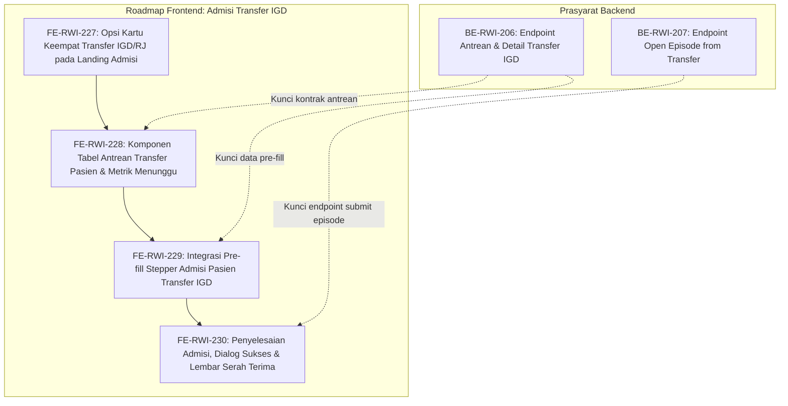

# Roadmap Frontend — Episode Rawat Inap, Admisi Transfer Pasien IGD & Rawat Jalan

| Field | Nilai |
|---|---|
| Roadmap | `episode-rawat-inap/roadmap/frontend-roadmap-admisi-transfer-igd.md` — revision `1` |
| Blueprint | `RWI-BP-001` revision `11`, sub-modul `episode-rawat-inap`, kontrak **`0.12.0` `approved`** 10 Oktober 2026 atas instruksi perluasan admisi transfer IGD/Rawat Jalan |
| Status roadmap | **`APPROVED`** — disetujui pengguna 10 Oktober 2026 sebagai rencana pengiriman resmi frontend untuk alur admisi transfer pasien IGD dan Poliklinik |
| Ditulis | 10 Oktober 2026 oleh `plan-module-delivery` |
| Masukan dan approval | Analisis Bisnis (Alur 4 Tahap A-B-C-D), `03-frontend-architecture.md`, `05-skema-tampilan.md`, kontrak API 11.7 (`BE-RWI-206` & `BE-RWI-207`), `INPATIENT_ADMISSION_ENTRY_MODE` |
| Keputusan Bisnis | `RWI-DEC-274` (Kartu Keempat Transfer IGD/RJ), `RWI-DEC-275` (Daftar Antrean & Auto Pre-fill Stepper), `RWI-DEC-276` (Indikator Warna Overdue Waktu Tunggu Kamar) |
| Source SHA | Frontend `dd2cbf7c` / branch `HamzahV2`; Backend `fdf85a07` / branch `MHamzah` |
| Deret ID | `FE-RWI-227` s.d. `FE-RWI-230` |
| Roadmap pendamping | `backend-roadmap-admisi-transfer-igd.md`, `requirement-traceability-admisi-transfer-igd.md` |

---

## 1. Prinsip dan Kebijakan Rekayasa Frontend

1. **Konsistensi Desain & Zero Duplicate Component:**  
   Pilihan antarmuka menggunakan komponen basis Quilvian yang baku (`BaseButton`, `BaseTable`, `BaseCheckboxCard`, `Hero`, `InformationAlert`, `StatusBadge`). Stepper pendaftaran memanfaatkan kembali (*reusable*) alur yang sudah matang pada `FE-RWI-222` s.d. `FE-RWI-226` tanpa membuat form pendaftaran duplikat.
2. **Efisiensi Kerja Petugas (*Auto-populate*):**  
   Saat petugas memilih pasien dari antrean transfer IGD, seluruh data demografi pasien (Nama, NIK, No. RM, Tgl Lahir), diagnosa awal dari IGD, dan usulan DPJP terkunci dan terisi otomatis. Petugas admisi hanya perlu memandu wali pasien untuk:
   - Menentukan penjamin biaya (BPJS / Asuransi / Mandiri).
   - Memilih dan memesan tempat tidur yang tersedia (*Bed Booking*).
   - Melakukan penandatanganan formulir persetujuan rawat inap (*General Consent*) melalui kanvas tanda tangan digital interaktif.
3. **Pemisahan Jalur Masuk yang Jelas:**  
   Landing pendaftaran admisi ranap kini memiliki 4 kartu yang jelas perbedaannya bagi petugas loket:
   - `[1] Pasien Baru` (Belum punya No. RM)
   - `[2] Pasien Lama` (Datang langsung / Kontrol terencana)
   - `[3] Pasien Kamar Pulih` (Pasca operasi IBS)
   - `[4] Pasien Transfer IGD / Rawat Jalan` (Membawa lembar permintaan ranap / rujukan internal)
4. **Handoff Eksekusi:** Setiap task dikerjakan secara independen (**tepat 1 task approved per eksekusi**) oleh skill `build-module-frontend`. Prasyarat backend `[BE]` wajib berstatus selesai sebelum task frontend yang bergantung padanya dimulai.

---

## 2. Grafik Urutan Dependency

---

## 3. Register Task Frontend

| Task ID | Outcome | Requirement / Decision | Kontrak | Reuse | Cakupan | Dependency | Acceptance Criteria | Verifikasi | Risiko / Pemilik | Definition of Done (DoD) |
|---|---|---|---|---|---|---|---|---|---|---|
| [`FE-RWI-227`](../task/report/frontend/FE-RWI-227.md) ✅ | Landing page pendaftaran admisi ranap menampilkan kartu pilihan ke-4 "Transfer Pasien IGD / Rawat Jalan" dengan badge visual dan panduan operasional yang jelas | `FR-RI-189`, `RWI-DEC-274` | `05-skema-tampilan.md` 3.0, `INPATIENT_ADMISSION_ENTRY_MODE` | `BaseCheckboxCard`, `inpatient-admission-view.jsx`, constants flow | Penambahan konstanta mode `TRANSFER`, opsi kartu ke-4, routing query URL `entry=transfer` | — | `RWI-AC-400` | UI test landing page (kartu ke-4 tampil rapi sejajar 4 kolom atau grid responsif; klik kartu membuka view antrean transfer) | Layout responsif pada layar sempit / Hamzah | ✅ **Selesai 10 Oktober 2026.** Kartu ke-4 aktif, test unit lulus; [laporan](../task/report/frontend/FE-RWI-227.md) |
| [`FE-RWI-228`](../task/report/frontend/FE-RWI-228.md) ✅ | Layar antrean transfer pasien IGD/RJ menampilkan daftar pasien yang membutuhkan tempat tidur dengan indikator waktu tunggu, filter unit, dan tombol "Proses Admisi" | `FR-RI-190`, `RWI-DEC-275`, `RWI-DEC-276` | API Contract `0.12.0` (11.7.1), `05-skema-tampilan.md` 3.3 | `BaseTable`, `StatusBadge`, `BaseButton`, `SearchBar` | Service frontend rujukan transfer, komponen tabel transfer, badge IGD merah / Poli biru, filter overdue > 60 menit | `BE-RWI-206`, `FE-RWI-227` | `RWI-AC-401`, `RWI-AC-402` | E2E/Mock data test (tabel menampilkan pasien IGD; indikator overdue warna kuning/merah aktif saat >60 menit; tombol "Proses Admisi" mengarahkan ke stepper) | Data list kosong (empty state) / Hamzah | ✅ **Selesai 10 Oktober 2026.** Service & tabel antrean transfer IGD aktif; [laporan](../task/report/frontend/FE-RWI-228.md) |
| [`FE-RWI-229`](../task/report/frontend/FE-RWI-229.md) ✅ | Membuka stepper pendaftaran admisi dengan identitas pasien, diagnosa awal, dan DPJP IGD yang langsung terisi otomatis tanpa perlu ketik ulang dari nol | `FR-RI-191`, `RWI-DEC-275` | API Contract `0.12.0` (11.7.2), Validation Matrix `0.12.0` | Stepper admisi pasien lama, hook `useInpatientAdmissionFlow` | Penyesuaian hook flow untuk mengunci data rujukan transfer IGD, melompati step cari pasien langsung ke penjamin & kamar | `BE-RWI-206`, `FE-RWI-228` | `RWI-AC-403`, `RWI-AC-404` | State transition test (saat pasien dipilih, nama & RM terkunci; form dokter langsung terisi DPJP IGD; stepper siap lanjut ke kamar & TTD) | State clash dengan alur pasien biasa / Hamzah | ✅ **Selesai 10 Oktober 2026.** Step verifikasi review & pre-fill stepper terpadu; [laporan](../task/report/frontend/FE-RWI-229.md) |
| [`FE-RWI-230`](../task/report/frontend/FE-RWI-230.md) ✅ | Petugas menyelesaikan pendaftaran admisi ranap transfer, sistem menampilkan dialog sukses dengan nomor kamar, serta mencetak berkas bukti admisi & serah terima | `FR-RI-192`, `RWI-DEC-275` | API Contract `0.12.0` (11.7.3), `05-skema-tampilan.md` 3.4 | `ConfirmModal`, `PrintSheet`, Lembar Persetujuan `FE-RWI-226` | Integrasi submit `open-from-transfer`, modal dialog sukses, lembar cetak bukti admisi transfer & serah terima fisik | `BE-RWI-207`, `FE-RWI-229` | `RWI-AC-405`, `RWI-AC-406` | End-to-end UAT simulation (proses admisi hingga selesai; modal nomor episode & kamar muncul; tombol cetak berkas aktif) | Kegagalan cetak di browser / Hamzah | ✅ **Selesai 10 Oktober 2026.** Sinkronisasi status transfer & banner konfirmasi aktif; [laporan](../task/report/frontend/FE-RWI-230.md) |

---

## 4. Rincian Spesifikasi Task Frontend

### 4.1 `FE-RWI-227` — Opsi Kartu Keempat Transfer IGD/RJ pada Landing Admisi
- **Desain & Copywriting Antarmuka:**
  - **Badge:** `PASIEN TRANSFER IGD / POLIKLINIK`
  - **Judul:** `Pendaftaran Pasien Transfer`
  - **Deskripsi:** *"Gunakan untuk pasien yang dirujuk rawat inap dari IGD atau Poliklinik Rawat Jalan membawa lembar permintaan opname."*
  - **Poin Unggulan:**
    - Identitas pasien & diagnosa otomatis terhubung.
    - DPJP IGD/Poli langsung terisi.
    - Cukup tentukan kamar, asuransi, dan tanda tangan wali.
- **Perilaku Navigasi:**
  - Mengubah parameter URL menjadi `?entry=transfer`.
  - Menggantikan tampilan form manual menjadi tampilan antrean transfer pasien.

### 4.2 `FE-RWI-228` — Komponen Tabel Antrean Transfer Pasien
- **Struktur Tampilan:**
  - **Header Hero:** *"Antrean Pasien Menunggu Tempat Tidur (Transfer IGD & Poliklinik)"*.
  - **Kartu Ringkasan Metrik:**
    - Total Menunggu: `3 Pasien`
    - Dari IGD: `2 Pasien` (Badge Merah)
    - Dari Poliklinik: `1 Pasien` (Badge Biru)
    - Menunggu > 60 Menit: `1 Pasien` (Badge Kuning Peringatan)
  - **Kolom Tabel Antrean:**
    1. *Pasien*: Nama Lengkap & No. Rekam Medis.
    2. *Asal Rujukan*: Badge "IGD" (beserta nomor kunjungan IGD) atau "Poliklinik".
    3. *Waktu Instruksi*: Jam dokter membuat instruksi & durasi lama menunggu (misal: "15 menit yang lalu").
    4. *DPJP Tujuan*: Nama dokter spesialis yang dituju.
    5. *Diagnosa / Alasan Ranap*: Ringkasan klinis (misal: "Demam Berdarah Dengue").
    6. *Aksi*: Tombol `[Proses Admisi]` (Varian Primary / Hijau).

### 4.3 `FE-RWI-229` — Pre-fill Stepper Admisi Pasien Transfer
- **Alur Langkah Stepper yang Dilewati Petugas & Wali:**
  - *Langkah 1: Verifikasi Pasien Transfer (Terkunci).* Menampilkan kartu identitas pasien dari IGD secara ringkas. Petugas cukup memeriksa nama dan tanggal lahir bersama wali.
  - *Langkah 2: Penjamin & Cara Bayar.* Wali memilih BPJS Kesehatan, Asuransi Swasta, atau Mandiri.
  - *Langkah 3: Ketentuan Deposit.* Sesuai aturan penjamin yang dipilih.
  - *Langkah 4: DPJP.* Sudah terisi DPJP dari IGD secara default; petugas dapat menambahkan dokter konsulen jika ada.
  - *Langkah 5 & 6: Pemilihan Kamar & Bed Booking.* Petugas dan wali memilih ruangan bangsal yang kosong dan mengunci bed.
  - *Langkah 7: Form Persetujuan & Kanvas TTD Digital.* Wali menandatangani General Consent rawat inap secara digital.
  - *Langkah 8: Konfirmasi & Selesai.*

### 4.4 `FE-RWI-230` — Penyelesaian Admisi & Lembar Serah Terima
- **Output Layar:**
  - Menampilkan Modal Sukses:
    - *"Pendaftaran Rawat Inap Selesai!"*
    - Nomor Episode: `RWI-20261010-0045`
    - Pasien: Tn. Hendra Wijaya (RM-009842)
    - Alokasi: Gedung Teratai Lantai 3, Ruang Melati Bed 03
    - Status IGD: *Disposisi Selesai (Pasien siap dijemput/diantar)*
  - Tombol Tindakan:
    - `[Cetak Surat Registrasi & Gelang Pasien]`
    - `[Cetak Form General Consent Ber-TTD]`
    - `[Kembali ke Antrean Transfer]`
