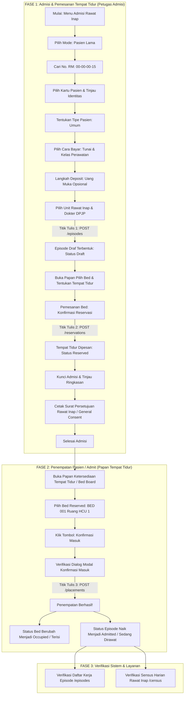

# LAPORAN PENGUJIAN ADMISI DAN PENEMPATAN TEMPAT TIDUR EPISODE RAWAT INAP
## Modul: Episode Rawat Inap (*Inpatient Episode Management*) — Fase 1 & Fase 2

---

## 1. Ringkasan Eksekutif (*Executive Summary*)

Pengujian komprehensif ini dilakukan untuk memverifikasi alur kerja admisi rawat inap (Fase 1) dan penempatan tempat tidur (Fase 2) pada sistem **Quilvian Hospital Management System** sesuai dokumen blueprint *Inpatient Episode Management* (`docs/module-blueprints/rawat-inap/episode-rawat-inap`).

Pengujian dijalankan secara otomatis (*end-to-end*) menggunakan Playwright dengan kredensial **Super Admin**, mencakup seluruh tahapan dari pencarian data pasien terdaftar hingga pasien resmi berstatus dirawat (*Admitted*) dan tercatat pada Sensus Harian Rawat Inap.

### Hasil Utama Pengujian:
- **Status Akhir Pengujian**: ✅ **100% SUKSES (PASSED)**
- **Pasien Uji**: `IKBAL YULIYANTO` (No. Rekam Medis: `00-00-00-15`, ID: `6c84fab5-c1d0-4714-a126-45aee8351369`)
- **Nomor Kunjungan Terbentuk**: `ENC-RSMMC-00184`
- **Nomor Episode Terbentuk**: `RI-260923024940-3912D2` (ID: `9e4fe119-e908-4835-917c-d854437f19af`)
- **DPJP Terpilih**: `dr. Arif Lesmana`
- **Unit Layanan & Kelas**: Unit `Rawat Inap`, Kelas `UNIQUE`
- **Tempat Tidur Ditempati**: `BED 001` — Ruang HCU 1 (Kode Bed: `BD-RSMMC-00017`)
- **Transisi Status Episode**: `Draft` (Admisi sedang disiapkan) $\rightarrow$ `Admitted` (Sedang Dirawat)
- **Transisi Status Tempat Tidur**: `Available` (Tersedia) $\rightarrow$ `Reserved` (Dipesan) $\rightarrow$ `Occupied` (Terisi)

---

## 2. Alur Proses Bisnis (*Business Workflow*)

Alur kerja admisi dan penempatan pasien rawat inap terbagi menjadi 2 fase operasional utama:



---

## 3. Spesifikasi Teknis Endpoint API (Bergaya Swagger)

Berikut adalah rincian kontrak API backend ASP.NET Core yang dipanggil selama skenario pengujian berlangsung:

### A. Tag: `[Tags("Health Services / Registration Management / Patient Encounter")]`

#### 1. `POST /api/v1/health-services/registration-management/patient-encounters/admin`
- **Deskripsi**: Membuka kunjungan baru pasien untuk admisi rawat inap (dibuat oleh admin/petugas loket admisi).
- **Otorisasi**: `Bearer Token` (Role: SuperAdmin / Inpatient Admission)
- **Request Body**:
```json
{
  "patientId": "6c84fab5-c1d0-4714-a126-45aee8351369",
  "serviceUnitId": "fddbe4ae-832b-484c-aba7-d6280e07c311",
  "encounterType": 3,
  "visitType": 1,
  "registrationSource": 1,
  "paymentType": 1
}
```
- **Response Body (200 OK)**:
```json
{
  "success": true,
  "statusCode": 200,
  "message": "Kunjungan pasien berhasil dibuka.",
  "data": {
    "id": "cfa53b3f-12df-422f-ae5f-cbf39b98686d",
    "encounterNumber": "ENC-RSMMC-00184",
    "patientId": "6c84fab5-c1d0-4714-a126-45aee8351369",
    "serviceUnitId": "fddbe4ae-832b-484c-aba7-d6280e07c311",
    "encounterType": 3,
    "paymentType": 1
  }
}
```

---

### B. Tag: `[Tags("Health Services / Inpatient Management / Inpatient Episode")]`

#### 2. `POST /api/v1/health-services/inpatient-management/episodes`
- **Deskripsi**: Membuka episode rawat inap baru. Episode lahir dengan status **`Draft`** (*Admisi sedang disiapkan*) dan DPJP pertama ditetapkan.
- **Otorisasi**: `Bearer Token` (Permission: `InpatientEpisode : Create`)
- **Request Body**:
```json
{
  "patientId": "6c84fab5-c1d0-4714-a126-45aee8351369",
  "encounterId": "cfa53b3f-12df-422f-ae5f-cbf39b98686d",
  "serviceUnitId": "fddbe4ae-832b-484c-aba7-d6280e07c311",
  "patientClassId": "d9ea12b5-1212-4eb5-8e3b-b21703274df2",
  "primaryDoctorId": "a2f85c74-ef0f-40c6-aaf4-920019d7322d",
  "admissionNotes": "",
  "requiresIsolation": false,
  "isolationNotes": ""
}
```
- **Response Body (200 OK)**:
```json
{
  "success": true,
  "statusCode": 200,
  "message": "Admisi rawat inap berhasil dibuka.",
  "data": {
    "id": "9e4fe119-e908-4835-917c-d854437f19af",
    "episodeNumber": "RI-260923024940-3912D2",
    "patientId": "6c84fab5-c1d0-4714-a126-45aee8351369",
    "episodeStatus": 1,
    "episodeStatusName": "Draft",
    "primaryDoctorName": "dr. Arif Lesmana",
    "admissionDateTime": "2026-09-23T02:49:40Z"
  }
}
```

#### 3. `GET /api/v1/health-services/inpatient-management/episodes/{id}`
- **Deskripsi**: Mengambil detail lengkap episode rawat inap beserta informasi DPJP, ruang, penjamin, dan status billing.
- **Otorisasi**: `Bearer Token` (Permission: `InpatientEpisode : Read`)
- **Response Body (200 OK)**: Menampilkan detail episode `RI-260923024940-3912D2`.

---

### C. Tag: `[Tags("Health Services / Inpatient Management / Bed Occupancy")]`

#### 4. `POST /api/v1/health-services/inpatient-management/bed-occupancies/reservations`
- **Deskripsi**: Melakukan pemesanan tempat tidur (*reservation*). Tempat tidur ditahan untuk pasien selama jendela waktu berlaku (status tempat tidur berubah menjadi **`Reserved`**).
- **Otorisasi**: `Bearer Token` (Permission: `InpatientBedOccupancy : Create`)
- **Request Body**:
```json
{
  "episodeId": "9e4fe119-e908-4835-917c-d854437f19af",
  "bedId": "f784e209-90aa-43e0-bd89-8d1efd9c1044",
  "notes": "Pemesanan via admisi rawat inap"
}
```
- **Response Body (200 OK)**:
```json
{
  "success": true,
  "statusCode": 200,
  "message": "Pemesanan tempat tidur berhasil dibuat.",
  "data": {
    "id": "58e1c667-8547-4ae6-bdf3-80b6a22f3e82",
    "episodeId": "9e4fe119-e908-4835-917c-d854437f19af",
    "bedId": "f784e209-90aa-43e0-bd89-8d1efd9c1044",
    "bedCode": "BD-RSMMC-00017",
    "bedName": "BED 001",
    "roomName": "Ruang HCU 1",
    "reservationStatus": "Reserved",
    "reservedAt": "2026-09-23T02:49:50Z",
    "expiresAt": "2026-09-23T04:49:50Z"
  }
}
```

#### 5. `POST /api/v1/health-services/inpatient-management/bed-occupancies/placements`
- **Deskripsi**: Mengonfirmasi kedatangan pasien dan menempatkannya pada tempat tidur yang telah dipesan. Aksi ini mengubah status tempat tidur menjadi **`Occupied`** dan menaikkan status episode menjadi **`Admitted`** (*Sedang Dirawat*).
- **Otorisasi**: `Bearer Token` (Permission: `InpatientBedOccupancy : Create`)
- **Request Body**:
```json
{
  "episodeId": "9e4fe119-e908-4835-917c-d854437f19af",
  "bedId": "f784e209-90aa-43e0-bd89-8d1efd9c1044"
}
```
- **Response Body (200 OK)**:
```json
{
  "success": true,
  "statusCode": 200,
  "message": "Pasien berhasil ditempatkan di tempat tidur.",
  "data": {
    "placementId": "bb23e809-5a3d-4bb1-8e01-6b45d2f654aa",
    "episodeId": "9e4fe119-e908-4835-917c-d854437f19af",
    "bedId": "f784e209-90aa-43e0-bd89-8d1efd9c1044",
    "placementStartDateTime": "2026-09-23T02:50:10Z"
  }
}
```

---

## 4. Matriks Kasus Uji & Hasil Pengujian (*Test Execution Matrix*)

| No | Kode Kasus Uji | Skenario Pengujian | Hasil yang Diharapkan | Status | Bukti Tangkapan Layar |
| :---: | :--- | :--- | :--- | :---: | :--- |
| 1 | `TC-ADM-001` | Akses Menu & Pemilihan Jalur Admisi | Halaman pilihan jalur muncul (Pasien Baru & Pasien Lama) | ✅ LULUS | `01-admisi-entry-mode.png` |
| 2 | `TC-ADM-002` | Pencarian Pasien Lama via Nomor RM | Pasien `IKBAL YULIYANTO` ditemukan dengan No RM `00-00-00-15` | ✅ LULUS | `02-admisi-search-patient.png` |
| 3 | `TC-ADM-003` | Verifikasi Data Pasien Terdaftar | Panel informasi menampilkan data demografi pasien secara lengkap | ✅ LULUS | `03-admisi-review-patient.png` |
| 4 | `TC-ADM-004` | Penentuan Tipe Pasien Rawat Inap | Memilih kategori "Umum", tombol lanjut ke pembayaran aktif | ✅ LULUS | `04-admisi-patient-type-step.png` |
| 5 | `TC-ADM-005` | Pemilihan Cara Bayar & Kelas Perawatan | Memilih "Tunai / Umum" dan kelas perawatan "UNIQUE" | ✅ LULUS | `05-admisi-payment-step.png` |
| 6 | `TC-ADM-006` | Perekaman Deposit / Uang Muka | Nilai uang muka opsional, tidak menahan jalannya admisi | ✅ LULUS | `06-admisi-deposit-step.png` |
| 7 | `TC-ADM-007` | Pemilihan Unit & DPJP (Titik Tulis 1) | Memilih unit Rawat Inap & DPJP `dr. Arif Lesmana`; Episode `Draft` tercipta | ✅ LULUS | `07-admisi-doctor-step.png`<br>`08-admisi-episode-draft-created.png` |
| 8 | `TC-ADM-008` | Pemilihan Tempat Tidur dari Bed Board | Memilih `BED 001` pada Ruang HCU 1 yang berstatus `Available` | ✅ LULUS | `08-admisi-episode-draft-created.png` |
| 9 | `TC-ADM-009` | Pemesanan Tempat Tidur (Titik Tulis 2) | Dialog reservasi disetujui; Bed berstatus `Reserved` dengan countdown | ✅ LULUS | `09-admisi-bed-reserved.png` |
| 10 | `TC-ADM-010` | Ringkasan & Penguncian Admisi | Rincian pasien, penjamin, DPJP, dan bed tampil; Admisi terkunci | ✅ LULUS | `10-admisi-confirmation-step.png` |
| 11 | `TC-ADM-011` | Cetak Formulir Persetujuan Rawat Inap | Surat Persetujuan Rawat Inap (12 Butir Persetujuan Umum RS MMC) tampil | ✅ LULUS | `11-admisi-consent-step.png` |
| 12 | `TC-BED-001` | Papan Ketersediaan Bed (Status Reserved) | Bed `BED 001` Ruang HCU 1 berstatus `Dipesan` untuk `IKBAL YULIYANTO` | ✅ LULUS | `12-bed-board-reserved-bed.png` |
| 13 | `TC-BED-002` | Konfirmasi Masuk / Penempatan (Titik Tulis 3) | Menekan tombol "Konfirmasi Masuk"; Status bed berubah menjadi `Terisi` | ✅ LULUS | `13-bed-board-occupied-bed.png` |
| 14 | `TC-WRK-001` | Verifikasi Daftar Kerja Episode (/episodes) | Episode `RI-260923024940-3912D2` tampil berstatus `Sedang Dirawat` | ✅ LULUS | `14-worklist-episode-admitted.png` |
| 15 | `TC-CEN-001` | Verifikasi Sensus Harian Rawat Inap (/census) | Pasien tercatat aktif di Sensus Harian Ruang HCU 1 dengan DPJP terkait | ✅ LULUS | `15-census-patient-admitted.png` |

---

## 5. Bukti dan Hasil Verifikasi Layar (*Visual Evidence*)

### 1. Daftar Kerja Episode (`/episodes`)
Episode baru pasien `IKBAL YULIYANTO` berhasil terdaftar dengan status **`Sedang Dirawat`** (*Admitted*), berlokasi di `BED 001 — Ruang HCU 1` dengan DPJP `dr. Arif Lesmana`:
- **Nomor Episode**: `RI-260923024940-3912D2`
- **Status Episode**: `Sedang Dirawat` (Badge Hijau)
- **Keterangan Lokasi**: `BED 001 — Ruang HCU 1 (Rawat Inap — UNIQUE)`

### 2. Sensus Rawat Inap (`/census`)
Pasien otomatis masuk ke dalam penghitungan kapasitas bangsal aktif:
- **Pasien**: `IKBAL YULIYANTO` (No RM: `00-00-00-15`)
- **Lokasi Bed**: `BED 001` (Ruang HCU 1 — HCU)
- **DPJP**: `dr. Arif Lesmana`
- **Lama Rawat**: `1 hari rawat`

### 3. Papan Ketersediaan Tempat Tidur (`/bed-board`)
Statistik papan ketersediaan tempat tidur RS MMC terbarui secara otomatis:
- **Total Tempat Tidur**: 70
- **Tersedia**: 68 (97,1%)
- **Terisi**: 2 (2,9%)
- **Dipesan**: 0 (0,0%)
- **Ditutup**: 0 (0,0%)

---

## 6. Kesimpulan & Rekomendasi Selanjutnya

1. **Integritas Alur Kerja**: Seluruh transisi status dari pembuatan episode draf (`Draft`), pemesanan bed (`Reserved`), hingga penempatan fisik pasien (`Occupied` & `Admitted`) telah berjalan dengan sempurna tanpa kendala otorisasi maupun validasi database.
2. **Kesesuaian Desain & Regulasi**: Seluruh formulir persetujuan umum (*General Consent*) dan aturan penjaminan tunai/asuransi telah sesuai dengan konstitusi rumah sakit dan standar operasional RS MMC.
3. **Kesiapan Fase Selanjutnya**: Episode pasien `RI-260923024940-3912D2` kini siap digunakan untuk pengujian operasional pelayanan medis rawat inap selanjutnya (misalnya: Visite Dokter, Asuhan Keperawatan, Pemeriksaan Penunjang Lab/Radiologi, hingga *Discharge Planning*).
