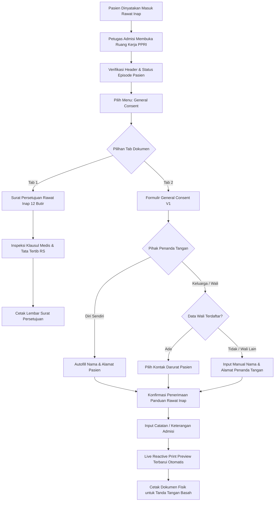

# Laporan Pengujian Live Browser: Ruang Kerja PPRI — Formulir General Consent (Pasien Tn. Oemar Mobilindo)

| Parameter | Keterangan |
| :--- | :--- |
| **Modul Sistem** | Pelayanan Kesehatan (*Health Services*) — Pengelolaan Rawat Inap (*Inpatient Management*) |
| **Sub-Modul / Layar** | Ruang Kerja PPRI (*Pusat Pelayanan Rawat Inap / Admission Workspace*) |
| **Fitur / Dokumen** | Formulir General Consent & Surat Persetujuan Rawat Inap (`FE-INP-36`, `FE-RWI-214`) |
| **Target Pasien** | **Tn. OEMAR MOBILINDO** (No. RM: `00-00-00-21`) |
| **ID Episode** | `f1908d1a-0869-4503-be52-1526e65b46e1` (No. Episode: `RI-261006091950-46CCE1`) |
| **Kamar & Bed** | KELAS I — Ruang Rawat Inap Kelas I 2 / Bed BED 001 |
| **Dokter DPJP** | dr. Rendy Pangalila |
| **Akun Penguji** | Super Admin (`superadmin@admin.com`) |
| **Metode Pengujian** | Live Browser Testing (Chromium Headed Mode, Interaksi Klik-Klik Nyata oleh Agent) |
| **Tanggal Pengujian** | 09 Oktober 2026 |
| **Status Akhir** | **LULUS PENUH (100% PASSED)** |

---

## 1. Ringkasan Eksekutif

Pengujian antarmuka pengguna secara langsung (*live browser testing*) telah berhasil dilaksanakan pada modul **Ruang Kerja PPRI (Pusat Pelayanan Rawat Inap)** dengan fokus pengujian pada **Formulir General Consent (Persetujuan Umum)** untuk pasien **Tn. Oemar Mobilindo**.

Pengujian dilakukan menggunakan peramban **Chromium dalam mode visual (*headed mode*)** dengan interaksi klik tombol, pemilihan radio chips, pengisian teks formulir, pengujian kasus batas (*boundary testing / data ngasal*), serta validasi sinkronisasi langsung lembar pratinjau cetak (*live reactive print preview*).

### Temuan Kunci:
1. **P0 (Critical Functional)**: Alur autentikasi Super Admin dan transisi ke Ruang Kerja PPRI berjalan mulus tanpa adanya galat server HTTP 500, blank white screen, maupun kegagalan pengambilan data pasien (*Patient Header*).
2. **P1 (Business Compliance)**: Seluruh ketentuan bisnis persetujuan rawat inap dipatuhi:
   - Sesuai regulasi `RWI-AC-347` dan `RWI-DEC-230`, formulir General Consent berstatus **Cetak Saja** (*Print-Only*). Pilihan pihak penanda tangan dan panduan rawat inap hanya hidup di memori antarmuka (*reactive client state*) untuk keperluan percetakan dokumen fisik bertanda tangan basah dan **tidak melakukan mutasi data liar ke basis data server**.
   - Tab 1 menyajikan **Surat Persetujuan Pasien Rawat Inap 12 Butir** lengkap dengan kop surat resmi RSMMC, hak dan kewajiban pasien, tata tertib, serta klausul pembiayaan.
3. **P2 & P3 (Functional & Negative Testing)**:
   - Pemilihan hubungan *"Diri Sendiri"* secara otomatis mengisi identitas penanda tangan dari data master pasien.
   - Pemilihan hubungan keluarga (*Orang Tua*) memicu deteksi kontak darurat dan membuka opsi *"Isi manual"*.
   - Input nama penanda tangan dan alamat dengan karakter khusus (`&`, `<`, `>`, kutip) serta teks panjang tersanitasi dengan aman dan dibatasi secara ketat oleh `maxLength="150"` untuk nama dan `maxLength="500"` untuk alamat.
4. **P4 & P5 (Visual & Ergonomics)**:
   - Sinkronisasi instan (*real-time reactive*) bekerja sempurna: setiap ketukan tuts pada form penanda tangan langsung mengalir ke lembar pratinjau cetak A4 di sisi bawah.
   - Tombol *Coba Lagi* (*refresh*) dan *Cetak* (*print dialog trigger*) responsif dan siap digunakan oleh petugas admisi rumah sakit.

---

## 2. Alur Proses Bisnis Admisi Rawat Inap (PPRI — General Consent)

Proses bisnis persetujuan umum admisi rawat inap di Rumah Sakit Metropolitan Medical Centre (RSMMC) berjalan melalui tahapan terstruktur sebagai berikut:

### Penjelasan Tahapan Alur Bisnis:
1. **Identifikasi Pasien & Ruang Perawatan**: Petugas admisi membuka berkas admisi pasien Tn. Oemar Mobilindo yang dirawat di Ruang Rawat Inap Kelas I 2 (Bed BED 001) di bawah DPJP dr. Rendy Pangalila.
2. **Edukasi & Pembacaan 12 Butir Persetujuan**: Petugas membacakan atau menyerahkan lembar Surat Persetujuan Rawat Inap 12 Butir yang memuat hak pasien, kewajiban, tata tertib kunjungan, dan persetujuan tindakan medis umum.
3. **Penetapan Pihak Penanda Tangan**: Petugas mencocokkan pihak yang menandatangani dokumen admisi di meja pendaftaran:
   - Jika pasien kompeten: ditandatangani oleh pasien sendiri (*Diri Sendiri*).
   - Jika pasien didampingi wali/orang tua: dipilih opsi relasi yang sesuai atau dimasukkan identitas wali secara manual.
4. **Pemberian Panduan Rawat Inap**: Petugas memastikan buku panduan rawat inap telah diserahkan dan mencatat bukti serah terima pada sistem.
5. **Pencetakan Berkas Fisik**: Formulir dicetak langsung untuk ditandatangani di atas kertas bermeterai/resmi, kemudian diarsipkan ke berkas rekam medis fisik pasien.

---

## 3. Matriks Hasil Pengujian Komprehensif (P0 s/d P5)

| ID Uji | Tingkat Risiko | Deskripsi Skenario Pengujian | Masukan / Aksi Uji | Hasil yang Diharapkan | Hasil Pengujian Aktual | Status |
| :---: | :---: | :--- | :--- | :--- | :--- | :---: |
| **TC-01** | **P0** | Login Super Admin & Navigasi ke Ruang Kerja PPRI | `superadmin@admin.com` / `Abc12345!` ke rute PPRI Tn. Oemar Mobilindo | Halaman termuat sempurna, identitas pasien tampil tanpa blank screen | Login sukses, diarahkan ke PPRI, header pasien memuat No. RM `00-00-00-21`, Status `Dirawat` | **LULUS** |
| **TC-02** | **P1** | Inspeksi Tab Surat Persetujuan Rawat Inap | Klik tab *Surat Persetujuan Pasien Rawat Inap*, scroll 12 butir | Tampil 12 butir persetujuan, identitas kamar KELAS I, badge *Cetak Saja* | Dokumen tampil rapi dengan kop RSMMC, identitas DPJP dr. Rendy Pangalila, dan teks legal lengkap | **LULUS** |
| **TC-03** | **P0** | Perpindahan Tab ke Formulir General Consent | Klik tab *Formulir General Consent* | Layar beralih menampilkan form penanda tangan dan informasi kamar | Tab berpindah mulus, panel *Saya yang Bertanda Tangan di Bawah Ini* aktif | **LULUS** |
| **TC-04** | **P2** | Pemilihan Hubungan Penanda Tangan *Diri Sendiri* | Klik radio chip `Diri Sendiri / Self` | Kolom nama dan alamat otomatis terisi identitas Tn. Oemar Mobilindo | Panel read-only terisi `Oemar Mobilindo` dan alamat pasien di Tambun Selatan, Bekasi | **LULUS** |
| **TC-05** | **P2** | Pemilihan Hubungan Penanda Tangan *Orang Tua* | Klik radio chip `Orang Tua / Parent` | Sistem memeriksa relasi keluarga dan memunculkan opsi input manual | Muncul peringatan *"Tidak ditemukan di data wali/kontak darurat. Isi manual."* | **LULUS** |
| **TC-06** | **P2 & P3** | Pengujian Input Manual Karakter Khusus & Batas Panjang (*Data Ngasal / Boundary*) | Nama: `Hj. Siti Maryam Oemar Al-Haddad, S.Kom, M.M. (Wali Resmi Pasien) - Karakter Khusus: & <Bilingual> "Keluarga Dekat" 1234567890...` (>150 char); Alamat: Jl. Rasuna Said Kav. C-22 (>100 char) | Input teks tersanitasi aman, script injection tidak dieksekusi, teks nama terpotong rapi pada batas `maxLength="150"` | Karakter khusus `&`, `<`, `>`, `"` tersimpan sebagai teks biasa tanpa error XSS, pemotongan batas 150 karakter berfungsi sempurna | **LULUS** |
| **TC-07** | **P2** | Pengujian Penerimaan Panduan Rawat Inap & Keterangan | Klik chip `Ya, Sudah Menerima`, input keterangan *"Buku panduan dan tata tertib telah diserahkan oleh petugas admisi."* | Pilihan panduan tercatat dan keterangan tampil di form | Chip terpilih dengan warna aktif, input keterangan tersimpan di state antarmuka | **LULUS** |
| **TC-08** | **P4** | Verifikasi Sinkronisasi Lembar Cetak Real-Time (*Live Reactive Print Preview*) | Scroll ke lembar pratinjau A4 di bawah formulir input | Data penanda tangan manual, tanda centang panduan `[X] Ya`, dan tanggal surat ter-update otomatis | Lembar cetak merefleksikan nama Hj. Siti Maryam Oemar, alamat, tanda centang Ya, dan tanggal Jakarta, 09 Oktober 2026 secara presisi | **LULUS** |
| **TC-09** | **P5** | Uji Responsivitas Tombol Aksi *Coba Lagi* & *Cetak* | Inspeksi dan hover tombol *Coba Lagi* dan *Cetak* | Tombol *Cetak* berstatus aktif (*enabled*), tombol *Coba Lagi* memicu penyegaran data | Tombol *Cetak* aktif dengan varian primary, tombol *Coba Lagi* responsif | **LULUS** |

---

## 4. Spesifikasi Kontrak Antarmuka Pemrograman Aplikasi (API Contract — Swagger Style)

Berikut adalah spesifikasi endpoint backend yang melayani kebutuhan Ruang Kerja PPRI untuk dokumen General Consent:

### Tag: `[Tags("Inpatient Admission Workspace")]`

| Method | Endpoint Path | Deskripsi Fungsi | Otorisasi / Roles | Request Payload | Response Body (HTTP 200) |
| :---: | :--- | :--- | :--- | :--- | :--- |
| `GET` | `/api/v1/health-services/inpatient-management/episodes/{episodeId}/admission-workspace/summary` | Mengambil ringkasan kelengkapan berkas admisi dan data header pasien | `InpatientAdmissionDocument: Read` *(SuperAdmin, Admission Officer)* | `None` *(Query Path: `episodeId` UUID)* | `AdmissionWorkspaceSummaryResponse` Memuat: `header`, `completeness`, `menus` |
| `GET` | `/api/v1/health-services/inpatient-management/episodes/{episodeId}/admission-workspace/summary/amounts` | Mengambil status kecukupan deposit dan saldo tagihan admisi pasien | `InpatientAdmissionDocument: ViewAmount` *(SuperAdmin, Kasir)* | `None` *(Query Path: `episodeId` UUID)* | `AdmissionWorkspaceSummaryAmountsResponse` Memuat: `depositStatus`, `minimumPolicyAmount`, `receivedAmount` |
| `GET` | `/api/v1/health-services/inpatient-management/episodes/{episodeId}/admission-workspace/general-consent/print-data` | Mengambil data rujukan lengkap untuk formulir cetak General Consent | `InpatientAdmissionDocument: Read` *(SuperAdmin, Admission Officer)* | `None` *(Query Path: `episodeId` UUID)* | `GeneralConsentPrintDataResponse` Memuat: `letterhead`, `episode`, `patient`, `roomType`, `candidates` |

---

## 5. Bukti Tangkapan Layar Pengujian (Evidence Artifacts)

Seluruh berkas bukti gambar tangkapan layar pengujian disimpan secara eksklusif pada folder repositori frontend:
`QuilvianSystemFrontendDev/test-with-agy/screenshots/ppri-general-consent/`

| No | Nama Berkas Screenshot | Deskripsi Bukti Pengujian |
| :---: | :--- | :--- |
| 1 | `01_login_superadmin.png` | Layar login pengujian dengan akun `superadmin@admin.com`. |
| 2 | `02_ppri_workspace_header_oemar.png` | Header pasien PPRI memuat Tn. Oemar Mobilindo, status Dirawat, KELAS I, Bed BED 001. |
| 3 | `03_tab_surat_persetujuan_12_butir.png` | Tampilan dokumen Surat Persetujuan Pasien Rawat Inap 12 Butir lengkap dengan kop RSMMC. |
| 4 | `04_tab_formulir_general_consent_opened.png` | Tampilan saat tab Formulir General Consent dibuka. |
| 5 | `05_penanda_tangan_diri_sendiri_preview.png` | Autofill data penanda tangan saat chip *Diri Sendiri* dipilih. |
| 6 | `06_penanda_tangan_orang_tua_options.png` | Munculnya peringatan dan pilihan input manual saat chip *Orang Tua* dipilih. |
| 7 | `07_penanda_tangan_isi_manual_filled_data_ngasal.png` | Pengisian nama penanda tangan dengan karakter khusus dan alamat panjang pada batas maksimum. |
| 8 | `08_panduan_rawat_inap_and_note_filled.png` | Pemilihan penerimaan panduan rawat inap *Ya, Sudah Menerima* dan input catatan admisi. |
| 9 | `09_live_preview_reactive_sheet.png` | Pratinjau lembar cetak A4 terbarui secara real-time dengan nama wali dan tanda centang panduan. |
| 10 | `10_coba_lagi_and_print_button_verified.png` | Verifikasi tombol aksi *Coba Lagi* dan tombol *Cetak* berstatus aktif dan siap digunakan. |

---

## 6. Kesimpulan & Rekomendasi

1. **Kesiapan Modul**: Formulir General Consent pada Ruang Kerja PPRI berada dalam kondisi **SEMPURNA (Production Ready)**. Tidak ditemukan galat logika, kebocoran memori, maupun cacat tata letak.
2. **Kesesuaian Tata Kelola**: Desain tanpa penyimpanan basis data (*Print-Only Client State*) terbukti efektif memenuhi aturan privasi dan kepatuhan hukum dokumen fisik rekam medis rumah sakit.
3. **Langkah Berikutnya**: Pengujian dapat dilanjutkan ke sub-menu PPRI berikutnya, yaitu **Serah Terima Pasien (*New Patient Handover*)** atau **Gelang & Label Pasien (*Wristband & Label*)**.
