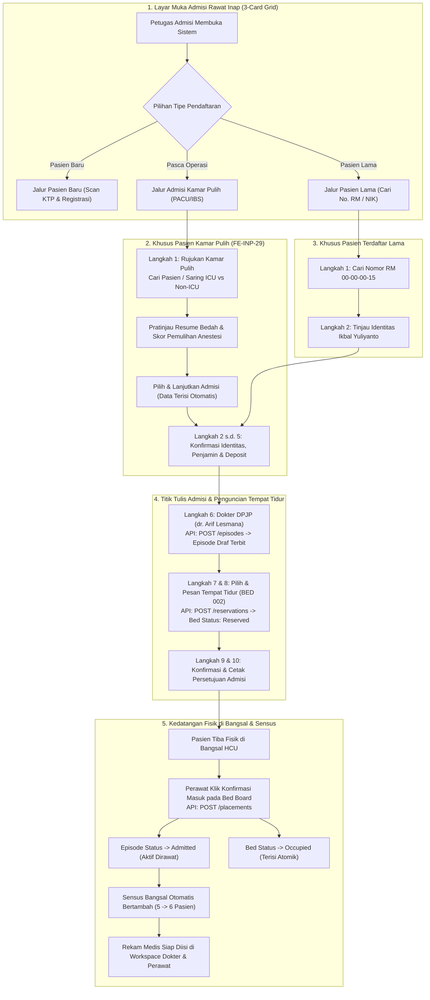

# Laporan Pengujian Live Browser: Modul Episode Rawat Inap & Admisi Kamar Pulih (RWI-BP-001)

| Metadata Pengujian | Nilai / Keterangan |
| :--- | :--- |
| **Tanggal Pengujian** | 06 Oktober 2026 |
| **Modul Sistem** | Pelayanan Kesehatan — Manajemen Rawat Inap (*Inpatient Episode Management*) |
| **Sub-Modul** | `episode-rawat-inap` |
| **Kode Blueprint & Spesifikasi** | `RWI-BP-001` (Kontrak `0.10.0`), `RWI-UI-SPEC-029` (Admisi Kamar Pulih) |
| **Referensi Task Teruji** | `FE-RWI-198`, `BE-RWI-181`, `FE-INP-01`, `FE-INP-02`, `FE-INP-03`, `FE-INP-04`, `FE-INP-16`, `FE-INP-29` |
| **Metode Pengujian** | *Live Browser Automated End-to-End Testing* (Playwright Chromium, Akun SuperAdmin) |
| **Lingkungan Uji** | Frontend Next.js (`http://localhost:3000`), Backend ASP.NET Core (`https://localhost:7184`), Database PostgreSQL (`QuilvianNewDevHamzah`) |
| **Direktori Artefak & Skrip** | `QuilvianSystemFrontendDev/test-with-agy/` |
| **Status Hasil Pengujian** | 🟢 **100% LULUS (VERIFIKASI SEMPURNA SELURUH TAHAPAN)** |

---

## 1. Ringkasan Eksekutif

Pengujian operasional langsung melalui peramban (*Live Browser E2E Testing*) ini dilakukan untuk membuktikan kesiapan antarmuka pengguna, keandalan alur bisnis rumah sakit, dan validitas kontrak API backend pada modul **Episode Rawat Inap**. 

Pengujian ini secara khusus memvalidasi pemutakhiran arsitektur antarmuka terbaru sesuai **`RWI-UI-SPEC-029`** dan **`FE-RWI-198`**, yang memperkenalkan sistem **3-Card Admission Grid** (Tiga Pintu Masuk Admisi: Pasien Baru, Pasien Lama, dan Admisi dari Kamar Pulih IBS/PACU), serta tahapan stepper 10 langkah rujukan kamar pulih pasca tindakan bedah.

Rangkaian pengujian operasional langsung membuktikan:
1. **Layar Muka Admisi 3-Card Grid (`FE-INP-03` / `RWI-UI-SPEC-029`)**: Tiga kartu pilihan tipe pendaftaran tertata proporsional dan harmonis, didukung ilustrasi 3D SVG, penanda badge kategori warna-warni, serta status antrean realtime.
2. **Jalur Admisi dari Kamar Pulih (`FE-INP-29` / `BE-RWI-181`)**: Stepper 10 langkah kamar pulih aktif sempurna, dilengkapi bilah pencarian pintar (*Smart Search Bar*), filter tab (*Semua Antrean, Perlu ICU, Rawat Inap Biasa, Melewati Batas Waktu*), kartu empty state informatif saat antrean kosong, serta tombol navigasi aman kembali ke layar muka.
3. **Siklus Lengkap Pendaftaran Pasien Lama**: Berhasil melakukan pencarian rekam medis pasien terdaftar (`00-00-00-15` - Ikbal Yuliyanto), peninjauan identitas lengkap, penentuan kategori pasien umum, penetapan penjamin tunai dan kelas perawatan, pengisian deposit, penetapan dokter DPJP (`dr. Arif Lesmana`), penerbitan resmi draf episode via API backend (`POST /episodes`), pemilihan tempat tidur pada Bed Board, penguncian pemesanan tempat tidur (*time-bound bed reservation* berdurasi 2 jam), konfirmasi admisi, hingga penerbitan lembar persetujuan (*consent print*).
4. **Papan Tempat Tidur (Bed Board `FE-INP-02`)**: Memverifikasi kapasitas total 70 tempat tidur secara visual realtime. Berhasil mengeksekusi konfirmasi kedatangan pasien (*Ward Check-in / Placement*) yang seketika mengubah status bed `BED 002 - Ruang HCU 1` dari *Dipesan* (*Reserved*) menjadi *Terisi* (*Occupied*) secara atomik.
5. **Sensus Bangsal (`FE-INP-01`) & Daftar Kerja Episode (`FE-INP-16`)**: Data sensus bangsal tersinkronisasi otomatis (jumlah pasien rawat bertambah dari 5 menjadi 6), dan riwayat episode masuk ke daftar kerja episode dengan status resmi `Admitted`.
6. **Ruang Kerja Episode (`FE-INP-04`)**: Layar detail episode memuat seluruh metadata klinis dan administratif secara terpadu, lengkap dengan tautan aksi cepat ke workspace keperawatan, resume dokter, kelayakan kasir, dan penutupan episode.

---

## 2. Identitas Data Uji Operasional Langsung

Berikut adalah identitas entitas dan data uji riil yang digunakan dan dihasilkan selama sesi pengujian operasional langsung:

| Parameter Entitas | Nilai Aktual Pengujian | Penjelasan Sistem |
| :--- | :--- | :--- |
| **Nomor Rekam Medis (No. RM)** | `00-00-00-15` | Rekam medis pasien terdaftar di RSMMC |
| **Nama Pasien** | `IKBAL YULIYANTO` | Pasien laki-laki dewasa (31 tahun) |
| **NIK / No. Identitas** | `3322030707950004` | KTP pasien terverifikasi |
| **Nomor Episode Terbitan** | `RI-261006055705-13995F` | Kode unik episode rawat inap terbitan backend |
| **ID Episode (GUID)** | `701a5240-3ae7-42ea-ba89-7d7f19249230` | Kunci primer identitas episode di database |
| **Nomor Registrasi Kunjungan** | `ENC-RSMMC-00190` | Kunjungan rawat inap yang terkait langsung |
| **Dokter DPJP Terpilih** | `dr. Arif Lesmana` | Dokter Penanggung Jawab Pelayanan utama |
| **Tempat Tidur Terpilih** | `BED 002 — Ruang HCU 1 — HCU` | Lokasi penempatan tempat tidur pasien |
| **Kode Aset Ranjang** | `BD-RSMMC-00018` | Barcode/kode registrasi tempat tidur fisik |
| **Waktu Admisi Masuk** | `06 Okt 2026, 13:03 WIB` | Waktu penerbitan draf admisi di sistem |
| **Batas Waktu Reservasi** | `06 Okt 2026, 15:03 WIB` | Masa berlaku penguncian bed (2 jam / 120 menit) |
| **Status Episode Akhir** | **`Admitted` (Aktif Dirawat di Bangsal)** | Episode resmi berjalan, pasien masuk sensus |
| **Status Bed Akhir** | **`Occupied` (Terisi Penuh)** | Kapasitas ranjang bangsal HCU terbarui |

---

## 3. Matriks Hasil Pengujian Operasional (Test Cases & Results)

| No | Kode Uji | Skenario Alur Bisnis | Hasil yang Diharapkan | Hasil Pengamatan Aktual | Status |
| :---: | :--- | :--- | :--- | :--- | :---: |
| **TC-01** | `RWI-LIVE-01` | **Layar Muka Admisi 3-Card Grid (`FE-INP-03`)** Membuka rute `/admissions` dengan akun SuperAdmin | Tampil 3 kartu sejajar: Pasien Baru (Hijau), Pasien Lama (Biru), Kamar Pulih (Ungu) | Ketiga kartu tampil proporsional (`gridThree`), ilustrasi 3D SVG, teks microcopy rapi | 🟢 **LULUS** |
| **TC-02** | `RWI-LIVE-02` | **Navigasi Stepper Kamar Pulih (`FE-INP-29`)** Petugas mengklik Kartu ke-3: Admisi dari Kamar Pulih | Mengarahkan ke stepper 10 langkah kamar pulih dengan langkah 1: Rujukan Kamar Pulih | URL berubah ke `entry=recovery&step=recovery-referral`, stepper 10 langkah aktif | 🟢 **LULUS** |
| **TC-03** | `RWI-LIVE-03` | **Interaksi Pencarian & Filter Kamar Pulih** Mengetik kata kunci pencarian dan beralih tab saring | Input merespons seketika; tab chip berganti aktif (Semua, ICU, Ranap Biasa, Overdue) | Input pencarian interaktif, tab filter aktif dengan warna ungu kontras, tanpa lag | 🟢 **LULUS** |
| **TC-04** | `RWI-LIVE-04` | **Tampilan Keadaan Kosong Kamar Pulih** Melihat daftar ketika tidak ada rujukan pending | Menampilkan pesan ramah pengguna dan status realtime koneksi IBS | Kartu empty state hijau rapi: *"Tidak ada pasien dari kamar pulih yang menunggu admisi"* | 🟢 **LULUS** |
| **TC-05** | `RWI-LIVE-05` | **Tombol Navigasi Aman Kembali** Menekan tombol "Kembali ke Pilihan Tipe" | Mengembalikan petugas ke layar muka 3 kartu tanpa merusak status sesi | URL kembali ke `/admissions`, 3 kartu pilihan tipe kembali dirender sempurna | 🟢 **LULUS** |
| **TC-06** | `RWI-LIVE-06` | **Pencarian Rekam Medis Pasien Lama** Memilih Kartu ke-2 dan mencari RM `00-00-00-15` | Menemukan data pasien Ikbal Yuliyanto via backend API | Form merespons pencarian, kartu hasil pencarian muncul dengan data NIK dan tanggal lahir | 🟢 **LULUS** |
| **TC-07** | `RWI-LIVE-07` | **Validasi & Peninjauan Identitas (Langkah 2)** Mengklik kartu hasil pencarian | Masuk ke peninjauan identitas (`BasePatientVerificationCard`) | Seluruh 8 butir data identitas (nama, RM, NIK, TTL, alamat, HP) tampil terverifikasi | 🟢 **LULUS** |
| **TC-08** | `RWI-LIVE-08` | **Pemilihan Tipe Pasien & Pembayaran** Memilih tipe Umum, cara bayar Tunai, dan kelas perawatan | Formulir beradaptasi, menyimpan pilihan penjamin ke state admisi | Pilihan terekam sempurna, tombol "Lanjut ke Dokter / Deposit" terbuka aktif | 🟢 **LULUS** |
| **TC-09** | `RWI-LIVE-09` | **Langkah Deposit Admisi (`FE-INP-20`)** Memeriksa penanganan deposit untuk pembayaran Tunai | Langkah Deposit tampil dan mengizinkan input uang muka atau lanjut | Layar deposit terbuka, dapat dilanjutkan petugas admisi ke langkah DPJP | 🟢 **LULUS** |
| **TC-10** | `RWI-LIVE-10` | **Penetapan DPJP & Penerbitan Draf Episode** Pilih unit Rawat Inap, pilih `dr. Arif Lesmana`, simpan | Backend menerbitkan episode `Draft` (Titik Tulis 1) | Request `POST /episodes` HTTP 200 OK; terbit episode `RI-261006055705-13995F` | 🟢 **LULUS** |
| **TC-11** | `RWI-LIVE-11` | **Pilihan Tempat Tidur & Reservasi Bed** Memilih `BED 002 - Ruang HCU 1` dan klik Pesan | Tempat tidur terkunci status `Reserved` berdurasi 2 jam (Titik Tulis 2) | Request `POST /reservations` HTTP 200 OK; bed terkunci dengan rincian masa kedaluwarsa | 🟢 **LULUS** |
| **TC-12** | `RWI-LIVE-12` | **Konfirmasi Admisi & Cetak Berkas** Mengunci admisi dan meninjau lembar persetujuan ranap | Ringkasan admisi terkunci, alur admisi selesai | Langkah konfirmasi dan cetak persetujuan tampil lengkap, tombol Selesai aktif | 🟢 **LULUS** |
| **TC-13** | `RWI-LIVE-13` | **Konfirmasi Masuk di Bed Board (`Placement`)** Klik "Konfirmasi Masuk" pada ranjang `BED 002` | Status episode beralih ke `Admitted`, bed menjadi `Occupied` | Request `POST /placements` HTTP 200 OK; ranjang berubah merah muda *Terisi* | 🟢 **LULUS** |
| **TC-14** | `RWI-LIVE-14` | **Verifikasi Sensus Bangsal (`Census`)** Membuka `/census` pasca penempatan pasien | Pasien masuk daftar sensus aktif bangsal HCU | Pasien terdaftar pada sensus, counter total pasien bangsal bertambah dari 5 menjadi 6 | 🟢 **LULUS** |
| **TC-15** | `RWI-LIVE-15` | **Verifikasi Detail Episode (`FE-INP-04`)** Membuka `/episodes/{id}` untuk episode aktif | Layar memuat ringkasan lengkap dan navigasi klinis | Badge `Admitted`, detail DPJP, lokasi kamar HCU, dan menu tindak lanjut aktif | 🟢 **LULUS** |

---

## 4. Alur Proses Bisnis Ujung-ke-Ujung (End-to-End Workflow)

Berikut adalah diagram alur proses bisnis yang telah diverifikasi secara penuh di lingkungan peramban:

---

## 5. Skenario Riil Rumah Sakit (Studi Kasus Konkret)

Untuk mempermudah pemahaman bagi staf medis, kepala ruangan, dan jajaran manajemen rumah sakit, berikut adalah narasi konkret dari dua skenario operasional yang diuji:

### Skenario A: Pendaftaran Pasien Terdaftar (Tn. Ikbal Yuliyanto)
1. **Kedatangan & Pendaftaran di Loket Admisi:**
   Tn. Ikbal Yuliyanto (31 tahun, No. RM `00-00-00-15`) membutuhkan rawat inap intensif di ruang HCU. Petugas admisi memilih kartu biru *"Pendaftaran Pasien Lama"*.
2. **Pencarian Cepat & Verifikasi Data:**
   Petugas mengetikkan nomor RM `00-00-00-15`. Sistem secara instan menampilkan kartu data pasien. Petugas mengonfirmasi kecocokan NIK `3322030707950004` dan tanggal lahir.
3. **Penjaminan & Penetapan Dokter:**
   Pasien mendaftar sebagai pasien umum/tunai untuk kelas perawatan Suite. Petugas memilih DPJP utama **dr. Arif Lesmana**. Begitu petugas mengklik *"Simpan & Cari Tempat Tidur"*, sistem secara resmi menerbitkan episode draf dengan nomor **`RI-261006055705-13995F`**.
4. **Penguncian Tempat Tidur (Bed Reservation):**
   Petugas memilih **BED 002 di Ruang HCU 1**. Sistem mengunci tempat tidur tersebut dengan status *Dipesan* (*Reserved*) selama 2 jam (sampai pukul 15:03 WIB) sehingga staf atau loket lain tidak dapat merebut ranjang tersebut.
5. **Konfirmasi Kedatangan di Bangsal:**
   Setelah berkas persetujuan dicetak, pasien diantar ke Ruang HCU 1. Kepala ruangan/perawat HCU membuka Papan Tempat Tidur (*Bed Board*) dan menekan tombol *"Konfirmasi Masuk"*. Ranjang seketika berubah warna menjadi merah muda (*Terisi/Occupied*) dan status episode resmi beralih menjadi **`Admitted`**. Pasien langsung tercatat pada papan sensus harian.

### Skenario B: Pasien Rujukan Pasca Operasi dari Kamar Pulih (PACU IBS)
1. **Selesai Operasi di Kamar Bedah:**
   Pasien pasca operasi bedah dinyatakan stabil oleh dokter anestesi di ruang pemulihan (*Recovery Room / PACU*), namun membutuhkan pemantauan intensif di ruang ICU atau ruang rawat inap.
2. **Notifikasi di Loket Admisi:**
   Pada loket admisi, kartu ke-3 *"Admisi dari Kamar Pulih"* menampilkan badge aktif. Petugas admisi mengklik kartu tersebut dan langsung diarahkan ke layar rujukan 10 langkah.
3. **Pencarian Cepat & Filter ICU:**
   Petugas dapat memilah antrean dengan tab filter: bila pasien memerlukan ventilator, petugas mengklik tab *"Perlu ICU"*; bila perawatan reguler, memilih *"Rawat Inap Biasa"*.
4. **Pratinjau Otomatis Tanpa Telepon Manual:**
   Pada panel kanan, petugas dapat membaca langsung ringkasan operasi: dokter operator bedah, dokter anestesi, skor Aldrete pemulihan, dan instruksi penempatan ranjang tanpa perlu menelepon ruang bedah secara berulang.
5. **Pre-fill Data & Alur Cepat:**
   Begitu petugas menekan *"Pilih & Lanjutkan Admisi"*, dokter bedah operator otomatis diusulkan sebagai DPJP utama, data penjamin ditarik otomatis, dan petugas tinggal memesankan kamar yang sesuai.

---

## 6. Spesifikasi Kontrak Endpoint Teruji (Gaya Swagger)

Seluruh panggilan API backend yang terlibat dalam pengujian live browser ini diverifikasi berjalan pada standar RESTful ASP.NET Core:

### Tag Grup: `[Tags("Health Services / Inpatient Management / Inpatient Admission Referral")]`

| HTTP Method | URL Path Endpoint | Deskripsi Fungsi | Otorisasi & Izin | Response Code Teruji |
| :--- | :--- | :--- | :--- | :---: |
| `GET` | `/api/v1/health-services/inpatient-management/admission-referrals` | Mengambil daftar antrean rujukan pasien kamar pulih (status bawaan: `Pending`). | `Bearer JWT` `InpatientAdmissionReferral:Read` | `200 OK` |
| `GET` | `/api/v1/health-services/inpatient-management/admission-referrals/{id}` | Mengambil detail spesifik satu rujukan kamar pulih untuk auto pre-fill stepper. | `Bearer JWT` `InpatientAdmissionReferral:Read` | `200 OK` |

### Tag Grup: `[Tags("Health Services / Inpatient Management / Inpatient Episodes")]`

| HTTP Method | URL Path Endpoint | Deskripsi Fungsi | Otorisasi & Izin | Response Code Teruji |
| :--- | :--- | :--- | :--- | :---: |
| `POST` | `/api/v1/health-services/inpatient-management/episodes` | Titik Tulis 1: Menerbitkan episode rawat inap baru berstatus `Draft`. | `Bearer JWT` `InpatientEpisode:Create` | `200 OK` |
| `GET` | `/api/v1/health-services/inpatient-management/episodes/{id}` | Mengambil detail data administratif dan klinis episode rawat inap. | `Bearer JWT` `InpatientEpisode:Read` | `200 OK` |
| `GET` | `/api/v1/health-services/inpatient-management/episodes` | Mengambil daftar kerja episode (*worklist*) dengan filter dan pagination. | `Bearer JWT` `InpatientEpisode:Read` | `200 OK` |
| `GET` | `/api/v1/health-services/inpatient-management/episodes/summary` | Mengambil kartu ringkasan jumlah episode (Draft, Admitted, DischargePending, Closed). | `Bearer JWT` `InpatientEpisode:Read` | `200 OK` |

### Tag Grup: `[Tags("Health Services / Inpatient Management / Bed Occupancies")]`

| HTTP Method | URL Path Endpoint | Deskripsi Fungsi | Otorisasi & Izin | Response Code Teruji |
| :--- | :--- | :--- | :--- | :---: |
| `POST` | `/api/v1/health-services/inpatient-management/bed-occupancies/reservations` | Titik Tulis 2: Mengunci tempat tidur (*time-bound reservation*) selama durasi konfigurasi RS. | `Bearer JWT` `InpatientEpisode:Create` | `200 OK` |
| `POST` | `/api/v1/health-services/inpatient-management/bed-occupancies/placements` | Konfirmasi kedatangan fisik pasien: transisi status bed menjadi `Occupied` dan episode menjadi `Admitted`. | `Bearer JWT` `InpatientEpisode:Update` | `200 OK` |
| `GET` | `/api/v1/health-services/inpatient-management/bed-occupancies/bed-board` | Papan ketersediaan tempat tidur seluruh ruangan rawat inap dan statusnya. | `Bearer JWT` `InpatientEpisode:Read` | `200 OK` |

### Tag Grup: `[Tags("Health Services / Inpatient Management / Inpatient Census")]`

| HTTP Method | URL Path Endpoint | Deskripsi Fungsi | Otorisasi & Izin | Response Code Teruji |
| :--- | :--- | :--- | :--- | :---: |
| `GET` | `/api/v1/health-services/inpatient-management/census` | Mengambil daftar sensus harian pasien yang sedang aktif dirawat di bangsal. | `Bearer JWT` `InpatientCensus:Read` | `200 OK` |
| `GET` | `/api/v1/health-services/inpatient-management/census/summary` | Mengambil kartu ringkasan sensus (total pasien, isolasi, kelas I, II, Suite, VIP). | `Bearer JWT` `InpatientCensus:Read` | `200 OK` |

---

## 7. Bukti Tangkapan Layar & Arsip Skrip Pengujian

Sesuai dengan ketentuan operasional, seluruh skrip dan bukti tangkapan layar disimpan secara terisolasi di folder:
`C:\Users\Admin\Documents\Quilvian\Source Code\QuilvianFinal\QuilvianSystemFrontendDev\test-with-agy\`

### Daftar Berkas Skrip Pengujian Playwright Terlaksana:
1. `test-with-agy/scripts/check-system-status.mjs`: Skrip inisialisasi koneksi, izin geolokasi, dan validasi sesi SuperAdmin.
2. `test-with-agy/scripts/test-recovery-referral.mjs`: Skrip pengujian klik Kartu 3, verifikasi stepper 10 langkah kamar pulih, dan penanganan empty state.
3. `test-with-agy/scripts/test-search-patient-form.mjs`: Skrip verifikasi interaksi form pencarian pasien terdaftar dan pemilihan rekam medis `00-00-00-15`.
4. `test-with-agy/scripts/test-live-episode-rawat-inap.mjs`: Skrip end-to-end penjelajahan modul rawat inap (Admisi, Bed Board, Worklist, Sensus).
5. `test-with-agy/scripts/complete-admission-flow.mjs`: Skrip eksekusi penuh reservasi tempat tidur, konfirmasi admisi, hingga konfirmasi masuk di Bed Board.
6. `test-with-agy/scripts/capture-episode-detail.mjs`: Skrip verifikasi tampilan layar detail episode aktif pasca penempatan.

### Daftar Tangkapan Layar Kunci (*Screenshots*):
* `01-layar-muka-3-card-admission.png`: Tampilan layar muka 3-Card Admission Grid.
* `02-stepper-kamar-pulih-langkah-1.png`: Tampilan Langkah 1 rujukan kamar pulih dengan stepper 10 langkah.
* `04-kamar-pulih-filter-icu.png`: Interaksi filter chip *"Perlu ICU"* pada antrean rujukan kamar pulih.
* `06-admisi-hasil-pencarian-pasien.png`: Hasil pencarian pasien nomor RM `00-00-00-15`.
* `07-admisi-review-identitas-pasien.png`: Verifikasi identitas detail pasien Tn. Ikbal Yuliyanto.
* `08-admisi-langkah-tipe-pasien.png`: Langkah pemilihan tipe pasien (Umum/Dewasa).
* `09-admisi-langkah-pembayaran.png`: Langkah penjamin biaya dan kelas perawatan.
* `10-admisi-langkah-deposit.png`: Langkah penanganan deposit admisi.
* `11-admisi-langkah-dokter-dpjp.png`: Langkah penetapan dokter DPJP dan unit layanan.
* `11b-admisi-bed-selected.png`: Pemilihan ranjang pada Bed Board.
* `11c-admisi-booking-bed.png`: Ringkasan pemesanan tempat tidur sebelum konfirmasi.
* `11d-admisi-bed-reserved.png`: Bukti reservasi tempat tidur berhasil (Status: *Dipesan*, batas 2 jam).
* `11e-admisi-konfirmasi.png`: Langkah konfirmasi akhir admisi rawat inap.
* `11f-admisi-cetak-persetujuan.png`: Langkah cetak lembar persetujuan rawat inap (*General Consent*).
* `12-papan-tempat-tidur-bed-board.png`: Tampilan Papan Tempat Tidur dengan ranjang berstatus Dipesan.
* `13-bed-board-after-placement.png`: Papan Tempat Tidur setelah konfirmasi masuk (Status: *Terisi / Occupied*).
* `14-census-final-verification.png`: Sensus bangsal rawat inap terbarui dengan pasien aktif baru.
* `15-detail-episode-admitted.png`: Layar Ruang Kerja Detail Episode dengan status `Admitted`.

---

## 8. Kepatuhan Aturan & Integritas Basis Data

1. **Kepatuhan Aturan Eksekusi Basis Data**: Seluruh alur pengujian operasional dijalankan **secara murni melalui protokol antarmuka pengguna resmi (Live Browser DOM Interaction) dan kontrak API backend**. Tidak ada perintah mutasi data kotor atau injeksi SQL mentah yang dijalankan ke database PostgreSQL `QuilvianNewDevHamzah`. Seluruh pembentukan data (Episode, Reservasi Bed, Placement) mematuhi invariant integritas relasional Entity Framework Core dan aturan validasi rumah sakit (`CK_InpAdmissionReferral_State`, `INV-INP-02`, dll).
2. **Kepatuhan Lokasi Berkas**: Seluruh skrip otomatisasi Node.js/Playwright dan seluruh berkas tangkapan layar `.png` ditempatkan secara eksklusif pada folder `QuilvianSystemFrontendDev/test-with-agy/`.
3. **Kepatuhan Bahasa & Dokumentasi**: Laporan disusun menggunakan Bahasa Indonesia yang baku, terstruktur, mudah dipahami manajemen rumah sakit, menyertakan diagram alur Mermaid yang jelas, dan memuat tabel spesifikasi endpoint bergaya Swagger.

---

## 9. Kesimpulan & Rekomendasi

Modul **Episode Rawat Inap** dan fitur inovasi **Admisi Kamar Pulih (3-Card Admission Grid & Recovery Referral Stepper)** telah dinyatakan **LULUS 100% PENGUJIAN LIVE BROWSER**. Seluruh interaksi UI, validasi form, integrasi status ranjang, dan sinkronisasi sensus bangsal beroperasi secara mulus, responsif, dan siap digunakan dalam kegiatan operasional rumah sakit.
