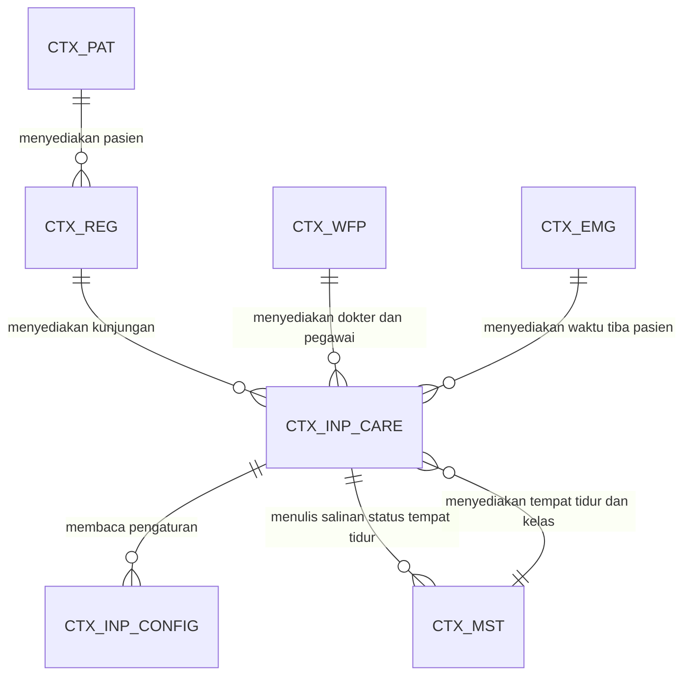

# Rawat Inap — Peta Antar Bounded Context

| Field | Nilai |
| --- | --- |
| Blueprint ID | `RWI-BP-001` |
| Revision | `0.3` |
| Status | `draft` |
| Backend SHA | `5afb54b` |

Dokumen ini menunjukkan **arah ketergantungan** antar konteks, bukan kolom per tabel. Kolom ada
pada ERD per konteks dan pada kamus data.

---

## 1. Peta ketergantungan

| Kode pada diagram | Nama lengkap | Modul pemilik |
| --- | --- | --- |
| `CTX_INP_CARE` | Episode Perawatan Rawat Inap | `InPatientManagement` |
| `CTX_INP_CONFIG` | Konfigurasi Rawat Inap | `InPatientManagement` |
| `CTX_REG` | Registrasi dan Kunjungan | `RegistrationManagement` |
| `CTX_PAT` | Identitas Pasien | `PatientManagement` |
| `CTX_MST` | Master Fasilitas dan Layanan | `MasterData` HealthServices |
| `CTX_WFP` | Tenaga Kerja dan Praktisi | `Corporate/HumanResource` |
| `CTX_EMG` | Instalasi Gawat Darurat | `EmergencyInstallationManagement` |

---

## 2. Sifat setiap ketergantungan

| Dari | Ke | Arah | Sifat | Yang dilewatkan |
| --- | --- | --- | --- | --- |
| `CTX_INP_CARE` | `CTX_REG` | Baca | Mengikuti bentuk yang sudah ada | `TrxPatientEncounter.Id` sebagai jangkar episode |
| `CTX_INP_CARE` | `CTX_MST` | Baca | Mengikuti | `MstBed`, `MstRoom`, `MstServiceUnit`, `MstPatientClass`. Sejak revision `0.2` bacaan itu bertambah: penanda `MstBed.IsForMale`, `IsForFemale`, `IsIsolationBed`, `IsForNewborn`, dan `MstBed.RoomId` dipakai Kelayakan Penempatan untuk **menolak** penempatan |
| `CTX_INP_CARE` | `CTX_MST` | **Tulis** | **Bermitra** | Hanya kolom `MstBed.BedStatus`, dan hanya nilai `Available`, `Reserved`, `Occupied` |
| `CTX_INP_CARE` | `CTX_WFP` | Baca | Mengikuti | `MstDoctor.Id`, `MstEmployee.Id` |
| `CTX_INP_CARE` | `CTX_INP_CONFIG` | Baca | Milik sendiri | Batas waktu dan daftar butir administrasi |
| `CTX_INP_CARE` | `CTX_EMG` | Baca | Mengikuti | Event `Tiba` pada catatan kepergian IGD, sebagai waktu mulai penempatan. Hanya pada jalur serah terima — `RWI-DEC-072` |
| `CTX_INP_CARE` | `CTX_REG` | Baca | Mengikuti | `TrxPatientEncounter.OriginEncounterId` sebagai penanda rangkaian kedatangan. Kolomnya dibuat dan diisi modul IGD — `RWI-DEC-073` |

**Satu-satunya arah tulis keluar** adalah baris ketiga. Rinciannya, termasuk laporan selisih yang
mengawasinya, ada pada [`../contracts/integration-contract.md`](../contracts/integration-contract.md).

**Revision `0.2` tidak menambah arah panah, tetapi memperberat satu yang sudah ada.** Aturan jenis
kelamin dan isolasi menaikkan taruhan pada bacaan `CTX_MST`: penanda yang salah setel kini menolak
penempatan yang sah, bukan sekadar menyembunyikan tempat tidur dari hasil pencarian. Karena itu
`RWI-DEC-063` memberi penanggung jawab pengisian master data beserta target tanggalnya, dan
`MVP-1` mensyaratkan penandanya **benar**, bukan sekadar terisi.

Aturan pencampuran kamar sengaja **tidak** menambah bacaan baru ke `CTX_MST`. Ia dijawab dari
`InpBedPlacement` milik konteks ini sendiri — penghuni yang sedang ada — sesuai `RWI-DEC-066`.

**Revision `0.3` menambah satu panah baru dan satu bacaan baru, keduanya arah baca.** Konteks
IGD kini menjadi sumber kebenaran waktu tiba, dan rangkaian kedatangan dibaca dari kolom milik
`CTX_REG`. Tidak ada arah tulis keluar yang bertambah: kolom `OriginEncounterId` dibuat dan
diisi modul IGD, bukan oleh konteks ini. Keduanya hanya menyala pada jalur serah terima IGD,
yaitu `INP-S09` yang di luar scope revisi ini — panahnya digambar sekarang supaya bentuk
hubungannya tidak dikarang ulang nanti.

---

## 3. Konteks yang sengaja tidak terhubung pada revisi ini

| Konteks | Modul | Kenapa belum terhubung |
| --- | --- | --- |
| Dokumentasi Klinis | `ClinicalManagement` | Menunggu `DEC-INP-001` |
| Farmasi | `PharmacyManagement` | Menunggu `DEC-INP-001` |
| Instalasi Gawat Darurat | `EmergencyInstallationManagement` | Serah terima `INP-S09` menunggu `DEC-INP-002`. Pemiliknya bernama sejak `RWI-DEC-069`: Rizki Gunawan. **Arah bacanya sudah dirancang** pada bagian 2, tetapi belum terhubung |
| Interoperabilitas SATUSEHAT | Belum ada pemiliknya | Menunggu `DEC-INP-005` |
| Billing | `BillingManagement` | Tidak dipakai pada MVP; digantikan penandaan manual sesuai `RWI-RULE-028` |

`DEC-INP-004` **tidak lagi** ada pada daftar ini. Ia tertutup 2026-08-21 tanpa menambah satu pun
hubungan antar konteks, karena keputusannya justru memilih jalan yang tidak menyentuh modul lain.

Ketiadaan garis ke lima konteks itu adalah **keadaan yang disengaja**, bukan gambar yang belum
selesai.

---

## 4. Daftar ERD per konteks

| Konteks | Berkas |
| --- | --- |
| `CTX_INP_CARE` | [`01-inpatient-episode.md`](./01-inpatient-episode.md) |
| `CTX_INP_CONFIG` | [`02-inpatient-configuration.md`](./02-inpatient-configuration.md) |
| Kamus data seluruh tabel | [`data-dictionary.md`](./data-dictionary.md) |
