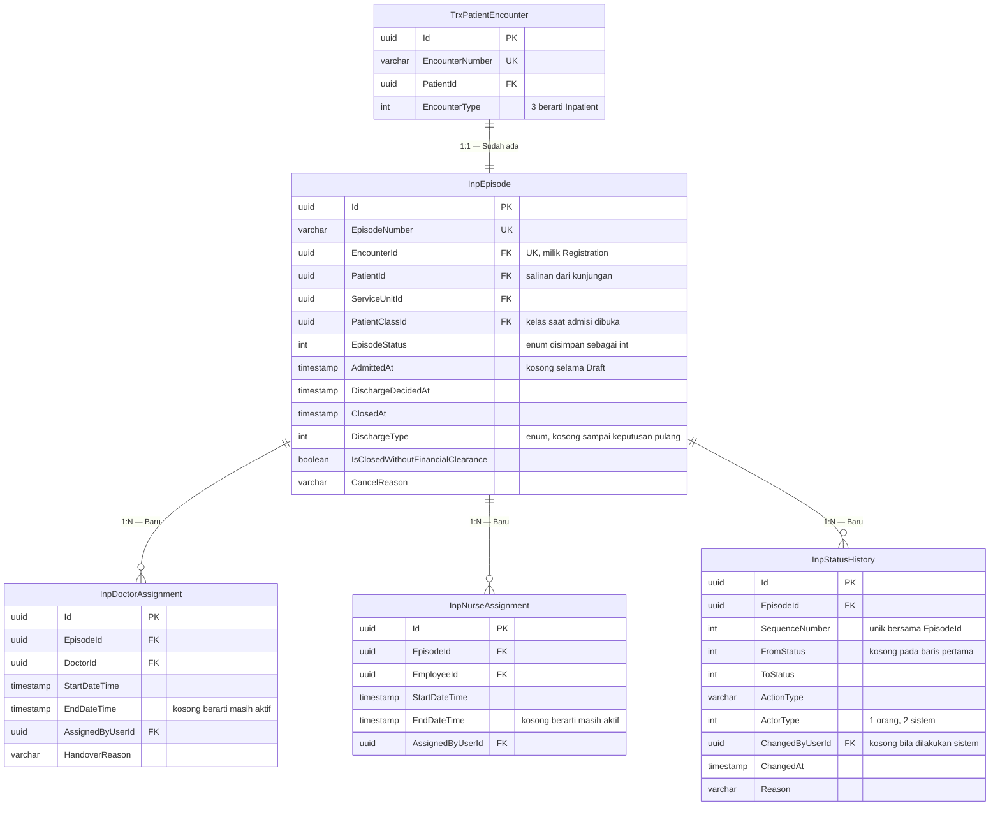
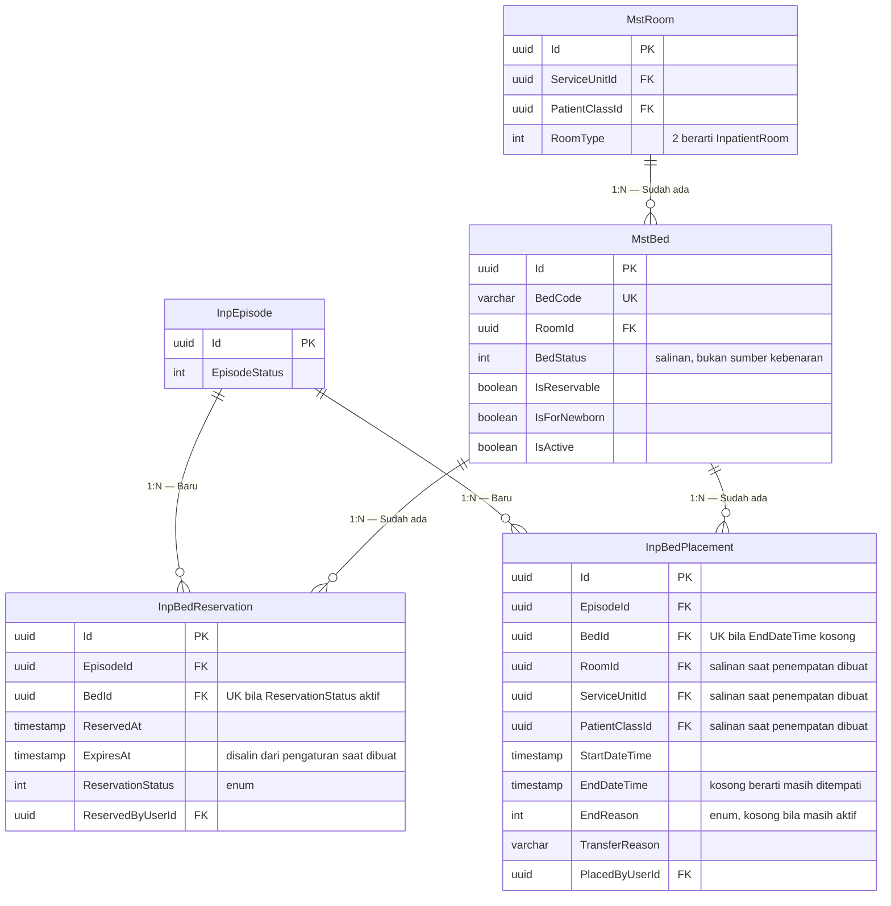
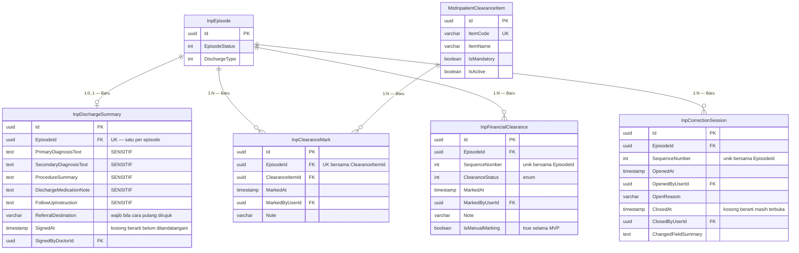

# ERD — Episode Perawatan Rawat Inap (`CTX-INP-CARE`)

| Field | Nilai |
| --- | --- |
| Blueprint ID | `RWI-BP-001` |
| Revision | `0.1` |
| Status | `draft` |
| Backend SHA | `5afb54b` |

Kolom audit warisan `IdentityModel` tidak digambar pada ERD mana pun di dokumen ini. Rinciannya
ada di kepala [`data-dictionary.md`](./data-dictionary.md).

Diagram dipecah menjadi tiga supaya masing-masing muat dibaca dalam satu layar.

---

## 1. Inti episode dan penanggung jawab

---

## 2. Penghunian tempat tidur

**Dua unique index parsial yang menjaga `INV-INP-02`:**

| Index | Berlaku pada baris | Menjaga |
| --- | --- | --- |
| `IX_InpBedPlacement_BedId_Active` unik atas `BedId` | `EndDateTime IS NULL` | Satu tempat tidur hanya punya satu penempatan aktif |
| `IX_InpBedReservation_BedId_Active` unik atas `BedId` | `ReservationStatus = 1` | Satu tempat tidur hanya punya satu pemesanan aktif |

---

## 3. Pemulangan, kelayakan, dan koreksi

---

## 4. Tabel status entity

| Entity | Status | Owner | Catatan |
| --- | --- | --- | --- |
| `InpEpisode` | `Baru` | InPatient Management | Aggregate root |
| `InpDoctorAssignment` | `Baru` | InPatient Management | Riwayat berperiode |
| `InpNurseAssignment` | `Baru` | InPatient Management | Riwayat berperiode, boleh kosong |
| `InpBedReservation` | `Baru` | InPatient Management | Kedaluwarsa dihitung saat dibaca |
| `InpBedPlacement` | `Baru` | InPatient Management | Sumber kebenaran penghunian |
| `InpDischargeSummary` | `Baru` | InPatient Management | Seluruh kolom isi bertanda sensitif |
| `InpClearanceMark` | `Baru` | InPatient Management | — |
| `InpFinancialClearance` | `Baru` | InPatient Management | Sementara sampai Billing operasional |
| `InpStatusHistory` | `Baru` | InPatient Management | Tidak dapat diubah dan tidak dapat dihapus |
| `InpCorrectionSession` | `Baru` | InPatient Management | Menggantikan status episode keenam |
| `MstInpatientClearanceItem` | `Baru` | Master Data HealthServices | Lihat `02-inpatient-configuration.md` |
| `TrxPatientEncounter` | `Sudah ada` | Registration Management | Direferensikan, **MUST NOT** disalin |
| `MstBed` | `Sudah ada` | Master Data HealthServices | Direferensikan. Kolom `BedStatus` **ditulis** modul ini sebagai salinan |
| `MstRoom` | `Sudah ada` | Master Data HealthServices | Direferensikan |
| `MstServiceUnit` | `Sudah ada` | Master Data HealthServices | Direferensikan |
| `MstPatientClass` | `Sudah ada` | Master Data HealthServices | Direferensikan |
| `MstDoctor` | `Sudah ada` | Corporate HR Workforce | Direferensikan |
| `MstEmployee` | `Sudah ada` | Corporate HR Workforce | Direferensikan |
| `MstPatient` | `Sudah ada` | Patient Management | Direferensikan lewat kunjungan |

---

## 5. Perilaku hapus

Seluruh relasi ke tabel milik modul lain memakai `DeleteBehavior.Restrict`, mengikuti konvensi
project untuk relasi klinis. Alasannya: histori transaksi tidak boleh ikut terhapus berantai
ketika sebuah master dihapus.

Relasi di dalam aggregate `InpEpisode` juga memakai `Restrict`, bukan `Cascade`. Penghapusan
memang tidak pernah terjadi secara fisik — seluruh tabel memakai penandaan `IsDelete`.

**Satu pengecualian yang perlu ditegaskan:** `InpStatusHistory` **tidak** boleh ditandai
`IsDelete` lewat endpoint mana pun. Tidak ada endpoint update maupun delete yang disediakan
untuknya.
