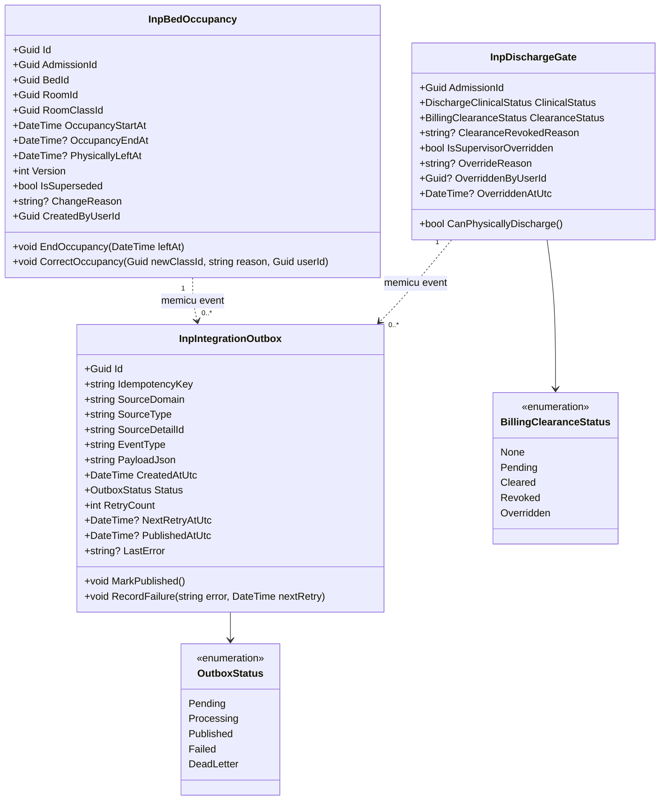
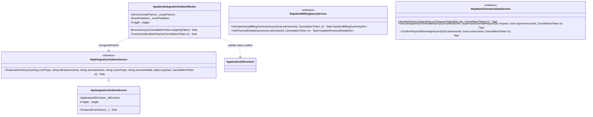

# Arsitektur Backend — Integrasi Rawat Inap ↔ Kasir / Billing (`INP-S22`)

| Field | Nilai |
|---|---|
| Blueprint ID | `RWI-BP-001-INT-BIL` |
| Sub-modul | `integrasi-billing` (Slice `INP-S22`) |
| Versi Desain | `1.0.0` (Draft) — 17 September 2026 |
| Target Framework | .NET 8 / ASP.NET Core Web API, Entity Framework Core 8, PostgreSQL / SQL Server |
| Arsitektur Pola | Clean Architecture, Transactional Outbox Pattern, Event-Driven Integration, Idempotent Consumer |
| Dokumen Acuan | `PRD Integrasi-Rawat-Inap-dengan-Billing.md`, `00-interview-decisions.md` revision 25, `01-existing-capability-map.md` Bagian 18, `02-requirement-completeness-gate.md` Bagian 16 |

---

## 1. Bounded Context dan Kepemilikan Data

Integrasi antara Rawat Inap dan Billing mematuhi batas wilayah bounded context yang tegas:

> **Prinsip Utama:** Rawat Inap (`InPatientManagement`) adalah *Source of Truth* untuk fakta klinis, admisi, hunian fisik tempat tidur, perpindahan kamar, dan pelepasan pasien. Kasir/Billing (`BillingManagement`) adalah *Source of Truth* untuk kalkulasi tarif, pembentukan tagihan (*charge*), pengelolaan deposit, alokasi asuransi/excess, dan kelayakan pembayaran (*Financial Clearance*).

```text
┌──────────────────────────────────────────────────────────────┐
│            BOUNDED CONTEXT: INPATIENT MANAGEMENT             │
│                                                              │
│  [Aggregate Root: InpatientAdmission]                        │
│       │                                                      │
│       ├─► InpBedOccupancy (Fakta Hunian & Waktu Presisi)     │
│       ├─► InpDischargeRequest (Izin Pulang DPJP & Clearance) │
│       └─► InpIntegrationOutbox (Transactional Outbox)        │
└──────────────────────────────┬───────────────────────────────┘
                               │
                               │ Event Asinkron via Outbox:
                               │ • ADMISSION_CONFIRMED
                               │ • BED_OCCUPIED
                               │ • OCCUPANCY_CORRECTED
                               │ • BED_RELEASED
                               │
                               │ REST Query Sinkron:
                               │ • GET /billing-summary (Tanpa Rupiah)
                               │ • POST /discharge-clearance/webhook
                               │
┌──────────────────────────────▼───────────────────────────────┐
│              BOUNDED CONTEXT: BILLING MANAGEMENT             │
│                                                              │
│  [Aggregate Root: BillingFolio]                              │
│       │                                                      │
│       ├─► BilRoomCharge (Kalkulasi Tarif Kamar & Jam Masuk)  │
│       ├─► BilDepositAccount (Saldo, Top-up, Shortfall)       │
│       ├─► BilInvoice (Tagihan Pasien & Asuransi Excess)      │
│       └─► BilFinancialClearance (Status: Pending / Cleared)  │
└──────────────────────────────────────────────────────────────┘
```

### 1.1 Tabel Kepemilikan Data

| Kelompok Data | Modul Pemilik | Dipakai di Modul Ini | Dibuat Ulang di Modul Ini | Alasan & Mekanisme Penggunaan |
|---|---|:---:|:---:|---|
| **Admisi & Episode Pasien** | `InPatientManagement` | Ya | Tidak | Menggunakan entitas `InpAdmission` / `InpEpisode` yang sudah ada sebagai jangkar fakta pelayanan. |
| **Hunian Tempat Tidur (Occupancy)** | `InPatientManagement` | Ya | Diperbarui | Menggunakan `InpBedOccupancy` (atau segmentasi `InpBedPlacement`) dengan penambahan stempel waktu presisi dan nomor versi. |
| **Log Antrean Outbox Integrasi** | `InPatientManagement` | Ya | **Ya (Baru)** | Tabel `InpIntegrationOutbox` dibuat di skema Rawat Inap untuk menjamin pengiriman event transaksional yang andal (*at-least-once delivery*). |
| **Pelepasan Pasien (Discharge)** | `InPatientManagement` | Ya | Diperbarui | Menambahkan field tracking status clearance kasir, flag auto-reblock, dan otorisasi *Supervisor Override*. |
| **Tarif & Perhitungan Sewa Kamar** | `BillingManagement` | Tidak | **TIDAK (Dilarang Keras)** | Perhitungan rupiah, penentuan diskon jam masuk, dan biaya split mutasi kamar sepenuhnya milik mesin `BillingCalculationService`. |
| **Folio & Invoice Tagihan** | `BillingManagement` | Dibaca | **TIDAK (Dilarang Keras)** | Rawat Inap hanya membaca status operasional (Lunas / Belum Lunas) melalui DTO ringkasan tanpa angka rupiah. |
| **Deposit & Pembayaran** | `BillingManagement` | Dibaca | **TIDAK (Dilarang Keras)** | Pembayaran uang, kwitansi, dan penanganan shortfall deposit dikelola eksklusif oleh kasir. |
| **Persetujuan Kelayakan Kasir** | `BillingManagement` | Dikonsumsi | Tidak | Diterima melalui event/webhook saat kasir menerbitkan `ClearanceApproved` atau `ClearanceRevoked`. |

---

## 2. Class Diagram

### 2.1 Domain & Persistence Layer — Rawat Inap (`InPatientManagement`)



### 2.2 Service & Worker Layer



---

## 3. Penjelasan Setiap Class

| Nama Class / Komponen | Status | Lokasi File | Fungsi & Tanggung Jawab | Wewenang Akses & Transaksi |
|---|:---:|---|---|---|
| `InpIntegrationOutbox` | **Baru** | `Areas/HealthServices/InPatientManagement/Models/InpIntegrationOutbox.cs` | Model entitas untuk menyimpan event integrasi yang harus dipublikasikan ke message broker / modul Billing secara transaksional. | Domain Model / Internal EF Core. |
| `OutboxStatus` | **Baru** | `Areas/HealthServices/InPatientManagement/Enums/OutboxStatus.cs` | Enum status antrean outbox: `Pending`, `Processing`, `Published`, `Failed`, `DeadLetter`. | Domain Enum. |
| `BillingClearanceStatus` | **Baru** | `Areas/HealthServices/InPatientManagement/Enums/BillingClearanceStatus.cs` | Enum status kelayakan kasir dari perspektif rawat inap: `None`, `Pending`, `Cleared`, `Revoked`, `Overridden`. | Domain Enum. |
| `InpIntegrationOutboxConfiguration` | **Baru** | `Repositories/Configurations/HealthServices/InPatientManagement/InpIntegrationOutboxConfiguration.cs` | Konfigurasi EF Core: index unik `IdempotencyKey`, filter index `Status`, panjang string, dan schema mapping. | Persistence Configuration. |
| `IInpIntegrationOutboxService` | **Baru** | `Areas/HealthServices/InPatientManagement/Services/IInpIntegrationOutboxService.cs` | Antarmuka untuk pendaftaran event outbox dalam satu scope transaksi DbContext. | Service Contract. |
| `InpIntegrationOutboxService` | **Baru** | `Areas/HealthServices/InPatientManagement/Services/InpIntegrationOutboxService.cs` | Implementasi penambahan record outbox ke `ApplicationDbContext`. Menggunakan transaksi yang sama dengan operasi bisnis utama. | Transactional Service. |
| `InpatientIntegrationOutboxWorker` | **Baru** | `Areas/HealthServices/InPatientManagement/Workers/InpatientIntegrationOutboxWorker.cs` | BackgroundService yang melakukan polling batch event outbox `Pending`/`Failed`, mengirim ke publisher, dan mencatat waktu keberhasilan / backoff kegagalan. | Hosted Background Worker. |
| `IInpatientBillingQueryService` | **Baru** | `Areas/HealthServices/InPatientManagement/Services/IInpatientBillingQueryService.cs` | Antarmuka kueri data tagihan ke modul Billing (membedakan view operasional tanpa rupiah dan rincian finansial). | Query Service Contract. |
| `InpatientBillingQueryService` | **Baru** | `Areas/HealthServices/InPatientManagement/Services/InpatientBillingQueryService.cs` | Implementasi pemanggilan API internal atau kueri DTO ke Billing. Menjamin penyaringan angka rupiah untuk staf non-keuangan. | Strictly Read-Only Service. |
| `IInpatientClearanceGateService` | **Baru** | `Areas/HealthServices/InPatientManagement/Services/IInpatientClearanceGateService.cs` | Antarmuka penegakan gerbang pemulangan fisik, penanganan webhook clearance, auto-reblock, dan supervisor override. | Domain Service Contract. |
| `InpatientClearanceGateService` | **Baru** | `Areas/HealthServices/InPatientManagement/Services/InpatientClearanceGateService.cs` | Menangani logika bisnis pelepasan pasien: memvalidasi status `Cleared`, mengaktifkan tombol pelepasan, mengunci seketika bila revoked, dan mencatat audit supervisor override. | Transactional Service. |
| `InpatientBillingOperationalController` | **Baru** | `Areas/HealthServices/InPatientManagement/Controllers/InpatientBillingOperationalController.cs` | Endpoint REST untuk kebutuhan visual bangsal: ringkasan status operasional tanpa rupiah (`InpatientNurse:Read`) dan rincian finansial (`InpatientBilling:View`). | Controller terproteksi JWT. |
| `InpatientDischargeClearanceController` | **Baru** | `Areas/HealthServices/InPatientManagement/Controllers/InpatientDischargeClearanceController.cs` | Endpoint REST untuk webhook sinyal clearance dari kasir, eksekusi supervisor override (`InpatientSupervisor:Override`), dan konfirmasi fisik kepulangan pasien (`InpatientNurse:Write`). | Controller terproteksi JWT. |
| `InpBedOccupancy` (atau `InpBedPlacement`) | **Diperbarui** | `Areas/HealthServices/InPatientManagement/Models/InpBedPlacement.cs` | Memastikan kolom `OccupancyStartAt`, `OccupancyEndAt`, `PhysicallyLeftAt`, `Version`, `ChangeReason`, `IsSuperseded` terpetakan dengan tepat untuk standardisasi occupancy. | Domain Model. |

---

## 4. Arsitektur Folder Backend

```text
NewQuilvianSystemBackend/
├── Areas/
│   └── HealthServices/
│       └── InPatientManagement/
│           ├── Controllers/
│           │   ├── InpatientBillingOperationalController.cs     [Baru]
│           │   └── InpatientDischargeClearanceController.cs      [Baru]
│           ├── DTOs/
│           │   ├── InpatientBillingSummaryDtos.cs               [Baru]
│           │   ├── InpatientClearanceSignalDtos.cs              [Baru]
│           │   ├── InpatientSupervisorOverrideDtos.cs           [Baru]
│           │   └── InpatientPhysicalDischargeDtos.cs            [Baru]
│           ├── Enums/
│           │   ├── OutboxStatus.cs                              [Baru]
│           │   └── BillingClearanceStatus.cs                    [Baru]
│           ├── Models/
│           │   ├── InpIntegrationOutbox.cs                      [Baru]
│           │   └── InpBedPlacement.cs                           [Diperbarui: tracking fields]
│           ├── Services/
│           │   ├── IInpIntegrationOutboxService.cs              [Baru]
│           │   ├── InpIntegrationOutboxService.cs               [Baru]
│           │   ├── IInpatientBillingQueryService.cs             [Baru]
│           │   ├── InpatientBillingQueryService.cs              [Baru]
│           │   ├── IInpatientClearanceGateService.cs            [Baru]
│           │   └── InpatientClearanceGateService.cs             [Baru]
│           └── Workers/
│               └── InpatientIntegrationOutboxWorker.cs          [Baru]
├── Repositories/
│   └── Configurations/
│       └── HealthServices/
│           └── InPatientManagement/
│               └── InpIntegrationOutboxConfiguration.cs         [Baru]
└── Migrations/
    └── 20260917000000_AddInpatientBillingIntegrationOutbox.cs   [Baru]
```

---

## 5. Status Model & Dampak Migrasi Basis Data

### 5.1 Tabel Baru: `InpIntegrationOutbox`

- **Nama Tabel Fisik:** `InpIntegrationOutboxes`
- **Schema:** `dbo` (atau `inpatient`)
- **Primary Key:** `Id` (`uuid`, clustered)
- **Spesifikasi Kolom:**

| Nama Kolom | Tipe Data | Nullable | Nilai Bawaan | Keterangan & Index |
|---|---|:---:|---|---|
| `Id` | `uuid` | Tidak | `gen_random_uuid()` | Primary Key unik per baris pesan outbox. |
| `IdempotencyKey` | `varchar(255)` | Tidak | — | **Unique Index:** `UQ_InpIntegrationOutbox_IdempotencyKey`. Format: `SourceDomain:SourceType:SourceDetailId:Version`. |
| `SourceDomain` | `varchar(50)` | Tidak | `'INPATIENT'` | Domain asal, e.g. `INPATIENT`. |
| `SourceType` | `varchar(50)` | Tidak | — | Tipe fakta pelayanan: `ADMISSION`, `ROOM_STAY`, `DISCHARGE`. |
| `SourceDetailId` | `varchar(100)` | Tidak | — | ID unik entitas sumber (AdmissionId, BedPlacementId, dll). |
| `EventType` | `varchar(100)` | Tidak | — | Nama event: `ADMISSION_CONFIRMED`, `BED_OCCUPIED`, `OCCUPANCY_CORRECTED`, `BED_RELEASED`. |
| `PayloadJson` | `text` / `jsonb` | Tidak | — | Serialisasi JSON terstruktur dari fakta pelayanan. |
| `Status` | `int` | Tidak | `0` (`Pending`) | **Index Filtered:** `IX_InpIntegrationOutbox_Status_Pending` (di mana `Status IN (0, 3)`). |
| `RetryCount` | `int` | Tidak | `0` | Jumlah upaya pengiriman ulang yang telah dicoba. |
| `NextRetryAtUtc` | `timestamp with time zone` | Ya | `null` | Waktu percobaan berikutnya berdasarkan formula exponential backoff. |
| `PublishedAtUtc` | `timestamp with time zone` | Ya | `null` | Waktu ketika broker/consumer berhasil mengonfirmasi ACK. |
| `LastError` | `text` | Ya | `null` | Pesan kesalahan terakhir jika terjadi kegagalan jaringan atau penolakan broker. |
| `CreatedAtUtc` | `timestamp with time zone` | Tidak | `CURRENT_TIMESTAMP` | Waktu pencatatan event ke database lokal. |

- **Aturan Hapus (Delete Behavior):** `Restrict` / No Delete. Tabel bersifat *Append-Only Audit Log*. Penghapusan log lama hanya dilakukan lewat prosedur pengarsipan terjadwal (retensi 30 hari untuk status `Published`).

### 5.2 Kolom Diperbarui pada Entitas Hunian (`InpBedPlacement`)

Untuk memastikan kesesuaian dengan standardisasi occupancy (`INT-CAP-02` dan `INT-CAP-03`), entitas hunian dilengkapi dengan:
- `PhysicallyLeftAt` (`timestamp with time zone`, nullable): Waktu pasien benar-benar meninggalkan bed.
- `Version` (`int`, default `1`): Nomor versi iterasi data hunian untuk pencegahan *race conditions* dan repricing.
- `ChangeReason` (`text`, nullable): Alasan mutasi atau koreksi kamar yang wajib diisi oleh Supervisor.
- `IsSuperseded` (`bool`, default `false`): Penanda bahwa baris hunian ini telah dikoreksi oleh versi baru tanpa melakukan *hard delete*.

---

## 6. Rencana Migrasi Basis Data

1. **Nama Migrasi:** `20260917000000_AddInpatientBillingIntegrationOutbox`
2. **Downtime Requirement:** **Nol Downtime (Zero Downtime Migration)**.
   - Tabel `InpIntegrationOutboxes` adalah tabel baru independen.
   - Penambahan kolom `PhysicallyLeftAt`, `Version`, `ChangeReason`, `IsSuperseded` pada `InpBedPlacement` bersifat *nullable* dengan nilai bawaan aman sehingga tidak mengunci tabel aktif (*table lock*).
3. **Pengisian Data Lama (Backfilling):**
   - Data penempatan tempat tidur yang sudah ada diisi `Version = 1` dan `IsSuperseded = false`.
   - Kolom `PhysicallyLeftAt` untuk episode yang sudah berstatus `Discharged` diisi dari nilai `CheckOutDateTime` atau `OccupancyEndAt` yang sudah tercatat.
4. **Langkah Rollback:**
   - Bila terjadi kegagalan saat migrasi: Jalankan `dotnet ef database update <PreviousMigrationName>` yang akan menjalankan method `Down()`.
   - Method `Down()` akan menghapus tabel `InpIntegrationOutboxes` dan melepaskan kolom tambahan pada `InpBedPlacement`.

---

## 7. Mekanisme Ketahanan & Idempotensi (*Resilience & Idempotency*)

### 7.1 Pola Transactional Outbox
Ketika perawat atau staf admisi melakukan aksi (misal menempatkan pasien ke bed Mawar 01):
1. Transaksi EF Core `BeginTransactionAsync()` dibuka.
2. Perubahan status `InpBedPlacement` disimpan (`OccupancyStartAt = 09:30`).
3. Objek `InpIntegrationOutbox` ditambahkan ke `DbContext` dengan `EventType = "BED_OCCUPIED"` dan `IdempotencyKey = "INPATIENT:ROOM_STAY:OCC-08891:1"`.
4. `await _dbContext.SaveChangesAsync()` dieksekusi secara atomik.
5. Transaksi di-commit. Jika database gagal menyimpan, seluruh operasi dibatalkan dan tidak ada event hantu (*phantom event*).

### 7.2 Background Poller Worker & Exponential Backoff
Worker `InpatientIntegrationOutboxWorker` berjalan di background dengan interval polling bawaan **5 detik**:
- Mengambil batch maksimal **50 pesan** yang berstatus `Pending` atau (`Failed` AND `NextRetryAtUtc <= UtcNow`).
- Menerbitkan event ke endpoint / broker Billing.
- Jika sukses: Tandai `Status = Published`, `PublishedAtUtc = UtcNow`.
- Jika gagal: 
  - `RetryCount += 1`.
  - Hitung backoff: $\text{Delay} = \min(2^{\text{RetryCount}} \times 5 \text{ detik}, 3600 \text{ detik})$.
  - Set `NextRetryAtUtc = UtcNow + Delay`.
  - Jika `RetryCount >= 10`: Tandai `Status = DeadLetter` dan kirim alert peringatan ke log tim IT / dashboard sistem.

---

## 8. Yang Sengaja Tidak Dibuat (*Out of Scope & Exclusions*)

| Komponen yang Dipertimbangkan | Keputusan | Alasan Arsitektural & Invariant |
|---|:---:|---|
| **Tabel Tagihan / Invoice di Modul Rawat Inap** | **DITOLAK KERAS** | Melanggar pemisahan bounded context. Seluruh kalkulasi rupiah, pajak, diskon, dan pencetakan faktur resmi wajib berada di modul `BillingManagement` ([`RWI-DEC-156`](file:///C:/Users/Admin/Documents/Quilvian/Source%20Code/QuilvianFinal/NewQuilvianSystemBackend/docs/module-blueprints/rawat-inap/00-interview-decisions.md)). |
| **Mesin Kalkulasi Tarif Sewa Kamar Harian di Rawat Inap** | **DITOLAK KERAS** | Aturan jam masuk malam (18.00 = 50%, 22.00 = 20%) dan split mutasi kamar hari yang sama adalah domain bisnis Billing. Rawat Inap hanya menyediakan timestamp presisi `OccupancyStartAt` dan `OccupancyEndAt`. |
| **Penyimpanan Angka Rupiah Saldo Pasien di Tabel Bangsal** | **DITOLAK KERAS** | Menyimpan saldo rupiah di tabel Rawat Inap menimbulkan risiko desinkronisasi data saat terjadi pembayaran parsial atau retur obat di kasir, serta melanggar aturan privasi klinis ([`RWI-DEC-160`](file:///C:/Users/Admin/Documents/Quilvian/Source%20Code/QuilvianFinal/NewQuilvianSystemBackend/docs/module-blueprints/rawat-inap/00-interview-decisions.md)). |
| **Pelepasan Pasien Fisik Otomatis Tanpa Konfirmasi Perawat** | **DITOLAK** | Meskipun clearance kasir telah terbit (`PaymentCleared`), pasien tidak boleh dianggap keluar otomatis oleh sistem. Perawat bangsal wajib mengonfirmasi secara faktual bahwa pasien benar-benar telah berkemas dan keluar kamar (`PhysicallyLeftAt`) ([`RWI-DEC-159`](file:///C:/Users/Admin/Documents/Quilvian/Source%20Code/QuilvianFinal/NewQuilvianSystemBackend/docs/module-blueprints/rawat-inap/00-interview-decisions.md)). |
