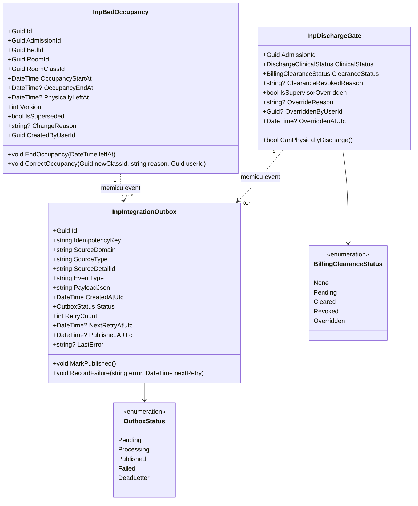
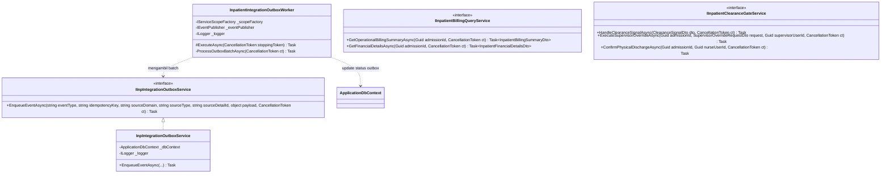
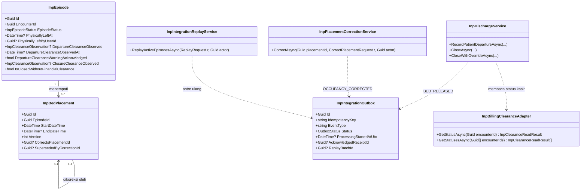
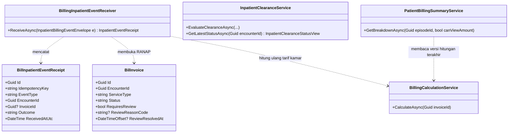

# Arsitektur Backend — Integrasi Rawat Inap ↔ Kasir / Billing (`INP-S22`)

| Field | Nilai |
|---|---|
| Blueprint ID | `RWI-BP-001-INT-BIL` |
| Sub-modul | `integrasi-billing` (Slice `INP-S22`) |
| Versi Desain | `1.0.0` (Draft) — 17 September 2026 |
| Target Framework | .NET 8 / ASP.NET Core Web API, Entity Framework Core 8, PostgreSQL / SQL Server |
| Arsitektur Pola | Clean Architecture, Transactional Outbox Pattern, Event-Driven Integration, Idempotent Consumer |
| Dokumen Acuan | `PRD Integrasi-Rawat-Inap-dengan-Billing.md`, `00-interview-decisions.md` revision 25, `01-existing-capability-map.md` Bagian 18, `02-requirement-completeness-gate.md` Bagian 16 |

---

## 1. Bounded Context dan Kepemilikan Data

Integrasi antara Rawat Inap dan Billing mematuhi batas wilayah bounded context yang tegas:

> **Prinsip Utama:** Rawat Inap (`InPatientManagement`) adalah *Source of Truth* untuk fakta klinis, admisi, hunian fisik tempat tidur, perpindahan kamar, dan pelepasan pasien. Kasir/Billing (`BillingManagement`) adalah *Source of Truth* untuk kalkulasi tarif, pembentukan tagihan (*charge*), pengelolaan deposit, alokasi asuransi/excess, dan kelayakan pembayaran (*Financial Clearance*).

```text
┌──────────────────────────────────────────────────────────────┐
│            BOUNDED CONTEXT: INPATIENT MANAGEMENT             │
│                                                              │
│  [Aggregate Root: InpatientAdmission]                        │
│       │                                                      │
│       ├─► InpBedOccupancy (Fakta Hunian & Waktu Presisi)     │
│       ├─► InpDischargeRequest (Izin Pulang DPJP & Clearance) │
│       └─► InpIntegrationOutbox (Transactional Outbox)        │
└──────────────────────────────┬───────────────────────────────┘
                               │
                               │ Event Asinkron via Outbox:
                               │ • ADMISSION_CONFIRMED
                               │ • BED_OCCUPIED
                               │ • OCCUPANCY_CORRECTED
                               │ • BED_RELEASED
                               │
                               │ REST Query Sinkron:
                               │ • GET /billing-summary (Tanpa Rupiah)
                               │ • POST /discharge-clearance/webhook
                               │
┌──────────────────────────────▼───────────────────────────────┐
│              BOUNDED CONTEXT: BILLING MANAGEMENT             │
│                                                              │
│  [Aggregate Root: BillingFolio]                              │
│       │                                                      │
│       ├─► BilRoomCharge (Kalkulasi Tarif Kamar & Jam Masuk)  │
│       ├─► BilDepositAccount (Saldo, Top-up, Shortfall)       │
│       ├─► BilInvoice (Tagihan Pasien & Asuransi Excess)      │
│       └─► BilFinancialClearance (Status: Pending / Cleared)  │
└──────────────────────────────────────────────────────────────┘
```

### 1.1 Tabel Kepemilikan Data

| Kelompok Data | Modul Pemilik | Dipakai di Modul Ini | Dibuat Ulang di Modul Ini | Alasan & Mekanisme Penggunaan |
|---|---|:---:|:---:|---|
| **Admisi & Episode Pasien** | `InPatientManagement` | Ya | Tidak | Menggunakan entitas `InpAdmission` / `InpEpisode` yang sudah ada sebagai jangkar fakta pelayanan. |
| **Hunian Tempat Tidur (Occupancy)** | `InPatientManagement` | Ya | Diperbarui | Menggunakan `InpBedOccupancy` (atau segmentasi `InpBedPlacement`) dengan penambahan stempel waktu presisi dan nomor versi. |
| **Log Antrean Outbox Integrasi** | `InPatientManagement` | Ya | **Ya (Baru)** | Tabel `InpIntegrationOutbox` dibuat di skema Rawat Inap untuk menjamin pengiriman event transaksional yang andal (*at-least-once delivery*). |
| **Pelepasan Pasien (Discharge)** | `InPatientManagement` | Ya | Diperbarui | Menambahkan field tracking status clearance kasir, flag auto-reblock, dan otorisasi *Supervisor Override*. |
| **Tarif & Perhitungan Sewa Kamar** | `BillingManagement` | Tidak | **TIDAK (Dilarang Keras)** | Perhitungan rupiah, penentuan diskon jam masuk, dan biaya split mutasi kamar sepenuhnya milik mesin `BillingCalculationService`. |
| **Folio & Invoice Tagihan** | `BillingManagement` | Dibaca | **TIDAK (Dilarang Keras)** | Rawat Inap hanya membaca status operasional (Lunas / Belum Lunas) melalui DTO ringkasan tanpa angka rupiah. |
| **Deposit & Pembayaran** | `BillingManagement` | Dibaca | **TIDAK (Dilarang Keras)** | Pembayaran uang, kwitansi, dan penanganan shortfall deposit dikelola eksklusif oleh kasir. |
| **Persetujuan Kelayakan Kasir** | `BillingManagement` | Dikonsumsi | Tidak | Diterima melalui event/webhook saat kasir menerbitkan `ClearanceApproved` atau `ClearanceRevoked`. |

---

## 2. Class Diagram

### 2.1 Domain & Persistence Layer — Rawat Inap (`InPatientManagement`)


```mermaid
classDiagram
    class InpIntegrationOutbox {
        +Guid Id
        +string IdempotencyKey
        +string SourceDomain
        +string SourceType
        +string SourceDetailId
        +string EventType
        +string PayloadJson
        +DateTime CreatedAtUtc
        +OutboxStatus Status
        +int RetryCount
        +DateTime? NextRetryAtUtc
        +DateTime? PublishedAtUtc
        +string? LastError
        +void MarkPublished()
        +void RecordFailure(string error, DateTime nextRetry)
    }

    class OutboxStatus {
        <<enumeration>>
        Pending
        Processing
        Published
        Failed
        DeadLetter
    }

    class InpBedOccupancy {
        +Guid Id
        +Guid AdmissionId
        +Guid BedId
        +Guid RoomId
        +Guid RoomClassId
        +DateTime OccupancyStartAt
        +DateTime? OccupancyEndAt
        +DateTime? PhysicallyLeftAt
        +int Version
        +bool IsSuperseded
        +string? ChangeReason
        +Guid CreatedByUserId
        +void EndOccupancy(DateTime leftAt)
        +void CorrectOccupancy(Guid newClassId, string reason, Guid userId)
    }

    class InpDischargeGate {
        +Guid AdmissionId
        +DischargeClinicalStatus ClinicalStatus
        +BillingClearanceStatus ClearanceStatus
        +string? ClearanceRevokedReason
        +bool IsSupervisorOverridden
        +string? OverrideReason
        +Guid? OverriddenByUserId
        +DateTime? OverriddenAtUtc
        +bool CanPhysicallyDischarge()
    }

    class BillingClearanceStatus {
        <<enumeration>>
        None
        Pending
        Cleared
        Revoked
        Overridden
    }

    InpIntegrationOutbox --> OutboxStatus
    InpDischargeGate --> BillingClearanceStatus
    InpBedOccupancy "1" ..> "0..*" InpIntegrationOutbox : memicu event
    InpDischargeGate "1" ..> "0..*" InpIntegrationOutbox : memicu event
```

### 2.2 Service & Worker Layer


```mermaid
classDiagram
    class IInpIntegrationOutboxService {
        <<interface>>
        +EnqueueEventAsync(string eventType, string idempotencyKey, string sourceDomain, string sourceType, string sourceDetailId, object payload, CancellationToken ct) Task
    }

    class InpIntegrationOutboxService {
        -ApplicationDbContext _dbContext
        -ILogger _logger
        +EnqueueEventAsync(...) Task
    }

    class InpatientIntegrationOutboxWorker {
        -IServiceScopeFactory _scopeFactory
        -IEventPublisher _eventPublisher
        -ILogger _logger
        #ExecuteAsync(CancellationToken stoppingToken) Task
        -ProcessOutboxBatchAsync(CancellationToken ct) Task
    }

    class IInpatientBillingQueryService {
        <<interface>>
        +GetOperationalBillingSummaryAsync(Guid admissionId, CancellationToken ct) Task~InpatientBillingSummaryDto~
        +GetFinancialDetailsAsync(Guid admissionId, CancellationToken ct) Task~InpatientFinancialDetailsDto~
    }

    class IInpatientClearanceGateService {
        <<interface>>
        +HandleClearanceSignalAsync(ClearanceSignalDto dto, CancellationToken ct) Task
        +ExecuteSupervisorOverrideAsync(Guid admissionId, SupervisorOverrideRequestDto request, Guid supervisorUserId, CancellationToken ct) Task
        +ConfirmPhysicalDischargeAsync(Guid admissionId, Guid nurseUserId, CancellationToken ct) Task
    }

    IInpIntegrationOutboxService <|.. InpIntegrationOutboxService
    InpatientIntegrationOutboxWorker ..> IInpIntegrationOutboxService : mengambil batch
    InpatientIntegrationOutboxWorker ..> ApplicationDbContext : update status outbox
```

---

## 3. Penjelasan Setiap Class

| Nama Class / Komponen | Status | Lokasi File | Fungsi & Tanggung Jawab | Wewenang Akses & Transaksi |
|---|:---:|---|---|---|
| `InpIntegrationOutbox` | **Baru** | `Areas/HealthServices/InPatientManagement/Models/InpIntegrationOutbox.cs` | Model entitas untuk menyimpan event integrasi yang harus dipublikasikan ke message broker / modul Billing secara transaksional. | Domain Model / Internal EF Core. |
| `OutboxStatus` | **Baru** | `Areas/HealthServices/InPatientManagement/Enums/OutboxStatus.cs` | Enum status antrean outbox: `Pending`, `Processing`, `Published`, `Failed`, `DeadLetter`. | Domain Enum. |
| `BillingClearanceStatus` | **Baru** | `Areas/HealthServices/InPatientManagement/Enums/BillingClearanceStatus.cs` | Enum status kelayakan kasir dari perspektif rawat inap: `None`, `Pending`, `Cleared`, `Revoked`, `Overridden`. | Domain Enum. |
| `InpIntegrationOutboxConfiguration` | **Baru** | `Repositories/Configurations/HealthServices/InPatientManagement/InpIntegrationOutboxConfiguration.cs` | Konfigurasi EF Core: index unik `IdempotencyKey`, filter index `Status`, panjang string, dan schema mapping. | Persistence Configuration. |
| `IInpIntegrationOutboxService` | **Baru** | `Areas/HealthServices/InPatientManagement/Services/IInpIntegrationOutboxService.cs` | Antarmuka untuk pendaftaran event outbox dalam satu scope transaksi DbContext. | Service Contract. |
| `InpIntegrationOutboxService` | **Baru** | `Areas/HealthServices/InPatientManagement/Services/InpIntegrationOutboxService.cs` | Implementasi penambahan record outbox ke `ApplicationDbContext`. Menggunakan transaksi yang sama dengan operasi bisnis utama. | Transactional Service. |
| `InpatientIntegrationOutboxWorker` | **Baru** | `Areas/HealthServices/InPatientManagement/Workers/InpatientIntegrationOutboxWorker.cs` | BackgroundService yang melakukan polling batch event outbox `Pending`/`Failed`, mengirim ke publisher, dan mencatat waktu keberhasilan / backoff kegagalan. | Hosted Background Worker. |
| `IInpatientBillingQueryService` | **Baru** | `Areas/HealthServices/InPatientManagement/Services/IInpatientBillingQueryService.cs` | Antarmuka kueri data tagihan ke modul Billing (membedakan view operasional tanpa rupiah dan rincian finansial). | Query Service Contract. |
| `InpatientBillingQueryService` | **Baru** | `Areas/HealthServices/InPatientManagement/Services/InpatientBillingQueryService.cs` | Implementasi pemanggilan API internal atau kueri DTO ke Billing. Menjamin penyaringan angka rupiah untuk staf non-keuangan. | Strictly Read-Only Service. |
| `IInpatientClearanceGateService` | **Baru** | `Areas/HealthServices/InPatientManagement/Services/IInpatientClearanceGateService.cs` | Antarmuka penegakan gerbang pemulangan fisik, penanganan webhook clearance, auto-reblock, dan supervisor override. | Domain Service Contract. |
| `InpatientClearanceGateService` | **Baru** | `Areas/HealthServices/InPatientManagement/Services/InpatientClearanceGateService.cs` | Menangani logika bisnis pelepasan pasien: memvalidasi status `Cleared`, mengaktifkan tombol pelepasan, mengunci seketika bila revoked, dan mencatat audit supervisor override. | Transactional Service. |
| `InpatientBillingOperationalController` | **Baru** | `Areas/HealthServices/InPatientManagement/Controllers/InpatientBillingOperationalController.cs` | Endpoint REST untuk kebutuhan visual bangsal: ringkasan status operasional tanpa rupiah (`InpatientNurse:Read`) dan rincian finansial (`InpatientBilling:View`). | Controller terproteksi JWT. |
| `InpatientDischargeClearanceController` | **Baru** | `Areas/HealthServices/InPatientManagement/Controllers/InpatientDischargeClearanceController.cs` | Endpoint REST untuk webhook sinyal clearance dari kasir, eksekusi supervisor override (`InpatientSupervisor:Override`), dan konfirmasi fisik kepulangan pasien (`InpatientNurse:Write`). | Controller terproteksi JWT. |
| `InpBedOccupancy` (atau `InpBedPlacement`) | **Diperbarui** | `Areas/HealthServices/InPatientManagement/Models/InpBedPlacement.cs` | Memastikan kolom `OccupancyStartAt`, `OccupancyEndAt`, `PhysicallyLeftAt`, `Version`, `ChangeReason`, `IsSuperseded` terpetakan dengan tepat untuk standardisasi occupancy. | Domain Model. |

---

## 4. Arsitektur Folder Backend

```text
NewQuilvianSystemBackend/
├── Areas/
│   └── HealthServices/
│       └── InPatientManagement/
│           ├── Controllers/
│           │   ├── InpatientBillingOperationalController.cs     [Baru]
│           │   └── InpatientDischargeClearanceController.cs      [Baru]
│           ├── DTOs/
│           │   ├── InpatientBillingSummaryDtos.cs               [Baru]
│           │   ├── InpatientClearanceSignalDtos.cs              [Baru]
│           │   ├── InpatientSupervisorOverrideDtos.cs           [Baru]
│           │   └── InpatientPhysicalDischargeDtos.cs            [Baru]
│           ├── Enums/
│           │   ├── OutboxStatus.cs                              [Baru]
│           │   └── BillingClearanceStatus.cs                    [Baru]
│           ├── Models/
│           │   ├── InpIntegrationOutbox.cs                      [Baru]
│           │   └── InpBedPlacement.cs                           [Diperbarui: tracking fields]
│           ├── Services/
│           │   ├── IInpIntegrationOutboxService.cs              [Baru]
│           │   ├── InpIntegrationOutboxService.cs               [Baru]
│           │   ├── IInpatientBillingQueryService.cs             [Baru]
│           │   ├── InpatientBillingQueryService.cs              [Baru]
│           │   ├── IInpatientClearanceGateService.cs            [Baru]
│           │   └── InpatientClearanceGateService.cs             [Baru]
│           └── Workers/
│               └── InpatientIntegrationOutboxWorker.cs          [Baru]
├── Repositories/
│   └── Configurations/
│       └── HealthServices/
│           └── InPatientManagement/
│               └── InpIntegrationOutboxConfiguration.cs         [Baru]
└── Migrations/
    └── 20260917000000_AddInpatientBillingIntegrationOutbox.cs   [Baru]
```

---

## 5. Status Model & Dampak Migrasi Basis Data

### 5.1 Tabel Baru: `InpIntegrationOutbox`

- **Nama Tabel Fisik:** `InpIntegrationOutboxes`
- **Schema:** `dbo` (atau `inpatient`)
- **Primary Key:** `Id` (`uuid`, clustered)
- **Spesifikasi Kolom:**

| Nama Kolom | Tipe Data | Nullable | Nilai Bawaan | Keterangan & Index |
|---|---|:---:|---|---|
| `Id` | `uuid` | Tidak | `gen_random_uuid()` | Primary Key unik per baris pesan outbox. |
| `IdempotencyKey` | `varchar(255)` | Tidak | — | **Unique Index:** `UQ_InpIntegrationOutbox_IdempotencyKey`. Format: `SourceDomain:SourceType:SourceDetailId:Version`. |
| `SourceDomain` | `varchar(50)` | Tidak | `'INPATIENT'` | Domain asal, e.g. `INPATIENT`. |
| `SourceType` | `varchar(50)` | Tidak | — | Tipe fakta pelayanan: `ADMISSION`, `ROOM_STAY`, `DISCHARGE`. |
| `SourceDetailId` | `varchar(100)` | Tidak | — | ID unik entitas sumber (AdmissionId, BedPlacementId, dll). |
| `EventType` | `varchar(100)` | Tidak | — | Nama event: `ADMISSION_CONFIRMED`, `BED_OCCUPIED`, `OCCUPANCY_CORRECTED`, `BED_RELEASED`. |
| `PayloadJson` | `text` / `jsonb` | Tidak | — | Serialisasi JSON terstruktur dari fakta pelayanan. |
| `Status` | `int` | Tidak | `0` (`Pending`) | **Index Filtered:** `IX_InpIntegrationOutbox_Status_Pending` (di mana `Status IN (0, 3)`). |
| `RetryCount` | `int` | Tidak | `0` | Jumlah upaya pengiriman ulang yang telah dicoba. |
| `NextRetryAtUtc` | `timestamp with time zone` | Ya | `null` | Waktu percobaan berikutnya berdasarkan formula exponential backoff. |
| `PublishedAtUtc` | `timestamp with time zone` | Ya | `null` | Waktu ketika broker/consumer berhasil mengonfirmasi ACK. |
| `LastError` | `text` | Ya | `null` | Pesan kesalahan terakhir jika terjadi kegagalan jaringan atau penolakan broker. |
| `CreatedAtUtc` | `timestamp with time zone` | Tidak | `CURRENT_TIMESTAMP` | Waktu pencatatan event ke database lokal. |

- **Aturan Hapus (Delete Behavior):** `Restrict` / No Delete. Tabel bersifat *Append-Only Audit Log*. Penghapusan log lama hanya dilakukan lewat prosedur pengarsipan terjadwal (retensi 30 hari untuk status `Published`).

### 5.2 Kolom Diperbarui pada Entitas Hunian (`InpBedPlacement`)

Untuk memastikan kesesuaian dengan standardisasi occupancy (`INT-CAP-02` dan `INT-CAP-03`), entitas hunian dilengkapi dengan:
- `PhysicallyLeftAt` (`timestamp with time zone`, nullable): Waktu pasien benar-benar meninggalkan bed.
- `Version` (`int`, default `1`): Nomor versi iterasi data hunian untuk pencegahan *race conditions* dan repricing.
- `ChangeReason` (`text`, nullable): Alasan mutasi atau koreksi kamar yang wajib diisi oleh Supervisor.
- `IsSuperseded` (`bool`, default `false`): Penanda bahwa baris hunian ini telah dikoreksi oleh versi baru tanpa melakukan *hard delete*.

---

## 6. Rencana Migrasi Basis Data

1. **Nama Migrasi:** `20260917000000_AddInpatientBillingIntegrationOutbox`
2. **Downtime Requirement:** **Nol Downtime (Zero Downtime Migration)**.
   - Tabel `InpIntegrationOutboxes` adalah tabel baru independen.
   - Penambahan kolom `PhysicallyLeftAt`, `Version`, `ChangeReason`, `IsSuperseded` pada `InpBedPlacement` bersifat *nullable* dengan nilai bawaan aman sehingga tidak mengunci tabel aktif (*table lock*).
3. **Pengisian Data Lama (Backfilling):**
   - Data penempatan tempat tidur yang sudah ada diisi `Version = 1` dan `IsSuperseded = false`.
   - Kolom `PhysicallyLeftAt` untuk episode yang sudah berstatus `Discharged` diisi dari nilai `CheckOutDateTime` atau `OccupancyEndAt` yang sudah tercatat.
4. **Langkah Rollback:**
   - Bila terjadi kegagalan saat migrasi: Jalankan `dotnet ef database update <PreviousMigrationName>` yang akan menjalankan method `Down()`.
   - Method `Down()` akan menghapus tabel `InpIntegrationOutboxes` dan melepaskan kolom tambahan pada `InpBedPlacement`.

---

## 7. Mekanisme Ketahanan & Idempotensi (*Resilience & Idempotency*)

### 7.1 Pola Transactional Outbox
Ketika perawat atau staf admisi melakukan aksi (misal menempatkan pasien ke bed Mawar 01):
1. Transaksi EF Core `BeginTransactionAsync()` dibuka.
2. Perubahan status `InpBedPlacement` disimpan (`OccupancyStartAt = 09:30`).
3. Objek `InpIntegrationOutbox` ditambahkan ke `DbContext` dengan `EventType = "BED_OCCUPIED"` dan `IdempotencyKey = "INPATIENT:ROOM_STAY:OCC-08891:1"`.
4. `await _dbContext.SaveChangesAsync()` dieksekusi secara atomik.
5. Transaksi di-commit. Jika database gagal menyimpan, seluruh operasi dibatalkan dan tidak ada event hantu (*phantom event*).

### 7.2 Background Poller Worker & Exponential Backoff
Worker `InpatientIntegrationOutboxWorker` berjalan di background dengan interval polling bawaan **5 detik**:
- Mengambil batch maksimal **50 pesan** yang berstatus `Pending` atau (`Failed` AND `NextRetryAtUtc <= UtcNow`).
- Menerbitkan event ke endpoint / broker Billing.
- Jika sukses: Tandai `Status = Published`, `PublishedAtUtc = UtcNow`.
- Jika gagal: 
  - `RetryCount += 1`.
  - Hitung backoff: $\text{Delay} = \min(2^{\text{RetryCount}} \times 5 \text{ detik}, 3600 \text{ detik})$.
  - Set `NextRetryAtUtc = UtcNow + Delay`.
  - Jika `RetryCount >= 10`: Tandai `Status = DeadLetter` dan kirim alert peringatan ke log tim IT / dashboard sistem.

---

## 8. Yang Sengaja Tidak Dibuat (*Out of Scope & Exclusions*)

| Komponen yang Dipertimbangkan | Keputusan | Alasan Arsitektural & Invariant |
|---|:---:|---|
| **Tabel Tagihan / Invoice di Modul Rawat Inap** | **DITOLAK KERAS** | Melanggar pemisahan bounded context. Seluruh kalkulasi rupiah, pajak, diskon, dan pencetakan faktur resmi wajib berada di modul `BillingManagement` ([`RWI-DEC-156`](file:///C:/Users/Admin/Documents/Quilvian/Source%20Code/QuilvianFinal/NewQuilvianSystemBackend/docs/module-blueprints/rawat-inap/00-interview-decisions.md)). |
| **Mesin Kalkulasi Tarif Sewa Kamar Harian di Rawat Inap** | **DITOLAK KERAS** | Aturan jam masuk malam (18.00 = 50%, 22.00 = 20%) dan split mutasi kamar hari yang sama adalah domain bisnis Billing. Rawat Inap hanya menyediakan timestamp presisi `OccupancyStartAt` dan `OccupancyEndAt`. |
| **Penyimpanan Angka Rupiah Saldo Pasien di Tabel Bangsal** | **DITOLAK KERAS** | Menyimpan saldo rupiah di tabel Rawat Inap menimbulkan risiko desinkronisasi data saat terjadi pembayaran parsial atau retur obat di kasir, serta melanggar aturan privasi klinis ([`RWI-DEC-160`](file:///C:/Users/Admin/Documents/Quilvian/Source%20Code/QuilvianFinal/NewQuilvianSystemBackend/docs/module-blueprints/rawat-inap/00-interview-decisions.md)). |
| **Pelepasan Pasien Fisik Otomatis Tanpa Konfirmasi Perawat** | **DITOLAK** | Meskipun clearance kasir telah terbit (`PaymentCleared`), pasien tidak boleh dianggap keluar otomatis oleh sistem. Perawat bangsal wajib mengonfirmasi secara faktual bahwa pasien benar-benar telah berkemas dan keluar kamar (`PhysicallyLeftAt`) ([`RWI-DEC-159`](file:///C:/Users/Admin/Documents/Quilvian/Source%20Code/QuilvianFinal/NewQuilvianSystemBackend/docs/module-blueprints/rawat-inap/00-interview-decisions.md)). |

---

## 9. Amandemen kontrak `1.1.0` — Finishing Rawat Inap ★ 1 Oktober 2026

### 9.0 Masukan, batas, dan cara membaca bagian ini

Bagian ini **mengamendemen** kontrak `1.0.0` di atas. Bagian 1 s.d. 8 tetap dibiarkan sebagai jejak, tetapi butir yang dicabut pada 9.1 **tidak berlaku lagi**. Bila bagian 1 s.d. 8 berbeda dari bagian ini, bagian ini yang berlaku.

| Hal | Isi |
|---|---|
| Status | **`approved`** — Muhammad Hamzah, 2026-10-02 (`RWI-DEC-221`). Baseline `1.0.0` yang disetujui `RWI-DEC-162` tetap tercatat, tetapi isinya yang dicabut pada 9.1 tidak boleh lagi dijadikan dasar task |
| Kemampuan | `CAP-RWF-01`, `CAP-RWF-02`, `CAP-RWF-03`, `CAP-RWF-04`, `CAP-RWF-15`, serta sisi backend `CAP-RWF-05` (rincian Tagihan Pasien milik Billing; layarnya milik `keperawatan`) |
| Slice gate | `INP-S23`, `INP-S24`, dan sisi backend `INP-S25` — seluruhnya `READY_FOR_DOMAIN_DESIGN` pada gate revision `1.9` |
| Keputusan | `RWI-DEC-163` s.d. `170`, `RWI-DEC-186`, `187`, `192`, `195`, dan `196` (butir yang menyentuh Billing). `RWI-DEC-185` `superseded` dan **tidak** dipakai |
| Bukti as-is | `01-existing-capability-map.md` revision `1.6` bagian 19 (`FIN-CAP-01` s.d. `FIN-CAP-15`), `RWI-FACT-041`, `042`, `046`, `047`, `050`, `052`. Backend audit `c8e99ce5`; HEAD `425cfeae` hanya dokumen |
| Produk | `PRD-RWI-FINISHING-001` v`0.4`, `EPIC-RWF-01` s.d. `03` |
| Arsitektur domain | `DOMAIN_ARCHITECTURE_NOT_RUN` — gate `1.9` 18.12: kepemilikan data sudah ditetapkan keputusan (`RWI-DEC-164`, `166`, `167`) |
| Gerbang implementasi | ~~`RWI-OQ-108`~~ — retur obat yang membatalkan tagihan disetujui Ikbal Yulianto (pemilik Farmasi) lewat `RWI-DEC-210` (2 Oktober 2026). Tidak ada lagi gerbang persetujuan |

**Satu kalimat terpenting.** Rawat Inap tidak lagi menyimpan atau menerima status kasir; ia **membaca** status itu dari Billing setiap kali dibutuhkan, dan hanya **mengetuk pintu** Billing lewat outbox tanpa membawa angka apa pun.

### 9.1 Yang dicabut dari kontrak `1.0.0`

| Yang dicabut | Tempatnya di `1.0.0` | Penggantinya | Dasar |
|---|---|---|---|
| Webhook `POST episodes/{episodeId}/discharge-clearance/webhook` tanpa login | Bagian 1 diagram, 3, 4; `api-contract.md` grup 2 | **Dihapus.** Rawat Inap membaca Billing langsung (9.4) | `RWI-DEC-167` butir 3 |
| `InpEpisode.ClearanceStatus` sebagai salinan status kasir | Bagian 2.1 `InpDischargeGate`, 5 | **Dipensiunkan**: kolom tetap ada, tidak ditulis dan tidak dibaca (9.9) | `RWI-DEC-167` butir 4 |
| Gerbang pulang fisik dan `confirm-physical-discharge` | Bagian 2.1, 3, 8 baris terakhir | Satu tindakan keluar ruangan `record-departure` **tanpa** syarat kasir, dengan peringatan dan jejak | `RWI-DEC-186` butir 1–3 |
| Supervisor override pulang fisik dengan PIN | Bagian 2.2, 3 | **Dihapus.** Satu-satunya override adalah penutupan episode lewat permission `InpatientDischarge : CloseOverride` | `RWI-DEC-187` |
| Pemeriksaan nama peran (`IsSupervisor`, `"SuperAdmin"`, klaim `InpatientSupervisor:Override`) | `InpatientClearanceGateService`, `InpatientDischargeController.CloseEpisodeWithOverride` | Permission saja | `RWI-DEC-187` butir 1, `PR-RWF-07` |
| `billing-details`, yaitu Rawat Inap membaca `BilFolio` dan `BilChargeLine` | Bagian 3 `InpatientBillingQueryService` | **Dihapus.** Rincian berasal dari hitungan invoice Billing (9.6, `GET patient-billing-summaries/episodes/{episodeId}/breakdown`) | `RWI-DEC-170` butir 5, `RWI-DEC-102` butir (e) |
| Permission `InpatientBilling:View`, `InpatientNurse:Read`, `InpatientNurse:Write`, `InpatientSupervisor:Override` | Bagian 3, `permission-audit-matrix.md` | Tidak pernah ada di source. Digantikan pasangan Resource/Action pada 9.6 dan `permission-audit-matrix.md` bagian 5 | `RWI-DEC-170` butir 6 |
| Dispatcher yang menandai "Published" tanpa penerima | Bagian 7.2 | Penerima nyata di Billing dengan tanda terima (9.4) | `RWI-DEC-166` butir 4 |
| Payload event yang membawa ruang, kelas, waktu hunian, dan status kasir | Bagian 7.1 contoh | Payload penanda kejadian saja (9.4) | `RWI-DEC-166` butir 2 |
| "Aturan jam masuk malam" dan pembagian split kamar sebagai aturan Billing | Bagian 8 baris 2 | `InpatientRoomChargeCalculationService` dipensiunkan; tarif kamar dihitung `BillingCalculationService` menurut `MstRoomChargePolicy` | `RWI-DEC-192` butir (e) |
| `InpFinancialClearance` sebagai penanda yang dapat ditulis | `episode-rawat-inap` `POST discharges/{episodeId}/financial-clearance` | Endpoint tulis **dihapus**; riwayat tetap dapat dibaca | `RWI-DEC-167` butir 4, `FR-RWF-004` |

### 9.2 Invariant baru

| ID | Invariant | Penjaga | Akibat bila dilanggar |
|---|---|---|---|
| `INV-RWF-01` | Status izin kasir hanya disimpan di Billing (`BilInpatientClearanceHandoff`). Tidak ada kolom Rawat Inap yang ditulis dari status itu, kecuali **jejak pengamatan** saat keluar ruangan dan saat penutupan | `InpBillingClearanceAdapter` satu-satunya pembaca; `InpEpisode.ClearanceStatus` tidak dipetakan ke service mana pun | Tiga jawaban berbeda untuk satu pertanyaan (`FIN-CON-02`) |
| `INV-RWF-02` | Penutupan episode normal hanya bila bacaan langsung Billing pada detik tombol ditekan bernilai `CLEARED`. Bacaan gagal = ditolak | `InpDischargeService.CloseAsync` | Episode tertutup sebelum tagihan beres |
| `INV-RWF-03` | Keluar ruangan tidak pernah ditolak karena status kasir. Bila status bukan `CLEARED` atau tidak terbaca, pencatat wajib mengakui peringatan, dan status saat itu tersimpan | `InpDischargeService.RecordPatientDepartureAsync` | Bed tertahan, atau pasien pulang tanpa jejak |
| `INV-RWF-04` | Pesan outbox berstatus `Published` hanya setelah Billing mengembalikan tanda terima yang menyatakan diterima | `InpatientIntegrationOutboxWorker` | Status palsu (`FIN-FACT-06`) |
| `INV-RWF-05` | Payload outbox tidak memuat tarif, rupiah, harga kelas, maupun salinan data penempatan | `InpIntegrationOutboxService.EnqueueEventAsync` menolak payload di luar daftar putih | Billing menghitung dari salinan yang basi |
| `INV-RWF-06` | Satu kunjungan rawat inap punya tepat satu invoice `RANAP`, walaupun event dikirim berulang | Index unik `BilInvoice.EncounterId` (sudah ada) ditambah `BilInpatientEventReceipt.IdempotencyKey` unik | Invoice ganda |
| `INV-RWF-07` | Penempatan yang dikoreksi tidak pernah ikut dihitung tarif kamar. Baris lama tetap tersimpan | `BillingCalculationService` menyaring `InpBedPlacement.SupersededByCorrectionId IS NOT NULL` | Tarif kamar dobel (`RSK-RWF-02`) |
| `INV-RWF-08` | Invoice yang ditandai "perlu diperiksa" tidak dapat difinalkan sebelum kasir menyelesaikan pemeriksaannya | `BillingFinalizationService` | Biaya kamar manual dan otomatis sama-sama tertagih |
| `INV-RWF-09` | Rupiah untuk bangsal hanya keluar dari endpoint `…/amounts` yang dijaga `PatientBillingSummary : ViewAmount`. Endpoint ringkasan dan rincian tidak punya field rupiah sama sekali | Mesin hak akses (`AccessPermissionFilter`); DTO tanpa field rupiah | Perawat melihat rupiah (`RWI-DEC-160`) |

### 9.3 Kepemilikan data yang disentuh amandemen ini

Tabel kepemilikan data seluruh modul tetap dipegang `02-module-map.md` (bagian 7.2 revision `4`). Yang tercatat di sini hanya kelompok yang diubah sub-modul ini.

| Kelompok data | Pemilik | Diubah sub-modul ini | Dibuat ulang |
|---|---|---|---|
| Outbox integrasi Rawat Inap | `InPatientManagement` (`InpIntegrationOutbox`) | Ya — kolom sewa pemrosesan, tanda terima, dan putar ulang | Tidak |
| Jejak status kasir saat keluar ruangan dan saat penutupan | `InPatientManagement` (`InpEpisode`) | Ya — empat kolom baru | Tidak; status kasirnya sendiri tetap milik Billing |
| Penempatan bed | `episode-rawat-inap` (`InpBedPlacement`) | Ya — dua kolom koreksi. Pemilik tabel tetap `episode-rawat-inap`; perubahan ini dirancang di sini karena `CAP-RWF-04` dipetakan ke `integrasi-billing` (`RWI-DEC-164`) | Tidak |
| Invoice, item, hitungan, izin kasir | `BillingManagement` | Ya — tanda "perlu diperiksa" pada `BilInvoice` dan tabel tanda terima event baru | Tidak; Rawat Inap tidak pernah menulis ke sini |
| Folio dan charge line | `BillingManagement` (`BilFolio`, `BilChargeLine`) | Tidak. Hanya dibaca Billing sendiri | Tidak |
| Tarif kamar dan kebijakan tarif kamar | `MasterData` (`MstTariff`, `MstRoomChargePolicy`) | Tidak | Tidak |

### 9.4 Bounded context, transaction boundary, dan arah panggilan

```text
InPatientManagement (transaksi Rawat Inap)          BillingManagement (transaksi Billing)
───────────────────────────────────────────          ─────────────────────────────────────
Admisi / tempati bed / pindah / koreksi /
keluar ruangan ──► simpan + InpIntegrationOutbox
                   (satu transaksi)
        │
        └─ worker (di luar transaksi bisnis) ──────► BillingInpatientEventReceiver.ReceiveAsync
                                                       buka invoice RANAP / hitung ulang tarif kamar
                                                       + BilInpatientEventReceipt (satu transaksi)
                 ◄── tanda terima (Accepted / Rejected) ─┘
Keluar ruangan / penutupan / layar bangsal
        └─ InpBillingClearanceAdapter ──────────────► InpatientClearanceService.GetLatestStatusAsync
                                                       (baca saja, tanpa rupiah)
```

| Aturan | Isi |
|---|---|
| Transaksi Rawat Inap | Keluar ruangan, penutupan, koreksi penempatan, dan pendaftaran outbox berada dalam **satu** transaksi `ApplicationDbContext` milik `InPatientManagement`. Billing tidak pernah ikut transaksi itu (`RWI-DEC-161`) |
| Transaksi Billing | Penerima event membuka invoice atau membuat versi hitungan baru, lalu mencatat tanda terima, dalam satu transaksi Billing |
| Bacaan lintas modul | Lewat service milik pemilik data yang diinjeksi langsung, mengikuti preseden `InpBillingDepositAdapter` → `BillingDepositService`. Rawat Inap **tidak** membaca tabel `Bil*` (`RWI-DEC-102` butir (e)) |
| Panggilan sesudah commit | Keluar ruangan memanggil `ClinicalManagement` untuk menutup pemakaian alat yang masih berjalan (`keperawatan` kontrak `0.6.0`) **setelah** transaksi Rawat Inap commit. Gagalnya tidak membatalkan keluar ruangan; pemakaian yang tertinggal tampil di Daftar Pantau |
| Gagal baca Billing | Keluar ruangan: peringatan, status tercatat `Unreadable`. Penutupan normal: ditolak 422. Bacaan layar: badge "Status kasir tidak dapat dibaca" |

### 9.5 Class diagram

#### 9.5.1 Rawat Inap — model dan service


```mermaid
classDiagram
    class InpEpisode {
        +Guid Id
        +Guid EncounterId
        +InpEpisodeStatus EpisodeStatus
        +DateTime? PhysicallyLeftAt
        +Guid? PhysicallyLeftByUserId
        +InpClearanceObservation? DepartureClearanceObserved
        +DateTime? DepartureClearanceObservedAt
        +bool DepartureClearanceWarningAcknowledged
        +InpClearanceObservation? ClosureClearanceObserved
        +bool IsClosedWithoutFinancialClearance
    }
    class InpBedPlacement {
        +Guid Id
        +Guid EpisodeId
        +DateTime StartDateTime
        +DateTime? EndDateTime
        +int Version
        +Guid? CorrectsPlacementId
        +Guid? SupersededByCorrectionId
    }
    class InpIntegrationOutbox {
        +Guid Id
        +string IdempotencyKey
        +string EventType
        +OutboxStatus Status
        +DateTime? ProcessingStartedAtUtc
        +Guid? AcknowledgedReceiptId
        +Guid? ReplayBatchId
    }
    class InpBillingClearanceAdapter {
        +GetStatusAsync(Guid encounterId) InpClearanceReadResult
        +GetStatusesAsync(Guid[] encounterIds) InpClearanceReadResult[]
    }
    class InpDischargeService {
        +RecordPatientDepartureAsync(...)
        +CloseAsync(...)
        +CloseWithOverrideAsync(...)
    }
    class InpPlacementCorrectionService {
        +CorrectAsync(Guid placementId, CorrectPlacementRequest r, Guid actor)
    }
    class InpIntegrationReplayService {
        +ReplayActiveEpisodesAsync(ReplayRequest r, Guid actor)
    }
    InpEpisode "1" --> "0..*" InpBedPlacement : menempati
    InpBedPlacement "0..1" --> "0..1" InpBedPlacement : dikoreksi oleh
    InpDischargeService ..> InpBillingClearanceAdapter : membaca status kasir
    InpDischargeService ..> InpIntegrationOutbox : BED_RELEASED
    InpPlacementCorrectionService ..> InpIntegrationOutbox : OCCUPANCY_CORRECTED
    InpIntegrationReplayService ..> InpIntegrationOutbox : antre ulang
```

#### 9.5.2 Billing — penerima event, bacaan status, dan rincian


```mermaid
classDiagram
    class BillingInpatientEventReceiver {
        +ReceiveAsync(InpatientBillingEventEnvelope e) InpatientEventReceipt
    }
    class BilInpatientEventReceipt {
        +Guid Id
        +string IdempotencyKey
        +string EventType
        +Guid EncounterId
        +Guid? InvoiceId
        +string Outcome
        +DateTime ReceivedAtUtc
    }
    class BilInvoice {
        +Guid Id
        +Guid EncounterId
        +string ServiceType
        +string Status
        +bool RequiresReview
        +string? ReviewReasonCode
        +DateTimeOffset? ReviewResolvedAt
    }
    class InpatientClearanceService {
        +EvaluateClearanceAsync(...)
        +GetLatestStatusAsync(Guid encounterId) InpatientClearanceStatusView
    }
    class PatientBillingSummaryService {
        +GetBreakdownAsync(Guid episodeId, bool canViewAmount)
    }
    class BillingCalculationService {
        +CalculateAsync(Guid invoiceId)
    }
    BillingInpatientEventReceiver ..> BilInpatientEventReceipt : mencatat
    BillingInpatientEventReceiver ..> BilInvoice : membuka RANAP
    BillingInpatientEventReceiver ..> BillingCalculationService : hitung ulang tarif kamar
    PatientBillingSummaryService ..> BillingCalculationService : membaca versi hitungan terakhir
```

### 9.6 Penjelasan setiap class

Kolom "Transaksi" menyatakan apakah class itu membuka transaksi database sendiri.

| Class | Status | Lokasi file | Kategori | Tanggung jawab | Field, method, atau endpoint penting | Dipanggil oleh / memakai | Transaksi | Catatan desain |
|---|---|---|---|---|---|---|---|---|
| `InpEpisode` | **Diperbarui** | `Areas/HealthServices/InPatientManagement/Models/InpEpisode.cs` | Model | Menyimpan jejak status kasir yang **diamati** saat keluar ruangan dan saat penutupan | Kolom baru: `DepartureClearanceObserved`, `DepartureClearanceObservedAt`, `DepartureClearanceWarningAcknowledged`, `ClosureClearanceObserved`. Kolom `ClearanceStatus`, `ClearanceRevokedReason`, `IsSupervisorOverridden`, `SupervisorOverrideReason`, `SupervisorOverriddenByUserId`, `SupervisorOverriddenAtUtc` ditandai `[Obsolete]` | `InpDischargeService` | — | Jejak pengamatan bukan sumber status. Dilarang dibaca untuk mengambil keputusan gerbang |
| `InpBedPlacement` | **Diperbarui** | `Areas/HealthServices/InPatientManagement/Models/InpBedPlacement.cs` | Model | Menyimpan rantai koreksi salah catat tanpa menghapus baris lama | Kolom baru `CorrectsPlacementId`, `SupersededByCorrectionId` | `InpPlacementCorrectionService`; dibaca `BillingCalculationService` dan laporan transfer (`episode-rawat-inap`) | — | `IsSuperseded` **tetap** berarti "diakhiri transfer" dan **tidak** dipakai Billing sebagai saringan |
| `InpIntegrationOutbox` | **Diperbarui** | `Areas/HealthServices/InPatientManagement/Models/InpIntegrationOutbox.cs` | Model | Antrean ketukan pintu ke Billing | Kolom baru `ProcessingStartedAtUtc`, `AcknowledgedReceiptId`, `ReplayBatchId`, `ReplayedAtUtc` | Worker, service outbox, service putar ulang | — | `PayloadJson` tetap ada, tetapi isinya dibatasi daftar putih `INV-RWF-05` |
| `InpClearanceObservation` | **Baru** | `Areas/HealthServices/InPatientManagement/Enums/InpClearanceObservation.cs` | Enum | Kosakata jejak status kasir yang diamati Rawat Inap | Nilai pada 9.7 | `InpEpisode` | — | Dipetakan dari kosakata Billing; `Unreadable` milik Rawat Inap |
| `IInpBillingClearanceAdapter`, `InpBillingClearanceAdapter` | **Baru** | `Areas/HealthServices/InPatientManagement/Services/` | Service | Satu-satunya pembaca status kasir untuk Rawat Inap. Memetakan respons Billing ke DTO tanpa rupiah dan tidak pernah melempar kegagalan ke pemanggil | `GetStatusAsync(encounterId)`, `GetStatusesAsync(encounterIds)` → `InpClearanceReadResult { IsReadable, Status, Reasons[], EvaluatedAt, InvoiceStatus }` | `InpDischargeService`, `InpatientBillingQueryService`, `InpPlacementCorrectionService`, Daftar Pantau | Tidak | Pola fail-safe sama dengan `InpBillingDepositAdapter` |
| `InpDischargeService` (partial `Closure`) | **Diperbarui** | `Areas/HealthServices/InPatientManagement/Services/InpDischargeService.Closure.cs` | Service | (1) Keluar ruangan dengan peringatan dan jejak; mengantrekan `BED_RELEASED`. (2) Penutupan normal membaca Billing langsung. (3) Penutupan dengan override hanya memeriksa permission dan alasan; menyimpan status kasir saat itu | `RecordPatientDepartureAsync` menerima `ClearanceWarningAcknowledged`; `CloseAsync`; `CloseWithOverrideAsync` kehilangan parameter `actorIsSupervisor`; `BuildClosureConditionsAsync` membaca adapter, bukan `InpFinancialClearance` | Controller discharge | Ya, untuk keluar ruangan dan penutupan | `MarkFinancialClearanceAsync` dihapus. `GetFinancialClearanceAsync` tetap untuk riwayat |
| `InpPlacementCorrectionService` | **Baru** | `Areas/HealthServices/InPatientManagement/Services/InpPlacementCorrectionService.cs` | Service | Mengoreksi salah catat kamar, bed, kelas, atau waktu selama invoice `OPEN`; menyimpan versi lama; mengantrekan `OCCUPANCY_CORRECTED` | `CorrectAsync` | `InpatientBedOccupancyController` | Ya | Memakai aturan kelayakan penempatan yang sama dengan transfer (`InpBedOccupancyService`) untuk bed tujuan |
| `InpBedOccupancyService` | **Diperbarui** | `Areas/HealthServices/InPatientManagement/Services/InpBedOccupancyService.cs` | Service | Transfer biasa **berhenti** menerbitkan `OCCUPANCY_CORRECTED`; ia menerbitkan `BED_OCCUPIED` untuk penempatan baru | Event pada transfer | Controller bed occupancy | Ya (sudah) | Arti event bagi Billing sama: hitung ulang (`RWI-DEC-166` butir 3) |
| `IInpIntegrationOutboxService`, `InpIntegrationOutboxService` | **Diperbarui** | `Areas/HealthServices/InPatientManagement/Services/` | Service | Menolak payload di luar daftar putih; menyusun payload penanda kejadian dari parameter, bukan dari objek bebas | `EnqueueEventAsync(eventType, episodeId, encounterId, sourceType, sourceId, version, occurredAtUtc)` | Seluruh produsen event | Tidak (memakai transaksi pemanggil) | Tanda tangan lama berparameter `object payload` dihapus |
| `InpatientIntegrationOutboxWorker` | **Diperbarui** | `Areas/HealthServices/InPatientManagement/Workers/InpatientIntegrationOutboxWorker.cs` | Hosted worker | Mengirim ke `BillingInpatientEventReceiver`; `Published` hanya bila tanda terima diterima; mengambil ulang pesan `Processing` yang melewati masa sewa | `ProcessOutboxBatchAsync`, `DispatchEventAsync` | `Program.cs` | Ya, per batch | Masa sewa dari konfigurasi `InpatientIntegrationOutbox:ProcessingLeaseSeconds` (9.11) |
| `InpIntegrationReplayService` | **Baru** | `Areas/HealthServices/InPatientManagement/Services/InpIntegrationReplayService.cs` | Service | Putar ulang terkontrol: episode `Admitted`/`DischargePending` dengan bed aktif diantrekan ulang `ADMISSION_CONFIRMED` lalu `BED_OCCUPIED`, memakai kunci idempotensi asli. Mode uji coba (`DryRun`) hanya mendaftar | `ReplayActiveEpisodesAsync` | `InpatientIntegrationOutboxController` | Ya | Baris outbox lama berkunci sama dikembalikan ke `Pending`, bukan digandakan |
| `InpatientIntegrationOutboxController` | **Baru** | `Areas/HealthServices/InPatientManagement/Controllers/InpatientIntegrationOutboxController.cs` | Controller | Memantau outbox dan menjalankan putar ulang | `GET integration-outbox`, `POST integration-outbox/replay` | `InpIntegrationReplayService` | — | Tanpa layar; dijalankan dengan wewenang tertulis tersendiri |
| `InpatientDischargeController` | **Diperbarui** | `Areas/HealthServices/InPatientManagement/Controllers/InpatientDischargeController.cs` | Controller | `record-departure` menerima pengakuan peringatan; `close-with-override` tidak lagi memeriksa nama peran; `POST financial-clearance` dihapus | Lihat `contracts/api-contract.md` bagian 3.2 | `InpDischargeService` | — | — |
| `InpatientDischargeClearanceController` | **Dihapus** | `Areas/HealthServices/InPatientManagement/Controllers/InpatientDischargeClearanceController.cs` | Controller | Ketiga endpoint-nya (webhook, supervisor override, konfirmasi pulang fisik) tidak dipertahankan | — | — | — | Berikut DTO-nya: `InpatientClearanceSignalDtos.cs`, `InpatientSupervisorOverrideDtos.cs`, `InpatientPhysicalDischargeDtos.cs` |
| `IInpatientClearanceGateService`, `InpatientClearanceGateService` | **Dihapus** | `Areas/HealthServices/InPatientManagement/Services/` | Service | Logikanya pindah ke `InpDischargeService` dan `InpBillingClearanceAdapter` | — | — | — | Event `BED_RELEASED` kini terbit dari `RecordPatientDepartureAsync` dan dari penutupan yang melepas bed |
| `InpatientBillingQueryService` | **Diperbarui** | `Areas/HealthServices/InPatientManagement/Services/InpatientBillingQueryService.cs` | Service | `billing-status` membaca adapter; `GetFinancialDetailsAsync` dihapus | `GetOperationalBillingSummaryAsync` | `InpatientBillingOperationalController` | Tidak | Nol akses ke `BilFolio`/`BilChargeLine` |
| `InpatientBillingOperationalController` | **Diperbarui** | `Areas/HealthServices/InPatientManagement/Controllers/InpatientBillingOperationalController.cs` | Controller | Tinggal `GET billing-status`; `GET billing-details` dihapus | — | `InpatientBillingQueryService` | — | — |
| `InpatientMonitoringController` | **Diperbarui** | `Areas/HealthServices/InPatientManagement/Controllers/InpatientMonitoringController.cs` | Controller | Daftar baru "pulang sebelum izin kasir"; daftar "ditutup tanpa kelayakan keuangan" menampilkan status kasir saat penutupan | `GET monitoring/departures-before-clearance` | `InpCensusQueryService` atau service monitoring yang sudah ada, ditambah adapter untuk status sekarang | — | — |
| `InpatientBedOccupancyController` | **Diperbarui** | `Areas/HealthServices/InPatientManagement/Controllers/InpatientBedOccupancyController.cs` | Controller | Endpoint koreksi penempatan | `POST placements/{placementId}/corrections` | `InpPlacementCorrectionService` | — | — |
| `BillingInpatientEventReceiver` | **Baru** | `Areas/HealthServices/BillingManagement/Billing/Services/BillingInpatientEventReceiver.cs` | Service (Billing) | Penerima event outbox Rawat Inap di dalam aplikasi. `ADMISSION_CONFIRMED` membuka invoice `RANAP` bila belum ada; `BED_OCCUPIED`, `OCCUPANCY_CORRECTED`, `BED_RELEASED` membuat versi hitungan baru; mengembalikan tanda terima | `ReceiveAsync(InpatientBillingEventEnvelope)` | `InpatientIntegrationOutboxWorker` | Ya | Event yang datang sebelum invoice ada tetap membuka invoice lebih dulu, karena urutan pengiriman tidak dijamin |
| `BilInpatientEventReceipt` | **Baru** | `Areas/HealthServices/BillingManagement/Billing/Models/BilInpatientEventReceipt.cs` | Model (Billing) | Bukti event sudah diproses; kunci idempotensi Billing | Kolom pada `data/data-dictionary.md` 6.7 | `BillingInpatientEventReceiver` | — | Prefix `Bil` dari registry |
| `BilInvoice` | **Diperbarui** | `Areas/HealthServices/BillingManagement/Billing/Models/BilInvoice.cs` | Model (Billing) | Tanda "perlu diperiksa" sebelum finalisasi | Kolom baru `RequiresReview`, `ReviewReasonCode`, `ReviewFlaggedAt`, `ReviewResolvedAt`, `ReviewResolvedByUserId`, `ReviewResolutionNote` | Penerima event, layanan finalisasi, layar kasir | — | — |
| `BillingInvoiceService` | **Diperbarui** | `Areas/HealthServices/BillingManagement/Billing/Services/BillingInvoiceService.cs` | Service (Billing) | (1) Membuka invoice `RANAP` atas permintaan penerima event. (2) Seluruh pemeriksaan `ServiceType == "INPATIENT"` diganti `"RANAP"` (`FIN-CON-01`). (3) Menandai "perlu diperiksa" bila invoice punya biaya kamar manual dan hitungan tarif kamar otomatis sekaligus. (4) Penyelesaian pemeriksaan oleh kasir | `OpenInpatientInvoiceAsync`, `ResolveReviewAsync`; baris `1622`, `1674`, `2068` | Penerima event, `BillingInvoicesController` | Ya | Biaya kamar manual dikenali dari item `ADHOC`/`ADHOC_CATALOG` yang tarif atau kategorinya `IsRoomCharge` |
| `InpatientClearanceService`, `BilConsumerHandoffService` | **Diperbarui** | `Areas/HealthServices/BillingManagement/Billing/Services/` | Service (Billing) | Label `"INPATIENT"` diganti `"RANAP"` (`InpatientClearanceService.cs:263`, `BilConsumerHandoffService.cs:753`); bacaan baru tanpa rupiah | `GetLatestStatusAsync(encounterId)` → `InpatientClearanceStatusView` | `InpBillingClearanceAdapter` | Tidak (bacaan) | Kosakata status tetap `PENDING`, `BLOCKED`, `CLEARED`, `REVOKED` |
| `BillingClinicalChargeBridgeService` | **Diperbarui** | `Areas/HealthServices/BillingManagement/Billing/Services/BillingClinicalChargeBridgeService.cs` | Service (Billing) | Menerima kunjungan `Inpatient` dan menjembatani charge line folio ke invoice `RANAP`; penolakan `NotOutpatient` (`:111-112`) dicabut untuk rawat inap | — | `BillingFolioService` | Ya (sudah) | Titik tagih tetap milik produsen (`RWI-DEC-195`): obat saat diserahkan, Lab saat spesimen diterima, Radiologi saat kualitas citra diputuskan, tindakan saat `Completed` |
| `BillingCalculationService` | **Diperbarui** | `Areas/HealthServices/BillingManagement/Billing/Services/BillingCalculationService.cs` | Service (Billing) | (1) Biaya administrasi tetap dihitung untuk invoice `RANAP` yang baru berisi tarif kamar (`:189-195`). (2) Tarif kamar menyaring penempatan yang dikoreksi (`INV-RWF-07`, `:622-625`) | — | Penerima event, layanan invoice | Ya (sudah) | Tidak ada angka tertanam yang ditambahkan |
| `BillingFinalizationService` | **Diperbarui** | `Areas/HealthServices/BillingManagement/Billing/Services/BillingFinalizationService.cs` | Service (Billing) | Menolak finalisasi bila `RequiresReview = true`, atau bila encounter masih punya charge line berhasil `TARIFF_NOT_FOUND` | — | Kasir | Ya (sudah) | Kode `TARIFF_NOT_FOUND` sudah ada di `BillingClinicalChargeBridgeService.cs:738` |
| `InpatientRoomChargeCalculationService`, `IInpatientRoomChargeCalculationService` | **Dihapus** | `Areas/HealthServices/BillingManagement/Billing/Services/` | Service (Billing) | Hitungan tarif kamar kedua dengan jam potong dan tarif cadangan tertanam | — | — | — | Bersama endpoint `POST invoices/occupancy-charges` |
| `InpatientClearanceController` | **Diperbarui** | `Areas/HealthServices/BillingManagement/Billing/Controllers/InpatientClearanceController.cs` | Controller (Billing) | `occupancy-charges` dihapus; `inpatient-summary` menentukan rupiah dari permission, bukan nama peran (`:131-133`) | — | — | — | — |
| `PatientBillingSummaryService`, `PatientBillingSummaryController` | **Diperbarui** | `Areas/HealthServices/BillingManagement/Operational/Services/`, `.../Operational/Controllers/` | Service + controller (Billing) | Rincian per kelompok V1 dari **versi hitungan invoice terakhir**, tanpa rupiah; subtotal dan total lewat endpoint `…/amounts` yang dijaga `PatientBillingSummary : ViewAmount`; tanpa harga per item; tanpa "Rp 0" | `GET episodes/{episodeId}`, `…/amounts`, `…/breakdown`, `…/breakdown/amounts` | Layar Tagihan Pasien (`keperawatan` `FE-KEP-23`) | Tidak | Pemetaan item ke kelompok memakai konfigurasi 9.11 |
| `PharmacyManagement.DrugReturnService` | **Diperbarui** | `Areas/HealthServices/PharmacyManagement/Services/DrugReturnService.cs` | Service (Farmasi) | Setelah `VerifyAsync` menyatakan jumlah layak kembali dan transaksinya commit, menerbitkan fakta pembatalan klinis sebanyak jumlah itu, merujuk nomor retur | `VerifyAsync` (`:283-346`) | Petugas Farmasi | Ya (sudah) | Disetujui `RWI-DEC-210`. Retur yang tidak layak tidak menerbitkan apa pun. Retur bahan OK (`SourceOprMaterialUsageId`) ikut aturan yang sama begitu bahan OK tertagih |

### 9.7 Enum baru dan berubah

| Enum | Status | Lokasi | Nilai | Bawaan |
|---|---|---|---|---|
| `InpClearanceObservation` | Baru | `InPatientManagement/Enums/` | `Cleared = 1`, `Pending = 2`, `Blocked = 3`, `Revoked = 4`, `Unreadable = 9` | — (kolom nullable; diisi saat diamati) |
| `BillingClearanceStatus` | **Dipensiunkan** | `InPatientManagement/Enums/` | Tetap ada untuk kolom lama; tidak dipakai kode baru | — |
| `OutboxStatus` | Sudah ada | `InPatientManagement/Enums/OutboxStatus.cs` | Tidak berubah | `Pending` |
| Kode alasan "perlu diperiksa" | Baru, konstanta Billing | `BillingManagement/Billing/Models/BilInvoice.cs` (kelas konstanta) | `MANUAL_AND_AUTOMATIC_ROOM_CHARGE` | — |
| Hasil tanda terima event | Baru, konstanta Billing | `BillingManagement/Billing/Models/BilInpatientEventReceipt.cs` | `INVOICE_OPENED`, `INVOICE_ALREADY_OPEN`, `RECALCULATED`, `DUPLICATE`, `REJECTED_UNKNOWN_ENCOUNTER` | — |

### 9.8 Arsitektur folder — delta kontrak `1.1.0`

```text
NewQuilvianSystemBackend/
├── Areas/HealthServices/
│   ├── InPatientManagement/
│   │   ├── Controllers/
│   │   │   ├── InpatientDischargeController.cs           [Diperbarui]
│   │   │   ├── InpatientDischargeClearanceController.cs  [Dihapus]
│   │   │   ├── InpatientBillingOperationalController.cs  [Diperbarui]
│   │   │   ├── InpatientBedOccupancyController.cs        [Diperbarui]
│   │   │   ├── InpatientMonitoringController.cs          [Diperbarui]
│   │   │   └── InpatientIntegrationOutboxController.cs   [Baru]
│   │   ├── DTOs/
│   │   │   ├── InpatientDischargeDtos.cs                 [Diperbarui: RecordDepartureRequest, CloseEpisodeOverrideRequest]
│   │   │   ├── InpatientCorrectionDtos.cs                [Diperbarui: CorrectPlacementRequest]
│   │   │   ├── InpatientIntegrationOutboxDtos.cs         [Baru]
│   │   │   ├── InpatientMonitoringDtos.cs                [Diperbarui]
│   │   │   ├── InpatientClearanceSignalDtos.cs           [Dihapus]
│   │   │   ├── InpatientSupervisorOverrideDtos.cs        [Dihapus]
│   │   │   └── InpatientPhysicalDischargeDtos.cs         [Dihapus]
│   │   ├── Enums/
│   │   │   ├── InpClearanceObservation.cs                [Baru]
│   │   │   └── BillingClearanceStatus.cs                 [Dipensiunkan]
│   │   ├── Models/
│   │   │   ├── InpEpisode.cs                             [Diperbarui]
│   │   │   ├── InpBedPlacement.cs                        [Diperbarui]
│   │   │   └── InpIntegrationOutbox.cs                   [Diperbarui]
│   │   ├── Services/
│   │   │   ├── IInpBillingClearanceAdapter.cs            [Baru]
│   │   │   ├── InpBillingClearanceAdapter.cs             [Baru]
│   │   │   ├── InpPlacementCorrectionService.cs          [Baru]
│   │   │   ├── InpIntegrationReplayService.cs            [Baru]
│   │   │   ├── InpDischargeService.Closure.cs            [Diperbarui]
│   │   │   ├── InpBedOccupancyService.cs                 [Diperbarui]
│   │   │   ├── IInpIntegrationOutboxService.cs           [Diperbarui]
│   │   │   ├── InpIntegrationOutboxService.cs            [Diperbarui]
│   │   │   ├── InpatientBillingQueryService.cs           [Diperbarui]
│   │   │   ├── IInpatientClearanceGateService.cs         [Dihapus]
│   │   │   └── InpatientClearanceGateService.cs          [Dihapus]
│   │   └── Workers/InpatientIntegrationOutboxWorker.cs   [Diperbarui]
│   ├── BillingManagement/
│   │   ├── Billing/Models/
│   │   │   ├── BilInvoice.cs                             [Diperbarui]
│   │   │   └── BilInpatientEventReceipt.cs               [Baru]
│   │   ├── Billing/Services/
│   │   │   ├── BillingInpatientEventReceiver.cs          [Baru]
│   │   │   ├── BillingInvoiceService.cs                  [Diperbarui]
│   │   │   ├── BillingCalculationService.cs              [Diperbarui]
│   │   │   ├── BillingClinicalChargeBridgeService.cs     [Diperbarui]
│   │   │   ├── BillingFinalizationService.cs             [Diperbarui]
│   │   │   ├── InpatientClearanceService.cs              [Diperbarui]
│   │   │   ├── BilConsumerHandoffService.cs              [Diperbarui]
│   │   │   ├── InpatientRoomChargeCalculationService.cs  [Dihapus]
│   │   │   └── IInpatientRoomChargeCalculationService.cs [Dihapus]
│   │   ├── Billing/Controllers/
│   │   │   ├── InpatientClearanceController.cs           [Diperbarui]
│   │   │   └── BillingInvoicesController.cs              [Diperbarui: review-queue, review-resolution]
│   │   └── Operational/
│   │       ├── Controllers/PatientBillingSummaryController.cs [Diperbarui]
│   │       └── Services/PatientBillingSummaryService.cs  [Diperbarui]
│   └── PharmacyManagement/Services/DrugReturnService.cs  [Diperbarui — disetujui RWI-DEC-210]
├── Repositories/Configurations/HealthServices/
│   ├── InPatientManagement/
│   │   ├── InpEpisodeConfiguration.cs                    [Diperbarui]
│   │   ├── InpBedPlacementConfiguration.cs               [Diperbarui]
│   │   └── InpIntegrationOutboxConfiguration.cs          [Diperbarui]
│   └── BillingManagement/Billing/
│       ├── BilInvoiceConfiguration.cs                    [Diperbarui]
│       └── BilInpatientEventReceiptConfiguration.cs      [Baru]
└── Program.cs                                            [Diperbarui: registrasi adapter, receiver, service baru; hapus registrasi yang dipensiunkan]
```

**Utang teknis yang dicatat, tidak dirapikan:** nama tabel `InpIntegrationOutboxes` berbentuk jamak, menyimpang dari pola tabel tunggal. Perapiannya task tersendiri.

### 9.9 Status model dan dampak migration

| Tabel | Status | Kolom yang berubah | Index / constraint | Dampak |
|---|---|---|---|---|
| `InpEpisode` | Diperbarui | **Tambah:** `DepartureClearanceObserved` (`int?`), `DepartureClearanceObservedAt` (`timestamp?`), `DepartureClearanceWarningAcknowledged` (`bool`, bawaan `false`), `ClosureClearanceObserved` (`int?`). **Dipensiunkan, tidak dihapus:** `ClearanceStatus`, `ClearanceRevokedReason`, `IsSupervisorOverridden`, `SupervisorOverrideReason`, `SupervisorOverriddenByUserId`, `SupervisorOverriddenAtUtc` | Index baru `IX_InpEpisode_DepartureClearanceObserved` | Kolom tambahan nullable atau berbawaan; tanpa kunci tabel panjang |
| `InpBedPlacement` | Diperbarui | **Tambah:** `CorrectsPlacementId` (`uuid?`, FK ke diri sendiri), `SupersededByCorrectionId` (`uuid?`, FK ke diri sendiri) | Index `IX_InpBedPlacement_SupersededByCorrectionId`; FK `Restrict` | Unique index aktif per bed tetap; baris koreksi baru mengikuti aturan bed aktif yang sama |
| `InpIntegrationOutboxes` | Diperbarui | **Tambah:** `ProcessingStartedAtUtc` (`timestamp?`), `AcknowledgedReceiptId` (`uuid?`), `ReplayBatchId` (`uuid?`), `ReplayedAtUtc` (`timestamp?`) | Index `IX_InpIntegrationOutbox_Status_ProcessingStartedAtUtc` | — |
| `BilInvoice` | Diperbarui (Billing) | **Tambah:** `RequiresReview` (`bool`, `false`), `ReviewReasonCode` (`varchar(50)?`), `ReviewFlaggedAt` (`timestamptz?`), `ReviewResolvedAt` (`timestamptz?`), `ReviewResolvedByUserId` (`uuid?`), `ReviewResolutionNote` (`varchar(500)?`) | Index parsial `IX_BilInvoice_RequiresReview` (`WHERE "RequiresReview"`) | Tabel aktif kasir; kolom berbawaan aman |
| `BilInpatientEventReceipt` | **Baru** (Billing) | Seluruh kolom pada kamus data 12.3 | Unique `IdempotencyKey`; index `EncounterId` | — |

### 9.10 Rencana migration di dalam sub-modul ini

Urutan antar sub-modul dipegang `02-module-map.md` bagian 7.4.

| Langkah | Isi | Tanpa downtime | Pengisian data lama | Mundur |
|---|---|---|---|---|
| `I1` | Migration Rawat Inap: kolom baru `InpEpisode`, `InpBedPlacement`, `InpIntegrationOutboxes` | Ya | Tidak ada. Episode lama berjejak `null` pada kolom pengamatan, dan dibaca "belum diamati" | `Down()` menghapus kolom baru |
| `I2` | Migration Billing: kolom `BilInvoice` dan tabel `BilInpatientEventReceipt` | Ya | Tidak ada | `Down()` |
| `I3` | Rilis kode `RWF-W0`: hapus webhook, PIN, nama peran, hitungan tarif kedua; seragamkan `RANAP` | Ya | — | Rilis kode sebelumnya; tidak ada data yang hilang |
| `I4` | Rilis kode `RWF-W1`: penerima event, worker jujur, adapter, keluar ruangan, penutupan, koreksi | Ya | — | Rilis kode sebelumnya; pesan outbox yang belum terkirim tetap `Pending` dan aman dikirim ulang |
| `I5` | **Putar ulang** episode aktif lewat `POST integration-outbox/replay`, lebih dulu dengan `DryRun = true` | — | Inilah pengisian data lamanya (`RWI-DEC-169`) | Putar ulang idempoten; menjalankan ulang tidak mengubah apa pun |

`I5` adalah langkah data produksi. Ia **hanya** dijalankan dengan wewenang tertulis tersendiri (`RWI-DEC-169` butir 5). Penghapusan kolom yang dipensiunkan pada `InpEpisode` tidak masuk MVP; ia menjadi task `POST-MVP` setelah dua siklus rilis tanpa pembaca.

### 9.11 Rencana data master dan konfigurasi awal

| Master / konfigurasi | Isi minimum | Sumber nilai |
|---|---|---|
| `MstRoomChargePolicy` (sudah ada) | Satu kebijakan aktif: menit minimum, panjang periode, pembulatan sisa, saat tarif dibaca | Billing / Admin Master Data. **Wajib terisi sebelum UAT** (`FIN-UNK-06`, `RSK-RWF-03`) |
| `MstTariff` dengan `IsRoomCharge` (sudah ada) | Tarif kamar per kelas perawatan yang dipakai | Admin Master Data |
| Kebijakan biaya administrasi rawat inap (sudah ada, `AdministrationFeePolicy`) | Kebijakan untuk `ServiceType = "RANAP"` | Billing |
| `appsettings.json` → `InpatientIntegrationOutbox` | `ProcessingLeaseSeconds = 300`, `BatchSize = 50`, `MaxRetry = 10` | Usulan bawaan teknis; diubah tanpa rilis kode |
| `appsettings.json` → `PatientBillingSummary:GroupMapping` | Pemetaan tujuh kelompok V1 dari penanda kategori tarif dan `SourceDomain`: Kamar (`IsRoomCharge`), Tindakan (`IsProcedure`, `PROCEDURE`), Penunjang Medis (`IsLaboratory`, `IsRadiology`, serta `SourceDomain` Gizi, Bank Darah, Hemodialisa), Obat & Alkes (`IsPharmacy`, `PHARMACY`, `CONSUMABLE`), Pemakaian Alat (`EQUIPMENT_USAGE`), Operasi (`IsSurgery`, `OPERATING_ROOM`), Biaya Administrasi (`IsAdministrationFee`) | Gate G-04 `CONFIGURABLE_DEFAULT`; disahkan Billing saat implementasi |

### 9.12 Yang sengaja tidak dibuat pada kontrak `1.1.0`

| Yang ditolak | Alasan |
|---|---|
| Tabel status kasir di Rawat Inap, atau cache status kasir | Melanggar `INV-RWF-01`. Bacaan langsung cukup cepat untuk penyegaran 10 detik |
| Endpoint publik penerima event di Billing | Kedua modul berada dalam satu aplikasi; panggilan di dalam aplikasi menghindari endpoint pengubah data yang bisa dipanggil dari luar (`PR-RWF-07`, larangan PRD nomor 1) |
| Layar putar ulang | Putar ulang dijalankan sekali saat rilis dengan wewenang tertulis. Layar membuat tombol berisiko selalu tersedia |
| Kolom penyimpan PIN atau konfirmasi password supervisor | `RWI-DEC-187` |
| Rincian rupiah per item di endpoint bangsal | `RWI-DEC-170` butir 3 |
| Menghapus kolom `InpEpisode` yang dipensiunkan pada MVP | Menghapus kolom berisi data lama berisiko pada rollback; ditunda `POST-MVP` |
| Hitungan "tagihan sementara" di Rawat Inap | `RWI-DEC-160` butir 4, `FR-RWF-023` |

### 9.13 Traceability bagian 9

| Bagian | Requirement | Keputusan | Acceptance |
|---|---|---|---|
| Keluar ruangan dan jejak | `FR-RWF-006`, `FR-RWF-007` | `RWI-DEC-186` | `AC-RWF-006`, `AC-RWF-007`, `AC-RWF-009`; `RWI-AC-289` s.d. `306` yang masih berlaku |
| Penutupan dan override | `FR-RWF-005`, `FR-RWF-008` | `RWI-DEC-186`, `187` | `AC-RWF-003`, `004`, `008` |
| Satu sumber status kasir | `FR-RWF-001` s.d. `004` | `RWI-DEC-167` | `AC-RWF-001`, `002`, `005` |
| Outbox, penerima, invoice otomatis | `FR-RWF-010`, `012`, `014`, `016` | `RWI-DEC-166`, `192` | `AC-RWF-010`, `015`, `016`, `017` |
| Jembatan klinis, retur, biaya admin, label | `FR-RWF-011`, `015`, `018` | `RWI-DEC-192`, `195` | `AC-RWF-011`, `012`, `013`, `019`, `090`, `091` |
| Pensiun hitungan kedua | `FR-RWF-013` | `RWI-DEC-192` (e) | `AC-RWF-014` |
| Putar ulang | `FR-RWF-017` | `RWI-DEC-169` | `AC-RWF-018` |
| Koreksi penempatan | `FR-RWF-019` | `RWI-DEC-157`, `166`, `192` (g) | `UAT-RWF-01`; uji `IsSuperseded` pada `testing/acceptance-test-matrix.md` bagian 4 |
| Rincian Tagihan Pasien dan rupiah | `FR-RWF-020` s.d. `024` | `RWI-DEC-170`, `192` (f) | `AC-RWF-020` s.d. `023` |

### 9.14 Penyelarasan decision log revision `31` — tautan kunjungan asal ke invoice `RANAP` ★ 2 Oktober 2026

Kontrak tetap `1.1.0` `draft`. Bagian ini menyerap `RWI-DEC-207` (`DEC-INP-018`) dan `RWI-DEC-210`.

**Apa yang dibangun.** Biaya operasi pasien poli atau ODC yang kemudian dirawat tetap tercatat pada invoice kunjungan asalnya. Billing hanya **menautkan** kunjungan itu ke invoice `RANAP` episode, sehingga Tagihan Pasien di bangsal dapat menampilkannya dan kasir dapat menyelesaikan keduanya bersama.

| Hal | Desain |
|---|---|
| Pemicu | Billing memproses ketukan pintu `ADMISSION_CONFIRMED` (`INT-RWF-01`) — **isi pesan tidak bertambah** (`INV-RWF-05`, `RWI-DEC-166`) |
| Fakta yang dibaca | `BillingInpatientEventReceiver` membaca langsung `InpAdmissionReferral` dengan `CompletedEpisodeId = EpisodeId` dan `Status = Completed` (pola baca sumber yang sama dengan `BillingSourceTariffResolver`) — tabel milik `episode-rawat-inap` `0.10.0` kamus data 19.8 |
| Efek | Bila ada, satu baris `BilInvoiceEncounterLink` (`RanapInvoiceId`, `LinkedEncounterId = SourceEncounterId`, `LinkReason = SURGERY_ORIGIN`) dibuat dalam transaksi Billing yang sama dengan pembukaan invoice; tanda terima tetap `INVOICE_OPENED` dengan `Message` menyebut tautan |
| Idempotensi | Unique (`RanapInvoiceId`, `LinkedEncounterId`); putar ulang dan pesan ganda tidak menambah baris |
| Tidak ada permintaan | Admisi biasa tanpa permintaan admisi → tidak ada tautan; perilaku sama dengan sebelumnya |
| Tagihan Pasien | `PatientBillingSummaryService` menyertakan baris **operasi** dari invoice kunjungan tertaut ke kelompok Operasi: baris bersumber `OPERATING_ROOM` dan baris tindakan yang order-nya dirujuk `OprCaseProcedure`. Setiap baris itu membawa `LinkedEncounter` (jenis kunjungan, unit, tanggal). Baris lain kunjungan asal (misalnya jasa konsultasi poli) **tidak** tampil di Tagihan Pasien bangsal |
| Rupiah | `…/breakdown/amounts` memasukkan baris tertaut ke subtotal Operasi dan total berjalan, dengan penanda `IncludesLinkedEncounter = true`. Perawat tanpa `PatientBillingSummary : ViewAmount` tetap tanpa rupiah (`RWI-DEC-170`) |
| Penyelesaian satu kwitansi | Mengikuti `BKC-DEC-118` (`BILL-INT-007`) milik blueprint `billing-kasir`. Source hari ini menyelesaikan pembayaran **per invoice** (`CreateSettlementRequest.InvoiceId`, `BillingSettlementDtos.cs:6-8`), sehingga satu transaksi untuk dua invoice adalah pekerjaan Billing yang dipakai bersama alih IGD. Tautan dari bagian ini adalah masukannya |
| Di luar scope (`RWI-DEC-207`) | Invoice kunjungan asal yang sudah final atau lunas sebelum tautan dibuat, pengelompokan klaim per penjamin, bentuk kwitansi, dan pengaruh tautan pada penilaian kelayakan keuangan — aturan internal Billing |

**Class.**

| Class | Status | Lokasi file | Kategori | Tanggung jawab | Penting | Dipanggil oleh / memakai | Transaksi | Catatan |
|---|---|---|---|---|---|---|---|---|
| `BilInvoiceEncounterLink` | **Baru** | `Areas/HealthServices/BillingManagement/Billing/Models/BilInvoiceEncounterLink.cs` | Model (Billing) | Tautan kunjungan lain ke invoice `RANAP` | Kamus data 6.9 | `BillingInpatientEventReceiver`, `PatientBillingSummaryService` | — | `LinkReason` disiapkan juga untuk alih IGD (`EMERGENCY_TRANSFER`) kelak, tanpa dipakai pada kontrak ini |
| `BillingInpatientEventReceiver` | **Diperbarui** | `.../Billing/Services/BillingInpatientEventReceiver.cs` | Service (Billing) | Pada `ADMISSION_CONFIRMED`: buka invoice, lalu baca permintaan admisi dan buat tautan | `ReceiveAsync` | Worker outbox Rawat Inap | Ya | Gagal membaca permintaan → transaksi batal, pesan dicoba ulang (perilaku `Failed` yang sudah ada) |
| `PatientBillingSummaryService` | **Diperbarui** | `Areas/HealthServices/BillingManagement/Operational/Services/PatientBillingSummaryService.cs` | Service (Billing) | `breakdown` dan `amounts` menyertakan baris operasi kunjungan tertaut | — | `PatientBillingSummaryController` | Tidak | Tanpa tautan → hasil identik dengan desain sebelumnya |

**Migration.** `I6` — Billing: tabel `BilInvoiceEncounterLink`. Tanpa downtime; tidak ada data lama; mundur dengan `Down()`. Dijalankan **sesudah** `E6` (`episode-rawat-inap`, tabel `InpAdmissionReferral`) karena FK `SourceReferralId`, pada gelombang `RWF-W7`.

**`RWI-DEC-210`.** Pemilik `PharmacyManagement` adalah Ikbal Yulianto dan ia menyetujui `DrugReturnService` menerbitkan fakta pembatalan (`INT-RWF-05`). `MVP-3` tidak lagi tertahan persetujuan.
