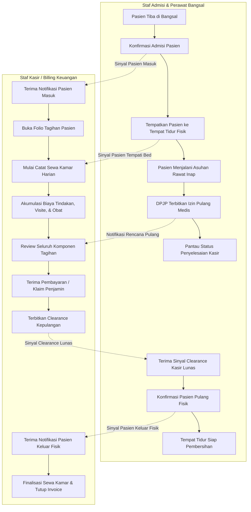

# Flowchart Alur Bisnis Utama — Integrasi Rawat Inap ↔ Kasir / Billing

Dokumen ini memodelkan alur kerja pokok integrasi pelayanan rawat inap dengan pencatatan tagihan di kasir rumah sakit dari penerimaan pasien hingga penyelesaian tagihan akhir.

---

## 1. Diagram Alur Utama (Mermaid Flowchart)

---

## 2. Tabel Rincian Langkah Kerja

| No | Langkah Kerja | Pelaku / Aktor | Masukan (Input) | Keluaran (Output) | Tindakan Bila Mengalami Hambatan / Gagal |
|---:|---|---|---|---|---|
| 1 | Konfirmasi Admisi Masuk | Staf Admisi | Berkas admisi pasien & ruangan yang dituju | Status pasien resmi dirawat; sinyal pasien masuk terbit | Periksa kelengkapan administrasi identitas dan penjamin pasien. |
| 2 | Pembukaan Folio Tagihan | Sistem Kasir / Billing | Sinyal admisi rawat inap | Folio tagihan terbuka berstatus aktif | Bila sistem kasir offline, antrean lokal menyimpan pesan dan mengirim otomatis saat pulih. |
| 3 | Penempatan Bed Fisik | Perawat Bangsal | Pasien tiba di kamar tidur | Jam mulai hunian fisik tercatat | Pastikan nomor tempat tidur dan kelas kamar sesuai fisik ruangan. |
| 4 | Mulai Sewa Kamar Harian | Sistem Kasir / Billing | Sinyal tempat tidur terisi | Perhitungan sewa kamar harian aktif | Sewa kamar tidak boleh aktif sebelum perawat mengonfirmasi tempat tidur terisi fisik. |
| 5 | Izin Pulang Medis | Dokter DPJP | Evaluasi klinis kepulangan pasien | Status izin pulang medis aktif | Pasien tidak boleh dipulangkan bila DPJP belum memberikan persetujuan klinis. |
| 6 | Pelunasan di Loket Kasir | Staf Kasir & Pasien/Penjamin | Rincian seluruh tagihan pelayanan | Pembayaran lunas / persetujuan klaim asuransi | Bila ada sengketa biaya, kasir mengonfirmasi ke unit terkait sebelum cetak invoice. |
| 7 | Penerbitan Clearance | Staf Kasir | Konfirmasi pelunasan administrasi | Status clearance disetujui | Kasir dilarang menyetujui bila masih terdapat tagihan menggantung. |
| 8 | Pelepasan Pasien Fisik | Perawat Bangsal | Pasien selesai berkemas dan menerima obat | Jam kepulangan fisik terkunci; tempat tidur kosong | Perawat memeriksa kembali apakah ada barang pasien yang tertinggal. |
| 9 | Penutupan Tagihan Final | Sistem Kasir / Billing | Sinyal pasien keluar fisik | Invoice resmi tertutup; posting biaya terkunci | Durasi sewa kamar dihitung presisi sampai menit kepulangan fisik pasien. |
