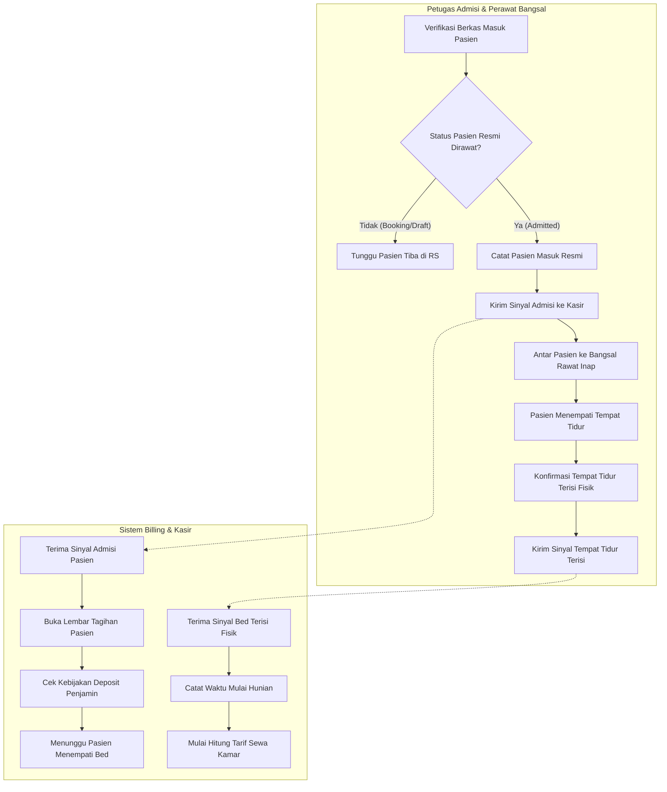

# Flowchart Alur Admisi Masuk & Inisiasi Sewa Kamar

Dokumen ini memodelkan proses sejak pasien disahkan masuk rawat inap, pembuatan folio tagihan di kasir, hingga dimulainya perhitungan sewa kamar harian saat tempat tidur terisi secara fisik.

---

## 1. Diagram Alur Admisi & Sewa Kamar (Mermaid Flowchart)

---

## 2. Tabel Rincian Langkah Kerja

| No | Langkah Kerja | Pelaku / Aktor | Masukan (Input) | Keluaran (Output) | Tindakan Bila Mengalami Hambatan / Gagal |
|---:|---|---|---|---|---|
| 1 | Verifikasi Berkas Admisi | Petugas Admisi | Rujukan dokter & persetujuan rawat inap | Status admisi siap disahkan | Bila penjamin/asuransi belum jelas, arahkan keluarga ke loket admisi penjamin. |
| 2 | Pengesahan Pasien Masuk | Petugas Admisi | Tombol konfirmasi admisi masuk | Status pasien resmi dirawat; sinyal diterbitkan | Bila koneksi terputus, data tersimpan di antrean lokal dan dikirim saat jaringan stabil. |
| 3 | Pembukaan Folio Kasir | Sistem Billing | Sinyal admisi dari rawat inap | Folio tagihan terbuka berstatus aktif | Tagihan belum mengenakan biaya kamar pada tahap ini. |
| 4 | Penempatan Fisik di Bed | Perawat Bangsal | Pasien berbaring di bed ruangan | Waktu mulai hunian fisik tercatat | Pastikan bed yang ditempati sesuai dengan data sistem. |
| 5 | Inisiasi Sewa Kamar | Sistem Billing | Sinyal penempatan tempat tidur | Perhitungan tarif kamar harian mulai aktif | Jika jam masuk melewati batas malam (misal >18.00 atau >22.00), sistem billing menerapkan diskon jam masuk otomatis. |
