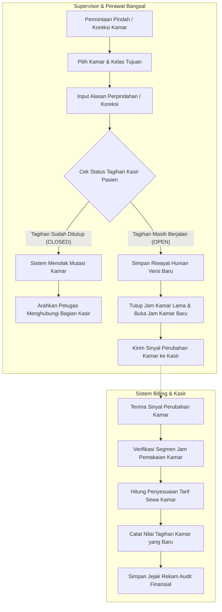

# Flowchart Alur Mutasi & Koreksi Kamar Pasien

Dokumen ini memodelkan proses mutasi pasien (pindah ruangan/kelas) atau koreksi kesalahan data penempatan kamar, termasuk pengecekan status tagihan kasir (`OPEN` vs `CLOSED`).

---

## 1. Diagram Alur Mutasi & Koreksi Kamar (Mermaid Flowchart)

---

## 2. Tabel Rincian Langkah Kerja

| No | Langkah Kerja | Pelaku / Aktor | Masukan (Input) | Keluaran (Output) | Tindakan Bila Mengalami Hambatan / Gagal |
|---:|---|---|---|---|---|
| 1 | Pengajuan Pindah/Koreksi | Perawat / Supervisor | Permintaan keluarga pasien / koreksi kesalahan admisi | Formulir mutasi/koreksi kamar terbuka | Pastikan ketersediaan kamar tujuan telah terkonfirmasi. |
| 2 | Pengisian Alasan Wajib | Supervisor Bangsal | Alasan medis / permintaan kelas pasien | Teks alasan tercatat di formulir | Sistem menolak bila kolom alasan dikosongkan. |
| 3 | Verifikasi Status Tagihan | Sistem Rawat Inap | Pemeriksaan status folio di sistem kasir | Status `OPEN` atau `CLOSED` | Bila tagihan sudah `CLOSED`, mutasi ditolak mutlak untuk mencegah sengketa laporan kasir. |
| 4 | Penutupan & Pembukaan Jam | Perawat Bangsal | Pasien berpindah secara fisik | Segmen kamar lama terkunci jam selesainya; segmen baru aktif jam mulainya | Jam perpindahan dicatat presisi agar durasi di kedua kamar akurat. |
| 5 | Pengiriman Sinyal Koreksi | Sistem Rawat Inap | Data mutasi berversi baru | Sinyal koreksi terkirim via antrean outbox | Jika jaringan terganggu, antrean lokal mengulang kirim otomatis. |
| 6 | Penyesuaian Tarif di Kasir | Sistem Billing | Sinyal perubahan kamar | Tagihan kamar diperbarui sesuai kebijakan tarif pindah kelas | Tidak ada data tagihan lama yang dihapus secara fisik; sistem menerapkan penyesuaian (*adjustment/repricing*). |
