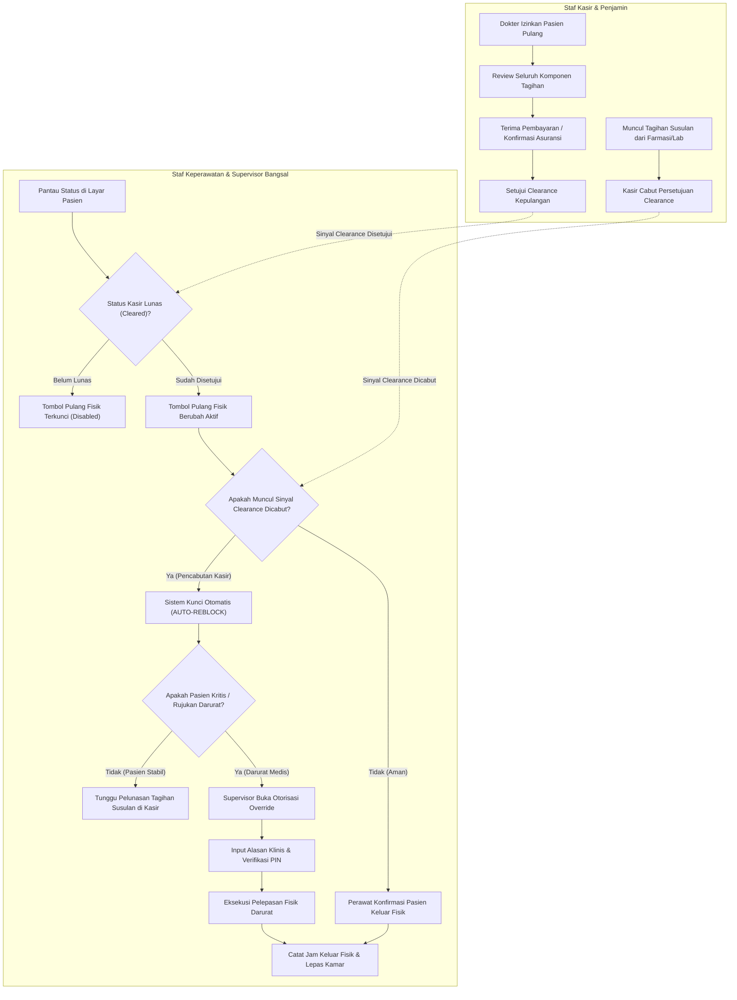

# Flowchart Alur Clearance Kasir, Auto-Reblock, & Supervisor Override

Dokumen ini memodelkan proses persetujuan pemulangan kasir (*Billing Clearance*), penguncian otomatis kembali (*Auto-Reblock*) jika clearance dicabut, serta jalur darurat medis melalui *Supervisor Override*.

---

## 1. Diagram Alur Clearance & Auto-Reblock (Mermaid Flowchart)

---

## 2. Tabel Rincian Langkah Kerja

| No | Langkah Kerja | Pelaku / Aktor | Masukan (Input) | Keluaran (Output) | Tindakan Bila Mengalami Hambatan / Gagal |
|---:|---|---|---|---|---|
| 1 | Persetujuan Kasir | Staf Kasir | Pelunasan tagihan / penjaminan asuransi | Status clearance disetujui | Kasir wajib memeriksa apakah masih ada hasil lab/resep yang belum ditagihkan. |
| 2 | Pengaktifan Tombol Pulang | Sistem Rawat Inap | Sinyal clearance dari kasir | Tombol kepulangan fisik di layar perawat aktif | Bila sinyal terlambat masuk, perawat dapat menekan tombol periksa status kasir. |
| 3 | Pencabutan Clearance | Staf Kasir | Tagihan susulan yang baru diinput | Sinyal clearance dicabut terkirim ke bangsal | Kasir wajib segera menghubungi perawat bangsal via telepon internal. |
| 4 | Kunci Otomatis (Auto-Reblock) | Sistem Rawat Inap | Sinyal pembatalan clearance kasir | Tombol kepulangan fisik terkunci kembali seketika | Pasien dilarang meninggalkan ruangan; keluarga diminta menyelesaikan tagihan tambahan. |
| 5 | Evaluasi Kedaruratan Medis | Dokter / Supervisor Bangsal | Kondisi klinis memburuk / jadwal ambulans rujukan | Keputusan apakah pasien boleh tertahan atau harus segera jalan | Keselamatan nyawa pasien diutamakan di atas prosedur administrasi kasir. |
| 6 | Eksekusi Supervisor Override | Supervisor Bangsal | Formulir darurat, teks alasan medis, dan PIN otorisasi | Izin pemulangan fisik darurat disahkan | Alasan wajib memuat rincian kondisi gawat darurat dan rumah sakit rujukan. |
| 7 | Pelepasan Fisik Pasien | Perawat Bangsal | Pasien meninggalkan ruangan secara nyata | Jam keluar fisik terkunci; tempat tidur berstatus kosong | Perawat mencatat stempel waktu presisi agar perhitungan sewa kamar adil. |
