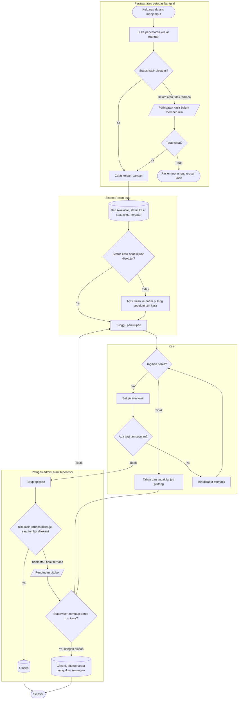

# Flowchart — Keluar ruangan, izin kasir, dan penutupan episode

| Field | Nilai |
|---|---|
| Sub-modul | `integrasi-billing` |
| Kontrak | `1.1.0` — `draft` |
| Proses | `BP-RWF-02` |
| Keputusan | `RWI-DEC-167`, `186`, `187` |
| Menggantikan | `03-clearance-dan-auto-reblock.md` |

| Langkah | Pelaku | Masukan | Keluaran | Bila gagal |
|---|---|---|---|---|
| Buka pencatatan keluar | Perawat, kepala ruangan, admisi, supervisor | Episode `DischargePending` | Badge status kasir | Episode belum boleh pulang: tombol tidak tersedia |
| Akui peringatan | Pencatat | Status kasir bukan disetujui atau tidak terbaca | Pengakuan sekali klik | Pencatat membatalkan; pasien menunggu |
| Catat keluar | Pencatat | Waktu keluar | Bed kosong, tarif kamar terkunci di jam keluar | Waktu tidak valid: pencatat memperbaiki waktu |
| Setujui izin | Kasir | Tagihan final | Izin disetujui | Keluarga belum membayar: episode masuk daftar pantau |
| Tutup | Petugas admisi | Izin disetujui | `Closed` | Ditolak: tunggu kasir, atau minta supervisor |
| Tutup tanpa izin | Supervisor pemegang permission | Alasan jelas | `Closed`, masuk laporan | Alasan kosong: diminta mengisi; tanpa permission: tombol tidak tampil |
