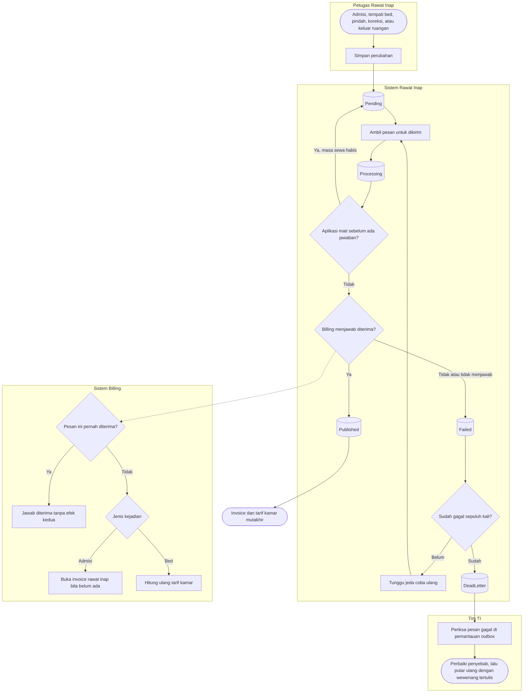

# Flowchart — Ketukan pintu Rawat Inap ke Billing

| Field | Nilai |
|---|---|
| Sub-modul | `integrasi-billing` |
| Kontrak | `1.1.0` — `draft` |
| Proses | `BP-RWF-01` |
| Keputusan | `RWI-DEC-161`, `166`, `192` |

| Langkah | Pelaku | Masukan | Keluaran | Bila gagal |
|---|---|---|---|---|
| Simpan perubahan | Petugas Rawat Inap | Tindakan bisnis | Data tersimpan dan pesan `Pending` | Penyimpanan gagal: tidak ada pesan |
| Kirim | Sistem | Pesan `Pending` atau `Failed` jatuh tempo | `Processing` | Aplikasi mati: diambil ulang setelah masa sewa |
| Terima | Sistem Billing | Penanda kejadian | Invoice dibuka atau tarif kamar dihitung ulang; tanda terima | Billing gangguan: pesan `Failed` dan dicoba ulang |
| Tandai terkirim | Sistem | Tanda terima diterima | `Published` | Tanpa tanda terima, pesan tidak pernah `Published` |
| Tangani pesan gagal | Tim TI | `DeadLetter` | Penyebab diperbaiki | Kasir tetap dapat bekerja pada invoice yang sudah ada |
