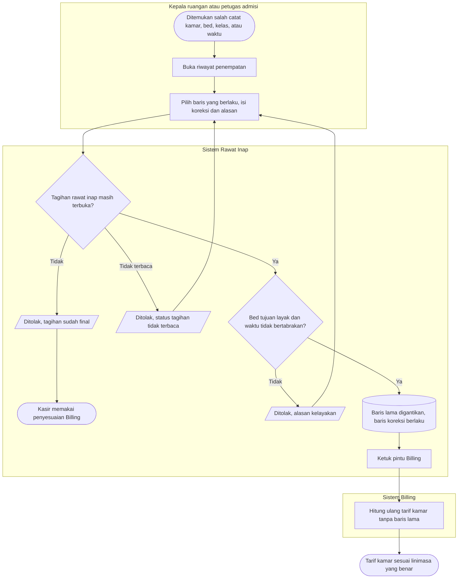
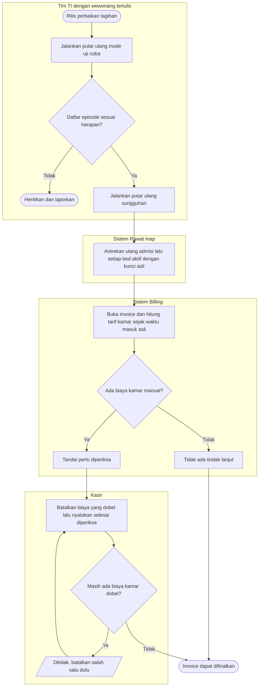

# Flowchart — Koreksi salah catat penempatan dan putar ulang saat rilis

| Field | Nilai |
|---|---|
| Sub-modul | `integrasi-billing` |
| Kontrak | `1.1.0` — `draft` |
| Requirement | `FR-RWF-017`, `FR-RWF-019` |
| Keputusan | `RWI-DEC-157`, `166`, `169`, `192` (g) |

## 1. Koreksi salah catat penempatan

| Langkah | Pelaku | Masukan | Keluaran | Bila gagal |
|---|---|---|---|---|
| Pilih baris | Kepala ruangan, admisi | Riwayat penempatan | Formulir koreksi | Baris yang sudah dikoreksi tidak punya tombol koreksi |
| Simpan koreksi | Sama | Koreksi dan alasan | Baris lama tetap tersimpan, baris koreksi berlaku | Tagihan final: hubungi kasir; versi berubah: muat ulang |
| Hitung ulang | Sistem Billing | Ketukan pintu | Tarif kamar baru | Ketukan gagal: dicoba ulang otomatis |

## 2. Putar ulang saat rilis

| Langkah | Pelaku | Masukan | Keluaran | Bila gagal |
|---|---|---|---|---|
| Uji coba | Tim TI | Alasan | Daftar episode yang akan diproses | Daftar janggal: berhenti |
| Putar ulang | Tim TI | Alasan, wewenang tertulis | Pesan diantrekan ulang | Menjalankan dua kali tidak mengubah apa pun |
| Tandai perlu diperiksa | Sistem Billing | Biaya kamar manual dan otomatis | Invoice ditahan dari finalisasi | — |
| Selesai diperiksa | Kasir | Biaya dobel sudah dibatalkan | Invoice dapat difinalkan | Masih dobel: ditolak |
