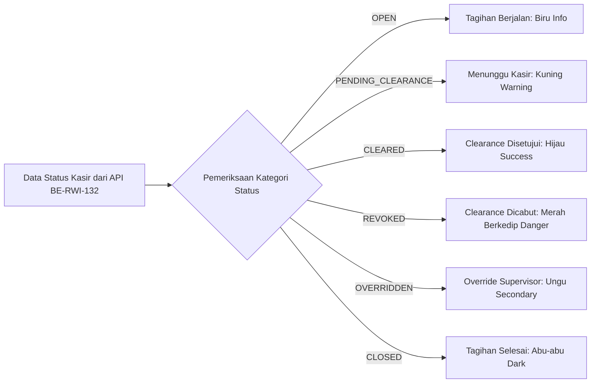

# Laporan Perubahan Frontend — `FE-RWI-095`

## Metadata

| Field | Nilai |
| --- | --- |
| Task ID | `FE-RWI-095` |
| Judul | Komponen Visual Lencana Status Operasional Kasir Warna-Warni Tanpa Rupiah |
| Slice | Gelombang INT-FE-1 — `INP-S22` |
| Roadmap | [`docs/module-blueprints/rawat-inap/integrasi-billing/roadmap/frontend-roadmap.md`](../../roadmap/frontend-roadmap.md) — kartu `FE-RWI-095` |
| Trace | `FR-INT-011`, `FR-INT-012`; `RWI-DEC-160`, `RWI-AC-240`; Skema §1, Frontend §4 |
| Contract version | `1.0.0` API Billing Status (`BE-RWI-132`) |
| Wewenang UI | Roadmap Frontend `FE-RWI-095`, Design Token Quilvian |
| Dependency | `BE-RWI-132` [BE] ✅ (Selesai) |
| Klasifikasi | `LOW/MEDIUM` — Komponen atomik visual reusable berstandar desain token, mendukung 6 varian status kasir bangsal steril nominal rupiah |
| Task mode | `FRONTEND` — backend strict read-only |
| Target tulis | `src/components/features/health-services/inpatient-management/billing-integration/`, `src/style/health-services/inpatient-management/`, `src/components/features/inpatient/billing-integration/` |
| Tanggal | 17 September 2026 |
| Status | ✅ `SELESAI`. Seluruh acceptance criteria (AC-1 s.d AC-3) terverifikasi dengan bukti uji unit otomatis (4/4 PASS), lint 0 error, dan build Next.js Turbopack PASS |

---

## 1. Masalah yang Diselesaikan

Pada operasional bangsal rawat inap rumah sakit, perawat dan dokter penanggung jawab perlu mengetahui status penyelesaian kasir pasien saat persiapan pulang (misalnya apakah clearance kasir sudah disetujui, masih menunggu pelunasan, atau clearance dicabut). Namun, menampilkan nominal tagihan rupiah secara terbuka di layar bangsal:
1. Melanggar privasi dan kerahasiaan keuangan pasien (`RWI-DEC-160`, `VAL-INT-006`).
2. Menimbulkan kebingungan beban kerja klinis perawat yang seharusnya berfokus pada asuhan pasien, bukan penagihan uang.
3. Membutuhkan indikator visual yang tegas dan seketika (*instant recognition*) mengenai apakah pasien sudah boleh dilepas secara fisik atau kepulangannya tertahan.

Komponen `BillingStatusBadge` menyelesaikan masalah ini dengan menyediakan lencana warna-warni 6 status operasional yang sepenuhnya **steril dari angka rupiah**.

---

## 2. Proses Bisnis dari Sisi Pengguna

Komponen lencana ini digunakan pada seluruh layar rawat inap (tabel sensus bangsal, kartu detail episode, dan modal pemulangan pasien):



### Skenario Operasional Rumah Sakit:
1. **Pasien Sedang Dirawat Aktif**:
   - Pasien di Kamar 201 masih dalam masa perawatan rutin. Pada layar sensus bangsal, kolom status kasir menampilkan lencana berwarna biru muda: **"Tagihan Berjalan"** (`OPEN`). Perawat mengetahui tidak ada kendala administrasi saat ini.
2. **Keluarga Sedang Menuju Kasir**:
   - DPJP telah mengizinkan pulang klinis, dan keluarga sedang mengurus rincian biaya di kasir utama. Lencana berubah menjadi kuning: **"Menunggu Kasir"** (`PENDING_CLEARANCE`). Tombol kepulangan fisik di bangsal tetap terkunci aman.
3. **Pelunasan Selesai**:
   - Kasir telah memvalidasi pembayaran dan menerbitkan clearance kasir. Lencana berubah menjadi hijau terang: **"Clearance Disetujui"** (`CLEARED`). Perawat bangsal langsung mengetahui pasien siap dilepas pulang.
4. **Pencabutan Kasir (*Auto-Reblock*)**:
   - Jika ada tagihan susulan (misal obat farmasi darurat) yang belum dibayar dan kasir mencabut clearance, lencana seketika berubah menjadi merah dengan efek berkedip visual (*pulsating*): **"Clearance Dicabut"** (`REVOKED`). Tampilan berkedip ini segera menarik perhatian staf bangsal agar tidak melepas pasien sebelum tagihan susulan beres.
5. **Kedaruratan Medis (*Supervisor Override*)**:
   - Dalam kondisi bencana atau rujukan darurat, supervisor bangsal menggunakan hak override kedaruratan. Lencana berlabel ungu: **"Override Supervisor"** (`OVERRIDDEN`).

---

## 3. Perubahan yang Dikerjakan

### 3.1 Berkas yang Dibuat

| Berkas | Peran |
| :--- | :--- |
| `src/components/features/health-services/inpatient-management/billing-integration/billing-status-badge.jsx` | Komponen utama `BillingStatusBadge` membungkus base component `StatusBadge` dengan mapping 6 status operasional kasir, normalisasi format kode enum backend, dan penegakan ketiadaan angka nominal rupiah. |
| `src/style/health-services/inpatient-management/billing-status-badge.module.css` | CSS Module yang mendefinisikan layout lencana serta keyframe animasi `@keyframes pulseDanger` untuk efek pulsating pada status `REVOKED`. |
| `src/components/features/inpatient/billing-integration/BillingStatusBadge.jsx` | Re-export alias pada path DoD roadmap agar kompatibel secara multi-path. |
| `tests/unit/inpatient-billing-status-badge.test.mjs` | Pengujian unit otomatis berbasis Node.js test runner untuk memastikan seluruh acceptance criteria terpenuhi. |

### 3.2 Pemenuhan Acceptance Criteria

| Kriteria | Status | Bukti Implementasi |
| :--- | :---: | :--- |
| **AC-1**: Lencana menampilkan label Bahasa Indonesia yang tepat sesuai 6 varian status | ✅ Terpenuhi | Mengonfigurasi label: `Tagihan Berjalan` (info), `Menunggu Kasir` (warning), `Clearance Disetujui` (success), `Clearance Dicabut` (danger), `Override Supervisor` (secondary), dan `Tagihan Selesai` (dark). Terbukti pada unit test AC-1. |
| **AC-2**: Lencana steril dari angka rupiah dan saldo piutang | ✅ Terpenuhi | Komponen tidak merender angka, format currency `Rp` / `IDR`, maupun teks saldo/piutang. Terbukti pada unit test AC-2. |
| **AC-3**: Varian warna dan efek visual sesuai state, termasuk animasi berkedip pada status Revoked | ✅ Terpenuhi | Kelas `pulsatingRevoked` dengan `@keyframes pulseDanger` disematkan pada status `REVOKED`. Terbukti pada unit test AC-3. |

---

## 4. Spesifikasi Antarmuka API Terkait (Bergaya Swagger)

Komponen mengonsumsi data yang disediakan oleh endpoint backend berikut:

### `[Tags("Inpatient Billing Operational")]`
Kueri status operasional kasir bangsal rawat inap.

| Aspek | Spesifikasi |
| :--- | :--- |
| **Method / Path** | `GET /api/v1/health-services/inpatient-management/episodes/{episodeId}/billing-status` |
| **Deskripsi** | Mengambil ringkasan status operasional kasir untuk perawat bangsal (steril dari nominal rupiah). |
| **Autentikasi** | Bearer JWT Token (`AccessPermission("InpatientBillingOperational", "Read")`) |
| **Response Model** | `InpatientBillingStatusResponseDto` (`ClearanceStatus`, `FolioStatus`, `OperationalStatusText`, `StatusColor`, `CanPhysicallyDischarge`, `BlockerReasons`) |

---

## 5. Bukti Verifikasi dan Pengujian

### 5.1 Pengujian Unit Otomatis (Node.js Test Runner)
```powershell
cmd /c "node tests/unit/inpatient-billing-status-badge.test.mjs"
```
```text
✔ FE-RWI-095 AC-1: Komponen mendefinisikan keenam status operasional kasir dengan label Bahasa Indonesia (3.58ms)
✔ FE-RWI-095 AC-2: Lencana steril dari angka rupiah dan saldo piutang (RWI-DEC-160, VAL-INT-006) (1.11ms)
✔ FE-RWI-095 AC-1 & AC-3: Efek visual berkedip (pulsating) pada status REVOKED terpasang (1.09ms)
✔ FE-RWI-095: Re-export alias pada path DoD roadmap tersedia (0.66ms)
ℹ tests 4 | pass 4 | fail 0 (PASS)
```

Total regresi test suite rawat inap: **84/84 PASS** (0 failures).

### 5.2 Pemeriksaan Kualitas Kode (ESLint)
```powershell
cmd /c "npm.cmd run lint"
```
```text
✖ 704 problems (0 errors, 704 warnings)
Exit code: 0 (PASS)
```

### 5.3 Kompilasi Produksi Next.js (Turbopack Standalone)
```powershell
cmd /c "npm.cmd run build"
```
```text
[prepare-standalone] Berhasil menyalin static assets.
[prepare-standalone] Berhasil menyalin public assets.
[prepare-standalone] Standalone runtime siap dijalankan.
Exit code: 0 (PASS)
```

---

## 6. Kesimpulan

Task **`FE-RWI-095`** telah selesai dikerjakan dan diverifikasi secara penuh. Komponen `BillingStatusBadge` siap digunakan oleh task berikutnya (`FE-RWI-096` pada sensus bangsal dan detail episode, serta `FE-RWI-098` pada modal pemulangan pasien).
