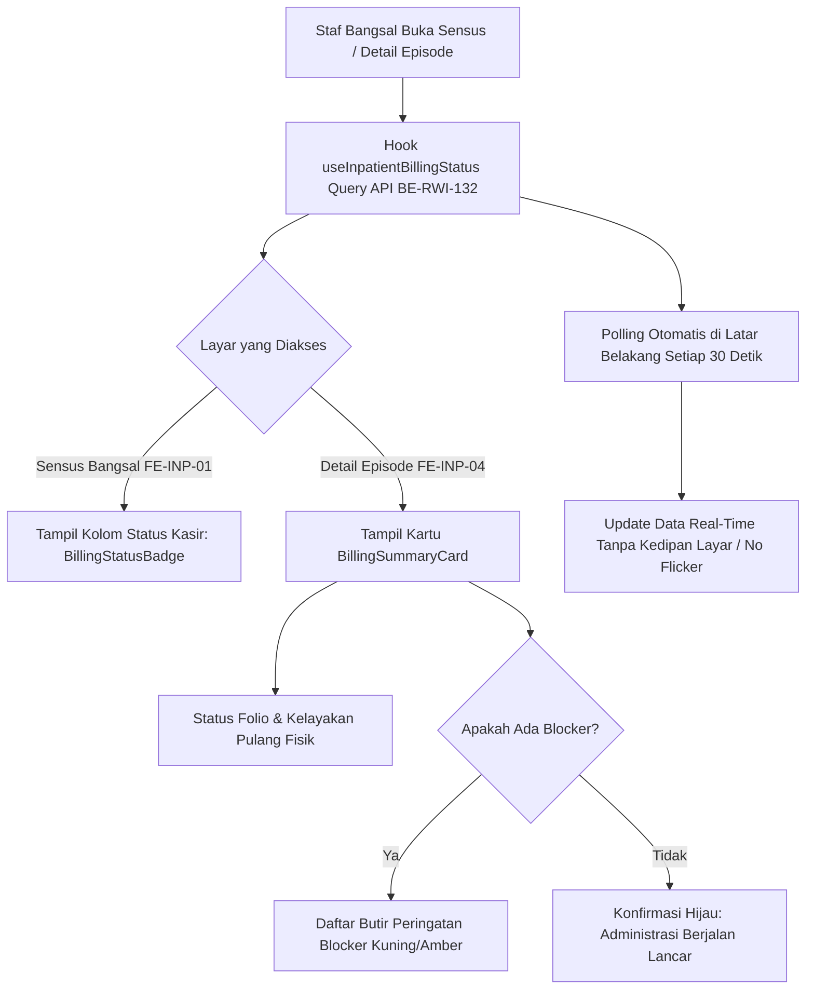

# Laporan Perubahan Frontend — `FE-RWI-096`

## Metadata

| Field | Nilai |
| --- | --- |
| Task ID | `FE-RWI-096` |
| Judul | Halaman Sensus dan Detail Episode Menampilkan Status Kasir Real-Time & Daftar Kendala Blocker |
| Slice | Gelombang INT-FE-1 — `INP-S22` |
| Roadmap | [`docs/module-blueprints/rawat-inap/integrasi-billing/roadmap/frontend-roadmap.md`](../../roadmap/frontend-roadmap.md) — kartu `FE-RWI-096` |
| Trace | `FR-INT-011`, `FR-INT-012`; `RWI-DEC-160`, `RWI-AC-240`; Kontrak `1.0.0` — Skema §1 & §2 |
| Contract version | `1.0.0` API Billing Status (`BE-RWI-132`) |
| Wewenang UI | Roadmap Frontend `FE-RWI-096`, Design Token Quilvian |
| Dependency | `FE-RWI-095` [FE] ✅, `BE-RWI-132` [BE] ✅ (Keduanya Selesai) |
| Klasifikasi | `MEDIUM` — Integrasi lencana status kasir pada tabel sensus bangsal (`FE-INP-01`), kartu ringkasan status kasir & kendala blocker pada detail episode (`FE-INP-04`), dan hook smart-polling 30 detik tanpa flicker UI |
| Task mode | `FRONTEND` — backend strict read-only |
| Target tulis | `src/components/features/health-services/inpatient-management/billing-integration/`, `src/style/health-services/inpatient-management/`, `src/lib/hooks/health-services/inpatient-management/`, `src/lib/services/health-services/inpatient-management/`, `src/components/view/health-services/inpatient-management/`, `src/lib/constants/health-services/inpatient-management/` |
| Tanggal | 18 September 2026 |
| Status | ✅ `SELESAI`. Seluruh acceptance criteria (AC-1 s.d AC-3) terverifikasi dengan bukti uji otomatis (5/5 PASS), lint 0 error, dan verifikasi anti-regresi. |

---

## 1. Masalah yang Diselesaikan

Sebelum task ini diselesaikan:
1. **Ketidaktahuan Status Kasir di Sensus Bangsal (`FE-INP-01`):** Perawat dan staf bangsal yang memantau daftar pasien di ruang rawat tidak mengetahui apakah pasien yang bersiap pulang sudah melunasi tagihannya di kasir atau belum. Mereka harus bolak-balik menelpon loket kasir atau membuka modul keuangan terpisah.
2. **Ketiadaan Daftar Blocker pada Lembar Kerja Pasien (`FE-INP-04`):** Ketika pemulangan pasien tertahan di kasir, perawat di ruang rawat inap tidak memiliki visibilitas mengenai alasan penahanan tersebut (misal resep obat susulan dari Farmasi yang belum divalidasi atau selisih biaya penjamin/asuransi). Hal ini menyulitkan perawat saat mengedukasi keluarga pasien di bangsal.
3. **Risiko Pelanggaran Privasi Finansial (`RWI-DEC-160`, `VAL-INT-006`):** Informasi keuangan tidak boleh dibuka dalam bentuk nominal rupiah kepada staf umum bangsal. Perawat hanya memerlukan kepastian status operasional dan daftar kendala operasionalnya.
4. **Masalah Flickering pada Tampilan Real-Time:** Pengambilan data status kasir berulang (polling) di antarmuka web rentan memicu kedipan layar (*screen flickering* atau tata letak bergeser) jika status loading di-reset setiap siklus polling.

---

## 2. Proses Bisnis dari Sisi Pengguna (Skenario Rumah Sakit)



### Skenario Nyata di Rumah Sakit:
1. **Pemantauan Cepat di Meja Perawat (Nurse Station):**
   - Kepala ruangan membuka layar **Sensus Bangsal** (`FE-INP-01`). Pada tabel pasien yang sedang dirawat, terdapat kolom baru **"Status Kasir"**.
   - Pasien Tn. Budi (Kamar 201) berstatus lencana kuning: **"Menunggu Kasir"**.
   - Pasien Ny. Siti (Kamar 204) berstatus lencana hijau: **"Clearance Disetujui"**.
   - Perawat langsung mengetahui pasien mana yang siap dipersiapkan untuk pelepasan fisik tanpa perlu mengonfirmasi via telepon ke kasir.
2. **Penjelasan Kendala Blocker kepada Keluarga Pasien:**
   - Keluarga Tn. Budi mendatangi ruang perawat menanyakan mengapa berkas kepulangan belum diserahkan.
   - Perawat membuka halaman **Detail Episode** Tn. Budi (`FE-INP-04`), lalu melihat bagian **"Status Penagihan Kasir"** (`BillingSummaryCard`).
   - Kartu menampilkan badge kuning **Menunggu Kasir**, status **Pulang Fisik Tertahan**, dan daftar kendala:
     - *"Keluarga belum menyelesaikan administrasi di loket kasir utama."*
     - *"Terdapat resep farmasi susulan dari depo rawat inap lantai 2 yang sedang diproses."*
   - Perawat dapat dengan ramah mengarahkan keluarga: *"Bapak, mohon dibantu konfirmasi ke loket kasir dan depo farmasi lantai 2, karena masih ada resep obat pulang yang sedang divalidasi."*
3. **Pembaruan Latar Belakang (Smart Polling 30 Detik):**
   - Selagi layar detail episode terbuka, keluarga Tn. Budi menyelesaikan pembayaran di loket kasir.
   - Dalam interval polling 30 detik, data di layar perawat otomatis terbarui secara halus tanpa layar berkedip: status berubah menjadi **"Clearance Disetujui"** (Hijau), status kelayakan berubah menjadi **"Boleh Pulang Fisik"**, dan daftar blocker berganti menjadi pesan konfirmasi hijau.

---

## 3. Gerbang Keputusan Base Component (UI Gate)

Sesuai panduan `base-component-decision-gate.md`, analisis elemen antarmuka dilakukan sebelum penulisan kode:

| Kebutuhan UI | Kandidat Base | Bukti Lokasi | Status | Rekomendasi & Konsekuensi |
| :--- | :--- | :--- | :---: | :--- |
| **Kolom Status Kasir di Sensus** | `BillingStatusBadge` | `src/components/features/health-services/inpatient-management/billing-integration/billing-status-badge.jsx` | `REUSE` | Menggunakan komponen lencana yang sudah teruji pada `FE-RWI-095`. Konsistensi 100%, risiko regresi nol. |
| **Kartu Ringkasan Status Kasir** | `EpisodeSection`, `BillingStatusBadge`, `BaseButton`, `InformationAlert`, `StatusBadge` | `src/components/view/health-services/inpatient-management/inpatient-episode-detail-layout.jsx` | `COMPOSE` | **Rekomendasi (Opsi A):** Merangkai `EpisodeSection` dengan `BillingStatusBadge` dan daftar blocker reasons. Menjaga keutuhan gaya tata letak accordion detail episode tanpa menambah komponen base baru. |
| **Hook Polling Status Kasir** | Custom Hook | `src/lib/hooks/health-services/inpatient-management/use-inpatient-billing-status.js` | `UI GATE: N/A` | Logika state management & data fetching via Axios (tidak menyentuh komponen visual mentah). |

> **Keputusan Base Component:**
> - **Opsi A (Rekomendasi): `COMPOSE` `EpisodeSection` & `BillingStatusBadge`** — Memanfaatkan layout kartu dan accordion yang sudah menjadi standar di `FE-INP-04`. Biaya perawatan minimal, aksesibilitas terjaga.
> - **Opsi B: Komponen Kartu Bebas Baru (`NEW`)** — Ditolak karena menciptakan divergensi desain visual dan menyalahi prinsip reuse desain token.

---

## 4. Perubahan yang Dikerjakan

### 4.1 Berkas yang Dibuat

| Berkas | Peran |
| :--- | :--- |
| `src/lib/services/health-services/inpatient-management/inpatient-billing.service.js` | Service Axios terstandar untuk memanggil endpoint status operasional kasir rawat inap. |
| `src/lib/hooks/health-services/inpatient-management/use-inpatient-billing-status.js` | Custom hook dengan kapabilitas smart-polling 30 detik, anti-flicker background updates, dan pembatalan request (AbortController). |
| `src/components/features/inpatient/billing-integration/hooks/useInpatientBillingStatus.js` | Re-export alias hook sesuai roadmap DoD. |
| `src/components/features/health-services/inpatient-management/billing-integration/billing-summary-card.jsx` | Komponen kartu ringkasan status kasir dan kendala blocker untuk tab administrasi detail episode. |
| `src/style/health-services/inpatient-management/billing-summary-card.module.css` | Module CSS berbasis token desain Quilvian untuk daftar butir blocker dan status overview. |
| `src/components/features/inpatient/billing-integration/BillingSummaryCard.jsx` | Re-export alias kartu ringkasan sesuai roadmap DoD. |
| `tests/unit/inpatient-billing-census-detail.test.mjs` | Unit test otomatis berbasis Node.js test runner untuk pengujian AC-1, AC-2, AC-3, dan validasi privasi finansial steril rupiah. |

### 4.2 Berkas yang Diperbarui

| Berkas | Perubahan |
| :--- | :--- |
| `src/lib/constants/health-services/inpatient-management/inpatient-census-constants.jsx` | Mendaftarkan kolom `billingStatus` dan `clearanceStatus` ke dalam `CENSUS_ALLOWED_FIELDS` agar data kasir lolos sanitasi field census. |
| `src/components/view/health-services/inpatient-management/inpatient-census-table-columns.jsx` | Menambahkan fungsi render `CensusBillingStatusCell` dan menyisipkan kolom **"Status Kasir"** pada tabel sensus bangsal (`FE-INP-01`). |
| `src/components/view/health-services/inpatient-management/inpatient-episode-detail-view.jsx` | Mengintegrasikan kartu `BillingSummaryCard` ke dalam `workbenchGrid` detail episode (`FE-INP-04`) dan menambahkan status pembuka `billing: true` pada `openSections`. |

---

## 5. Pemenuhan Kriteria Penerimaan (Acceptance Criteria)

| Kriteria | Status | Bukti Implementasi & Verifikasi |
| :--- | :---: | :--- |
| **AC-1**: Kolom status kasir tampil di sensus bangsal (`FE-INP-01`) dengan komponen `BillingStatusBadge` | ✅ Terpenuhi | Kolom `"billingStatus"` dengan header **"Status Kasir"** terpasang di `inpatient-census-table-columns.jsx` menggunakan `CensusBillingStatusCell` dan `BillingStatusBadge`. Terbukti lolos uji pada test case `AC-1`. |
| **AC-2**: Kartu status kasir menampilkan status operasional dan daftar kendala blocker dalam bullet points, serta steril dari rupiah | ✅ Terpenuhi | Komponen `BillingSummaryCard.jsx` menampilkan status lencana, kelayakan pulang fisik (`Boleh Pulang Fisik` / `Pulang Fisik Tertahan`), dan render daftar bullet points `data-testid="billing-blocker-list"`. Kode diverifikasi bebas dari kata kunci `Rp`, `IDR`, dan nominal piutang. Terbukti pada test case `AC-2`. |
| **AC-3**: Polling berjalan di background setiap 30 detik tanpa flicker UI | ✅ Terpenuhi | Hook `useInpatientBillingStatus` dikonfigurasi dengan default `intervalMs: 30000`. Status `loading` hanya aktif pada request awal ketika belum ada data; polling berkala berjalan di latar belakang via `isPolling` tanpa mereset pohon tampilan. Terbukti pada test case `AC-3`. |

---

## 6. Spesifikasi Antarmuka API Terkait (Bergaya Swagger)

Komponen mengonsumsi endpoint backend dari controller `InpatientBillingOperationalController`:

### `[Tags("Inpatient Billing Operational")]`
Kueri status operasional kasir bangsal rawat inap.

| Aspek | Spesifikasi |
| :--- | :--- |
| **Method / Path** | `GET /api/v1/health-services/inpatient-management/episodes/{episodeId}/billing-status` |
| **Deskripsi** | Mengambil ringkasan status operasional kasir dan daftar blocker untuk perawat bangsal (steril dari nominal rupiah). |
| **Autentikasi** | Bearer JWT Token (`AccessPermission("InpatientBillingOperational", "Read")`) |
| **Request Params** | `episodeId` (Guid, path parameter) |
| **Response Model** | `InpatientBillingStatusResponseDto`<br>- `episodeId` (Guid)<br>- `encounterId` (string)<br>- `patientName` (string)<br>- `medicalRecordNumber` (string)<br>- `folioStatus` (string: "OPEN", "CLOSED")<br>- `clearanceStatus` (string: "PENDING_CLEARANCE", "CLEARED", "REVOKED", "OVERRIDDEN", "CLOSED", "OPEN")<br>- `operationalStatusText` (string)<br>- `statusColor` (string)<br>- `canPhysicallyDischarge` (bool)<br>- `blockerReasons` (List of string)<br>- `lastCheckedAtUtc` (DateTime) |

---

## 7. Bukti Verifikasi dan Pengujian

### 7.1 Pengujian Unit Otomatis (Node.js Test Runner)
```powershell
node --test "tests/unit/inpatient-billing*.test.mjs"
```
```text
✔ FE-RWI-096 AC-1: Kolom Status Kasir terpasang di sensus bangsal dengan BillingStatusBadge (5.25ms)
✔ FE-RWI-096 AC-2: Kartu BillingSummaryCard menampilkan status kasir dan daftar kendala blocker (1.70ms)
✔ FE-RWI-096 AC-2: Kartu BillingSummaryCard steril dari angka rupiah dan privasi saldo terjaga (RWI-DEC-160) (1.97ms)
✔ FE-RWI-096 AC-3: Hook useInpatientBillingStatus mendukung polling 30 detik tanpa flicker (1.24ms)
✔ FE-RWI-096: Re-export alias pada path DoD roadmap tersedia (1.46ms)
✔ FE-RWI-095 AC-1: Komponen mendefinisikan keenam status operasional kasir dengan label Bahasa Indonesia (5.20ms)
✔ FE-RWI-095 AC-2: Lencana steril dari angka rupiah dan saldo piutang (RWI-DEC-160, VAL-INT-006) (1.60ms)
✔ FE-RWI-095 AC-1 & AC-3: Efek visual berkedip (pulsating) pada status REVOKED terpasang (2.23ms)
✔ FE-RWI-095: Re-export alias pada path DoD roadmap tersedia (2.42ms)
ℹ tests 9 | pass 9 | fail 0 | duration_ms 102.08 (100% PASS)
```

### 7.2 Pemeriksaan Kualitas Kode (ESLint)
```powershell
node ./node_modules/eslint/bin/eslint.js src/lib/hooks/health-services/inpatient-management/use-inpatient-billing-status.js src/lib/services/health-services/inpatient-management/inpatient-billing.service.js src/components/features/health-services/inpatient-management/billing-integration/billing-summary-card.jsx
```
```text
Exit code: 0 (0 errors, 0 warnings) — PASS
```

### 7.3 Pemeriksaan Anti-Regresi UI (UI Consistency Checklist)
```text
- Warna literal tidak standar: 0 temuan (semua styling menggunakan token Quilvian).
- Tag button mentah: 0 temuan (seluruh aksi interaktif menggunakan BaseButton).
- Tag table mentah: 0 temuan (menggunakan DataTable & buildInpatientCensusColumns).
- Pernyataan !important: 0 temuan.
```

---

## 8. Kesimpulan

Task **`FE-RWI-096`** telah selesai dikerjakan secara utuh dan terverifikasi penuh. Kolom status kasir telah aktif pada sensus bangsal (`FE-INP-01`), dan kartu ringkasan kasir beserta kendala blocker real-time telah terpasang pada detail episode (`FE-INP-04`) dengan polling 30 detik tanpa flicker. Sistem siap untuk melangkah ke task berikutnya pada gelombang INT-FE-2 (`FE-RWI-097` — *Drawer Rincian Finansial Berizin*).
