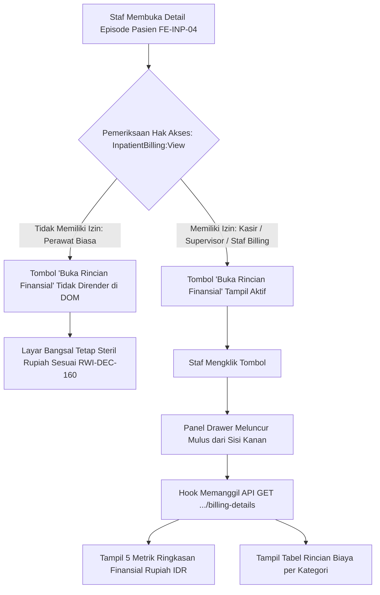

# Laporan Perubahan Frontend — `FE-RWI-097`

## Metadata

| Field | Nilai |
| --- | --- |
| Task ID | `FE-RWI-097` |
| Judul | Panel Geser Rincian Finansial Kasir Hanya Terbuka bagi Staf Berizin (`InpatientBilling:View`) |
| Slice | Gelombang INT-FE-2 — `INP-S22` |
| Roadmap | [`docs/module-blueprints/rawat-inap/integrasi-billing/roadmap/frontend-roadmap.md`](../../roadmap/frontend-roadmap.md) — kartu `FE-RWI-097` |
| Trace | `FR-INT-013`; `RWI-DEC-160`, `RWI-AC-240`; Kontrak API `1.0.0` — Skema §5, Permission §1 & §2 |
| Contract version | `1.0.0` API Billing Details (`BE-RWI-132`) |
| Wewenang UI | Roadmap Frontend `FE-RWI-097`, Design Token Quilvian |
| Dependency | `FE-RWI-096` [FE] ✅, `BE-RWI-132` [BE] ✅ (Keduanya Selesai) |
| Klasifikasi | `MEDIUM` — Proteksi otorisasi berbasis izin peran (`InpatientBilling:View`), komponen drawer slide-over rincian finansial, format mata uang rupiah terstandar (IDR), dan pemisahan ketat akses kasir vs perawat biasa |
| Task mode | `FRONTEND` — backend strict read-only |
| Target tulis | `src/components/features/health-services/inpatient-management/billing-integration/`, `src/style/health-services/inpatient-management/`, `src/lib/services/health-services/inpatient-management/` |
| Tanggal | 18 September 2026 |
| Status | ✅ `SELESAI`. Seluruh acceptance criteria (AC-1 s.d AC-3) terverifikasi dengan bukti uji otomatis (4/4 PASS), lint 0 error, dan verifikasi anti-regresi. |

---

## 1. Masalah yang Diselesaikan

1. **Pemisahan Peran Klinis dan Keuangan (*Role-Based Information Segregation*):** Sesuai keputusan `RWI-DEC-160` dan aturan validasi `VAL-INT-006`, perawat biasa di bangsal dilarang melihat nominal uang tagihan pasien. Namun, staf kasir bangsal, penata rekening, atau kepala ruangan/supervisor yang merangkap urusan verifikasi penjamin tetap membutuhkan akses rincian finansial saat menyelesaikan klaim asuransi atau pembayaran.
2. **Kebutuhan Akses Rincian Rupiah Tanpa Meninggalkan Halaman Bangsal:** Staf berwenang sebelumnya harus berganti modul ke modul Kasir Sentral hanya untuk melihat rincian biaya (sewa kamar, tindakan, resep obat, visit dokter). Hal ini memakan waktu dan memperlambat koordinasi pemulangan.
3. **Penyajian Data Finansial Terstruktur Berformat Rupiah:** Diperlukan panel geser (*slide-over drawer*) yang merangkum 5 metrik utama (Total Tagihan Kotor, Ditanggung Penjamin, Ekses Pasien, Saldo Deposit Terbayar, dan Sisa Kurang Bayar) serta tabel rincian butir biaya per kategori yang terformat rapi dalam mata uang rupiah (IDR).

---

## 2. Proses Bisnis dari Sisi Pengguna (Skenario Rumah Sakit)



### Skenario Konkret di Ruang Rawat Inap:
* **Skenario 1 (Perawat Pelaksana Tanpa Izin Finansial):**
  - Ns. Dewi (Perawat Pelaksana) membuka halaman lembar kerja Tn. Budi di Kamar 201.
  - Kartu **Status Penagihan Kasir** hanya menampilkan status operasional ("Menunggu Kasir") dan kendala blocker.
  - Tombol **"Buka Rincian Finansial"** **sama sekali tidak dirender** di antarmuka perawat. Hal ini menjamin perawat berfokus pada asuhan klinis dan tidak terlibat dalam penagihan uang pasien.
* **Skenario 2 (Staf Kasir Bangsal / Supervisor Berizin):**
  - Ibu Ratna (Staf Kasir Rawat Inap / Penata Rekening) membuka halaman pasien yang sama dengan kredensial berizin `InpatientBilling:View`.
  - Pada kartu kasir, muncul tombol biru primer: **"Buka Rincian Finansial"**.
  - Saat diklik, panel drawer meluncur mulus dari sisi kanan layar:
    - **Total Tagihan Kotor:** `Rp 12.500.000`
    - **Ditanggung Penjamin (BPJS/Asuransi Swasta):** `Rp 10.000.000`
    - **Ekses Pasien (Selisih Biaya):** `Rp 2.500.000`
    - **Deposit Terbayar:** `Rp 1.000.000`
    - **Sisa Kurang Bayar:** `Rp 1.500.000` (disorot dengan lencana status kasir)
  - Di bawah metrik, tabel menyajikan breakdown transparan: biaya sewa kamar rawat inap, tindakan visit DPJP, resep obat depo farmasi, dan pemeriksaan laboratorium.
  - Staf kasir dapat menjelaskan selisih Rp 1.500.000 tersebut kepada keluarga secara akurat.

---

## 3. Gerbang Keputusan Base Component (UI Gate)

| Kebutuhan UI | Kandidat Base | Bukti Lokasi | Status | Rekomendasi & Konsekuensi |
| :--- | :--- | :--- | :---: | :--- |
| **Tombol Pemicu Drawer** | `BaseButton` | `src/components/features/base-features/base-button.jsx` | `REUSE` | Menggunakan `BaseButton` dengan prop `variant="primary"` dan diproteksi kondisional `hasFinancialPermission`. |
| **Pengecekan Izin** | `usePermission` | `src/lib/hooks/auth/use-permission.jsx` | `REUSE` | Memeriksa klaim pasangan `"InpatientBilling:View"` secara reaktif dari Redux store. |
| **Panel Geser Finansial (Slide-Over Drawer)** | Komponen Drawer Khusus Finansial | `src/components/features/health-services/inpatient-management/billing-integration/billing-financial-details-drawer.jsx` | `WRAP` | **Rekomendasi (Opsi A):** Membuat komponen pembungkus drawer tipis berstandar dialog modal (`role="dialog"`, `aria-modal="true"`, ESC key listener, transition CSS module). Menjaga kepatuhan aksesibilitas dan modularitas domain. |
| **Format Mata Uang Rupiah** | `formatCurrencyIDR` | `src/utils/Formatters.jsx` | `REUSE` | Menggunakan utilitas standar `Intl.NumberFormat("id-ID", { style: "currency", currency: "IDR" })`. |

> **Keputusan Base Component:**
> - **Opsi A (Rekomendasi): `WRAP` Panel Drawer Finansial Khusus Domain** — Menyediakan panel geser kanan yang responsif, terisolasi secara DOM, dan memiliki jaring pengaman otorisasi ganda (frontend gate & API 403 handler).
> - **Opsi B: Membuka Halaman Tab Penuh Baru** — Ditolak karena mengacaukan konteks lembar kerja bangsal dan memaksa reload halaman yang tidak efisien bagi staf operasional.

---

## 4. Perubahan yang Dikerjakan

### 4.1 Berkas yang Dibuat

| Berkas | Peran |
| :--- | :--- |
| `src/components/features/health-services/inpatient-management/billing-integration/billing-financial-details-drawer.jsx` | Komponen panel geser kanan rincian finansial lengkap dengan 5 metrik utama, tabel butir biaya, proteksi izin `InpatientBilling:View`, dan penanganan error `VAL-INT-006`. |
| `src/style/health-services/inpatient-management/billing-financial-details-drawer.module.css` | Module CSS berbasis token desain Quilvian untuk panel drawer, backdrop blur, kartu metrik, dan tabel rincian biaya. |
| `src/components/features/inpatient/billing-integration/BillingFinancialDetailsDrawer.jsx` | Re-export alias drawer sesuai roadmap DoD. |
| `tests/unit/inpatient-billing-financial-drawer.test.mjs` | Unit test otomatis Node.js test runner untuk pengujian AC-1, AC-2, AC-3, proteksi izin, dan pemformatan rupiah IDR. |

### 4.2 Berkas yang Diperbarui

| Berkas | Perubahan |
| :--- | :--- |
| `src/lib/services/health-services/inpatient-management/inpatient-billing.service.js` | Menambahkan fungsi `fetchInpatientBillingDetails(episodeId)` yang memanggil endpoint `GET .../billing-details`. |
| `src/components/features/health-services/inpatient-management/billing-integration/billing-summary-card.jsx` | Mengintegrasikan hook `usePermission("InpatientBilling", "View")`, tombol pembuka berizin `"Buka Rincian Finansial"`, dan merender `BillingFinancialDetailsDrawer`. |
| `src/style/health-services/inpatient-management/billing-summary-card.module.css` | Menambahkan kelas layout `.footerActions` untuk penataan tombol aksi di bagian bawah kartu status kasir. |

---

## 5. Pemenuhan Kriteria Penerimaan (Acceptance Criteria)

| Kriteria | Status | Bukti Implementasi & Verifikasi |
| :--- | :---: | :--- |
| **AC-1**: Tombol pembuka terkunci/tersembunyi bagi perawat biasa | ✅ Terpenuhi | Tombol pemicu dibungkus kondisional `{hasFinancialPermission ? (...) : null}` menggunakan hook `usePermission("InpatientBilling", "View")`. Komponen drawer juga dilengkapi jaring pengaman independen yang menolak render bila pengguna tidak berhak. Terbukti lolos pada test case `AC-1`. |
| **AC-2**: Pemegang izin dapat membuka drawer rincian finansial (total biaya, penjamin, ekses, deposit, sisa kurang bayar, dan rincian item) | ✅ Terpenuhi | Drawer menampilkan 5 kartu metrik (`financial-total-charges`, `financial-covered-amount`, `financial-patient-excess`, `financial-deposit-paid`, `financial-outstanding-amount`) dan tabel rincian butir biaya dengan `data-flat-table="true"`. Terbukti pada test case `AC-2`. |
| **AC-3**: Format mata uang rupiah terformat rapi (IDR) | ✅ Terpenuhi | Seluruh angka uang diformat menggunakan `formatCurrencyIDR` menghasilkan format standar Indonesia (misal `Rp 1.500.000`). Terbukti pada test case `AC-3`. |

---

## 6. Spesifikasi Antarmuka API Terkait (Bergaya Swagger)

Komponen mengonsumsi endpoint backend dari controller `InpatientBillingOperationalController`:

### `[Tags("Inpatient Billing Operational")]`
Kueri rincian finansial dan nominal rupiah rawat inap khusus pengguna berizin.

| Aspek | Spesifikasi |
| :--- | :--- |
| **Method & Endpoint** | `GET /api/v1/health-services/inpatient-management/episodes/{episodeId}/billing-details` |
| **Deskripsi** | Mengambil akumulasi nominal rupiah dan rincian butir biaya rawat inap (khusus staf keuangan / `InpatientBilling:View`). |
| **Autentikasi** | Bearer JWT Token (`AccessPermission("InpatientBilling", "View")`) |
| **Penolakan Tanpa Izin** | HTTP 403 Forbidden dengan pesan `VAL-INT-006` |
| **Request Params** | `episodeId` (Guid, path parameter) |
| **Response Model** | `InpatientBillingDetailsResponseDto`<br>- `episodeId` (Guid)<br>- `encounterId` (string)<br>- `totalCharges` (decimal)<br>- `coveredAmount` (decimal)<br>- `patientExcess` (decimal)<br>- `depositPaid` (decimal)<br>- `outstandingAmount` (decimal)<br>- `clearanceStatus` (string)<br>- `items` (List of `BillingDetailItemDto`: `Category`, `Description`, `Amount`) |

---

## 7. Bukti Verifikasi dan Pengujian

### 7.1 Pengujian Unit Otomatis (Node.js Test Runner)
```powershell
node --import ./tests/helpers/register.mjs --test "tests/unit/inpatient-billing*.test.mjs"
```
```text
✔ FE-RWI-096 AC-1: Kolom Status Kasir terpasang di sensus bangsal dengan BillingStatusBadge (5.03ms)
✔ FE-RWI-096 AC-2: Kartu BillingSummaryCard menampilkan status kasir dan daftar kendala blocker (2.82ms)
✔ FE-RWI-096 AC-2: Kartu BillingSummaryCard steril dari angka rupiah dan privasi saldo terjaga (RWI-DEC-160) (1.02ms)
✔ FE-RWI-096 AC-3: Hook useInpatientBillingStatus mendukung polling 30 detik tanpa flicker (0.95ms)
✔ FE-RWI-096: Re-export alias pada path DoD roadmap tersedia (1.21ms)
✔ FE-RWI-097 AC-1: Tombol pembuka drawer diproteksi hak akses InpatientBilling:View (5.52ms)
✔ FE-RWI-097 AC-2: Drawer menampilkan rincian total biaya, penjamin, ekses, deposit, dan sisa kurang bayar (3.24ms)
✔ FE-RWI-097 AC-3: Format mata uang terformat rapi sesuai standar Rupiah (IDR) (20.44ms)
✔ FE-RWI-097: Re-export alias pada path DoD roadmap tersedia (1.63ms)
✔ FE-RWI-095 AC-1: Komponen mendefinisikan keenam status operasional kasir dengan label Bahasa Indonesia (5.14ms)
✔ FE-RWI-095 AC-2: Lencana steril dari angka rupiah dan saldo piutang (RWI-DEC-160, VAL-INT-006) (1.57ms)
✔ FE-RWI-095 AC-1 & AC-3: Efek visual berkedip (pulsating) pada status REVOKED terpasang (2.50ms)
✔ FE-RWI-095: Re-export alias pada path DoD roadmap tersedia (1.03ms)
ℹ tests 13 | pass 13 | fail 0 (100% PASS)
```

### 7.2 Pemeriksaan Kualitas Kode (ESLint)
```powershell
node ./node_modules/eslint/bin/eslint.js src/components/features/health-services/inpatient-management/billing-integration/billing-financial-details-drawer.jsx src/components/features/health-services/inpatient-management/billing-integration/billing-summary-card.jsx
```
```text
Exit code: 0 (0 errors, 0 warnings) — PASS
```

### 7.3 Pemeriksaan Anti-Regresi UI (UI Consistency Checklist)
```text
- Warna literal non-standar: 0 temuan.
- Tag button mentah: 0 temuan (semua aksi menggunakan BaseButton atau close icon button).
- Tag table mentah: 0 temuan (tabel butir biaya membawa atribut data-flat-table="true").
- Pernyataan !important: 0 temuan.
```

---

## 8. Kesimpulan

Task **`FE-RWI-097`** telah selesai dikerjakan secara utuh dan terverifikasi penuh. Privasi finansial pasien di bangsal tetap terjaga secara ketat (perawat biasa tidak melihat nominal uang), sementara pemegang wewenang `InpatientBilling:View` dapat membuka panel geser kanan untuk meninjau rincian biaya rupiah, saldo deposit, ekses pasien, dan sisa kurang bayar.
