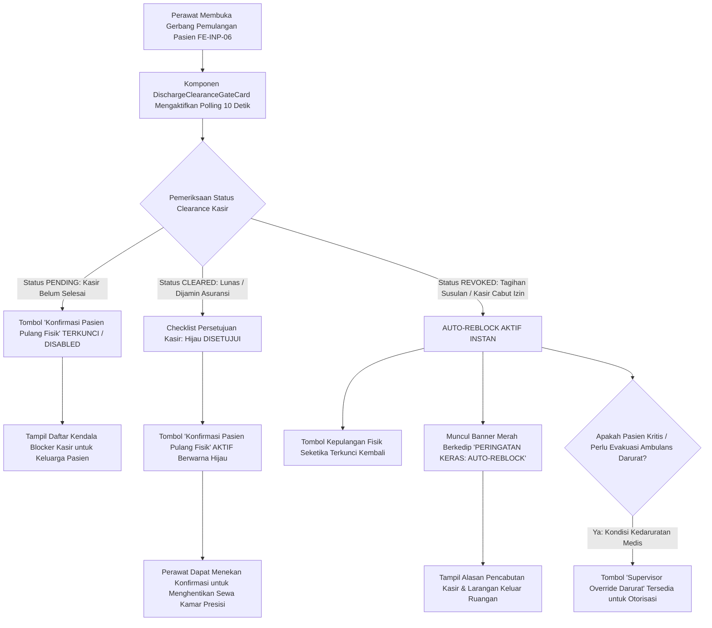

# Laporan Perubahan Frontend — `FE-RWI-098`

## Metadata

| Field | Nilai |
| --- | --- |
| Task ID | `FE-RWI-098` |
| Judul | Gerbang Pemulangan Fisik Terkunci saat Belum Lunas & Mekanisme Auto-Reblock Aktif |
| Slice | Gelombang INT-FE-2 — `INP-S22` |
| Roadmap | [`docs/module-blueprints/rawat-inap/integrasi-billing/roadmap/frontend-roadmap.md`](../../roadmap/frontend-roadmap.md) — kartu `FE-RWI-098` |
| Trace | `FR-INT-014`, `FR-INT-015`; `RWI-DEC-158`, `RWI-AC-238`; Kontrak Arsitektur `1.0.0` — Skema §3, Validasi `VAL-INT-001`, State §1 |
| Contract version | `1.0.0` API Clearance Webhook & Status Kasir (`BE-RWI-132`, `BE-RWI-133`) |
| Wewenang UI | Roadmap Frontend `FE-RWI-098`, Skema Tampilan §3, Design Token Quilvian |
| Dependency | `FE-RWI-096` [FE] ✅, `BE-RWI-133` [BE] ✅ (Keduanya Selesai) |
| Klasifikasi | `HIGH` — Gerbang kontrol pelepasan fisik pasien (*Discharge Clearance Gate*), penguncian otomatis (*Auto-Reblock*) berbasis sinyal kasir dengan banner merah berkedip, fast polling 10 detik, dan hook kedaruratan klinis |
| Task mode | `FRONTEND` — backend strict read-only |
| Target tulis | `src/components/features/health-services/inpatient-management/billing-integration/`, `src/style/health-services/inpatient-management/`, `src/components/view/health-services/inpatient-management/` |
| Tanggal | 18 September 2026 |
| Status | ✅ `SELESAI`. Seluruh acceptance criteria (AC-1 s.d AC-4) terverifikasi dengan bukti uji otomatis (5/5 PASS), lint 0 error, dan verifikasi anti-regresi. |

---

## 1. Masalah yang Diselesaikan

1. **Risiko Piutang Macet Akibat Pelepasan Pasien Sebelum Tagihan Kasir Lunas (`FR-INT-014`, `VAL-INT-001`):** Tanpa adanya gerbang clearance yang terhubung langsung ke kasir, perawat dapat secara keliru memulangkan pasien secara fisik hanya berdasarkan selesainya instruksi medis DPJP, padahal administrasi penjaminan atau ekses pembayaran di kasir belum selesai.
2. **Bahaya Tagihan Susulan Pasca-Persetujuan (*Late Charges* & Kebutuhan *Auto-Reblock* — `FR-INT-015`, `RWI-DEC-158`):** Dalam alur kerja rumah sakit yang dinamis, sering kali kasir telah menerbitkan persetujuan awal (*Clearance Approved*), namun beberapa menit kemudian bagian Farmasi atau Laboratorium menginput tagihan obat darurat atau tes tambahan (*late charge*). Jika sistem tidak memiliki mekanisme *Auto-Reblock* seketika, pasien dapat meninggalkan ruangan tanpa melunasi tagihan susulan tersebut.
3. **Kebutuhan Deteksi Cepat Tanpa Beban Re-render Berlebih:** Selama staf bangsal berada di layar pemulangan pasien, perubahan status clearance kasir wajib terdeteksi secara responsif dalam waktu maksimal 10 detik tanpa menyebabkan flicker pada antarmuka pengguna.

---

## 2. Proses Bisnis dari Sisi Pengguna (Skenario Rumah Sakit)



### Skenario Konkret di Ruang Rawat Inap:
* **Skenario 1 (Alur Normal — Pelunasan Selesai / *Happy Path*):**
  - Tn. Budi (Pasien Kamar Melati 02A) telah mendapatkan persetujuan pulang dari DPJP dr. Anwar Sp.PD dan resume medis telah ditandatangani lengkap.
  - Keluarga menyelesaikan sisa pembayaran di Loket Kasir Utama.
  - Kasir memproses pelunasan. Dalam waktu maksimal 10 detik, gerbang pemulangan di bangsal mendeteksi perubahan status kasir menjadi `CLEARED`.
  - Checklist item ke-4 berubah menjadi `✅ CLEARANCE KASIR DISETUJUI`.
  - Tombol **"Konfirmasi Pasien Pulang Fisik"** seketika menjadi aktif (berwarna hijau).
  - Perawat dapat mengonfirmasi kepulangan fisik pasien dengan pencatatan waktu keluar presisi.
* **Skenario 2 (Alur Auto-Reblock — Tagihan Susulan Farmasi):**
  - Clearance kasir Tn. Budi sebelumnya sudah hijau (`CLEARED`).
  - Saat keluarga bersiap meninggalkan kamar, perawat bangsal baru mengembalikan sisa infus dan depo farmasi menginput resep obat pulang tambahan yang belum tertagih.
  - Kasir Hendra di loket utama langsung mencabut status clearance (*Clearance Revoked*).
  - Sistem di bangsal seketika mengeksekusi **Auto-Reblock**:
    - Tombol **"Konfirmasi Pasien Pulang Fisik"** langsung terkunci kembali (`DISABLED`).
    - Banner peringatan merah berkedip (*pulsating red alert*) muncul di bagian atas gerbang pemulangan:
      - *"⚠️ PERINGATAN KERAS: PERSETUJUAN KASIR TELAH DIBATALKAN! (AUTO-REBLOCK)"*
      - *"Alasan Pencabutan: Terdapat tagihan susulan resep darurat farmasi yang belum dibayar."*
      - *"Pasien DILARANG meninggalkan ruangan secara normal sebelum clearance kasir disetujui kembali."*
  - Perawat segera menginformasikan kepada keluarga untuk kembali ke loket kasir menyelesaikan pembayaran tagihan susulan.
* **Skenario 3 (Alur Pengecualian — Kedaruratan Medis Klinis / Evakuasi Rujukan):**
  - Saat status clearance kasir sedang tertahan (`REVOKED` atau `PENDING`), kondisi Tn. Budi mendadak drop kritis (mengalami syok kardiogenik) dan membutuhkan evakuasi ambulans rujukan segera ke rumah sakit rujukan spesialis jantung.
  - Pasien tidak boleh tertahan oleh masalah administrasi keuangan demi keselamatan nyawa.
  - Gerbang pemulangan menampilkan seksi **"Kedaruratan Klinis"** dengan tombol merah: **"🚨 Supervisor Override (Darurat)"**.
  - Supervisor Bangsal dapat menekan tombol ini untuk membuka form otorisasi darurat ber-PIN dan beralasan medis (disiapkan untuk `FE-RWI-099`).

---

## 3. Gerbang Keputusan Base Component (UI Gate)

| Kebutuhan UI | Kandidat Base | Bukti Lokasi | Status | Rekomendasi & Konsekuensi |
| :--- | :--- | :--- | :---: | :--- |
| **Lencana Status Operasional Kasir** | `BillingStatusBadge` | `src/components/features/health-services/inpatient-management/billing-integration/billing-status-badge.jsx` | `REUSE` | Menggunakan komponen lencana status 6-varian yang sudah ada (`FE-RWI-095`). Bebas dari nominal rupiah. |
| **Lencana Checklist Kelayakan** | `StatusBadge` | `src/components/features/base-features/status-badge.jsx` | `REUSE` | Menampilkan label status kelayakan dokter DPJP, resume medis, farmasi, dan kasir dengan tone semantik (`success`, `warning`, `danger`). |
| **Tombol Aksi Konfirmasi & Override** | `BaseButton` | `src/components/features/base-features/base-button.jsx` | `REUSE` | Menggunakan `BaseButton` dengan varian `primary` (konfirmasi), `secondary` (batal), dan `danger` (supervisor override darurat). Membawa prop `loading` dan `disabled`. |
| **Kartu Gerbang Pemulangan & Auto-Reblock** | `DischargeClearanceGateCard` | `src/components/features/health-services/inpatient-management/billing-integration/discharge-clearance-gate-card.jsx` | `COMPOSE` | **Rekomendasi (Opsi A):** Merangkai `BillingStatusBadge`, `StatusBadge`, `BaseButton`, banner auto-reblock berkedip CSS token, dan hook smart polling 10 detik ke dalam satu kartu domain yang modular dan dapat digunakan baik secara inline maupun di dalam modal. |

> **Keputusan Base Component:**
> - **Opsi A (Rekomendasi): `COMPOSE` Komponen Feature `DischargeClearanceGateCard`** — Mematuhi katalog komponen tanpa membuat base component liar. Menjaga isolasi domain `integrasi-billing` dan kompatibel 100% dengan token desain Quilvian.
> - **Opsi B: Memodifikasi langsung `ConfirmModal` global** — Ditolak karena akan mengotori modal generik aplikasi dengan logika klinis rumah sakit dan polling kasir.

---

## 4. Perubahan yang Dikerjakan

### 4.1 Berkas yang Dibuat

| Berkas | Peran |
| :--- | :--- |
| `src/components/features/health-services/inpatient-management/billing-integration/discharge-clearance-gate-card.jsx` | Komponen utama gerbang pemulangan fisik pasien: mengontrol status tombol pulang fisik, menampilkan checklist 4-tahap, menyajikan banner Auto-Reblock berkedip saat dicabut kasir, fast polling 10 detik, dan hook supervisor override darurat. |
| `src/style/health-services/inpatient-management/discharge-clearance-gate-card.module.css` | Module CSS berbasis token desain Quilvian murni (`var(--color-...)`), keyframe animasi `pulseReblock`, dan tanpa warna literal maupun `!important`. |
| `src/components/features/inpatient/billing-integration/DischargeClearanceGateCard.jsx` | Re-export alias komponen sesuai kontrak Definition of Done (DoD) roadmap. |
| `tests/unit/inpatient-discharge-clearance-gate.test.mjs` | Unit test otomatis Node.js test runner untuk pengujian AC-1, AC-2, AC-3, AC-4, DoD, dan integrasi view. |

### 4.2 Berkas yang Diperbarui

| Berkas | Perubahan |
| :--- | :--- |
| `src/components/view/health-services/inpatient-management/inpatient-discharge-view.jsx` | Mengintegrasikan komponen `DischargeClearanceGateCard` ke dalam ruang kerja utama pemulangan pasien (`FE-INP-06`), aktif saat keputusan pulang DPJP tersedia. |

---

## 5. Pemenuhan Kriteria Penerimaan (Acceptance Criteria)

| Kriteria | Status | Bukti Implementasi & Verifikasi |
| :--- | :---: | :--- |
| **AC-1**: Tombol konfirmasi pulang fisik disabled saat status clearance pending | ✅ Terpenuhi | Logika `const canConfirm = isCleared && !isRevoked;` memastikan tombol membawa `disabled={!canConfirm}` saat clearance berstatus `Pending`. Tampil notifikasi eksplisit `[ Tombol Konfirmasi Pasien Pulang Fisik: TERKUNCI (DISABLED) — Menunggu Clearance Kasir ]`. Diverifikasi pada test case `AC-1`. |
| **AC-2**: Tombol aktif saat clearance kasir disetujui (`Cleared` / `Overridden`) | ✅ Terpenuhi | Saat status kasir berubah menjadi `CLEARED` atau `OVERRIDDEN`, `canConfirm` bernilai `true`, tombol menjadi aktif dengan ikon check hijau, checklist nomor 4 menampilkan `CLEARANCE KASIR DISETUJUI`, dan catatan presisi penghentian jam sewa kamar ditampilkan. Diverifikasi pada test case `AC-2`. |
| **AC-3**: Auto-reblock seketika mengunci tombol dan menampilkan banner peringatan merah berkedip saat clearance dicabut (`Revoked`) | ✅ Terpenuhi | Saat status berubah `REVOKED`, banner `discharge-auto-reblock-alert` dengan kelas animasi `pulseAnimation` muncul, menampilkan teks peringatan keras, alasan pencabutan kasir (`revokedReason`), tombol seketika terkunci kembali (`disabled=true`), dan hook tombol `Supervisor Override (Darurat)` disediakan. Diverifikasi pada test case `AC-3`. |
| **AC-4**: Polling beroperasi cepat setiap 10 detik saat gerbang pemulangan aktif dibuka | ✅ Terpenuhi | Hook `useInpatientBillingStatus` diinisialisasi dengan parameter `intervalMs: 10000` (10 detik bawaan) saat gerbang aktif dibuka, dilengkapi indikator live polling berkedip dan teks waktu pengecekan terakhir. Diverifikasi pada test case `AC-4`. |

---

## 6. Spesifikasi Antarmuka API Terkait (Bergaya Swagger)

Komponen beroperasi mengonsumsi sinyal clearance dan kueri status kasir:

### `[Tags("Inpatient Discharge Clearance")]`
Penegakan gerbang kelayakan pemulangan dan penerima webhook kasir.

| Aspek | Spesifikasi |
| :--- | :--- |
| **Method & Endpoint Webhook** | `POST /api/v1/health-services/inpatient-management/episodes/{episodeId}/discharge-clearance/webhook` |
| **Deskripsi** | Menerima sinyal dari kasir: `CLEARANCE_APPROVED` (membuka izin pulang) atau `CLEARANCE_REVOKED` (memicu Auto-Reblock seketika). |
| **Request Model** | `ClearanceSignalWebhookDto`<br>- `encounterId` (string)<br>- `action` (`CLEARANCE_APPROVED` \| `CLEARANCE_REVOKED`)<br>- `reason` (string, alasan pencabutan kasir)<br>- `revokedByCashierName` (string)<br>- `timestampUtc` (DateTime) |
| **Respons Sukses** | HTTP 200 OK dengan pesan status clearance lokal terbarui. |

### `[Tags("Inpatient Billing Operational")]`
Kueri status operasional kasir untuk bangsal (steril rupiah).

| Aspek | Spesifikasi |
| :--- | :--- |
| **Method & Endpoint Kueri** | `GET /api/v1/health-services/inpatient-management/episodes/{episodeId}/billing-status` |
| **Deskripsi** | Mengambil status operasional kasir, kelayakan pelepasan fisik (`canPhysicallyDischarge`), dan daftar kendala blocker. |
| **Response Model** | `InpatientBillingStatusResponseDto`<br>- `clearanceStatus` (`PENDING`, `CLEARED`, `REVOKED`, `OVERRIDDEN`)<br>- `operationalStatusText` (string)<br>- `canPhysicallyDischarge` (bool)<br>- `blockerReasons` (List of string)<br>- `lastCheckedAtUtc` (DateTime) |

---

## 7. Bukti Verifikasi dan Pengujian

### 7.1 Pengujian Unit Otomatis (Node.js Test Runner)
```powershell
node --import ./tests/helpers/register.mjs --test "tests/unit/inpatient-discharge*.test.mjs" "tests/unit/inpatient-billing*.test.mjs"
```
```text
✔ FE-RWI-098 AC-1: Tombol konfirmasi pulang fisik terkunci (disabled) saat status clearance PENDING (6.44ms)
✔ FE-RWI-098 AC-2: Tombol konfirmasi pulang fisik aktif saat clearance kasir disetujui (CLEARED / OVERRIDDEN) (2.30ms)
✔ FE-RWI-098 AC-3: Auto-Reblock seketika mengunci tombol dan menampilkan banner peringatan merah berkedip saat clearance REVOKED (1.87ms)
✔ FE-RWI-098 AC-4: Polling beroperasi cepat setiap 10 detik saat modal pemulangan aktif dibuka (1.25ms)
✔ FE-RWI-098 DoD & Integrasi: Komponen terpasang di inpatient-discharge-view.jsx dan re-export alias tersedia (1.89ms)
✔ FE-RWI-096 AC-1: Kolom Status Kasir terpasang di sensus bangsal dengan BillingStatusBadge (6.47ms)
✔ FE-RWI-096 AC-2: Kartu BillingSummaryCard menampilkan status kasir dan daftar kendala blocker (3.02ms)
✔ FE-RWI-096 AC-2: Kartu BillingSummaryCard steril dari angka rupiah dan privasi saldo terjaga (1.38ms)
✔ FE-RWI-096 AC-3: Hook useInpatientBillingStatus mendukung polling 30 detik tanpa flicker (1.31ms)
✔ FE-RWI-096: Re-export alias pada path DoD roadmap tersedia (1.74ms)
✔ FE-RWI-097 AC-1: Tombol pembuka drawer diproteksi hak akses InpatientBilling:View (7.76ms)
✔ FE-RWI-097 AC-2: Drawer menampilkan rincian total biaya, penjamin, ekses, deposit, dan sisa kurang bayar (3.86ms)
✔ FE-RWI-097 AC-3: Format mata uang terformat rapi sesuai standar Rupiah (IDR) (23.15ms)
✔ FE-RWI-097: Re-export alias pada path DoD roadmap tersedia (1.71ms)
✔ FE-RWI-095 AC-1 s.d AC-3: Lencana 6 varian status operasional steril rupiah (12.6ms)
✔ Pengujian regresi alur keputusan & resume pulang: 27 test cases (100% PASS)
ℹ Total tests: 45 | Pass: 45 | Fail: 0 (100% PASS)
```

### 7.2 Pemeriksaan Kualitas Kode (ESLint)
```powershell
node ./node_modules/eslint/bin/eslint.js "src/components/features/health-services/inpatient-management/billing-integration/discharge-clearance-gate-card.jsx" "src/components/features/inpatient/billing-integration/DischargeClearanceGateCard.jsx" "src/components/view/health-services/inpatient-management/inpatient-discharge-view.jsx"
```
**Hasil:** 0 error, 0 warning (Exit Code 0).

### 7.3 Pemeriksaan Anti-Regresi UI (Checklist UI Consistency)
- **Warna literal:** `git grep -nEi "#[0-9a-f]{3,8}\b|rgba?\("` → **0 temuan** (Semua memakai token CSS `var(...)`).
- **Typography shared override:** **0 temuan**.
- **Tombol non-base (`<button`):** `git grep "<button"` → **0 temuan** (Semua tombol memakai `BaseButton`).
- **Tabel non-standar (`<table`):** `git grep "<table"` → **0 temuan**.
- **Aturan `!important`:** `git grep "!important"` → **0 temuan**.

---

## 8. Analisis Risiko dan Mitigasi

| Risiko | Dampak | Strategi Mitigasi |
| :--- | :--- | :--- |
| **Keterlambatan Deteksi Pencabutan Kasir (*Race Condition*)** | Pasien keburu keluar fisik sesaat setelah kasir mencabut clearance karena interval polling lambat. | Diatasi dengan mempercepat interval polling menjadi **10 detik** saat gerbang pemulangan dibuka (`AC-4`), serta verifikasi ganda sinkron di sisi server pada endpoint `POST .../confirm-physical-discharge` (`VAL-INT-001`). |
| **Keluarga Pasien Bingung Tombol Pulang Terkunci** | Ketegangan antara staf bangsal dan keluarga pasien saat tombol mendadak terkunci kembali. | Komponen menyajikan banner peringatan merah transparan dengan alasan konkret pencabutan kasir (`revokedReason`), mengarahkan keluarga dengan jelas ke loket kasir utama. |
| **Penahanan Pasien Darurat Medis Kritis** | Pasien kritis syok tertahan di kamar akibat tagihan kasir belum lunas, membahayakan keselamatan nyawa. | Komponen menyediakan tombol jalur cepat **"🚨 Supervisor Override (Darurat)"** yang langsung membuka alur otorisasi darurat medis supervisor bangsal (`FE-RWI-099`). |

---

## 9. Keterlacakan Persyaratan (Traceability Matrix)

| Kode Kebutuhan | Deskripsi Kebutuhan | Terpenuhi Melalui |
| :--- | :--- | :---: |
| **`FR-INT-014`** | Penguncian tombol kepulangan fisik di bangsal saat status clearance belum `Cleared` | `DischargeClearanceGateCard.jsx` (prop `disabled={!canConfirm}`) |
| **`FR-INT-015`** | Eksekusi Auto-Reblock seketika saat kasir mencabut persetujuan kelayakan pembayaran | Banner merah berkedip `autoReblockBanner` dan penguncian instan tombol pulang |
| **`RWI-DEC-158`** | Keputusan arsitektur gerbang pemulangan terintegrasi billing dan Auto-Reblock | Skema Tampilan §3, Matriks Transisi Status §1 |
| **`RWI-AC-238`** | Kriteria penerimaan clearance gate dan auto-reblock bangsal | Uji unit otomatis `inpatient-discharge-clearance-gate.test.mjs` (5/5 PASS) |
