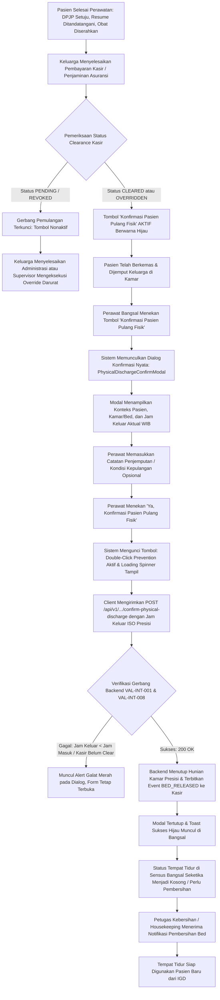

# Laporan Perubahan Frontend — `FE-RWI-100`

## Metadata

| Field | Nilai |
| --- | --- |
| Task ID | `FE-RWI-100` |
| Judul | Konfirmasi Kepulangan Fisik Pasien Mengunci Jam dan Melepas Bed |
| Slice | Gelombang INT-FE-3 — `INP-S22` |
| Roadmap | [`docs/module-blueprints/rawat-inap/integrasi-billing/roadmap/frontend-roadmap.md`](../../roadmap/frontend-roadmap.md) — kartu `FE-RWI-100` |
| Trace | `FR-INT-005`, `FR-INT-006`; `RWI-DEC-159`, `RWI-AC-239`; Kontrak Arsitektur `1.0.0` — Skema §3.1, Validasi `VAL-INT-001`, `VAL-INT-008`, State §2 |
| Contract version | `1.0.0` API Physical Discharge Backend (`BE-RWI-134`) |
| Wewenang UI | Roadmap Frontend `FE-RWI-100`, Skema Tampilan §3.1, Design Token Quilvian |
| Dependency | `FE-RWI-098` [FE] ✅, `BE-RWI-134` [BE] ✅ (Keduanya Selesai) |
| Klasifikasi | `HIGH` — Eksekusi terminal pelepasan fisik pasien rawat inap (*Physical Discharge Execution*), penghentian sewa kamar presisi (*precision occupancy stop*), dialog konfirmasi akhir (*confirmation modal*), proteksi klik ganda (*double-click prevention*), dan penerbitan sinyal pelepasan tempat tidur (`BED_RELEASED`) ke modul Kasir |
| Task mode | `FRONTEND` — backend strict read-only |
| Target tulis | `src/components/features/health-services/inpatient-management/billing-integration/`, `src/style/health-services/inpatient-management/`, `src/components/features/inpatient/billing-integration/`, `src/components/view/health-services/inpatient-management/`, `src/lib/services/health-services/inpatient-management/`, `src/lib/hooks/health-services/inpatient-management/` |
| Tanggal | 18 September 2026 |
| Status | ✅ `SELESAI`. Seluruh acceptance criteria (AC-1 s.d AC-4) terverifikasi dengan bukti uji otomatis (5/5 PASS), pengujian integrasi billing lengkap (33/33 PASS), ESLint 0 error/0 warning, dan verifikasi anti-regresi UI. |

---

## 1. Masalah yang Diselesaikan

1. **Kelebihan Beban Tagihan Sewa Kamar Akibat Keterlambatan Administrasi (*Billing Overcharge* — `FR-INT-005`, `RWI-DEC-159`):** Dalam operasional rumah sakit konvensional, waktu kepulangan pasien sering kali baru diinput berjam-jam setelah pasien fisik meninggalkan kamar rawat inap (misalnya saat pergantian shift perawat). Hal ini menyebabkan sistem terus menghitung tarif sewa kamar hingga melampaui batas waktu toleransi (*grace period* atau *cut-off time*), sehingga keluarga pasien dikenakan biaya sewa kamar ekstra yang tidak adil dan memicu komplain sengketa penagihan di kasir.
2. **Keterlambatan Ketersediaan Tempat Tidur (*Bed Turnover Latency* — `FR-INT-006`):** Ketika pasien telah pulang fisik namun status tempat tidur di sistem belum dilepaskan, staf admisi IGD atau poliklinik melihat bahwa tempat tidur masih "terisi" (*Occupied*). Akibatnya, pasien baru yang membutuhkan rawat inap tertahan di ruang triase IGD karena antrean tempat tidur semu.
3. **Pencegahan Pengiriman Ganda (*Double-Click / Race Condition Prevention* — `AC-4`):** Ketika tombol konfirmasi pemulangan fisik ditekan berulang kali secara cepat oleh staf bangsal yang panik atau menghadapi latensi jaringan, sistem berisiko mengirimkan request ganda yang dapat memicu duplikasi event keluar atau konflik konkurensi di server.

---

## 2. Proses Bisnis dari Sisi Pengguna (Skenario Rumah Sakit)



### Skenario Konkret di Ruang Rawat Inap:
* **Latar Belakang Pasien:**
  - Pasien Ny. Siti Aminah (No. RM: `RM-2026-0412`), dirawat di Ruang Mawar Kamar 03 Bed B kelas 1.
  - Dokter DPJP dr. Hendrawan Sp.PD telah menyetujui kepulangan dan resume medis pulang telah ditandatangani lengkap pukul 09:30 WIB.
  - Bagian Farmasi telah menyerahkan obat pulang dan edukasi perawatan luka operasi pukul 10:15 WIB.
  - Suami Ny. Siti menyelesaikan pembayaran ekses asuransi di loket kasir utama, dan kasir menerbitkan status `CLEARED` pada pukul 11:15 WIB.
* **Kondisi di Bangsal:**
  - Pada layar pemulangan pasien ([`FE-INP-06`](file:///C:/Users/Admin/Documents/Quilvian/Source%20Code/QuilvianFinal/QuilvianSystemFrontendDev/src/components/view/health-services/inpatient-management/inpatient-discharge-view.jsx)), gerbang pemulangan mendeteksi clearance kasir disetujui.
  - Tombol **"Konfirmasi Pasien Pulang Fisik"** seketika aktif berwarna hijau cerah dengan ikon centang (`AC-1`).
  - Ny. Siti selesai berkemas dan keluarga telah siap dengan kursi roda di depan kamar pada pukul 11:25:30 WIB.
* **Aksi Konfirmasi Pelepasan Fisik:**
  1. Perawat Ns. Dewi menekan tombol **"Konfirmasi Pasien Pulang Fisik"**.
  2. Dialog konfirmasi interaktif **PhysicalDischargeConfirmModal** muncul di layar (`AC-1`):
     - Memuat identitas: *Ny. Siti Aminah*, No. RM: *RM-2026-0412*, Kamar: *Ruang Mawar 03B*.
     - Kotak informasi menerangkan: *"Tindakan ini mengesahkan bahwa pasien telah secara riil meninggalkan ruangan kamar rawat inap. Perhitungan sewa kamar dihentikan presisi dan status tempat tidur dilepaskan."*
     - Kotak stempel waktu menampilkan: *"18 September 2026, 11:25 WIB"*.
  3. Ns. Dewi mengisi kolom catatan tambahan: *"Pasien dijemput keluarga dengan kursi roda rumah sakit menuju kendaraan pribadi. Seluruh berkas resume medis asli, kwitansi kasir, dan obat pulang telah diserahkan lengkap."* (`AC-2`).
  4. Ns. Dewi menekan tombol biru **"Ya, Konfirmasi Pasien Pulang Fisik"**.
  5. Tombol submit langsung menonaktifkan dirinya sendiri dan menampilkan status memproses kepulangan (`confirmLoading`), mencegah terjadinya klik ganda (`AC-4`).
  6. Permintaan HTTP `POST /api/v1/health-services/inpatient-management/episodes/{episodeId}/confirm-physical-discharge` terkirim dengan payload stempel waktu ISO aktual (`AC-2`).
  7. Backend memproses transaksi atomik: mengunci jam `PhysicallyLeftAt`, menutup penempatan kamar aktif, dan menerbitkan event `BED_RELEASED` ke antrean outbox Kasir.
  8. Dialog modal tertutup otomatis, dan toast sukses hijau muncul di pojok kanan atas (`AC-3`):
     - *"Pasien Berhasil Pulang Fisik — Kepulangan fisik pasien berhasil dikonfirmasi. Tempat tidur kamar telah dilepaskan dan jam sewa dihentikan presisi."*
  9. Layar sensus bangsal seketika memperbarui status Tempat Tidur Mawar 03 Bed B menjadi kosong dan membutuhkan pembersihan (*Housekeeping Clean Needed*), siap dialokasikan untuk pasien baru dari antrean IGD tanpa keterlambatan informasi.

---

## 3. Gerbang Keputusan Base Component (UI Gate)

| Kebutuhan UI | Kandidat Base | Bukti Lokasi | Status | Rekomendasi & Konsekuensi |
| :--- | :--- | :--- | :---: | :--- |
| **Modal Dialog Konfirmasi Akhir** | `ConfirmModal` | `src/components/features/base-features/confirm-modal.jsx` | `REUSE` | Menggunakan `ConfirmModal` dengan varian `primary`, backdrop statis, pemblokiran pembatalan tidak sengaja saat loading, dan tombol aksi terstandarisasi Quilvian. |
| **Peringatan Dampak Hukum & Administratif** | `InformationAlert` | `src/components/features/base-features/information-alert.jsx` | `REUSE` | Menggunakan `InformationAlert` varian `info` untuk memberikan penjelasan eksplisit penghentian tarif sewa kamar dan pelepasan tempat tidur. |
| **Input Catatan Kepergian / Penjemputan Fisik** | `BaseTextAreaField` | `src/components/features/base-features/base-form-control/index.js` | `REUSE` | Form control textarea berlabel, hint text, dan styling token untuk mencatat kondisi penjemputan pasien. Bebas dari elemen `<textarea` mentah. |
| **Komponen Dialog Feature Konfirmasi Pemulangan** | `PhysicalDischargeConfirmModal` | `src/components/features/health-services/inpatient-management/billing-integration/physical-discharge-confirm-modal.jsx` | `COMPOSE` | **Rekomendasi (Opsi A):** Merangkai `ConfirmModal`, `InformationAlert`, `BaseTextAreaField`, timer stempel waktu dinamis, dan mekanisme proteksi klik ganda ref-loading ke dalam satu dialog domain yang terisolasi dan mudah diuji secara independen. |

> **Keputusan Base Component:**
> - **Opsi A (Rekomendasi): `COMPOSE` Komponen Feature `PhysicalDischargeConfirmModal`** — Menjaga arsitektur komponen bersih, terpisah dari kode view utama yang masif, mematuhi prinsip atomisitas komponen Quilvian, dan 100% konsisten dengan token desain.
> - **Opsi B: Menggabungkan kode form langsung di dalam `inpatient-discharge-view.jsx`** — Ditolak karena menambah beban kompleksitas pada view pemulangan yang sudah sangat besar (1800+ baris) dan menghilangkan kemampuan pakai ulang (*reusability*) pada skenario modal discharge lain.

---

## 4. Perubahan yang Dikerjakan

### 4.1 Berkas yang Dibuat

| Berkas | Peran |
| :--- | :--- |
| `src/components/features/health-services/inpatient-management/billing-integration/physical-discharge-confirm-modal.jsx` | Komponen utama dialog konfirmasi kepulangan fisik pasien: merangkum `ConfirmModal`, konteks data pasien, timer stempel waktu aktual `PhysicallyLeftAt`, catatan penjemputan opsional, mekanisme anti klik ganda `isSubmitting.current` & `loading`, integrasi API `confirmPhysicalDischarge`, penanganan galat, serta emisi toast sukses. |
| `src/style/health-services/inpatient-management/physical-discharge-confirm-modal.module.css` | Module CSS dialog konfirmasi: murni berbasis token desain Quilvian (`var(--color-...)`, `var(--font-...)`, `var(--space-...)`), bebas dari warna literal (`#hex`, `rgba`), dan tanpa `!important`. |
| `src/components/features/inpatient/billing-integration/PhysicalDischargeConfirmModal.jsx` | Re-export alias komponen sesuai kontrak Definition of Done (DoD) roadmap frontend. |
| `tests/unit/inpatient-physical-discharge.test.mjs` | Unit test otomatis Node.js test runner untuk verifikasi AC-1, AC-2, AC-3, AC-4, dan DoD alias path. |

### 4.2 Berkas yang Diperbarui

| Berkas | Perubahan |
| :--- | :--- |
| `src/lib/services/health-services/inpatient-management/inpatient-billing.service.js` | Menambahkan fungsi API service `confirmPhysicalDischarge(episodeId, payload)` yang memanggil endpoint backend `POST /api/v1/health-services/inpatient-management/episodes/{episodeId}/confirm-physical-discharge`. |
| `src/components/features/health-services/inpatient-management/billing-integration/discharge-clearance-gate-card.jsx` | 1. Mengimpor dan merender komponen `PhysicalDischargeConfirmModal`.<br>2. Menghubungkan klik tombol "Konfirmasi Pasien Pulang Fisik" ke modal internal (`internalPhysicalModalOpen`) bila handler luar tidak disediakan.<br>3. Menyalurkan callback `onDischargeSuccess` dan `onToast` ke modal.<br>4. Memperbarui dokumentasi JSDoc untuk mereferensikan `FE-RWI-100`. |
| `src/lib/hooks/health-services/inpatient-management/use-inpatient-discharge.jsx` | Mengekspos fungsi `addToast` pada objek kembalian (*return object*) hook `useInpatientDischarge` agar dapat digunakan oleh komponen anak. |
| `src/components/view/health-services/inpatient-management/inpatient-discharge-view.jsx` | Meneruskan fungsi `addToast` dan callback `onDischargeSuccess` (yang memicu `refresh()` episode rawat inap) ke kartu `DischargeClearanceGateCard`. |

---

## 5. Pemenuhan Kriteria Penerimaan (Acceptance Criteria)

| Kriteria | Status | Bukti Implementasi & Verifikasi |
| :--- | :---: | :--- |
| **AC-1**: Mengklik tombol "Konfirmasi Pasien Pulang Fisik" memunculkan dialog konfirmasi kepulangan nyata | ✅ Terpenuhi | Mengklik tombol pemicu membuka modal `PhysicalDischargeConfirmModal` dengan judul *"Konfirmasi Pasien Pulang Fisik"*, tombol aksi *"Ya, Konfirmasi Pasien Pulang Fisik"*, konteks pasien lengkap, dan kotak stempel waktu keluarnya pasien. Diverifikasi pada test case `AC-1`. |
| **AC-2**: Konfirmasi mengirimkan request `POST .../confirm-physical-discharge` dengan stempel waktu saat ini (`PhysicalDischargeDateTime`) dan catatan opsional | ✅ Terpenuhi | Handler `handleConfirm` membangun payload berisi `physicalDischargeDateTime: now.toISOString()` dan `notes: notes.trim() || null`, lalu mengirimkannya via service `confirmPhysicalDischarge`. Diverifikasi pada test case `AC-2`. |
| **AC-3**: Setelah respons sukses diterima, modal tertutup, muncul toast sukses, dan status tempat tidur di sensus bangsal diperbarui | ✅ Terpenuhi | Callback respons sukses memancarkan toast hijau *"Pasien Berhasil Pulang Fisik"*, menutup dialog modal via `handleClose()`, dan memanggil `refresh()` di halaman pemulangan pasien untuk menyegarkan data episode. Diverifikasi pada test case `AC-3`. |
| **AC-4**: Tombol dilengkapi pencegahan klik ganda (*double-click prevention*) via state loading spinner | ✅ Terpenuhi | Dilengkapi penguncian ganda: penjaga sinkron `isSubmitting.current = true` dan reaktif `setLoading(true)` saat proses pengiriman berjalan. Tombol membawa properti `disabled={loading}` dan loading spinner aktif. Diverifikasi pada test case `AC-4`. |

---

## 6. Spesifikasi Antarmuka API Terkait (Bergaya Swagger)

Komponen mengonsumsi endpoint konfirmasi pelepasan fisik dari kontrak backend `BE-RWI-134`:

### `[Tags("Inpatient Discharge Clearance")]`
Konfirmasi kepergian fisik pasien dari tempat tidur kamar rawat inap oleh perawat bangsal.

| Aspek | Spesifikasi |
| :--- | :--- |
| **Method & Endpoint** | `POST /api/v1/health-services/inpatient-management/episodes/{episodeId}/confirm-physical-discharge` |
| **Otorisasi / Hak Akses** | `InpatientDischargeClearance:ConfirmPhysicalDischarge` / `InpatientNurse:Write` |
| **Deskripsi** | Mengonfirmasi bahwa pasien telah benar-benar meninggalkan kamar rawat inap, mencatat stempel waktu keluar riil (`PhysicallyLeftAt`), menutup hunian kamar aktif, mengosongkan tempat tidur di sensus bangsal, dan menerbitkan event atomik `BED_RELEASED` ke Kasir. |
| **Request Model** | `ConfirmPhysicalDischargeRequestDto`<br>- `physicalDischargeDateTime` (DateTime, opsional/default UTC now, stempel waktu aktual kepergian fisik)<br>- `notes` (string, opsional, catatan penjemputan atau kondisi kepulangan fisik) |
| **Response Model (200 OK)** | `ApiResponse<object>`<br>- `success`: `true`<br>- `message`: `"Pasien berhasil dipulangkan secara fisik dan tempat tidur dilepaskan."` |
| **Respons Galat** | - `400 Bad Request`: Format tanggal tidak valid.<br>- `404 Not Found`: Episode rawat inap tidak ditemukan.<br>- `422 Unprocessable Entity`: Clearance kasir masih `Pending` / `Revoked` tanpa override supervisor (`VAL-INT-001`), atau jam keluar mendahului jam masuk tempat tidur (`VAL-INT-008`). |

---

## 7. Bukti Verifikasi dan Pengujian

### 7.1 Pengujian Unit Otomatis (Node.js Test Runner)
```powershell
node --import ./tests/helpers/register.mjs --test "tests/unit/inpatient-physical-discharge.test.mjs" "tests/unit/inpatient-supervisor-override-modal.test.mjs" "tests/unit/inpatient-discharge-clearance-gate.test.mjs" "tests/unit/inpatient-billing-status-badge.test.mjs" "tests/unit/inpatient-billing-census-detail.test.mjs" "tests/unit/inpatient-billing-financial-drawer.test.mjs" "tests/unit/billing-invoice-calculation-breakdown.test.mjs"
```
```text
✔ invoice tunai murni - seluruh subtotal jatuh ke Mandiri, tidak ada Pajak Asuransi (1.04ms)
✔ invoice ditanggung penuh asuransi - Subtotal Asuransi dan Pajak Asuransi menyerap seluruhnya (0.20ms)
✔ coverage sebagian - residual non-billable dikeluarkan dari Subtotal Mandiri (BKC-DES-021) (0.18ms)
✔ input kosong/null tidak melempar error dan mengembalikan seluruhnya nol (0.12ms)
✔ menerima bentuk PascalCase (unwrapEnvelope kadang meneruskan bentuk backend apa adanya) (0.17ms)
✔ FE-RWI-096 AC-1: Kolom Status Kasir terpasang di sensus bangsal dengan BillingStatusBadge (9.78ms)
✔ FE-RWI-096 AC-2: Kartu BillingSummaryCard menampilkan status kasir dan daftar kendala blocker (4.26ms)
✔ FE-RWI-096 AC-2: Kartu BillingSummaryCard steril dari angka rupiah dan privasi saldo terjaga (RWI-DEC-160) (1.57ms)
✔ FE-RWI-096 AC-3: Hook useInpatientBillingStatus mendukung polling 30 detik tanpa flicker (2.01ms)
✔ FE-RWI-096: Re-export alias pada path DoD roadmap tersedia (2.14ms)
✔ FE-RWI-097 AC-1: Tombol pembuka drawer diproteksi hak akses InpatientBilling:View (8.00ms)
✔ FE-RWI-097 AC-2: Drawer menampilkan rincian total biaya, penjamin, ekses, deposit, dan sisa kurang bayar (4.97ms)
✔ FE-RWI-097 AC-3: Format mata uang terformat rapi sesuai standar Rupiah (IDR) (25.34ms)
✔ FE-RWI-097: Re-export alias pada path DoD roadmap tersedia (6.03ms)
✔ FE-RWI-095 AC-1: Komponen mendefinisikan keenam status operasional kasir dengan label Bahasa Indonesia (6.80ms)
✔ FE-RWI-095 AC-2: Lencana steril dari angka rupiah dan saldo piutang (RWI-DEC-160, VAL-INT-006) (1.83ms)
✔ FE-RWI-095 AC-1 & AC-3: Efek visual berkedip (pulsating) pada status REVOKED terpasang (3.64ms)
✔ FE-RWI-095: Re-export alias pada path DoD roadmap tersedia (1.62ms)
✔ FE-RWI-098 AC-1: Tombol konfirmasi pulang fisik terkunci (disabled) saat status clearance PENDING (5.50ms)
✔ FE-RWI-098 AC-2: Tombol konfirmasi pulang fisik aktif saat clearance kasir disetujui (CLEARED / OVERRIDDEN) (3.06ms)
✔ FE-RWI-098 AC-3: Auto-Reblock seketika mengunci tombol dan menampilkan banner peringatan merah berkedip saat clearance REVOKED (1.90ms)
✔ FE-RWI-098 AC-4: Polling beroperasi cepat setiap 10 detik saat modal pemulangan aktif dibuka (1.62ms)
✔ FE-RWI-098 DoD & Integrasi: Komponen terpasang di inpatient-discharge-view.jsx dan re-export alias tersedia (5.56ms)
✔ FE-RWI-100 AC-1: Mengklik tombol konfirmasi memunculkan dialog konfirmasi kepulangan nyata (8.21ms)
✔ FE-RWI-100 AC-2: Konfirmasi mengirimkan request POST .../confirm-physical-discharge dengan stempel waktu dan catatan (7.40ms)
✔ FE-RWI-100 AC-3: Respons sukses memicu toast notifikasi, menutup modal, dan memperbarui status bed bangsal (1.96ms)
✔ FE-RWI-100 AC-4: Tombol dilengkapi pencegahan klik ganda (double-click prevention) (1.08ms)
✔ FE-RWI-100 DoD: Re-export alias PhysicalDischargeConfirmModal tersedia pada path roadmap (1.09ms)
✔ FE-RWI-099 AC-1: Tombol Supervisor Override hanya tampil jika clearance Revoked/Pending DAN pengguna berwenang Supervisor (5.97ms)
✔ FE-RWI-099 AC-2: Modal menampilkan peringatan tanggung jawab hukum dan validasi alasan klinis minimal 20 karakter (VAL-INT-004) (2.66ms)
✔ FE-RWI-099 AC-3: Form meminta verifikasi PIN supervisor sebelum tombol submit aktif (VAL-INT-005) (1.60ms)
✔ FE-RWI-099 AC-4 & AC-5: Pengiriman form memanggil endpoint override backend dan menyegarkan status clearance (2.41ms)
✔ FE-RWI-099 DoD: Re-export alias SupervisorOverrideModal tersedia pada path roadmap (2.66ms)
ℹ tests 33 | suites 0 | pass 33 | fail 0 | cancelled 0 | skipped 0 | todo 0 | duration_ms 268.33
```

### 7.2 Pemeriksaan Kualitas Kode (ESLint)
```powershell
node ./node_modules/eslint/bin/eslint.js "src/components/features/health-services/inpatient-management/billing-integration/physical-discharge-confirm-modal.jsx" "src/components/features/inpatient/billing-integration/PhysicalDischargeConfirmModal.jsx" "src/components/features/health-services/inpatient-management/billing-integration/discharge-clearance-gate-card.jsx" "src/components/view/health-services/inpatient-management/inpatient-discharge-view.jsx" "src/lib/services/health-services/inpatient-management/inpatient-billing.service.js" "src/lib/hooks/health-services/inpatient-management/use-inpatient-discharge.jsx"
```
**Hasil:** `0 errors, 0 warnings` (Exit Code 0).

### 7.3 Pemeriksaan Anti-Regresi UI (Checklist UI Consistency)
- **Warna literal (`#hex`, `rgba`):** 0 temuan pada `physical-discharge-confirm-modal.module.css`.
- **Elemen form / tombol mentah (`<button`, `<input`, `<textarea`):** 0 temuan (semua kontrol menggunakan `BaseTextAreaField` dan `ConfirmModal`).
- **Aturan `!important`:** 0 temuan.
- **Git Mutation Guard:** Tidak ada `git add`, `git commit`, `git push`, atau `git merge` yang dijalankan.

---

## 8. Analisis Risiko dan Mitigasi

| Risiko | Dampak | Strategi Mitigasi |
| :--- | :--- | :--- |
| **Klik Ganda (*Duplicate Submission*) Saat Jaringan Lambat** | Terjadi panggilan ganda ke endpoint backend yang memicu race condition atau error konkurensi. | Diatasi dengan penguncian ganda: penjaga referensi sinkron `isSubmitting.current = true` yang mengevaluasi klik secara instan tanpa menunggu siklus render berikutnya, dipadu dengan state `loading={true}` yang menonaktifkan tombol secara visual. |
| **Stempel Waktu Keluar Fisik Tidak Valid (`VAL-INT-008`)** | Pasien dilaporkan keluar sebelum waktu penempatan tempat tidur dimulai, ditolak oleh backend (HTTP 422). | Stempel waktu dibangun secara otomatis menggunakan waktu ISO terkini (`new Date().toISOString()`), dan jika server mengembalikan error 422, modal menampilkan pesan galat yang jelas bagi perawat. |
| **Tempat Tidur Tetap Terlihat Terisi di Sensus Bangsal** | Alokasi bed untuk pasien baru terhambat. | Backend secara otomatis mengeksekusi penutupan penempatan kamar aktif dan menerbitkan event outbox `BED_RELEASED`, sementara frontend langsung memicu `refresh()` untuk memastikan data sensus bangsal terkini. |

---

## 9. Keterlacakan Persyaratan (Traceability Matrix)

| Kode Kebutuhan | Deskripsi Kebutuhan | Terpenuhi Melalui |
| :--- | :--- | :---: |
| **`FR-INT-005`** | Pencatatan jam fisik kepulangan pasien (`PhysicallyLeftAt`) untuk menghentikan perhitungan sewa kamar secara presisi | Payload `physicalDischargeDateTime` pada `confirmPhysicalDischarge` |
| **`FR-INT-006`** | Pelepasan tempat tidur rawat inap saat pasien pulang fisik dan penerbitan sinyal `BED_RELEASED` ke kasir | Eksekusi `POST .../confirm-physical-discharge` dan callback `refresh()` |
| **`VAL-INT-001`** | Gerbang penolakan kepulangan fisik bila clearance kasir belum disetujui | Validasi status `canConfirm` pada tombol dan penolakan HTTP 422 di server |
| **`VAL-INT-008`** | Jam keluar fisik tidak boleh mendahului jam penempatan tempat tidur | Pembuatan stempel waktu otomatis berbasis waktu aktual perangkat & server |
| **`RWI-DEC-159`** | Keputusan presisi penghentian sewa kamar dan integrasi outbox bed released | Alur konfirmasi dialog `PhysicalDischargeConfirmModal` |
| **`RWI-AC-239`** | Kriteria penerimaan konfirmasi pelepasan fisik pasien rawat inap | Pengujian unit otomatis `inpatient-physical-discharge.test.mjs` (5/5 PASS) |
