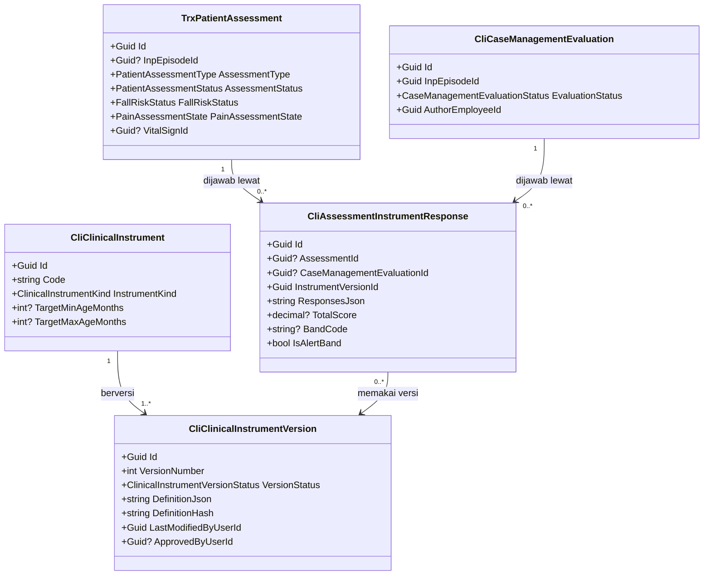
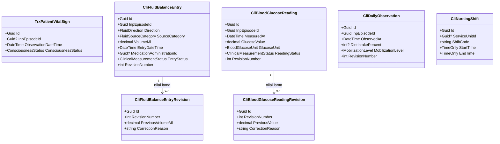
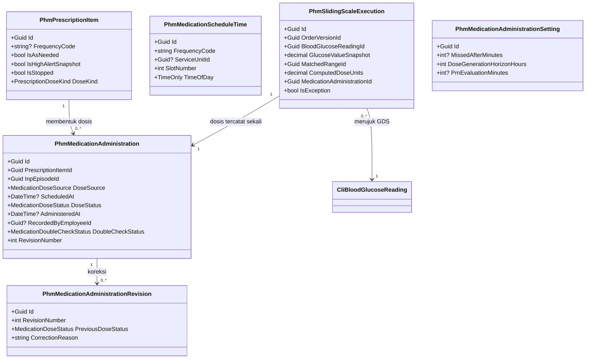
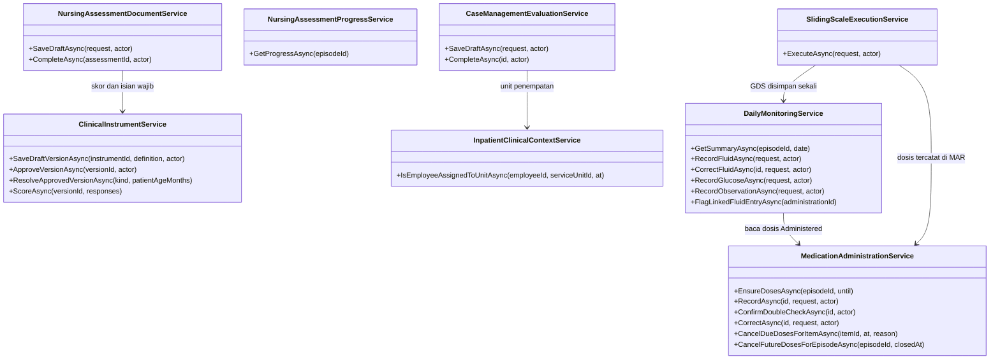

# Arsitektur Backend — Sub-modul `keperawatan` (Rawat Inap)

| Field | Nilai |
| --- | --- |
| Blueprint ID | `RWI-BP-001` |
| Sub-modul | `keperawatan` — satu dari tiga sub-modul modul `rawat-inap`, bentuk `COMPOSITE` sejak `RWI-DEC-082` |
| Revision | **`0.4`** — amandemen penyelarasan `PRD-RWI-V2-001`, blueprint revision `7`; isi baru pada **bagian 11**. `0.3` menyerap `RWI-DEC-091` |
| Status | **`draft`** untuk `0.4`. Revision `0.3` disetujui Muhammad Hamzah 2026-09-03 lewat `RWI-DEC-092` |
| Tanggal | 2 September 2026 (`Asia/Jakarta`); amandemen `0.4` 15 September 2026 |
| Kemampuan | `CAP-012`, `CAP-013`, `CAP-014`, `CAP-016`, `CAP-027` — `RWI-DEC-083` |
| Masukan baseline | `PRD-RWI-FINAL-001` v1.0.0 bagian 16, 17, 20, 23.1, 30.3 |
| Masukan keputusan | [`../00-interview-decisions.md`](../00-interview-decisions.md) revision `13` — `RWI-DEC-080` s.d. `RWI-DEC-083`, ditambah `RWI-DEC-089` (`CAP-016` `DEFERRED`) dan **`RWI-DEC-091`** (koreksi dibedakan dari perkembangan) |
| Peta modul | [`../02-module-map.md`](../02-module-map.md) revision `1` |
| Manifest sub-modul | [`blueprint-manifest.md`](./blueprint-manifest.md) |
| Backend SHA | `5afb54bd75281648010e50ef14f43ca1f80d8efd` (branch `MHamzah`); audit as-is dijalankan 2026-09-02 |
| `domain_architecture_readiness` | `DOMAIN_ARCHITECTURE_NOT_RUN` — `/qv-domain` tidak dijalankan untuk slice ini. Alasannya: batas konteks dan kepemilikan datanya **sudah** ditetapkan `RWI-DEC-081` dan `PRD-RWI-FINAL-001` bagian 23.1, sehingga tidak ada batas domain yang perlu diturunkan ulang |

---

## 0. Kalimat terpenting pada dokumen ini

> **Sub-modul ini tidak memiliki satu tabel pun, dan itu disengaja.**

`RWI-DEC-081` dan `PRD-RWI-FINAL-001` bagian 23.1 menetapkan Nursing Assessment, Nursing Care, dan
Nursing Interventions dimiliki **`ClinicalManagement`**; Nutrition Assessment/Care dimiliki **modul
Gizi**. Rawat Inap hanya menyediakan **konteks episode, ruang kerja, dan kontrak**.

Karena itu dokumen ini berbeda bentuk dari `02-backend-architecture.md` milik
`episode-rawat-inap`. Ia tidak merancang tabel milik sendiri; ia menyatakan:

1. apa yang **sudah ada** dan dapat dipakai apa adanya;
2. apa yang **kurang** dan diminta kepada modul pemiliknya, beserta bentuk persisnya;
3. penjaga apa yang membuktikan sub-modul ini **tidak** membuat tabel tandingan.

Bila kelak desain terasa menuntut tabel `Inp*` untuk pengkajian atau catatan keperawatan, yang
benar adalah kembali ke `/qv-grill`, **bukan** membuatnya diam-diam. Larangan ini diwariskan
`RWI-DEC-081` dan tercatat pada `blueprint-manifest.md` bagian 8.

---

## 1. Bounded context dan ownership

### 1.1 Kedudukan sub-modul ini

| Hal | Ketetapannya |
| --- | --- |
| Jenis konteks | **Workspace context** — mengumpulkan dan menyajikan, bukan memiliki |
| Aggregate root yang dimiliki | **Nol** |
| Aggregate root yang **dibaca** | `InpEpisode` milik `episode-rawat-inap`; `TrxPatientAssessment` milik `ClinicalManagement` |
| Transaction boundary | **Tidak ada transaksi milik sub-modul ini.** Setiap tulisan terjadi di dalam transaksi milik modul pemilik tabelnya |
| Yang menjadi milik sub-modul ini | **Aturan kewenangan berbasis episode** dan **kontrak konteks** — lihat 1.3 |

### 1.2 Konteks yang bersinggungan

| Konteks | Modul | Hubungannya dengan sub-modul ini |
| --- | --- | --- |
| `CTX-INP` Episode rawat inap | `InPatientManagement` / `episode-rawat-inap` | **Dibaca.** Sumber konteks: pasien siapa, di mana, episodenya hidup atau tidak, perawat penanggung jawabnya siapa |
| `CTX-CLI` Dokumentasi klinis | `ClinicalManagement` | **Pemilik tabel** pengkajian, asuhan, dan tindakan keperawatan |
| `CTX-NUT` Gizi | Modul Gizi (`PLANNED`) | **Pemilik** asuhan gizi. Sub-modul ini hanya menghasilkan pemicu rujukan dan membaca statusnya |
| `CTX-INV` Persediaan dan aset | Modul persediaan | Pemilik master alat. **Kepemilikan catatan pemakaiannya belum diputuskan** — lihat 2.3 |
| `CTX-BIL` Billing | `BillingManagement` | Penerima pemicu tagihan untuk tindakan dan pemakaian alat yang dapat ditagih |

### 1.3 Satu-satunya hal yang benar-benar dimiliki sub-modul ini

**Aturan kewenangan berbasis episode.** Hari ini kewenangan menulis dokumentasi klinis diturunkan
dari **antrean** atau **kunjungan IGD**. Pasien rawat inap tidak punya keduanya. Yang
menggantikannya adalah episode:

| Invariant | Bunyinya | Kenapa milik sub-modul ini |
| --- | --- | --- |
| `INV-KEP-01` | Sebuah pengkajian, asuhan, atau tindakan keperawatan rawat inap **hanya** boleh dibuat bila ada `InpEpisode` yang berstatus `Admitted` untuk `EncounterId` yang sama | Episode adalah milik modul ini; mesin klinis tidak tahu apa itu episode |
| `INV-KEP-02` | Episode yang sudah `Closed` **tidak** menerima dokumentasi baru; isinya menjadi hanya-baca | `AC-CAP013-03` menuntut riwayat tetap terbaca setelah penutupan |
| `INV-KEP-03` | Dokumentasi keperawatan **tidak pernah** menahan pekerjaan dokter maupun penempatan tempat tidur | `PRD` bagian 16.3: "Dokter tidak perlu menunggu Initial Nursing Assessment selesai". Menjadikannya gerbang akan menahan pasien di IGD atau di lorong |

`INV-KEP-03` adalah penjaga keselamatan, bukan kenyamanan. Ia melarang siapa pun kelak
menjadikan pengkajian sebagai syarat penempatan.

---

## 2. Tabel kepemilikan data

> Tabel kepemilikan data **seluruh modul** ada di [`../02-module-map.md`](../02-module-map.md)
> bagian 2. Yang di bawah ini hanya kelompok data yang disentuh sub-modul ini, beserta
> statusnya.

### 2.1 Yang dipakai, tidak dibuat ulang

| Kelompok data | Modul pemilik | Dipakai sub-modul ini | Dibuat ulang |
| --- | --- | :---: | --- |
| Pasien | Patient Management | Ya — dibaca lewat episode | **Tidak** |
| Kunjungan pasien | Registration Management | Ya — jangkar `EncounterId` | **Tidak** |
| Episode rawat inap | `episode-rawat-inap` | Ya — sumber konteks dan kewenangan | **Tidak** |
| Perawat penanggung jawab | `episode-rawat-inap` | Ya — `InpNurseAssignment` menentukan siapa yang berwenang | **Tidak** |
| Pengkajian pasien | **Clinical Management** | Ya — **ditulis** lewat endpoint milik modul itu | **Tidak** — `RWI-DEC-081`, PRD 23.1 |
| CPPT | **Clinical Management** | Ya — catatan keperawatan tampil di sana | **Tidak** |
| Tanda vital | **Clinical Management** | Ya — dibaca dan ditulis lewat endpoint milik modul itu | **Tidak** |
| Alergi, riwayat penyakit, riwayat keluarga | **Clinical Management** | Ya — dibaca saat pengkajian awal | **Tidak** |
| Asuhan gizi | **Modul Gizi** (`PLANNED`) | Status dan ringkasannya dibaca | **Tidak** — PRD 23.1 |
| Master alat/aset | Modul persediaan | Ya — dirujuk lewat Id | **Tidak** |

### 2.2 Yang **belum ada di mana pun** dan diminta kepada pemiliknya

Ketiga kelompok berikut tidak punya tabel di seluruh repository per audit 2026-09-02. Karena
pemiliknya sudah ditetapkan, yang dilakukan sub-modul ini adalah **meminta**, bukan membuat.

| Kelompok data | Modul pemilik | Keadaan hari ini | Diminta oleh |
| --- | --- | --- | --- |
| Rencana asuhan keperawatan | **Clinical Management** | **Tidak ada.** Nol berkas `*CarePlan*`, nol berkas `*Nursing*` | `CAP-013`, bagian 4.2 |
| Tindakan/catatan keperawatan | **Clinical Management** | **Tidak ada yang cocok.** `TrxPatientProcedure` mewajibkan `ConsultationId` dan `DoctorId`, sehingga tindakan perawat tidak dapat masuk ke sana | `CAP-014`, bagian 4.3 |
| Riwayat amandemen pengkajian | **Clinical Management** | **Tidak ada.** `TrxPatientAssessment` tidak menyimpan versi | `CAP-012` aturan 13, bagian 4.1 |

### 2.3 Satu kelompok data yang kepemilikannya **sengaja ditunda** — `RWI-DEC-089`

| Kelompok data | Pemilik | Dipakai sub-modul ini | Dibuat ulang |
| --- | --- | :---: | --- |
| Catatan pemakaian alat pada pasien | **Sengaja ditunda** — `RWI-DEC-089` | `CAP-016`, berstatus `DEFERRED` | **Tidak.** Tidak oleh sub-modul ini, dan tidak oleh sub-modul mana pun |

**Ditutup 2026-09-02 oleh `RWI-DEC-089`.** Pertanyaannya tidak dijawab dengan memilih salah satu pemilik, melainkan dengan **menunda kemampuannya secara tertulis** — dan itu jawaban yang sah. Baris ini tetap ditulis apa adanya supaya pembaca berikutnya tahu kemampuan ini pernah ada, sengaja ditunda, dan punya jalan kembali.

| Hal | Keadaannya |
| --- | --- |
| Kenapa sempat terbuka | `PRD-RWI-FINAL-001` bagian 23.1 memuat 28 baris *source of truth* dan **tidak satu pun** menyebut Equipment Usage. `RWI-DEC-081` juga tidak menyebutnya — keputusan itu hanya mencakup pengkajian, CPPT, SOAP, kajian medis, resep, dan tindakan |
| Calon pemiliknya | Tiga: modul persediaan/aset (karena alatnya miliknya), `ClinicalManagement` (karena pemakaiannya peristiwa klinis), atau `InPatientManagement` (karena terikat episode). **Calon pertama ternyata belum berwujud** — `RWI-FACT-015` membuktikan `Areas/` tidak memuat modul persediaan/aset mana pun, dan tidak ada master alat medis sama sekali |
| Kenapa akhirnya ditunda, bukan dipilih | Memilih pemilik tabel adalah keputusan pemilik modul, bukan keputusan blueprint. Lebih dari itu, `RWI-FACT-015` menunjukkan memilih sekarang berarti menaruh tabel di atas modul yang belum lahir. `PRD` bagian 20 aturan 2 melarang **menduplikasi master alat**, dan hari ini larangan itu bahkan tidak punya objek untuk dilanggar |
| Akibatnya | `CAP-016` berstatus `DEFERRED` - dikeluarkan dari scope rilis pertama secara tertulis lewat `RWI-DEC-089`, dan **MUST NOT** masuk gelombang pengiriman mana pun — `04-prd-to-mvp.md` bagian 8 dan 19. **Nol tabel, nol migration, nol endpoint** untuk kemampuan ini |
| Yang **tidak** ditahannya | `CAP-012`, `CAP-013`, `CAP-014`, dan `CAP-027`. Keempatnya kepemilikannya sudah tegas |

**Pemicu masuk kembali.** Begitu modul persediaan/aset masuk roadmap Quilvian, `RWI-OQ-048` dibuka ulang untuk menetapkan pemilik tabelnya, dan barulah task pemakaian alat boleh dibuat — `RWI-AC-171`. Sampai saat itu, sub-modul ini **MUST NOT** membuat tabel pemakaian alat sendiri; larangan itu setara `RWI-DEC-081`.

---

## 3. Penghalang teknis: *shared inpatient clinical context resolver*

`PRD-RWI-FINAL-001` bagian 30.3 menyebutnya *critical technical gap*. Audit source 2026-09-02
menemukan bentuknya **jauh lebih kecil dari yang diduga** — dan itu temuan terpenting dokumen ini.

### 3.1 Keadaan sebenarnya di source hari ini

| Yang diduga | Yang sebenarnya |
| --- | --- |
| Mesin klinis mewajibkan antrean, sehingga butuh jalur baru | Jalur **tanpa antrean sudah ada** dan sudah berjalan di produksi untuk pasien IGD |
| Butuh subsistem resolver baru | Butuh **satu cabang tambahan** pada satu method validasi yang sudah ada |

Buktinya: `Areas/HealthServices/ClinicalManagement/Controllers/PatientAssessmentController.cs`
method `ValidateCreateWithoutQueueAsync`. Kolom `TrxPatientAssessment.QueueId` **sudah**
`Guid?` — nullable — dan `CreateAssessment` sudah mengambil identitas klinis dari encounter
ketika antrean tidak ada.

Yang menutup pintu bagi rawat inap hanya satu pemeriksaan:

```text
Jalur tanpa antrean terbuka HANYA bila encounter punya baris kunjungan IGD.
Bila tidak: ditolak, "Pengkajian tanpa antrean hanya untuk pasien IGD."
```

Komentar `IGD-DEC-109` pada berkas itu menjelaskan kenapa gerbangnya sempit: melepas kewajiban
antrean **tanpa syarat** akan membuat pengkajian rawat jalan dapat dibuat melewati screening.
Alasan itu benar dan **tetap berlaku** — jadi yang diminta bukan mencabut gerbangnya, melainkan
**menambah satu pintu yang syaratnya setara**.

### 3.2 Bentuk yang diminta

| Hal | Ketetapannya |
| --- | --- |
| Pemilik perubahan | **`ClinicalManagement`** — Muhammad Hamzah, persetujuan sudah diberikan `RWI-DEC-062` |
| Bentuk perubahan | Cabang ketiga pada `ValidateCreateWithoutQueueAsync`: encounter diterima bila punya `InpEpisode` berstatus `Admitted` |
| Syarat yang setara dengan IGD | IGD memakai keberadaan `EmgVisit`; rawat inap memakai keberadaan `InpEpisode` **yang sedang `Admitted`**. Keduanya sama-sama bukti pasien benar-benar sedang dilayani, bukan sekadar terdaftar |
| Yang **tidak** boleh berubah | Perilaku rawat jalan dan medical check-up. `RWI-DEC-070` menegaskan keduanya tetap wajib berantrean |
| Kenapa `Admitted`, bukan sekadar episode ada | Episode `Draft` berarti pasien belum tiba. Menerima `Draft` membuat pengkajian dapat ditulis untuk pasien yang belum ada di kamar |
| Nol kolom baru | Perubahan ini **tidak** menyentuh satu kolom pun. Ia murni pelonggaran validasi |

### 3.3 Kenapa ini bukan pekerjaan sub-modul ini

Perubahannya ada di dalam controller milik `ClinicalManagement`. Sub-modul ini **menyatakan
kebutuhannya dan menyediakan cara memeriksanya** — pembacaan `InpEpisode` — tetapi tidak menulis
kodenya. Kontraknya ada di [`contracts/integration-contract.md`](./contracts/integration-contract.md)
sebagai `INT-KEP-01`.

---

## 4. Entity: yang ada, yang diperluas, yang diminta baru

Status memakai kosakata `Sudah ada` / `Diperbarui` / `Baru`. Kolom **Pemilik** menyebut modul yang
berwenang mengubahnya — **bukan** sub-modul ini.

### 4.1 `TrxPatientAssessment` — `Diperbarui`

| Hal | Isinya |
| --- | --- |
| Status | **`Diperbarui`** |
| Pemilik | `ClinicalManagement` |
| Lokasi file | `Areas/HealthServices/ClinicalManagement/Models/TrxPatientAssessment.cs` |
| Keadaan hari ini | **85 kolom.** Sudah memuat kajian umum, kesadaran, tanda vital, EWS, nyeri, alergi, imunisasi, gizi, risiko jatuh, status fungsional, psikososial, edukasi, dan catatan perawat |
| Penilaian terhadap PRD bagian 16.1 | **Sepuluh dari tiga belas** section target sudah tertampung kolomnya |

Kolom yang **diminta ditambahkan**, satu per satu:

| Kolom | Tipe | Wajib | Bawaan | Kenapa | Sensitif |
| --- | --- | :---: | --- | --- | :---: |
| `InpEpisodeId` | `Guid?` | Tidak | `null` | PRD 16.2 aturan 1: pengkajian wajib terikat ke episode. Nullable karena pengkajian poliklinik dan IGD tidak punya episode | Tidak |
| `AssessmentType` | `enum` | Ya | `Initial` | PRD 16.2 aturan 3: initial dan reassessment **wajib** record terpisah. Tanpa kolom ini keduanya tidak dapat dibedakan | Tidak |
| `DueAt` | `DateTime?` | Tidak | `null` | PRD 16.2 aturan 11: sistem wajib dapat memantau `DueAt`, `CompletedAt`, dan keadaan terlambat | Tidak |
| `PolicyId` | `Guid?` | Tidak | `null` | Menunjuk konfigurasi SLA yang berlaku saat pengkajian dibuat, supaya perubahan kebijakan tidak mengubah penilaian keterlambatan yang lalu | Tidak |
> **Dua kolom dicabut pada revision `0.3`.** `AmendedAt` dan `AmendedByUserId` sempat dirancang di sini
> untuk memenuhi PRD 16.2 aturan 13. Keduanya **tidak jadi diminta**: sejak `RWI-DEC-091`, penulis, waktu,
> alasan, dan nomor urut koreksi disimpan mesin addendum milik `MedicalRecordManagement`, yang sudah ada
> dan sudah dipakai catatan terpadu. Menyimpannya dua kali membuat dua sumber jawaban atas pertanyaan
> yang sama.

Enum yang diminta:

| Enum | Nilai | Bawaan |
| --- | --- | --- |
| `PatientAssessmentType` | `Initial`, `Reassessment`, `DailyReassessment`, `DischargePlanning` | `Initial` |
| `PatientAssessmentStatus` — **tidak jadi diperluas** | `Draft`, `InProgress`, `Completed`, `Cancelled` — **nol nilai baru** sejak revision `0.3` | `Draft` |

> **Revision `0.3`: `Amended` tidak jadi ditambahkan.** PRD 16.2 aturan 10 menyebut `NotStarted`,
> `Draft`, `Completed`, dan `Amended`. Dua di antaranya **sengaja tidak dibuat**. `NotStarted` karena
> "belum dimulai" berarti tidak ada barisnya; `Amended` karena sejak `RWI-DEC-091` pertanyaan "apakah
> dokumen ini pernah dikoreksi" dijawab **riwayat addendum**, bukan status dokumen. Menyimpan keduanya
> membuat jawabannya bercabang — lihat bagian 8.

Index dan constraint yang diminta:

| Nama | Bentuk | Kenapa |
| --- | --- | --- |
| `IX_TrxPatientAssessment_InpEpisodeId` | Index biasa pada `InpEpisodeId` | Ruang kerja membaca seluruh pengkajian satu episode |
| `IX_TrxPatientAssessment_Episode_Type_Active` | Index parsial `(InpEpisodeId, AssessmentType)` `WHERE AssessmentType = Initial AND IsDelete = false` | Menemukan pengkajian awal satu episode tanpa memindai seluruh tabel |
| Unique constraint | **Tidak diminta** | Menguncinya "satu pengkajian awal per episode" terdengar benar, tetapi pengkajian awal yang dibatalkan lalu diulang adalah kejadian nyata. Aturan itu dijaga di tingkat service, bukan database |
| `DeleteBehavior` pada `InpEpisodeId` | `Restrict` | Episode tidak boleh terhapus selagi pengkajiannya ada. Selaras dengan `AC-CAP013-03` |

### 4.2 Rencana asuhan keperawatan — `Baru`, milik `ClinicalManagement`

`CAP-013`. Bentuk yang diusulkan; **pemilik yang menetapkan bentuk akhirnya.**

| Class | Status | Pemilik | Lokasi file yang diusulkan | Kegunaan |
| --- | --- | --- | --- | --- |
| `TrxNursingCarePlan` | `Baru` | `ClinicalManagement` | `Areas/HealthServices/ClinicalManagement/Models/TrxNursingCarePlan.cs` | Satu rencana asuhan per episode; wadah bagi butir-butirnya |
| `TrxNursingCarePlanItem` | `Baru` | `ClinicalManagement` | `…/Models/TrxNursingCarePlanItem.cs` | Satu masalah keperawatan beserta tujuan, rencana tindakan, dan evaluasinya |
| `TrxNursingCarePlanItemRevision` | `Baru` | `ClinicalManagement` | `…/Models/TrxNursingCarePlanItemRevision.cs` | Salinan versi sebelumnya. `AC-CAP013-02` menuntut perubahan menyimpan riwayat **tanpa** mengubah penulis dan waktu versi lama |
| `MstNursingDiagnosis` | **`OPEN DECISION`** | `ClinicalManagement` / Master Data | — | Katalog terminologi. PRD 17 aturan 3 mensyaratkannya **hanya bila** rumah sakit memakai SDKI/SLKI/SIKI, dan itu belum dinyatakan |

**Kenapa butir dipisah dari rencananya.** Satu pasien punya beberapa masalah keperawatan yang
lahir dan tutup pada waktu berbeda. Menaruhnya dalam satu baris berarti menutup satu masalah
menyentuh baris yang sama dengan masalah lain yang masih berjalan.

**Kenapa revisi berbentuk tabel terpisah, bukan kolom.** `AC-CAP013-02` menuntut versi lama
mempertahankan penulis dan waktunya. Menimpa kolom akan menghapus keduanya.

### 4.3 Tindakan dan catatan keperawatan — `Baru`, milik `ClinicalManagement`

`CAP-014`.

| Class | Status | Pemilik | Lokasi file yang diusulkan | Kegunaan |
| --- | --- | --- | --- | --- |
| `TrxNursingIntervention` | `Baru` | `ClinicalManagement` | `…/Models/TrxNursingIntervention.cs` | Tindakan yang **benar-benar dilakukan** perawat: apa, kapan, oleh siapa, hasilnya, konteks episodenya |

Kolom yang material:

| Kolom | Tipe | Wajib | Kenapa | Sensitif |
| --- | --- | :---: | --- | :---: |
| `EncounterId` | `Guid` | Ya | Jangkar yang sama dengan seluruh dokumentasi klinis | Tidak |
| `InpEpisodeId` | `Guid?` | Tidak | Konteks episode. Nullable supaya tindakan keperawatan non-rawat-inap kelak dapat memakai tabel yang sama | Tidak |
| `CarePlanItemId` | `Guid?` | Tidak | **Nullable, dan ini keputusan.** PRD 17 `CAP-014` aturan 3: rencana boleh menjadi rujukan tetapi **bukan syarat** bagi tindakan mendadak yang perlu secara klinis | Tidak |
| `PerformedAt` | `DateTime` | Ya | Waktu tindakan, bukan waktu pencatatan | Tidak |
| `PerformedByEmployeeId` | `Guid` | Ya | Pelaku sebenarnya | Tidak |
| `ResultNote` | `string?` | Tidak | Hasil atau catatan | **Ya** |
| `IdempotencyKey` | `string?` | Tidak | `AC-CAP014-01`: satu tindakan tersimpan sekali walaupun permintaan diulang | Tidak |
| `BillingDispatchStatus` | `enum` | Ya | `AC-CAP014-02`: catatan klinis tetap tersimpan walaupun pengiriman ke Billing gagal | Tidak |
| `FinalizedAt` | `DateTime?` | Tidak | `AC-CAP014-03`: catatan yang sudah final tidak dapat disunting diam-diam | Tidak |

| Constraint | Bentuk | Kenapa |
| --- | --- | --- |
| Unique parsial pada `IdempotencyKey` | `WHERE IdempotencyKey IS NOT NULL AND IsDelete = false` | Menjaga `AC-CAP014-01` di database, bukan hanya di service. Percobaan ulang yang menembus lapisan aplikasi tetap tertolak |

> **Kenapa `TrxPatientProcedure` tidak dipakai ulang.** Ia mewajibkan `ConsultationId` dan
> `DoctorId`. Tindakan perawat tidak punya konsultasi dan tidak punya dokter. Melonggarkan kedua
> kolom itu menjadi nullable akan melemahkan penjagaan bagi tindakan **dokter**, yang justru
> memerlukannya untuk penagihan. Menambah tabel terpisah lebih murah daripada melemahkan tabel
> yang sudah dipakai modul lain.

### 4.4 CPPT — `Sudah ada`, dipakai apa adanya

| Hal | Isinya |
| --- | --- |
| Class | `TrxPatientIntegratedProgressNote` |
| Status | **`Sudah ada`** — nol perubahan diminta |
| Pemilik | `ClinicalManagement` |
| Kenapa cocok | Ia sudah punya `ProfessionType`, dan `EncounterId`, `QueueId`, `ConsultationId`, `DoctorId` seluruhnya **sudah** nullable. Catatan keperawatan dapat masuk tanpa satu perubahan pun |
| Kepemilikan kontraknya | **`dokter-rawat-inap`** — `CAP-021`, `RWI-DEC-083`. Sub-modul ini **menulis** ke sana, tidak memiliki kontraknya. CPPT memang lintas profesi; itu sifatnya |

### 4.5 Konfigurasi SLA klinis — `Baru`, milik `ClinicalManagement`

`CAP-012` aturan 11 menuntut SLA **dapat dikonfigurasi Clinical Governance**, dan melarang
menanam angka yang belum disetujui.

| Class | Status | Pemilik | Kegunaan |
| --- | --- | --- | --- |
| `MstClinicalAssessmentPolicy` | `Baru` | `ClinicalManagement` | Batas waktu per jenis pengkajian per jenis pelayanan, berversi supaya penilaian keterlambatan yang lalu tidak berubah saat kebijakan diubah |

> **Angkanya sengaja tidak diisi blueprint ini.** `RWI-RULE-021` masih menunggu pemilik klinis.
> Yang dirancang adalah **tempatnya**, bukan isinya. Modul dengan master kosong tidak dapat
> dipakai — karena itu bagian 7 menyatakan rencana data master awalnya, dan bagian 9 menyatakan
> apa yang terjadi selama angkanya belum ada.

---

## 5. Arsitektur folder

Tidak ada folder baru di bawah `Areas/HealthServices/InPatientManagement/`. Seluruh berkas yang
diminta berada di dalam modul pemiliknya.

```text
Areas/HealthServices/ClinicalManagement/          ◄── PEMILIK, bukan sub-modul ini
├── Controllers/
│   ├── PatientAssessmentController.cs            Diperbarui — cabang episode pada validasi
│   ├── NursingCarePlanController.cs              Baru
│   └── NursingInterventionController.cs          Baru
├── Models/
│   ├── TrxPatientAssessment.cs                   Diperbarui — 6 kolom
│   ├── TrxNursingCarePlan.cs                     Baru
│   ├── TrxNursingCarePlanItem.cs                 Baru
│   ├── TrxNursingCarePlanItemRevision.cs         Baru
│   ├── TrxNursingIntervention.cs                 Baru
│   └── MstClinicalAssessmentPolicy.cs            Baru
├── Enums/
│   ├── PatientAssessmentStatus.cs                Sudah ada — nol perubahan (`0.3`)
│   ├── PatientAssessmentType.cs                  Baru
│   ├── NursingCarePlanItemStatus.cs              Baru
│   └── NursingBillingDispatchStatus.cs           Baru
└── Services/
    ├── InpatientClinicalContextResolver.cs       Baru — penjaga `INV-KEP-01`
    ├── NursingCarePlanService.cs                 Baru
    └── NursingInterventionService.cs             Baru

Areas/HealthServices/InPatientManagement/         ◄── NOL berkas baru dari sub-modul ini
```

> **Utang teknis yang sengaja tidak dirapikan.** `PatientAssessmentController.cs` berisi 1.298
> baris dan memuat logika bisnis di dalam controller, bukan di service — menyimpang dari pola
> `Controller → Service` yang dipakai `InPatientManagement`. Sub-modul ini **tidak** merapikannya:
> pemiliknya modul lain, dan refactor 1.298 baris di tengah penambahan fitur adalah dua pekerjaan
> yang digabung. Ditandai sebagai utang, bukan ditiru dan bukan pula diperbaiki diam-diam.

---

## 6. Status model dan dampak migration

| Tabel | Status | Kolom yang berubah | Dampak migration |
| --- | --- | --- | --- |
| `TrxPatientAssessment` | `Diperbarui` | `InpEpisodeId`, `AssessmentType`, `DueAt`, `PolicyId` — **empat** sejak revision `0.3`, seluruhnya nullable kecuali `AssessmentType` yang punya nilai bawaan | Dapat berjalan tanpa mematikan layanan. Baris lama terisi `AssessmentType = Initial` |
| `TrxNursingCarePlan` | `Baru` | — | Tabel baru, kosong |
| `TrxNursingCarePlanItem` | `Baru` | — | Tabel baru, kosong |
| `TrxNursingCarePlanItemRevision` | `Baru` | — | Tabel baru, kosong |
| `TrxNursingIntervention` | `Baru` | — | Tabel baru, kosong |
| `MstClinicalAssessmentPolicy` | `Baru` | — | Tabel master baru; **wajib diisi** sebelum pemantauan keterlambatan menyala |
| `TrxPatientIntegratedProgressNote` | `Sudah ada` | **Nol** | Tidak ada |
| `TrxPatientProcedure` | `Sudah ada` | **Nol** | Tidak ada — sengaja tidak dilonggarkan, lihat 4.3 |

---

## 7. Rencana migration

> Urutan **antar** sub-modul dipegang [`../02-module-map.md`](../02-module-map.md) bagian 3.4.
> Yang di bawah ini urutan **di dalam** sub-modul ini, dan seluruhnya dijalankan **oleh pemilik
> `ClinicalManagement`**, bukan oleh task Rawat Inap.

### 7.1 Urutan

| No | Langkah | Tanpa mematikan layanan | Keterangan |
| ---: | --- | :---: | --- |
| 1 | Tambah enum `PatientAssessmentType`. **Nilai `Amended` tidak jadi ditambahkan** — `RWI-DEC-091` mencabutnya | Ya | Perubahan kode |
| 2 | Buat `MstClinicalAssessmentPolicy` | Ya | Tabel baru |
| 3 | Tambah **empat** kolom pada `TrxPatientAssessment` | Ya | Seluruhnya nullable atau bernilai bawaan; baris lama tidak perlu disentuh |
| 4 | Buat empat tabel transaksi keperawatan | Ya | Tabel baru |
| 5 | Buat index episode dan unique parsial `IdempotencyKey` | Ya | Tabel masih kosong |
| 6 | Daftarkan `DbSet` dan service pada `ApplicationDbContext` serta `Program.cs` | Ya | Perubahan kode |
| 7 | **Longgarkan validasi**: cabang episode pada `ValidateCreateWithoutQueueAsync` | **Tidak sepenuhnya** | Mengubah perilaku endpoint yang sudah dipakai IGD dan poliklinik. Lihat 7.3 |

### 7.2 Pengisian data lama

**Tidak ada data lama yang perlu dipindahkan.** Belum ada satu pun pengkajian rawat inap di dalam
sistem, karena jalurnya memang belum terbuka. Baris `TrxPatientAssessment` yang sudah ada milik
poliklinik dan IGD; keempat kolom baru dibiarkan `null` dan `AssessmentType` terisi `Initial`.

Yang perlu diperiksa sebelum langkah 7: pastikan tidak ada encounter rawat jalan yang punya
`InpEpisode` menggantung berstatus `Admitted`. Bila ada, cabang baru akan membuka pengkajian
tanpa antrean bagi encounter yang seharusnya tetap berantrean.

### 7.3 Langkah mundur bila gagal

| Langkah gagal | Cara mundur |
| --- | --- |
| 1 s.d. 6 | Migration mundur. Tidak ada data hilang: tabelnya baru dan kosong, kolomnya nullable |
| 7 | Kembalikan `ValidateCreateWithoutQueueAsync` ke bentuk semula. Tidak ada bentuk data yang berubah, sehingga tidak ada yang perlu dipulihkan |

Langkah 7 sengaja paling akhir supaya seluruh tempat penyimpanan sudah berdiri sebelum satu-satunya
perubahan perilaku dijalankan.

---

## 8. Rencana data master awal

| Master | Isi minimum | Sumber nilai |
| --- | --- | --- |
| `MstClinicalAssessmentPolicy` | Sekurang-kurangnya satu baris berlaku untuk jenis pelayanan rawat inap: batas waktu pengkajian awal, batas waktu pengkajian ulang harian | **`RWI-RULE-021`, menunggu pemilik klinis** |
| `MstNursingDiagnosis` | Bergantung `OPEN DECISION` pada 4.2 | Katalog SDKI bila rumah sakit memakainya |

> **Selama `MstClinicalAssessmentPolicy` kosong, apa yang terjadi.** Pengkajian tetap dapat dibuat,
> disimpan, dan dibaca — `DueAt` sekadar tidak terisi dan tidak ada yang dinyatakan terlambat.
> Pemantauan keterlambatan mati, pencatatan hidup. Ini keputusan sadar: menahan pencatatan karena
> angka kebijakan belum turun akan menahan pekerjaan perawat demi laporan.

---

## 9. Yang sengaja tidak dibuat

| Yang ditolak | Alasan |
| --- | --- |
| `InpNursingAssessment` atau tabel `Inp*` apa pun untuk dokumentasi klinis | `RWI-DEC-081` dan PRD 23.1 menaruhnya pada `ClinicalManagement`. Membuat tandingan adalah pelanggaran batas, bukan kemandirian |
| Status `NotStarted` pada `PatientAssessmentStatus` | PRD 16.2 aturan 10 menyebutnya, tetapi "belum dimulai" berarti **tidak ada barisnya** — bukan baris berstatus tertentu. Menyimpannya sebagai status memaksa membuat baris kosong untuk setiap episode. Ruang kerja menurunkan "belum dimulai" dari ketiadaan baris |
| Status episode keenam untuk menandai pengkajian selesai | `RWI-DEC-009` mengunci lima nilai status episode, dan `AC-CAP012-03` secara tegas melarang menambah status episode baru |
| Melonggarkan `ConsultationId` dan `DoctorId` pada `TrxPatientProcedure` | Melemahkan penjagaan bagi tindakan dokter yang membutuhkannya untuk penagihan. Lihat 4.3 |
| Menyalin master alat ke dalam modul ini | PRD 20 aturan 2 melarangnya tegas |
| **Kolom amandemen per tabel** (`AmendedAt`, `AmendedByUserId`, `AmendReason`) | Mesin addendum `MedicalRecordManagement` sudah menyimpan penulis, alasan, waktu, dan nomor urut koreksi. Menyalinnya ke tabel sendiri melahirkan dua sumber jawaban — `RWI-DEC-091` |
| **Nilai status `Amended`** pada mesin pengkajian dan mesin catatan tindakan | Status kunci ditambah riwayat addendum sudah menjawab "apakah dokumen ini pernah dikoreksi". Status keenam membuat jawabannya bercabang — `RWI-DEC-091`, sejalan keputusan sub-modul `dokter-rawat-inap` |
| **Penjaga penguncian sendiri di `ClinicalManagement`** | Itu mesin koreksi tandingan, dilarang `RWI-DEC-087`. Bila `RWI-OQ-051` ditolak, yang benar adalah kembali ke `/qv-grill` |
| Tabel gizi milik Rawat Inap | PRD 23.1 menaruh Nutrition Assessment/Care pada modul Gizi. Sub-modul ini hanya menghasilkan pemicu rujukan dan membaca status |
| Menjadikan pengkajian awal sebagai gerbang penempatan atau gerbang instruksi dokter | `INV-KEP-03`. PRD 16.3 menyatakannya tegas |

---

## 10. Traceability

| Bagian | Requirement | Decision |
| --- | --- | --- |
| 1.3 invariant | PRD 16.3, `AC-CAP012-03` | `RWI-DEC-009` |
| 2 kepemilikan data | PRD 23.1 | `RWI-DEC-081`, `RWI-DEC-083` |
| 2.3 `CAP-016` ditunda | PRD 20, 23.1 (tidak memuat barisnya); `RWI-FACT-015` | `RWI-OQ-048` **tertutup** oleh `RWI-DEC-089` |
| 3 resolver | PRD 30.3 | `RWI-DEC-062`, `RWI-DEC-070`, `RWI-DEC-080` |
| 4.1 kolom pengkajian | PRD 16.2 aturan 1, 3, 10, 11, 13 | `RWI-DEC-081` |
| 4.2 asuhan keperawatan | PRD 17 `CAP-013`, `AC-CAP013-01` s.d. `03` | `RWI-DEC-081` |
| 4.3 tindakan keperawatan | PRD 17 `CAP-014`, `AC-CAP014-01` s.d. `03` | `RWI-DEC-081` |
| 4.5 SLA | PRD 16.2 aturan 11, `AC-CAP012-04` | `RWI-RULE-021` **terbuka** |
| 8 data master | PRD 16.2 aturan 11 | `RWI-RULE-021` **terbuka** |

---

## 11. Amandemen revision `0.4` — penyelarasan `PRD-RWI-V2-001` ★ 15 September 2026

### 11.0 Masukan, batas, dan cara membaca bagian ini

| Field | Nilai |
| --- | --- |
| Fase | `RLN-PH-06`; blueprint revision `7`; kontrak sub-modul `0.4.0` → **`0.5.0`** |
| Status | **`draft`** — belum disetujui manusia |
| Masukan keputusan | `../00-interview-decisions.md` revision `21`, SHA-256 `1c55c80a50aee11ef005ccde6315c2935cbe21504e8596798b89bf7f2d45102a` — `RWI-DEC-100`, `108`, `113` s.d. `120`, `124`, `131` s.d. `137`, `140`, `141`, `145` s.d. `149` |
| Masukan gate | `../evidence/02-requirement-completeness-gate.md` revision `1.6`, SHA-256 `f31d207ae0cac120b0821d4474a3d952e109293c2b517aa630370396e49b5300` — `INP-S17`, `INP-S18`, `INP-S19` sliding scale `READY_FOR_DOMAIN_DESIGN`; handover shift dan transfusi `DEFERRED` |
| Masukan keadaan saat ini | `../01-existing-capability-map.md` revision `1.4` bagian 17 — `RLN3-CAP-05` s.d. `22`, `RLN3-CAP-29`, `RLN3-CON-01` s.d. `04` |
| Masukan hulu | `PRD-RWI-V2-001` bagian 24–48; `PRD-to-MVP-Rawat-Inap-V2` `FR-MVP-KEP-001` s.d. `018`, `AC-MVP-025` s.d. `034`, `MVP-RWI-D-009`, `MVP-RWI-D-010` |
| Backend / frontend SHA | `df3679c0d5b2f08106702153eb242d3a6cb2929b` / `1ce219b40f8e411f3c4e66975626ab33ae81616a` |
| `domain_architecture_readiness` | **`DOMAIN_ARCHITECTURE_NOT_RUN`** — batas konteks dan kepemilikan sudah ditetapkan `RWI-DEC-081`, `117`, `118`, `132`, `147` s.d. `149`; gate `1.6` bagian 15.15 menyatakan arsitektur domain tidak diperlukan |

**Kalimat terpenting bagian 0 tetap berlaku:** sub-modul ini **tidak memiliki satu tabel pun**. Seluruh tabel baru di
bawah milik `ClinicalManagement` atau `PharmacyManagement`, dirancang di sini karena kemampuannya milik sub-modul ini.

**Koreksi nama yang basi.** Bagian 4.2, 4.3, 5, 6, dan 9 menulis `TrxNursingCarePlan`, `TrxNursingCarePlanItem`,
`TrxNursingCarePlanItemRevision`, dan `TrxNursingIntervention`. Nama yang benar-benar ada di source `df3679c0` adalah
**`CliNursingCarePlan`**, **`CliNursingCarePlanItem`**, **`CliNursingCarePlanItemRevision`**, dan
**`CliNursingIntervention`** — dibangun `BE-RWI-054` s.d. `065` dengan prefix registry `Cli`. Bagian lama dibaca dengan
nama yang benar; isinya tidak berubah.

### 11.1 Yang berubah dari revision `0.3`

| No | Yang berubah | Dari | Menjadi | Dasar |
| ---: | --- | --- | --- | --- |
| 1 | Susunan ruang kerja | Empat bagian: Pengkajian, Rencana Asuhan, Tindakan, Lini Masa | **Delapan menu**: Pengkajian Pasien, Asuhan Keperawatan, Tindakan, Penunjang Medis, Pemakaian Alat, Transfer Pasien, Pemesanan Ruangan Bedah, Tagihan Pasien. Layout V2 dipertahankan | PRD v`2.0` bagian 24–25 |
| 2 | Pengkajian | Satu dokumen datar dengan tujuh kelompok isian | **Tujuh isi**: Kajian Umum delapan bagian, Resiko Jatuh, Monitoring Nyeri, Assesment Edukasi, Pengawasan Harian, Evaluasi Awal (MPP), Perencanaan Pulang — beserta **progres lima bagian** | `RWI-DEC-118` s.d. `120`, `141` |
| 3 | Risiko jatuh | Dua centang dan batas `≥ 2` tertanam di controller (`RWI-FACT-036`) | **Instrumen klinis berversi** dihitung server, disahkan terpisah dari pengubahnya, versi disimpan pada setiap hasil | `RWI-DEC-124`, `RWI-DEC-136`, `RLN3-CON-01` |
| 4 | Isian formulir V1 | Kolom datar | **Formulir berversi** yang memakai ulang kolom V2 yang sudah ada dan hanya menyimpan isian baru sebagai jawaban terstruktur | `MVP-RWI-D-009`, `FR-MVP-KEP-003`, `FR-MVP-KEP-005` |
| 5 | Pengawasan Harian | Tidak ada | **Deret pencatatan**: tanda vital, cairan masuk dan keluar, gula darah, diet dan mobilisasi; nyeri dibaca dari Monitoring Nyeri; total per shift dan 24 jam dari data terstruktur | PRD bagian 32, `FR-MVP-KEP-017`, `RWI-DEC-149` |
| 6 | Obat | Tidak ada | **MAR per dosis** milik `PharmacyManagement`, rekonsiliasi obat bawaan (perancang aggregate: `dokter-rawat-inap`), **pelaksanaan sliding scale** | `RWI-DEC-116`, `117`, `132`, `133`, `145` s.d. `148` |
| 7 | Kewenangan menulis perawat | `VAL-KEP-05` membaca `InpNurseAssignment` | **Unit tempat episode berada**, sudah berlaku sejak `0.4.0`. Pemeriksaannya dipakai bersama MPP | `RWI-DEC-100`, `RWI-DEC-131` |
| 8 | SOAP dan catatan perawat | CPPT berprofesi Perawat tanpa jenis | Dua jenis catatan: `NursingSoap` dan `NursingNarrative` — kolom dirancang `dokter-rawat-inap` | `RWI-DEC-115`, `RWI-DEC-140` |
| 9 | Menu yang backend-nya belum ada | Tidak dibahas | Tampil "Integrasi belum tersedia" tanpa data tiruan | `RWI-DEC-108`, `113`, `137` |

### 11.2 Invariant baru

Penomoran melanjutkan `INV-KEP-03`.

| ID | Bunyinya | Ditegakkan di mana | Contoh |
| --- | --- | --- | --- |
| `INV-KEP-04` | **Satu fakta klinis, satu tempat.** Tanda vital hanya di `TrxPatientVitalSign`; skor nyeri hanya pada dokumen Monitoring Nyeri; GDS hanya di `CliBloodGlucoseReading`; alat bantu satu isian | Struktur tabel dan definisi formulir yang memakai **pengikatan kolom** | Kondisi Umum Budi menampilkan tanda vital 08.00 dari deret tanda vital, bukan salinan |
| `INV-KEP-05` | Satu dosis MAR punya tepat satu status berlaku; pelaksana dari akun login; kiriman ulang tidak menggandakan; obat high-alert final hanya setelah pemeriksa kedua **berbeda** | `MedicationAdministrationService` | Ns. Siti menekan Simpan dua kali → satu pemberian |
| `INV-KEP-06` | Satu dosis MAR paling banyak satu entri intake aktif, hanya dari dosis `Administered` | Unique parsial + service | Entri kedua untuk Ceftriaxone 08.00 → `409` |
| `INV-KEP-07` | Dosis sliding scale hanya dihitung dari GDS bangsal dan order `Active`; satuan GDS harus sama dengan satuan protokol | `SlidingScaleExecutionService` | GDS lab 190 tidak tersedia sebagai sumber; GDS 15,6 mmol/L terhadap protokol mg/dL → ditolak |
| `INV-KEP-08` | Versi konfigurasi klinis `Draft` tidak dipakai pasien sungguhan; skor dan kategori dihitung server dari versi yang disimpan pada hasil | `ClinicalInstrumentService` + pengaturan lingkungan `ClinicalConfiguration:AllowDraftVersionsForTesting` bernilai `false` di produksi | Tanpa versi sah, Resiko Jatuh boleh disimpan sebagai konsep tetapi tidak dapat diselesaikan |
| `INV-KEP-09` | Progres pengkajian dihitung dari keadaan dokumen, bukan temuan klinis; kegagalan memuat bukan "○ Belum diisi" | `NursingAssessmentProgressService` | Resiko Jatuh selesai berkategori Tinggi → ✓ dan alert terpisah |
| `INV-KEP-10` | Evaluasi Awal hanya ditulis pemegang hak MPP yang ditempatkan di unit episode | `CaseManagementEvaluationService` memakai pemeriksaan unit bersama | Ns. Dewi MPP Melati menulis untuk pasien Anggrek → `403` |
| `INV-KEP-11` | Nilai terukur dikoreksi dengan revisi yang menyimpan nilai lama; total dihitung dari nilai berlaku | Tabel revisi per entity | Intake 100 ml dikoreksi 80 ml → total 980 ml, riwayat 100 ml tetap |

### 11.3 Kepemilikan data — yang disentuh isi baru

Tabel seluruh modul ada di `../02-module-map.md` bagian 2 revision `2`.

| Kelompok data | Modul pemilik | Dipakai sub-modul ini | Dibuat ulang | Perancang |
| --- | --- | :---: | --- | --- |
| Instrumen dan formulir klinis berversi | `ClinicalManagement` | Ya | **Tidak** — konsep baru di pemiliknya, `RWI-DEC-124` | `keperawatan` |
| Jawaban formulir dan hasil skor per dokumen pengkajian | `ClinicalManagement` | Ya | **Tidak** | `keperawatan` |
| Dokumen Kajian Umum, Resiko Jatuh, Monitoring Nyeri, Edukasi, Perencanaan Pulang | `ClinicalManagement` — `TrxPatientAssessment` **sudah ada** | Ya | **Tidak** — jenis dokumen bertambah | `keperawatan` |
| Evaluasi Awal MPP | `ClinicalManagement` | Ya | **Tidak** — dokumen tersendiri di pemiliknya, `RWI-DEC-118` | `keperawatan` |
| Tanda vital rawat inap | `ClinicalManagement` — `TrxPatientVitalSign` **sudah ada** | Ya | **Tidak** | `keperawatan` |
| Cairan masuk dan keluar | `ClinicalManagement` | Ya | **Tidak** — `RWI-DEC-081` melarang menyalin `EmgObservationDetail` | `keperawatan` |
| Gula darah bangsal | `ClinicalManagement` | Ya; dibaca pelaksanaan sliding scale | **Tidak** — `RWI-DEC-148` | `keperawatan` |
| Diet, mobilisasi, lingkar perut, agitasi | `ClinicalManagement` | Ya | **Tidak** | `keperawatan` |
| Batas jam shift untuk total | `ClinicalManagement` | Ya | **Tidak** — hanya untuk menghitung total, **bukan** gerbang kewenangan (`RWI-DEC-100`) | `keperawatan` |
| MAR, revisinya, jadwal dosis per frekuensi, pengaturan MAR | `PharmacyManagement` | Ya | **Tidak** — `RWI-DEC-117` | `keperawatan` |
| Pelaksanaan sliding scale | `PharmacyManagement` | Ya | **Tidak** — `RWI-DEC-147` | `keperawatan` |
| Dugaan reaksi obat | `ClinicalManagement` — `TrxPatientAllergy` **sudah ada** | Ya | **Tidak** — gate `G-16` | `keperawatan` |
| Rekonsiliasi obat, order dan template sliding scale, jenis catatan CPPT, pesanan dengan instruksi | `PharmacyManagement`, `ClinicalManagement`, `LaboratoryManagement`, `RadiologyManagement` | Ya — permukaan | **Tidak** | **`dokter-rawat-inap`** |
| Perpindahan tempat tidur | `InPatientManagement` | Ya — menu Transfer Pasien | **Tidak** | `episode-rawat-inap` |
| Ringkasan tagihan | `BillingManagement` | Ya — menu Tagihan Pasien, bila kontrak ada | **Tidak** — `RWI-DEC-137` | Diminta kepada pemilik Billing |
| Handover shift, transfusi | — | **Tidak** | **Tidak dibuat siapa pun** | `DEFERRED` — `RWI-DEC-145` |
| Pemakaian alat, pemesanan kamar operasi | — | Permukaan saja | **Tidak** | `DEFERRED` — `RWI-DEC-089`, `108` |

### 11.4 Class diagram

#### 11.4.1 Instrumen klinis dan dokumen pengkajian — `CTX-CLI`



**Yang perlu dibaca.** Formulir tidak membuat tabel per formulir (`MVP-RWI-D-009`). Definisi versi menyebut setiap
isian; isian yang **sudah punya kolom** di `TrxPatientAssessment` — keluhan, kesadaran, kebutuhan oksigen, skrining gizi,
status fungsional, catatan psikososial — diikat ke kolom itu dan **tidak** disalin ke jawaban JSON. Jawaban JSON hanya
menampung isian yang belum punya kolom, misalnya sumber data pasien, integritas kulit, eliminasi, dan ketergantungan.

#### 11.4.2 Pengawasan Harian — `CTX-CLI`



`CliDailyObservation` punya tabel revisi `CliDailyObservationRevision` berbentuk sama; tidak digambar supaya diagram
tetap muat. `CliNursingShift` tidak berelasi dengan entri; total dihitung dengan membandingkan waktu entri terhadap
jam shift unit.

#### 11.4.3 Obat — `CTX-PHM`



`PhmSlidingScaleOrderVersion` dan `PhmSlidingScaleRange` yang dirujuk pelaksanaan dirancang `dokter-rawat-inap` bagian 11.

#### 11.4.4 Service dan controller



### 11.5 Penjelasan setiap class

#### 11.5.1 `CliClinicalInstrument` dan `CliClinicalInstrumentVersion` — `Baru` — `CAP-012`

| Aspek | Penjelasan |
| --- | --- |
| **Status** | `Baru` |
| **Lokasi file** | `Areas/HealthServices/ClinicalManagement/Models/CliClinicalInstrument.cs`, `.../CliClinicalInstrumentVersion.cs` |
| **Configuration** | `Repositories/Configurations/HealthServices/ClinicalManagement/CliClinicalInstrumentConfiguration.cs`, `.../CliClinicalInstrumentVersionConfiguration.cs` — `DefinitionJson` `HasColumnType("jsonb")` mengikuti preseden `HrdAttendanceDailyConfiguration` |
| Kategori | Konfigurasi klinis berversi milik modul — prefix `Cli`, preseden `LabValueBound` |
| Tanggung jawab utama | Menyimpan definisi instrumen dan formulir: bagian, isian, pilihan beserta nilai, cara menghitung skor, pita kategori, isian wajib, dan pengikatan isian ke kolom yang sudah ada |
| Contoh definisi | `{"sections":[{"code":"ELIM","label":"Eliminasi","items":[{"code":"ELIM_CATHETER","label":"Kateter","type":"boolean"}]}],"bands":[{"code":"LOW","label":"Rendah","minInclusive":0,"maxExclusive":25,"isAlert":false,"mappedFallRiskStatus":"LowRisk"}],"requiredItemCodes":[]}` |
| Pemakaian dalam alur bisnis | Andi menyimpan draft "Morse Dewasa v2" Senin 09.00; Ns. Wati mengesahkannya Selasa 10.00; pengkajian sesudahnya menyimpan "Morse Dewasa v2" |
| Catatan desain | Pita dalam satu versi tidak bertumpuk dan tidak berlubang, termasuk terbuka di atas. Pengesah ≠ pengubah terakhir. Satu versi `Approved` per instrumen. **Nol angka batas di source code** — `RWI-DEC-136`, `RWI-AC-197`. Instrumen risiko jatuh berbeda kelompok usia **tidak boleh** tumpang tindih usianya |
| Ekuivalen model lama | V1 menghitung di browser (`RWI-FACT-027`); V2 menanam di controller (`RWI-FACT-036`) |

#### 11.5.2 `CliAssessmentInstrumentResponse` — `Baru`

| Aspek | Penjelasan |
| --- | --- |
| **Status** | `Baru` |
| **Lokasi file** | `Areas/HealthServices/ClinicalManagement/Models/CliAssessmentInstrumentResponse.cs` |
| Tanggung jawab utama | Jawaban satu dokumen terhadap satu versi instrumen, beserta hasil hitung server |
| Field penting | `AssessmentId` **atau** `CaseManagementEvaluationId` (check constraint tepat satu), `InstrumentVersionId`, `DefinitionHashSnapshot`, `ResponsesJson`, `TotalScore`, `BandCode`, `BandLabelSnapshot`, `IsAlertBand`, `ComputedAt` |
| Contoh | Budi skor Morse 50 pada "Morse Dewasa v2" (Tinggi `≥ 45`) → `TotalScore = 50`, `BandCode = HIGH`, `IsAlertBand = true`; `TrxPatientAssessment.FallRiskStatus = HighRisk` diisi dari pita, bukan dari angka di kode |
| Catatan desain | `ResponsesJson` tidak memuat nilai yang sudah punya kolom. Hasil dihitung ulang hanya saat konsep disimpan; setelah dokumen selesai, hasil beku bersama versinya — `FR-MVP-KEP-005` |

#### 11.5.3 `TrxPatientAssessment` — `Diperbarui` — tiga nilai enum dan tiga kolom

| Aspek | Penjelasan |
| --- | --- |
| **Status** | `Diperbarui` |
| **Lokasi file** | `Areas/HealthServices/ClinicalManagement/Models/TrxPatientAssessment.cs` |
| Nilai enum baru `PatientAssessmentType` | `FallRisk = 6`, `PainMonitoring = 7`, `EducationAssessment = 8`. Kajian Umum tetap `Initial = 0` dan `Reassessment = 1`; Perencanaan Pulang tetap `DischargePlanning = 3`. `DailyReassessment = 2` **tidak dipakai jalur V2** karena Pengawasan Harian adalah deret pencatatan, bukan dokumen; nilainya tidak dihapus |
| Kolom baru | `PainAssessmentState` (`NotAssessed`/`NoPain`/`HasPain`/`UnableToAssess`), `PainReassessmentDueAt`, `VitalSignId` |
| Catatan desain | Pada dokumen rawat inap V2, kolom tanda vital milik tabel ini **tidak diisi**; Kondisi Umum menunjuk satu baris `TrxPatientVitalSign` lewat `VitalSignId` — `INV-KEP-04`, gate `G-03`. Pengkajian poliklinik dan IGD tetap memakai kolom tanda vital seperti hari ini. `HasPain` tetap ada untuk jalur lama; jalur V2 membaca `PainAssessmentState` supaya "belum dinilai" tidak terbaca "tidak nyeri" (`BR-RWI-007`) |
| Perbaikan wajib tanpa kolom | Enum frontend dan backend disamakan (`RLN3-CAP-18`, `29`); isian belum dikaji tidak dikirim sebagai normal (`RLN3-CAP-22`); daftar per episode dibaca sebagai objek berpaginasi (`RLN3-CAP-17`); detail dibaca sebelum disunting (`RLN3-CAP-21`) |

#### 11.5.4 `CliCaseManagementEvaluation` — `Baru` — Evaluasi Awal MPP

| Aspek | Penjelasan |
| --- | --- |
| **Status** | `Baru` |
| **Lokasi file** | `Areas/HealthServices/ClinicalManagement/Models/CliCaseManagementEvaluation.cs` |
| **Configuration** | `.../ClinicalManagement/CliCaseManagementEvaluationConfiguration.cs` |
| Tanggung jawab utama | Dokumen Manajemen Pelayanan Pasien per episode dengan delapan bagian PRD bagian 33; isi checklist dari instrumen `CaseManagementChecklist` |
| Field penting | `EvaluationNumber`, `EncounterId`, `InpEpisodeId`, `PatientId`, `ServiceUnitIdSnapshot`, `EvaluationStatus` (`Draft`/`Completed`/`Cancelled`), `AuthorEmployeeId`, `AuthorUserId`, `ClinicalDateTime`, `CompletedAt`, `CompletedByUserId`, `CancelledAt`, `CancelReason`, `IdempotencyKey` |
| Pemakaian dalam alur bisnis | Ns. Dewi, MPP Bangsal Melati, mengisi delapan bagian untuk Budi lalu menyelesaikannya; Ns. Siti membaca tanpa tombol ubah |
| Catatan desain | **Bukan** `TrxPatientAssessment` — `RWI-DEC-118` butir (1). Frekuensi: **satu dokumen aktif per episode**, dilengkapi lewat addendum setelah selesai — usulan gate `G-09`, dikonfirmasi saat approval. Koreksi setelah final lewat addendum; jenis dokumen `CaseManagementEvaluation = 14` **diminta** kepada pemilik `MedicalRecordManagement` — `INT-KEP-12` |

#### 11.5.5 `CliFluidBalanceEntry` dan `CliFluidBalanceEntryRevision` — `Baru`

| Aspek | Penjelasan |
| --- | --- |
| **Status** | `Baru` |
| **Lokasi file** | `Areas/HealthServices/ClinicalManagement/Models/CliFluidBalanceEntry.cs`, `.../CliFluidBalanceEntryRevision.cs` |
| Tanggung jawab utama | Satu entri cairan masuk atau keluar dengan sumber, volume ml, waktu, dan pelaksana; entri obat tertaut ke satu dosis MAR `Administered` |
| Sumber | Masuk: `Infusion`, `Oral`, `NasogastricIntake`, `Blood`, `Medication`. Keluar: `Urine`, `Stool`, `NasogastricOutput`, `DrainOrWsd`, `OtherOutput` |
| Contoh | 08.00 Ceftriaxone 1 g dalam NaCl 100 ml `Administered` → entri `Medication` 100 ml tertaut dosis itu. 13.00 PRC berhenti 200 ml → entri `Blood` 200 ml tanpa tautan |
| Koreksi | Ubah volume 100 → 80 ml: baris revisi menyimpan 100 ml, alasan, pengoreksi; entri berlaku 80 ml; `RevisionNumber` naik. Batal: `EntryStatus = Cancelled` beralasan, tidak dihapus |
| Catatan desain | Volume aktual termasuk pelarut — `RWI-DEC-149` butir (2). **Tidak** menulis kolom volume ke MAR. Bila dosis tertaut dikoreksi menjadi selain `Administered`, entri diberi `DoseCorrectionFlaggedAt` dan tampil "perlu ditinjau"; entri tidak diubah otomatis — **usulan gate `G-26`**. Pengawasan Harian menampilkan dosis `Administered` hari itu yang belum punya entri intake sebagai pengingat, **tanpa** mewajibkan entri — **usulan gate `G-27`** |

#### 11.5.6 `CliBloodGlucoseReading` dan revisinya — `Baru`

| Aspek | Penjelasan |
| --- | --- |
| **Status** | `Baru` |
| **Lokasi file** | `Areas/HealthServices/ClinicalManagement/Models/CliBloodGlucoseReading.cs`, `.../CliBloodGlucoseReadingRevision.cs` |
| Tanggung jawab utama | **Satu-satunya** tempat GDS bangsal. Dicatat dari Pengawasan Harian atau dari layar sliding scale — keduanya menulis ke tabel ini |
| Field penting | `MeasuredAt`, `GlucoseValue`, `GlucoseUnit` (wajib, tanpa bawaan), `Method` (`WardGlucometer`), `RecordedByEmployeeId`, `ReadingStatus`, `RevisionNumber`, `IdempotencyKey` |
| Contoh | 11.00 perawat mengisi 280 mg/dL dari layar sliding scale → satu baris; grafik gula darah Budi menampilkan titik 280 pukul 11.00 sekali |
| Catatan desain | Hasil laboratorium **tidak pernah** masuk tabel ini. Koreksi 820 → 280 menyimpan 820 pada revisi; pelaksanaan sliding scale yang sudah tercatat tetap menyimpan salinan 820 yang dipakai saat hitung beserta tanda koreksi — `RWI-DEC-148` (b) |

#### 11.5.7 `CliDailyObservation`, `CliDailyObservationRevision`, `CliNursingShift` — `Baru`

| Aspek | Penjelasan |
| --- | --- |
| **Status** | `Baru` |
| **Lokasi file** | `Areas/HealthServices/ClinicalManagement/Models/CliDailyObservation.cs`, `.../CliDailyObservationRevision.cs`, `.../CliNursingShift.cs` |
| `CliDailyObservation` | Diet (persen asupan, catatan), mobilisasi, lingkar perut, agitasi, catatan — isian V1 Pengawasan Harian yang tidak punya tempat lain (`RLN3-CAP-09`) |
| `CliNursingShift` | Jam shift per unit, atau baris tanpa unit sebagai bawaan. Contoh bawaan **usulan** gate `G-06`: Pagi 07.00–14.00, Siang 14.00–21.00, Malam 21.00–07.00. Shift yang melewati tengah malam dihitung ke tanggal mulainya |
| Catatan desain | `CliNursingShift` **tidak** menentukan siapa boleh menulis — `RWI-DEC-100`. Tanpa baris shift, total per shift tidak ditampilkan; total 24 jam tetap tampil |

#### 11.5.8 `TrxPatientVitalSign` — `Diperbarui` — satu kolom

| Aspek | Penjelasan |
| --- | --- |
| **Status** | `Diperbarui` |
| **Lokasi file** | `Areas/HealthServices/ClinicalManagement/Models/TrxPatientVitalSign.cs` |
| Kolom baru | `InpEpisodeId` beserta index `(InpEpisodeId, ObservationDateTime)` |
| Tanggung jawab baru | Deret tanda vital per episode — dipakai menu Vital Sign, Pengawasan Harian, Kondisi Umum, dan grafik (`RLN3-CAP-12`). Kesadaran AVPU memakai `ConsciousnessStatus` yang sudah ada |

#### 11.5.9 `TrxPatientAllergy` — `Diperbarui` — dugaan reaksi obat

| Aspek | Penjelasan |
| --- | --- |
| **Status** | `Diperbarui` |
| **Lokasi file** | `Areas/HealthServices/ClinicalManagement/Models/TrxPatientAllergy.cs` |
| Kolom baru | `InpEpisodeId`, `SourceMedicationAdministrationId` |
| Tanggung jawab baru | Dugaan reaksi obat dicatat dari dosis MAR sebagai alergi/intoleransi berkepastian dugaan (`PatientAllergyCertainty` yang sudah ada), tertaut dosis dan episode, **tanpa** mengubah baris MAR — `FR-MVP-KEP-014`, `AC-MVP-029` |
| Notifikasi | Tampil pada peringatan alergi aktif pasien yang sudah dibaca kepala konteks dokter dan perawat. Penerima notifikasi aktif **usulan gate `G-15`**: DPJP aktif dan apoteker — dikonfigurasi, tidak ditanam |
| Catatan desain | Entri dugaan tidak otomatis berstatus terverifikasi; verifikasi mengikuti jalur alergi yang ada |

#### 11.5.10 `PhmMedicationAdministration` dan revisinya — `Baru` — `CAP-023-MAR`

| Aspek | Penjelasan |
| --- | --- |
| **Status** | `Baru` |
| **Lokasi file** | `Areas/HealthServices/PharmacyManagement/Models/PhmMedicationAdministration.cs`, `.../PhmMedicationAdministrationRevision.cs` |
| **Configuration** | `Repositories/Configurations/HealthServices/PharmacyManagement/PhmMedicationAdministrationConfiguration.cs`, `.../PhmMedicationAdministrationRevisionConfiguration.cs` |
| Tanggung jawab utama | Satu baris = satu dosis: dosis terjadwal (`Scheduled`), pemberian sesuai kebutuhan (`AsNeeded`), atau dosis sliding scale (`SlidingScale`) |
| Pembentukan dosis | `EnsureDosesAsync` membentuk dosis `Due` dari butir resep aktif yang **tidak** dihentikan, berfrekuensi terkonfigurasi, dan **bukan** `IsAsNeeded`, sampai `DoseGenerationHorizonHours` ke depan. Dipanggil saat MAR dibuka dan oleh hosted service terjadwal mengikuti pola `AttendanceSchedulerHostedService`. Idempoten lewat unique `(PrescriptionItemId, ScheduledAt)` |
| Pencatatan | `Administered` wajib dosis, rute, waktu aktual; `Held`/`Refused`/`Missed` wajib alasan; pelaksana dari akun login; deviasi dicatat bila dosis atau waktu berbeda |
| High-alert | `IsHighAlertSnapshot = true` → pencatatan menjadi `DoubleCheckStatus = Pending` dengan status tetap `Due`; pengguna kedua yang **berbeda** mengonfirmasi → `Administered`; menolak → kembali `Due` beralasan |
| PRN | Baris `AsNeeded` lahir saat dicatat; indikasi wajib; `PrnEvaluationDueAt` dari `PrnEvaluationMinutes` bila dikonfigurasi (gate `G-14`) |
| Koreksi | Revisi menyimpan status, dosis, rute, waktu, dan alasan sebelumnya; baris berlaku diperbarui — `RWI-DEC-116` (c) |
| Contoh | Ceftriaxone 1 g IV tiap 12 jam, jadwal `q12h` = 08.00 dan 20.00 → dua dosis `Due` per hari. 08.05 Siti mencatat `Administered` 1 g IV. 20.00 `Held` "pasien muntah, lapor DPJP" |
| Catatan desain | Tidak ada kolom volume — `RWI-DEC-149` (4). Penghentian butir dari Resep Harian membatalkan `Due` sesudahnya. "Lewat jendela" hanya **penanda tampilan** bila `MissedAfterMinutes` terisi; status `Missed` tetap dicatat perawat beralasan |

#### 11.5.11 `PhmMedicationScheduleTime` dan `PhmMedicationAdministrationSetting` — `Baru`

| Aspek | Penjelasan |
| --- | --- |
| **Status** | `Baru` |
| **Lokasi file** | `Areas/HealthServices/PharmacyManagement/Models/PhmMedicationScheduleTime.cs`, `.../PhmMedicationAdministrationSetting.cs` |
| Tanggung jawab | Jam standar per kode frekuensi per unit (gate `G-12`); jendela penanda terlambat, cakrawala pembentukan dosis, interval evaluasi PRN |
| Contoh | `q12h` tanpa unit: slot 1 08.00, slot 2 20.00; `q8h` ICU: 06.00, 14.00, 22.00 |
| Selama kosong | Butir berfrekuensi tanpa jadwal tidak membentuk dosis; MAR menampilkan "Jadwal pemberian untuk frekuensi q6h belum dikonfigurasi" dan perawat mencatat pemberian sebagai `AsNeeded` beralasan — tidak ada dosis hilang tanpa terlihat |

#### 11.5.12 `PhmSlidingScaleExecution` — `Baru` — `CAP-023-MAR`

| Aspek | Penjelasan |
| --- | --- |
| **Status** | `Baru` |
| **Lokasi file** | `Areas/HealthServices/PharmacyManagement/Models/PhmSlidingScaleExecution.cs` |
| Tanggung jawab utama | Satu pelaksanaan protokol: GDS yang dipakai, rentang yang cocok, dosis hitung, dosis MAR yang tercatat, dan pengecualian |
| Field penting | `OrderId`, `OrderVersionId`, `BloodGlucoseReadingId`, `GlucoseValueSnapshot`, `GlucoseUnitSnapshot`, `MatchedRangeId`, `ComputedDoseUnits`, `MedicationAdministrationId` (unique), `IsException`, `ExceptionReason`, `ExecutedByEmployeeId`, `ExecutedAt`, `IdempotencyKey`, `ExecutionStatus` |
| Alur dalam satu transaksi | (1) order `Active`; (2) GDS baru ditulis ke `CliBloodGlucoseReading`, atau GDS bangsal yang sudah tercatat dipilih; (3) satuan cocok; (4) rentang cocok dari versi order berlaku; (5) dosis MAR `SlidingScale` tercatat — memakai slot `Due` bila ada, atau baris baru; (6) rentang 0 unit → dosis `Held` beralasan "GDS di bawah rentang pemberian" — **usulan gate `G-22`** |
| Contoh | Order Budi v2 disesuaikan separuh. 11.00 GDS 280 mg/dL → rentang `[250, 300)` → 3 unit → MAR `Administered` 3 unit; bila insulin high-alert → `Pending` sampai perawat kedua mengonfirmasi |
| Catatan desain | Tidak menyimpan GDS sebagai sumber, hanya salinan saat hitung untuk jejak. Tidak membaca hasil laboratorium. Kegagalan membaca GDS atau order → tidak ada dosis dan tidak ada pelaksanaan — `RWI-DEC-148` (c) |

#### 11.5.13 Service dan controller

| Class | Status | Lokasi file | Dipanggil oleh / memakai | Membuka transaksi | Endpoint |
| --- | --- | --- | --- | :---: | --- |
| `ClinicalInstrumentService` | **Baru** | `Areas/HealthServices/ClinicalManagement/Services/ClinicalInstrumentService.cs` | `ClinicalInstrumentController`, `NursingAssessmentDocumentService`, `CaseManagementEvaluationService` | Ya untuk simpan dan sahkan | Grup Clinical Instrument |
| `ClinicalInstrumentController` | **Baru** | `.../ClinicalManagement/Controllers/ClinicalInstrumentController.cs` | `ClinicalInstrumentService` | — | Grup Clinical Instrument |
| `NursingAssessmentDocumentService` | **Baru** | `.../ClinicalManagement/Services/NursingAssessmentDocumentService.cs` | `PatientAssessmentController` untuk jenis keperawatan V2 — **logika baru tidak ditambah di controller** (`QBE-SVC-001`) | Ya | Grup Patient Assessment |
| `NursingAssessmentProgressService` | **Baru** | `.../ClinicalManagement/Services/NursingAssessmentProgressService.cs` | `PatientAssessmentController` | Tidak | `GET /episodes/{id}/progress` |
| `CaseManagementEvaluationService` / `Controller` | **Baru** | `.../Services/CaseManagementEvaluationService.cs`, `.../Controllers/CaseManagementEvaluationController.cs` | `InpatientClinicalContextService`, `ClinicalInstrumentService`, `ClinicalDocumentIntegrityService` | Ya | Grup Case Management Evaluation |
| `DailyMonitoringService` | **Baru** | `.../ClinicalManagement/Services/DailyMonitoringService.cs` | Empat controller Pengawasan Harian; `SlidingScaleExecutionService` | Ya | Empat grup |
| `FluidBalanceController`, `BloodGlucoseReadingController`, `DailyObservationController`, `DailyMonitoringController`, `NursingShiftController` | **Baru** | `.../ClinicalManagement/Controllers/` | `DailyMonitoringService` | — | Grup masing-masing |
| `InpatientClinicalContextService` | `Diperbarui` | `.../ClinicalManagement/Services/InpatientClinicalContextService.cs` | Seluruh jalur tulis keperawatan dan MPP | Tidak | — |
| `PatientAllergyController` | `Diperbarui` | `.../ClinicalManagement/Controllers/PatientAllergyController.cs` | `AdverseDrugReactionService` baru | — | `POST /from-medication-administration` |
| `AdverseDrugReactionService` | **Baru** | `.../ClinicalManagement/Services/AdverseDrugReactionService.cs` | `PatientAllergyController` | Ya | — |
| `MedicationAdministrationService` / `Controller` | **Baru** | `Areas/HealthServices/PharmacyManagement/Services/MedicationAdministrationService.cs`, `.../Controllers/MedicationAdministrationController.cs` | `InpatientPrescriptionService` (`dokter-rawat-inap`, `INT-KEP-09`), penutupan episode `InpDischargeService` (`episode-rawat-inap`, `INT-KEP-15`), `SlidingScaleExecutionService`, `DailyMonitoringService` | Ya — kecuali dipanggil di dalam transaksi pemanggil | Grup Medication Administration |
| `MedicationDoseSchedulerHostedService` | **Baru** | `.../PharmacyManagement/Services/MedicationDoseSchedulerHostedService.cs` | Host aplikasi; pola `AttendanceSchedulerHostedService` | Ya per episode | — |
| `MedicationScheduleSettingController` | **Baru** | `.../PharmacyManagement/Controllers/MedicationScheduleSettingController.cs` | `MedicationAdministrationService` | — | Grup Medication Schedule Setting |
| `SlidingScaleExecutionService` / `Controller` | **Baru** | `.../PharmacyManagement/Services/SlidingScaleExecutionService.cs`, `.../Controllers/SlidingScaleExecutionController.cs` | Lihat 11.5.12 | Ya | Grup Sliding Scale Execution |

**Nama `IsNurseOnDutyAtUnitAsync` tidak diganti.** `RWI-DEC-131` konsekuensi (3) menyerahkan penamaan ke desain. Metode
baru `IsEmployeeAssignedToUnitAsync` memuat logika yang sama tanpa kata "perawat"; `IsNurseOnDutyAtUnitAsync` menjadi
pembungkus satu baris yang memanggilnya, sehingga pemanggil lama tidak disentuh. Perilaku jatuh ke departemen induk
diwarisi apa adanya (`RWI-FACT-031`).

### 11.6 Enum baru dan berubah

| Enum | Status | Lokasi | Nilai | Bawaan |
| --- | --- | --- | --- | --- |
| `PatientAssessmentType` | Diperbarui | `ClinicalManagement/Enums/` | + `FallRisk = 6`, `PainMonitoring = 7`, `EducationAssessment = 8` | `Initial` |
| `PainAssessmentState` | Baru | `ClinicalManagement/Enums/` | `NotAssessed = 0`, `NoPain = 1`, `HasPain = 2`, `UnableToAssess = 3` | `NotAssessed` |
| `ClinicalInstrumentKind` | Baru | `ClinicalManagement/Enums/` | `GeneralNursingAssessmentForm = 1`, `FallRiskScale = 2`, `PainScale = 3`, `EducationAssessmentForm = 4`, `DischargePlanningForm = 5`, `CaseManagementChecklist = 6` | — |
| `ClinicalInstrumentVersionStatus` | Baru | `ClinicalManagement/Enums/` | `Draft = 1`, `Approved = 2`, `Retired = 3` | `Draft` |
| `CaseManagementEvaluationStatus` | Baru | `ClinicalManagement/Enums/` | `Draft = 1`, `Completed = 2`, `Cancelled = 3` | `Draft` |
| `FluidDirection` | Baru | `ClinicalManagement/Enums/` | `Intake = 1`, `Output = 2` | — |
| `FluidSourceCategory` | Baru | `ClinicalManagement/Enums/` | `Infusion = 1`, `Oral = 2`, `NasogastricIntake = 3`, `Blood = 4`, `Medication = 5`, `Urine = 11`, `Stool = 12`, `NasogastricOutput = 13`, `DrainOrWsd = 14`, `OtherOutput = 19` | — |
| `ClinicalMeasurementStatus` | Baru | `ClinicalManagement/Enums/` | `Active = 1`, `Cancelled = 2` | `Active` |
| `BloodGlucoseUnit` | Baru | `ClinicalManagement/Enums/` | `MgPerDl = 1`, `MmolPerL = 2` | — wajib |
| `BloodGlucoseMethod` | Baru | `ClinicalManagement/Enums/` | `WardGlucometer = 1` | `WardGlucometer` |
| `MobilizationLevel` | Baru | `ClinicalManagement/Enums/` | `NotAssessed = 0`, `Bedrest = 1`, `SitInBed = 2`, `AssistedWalking = 3`, `Independent = 4` | `NotAssessed` |
| `MedicationDoseSource` | Baru | `PharmacyManagement/Enums/` | `Scheduled = 1`, `AsNeeded = 2`, `SlidingScale = 3` | — |
| `MedicationDoseStatus` | Baru | `PharmacyManagement/Enums/` | `Due = 1`, `Administered = 2`, `Held = 3`, `Refused = 4`, `Missed = 5`, `Cancelled = 6` | `Due` |
| `MedicationDoubleCheckStatus` | Baru | `PharmacyManagement/Enums/` | `NotRequired = 0`, `Pending = 1`, `Confirmed = 2`, `Rejected = 3` | `NotRequired` |
| `SlidingScaleExecutionStatus` | Baru | `PharmacyManagement/Enums/` | `Recorded = 1`, `Cancelled = 2` | `Recorded` |

### 11.7 Arsitektur folder — delta revision `0.4`

```text
Areas/HealthServices/ClinicalManagement/                    ◄── PEMILIK tabel
├── Controllers/
│   ├── PatientAssessmentController.cs          Diperbarui — jenis V2 lewat service, progres     # logika di controller: utang teknis, tidak ditiru
│   ├── PatientVitalSignController.cs           Diperbarui — konteks episode, deret per episode
│   ├── PatientAllergyController.cs             Diperbarui — dugaan reaksi obat dari MAR
│   ├── ClinicalInstrumentController.cs         Baru
│   ├── CaseManagementEvaluationController.cs   Baru
│   ├── FluidBalanceController.cs               Baru
│   ├── BloodGlucoseReadingController.cs        Baru
│   ├── DailyObservationController.cs           Baru
│   ├── DailyMonitoringController.cs            Baru
│   └── NursingShiftController.cs               Baru
├── DTOs/                                       ClinicalInstrumentDtos, CaseManagementEvaluationDtos, DailyMonitoringDtos — Baru
├── Enums/                                      11 enum Baru, PatientAssessmentType Diperbarui
├── Models/
│   ├── TrxPatientAssessment.cs                 Diperbarui — 3 kolom                              # legacy Trx*
│   ├── TrxPatientVitalSign.cs                  Diperbarui — 1 kolom                              # legacy Trx*
│   ├── TrxPatientAllergy.cs                    Diperbarui — 2 kolom                              # legacy Trx*
│   ├── CliClinicalInstrument.cs                Baru
│   ├── CliClinicalInstrumentVersion.cs         Baru
│   ├── CliAssessmentInstrumentResponse.cs      Baru
│   ├── CliCaseManagementEvaluation.cs          Baru
│   ├── CliFluidBalanceEntry.cs                 Baru
│   ├── CliFluidBalanceEntryRevision.cs         Baru
│   ├── CliBloodGlucoseReading.cs               Baru
│   ├── CliBloodGlucoseReadingRevision.cs       Baru
│   ├── CliDailyObservation.cs                  Baru
│   ├── CliDailyObservationRevision.cs          Baru
│   └── CliNursingShift.cs                      Baru
└── Services/
    ├── InpatientClinicalContextService.cs      Diperbarui — IsEmployeeAssignedToUnitAsync
    ├── ClinicalInstrumentService.cs            Baru
    ├── NursingAssessmentDocumentService.cs     Baru
    ├── NursingAssessmentProgressService.cs     Baru
    ├── CaseManagementEvaluationService.cs      Baru
    ├── DailyMonitoringService.cs               Baru
    └── AdverseDrugReactionService.cs           Baru

Areas/HealthServices/PharmacyManagement/
├── Controllers/  MedicationAdministrationController.cs, SlidingScaleExecutionController.cs, MedicationScheduleSettingController.cs — Baru
├── DTOs/         MedicationAdministrationDtos.cs, SlidingScaleExecutionDtos.cs — Baru
├── Enums/        MedicationDoseSource, MedicationDoseStatus, MedicationDoubleCheckStatus, SlidingScaleExecutionStatus — Baru
├── Models/       PhmMedicationAdministration, PhmMedicationAdministrationRevision, PhmMedicationScheduleTime,
│                 PhmMedicationAdministrationSetting, PhmSlidingScaleExecution — Baru
└── Services/     MedicationAdministrationService.cs, MedicationDoseSchedulerHostedService.cs, SlidingScaleExecutionService.cs — Baru

Repositories/Configurations/HealthServices/ClinicalManagement/    11 configuration Baru, 3 Diperbarui
Repositories/Configurations/HealthServices/PharmacyManagement/    5 configuration Baru

Areas/HealthServices/InPatientManagement/                         ◄── NOL berkas dari sub-modul ini
```

### 11.8 Status model dan dampak migration

| Tabel | Status | Kolom berubah | Dampak migration |
| --- | --- | --- | --- |
| `TrxPatientAssessment` | `Diperbarui` | `PainAssessmentState` (`0`), `PainReassessmentDueAt`, `VitalSignId` — tiga, nullable atau berbawaan | Tanpa mematikan layanan; baris lama `NotAssessed` |
| `TrxPatientVitalSign` | `Diperbarui` | `InpEpisodeId` | Tanpa mematikan layanan |
| `TrxPatientAllergy` | `Diperbarui` | `InpEpisodeId`, `SourceMedicationAdministrationId` | Tanpa mematikan layanan; **setelah** tabel MAR ada karena FK |
| `CliClinicalInstrument`, `CliClinicalInstrumentVersion`, `CliAssessmentInstrumentResponse` | `Baru` | — | Tabel baru; seeder draft V1 menyusul |
| `CliCaseManagementEvaluation` | `Baru` | — | Tabel baru |
| `CliFluidBalanceEntry`, `CliFluidBalanceEntryRevision` | `Baru` | — | Tabel baru; FK ke MAR menuntut MAR lebih dulu |
| `CliBloodGlucoseReading`, `CliBloodGlucoseReadingRevision` | `Baru` | — | Tabel baru |
| `CliDailyObservation`, `CliDailyObservationRevision`, `CliNursingShift` | `Baru` | — | Tabel baru |
| `PhmMedicationAdministration`, `PhmMedicationAdministrationRevision` | `Baru` | — | Tabel baru |
| `PhmMedicationScheduleTime`, `PhmMedicationAdministrationSetting` | `Baru` | — | Tabel baru; tanpa isi, dosis terjadwal tidak terbentuk |
| `PhmSlidingScaleExecution` | `Baru` | — | Tabel baru; **setelah** tabel order sliding scale milik `dokter-rawat-inap` dan tabel gula darah |

**Enam belas tabel baru** — sebelas di `ClinicalManagement`, lima di `PharmacyManagement`. **Nol** di `InPatientManagement`.

### 11.9 Rencana migration di dalam sub-modul ini

Urutan antar sub-modul dipegang `../02-module-map.md` bagian 3.4 revision `2`.

| No | Langkah | Pemilik | Tanpa mematikan layanan |
| ---: | --- | --- | :---: |
| K0 | **Perbaikan keselamatan tanpa bentuk data:** enum frontend–backend (`RLN3-CAP-18`, `29`), daftar berpaginasi (`RLN3-CAP-17`), isian belum dikaji (`RLN3-CAP-22`), detail sebelum sunting (`RLN3-CAP-21`), penanganan `401/403` (`RLN3-CAP-23`) | Frontend + `ClinicalManagement` | Ya |
| K1 | Tabel instrumen klinis, jawaban, dan enum; seeder **draft** tiga instrumen risiko jatuh V1, formulir Kajian Umum, Edukasi, Perencanaan Pulang, checklist MPP — batas bertabrakan ditandai, **bukan** dibereskan | `ClinicalManagement` | Ya |
| K2 | Ganti perhitungan risiko jatuh rawat inap ke instrumen berversi; jalur non-rawat-inap tetap sampai pemilik `rawat-jalan` memutuskan | `ClinicalManagement` | **Tidak sepenuhnya** — perilaku berubah; wajib diberitahukan pemilik `rawat-jalan` |
| K3 | Tiga kolom `TrxPatientAssessment`, satu kolom `TrxPatientVitalSign`, dokumen Evaluasi Awal | `ClinicalManagement` | Ya |
| K4 | Tabel MAR, revisi, jadwal, pengaturan; hosted service pembentukan dosis | `PharmacyManagement` | Ya |
| K5 | Tabel cairan, gula darah, observasi, shift beserta revisi | `ClinicalManagement` | Ya |
| K6 | Dua kolom `TrxPatientAllergy` | `ClinicalManagement` | Ya |
| K7 | Tabel pelaksanaan sliding scale | `PharmacyManagement` | Ya — setelah `dokter-rawat-inap` R6 |

| Langkah gagal | Cara mundur |
| --- | --- |
| K0, K2 | Kembalikan kode. Untuk K2, hasil pengkajian yang sudah menyimpan versi instrumen **tetap** terbaca; kembali ke perhitungan lama hanya berlaku bagi pengkajian baru, dan wajib dicatat sebagai kejadian keselamatan |
| K1, K3, K5, K6 | Migration mundur selama tabel kosong. Bila sudah berisi data pasien sungguhan, mundur **dilarang** tanpa ekspor dan persetujuan pemilik klinis |
| K4, K7 | Sama. Dosis `Administered` adalah rekam medis pemberian obat |

### 11.10 Rencana data master dan konfigurasi awal

| Master / konfigurasi | Isi minimum | Sumber nilai | Selama kosong atau belum disahkan |
| --- | --- | --- | --- |
| `CliClinicalInstrument` risiko jatuh | Tiga instrumen — Dewasa, Anak, Lansia — dengan batas usia tidak tumpang tindih | Draft dari V1 `RWI-FACT-027`; **pengesahan pemilik klinis belum ditunjuk** — `RWI-OQ-056` | Resiko Jatuh boleh disimpan konsep; penyelesaian ditolak "Instrumen belum disahkan" di produksi |
| Formulir Kajian Umum | Delapan bagian `RWI-DEC-141`; isian dari label V1 (`RLN3-CAP-05`); kateter di Eliminasi; kursi roda di **Ketergantungan** saja; psikososial sebagai kelompok di Kondisi Umum; catatan relevan di Sumber Data Pasien — letak final `RWI-DEC-141` butir (3) diputuskan di sini | Desain ini untuk struktur; isian wajib **kosong** sampai `RWI-OQ-057` | Penyelesaian di produksi ditolak sampai versi disahkan |
| Formulir Assesment Edukasi | Penerima, kebutuhan, hambatan, materi, metode, evaluasi pemahaman | PRD bagian 31; isian V1 `RLN3-CAP-08` sebagai usulan gate `G-01` | Sama |
| Formulir Perencanaan Pulang | Delapan kelompok PRD bagian 34; "Status Rencana" isian informatif (gate `G-10`) | PRD bagian 34 | Sama |
| Checklist Evaluasi Awal | Delapan bagian; butir checklist | Master `/ChecklistItem` V1 sebagai usulan; **gate `G-07`** | Evaluasi Awal tidak dapat diselesaikan di produksi |
| `CliNursingShift` | Satu baris bawaan per shift | **Usulan** Pagi 07–14, Siang 14–21, Malam 21–07 — gate `G-06`, dapat diubah admin | Total per shift tidak tampil; total 24 jam tetap |
| `PhmMedicationScheduleTime` | Jam standar setiap kode frekuensi yang dipakai resep | Farmasi/klinis — gate `G-12` | Frekuensi tanpa jadwal tidak membentuk dosis; perawat mencatat sebagai pemberian sesuai kebutuhan beralasan |
| `PhmMedicationAdministrationSetting` | Satu baris: cakrawala 24 jam; jendela terlambat dan interval PRN kosong | Usulan teknis untuk cakrawala; dua lainnya gate `G-12`, `G-14` | Tanpa penanda terlambat dan tanpa pengingat PRN |
| `MstDrug.IsHighAlert` | Insulin dan obat high-alert lain | Pemilik klinis/Farmasi — gerbang produksi `RWI-DEC-116` | Cek ganda tidak diminta; **tidak** untuk pasien sungguhan |
| Butir hak akses | Sembilan Resource baru dan satu yang diminta kepada Billing — `contracts/permission-audit-matrix.md` bagian 6 | Seeder | `403` bagi selain SuperAdmin |

### 11.11 Yang sengaja tidak dibuat pada revision `0.4`

| Yang ditolak | Alasan |
| --- | --- |
| Satu tabel baru per formulir V1 | `MVP-RWI-D-009`, PRD bagian 64 "Menu = tabel" |
| Menyimpan tanda vital atau nyeri kedua kali pada Pengawasan Harian, Kajian Umum, atau Monitoring Nyeri | `INV-KEP-04`, `RWI-DEC-141` butir (4) |
| Menyalin `EmgObservationDetail` IGD | `RWI-DEC-081`; polanya dirujuk, bukan disalin |
| Kolom volume pada MAR | `RWI-DEC-149` butir (4) |
| Menurunkan intake obat otomatis dari MAR | `RWI-DEC-149` memilih volume aktual diketik perawat |
| Tautan intake darah ke transfusi | Transfusi `DEFERRED` — `RWI-DEC-149` butir (5) |
| Tabel shift perawat sebagai sumber kewenangan | `RWI-DEC-100` |
| Status `Missed` otomatis oleh sistem | `AC-MVP-027` menuntut alasan; sistem hanya menandai terlambat |
| Tabel sliding scale, MAR, rekonsiliasi di `ClinicalManagement` atau `InPatientManagement` | `RWI-AC-192`, `RWI-AC-225` |
| Salinan GDS di pelaksanaan sebagai sumber | `RWI-DEC-148` |
| Dokumen SOAP keperawatan atau tabel Catatan Keperawatan | `RWI-DEC-115`, `RWI-DEC-140`; `RWI-AC-204` |
| Sub-menu catatan perioperatif dan diet medis | `RWI-DEC-140` butir (5) |
| Evaluasi Awal di `TrxPatientAssessment` | `RWI-DEC-118` butir (1) |
| Penanda MPP berupa nama peran di kode | Gate `G-11`; MPP dikenali dari butir hak akses `CaseManagementEvaluation : Create` |
| Handover shift dan transfusi | `RWI-DEC-145`; `RWI-AC-221` |
| Backend pemakaian alat, pemesanan kamar operasi, tagihan pasien, Gizi, Hemodialisa, Bank Darah, Rehab Medik | `RWI-DEC-108`, `113`, `137`; jawaban pemilik 15 September 2026 |
| Angka batas instrumen di source | `RWI-DEC-136` |

### 11.12 Traceability bagian 11

| Bagian | Requirement | Decision | Acceptance |
| --- | --- | --- | --- |
| 11.5.1–11.5.3 instrumen dan pengkajian | `FR-MVP-KEP-002` s.d. `005`, PRD 26–34, `AC-MVP-034` | `RWI-DEC-119`, `120`, `124`, `136`, `141` | `RWI-AC-196`, `197`, `207` s.d. `209` |
| 11.5.4 MPP | PRD 33 | `RWI-DEC-118`, `131` | `RWI-AC-191` |
| 11.5.5–11.5.8 Pengawasan Harian | PRD 32, `FR-MVP-KEP-017`, `AC-MVP-031` | `RWI-DEC-148`, `149` | `RWI-AC-206`, `227`, `229` s.d. `231` |
| 11.5.9 dugaan reaksi obat | `FR-MVP-KEP-014`, `AC-MVP-029` | `RWI-DEC-116`, `117` (a) | Acceptance bagian 9 |
| 11.5.10–11.5.11 MAR | `FR-MVP-KEP-009` s.d. `013`, `AC-MVP-025` s.d. `028` | `RWI-DEC-116`, `117`, `121` (4) | Acceptance bagian 9 |
| 11.5.12 pelaksanaan sliding scale | `FR-MVP-KEP-018`, `AC-MVP-032` | `RWI-DEC-145` s.d. `148` | `RWI-AC-219`, `220`, `226` s.d. `228` |
| Gap non-blocking dan konfigurasi | Gate `1.6` `G-01` s.d. `G-07`, `G-09` s.d. `G-16`, `G-22` s.d. `G-29`. `G-02`, `G-04`, `G-13` menjadi isi konfigurasi yang disahkan pemilik klinis; `G-24` dan `G-28` tidak dirancang pada revision ini; `G-29` masuk cakupan migrasi `OPEN-MVP-010` | — | Dikonfirmasi pemilik saat approval |
