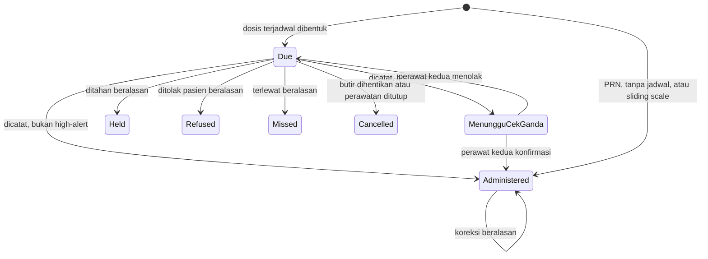

# State Transition Matrix — Sub-modul `keperawatan` (Rawat Inap)

| Field | Nilai |
| --- | --- |
| Blueprint ID | `RWI-BP-001` |
| Sub-modul | `keperawatan` — bentuk `COMPOSITE`, `RWI-DEC-082` |
| Contract version | **`0.5.0`** — bagian 5, `draft` |
| `last_changed_in` | **`0.5.0`** — bagian 5: versi konfigurasi klinis, Evaluasi Awal, entri terukur, dosis MAR, pelaksanaan sliding scale. Sebelumnya `0.4.0` — bagian 3A |
| Compatibility impact | `0.3.0`: status **`Amended` dicabut** dari mesin pengkajian dan mesin catatan tindakan. Koreksi kini dipegang mesin addendum `MedicalRecordManagement`, sejalan `RWI-DEC-091`. Mesin butir rencana asuhan **tidak berubah**. Nol nilai status baru, nol enum baru |
| Status | **`draft`** untuk `0.5.0`. `0.4.0` **`approved`** — disetujui **Muhammad Hamzah** 2026-09-11 lewat `RWI-DEC-105` |
| Owner | Product/Domain: **Muhammad Hamzah** (`RWI-DEC-061`); pemilik tabel: `ClinicalManagement` (`RWI-DEC-081`) |
| `approved_by` / `approved_at` | — belum |
| `input_revision` | `02-backend-architecture.md` `0.3`; `PRD-RWI-FINAL-001` v1.0.0; decision log `13` |
| Keputusan yang mengikat | `RWI-DEC-091` (koreksi dibedakan dari perkembangan), `RWI-DEC-086`, `RWI-DEC-087`, `RWI-FACT-016` |
| Tanggal | 2 September 2026 |

---

## 0. Tiga mesin status, dan satu yang **bukan** milik sub-modul ini

| Mesin status | Milik | Dibahas di sini |
| --- | --- | --- |
| Pengkajian keperawatan | `ClinicalManagement` | Ya |
| Butir rencana asuhan | `ClinicalManagement` | Ya |
| Catatan tindakan keperawatan | `ClinicalManagement` | Ya |
| **Status episode** | `episode-rawat-inap` | **Tidak.** `RWI-DEC-009` mengunci lima nilainya, dan `AC-CAP012-03` melarang menambahnya |
| **Keutuhan dan koreksi dokumen** | **`MedicalRecordManagement`** | **Tidak.** Mesinnya sudah ada dan dipakai apa adanya sejak `RWI-DEC-091`; sub-modul ini **tidak** membuat mesin koreksi tandingan |

Kosakata ketiga mesin di bawah **tidak beririsan** dengan kosakata status episode. Itulah salah
satu alasan sub-modul ini lolos uji pemecahan.

> **Perubahan terbesar `0.3.0`.** Sampai `0.2.0`, dua dari tiga mesin di bawah punya status `Amended`
> sendiri beserta salinan versi. `RWI-DEC-091` mencabutnya: **koreksi** dokumen keperawatan kini memakai
> mesin addendum milik `MedicalRecordManagement`, sama seperti dokumen dokter, sehingga satu lembar
> catatan terpadu tidak memuat dua bentuk koreksi.
>
> Yang **tidak** ikut berubah adalah butir rencana asuhan. Perubahan rencana asuhan bukan pembetulan
> kesalahan melainkan perkembangan klinis — `PRD-RWI-FINAL-001` `CAP-013` aturan 5 menyebutnya
> "diperbarui berdasarkan Reassessment dengan history". Menyeretnya ke mesin addendum akan mengaburkan
> perbedaan antara *pasien membaik* dan *perawat salah tulis*.

---

## 1. Pengkajian keperawatan

| Dari status | Tindakan | Ke status | Siapa yang boleh | Syarat | Bila dilanggar |
| --- | --- | --- | --- | --- | --- |
| *(tidak ada baris)* | Membuat pengkajian | `Draft` | Perawat penanggung jawab, kepala ruangan | Episode berstatus `Admitted` | `422` — episode belum menerima pasien |
| `Draft` | Menyimpan sebagian | `InProgress` | Penulisnya | — | — |
| `Draft` / `InProgress` | Menyelesaikan | `Completed` | Penulisnya, kepala ruangan | Isian wajib terisi | `400` |
| `Draft` / `InProgress` | Membatalkan | `Cancelled` | Penulisnya, kepala ruangan | Alasan wajib diisi | `400` |
| `Completed` | **Mengoreksi** | **Tetap `Completed`** | Penulisnya, kepala ruangan | Alasan koreksi wajib; **addendum bernomor urut** tersimpan pada mesin keutuhan; isi asli **tidak berubah sedikit pun** | `400` bila alasan kosong; `403` bagi selain keduanya |
| `Completed` | Mengoreksi lagi | **Tetap `Completed`** | Sama | Setiap koreksi menambah satu addendum bernomor, bukan satu versi dokumen | — |

### 1.1 Transisi yang **tidak sah**

| Dari | Ke | Kenapa dilarang |
| --- | --- | --- |
| `Completed` | `Draft` atau `InProgress` | Membuka kembali pengkajian final akan menghapus jejak bahwa ia pernah final. Yang benar adalah **koreksi lewat addendum** |
| `Completed` | `Amended` | **Status `Amended` sudah tidak ada sejak `0.3.0`.** Menambahkannya kembali membuat dua sumber jawaban atas pertanyaan "apakah dokumen ini pernah dikoreksi": status dokumen dan riwayat addendum. Yang berlaku adalah riwayat addendum |
| `Draft` / `InProgress` | Menerima addendum | Dokumen yang belum final **ditolak** mesin koreksi, dengan arahan membetulkan langsung pada isinya — `RWI-FACT-013` |
| `Cancelled` | Status apa pun | Pembatalan bersifat akhir. Yang dibutuhkan adalah pengkajian baru, bukan menghidupkan yang dibatalkan |
| Apa pun | Terhapus dari database | `CAP-012` aturan 12 melarang hard-delete pengkajian final |
| Apa pun | Status baru mana pun saat episode `Closed` | `INV-KEP-02`. Episode tertutup membuat dokumentasinya hanya-baca |

> **`NotStarted` tidak ada di tabel ini, dan itu disengaja.** "Belum dikaji" berarti tidak ada
> barisnya sama sekali. Lihat `02-backend-architecture.md` bagian 9.

---

## 2. Butir rencana asuhan keperawatan

| Dari status | Tindakan | Ke status | Siapa yang boleh | Syarat | Bila dilanggar |
| --- | --- | --- | --- | --- | --- |
| *(tidak ada baris)* | Menambah masalah keperawatan | `Active` | Perawat penanggung jawab, kepala ruangan | Episode `Admitted` | `422` |
| `Active` | Memperbarui tujuan atau rencana | `Active` | Sama | **Versi lama tersalin lebih dulu** | `409` bila penyalinan gagal |
| `Active` | Mencatat evaluasi | `Active` | Sama | — | — |
| `Active` | Menyatakan tercapai | `Resolved` | Sama | Sekurang-kurangnya satu evaluasi tercatat | `400` |
| `Active` | Menutup karena tidak lagi relevan | `Discontinued` | Sama | Alasan wajib | `400` |
| `Resolved` / `Discontinued` | Membuka kembali | `Active` | Kepala ruangan | Alasan wajib | `403` bila bukan kepala ruangan |

> **Mesin ini sengaja tidak diubah `0.3.0`.** Baris "Memperbarui tujuan atau rencana" tetap menyalin versi lama,
> dan itu **bukan** koreksi kesalahan. Rencana asuhan memang berubah ketika keadaan pasien berubah, dan
> `AC-CAP013-02` menuntut versi sebelumnya tetap menyimpan **penulis dan waktu aslinya** — bukan penulis
> yang mengubah. Menggantinya dengan addendum akan menghilangkan justru sifat itu.

### 2.1 Transisi yang **tidak sah**

| Dari | Ke | Kenapa dilarang |
| --- | --- | --- |
| Apa pun | Terhapus | `CAP-013` aturan 6: menutup butir tidak boleh menghapus tindakan dan evaluasi sebelumnya |
| `Active` | `Resolved` tanpa evaluasi | Menyatakan masalah teratasi tanpa satu pun evaluasi membuat rekam medis tidak dapat menunjukkan dasarnya |

---

## 3. Catatan tindakan keperawatan

| Dari status | Tindakan | Ke status | Siapa yang boleh | Syarat | Bila dilanggar |
| --- | --- | --- | --- | --- | --- |
| *(tidak ada baris)* | Mencatat tindakan | `Recorded` | Perawat mana pun yang bertugas di unit | Episode `Admitted`; waktu tindakan tidak di masa depan | `400` / `422` |
| `Recorded` | Menyunting | `Recorded` | **Penulisnya saja** | Belum final | `403` bila bukan penulisnya |
| `Recorded` | Menyatakan final | `Finalized` | Penulisnya, kepala ruangan | **Perpindahan ini sekaligus mendaftarkan catatan ke mesin keutuhan sebagai tertanda tangan, dalam transaksi yang sama** | Bila pendaftaran gagal, finalisasi ikut batal |
| `Finalized` | **Mengoreksi** | **Tetap `Finalized`** | Penulisnya, kepala ruangan | Alasan koreksi wajib; addendum bernomor urut tersimpan; isi asli tidak berubah | `403` bagi selain keduanya — `AC-CAP014-03` |

### 3.1 Status pengiriman tagihan — mesin **terpisah**

`AC-CAP014-02` menuntut catatan klinis tetap tersimpan walaupun pengiriman ke Billing gagal.
Karena itu status tagihan **bukan** status catatan.

| Dari | Tindakan | Ke | Keterangan |
| --- | --- | --- | --- |
| `NotApplicable` | — | — | Tindakan yang tidak dapat ditagih |
| `Pending` | Kirim ke Billing | `Dispatched` | Memakai kunci idempotency |
| `Pending` | Pengiriman gagal | `Failed` | **Catatan klinisnya tetap `Recorded`/`Finalized`** |
| `Failed` | Coba lagi | `Dispatched` atau `Failed` | Percobaan ulang tidak mengubah catatan klinis |

> **Ini pemisahan yang paling penting pada dokumen ini.** Kegagalan sistem tagihan **tidak boleh**
> membuat tindakan yang benar-benar dilakukan perawat hilang dari rekam medis.

---

## 3A. Penutupan jalur hapus tanda vital — `0.4.0`

**Bagian baru 11 September 2026**, menyerap `RWI-DEC-098`. Tanda vital **bukan** mesin status milik
sub-modul ini; tabelnya dimiliki `ClinicalManagement`. Bagian ini ada karena tanda vital dicatat
perawat dan dibaca ruang kerja keperawatan, sehingga perubahannya menyentuh alur kerja di sini.

### 3A.1 Keadaan yang dicabut

| Keadaan | Cara mencapainya sebelum `0.4.0` | Ketetapan `0.4.0` |
| --- | --- | --- |
| **Terhapus** | `DELETE /patient-vital-signs/{id}` mengubah `IsDelete` menjadi benar, `IsActive` menjadi salah, **dan `NeedDoctorNotification` menjadi salah** | **Dicabut.** Route tidak tersedia; jawabannya `404` |

Perhatikan bagian ketiga. Penghapusan tanda vital ikut mematikan penanda pemberitahuan ke dokter,
sehingga nilai kritis yang sudah tercatat dapat hilang **beserta** kewajiban memberitahukannya,
dalam satu panggilan, tanpa alasan tersimpan.

### 3A.2 Kenapa tanda vital berbeda dari dokumen lain

Tanda vital adalah deret waktu, bukan dokumen tunggal. Menghapus satu baris tidak menyisakan lubang
yang terlihat: grafik tetap tersambung dan tetap tampak wajar. Pembaca berikutnya tidak punya cara
mengetahui bahwa pernah ada pengukuran di antara dua titik yang ia lihat.

Dokumen naratif seperti catatan terpadu berbeda. Hilangnya satu catatan meninggalkan jeda waktu
yang dapat dipertanyakan orang.

### 3A.3 Satu prasyarat yang belum terpenuhi

`ClinicalDocumentKind.VitalSign` bernomor `6`, tetapi **belum termasuk** jenis yang ditegakkan mesin
keutuhan dokumen. Yang ditegakkan hari ini hanya `ProgressNote`, `Consultation`, `Assessment`, dan
`Procedure`.

| Keadaan | Akibatnya bagi jalur pengganti |
| --- | --- |
| `VitalSign` belum dinaikkan | Pembatalan beralasan **belum dapat** memeriksa apakah dokumen sudah final. Penutupan `DELETE` tetap menghilangkan cara menyembunyikan catatan, tetapi penggantinya belum utuh |
| `VitalSign` kelak dinaikkan | Jalur pembatalan memeriksa keutuhan seperti catatan terpadu, dan koreksi dokumen final berpindah ke addendum |

Keputusan menaikkannya milik pemilik `MedicalRecordManagement`, dilacak `V2-UNK-01` pada
[`../../01-existing-capability-map.md`](../../01-existing-capability-map.md) bagian 16.5. Ia
**tidak** memblokir penutupan `DELETE`, tetapi **memblokir** pernyataan bahwa penggantinya sudah
lengkap.

---
## 4. Satu syarat teknis yang wajib dibaca sebelum dibangun

`RWI-DEC-091` memakai mesin keutuhan dokumen milik `MedicalRecordManagement`. Pembacaan source
2026-09-02 (`RWI-FACT-016`) menemukan mesinnya **sudah ada, sudah dipakai, dan sudah menyediakan
nomor** bagi jenis dokumen yang dibutuhkan — tetapi **belum menegakkannya**.

| Hal | Keadaannya |
| --- | --- |
| Nilai enum yang dibutuhkan | `Assessment` untuk pengkajian, `Procedure` untuk catatan tindakan. **Keduanya sudah ada** pada `ClinicalDocumentKind`; **nol nilai enum baru** |
| Pendaftaran | `RegisterAsync` **tidak** menyaring jenis dokumen, sehingga pendaftaran pengkajian dan tindakan sudah dapat dilakukan hari ini |
| Penegakan | `EnsureMutableAsync` **membiarkan lewat** jenis yang belum ditegakkan. Daftar yang ditegakkan hari ini hanya berisi `ProgressNote`, sesuai `RM-DEC-019` |
| Akibatnya bila dibangun apa adanya | Pengkajian dan tindakan **terdaftar** tetapi **tidak terkunci**. Dokumen final masih dapat disunting, dan seluruh mesin status di atas kehilangan penjaganya |
| Yang diminta | Menambahkan `Assessment` dan `Procedure` ke daftar jenis yang ditegakkan — perubahan kecil, tetapi **milik `MedicalRecordManagement`** dan diatur `RM-DEC-019` |
| Statusnya | **`RWI-OQ-051`, terbuka.** Tidak memblokir desain; **memblokir implementasi** `BE-RWI-057` dan `BE-RWI-062` |

> **Jangan menyiasatinya dengan penjaga sendiri.** Membuat pemeriksaan penguncian di dalam
> `ClinicalManagement` akan melahirkan mesin koreksi tandingan — persis yang dilarang
> `RWI-DEC-087` dan yang baru saja dihindari `RWI-DEC-091`. Bila `RWI-OQ-051` ditolak, yang benar
> adalah kembali ke `/qv-grill`, bukan membangun penjaga kedua.

> **Catatan untuk pembaca `RM-FE-009`.** Selama jenis dokumen keperawatan belum ditegakkan, keadaan
> itu **wajib dinyatakan terbuka di layar**, bukan didiamkan — aturan itu berasal dari
> `MedicalRecordManagement` sendiri dan berlaku sama bagi sub-modul ini.

---

## 5. Perubahan pada `contract_version` `0.5.0` — penyelarasan `PRD-RWI-V2-001` ★ 15 September 2026

**Status `draft`.** Tujuh mesin status baru atau diperluas. Mesin order sliding scale dan penghentian butir resep
**bukan** milik sub-modul ini — keduanya di `../../dokter-rawat-inap/contracts/state-transition-matrix.md` bagian 8.

### 5.1 Versi konfigurasi klinis — `ClinicalInstrumentVersionStatus`

| Dari status | Tindakan | Ke status | Siapa yang boleh | Syarat | Bila dilanggar |
| --- | --- | --- | --- | --- | --- |
| *(tidak ada baris)* | Membuat versi | `Draft` | Pemegang `ClinicalInstrumentConfiguration : Update` | Definisi sah `VAL-KEP-19` | `400` |
| `Draft` | Mengubah | `Draft` | Sama | Hash sama | `409` |
| `Draft` | Mengesahkan | `Approved` | Pemegang `ClinicalInstrumentConfiguration : Approve` | Bukan pengubah terakhir `VAL-KEP-20a` | `403` |
| `Approved` | Versi lain disahkan | `Retired` | Otomatis, satu transaksi dengan pengesahan | — | — |
| `Approved` | Memensiunkan | `Retired` | Pemegang `Approve` | Alasan wajib | `400` |

| Dari | Ke | Kenapa dilarang |
| --- | --- | --- |
| `Approved` / `Retired` | `Draft` | Hasil pengkajian menyimpan versi ini; mengubahnya mengubah arti skor lama — `RWI-DEC-136` |
| `Retired` | `Approved` | Menghidupkan versi lama tanpa pengesahan baru. Yang benar: buat versi baru dari salinannya |
| Dua versi | `Approved` bersamaan | Unique parsial; formulir harus punya satu jawaban "versi mana yang berlaku" |

### 5.2 Dokumen Pengkajian Pasien V2 — mesin bagian 1 dengan dua syarat tambahan

Mesin `Draft`/`InProgress`/`Completed`/`Cancelled` dan koreksi lewat addendum **tidak berubah**. Yang bertambah:

| Transisi | Syarat baru | Bila dilanggar |
| --- | --- | --- |
| `Draft`/`InProgress` → `Completed` | Versi instrumen `Approved` di produksi; isian wajib versi itu terisi — `VAL-KEP-21a`, `21b` | `422`; dokumen tetap konsep |
| `Draft`/`InProgress` → `Completed` untuk Monitoring Nyeri | `PainAssessmentState ≠ NotAssessed` | `422` |
| `Completed` | Hasil instrumen **beku** bersama versinya; addendum tidak menghitung ulang skor | — |

Contoh: Ns. Siti menyimpan Resiko Jatuh Budi Senin 08.00 dengan versi draft (lingkungan uji) → `Draft`. Di produksi yang
sama tanpa versi sah, tombol Selesai ditolak; Selasa 10.00 versi disahkan, Siti memuat ulang formulir, jawaban dihitung
ulang dari versi sah, lalu diselesaikan.

### 5.3 Evaluasi Awal MPP — `CaseManagementEvaluationStatus`

| Dari status | Tindakan | Ke status | Siapa yang boleh | Syarat | Bila dilanggar |
| --- | --- | --- | --- | --- | --- |
| *(tidak ada baris)* | Membuat | `Draft` | MPP di unit episode | Episode `Admitted`; belum ada dokumen hidup | `403`, `409`, `422` |
| `Draft` | Menyimpan | `Draft` | Penulis konsep | — | `403` |
| `Draft` | Menyelesaikan | `Completed` | Penulis konsep | Checklist `Approved` di produksi | `422` |
| `Draft` | Membatalkan | `Cancelled` | Penulis konsep | Alasan wajib | `400` |
| `Completed` | Addendum | Tetap `Completed` | Pemegang `CaseManagementEvaluation : Amend` di unit episode | Alasan wajib; bergantung `INT-KEP-12` | `400`, `403` |

| Dari | Ke | Kenapa dilarang |
| --- | --- | --- |
| `Completed` | `Draft` | Sama dengan pengkajian — koreksi lewat addendum |
| `Cancelled` | Apa pun | Akhir; buat dokumen baru |
| Apa pun | Status baru saat episode `Closed` | `INV-KEP-02` |

### 5.4 Entri terukur — cairan, GDS bangsal, observasi harian — `ClinicalMeasurementStatus`

| Dari status | Tindakan | Ke status | Siapa yang boleh | Syarat | Bila dilanggar |
| --- | --- | --- | --- | --- | --- |
| *(tidak ada baris)* | Mencatat | `Active`, `RevisionNumber = 0` | Perawat di unit episode | `VAL-KEP-24`–`26` | `400`/`403`/`409` |
| `Active` | Mengoreksi | `Active`, `RevisionNumber + 1`; baris revisi menyimpan nilai lama | Pemegang `Update` di unit episode | Alasan; versi tidak basi | `400`/`409` |
| `Active` | Membatalkan | `Cancelled` | Pemegang `Update` di unit episode | Alasan; untuk GDS: belum dipakai pelaksanaan | `400`/`409` |

Contoh: intake infus 500 ml pukul 10.00 dikoreksi 450 ml pukul 14.30 → `RevisionNumber = 1`, revisi menyimpan 500 ml;
total 24 jam turun 50 ml. Tidak ada `Cancelled` → `Active`.

### 5.5 Dosis MAR — `MedicationDoseStatus` bersama `MedicationDoubleCheckStatus`

`MenungguCekGanda` bukan nilai `MedicationDoseStatus`; ia adalah `DoseStatus = Due` dengan `DoubleCheckStatus = Pending`.

| Dari | Tindakan | Ke | Siapa yang boleh | Syarat | Bila dilanggar |
| --- | --- | --- | --- | --- | --- |
| — | Pembentukan dosis | `Due`, `NotRequired` | Sistem — `INT-KEP-08` | Butir aktif, tidak dihentikan, berjadwal, bukan PRN, bukan sliding scale | Tidak terbentuk; pesan jadwal belum dikonfigurasi |
| `Due` | Mencatat `Administered` — obat biasa | `Administered` | Perawat unit, `MedicationAdministration : Create` | `VAL-KEP-30` | `400`/`409` |
| `Due` | Mencatat `Administered` — high-alert | `Due` + `Pending` | Sama | Sama | Sama |
| `Due` + `Pending` | Konfirmasi | `Administered` + `Confirmed` | Perawat **lain**, `MedicationAdministration : DoubleCheck` | `VAL-KEP-31a` | `403` |
| `Due` + `Pending` | Menolak | `Due` + `Rejected`; isian pemberian dikosongkan dan tersimpan pada revisi | Sama | Catatan wajib | `400` |
| `Due` + `Rejected` | Mencatat ulang | `Due` + `Pending` atau `Administered` | Perawat unit | — | — |
| `Due` | `Held`/`Refused`/`Missed` | Status itu | Perawat unit | Alasan | `400` |
| `Due` | Penghentian butir | `Cancelled` beralasan "resep dihentikan" | Sistem — `INT-DOK-16`/`INT-KEP-09` | `ScheduledAt ≥ StoppedAt` | — |
| `Due` | Penutupan episode | `Cancelled` beralasan "perawatan ditutup" | Sistem — `INT-KEP-15` | `ScheduledAt > ClosedAt` | — |
| `Administered`/`Held`/`Refused`/`Missed` | Koreksi | Status mana pun kecuali `Due`; revisi menyimpan nilai lama | `MedicationAdministration : Update` di unit episode | Alasan; `VAL-KEP-33` | `400`/`409` |

| Dari | Ke | Kenapa dilarang |
| --- | --- | --- |
| Apa pun | Terhapus | Riwayat pemberian obat adalah rekam medis |
| `Administered` | `Due` | Membuka kembali dosis membuat pemberian dapat dicatat dua kali — `INV-KEP-05` |
| `Cancelled` | Apa pun | Dosis dibatalkan sistem; pemberian di luar jadwal dicatat sebagai baris baru |
| `Due` + `Pending` | `Administered` oleh pencatat sendiri | Cek ganda kehilangan arti |
| `Due` | `Missed` otomatis oleh sistem | `AC-MVP-027`; sistem hanya menandai lewat waktu |

**Dosis `Due` yang terjadwal sebelum waktu penutupan dan belum dicatat** tetap `Due`, menjadi hanya-baca, dan tampil
"Tidak dicatat sebelum perawatan ditutup". Nasibnya pertanyaan terbuka non-blocking `04-prd-to-mvp.md` bagian 22.

### 5.6 Pelaksanaan sliding scale — `SlidingScaleExecutionStatus`

| Dari | Tindakan | Ke | Siapa yang boleh | Syarat |
| --- | --- | --- | --- | --- |
| — | Mencatat | `Recorded` | Perawat unit, `SlidingScaleExecution : Create` | `VAL-KEP-27`–`29`; satu transaksi dengan GDS dan dosis MAR |
| `Recorded` | Dosis MAR dikoreksi `Cancelled` | `Cancelled` | Mengikuti koreksi MAR | Alasan koreksi MAR |
| `Recorded` | GDS rujukan dikoreksi | Tetap `Recorded`, `ReadingCorrectedAfterExecution = true` | Mengikuti koreksi GDS | — |

Order yang disesuaikan atau dihentikan setelahnya **tidak** mengubah pelaksanaan lama — `RWI-AC-224`.

### 5.7 Mesin yang dibaca, bukan dimiliki

| Mesin | Pemilik | Yang dilarang dilakukan sub-modul ini |
| --- | --- | --- |
| `SlidingScaleOrderStatus` | `dokter-rawat-inap` | Mengubah status order dari layar perawat |
| `PhmPrescriptionItem.IsStopped` | `dokter-rawat-inap` | Menghentikan butir resep |
| `ReconciliationDecisionType` | `dokter-rawat-inap` | Mengambil keputusan per obat — `RWI-AC-192` |
| `InpEpisodeStatus` | `episode-rawat-inap` | Mengubah status episode dari dokumentasi keperawatan — `AC-CAP012-03` |
